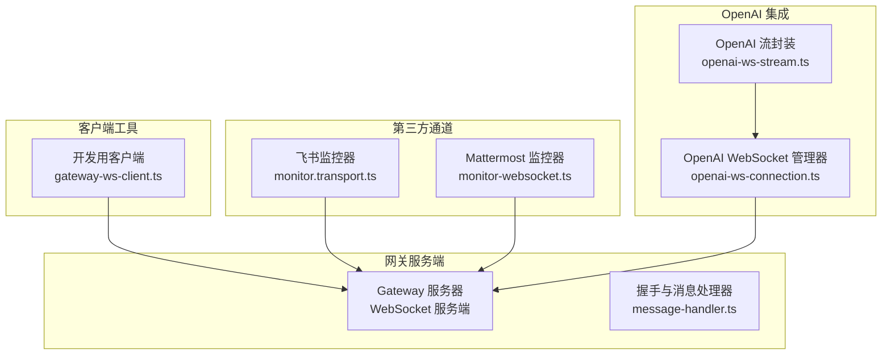
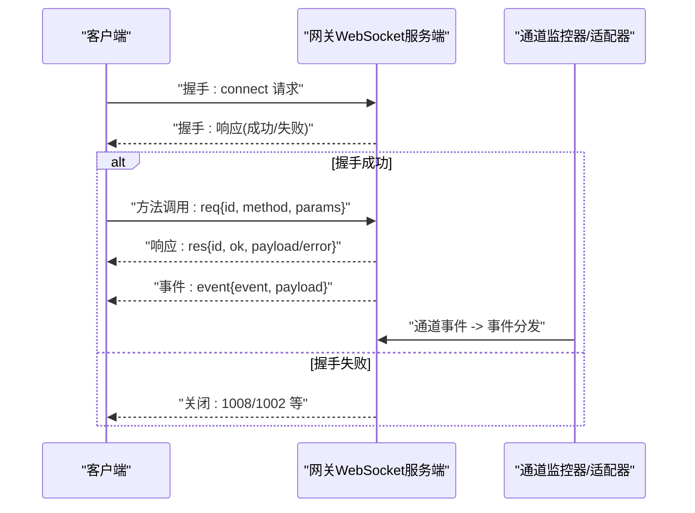
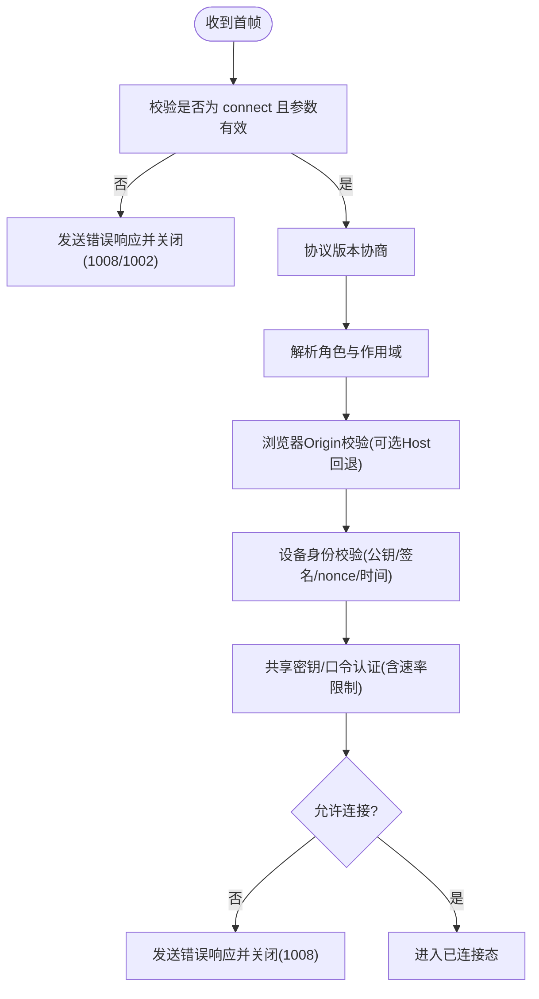
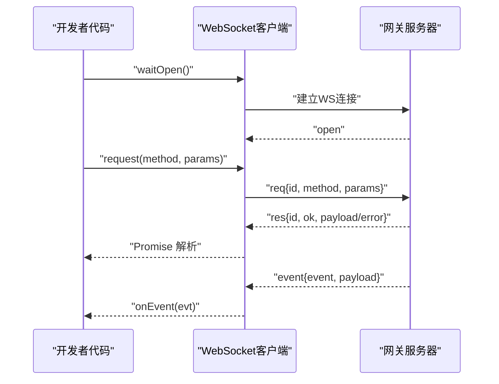
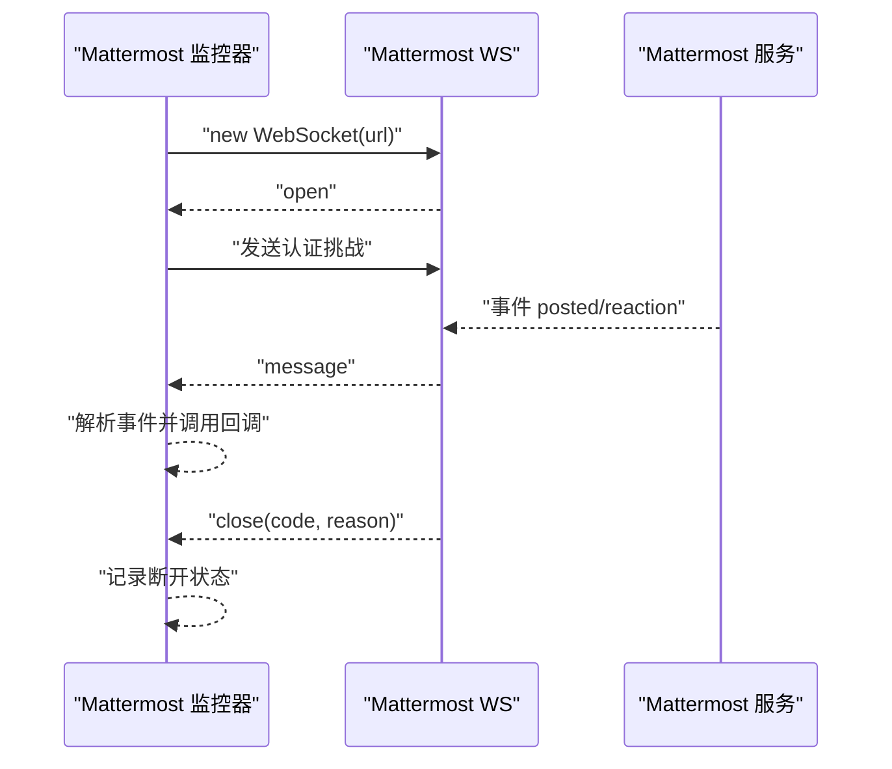
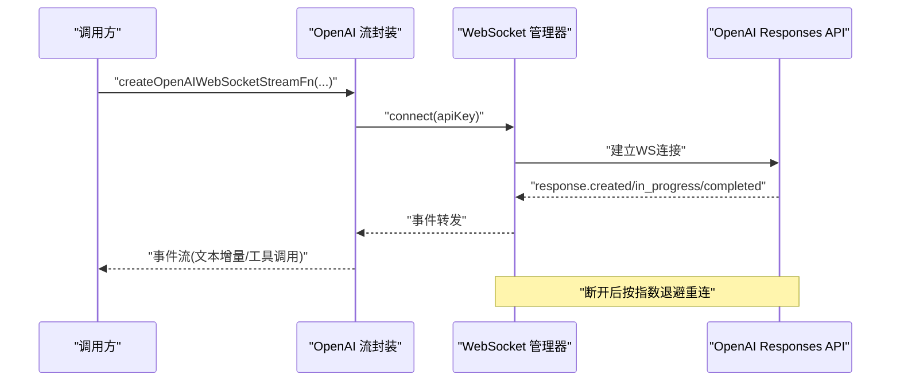
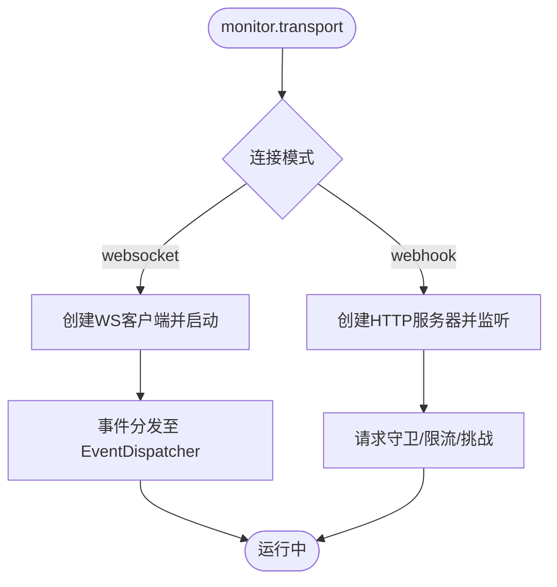
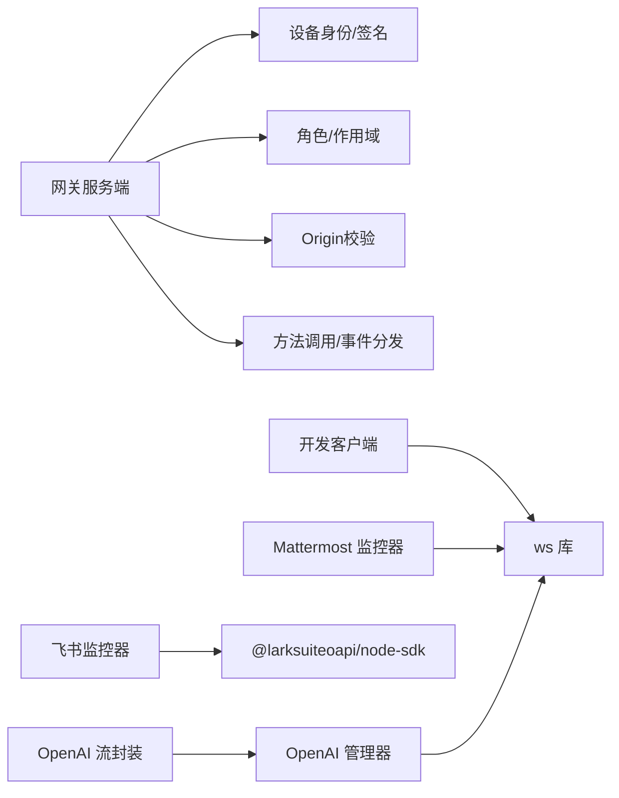

# WebSocket服务器

<cite>
**本文引用的文件**
- [gateway-ws-client.ts](file://scripts/dev/gateway-ws-client.ts)
- [openai-ws-connection.ts](file://src/agents/openai-ws-connection.ts)
- [openai-ws-stream.ts](file://src/agents/openai-ws-stream.ts)
- [monitor-websocket.ts](file://extensions/mattermost/src/mattermost/monitor-websocket.ts)
- [monitor.transport.ts](file://extensions/feishu/src/monitor.transport.ts)
- [message-handler.ts](file://src/gateway/server/ws-connection/message-handler.ts)
- [test-helpers.server.ts](file://src/gateway/test-helpers.server.ts)
</cite>

## 目录
1. [简介](#简介)
2. [项目结构](#项目结构)
3. [核心组件](#核心组件)
4. [架构总览](#架构总览)
5. [详细组件分析](#详细组件分析)
6. [依赖关系分析](#依赖关系分析)
7. [性能考量](#性能考量)
8. [故障排查指南](#故障排查指南)
9. [结论](#结论)
10. [附录](#附录)

## 简介
本文件面向OpenClaw的WebSocket服务器与客户端实现，系统性梳理了以下方面：
- 连接生命周期管理：握手、认证、状态维护、断开与重连
- 消息路由与协议：帧格式、方法调用、事件分发
- 实时通信协议：请求/响应/事件三类帧的语义与序列化
- 认证流程：设备身份、角色与作用域、Origin校验、速率限制
- 错误处理与断线重连策略：超时、异常、指数退避
- 并发控制与性能优化：会话注册、增量输入、回退到HTTP流
- 扩展与自定义：如何接入新通道或自定义消息类型

## 项目结构
OpenClaw在多处实现了WebSocket相关能力：
- 网关侧（Gateway）：WebSocket服务端，负责握手、认证、方法调用与事件广播
- 客户端工具：用于开发测试的通用WebSocket客户端
- 第三方通道示例：飞书（Webhook/WebSocket）、Mattermost（WebSocket）
- OpenAI Responses API：专用WebSocket客户端与流式封装

图表来源
- [message-handler.ts:236-800](file://src/gateway/server/ws-connection/message-handler.ts#L236-L800)
- [gateway-ws-client.ts:52-133](file://scripts/dev/gateway-ws-client.ts#L52-L133)
- [monitor.transport.ts:29-72](file://extensions/feishu/src/monitor.transport.ts#L29-L72)
- [monitor-websocket.ts:101-211](file://extensions/mattermost/src/mattermost/monitor-websocket.ts#L101-L211)
- [openai-ws-connection.ts:287-532](file://src/agents/openai-ws-connection.ts#L287-L532)
- [openai-ws-stream.ts:601-950](file://src/agents/openai-ws-stream.ts#L601-L950)

章节来源
- [message-handler.ts:236-800](file://src/gateway/server/ws-connection/message-handler.ts#L236-L800)
- [gateway-ws-client.ts:52-133](file://scripts/dev/gateway-ws-client.ts#L52-L133)
- [monitor.transport.ts:29-72](file://extensions/feishu/src/monitor.transport.ts#L29-L72)
- [monitor-websocket.ts:101-211](file://extensions/mattermost/src/mattermost/monitor-websocket.ts#L101-L211)
- [openai-ws-connection.ts:287-532](file://src/agents/openai-ws-connection.ts#L287-L532)
- [openai-ws-stream.ts:601-950](file://src/agents/openai-ws-stream.ts#L601-L950)

## 核心组件
- 网关WebSocket服务端：负责握手、认证、方法调用与事件分发
- 开发用WebSocket客户端：统一的帧格式、请求/响应/事件解析、超时与清理
- 第三方通道WebSocket客户端：以Mattermost为例，展示事件解析、认证挑战、错误处理
- OpenAI Responses API WebSocket：带指数退避的自动重连、增量上下文、回退HTTP流
- 通道监控器：将通道事件桥接到网关事件分发器

章节来源
- [message-handler.ts:236-800](file://src/gateway/server/ws-connection/message-handler.ts#L236-L800)
- [gateway-ws-client.ts:52-133](file://scripts/dev/gateway-ws-client.ts#L52-L133)
- [monitor-websocket.ts:101-211](file://extensions/mattermost/src/mattermost/monitor-websocket.ts#L101-L211)
- [openai-ws-connection.ts:287-532](file://src/agents/openai-ws-connection.ts#L287-L532)
- [openai-ws-stream.ts:601-950](file://src/agents/openai-ws-stream.ts#L601-L950)

## 架构总览
下图展示了从客户端到网关再到第三方通道的整体交互路径。

图表来源
- [message-handler.ts:363-430](file://src/gateway/server/ws-connection/message-handler.ts#L363-L430)
- [gateway-ws-client.ts:68-94](file://scripts/dev/gateway-ws-client.ts#L68-L94)

章节来源
- [message-handler.ts:363-430](file://src/gateway/server/ws-connection/message-handler.ts#L363-L430)
- [gateway-ws-client.ts:68-94](file://scripts/dev/gateway-ws-client.ts#L68-L94)

## 详细组件分析

### 组件A：网关WebSocket服务端（握手与消息处理）
- 职责
  - 解析首帧“connect”，进行协议版本协商、角色与作用域解析、Origin校验
  - 设备身份校验：公钥派生、签名验证、nonce匹配、时间偏差容忍
  - 共享密钥/口令认证：令牌/口令校验与速率限制
  - 方法调用与事件分发：对“req”帧执行处理并返回“res”，对事件推送“event”
  - 断开原因记录与关闭码选择
- 关键点
  - 首帧必须是“connect”，否则视为无效握手并关闭
  - 协议不兼容时返回1002并关闭
  - Origin检查可接受Host头回退（受配置开关控制），并记录安全指标
  - 设备签名过期或不匹配时拒绝
  - 未绑定作用域且无设备身份时清空作用域，避免自声明权限
- 错误处理
  - 无效请求帧、角色非法、Origin不允许、设备身份缺失/不合法、认证失败等均发送错误响应并关闭

图表来源
- [message-handler.ts:396-774](file://src/gateway/server/ws-connection/message-handler.ts#L396-L774)

章节来源
- [message-handler.ts:363-774](file://src/gateway/server/ws-connection/message-handler.ts#L363-L774)

### 组件B：开发用WebSocket客户端（通用帧格式与请求/响应/事件）
- 职责
  - 统一的帧类型：req、res、event
  - 请求超时与挂起队列管理
  - 文本化数据转换（支持多种原始数据类型）
  - 打开超时与错误处理
  - 生命周期：等待打开、发送请求、接收事件、关闭清理
- 关键点
  - 使用UUID生成请求ID，响应通过ID匹配
  - 支持自定义握手超时与打开超时
  - 对非JSON或缺少type字段的消息直接忽略
- 使用建议
  - 在业务层订阅事件回调，处理“event”帧
  - 对“res”帧中的error字段进行业务判断

图表来源
- [gateway-ws-client.ts:52-133](file://scripts/dev/gateway-ws-client.ts#L52-L133)

章节来源
- [gateway-ws-client.ts:52-133](file://scripts/dev/gateway-ws-client.ts#L52-L133)

### 组件C：第三方通道WebSocket客户端（以Mattermost为例）
- 职责
  - 建立一次性WebSocket连接，发送认证挑战
  - 解析“posted/reaction”等事件，分发到业务处理器
  - 处理关闭前关闭错误，上报状态与最后错误
- 关键点
  - 使用工厂函数注入WebSocket实例，便于测试替换
  - 对消息体进行字符串化与JSON解析，过滤无效事件
  - 提供“reaction”事件处理钩子

图表来源
- [monitor-websocket.ts:101-211](file://extensions/mattermost/src/mattermost/monitor-websocket.ts#L101-L211)

章节来源
- [monitor-websocket.ts:101-211](file://extensions/mattermost/src/mattermost/monitor-websocket.ts#L101-L211)

### 组件D：OpenAI Responses API WebSocket（自动重连与增量上下文）
- 职责
  - 管理持久连接，指数退避重连（最多5次）
  - 跟踪上一次完成响应ID，后续请求使用previous_response_id实现增量
  - 温启动（generate:false）预热连接
  - 将事件流转换为助手消息，支持文本增量与工具调用
  - 断开或发送失败时回退到HTTP流
- 关键点
  - 事件类型丰富，覆盖response.*、content_part.*、function_call_arguments.*
  - 会话级注册表：sessionId -> manager，支持释放与清理
  - 增量输入：仅发送新增的toolResult，避免重复传输

图表来源
- [openai-ws-connection.ts:287-532](file://src/agents/openai-ws-connection.ts#L287-L532)
- [openai-ws-stream.ts:601-950](file://src/agents/openai-ws-stream.ts#L601-L950)

章节来源
- [openai-ws-connection.ts:287-532](file://src/agents/openai-ws-connection.ts#L287-L532)
- [openai-ws-stream.ts:601-950](file://src/agents/openai-ws-stream.ts#L601-L950)

### 组件E：通道监控器（飞书）
- 职责
  - 启动WebSocket客户端，将事件分发给Lark EventDispatcher
  - 提供Webhook模式作为替代方案
  - 管理资源：HTTP服务器、WS客户端、机器人信息缓存
- 关键点
  - WebSocket模式：创建客户端并启动，记录日志与清理
  - Webhook模式：基于HTTP服务器，安装请求守卫与限流

图表来源
- [monitor.transport.ts:29-167](file://extensions/feishu/src/monitor.transport.ts#L29-L167)

章节来源
- [monitor.transport.ts:29-167](file://extensions/feishu/src/monitor.transport.ts#L29-L167)

## 依赖关系分析
- 网关服务端依赖
  - 设备身份与签名验证模块
  - 角色与作用域解析
  - Origin校验与代理地址解析
  - 方法调用与事件分发
- 客户端工具依赖
  - ws库、UUID生成、超时控制
- 第三方通道
  - Mattermost：ws库、事件解析、工厂注入
  - 飞书：@larksuiteoapi/node-sdk、HTTP服务器、限流与守卫
- OpenAI集成
  - ws库、事件类型定义、回退HTTP流

图表来源
- [message-handler.ts:1-120](file://src/gateway/server/ws-connection/message-handler.ts#L1-L120)
- [gateway-ws-client.ts:1-50](file://scripts/dev/gateway-ws-client.ts#L1-L50)
- [monitor-websocket.ts:1-35](file://extensions/mattermost/src/mattermost/monitor-websocket.ts#L1-L35)
- [monitor.transport.ts:1-20](file://extensions/feishu/src/monitor.transport.ts#L1-L20)
- [openai-ws-connection.ts:16-20](file://src/agents/openai-ws-connection.ts#L16-L20)

章节来源
- [message-handler.ts:1-120](file://src/gateway/server/ws-connection/message-handler.ts#L1-L120)
- [gateway-ws-client.ts:1-50](file://scripts/dev/gateway-ws-client.ts#L1-L50)
- [monitor-websocket.ts:1-35](file://extensions/mattermost/src/mattermost/monitor-websocket.ts#L1-L35)
- [monitor.transport.ts:1-20](file://extensions/feishu/src/monitor.transport.ts#L1-L20)
- [openai-ws-connection.ts:16-20](file://src/agents/openai-ws-connection.ts#L16-L20)

## 性能考量
- 连接复用与会话注册
  - OpenAI流封装为每个sessionId维护一个OpenAIWebSocketManager，避免重复握手
  - 会话注册表在完成后释放，防止内存泄漏
- 增量上下文
  - 仅发送新增的toolResult，减少传输与解析成本
- 回退策略
  - WebSocket不可用或发送失败时回退到HTTP流，保证可用性
- 资源管理
  - 客户端在关闭时清理挂起请求与定时器
  - 网关侧对未授权连接设置洪水防护与速率限制

章节来源
- [openai-ws-stream.ts:68-97](file://src/agents/openai-ws-stream.ts#L68-L97)
- [openai-ws-stream.ts:719-746](file://src/agents/openai-ws-stream.ts#L719-L746)
- [gateway-ws-client.ts:123-131](file://scripts/dev/gateway-ws-client.ts#L123-L131)
- [message-handler.ts:348-349](file://src/gateway/server/ws-connection/message-handler.ts#L348-L349)

## 故障排查指南
- 握手失败
  - 首帧不是connect或参数无效：检查客户端是否按协议发送connect
  - 协议版本不兼容：确保客户端最小/最大协议范围与服务端一致
  - 角色非法：确认connect参数中的role合法
  - Origin不允许：检查gateway.controlUi.allowedOrigins与Host头回退开关
  - 设备身份缺失/不合法：确认设备公钥、签名、nonce与时间戳
  - 认证失败：核对令牌/口令配置与速率限制
- 连接断开
  - 客户端：使用等待打开超时与错误回调定位问题
  - 服务端：查看断开原因与关闭码，结合日志定位
- 事件未达
  - 确认事件分发器已正确注册
  - 检查通道客户端是否正确解析并转发事件
- 重连与退避
  - OpenAI管理器默认最多5次指数退避；如仍失败，检查网络与上游API状态

章节来源
- [message-handler.ts:402-433](file://src/gateway/server/ws-connection/message-handler.ts#L402-L433)
- [message-handler.ts:462-478](file://src/gateway/server/ws-connection/message-handler.ts#L462-L478)
- [gateway-ws-client.ts:80-94](file://scripts/dev/gateway-ws-client.ts#L80-L94)
- [openai-ws-connection.ts:433-458](file://src/agents/openai-ws-connection.ts#L433-L458)

## 结论
OpenClaw的WebSocket体系以网关服务端为核心，围绕握手、认证、方法调用与事件分发构建了稳定可靠的实时通信基础。通过客户端工具、第三方通道适配器与OpenAI集成，系统实现了高可用、可扩展与可观测的WebSocket生态。建议在生产部署中：
- 明确Origin白名单与Host头回退策略
- 合理配置认证与速率限制
- 利用会话注册与增量上下文提升性能
- 在关键路径保留回退到HTTP流的能力

## 附录

### WebSocket API 规范（通用）
- 帧类型
  - req：请求，包含id、method、params
  - res：响应，包含id、ok、payload或error
  - event：事件，包含event与payload
- 连接建立
  - 客户端需先发送connect请求，携带协议版本、角色、作用域、设备身份与认证信息
  - 服务端验证通过后进入已连接态，否则发送错误响应并关闭
- 消息传递
  - 请求/响应：一对一匹配，使用UUID id
  - 事件：服务端主动推送
- 错误处理
  - 无效请求帧、协议不兼容、角色非法、Origin不允许、设备身份缺失/不合法、认证失败等
- 断线重连
  - 客户端/服务端根据场景采用指数退避或立即重试策略

章节来源
- [gateway-ws-client.ts:4-17](file://scripts/dev/gateway-ws-client.ts#L4-L17)
- [message-handler.ts:396-433](file://src/gateway/server/ws-connection/message-handler.ts#L396-L433)

### OpenAI WebSocket API 规范
- 连接管理
  - 管理器负责连接、发送、事件监听与自动重连
  - 支持温启动（generate:false）与增量上下文（previous_response_id）
- 事件类型
  - response.created/completed/failed/in_progress
  - content_part.added/done、output_text.delta/done
  - function_call_arguments.delta/done
  - rate_limits.updated、error
- 回退策略
  - 连接失败或发送失败时回退到HTTP流

章节来源
- [openai-ws-connection.ts:163-177](file://src/agents/openai-ws-connection.ts#L163-L177)
- [openai-ws-stream.ts:588-600](file://src/agents/openai-ws-stream.ts#L588-L600)

### 连接池与并发控制最佳实践
- 会话隔离
  - 以sessionId为键的会话注册表，避免跨会话状态污染
- 资源释放
  - 会话结束时关闭连接并删除注册项
- 并发请求
  - 使用请求ID映射挂起队列，避免竞态
- 超时与清理
  - 所有异步操作设置超时，清理定时器与事件监听

章节来源
- [openai-ws-stream.ts:68-97](file://src/agents/openai-ws-stream.ts#L68-L97)
- [gateway-ws-client.ts:58-78](file://scripts/dev/gateway-ws-client.ts#L58-L78)
- [gateway-ws-client.ts:123-131](file://scripts/dev/gateway-ws-client.ts#L123-L131)

### 断线重连策略
- 网关侧
  - 客户端等待打开与消息处理均设置超时
- OpenAI侧
  - 最大重连次数与指数退避延迟可配置
  - 断开时清理挂起请求，必要时回退HTTP流

章节来源
- [test-helpers.server.ts:342-366](file://src/gateway/test-helpers.server.ts#L342-L366)
- [openai-ws-connection.ts:433-458](file://src/agents/openai-ws-connection.ts#L433-L458)

### 扩展与自定义消息类型
- 新增通道
  - 参考Mattermost监控器：实现WebSocket工厂、事件解析与回调分发
  - 参考飞书监控器：实现WebSocket或Webhook两种模式
- 自定义消息
  - 在客户端侧扩展帧类型与解析逻辑
  - 在服务端侧注册方法处理器与事件分发器

章节来源
- [monitor-websocket.ts:57-60](file://extensions/mattermost/src/mattermost/monitor-websocket.ts#L57-L60)
- [monitor.transport.ts:29-72](file://extensions/feishu/src/monitor.transport.ts#L29-L72)
- [gateway-ws-client.ts:10-17](file://scripts/dev/gateway-ws-client.ts#L10-L17)