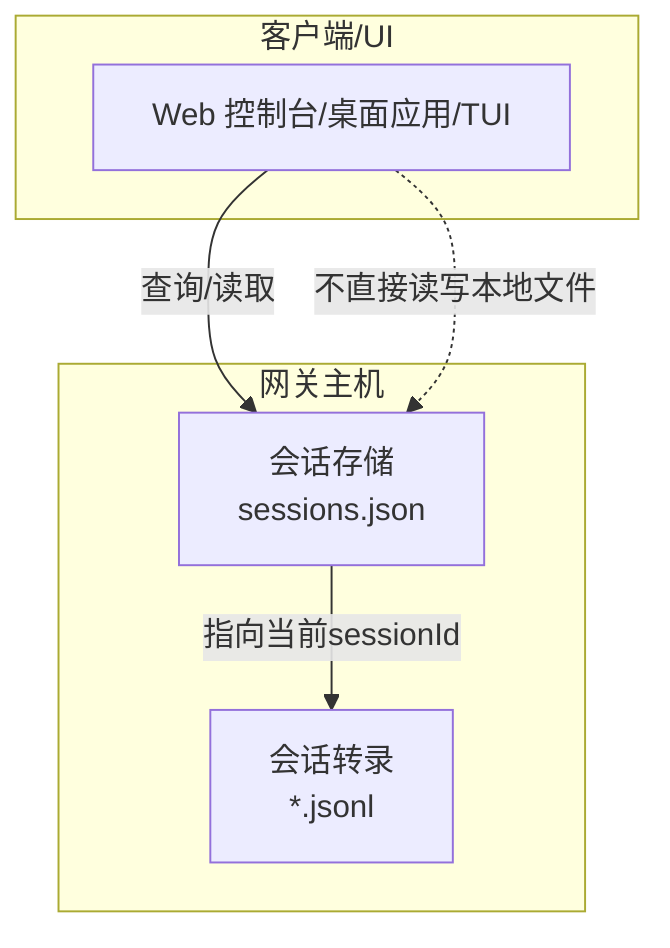
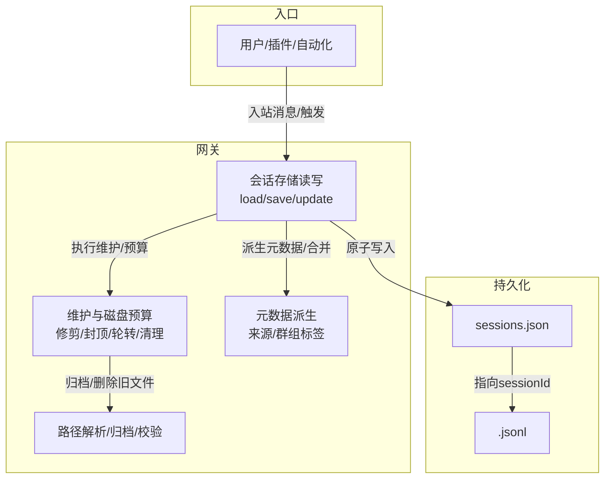
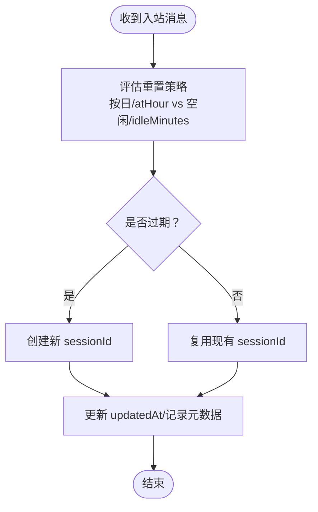
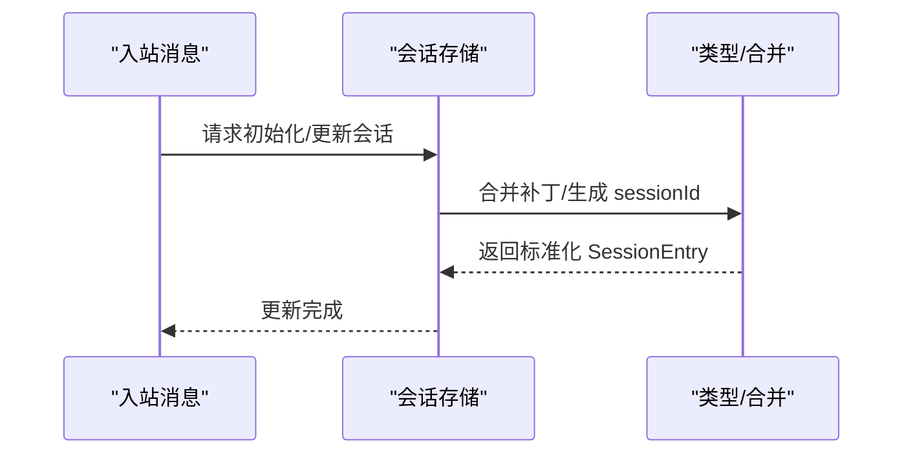
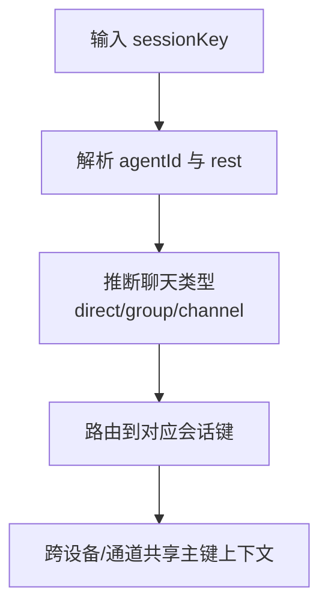
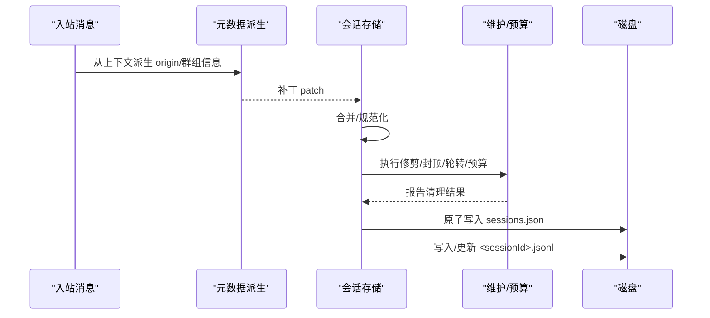
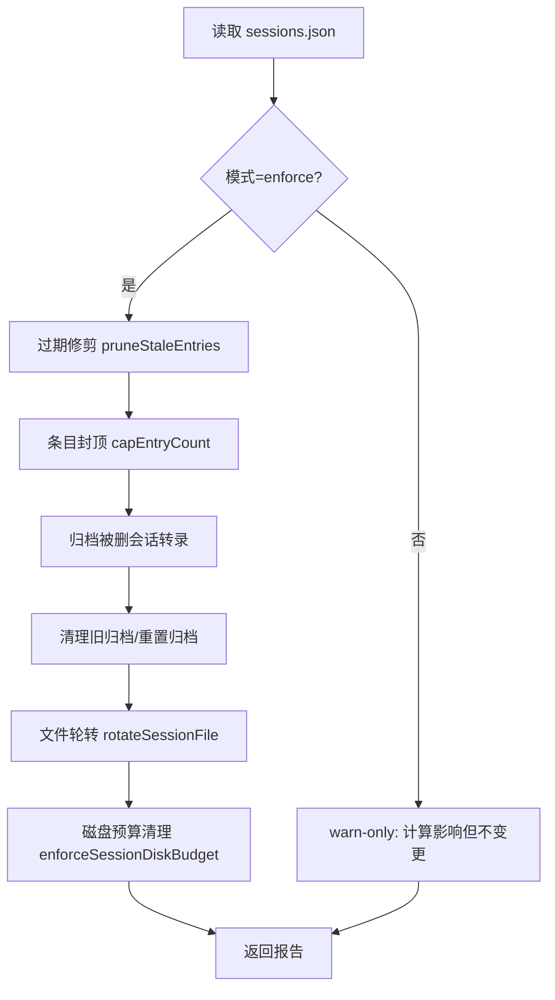
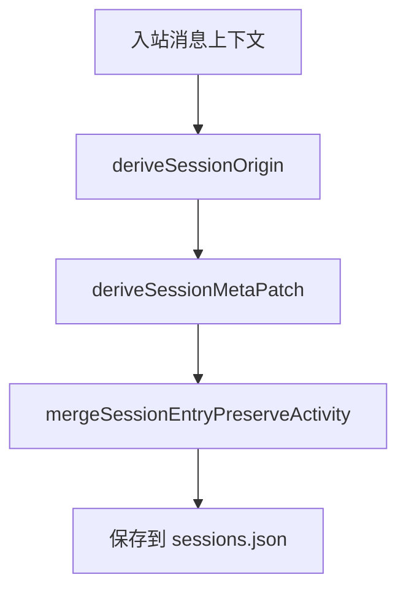
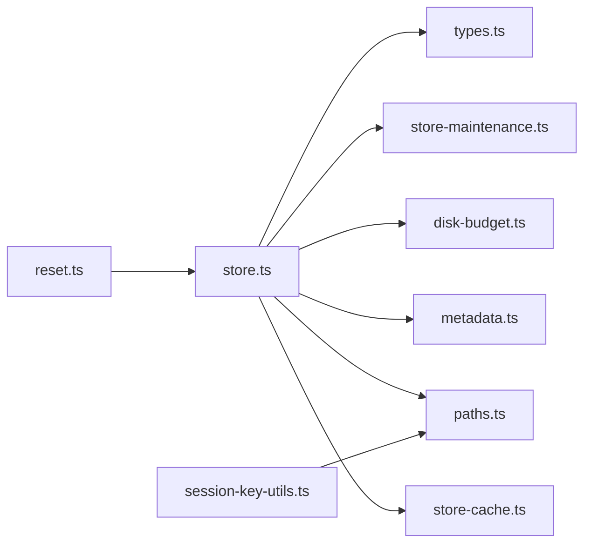

# 会话管理系统

<cite>
**本文引用的文件**
- [docs/concepts/session.md](file://docs/concepts/session.md)
- [docs/cli/sessions.md](file://docs/cli/sessions.md)
- [docs/reference/session-management-compaction.md](file://docs/reference/session-management-compaction.md)
- [src/config/sessions/types.ts](file://src/config/sessions/types.ts)
- [src/config/sessions/store.ts](file://src/config/sessions/store.ts)
- [src/config/sessions/store-cache.ts](file://src/config/sessions/store-cache.ts)
- [src/config/sessions/store-maintenance.ts](file://src/config/sessions/store-maintenance.ts)
- [src/config/sessions/disk-budget.ts](file://src/config/sessions/disk-budget.ts)
- [src/config/sessions/metadata.ts](file://src/config/sessions/metadata.ts)
- [src/config/sessions/artifacts.ts](file://src/config/sessions/artifacts.ts)
- [src/config/sessions/paths.ts](file://src/config/sessions/paths.ts)
- [src/sessions/session-id.ts](file://src/sessions/session-id.ts)
- [src/sessions/session-key-utils.ts](file://src/sessions/session-key-utils.ts)
- [src/web/auto-reply/heartbeat-runner.ts](file://src/web/auto-reply/heartbeat-runner.ts)
- [src/config/sessions/reset.ts](file://src/config/sessions/reset.ts)
</cite>

## 目录
1. [简介](#简介)
2. [项目结构](#项目结构)
3. [核心组件](#核心组件)
4. [架构总览](#架构总览)
5. [详细组件分析](#详细组件分析)
6. [依赖关系分析](#依赖关系分析)
7. [性能考量](#性能考量)
8. [故障排查指南](#故障排查指南)
9. [结论](#结论)
10. [附录](#附录)

## 简介
本技术文档围绕 OpenClaw 的会话管理系统，系统性阐述会话生命周期管理、状态跟踪与持久化机制，覆盖会话标识符生成与校验、会话键解析与路由、多设备同步与一致性保障、会话超时与自动清理、磁盘预算与归档策略、监控与诊断工具，以及安全性与隐私保护要点。文档同时提供面向开发者的扩展与自定义实践建议。

## 项目结构
OpenClaw 将“会话”抽象为两层持久化：
- 会话存储（sessions.json）：键值映射，记录每个 sessionKey 对应的当前 sessionId、更新时间、模型与令牌统计、发送策略、来源元数据等。
- 会话转录（<sessionId>.jsonl）：按树形结构追加写入的消息历史，支持线程/话题分支、压缩摘要与分支摘要。

图示来源
- [docs/concepts/session.md:64-72](file://docs/concepts/session.md#L64-L72)

章节来源
- [docs/concepts/session.md:57-72](file://docs/concepts/session.md#L57-L72)
- [docs/reference/session-management-compaction.md:40-53](file://docs/reference/session-management-compaction.md#L40-L53)

## 核心组件
- 类型与合并策略：定义 SessionEntry 字段、运行时模型字段规范化、合并策略（保留活动/触活动），并提供 sessionId 默认生成逻辑。
- 存储与缓存：提供加载、写入、原子落盘、序列化缓存、TTL 缓存、并发写锁队列、维护操作（修剪、封顶、轮转）。
- 维护与磁盘预算：按配置执行过期修剪、条目封顶、文件轮转、磁盘预算清理（归档/删除）、主动清理与保留策略。
- 元数据派生：从入站消息上下文推导会话来源（provider、surface、from/to、threadId 等）与群组会话标签。
- 路径与归档：会话目录解析、安全路径校验、转录文件命名与归档规则（bak/reset/deleted）。
- 键与ID：会话键解析、聊天类型推断、子代理/ACP/线程键识别、会话ID正则校验。

章节来源
- [src/config/sessions/types.ts:68-171](file://src/config/sessions/types.ts#L68-L171)
- [src/config/sessions/store.ts:46-305](file://src/config/sessions/store.ts#L46-L305)
- [src/config/sessions/store-maintenance.ts:126-148](file://src/config/sessions/store-maintenance.ts#L126-L148)
- [src/config/sessions/disk-budget.ts:7-21](file://src/config/sessions/disk-budget.ts#L7-L21)
- [src/config/sessions/metadata.ts:45-87](file://src/config/sessions/metadata.ts#L45-L87)
- [src/config/sessions/paths.ts:33-35](file://src/config/sessions/paths.ts#L33-L35)
- [src/sessions/session-id.ts:1-6](file://src/sessions/session-id.ts#L1-L6)
- [src/sessions/session-key-utils.ts:12-59](file://src/sessions/session-key-utils.ts#L12-L59)

## 架构总览
会话管理以“网关为主”的单源权威设计：UI 客户端通过网关查询会话列表与令牌统计；本地文件仅作为网关侧存储的镜像，不应直接编辑。写路径在保存前执行维护与磁盘预算控制，并通过写锁保证并发一致性。

图示来源
- [docs/concepts/session.md:57-63](file://docs/concepts/session.md#L57-L63)
- [docs/reference/session-management-compaction.md:31-37](file://docs/reference/session-management-compaction.md#L31-L37)
- [src/config/sessions/store.ts:340-509](file://src/config/sessions/store.ts#L340-L509)
- [src/config/sessions/disk-budget.ts:188-375](file://src/config/sessions/disk-budget.ts#L188-L375)

## 详细组件分析

### 会话生命周期与重置策略
- 重置模式与边界：
  - 按日重置：默认在网关主机本地时间的固定小时点进行，下一次入站消息到达即判定过期并重置。
  - 空闲重置：当距离上次更新超过设定分钟数后，下一次入站消息触发新 sessionId。
  - 类型/通道覆盖：支持按会话类型（direct/group/thread）或通道维度覆盖重置策略。
  - 触发词：/new 或 /reset（可配置）会强制创建新 sessionId 并透传剩余消息。
- 过期判定时机：在下一次入站消息时评估，空闲与按日策略以“先到期者”为准。
- 历史会话与线程分叉：父会话过大时禁止分叉，避免上下文膨胀。

图示来源
- [docs/concepts/session.md:207-217](file://docs/concepts/session.md#L207-L217)
- [src/config/sessions/reset.ts:84-120](file://src/config/sessions/reset.ts#L84-L120)

章节来源
- [docs/concepts/session.md:207-217](file://docs/concepts/session.md#L207-L217)
- [src/config/sessions/reset.ts:84-120](file://src/config/sessions/reset.ts#L84-L120)

### 会话标识符生成与校验
- 生成：合并策略在无现有 sessionId 时使用随机 UUID 生成。
- 校验：提供正则校验函数，确保格式合法。
- 安全约束：转录文件名与路径解析严格限制在 agents/<agentId>/sessions 目录内，防止越权访问。

图示来源
- [src/config/sessions/types.ts:250-272](file://src/config/sessions/types.ts#L250-L272)
- [src/config/sessions/store.ts:729-754](file://src/config/sessions/store.ts#L729-L754)

章节来源
- [src/config/sessions/types.ts:250-272](file://src/config/sessions/types.ts#L250-L272)
- [src/sessions/session-id.ts:1-6](file://src/sessions/session-id.ts#L1-L6)
- [src/config/sessions/paths.ts:60-68](file://src/config/sessions/paths.ts#L60-L68)

### 会话键解析与多设备同步
- 键解析：统一解析 agent:<agentId>:... 形式的键，大小写不敏感，便于跨设备/通道一致路由。
- 聊天类型推断：基于键片段识别 direct/group/channel，兼容历史格式。
- 多设备同步：主键（mainKey）用于跨通道/设备的连续会话；群组/频道/话题键隔离状态，避免上下文泄露。
- 线程/话题：支持从线程标记中解析父会话键，保障分支一致性。

图示来源
- [src/sessions/session-key-utils.ts:12-59](file://src/sessions/session-key-utils.ts#L12-L59)
- [docs/concepts/session.md:189-201](file://docs/concepts/session.md#L189-L201)

章节来源
- [src/sessions/session-key-utils.ts:12-59](file://src/sessions/session-key-utils.ts#L12-L59)
- [docs/concepts/session.md:189-201](file://docs/concepts/session.md#L189-L201)

### 状态跟踪与持久化
- 会话存储（sessions.json）：记录 sessionId、updatedAt、模型/令牌计数、发送策略、来源元数据、群组标签等。
- 转录文件（*.jsonl）：树形结构，包含 message/custom_message/custom/compaction/branch_summary 等条目，用于重建上下文。
- 写入流程：规范化、维护/预算、原子写入、缓存更新，Windows 下具备重试与回退策略。

图示来源
- [src/config/sessions/metadata.ts:153-172](file://src/config/sessions/metadata.ts#L153-L172)
- [src/config/sessions/store.ts:340-509](file://src/config/sessions/store.ts#L340-L509)
- [docs/reference/session-management-compaction.md:163-181](file://docs/reference/session-management-compaction.md#L163-L181)

章节来源
- [src/config/sessions/store.ts:340-509](file://src/config/sessions/store.ts#L340-L509)
- [src/config/sessions/metadata.ts:153-172](file://src/config/sessions/metadata.ts#L153-L172)
- [docs/reference/session-management-compaction.md:163-181](file://docs/reference/session-management-compaction.md#L163-L181)

### 维护与磁盘预算
- 维护配置：模式（warn/enforce）、过期阈值、最大条目数、文件轮转阈值、重置归档保留期、磁盘上限与高水位。
- 执行顺序（enforce）：过期修剪 → 条目封顶 → 归档被删会话转录 → 清理归档 → 文件轮转 → 磁盘预算清理（旧归档/旧会话）。
- 预算清理策略：优先删除孤儿/旧归档，再删除最旧会话及其转录，直至达到高水位；支持 dry-run 与警告模式。

图示来源
- [src/config/sessions/store-maintenance.ts:155-259](file://src/config/sessions/store-maintenance.ts#L155-L259)
- [src/config/sessions/disk-budget.ts:188-375](file://src/config/sessions/disk-budget.ts#L188-L375)

章节来源
- [src/config/sessions/store-maintenance.ts:126-148](file://src/config/sessions/store-maintenance.ts#L126-L148)
- [src/config/sessions/disk-budget.ts:188-375](file://src/config/sessions/disk-budget.ts#L188-L375)

### 会话来源元数据与安全
- 来源元数据：label/provider/surface/from/to/accountId/threadId 等，用于 UI 解释会话来源与路由。
- 安全 DM 模式：在多用户场景下，按通道/账号/发送方隔离 DM 上下文，避免信息泄露。
- 元数据派生：从入站上下文抽取并合并，保持最小必要信息。

图示来源
- [src/config/sessions/metadata.ts:45-87](file://src/config/sessions/metadata.ts#L45-L87)
- [src/config/sessions/metadata.ts:153-172](file://src/config/sessions/metadata.ts#L153-L172)
- [docs/concepts/session.md:20-56](file://docs/concepts/session.md#L20-L56)

章节来源
- [src/config/sessions/metadata.ts:45-87](file://src/config/sessions/metadata.ts#L45-L87)
- [src/config/sessions/metadata.ts:153-172](file://src/config/sessions/metadata.ts#L153-L172)
- [docs/concepts/session.md:20-56](file://docs/concepts/session.md#L20-L56)

### 监控、诊断与调试
- CLI 工具：
  - openclaw sessions：列出会话、聚合多代理、筛选活跃会话、输出 JSON。
  - openclaw sessions cleanup：按配置执行维护，支持 dry-run、强制执行、按代理/存储路径执行。
- 网关侧接口：可通过网关调用 sessions.list 获取实时会话列表与令牌统计。
- 心跳与快照：心跳运行器可记录会话快照（sessionKey、sessionId、重置策略、到期时间等），便于诊断。

章节来源
- [docs/cli/sessions.md:8-105](file://docs/cli/sessions.md#L8-L105)
- [src/web/auto-reply/heartbeat-runner.ts:78-116](file://src/web/auto-reply/heartbeat-runner.ts#L78-L116)

## 依赖关系分析
- 组件耦合：
  - store.ts 依赖 types.ts（类型/合并）、store-maintenance.ts（维护）、disk-budget.ts（预算）、metadata.ts（元数据）、paths.ts（路径）、store-cache.ts（缓存）。
  - reset.ts 提供重置策略解析，被会话初始化/评估流程使用。
  - session-key-utils.ts 与 paths.ts 协作，确保键与路径解析的一致性与安全性。
- 并发与一致性：
  - 写锁队列保证同一 storePath 的串行写入，避免竞态。
  - TTL 缓存与对象缓存降低重复读取成本，Windows 下对空文件/锁定具备重试容错。

图示来源
- [src/config/sessions/store.ts:1-45](file://src/config/sessions/store.ts#L1-L45)
- [src/config/sessions/store-maintenance.ts:1-8](file://src/config/sessions/store-maintenance.ts#L1-L8)
- [src/config/sessions/disk-budget.ts:1-6](file://src/config/sessions/disk-budget.ts#L1-L6)
- [src/config/sessions/metadata.ts:1-8](file://src/config/sessions/metadata.ts#L1-L8)
- [src/config/sessions/paths.ts:1-7](file://src/config/sessions/paths.ts#L1-L7)
- [src/config/sessions/store-cache.ts:1-30](file://src/config/sessions/store-cache.ts#L1-L30)
- [src/config/sessions/reset.ts:1-10](file://src/config/sessions/reset.ts#L1-L10)
- [src/sessions/session-key-utils.ts:1-10](file://src/sessions/session-key-utils.ts#L1-L10)

章节来源
- [src/config/sessions/store.ts:1-45](file://src/config/sessions/store.ts#L1-L45)

## 性能考量
- 大规模会话存储：
  - 维护成本主要来自高 maxEntries、长 pruneAfter、大量转录/归档文件、启用磁盘预算且未设置合理阈值。
  - 建议：生产环境使用 enforce 模式，同时设置时间与数量限制，配合磁盘预算与高水位，定期 dry-run 预演。
- 写路径开销：
  - 维护与磁盘预算在写路径执行，大 store 会增加延迟；建议通过合理的 pruneAfter 与 maxEntries 控制增长。
- 缓存与原子写：
  - TTL 缓存与序列化缓存减少 IO；Windows 下原子写具备重试与回退，提升稳定性。

章节来源
- [docs/concepts/session.md:101-120](file://docs/concepts/session.md#L101-L120)
- [src/config/sessions/store.ts:195-270](file://src/config/sessions/store.ts#L195-L270)
- [src/config/sessions/store-cache.ts:41-81](file://src/config/sessions/store-cache.ts#L41-L81)

## 故障排查指南
- 常见问题定位：
  - 键错误：参考会话键规则，确认 sessionKey 是否正确；通过 /status 查看实际键与策略。
  - 存储与转录不一致：确认网关主机与 store 路径；使用 openclaw status 与 sessions 列表核对。
  - 自动压缩频繁：检查模型上下文窗口、压缩保留头寸、工具结果膨胀，适当启用/调整会话修剪。
  - 静默操作泄漏：确认回复是否以 NO_REPLY 开头，且使用包含流抑制修复的版本。
- 诊断步骤：
  - 使用 openclaw sessions 与 openclaw sessions cleanup --dry-run --json 预览影响。
  - 在网关侧执行 sessions.list 获取最新状态。
  - 心跳运行器输出会话快照，辅助判断重置边界与到期时间。

章节来源
- [docs/reference/session-management-compaction.md:316-325](file://docs/reference/session-management-compaction.md#L316-L325)
- [src/web/auto-reply/heartbeat-runner.ts:78-116](file://src/web/auto-reply/heartbeat-runner.ts#L78-L116)

## 结论
OpenClaw 的会话管理以“网关权威、双层持久化、维护与预算可控”为核心设计，通过严格的键解析与路径校验、完善的元数据派生、并发写锁与缓存策略，实现了跨设备/通道的一致性与可运维性。生产部署建议采用 enforce 维护模式与磁盘预算，结合 CLI 与网关接口进行持续监控与预演，确保会话系统的稳定与高效。

## 附录
- 会话键与聊天类型识别：参见会话键工具函数与聊天类型推断。
- 路径与归档：会话目录解析、安全路径校验、转录文件命名与归档规则。
- CLI 参考：openclaw sessions 与 cleanup 的参数与输出格式。

章节来源
- [src/sessions/session-key-utils.ts:61-133](file://src/sessions/session-key-utils.ts#L61-L133)
- [src/config/sessions/paths.ts:171-233](file://src/config/sessions/paths.ts#L171-L233)
- [src/config/sessions/artifacts.ts:16-39](file://src/config/sessions/artifacts.ts#L16-L39)
- [docs/cli/sessions.md:8-105](file://docs/cli/sessions.md#L8-L105)