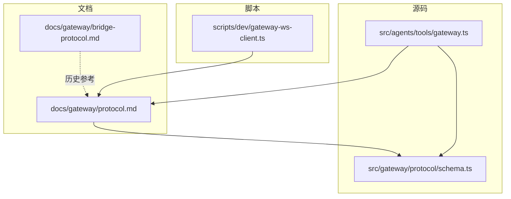
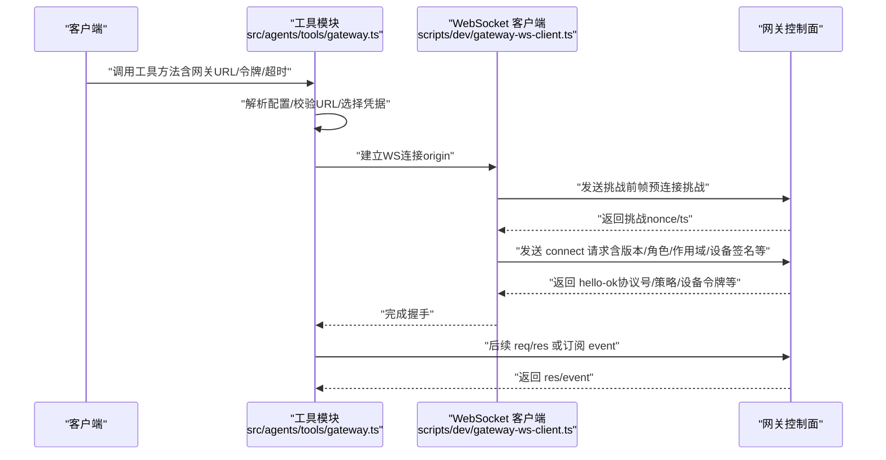
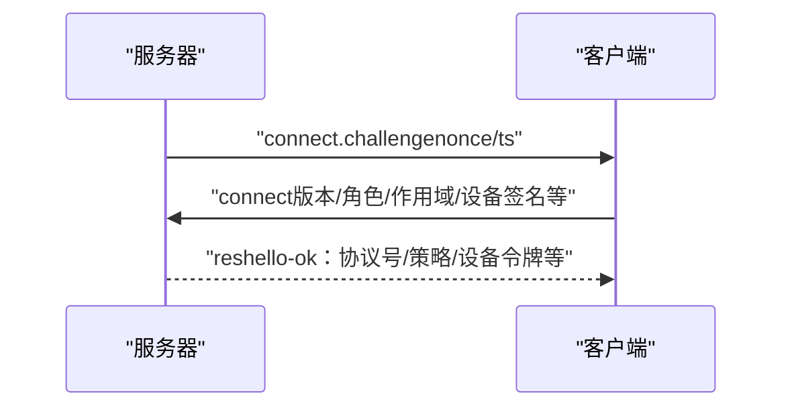
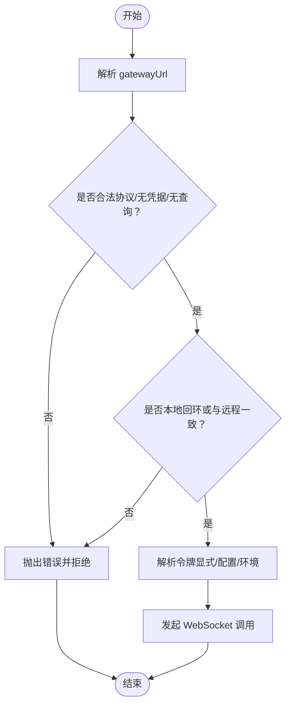
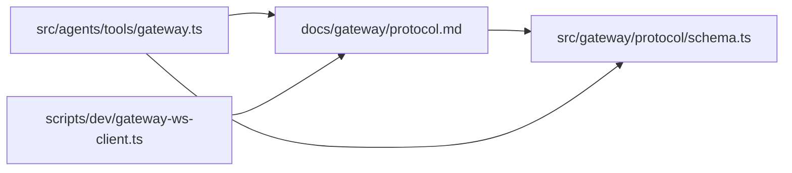

# 协议规范

<cite>
**本文引用的文件**
- [docs/gateway/protocol.md](file://docs/gateway/protocol.md)
- [docs/gateway/bridge-protocol.md](file://docs/gateway/bridge-protocol.md)
- [scripts/dev/gateway-ws-client.ts](file://scripts/dev/gateway-ws-client.ts)
- [src/agents/tools/gateway.ts](file://src/agents/tools/gateway.ts)
- [src/gateway/protocol/schema.ts](file://src/gateway/protocol/schema.ts)
</cite>

## 目录
1. [简介](#简介)
2. [项目结构](#项目结构)
3. [核心组件](#核心组件)
4. [架构总览](#架构总览)
5. [详细组件分析](#详细组件分析)
6. [依赖关系分析](#依赖关系分析)
7. [性能考量](#性能考量)
8. [故障排查指南](#故障排查指南)
9. [结论](#结论)
10. [附录](#附录)

## 简介
本文件为 OpenClaw 网关协议（WebSocket）的权威规范，覆盖消息格式、事件类型、数据交换标准、版本管理与兼容性策略、认证与设备配对、TLS 证书固定、序列化与传输、错误处理与重试、以及扩展与第三方集成的最佳实践。本文档同时提供协议参考手册与流程图示，帮助开发者快速实现与调试。

## 项目结构
OpenClaw 将“网关协议”文档与“桥接协议（历史）”文档分层组织，并在源码中通过协议模式与工具模块支撑实际实现。下图展示与本规范直接相关的文档与代码位置：

图表来源
- [docs/gateway/protocol.md:1-268](file://docs/gateway/protocol.md#L1-L268)
- [docs/gateway/bridge-protocol.md:1-92](file://docs/gateway/bridge-protocol.md#L1-L92)
- [scripts/dev/gateway-ws-client.ts:1-133](file://scripts/dev/gateway-ws-client.ts#L1-L133)
- [src/agents/tools/gateway.ts:1-161](file://src/agents/tools/gateway.ts#L1-L161)
- [src/gateway/protocol/schema.ts:1-19](file://src/gateway/protocol/schema.ts#L1-L19)

章节来源
- [docs/gateway/protocol.md:10-268](file://docs/gateway/protocol.md#L10-L268)
- [docs/gateway/bridge-protocol.md:10-92](file://docs/gateway/bridge-protocol.md#L10-L92)
- [scripts/dev/gateway-ws-client.ts:1-133](file://scripts/dev/gateway-ws-client.ts#L1-L133)
- [src/agents/tools/gateway.ts:1-161](file://src/agents/tools/gateway.ts#L1-L161)
- [src/gateway/protocol/schema.ts:1-19](file://src/gateway/protocol/schema.ts#L1-L19)

## 核心组件
- 传输层：WebSocket 文本帧，JSON 负载；握手阶段必须由客户端发送首个请求帧。
- 消息模型：请求（req）、响应（res）、事件（event）三类帧；幂等键用于有副作用的方法。
- 角色与作用域：操作者（operator）与节点（node）两类角色；操作者具备读写/管理/审批/配对等作用域；节点声明能力类别（caps）、命令白名单（commands）与权限（permissions）。
- 认证与设备配对：连接前先收到服务器挑战（nonce/ts），客户端需签名挑战并回传；支持设备令牌持久化与轮换；可配置 TLS 证书指纹固定。
- 版本管理：协议版本在源码中集中定义与生成，客户端以最小/最大版本协商，不匹配则拒绝连接。
- 远程网关调用：工具模块负责解析网关地址、凭据与超时，统一走 WebSocket 控制面。

章节来源
- [docs/gateway/protocol.md:17-268](file://docs/gateway/protocol.md#L17-L268)
- [src/agents/tools/gateway.ts:10-161](file://src/agents/tools/gateway.ts#L10-L161)

## 架构总览
下图展示客户端、网关与远程网关之间的交互路径，以及工具模块如何解析配置与凭据：

图表来源
- [src/agents/tools/gateway.ts:116-161](file://src/agents/tools/gateway.ts#L116-L161)
- [scripts/dev/gateway-ws-client.ts:52-133](file://scripts/dev/gateway-ws-client.ts#L52-L133)
- [docs/gateway/protocol.md:22-90](file://docs/gateway/protocol.md#L22-L90)

## 详细组件分析

### 1) 消息格式与帧模型
- 请求帧（req）
  - 字段：type、id、method、params（可选）
  - 用途：调用网关方法（RPC）
- 响应帧（res）
  - 字段：type、id、ok、payload（成功时）、error（失败时）
  - 用途：对请求的确认或错误反馈
- 事件帧（event）
  - 字段：type、event、payload、seq（可选）、stateVersion（可选）
  - 用途：推送状态变更、会话更新、系统事件等
- 幂等键
  - 对有副作用的方法，需要提供幂等键以避免重复执行

章节来源
- [docs/gateway/protocol.md:127-134](file://docs/gateway/protocol.md#L127-L134)

### 2) 握手流程与连接参数
- 预连接挑战
  - 服务器发送 connect.challenge（包含 nonce 与时间戳）
  - 客户端必须签名挑战并回传
- connect 请求
  - 必填字段：minProtocol、maxProtocol、client、role、scopes、auth、device
  - 可选字段：caps、commands、permissions、locale、userAgent
  - 设备字段：id、publicKey、signature、signedAt、nonce
- 成功响应
  - 返回 hello-ok，包含协议号与策略（如心跳间隔）
  - 若已签发设备令牌，返回 auth.deviceToken、role、scopes

图表来源
- [docs/gateway/protocol.md:24-90](file://docs/gateway/protocol.md#L24-L90)

章节来源
- [docs/gateway/protocol.md:22-90](file://docs/gateway/protocol.md#L22-L90)

### 3) 角色、作用域与节点能力
- 角色
  - operator：控制面客户端（CLI/UI/自动化）
  - node：能力宿主（摄像头/屏幕/画布/系统运行等）
- 作用域（operator）
  - 常见范围：operator.read、operator.write、operator.admin、operator.approvals、operator.pairing
  - 方法级作用域为第一道门槛；部分斜杠命令在通过方法级检查后还会进行更严格的命令级校验
- 节点能力声明
  - caps：能力类别
  - commands：invoke 允许列表
  - permissions：细粒度开关（如 screen.record、camera.capture）

章节来源
- [docs/gateway/protocol.md:135-184](file://docs/gateway/protocol.md#L135-L184)

### 4) 执行审批与生命周期事件
- 审批请求
  - 当执行请求需要审批时，网关广播 exec.approval.requested
  - 操作者客户端使用 operator.approvals 范围调用 exec.approval.resolve 解决
- 主机为节点时的限制
  - exec.approval.request 必须包含 systemRunPlan（规范化的 argv/cwd/rawCommand/会话元数据）
  - 缺失 systemRunPlan 的请求将被拒绝
- 生命周期事件
  - 节点可上报 exec.finished/exec.denied，映射为网关系统事件

章节来源
- [docs/gateway/protocol.md:185-190](file://docs/gateway/protocol.md#L185-L190)

### 5) 版本管理、向后兼容与升级策略
- 协议版本
  - PROTOCOL_VERSION 定义于源码模式文件中
  - 客户端发送 minProtocol/maxProtocol，服务端拒绝不匹配
- 模式生成与校验
  - 模式与模型从 TypeBox 定义生成
  - 提供生成与校验脚本命令（如 protocol:gen、protocol:gen:swift、protocol:check）
- 升级建议
  - 采用最小/最大版本协商；新增破坏性变更前增加版本字段
  - 保持向后兼容，逐步淘汰旧版本

章节来源
- [docs/gateway/protocol.md:191-199](file://docs/gateway/protocol.md#L191-L199)
- [src/gateway/protocol/schema.ts:1-19](file://src/gateway/protocol/schema.ts#L1-L19)

### 6) 认证、设备身份与配对
- 令牌策略
  - 若启用 OPENCLAW_GATEWAY_TOKEN，则 connect.params.auth.token 必须匹配，否则断开
  - 成功配对后，网关按连接的角色与作用域签发设备令牌，返回给客户端并建议持久化
  - 支持 rotate/revoke 设备令牌（需 operator.pairing）
- 设备签名与迁移
  - 必须等待 connect.challenge 并使用服务器 nonce 签名
  - 优先使用 v3 签名体（绑定平台与设备家族等），v2 仍兼容但受配对元数据约束
- 错误与重试
  - 认证失败包含 details.code 与恢复提示（如 canRetryWithDeviceToken、recommendedNextStep）
  - AUTH_TOKEN_MISMATCH：可信客户端可尝试有限次重试；若失败，停止自动重连并提示人工干预

章节来源
- [docs/gateway/protocol.md:200-230](file://docs/gateway/protocol.md#L200-L230)

### 7) TLS 与证书固定
- 支持 TLS 的 WebSocket 连接
- 可选证书指纹固定（通过配置项 gateway.tls 与 gateway.remote.tlsFingerprint，或 CLI --tls-fingerprint）

章节来源
- [docs/gateway/protocol.md:257-262](file://docs/gateway/protocol.md#L257-L262)

### 8) 工具模块与远程网关调用
- 地址解析与校验
  - 仅允许 ws/wss 协议，不允许用户名/密码、查询/哈希
  - 默认本地端口为 18789；允许覆盖为本地回环或与配置的远程网关一致
- 凭据解析
  - 优先显式令牌；否则根据目标（本地/远程）从配置与环境变量解析
- 超时与调用
  - 统一超时设置；调用时附加客户端名称、显示名、模式与最小权限作用域

图表来源
- [src/agents/tools/gateway.ts:26-97](file://src/agents/tools/gateway.ts#L26-L97)

章节来源
- [src/agents/tools/gateway.ts:10-161](file://src/agents/tools/gateway.ts#L10-L161)

### 9) 开发者 WebSocket 客户端（参考实现）
- 类型定义：GatewayReqFrame/GatewayResFrame/GatewayEventFrame/GatewayFrame
- 连接与超时：握手超时、打开超时
- 请求/响应：基于 UUID 的请求 ID，超时处理
- 事件回调：收到 event 帧时触发用户回调
- 关闭：清理未完成请求并关闭连接

章节来源
- [scripts/dev/gateway-ws-client.ts:4-133](file://scripts/dev/gateway-ws-client.ts#L4-L133)

### 10) 历史桥接协议（TCP JSONL）
- 传输：TCP，每行一个 JSON 对象（JSONL）
- 可选 TLS（当 bridge.tls.enabled 为真）
- 握手与配对：hello/pair-request/pair-ok 流程
- 帧类型：req/res、event、invoke/invoke-res、ping/pong
- 说明：当前构建不再内置 TCP 桥接监听器，此协议作为历史参考

章节来源
- [docs/gateway/bridge-protocol.md:10-92](file://docs/gateway/bridge-protocol.md#L10-L92)

## 依赖关系分析
- 文档到模式
  - protocol.md 中的协议行为与字段定义，对应 src/gateway/protocol/schema.ts 导出的各子模式集合
- 工具到文档与模式
  - 工具模块在解析网关地址、凭据与超时时，遵循 protocol.md 的角色/作用域/认证规则，并依赖 schema.ts 的类型定义进行一致性保障
- 客户端到工具
  - scripts/dev/gateway-ws-client.ts 作为开发者参考实现，演示了 req/res/event 的收发与超时处理

图表来源
- [docs/gateway/protocol.md:10-268](file://docs/gateway/protocol.md#L10-L268)
- [src/gateway/protocol/schema.ts:1-19](file://src/gateway/protocol/schema.ts#L1-L19)
- [src/agents/tools/gateway.ts:1-161](file://src/agents/tools/gateway.ts#L1-L161)
- [scripts/dev/gateway-ws-client.ts:1-133](file://scripts/dev/gateway-ws-client.ts#L1-L133)

章节来源
- [src/gateway/protocol/schema.ts:1-19](file://src/gateway/protocol/schema.ts#L1-L19)
- [src/agents/tools/gateway.ts:1-161](file://src/agents/tools/gateway.ts#L1-L161)
- [docs/gateway/protocol.md:10-268](file://docs/gateway/protocol.md#L10-L268)

## 性能考量
- 心跳与保活
  - 协议策略包含心跳间隔（tickIntervalMs），客户端应据此维持连接活跃
- 超时与并发
  - 工具模块与参考客户端均提供超时控制；建议为不同方法设置合理超时阈值
- 传输优化
  - 使用 WebSocket 文本帧传输 JSON；避免不必要的大对象传输
- 远程网关
  - 在网络不稳定场景，建议结合重试与指数退避策略（遵循错误码与重试指引）

章节来源
- [docs/gateway/protocol.md:70-78](file://docs/gateway/protocol.md#L70-L78)
- [src/agents/tools/gateway.ts:133-137](file://src/agents/tools/gateway.ts#L133-L137)
- [scripts/dev/gateway-ws-client.ts:68-78](file://scripts/dev/gateway-ws-client.ts#L68-L78)

## 故障排查指南
- 认证失败
  - 检查 OPENCLAW_GATEWAY_TOKEN 与 connect.auth.token 是否一致
  - 若返回 details.canRetryWithDeviceToken 为真，尝试使用持久化的设备令牌
  - recommendedNextStep 提供下一步建议（如 retry_with_device_token、update_auth_configuration、wait_then_retry 等）
- 设备签名问题
  - 确认已等待 connect.challenge 并使用服务器 nonce 签名
  - 确保签名体符合 v3（优先）或 v2 规范；检查设备 id 与公钥格式
- 连接超时
  - 检查握手与打开超时设置；确认网络可达与端口正确
- 远程网关不可达
  - 校验 gatewayUrl 是否为本地回环或与配置的远程网关一致
  - 确认凭据解析逻辑与环境变量配置

章节来源
- [docs/gateway/protocol.md:209-215](file://docs/gateway/protocol.md#L209-L215)
- [docs/gateway/protocol.md:231-256](file://docs/gateway/protocol.md#L231-L256)
- [src/agents/tools/gateway.ts:56-97](file://src/agents/tools/gateway.ts#L56-L97)
- [scripts/dev/gateway-ws-client.ts:80-94](file://scripts/dev/gateway-ws-client.ts#L80-L94)

## 结论
OpenClaw 网关协议以 WebSocket 为核心，提供统一的控制面与节点传输通道。通过明确的消息模型、角色/作用域体系、设备身份与配对机制、TLS 证书固定与版本协商，确保安全、稳定与可演进。开发者可依据本文档与参考实现快速集成，并遵循错误处理与重试策略提升鲁棒性。

## 附录

### A. 协议参考手册（字段与状态）
- 帧类型
  - req：请求调用
  - res：响应（ok/payload/error）
  - event：事件推送
- connect 参数要点
  - minProtocol/maxProtocol：版本协商
  - client：id/version/platform/mode
  - role/scopes：角色与作用域
  - caps/commands/permissions：节点能力声明
  - auth：令牌
  - device：id/publicKey/signature/signedAt/nonce
- hello-ok 返回
  - protocol：协议号
  - policy：心跳等策略
  - auth.deviceToken：设备令牌（首次配对后返回）

章节来源
- [docs/gateway/protocol.md:22-90](file://docs/gateway/protocol.md#L22-L90)

### B. 开发与集成最佳实践
- 实现要点
  - 严格遵守握手顺序：先挑战后 connect
  - 使用最小权限作用域调用方法
  - 为有副作用的方法提供幂等键
- 第三方集成
  - 使用工具模块解析网关地址与凭据
  - 参考开发者 WebSocket 客户端实现收发与超时处理
  - 在 CI 中运行协议生成与校验脚本，确保模式一致性

章节来源
- [src/agents/tools/gateway.ts:116-161](file://src/agents/tools/gateway.ts#L116-L161)
- [scripts/dev/gateway-ws-client.ts:52-133](file://scripts/dev/gateway-ws-client.ts#L52-L133)
- [docs/gateway/protocol.md:195-199](file://docs/gateway/protocol.md#L195-L199)