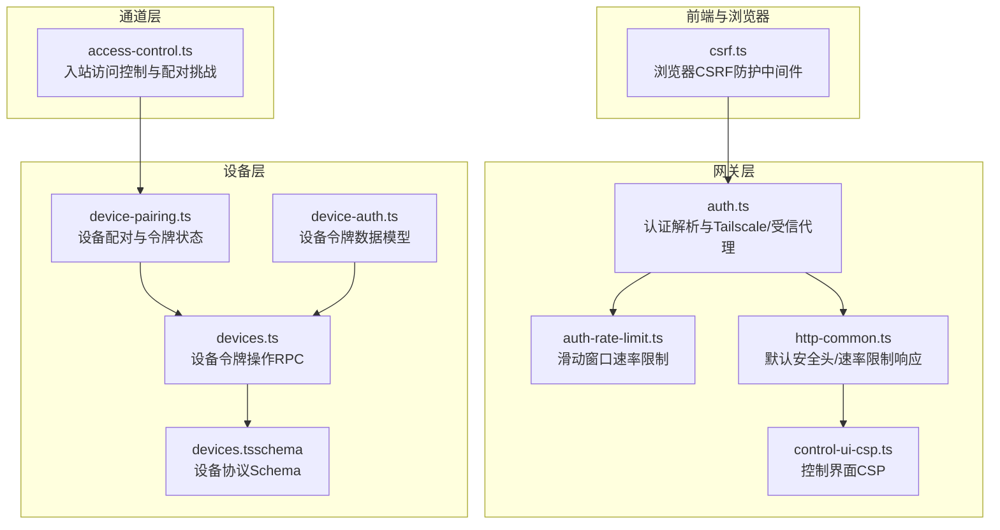
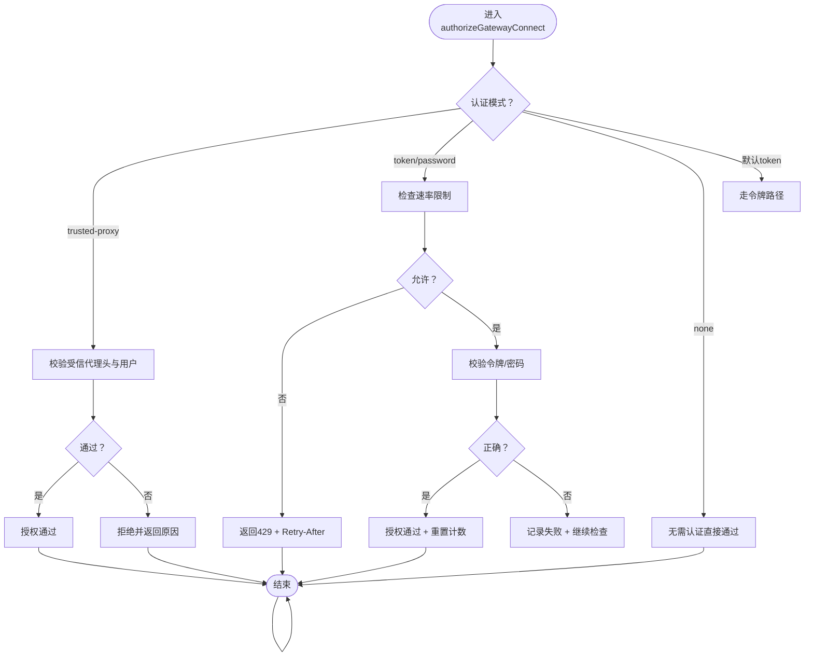
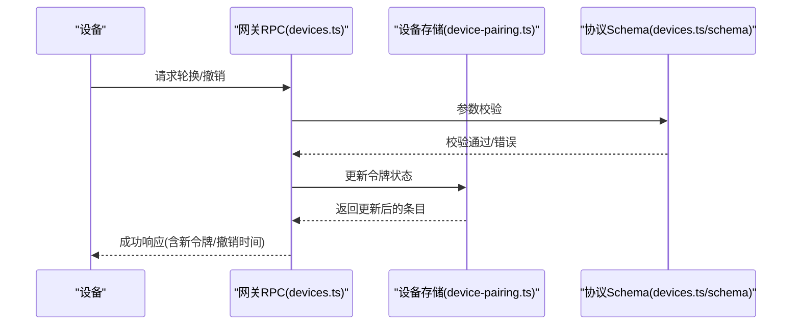
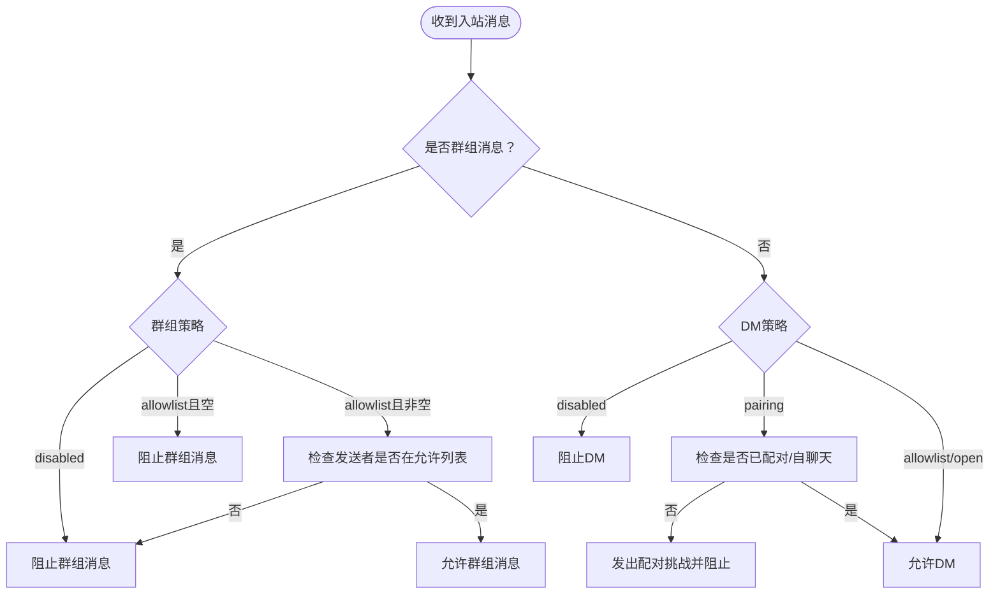
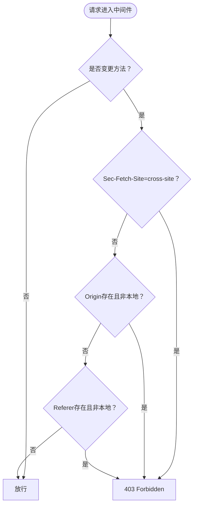
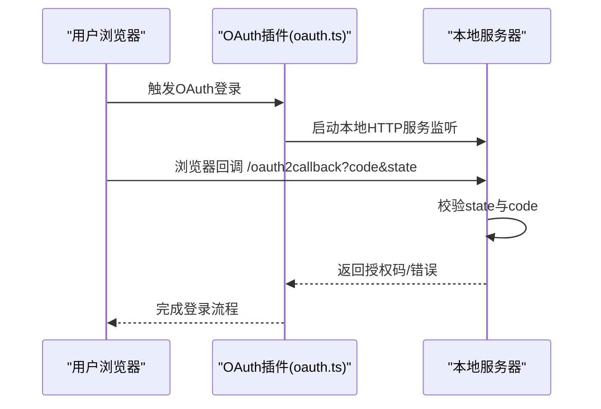
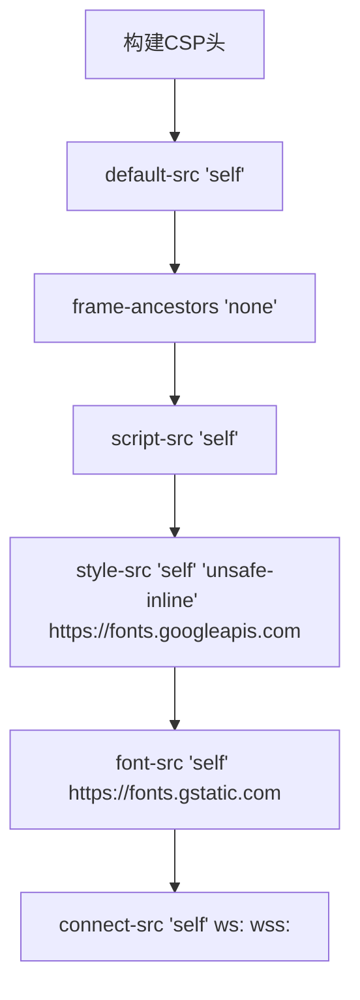
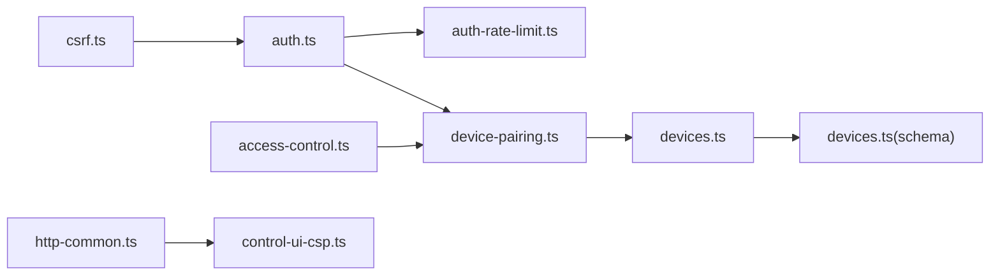

# 安全认证系统

<cite>
**本文档引用的文件**
- [SECURITY.md](file://SECURITY.md)
- [THREAT-MODEL-ATLAS.md](file://docs/security/THREAT-MODEL-ATLAS.md)
- [auth.ts](file://src/gateway/auth.ts)
- [auth-rate-limit.ts](file://src/gateway/auth-rate-limit.ts)
- [access-control.ts](file://src/web/inbound/access-control.ts)
- [csrf.ts](file://src/browser/csrf.ts)
- [control-ui-csp.ts](file://src/gateway/control-ui-csp.ts)
- [http-common.ts](file://src/gateway/http-common.ts)
- [device-pairing.ts](file://src/infra/device-pairing.ts)
- [devices.ts](file://src/gateway/server-methods/devices.ts)
- [devices.ts（schema）](file://src/gateway/protocol/schema/devices.ts)
- [device-auth.ts](file://src/shared/device-auth.ts)
- [oauth.ts](file://extensions/google-gemini-cli-auth/oauth.ts)
- [index.ts（device-pair 插件）](file://extensions/device-pair/index.ts)
- [windows-acl.ts](file://src/security/windows-acl.ts)
</cite>

## 目录
1. [简介](#简介)
2. [项目结构](#项目结构)
3. [核心组件](#核心组件)
4. [架构总览](#架构总览)
5. [详细组件分析](#详细组件分析)
6. [依赖关系分析](#依赖关系分析)
7. [性能考量](#性能考量)
8. [故障排查指南](#故障排查指南)
9. [结论](#结论)
10. [附录](#附录)

## 简介
本文件面向OpenClaw安全管理员与开发者，系统化梳理并解释OpenClaw安全认证体系：包括令牌认证、OAuth集成、设备绑定与令牌管理、访问控制与权限验证、会话与速率限制、防暴力破解与异常行为检测、CORS与CSP配置、密钥与证书最佳实践，以及威胁防护与合规检查建议。文档以代码级事实为依据，辅以可视化图示帮助不同技术背景读者理解。

## 项目结构
OpenClaw将“网关认证”“通道入站访问控制”“设备配对与令牌管理”“浏览器CSRF防护”“HTTP安全头与CSP”等模块分层组织，形成从网络边界到应用内授权的多层防护：

- 网关层：认证解析、速率限制、受信代理与Tailscale集成
- 通道层：入站消息访问控制与配对流程
- 设备层：设备配对、令牌生成与作用域管理
- 前端与浏览器：CSRF防护中间件
- HTTP层：默认安全头、CSP、速率限制响应



图表来源
- [auth.ts:1-504](file://src/gateway/auth.ts#L1-L504)
- [auth-rate-limit.ts:1-233](file://src/gateway/auth-rate-limit.ts#L1-L233)
- [http-common.ts:1-109](file://src/gateway/http-common.ts#L1-L109)
- [control-ui-csp.ts:1-18](file://src/gateway/control-ui-csp.ts#L1-L18)
- [access-control.ts:1-228](file://src/web/inbound/access-control.ts#L1-L228)
- [device-pairing.ts:51-270](file://src/infra/device-pairing.ts#L51-L270)
- [devices.ts:219-259](file://src/gateway/server-methods/devices.ts#L219-L259)
- [devices.ts（schema）:1-67](file://src/gateway/protocol/schema/devices.ts#L1-L67)
- [device-auth.ts:1-30](file://src/shared/device-auth.ts#L1-L30)
- [csrf.ts:1-87](file://src/browser/csrf.ts#L1-L87)

章节来源
- [auth.ts:1-504](file://src/gateway/auth.ts#L1-L504)
- [auth-rate-limit.ts:1-233](file://src/gateway/auth-rate-limit.ts#L1-L233)
- [http-common.ts:1-109](file://src/gateway/http-common.ts#L1-L109)
- [control-ui-csp.ts:1-18](file://src/gateway/control-ui-csp.ts#L1-L18)
- [access-control.ts:1-228](file://src/web/inbound/access-control.ts#L1-L228)
- [device-pairing.ts:51-270](file://src/infra/device-pairing.ts#L51-L270)
- [devices.ts:219-259](file://src/gateway/server-methods/devices.ts#L219-L259)
- [devices.ts（schema）:1-67](file://src/gateway/protocol/schema/devices.ts#L1-L67)
- [device-auth.ts:1-30](file://src/shared/device-auth.ts#L1-L30)
- [csrf.ts:1-87](file://src/browser/csrf.ts#L1-L87)

## 核心组件
- 网关认证与授权
  - 支持模式：无认证、令牌、密码、受信代理、Tailscale头认证（仅WS控制界面）
  - 速率限制：按IP与作用域（共享密钥/设备令牌/钩子）独立计数
  - 受信代理：校验必需头、用户头、可选白名单用户
  - Tailscale：基于反向代理转发头与WHOIS校验
- 通道入站访问控制
  - DM策略：配对、允许列表、开放、禁用；群组策略：开放、允许列表、禁用
  - 自聊天模式与配对宽限期
- 设备配对与令牌管理
  - 请求/批准/撤销/轮换设备令牌
  - 作用域展开与授权判定
- 浏览器CSRF防护
  - 对跨站变更请求进行拒绝或放行判断
- HTTP安全头与CSP
  - 默认安全头（X-Content-Type-Options、Referrer-Policy、Permissions-Policy）
  - 控制界面CSP（禁止内联脚本、允许内联样式、外部字体源）
- OAuth集成
  - 本地回调等待与状态校验
- 密钥与证书
  - Windows ACL分类与信任主体识别

章节来源
- [auth.ts:217-504](file://src/gateway/auth.ts#L217-L504)
- [auth-rate-limit.ts:59-233](file://src/gateway/auth-rate-limit.ts#L59-L233)
- [access-control.ts:41-228](file://src/web/inbound/access-control.ts#L41-L228)
- [device-pairing.ts:51-270](file://src/infra/device-pairing.ts#L51-L270)
- [devices.ts:219-259](file://src/gateway/server-methods/devices.ts#L219-L259)
- [csrf.ts:26-87](file://src/browser/csrf.ts#L26-L87)
- [http-common.ts:11-22](file://src/gateway/http-common.ts#L11-L22)
- [control-ui-csp.ts:1-18](file://src/gateway/control-ui-csp.ts#L1-L18)
- [oauth.ts:305-344](file://extensions/google-gemini-cli-auth/oauth.ts#L305-L344)
- [windows-acl.ts:246-278](file://src/security/windows-acl.ts#L246-L278)

## 架构总览
下图展示OpenClaw认证与授权的关键交互路径：客户端发起连接→网关认证→速率限制→（可选）受信代理/Tailscale→设备令牌校验→通道入站访问控制→设备令牌作用域授权→执行业务逻辑。

```mermaid
sequenceDiagram
participant Client as "客户端"
participant GW as "网关(auth.ts)"
participant RL as "速率限制(auth-rate-limit.ts)"
participant RP as "受信代理/Whiscale"
participant Dev as "设备令牌(device-pairing.ts)"
participant AC as "入站访问控制(access-control.ts)"
Client->>GW : 建立连接/发送认证头
GW->>RL : 检查IP作用域配额
RL-->>GW : 允许/拒绝(带重试时间)
alt 已通过速率限制
GW->>RP : 校验受信代理/或Tailscale头
RP-->>GW : 用户身份或失败原因
opt 身份有效
GW->>Dev : 校验设备令牌与作用域
Dev-->>GW : 授权结果
GW-->>Client : 认证成功
Client->>AC : 发送入站消息
AC-->>Client : 入站许可/阻止
else 失败
GW-->>Client : 401/429
end
else 未通过速率限制
GW-->>Client : 429 Too Many Requests
end
```

图表来源
- [auth.ts:378-504](file://src/gateway/auth.ts#L378-L504)
- [auth-rate-limit.ts:141-233](file://src/gateway/auth-rate-limit.ts#L141-L233)
- [device-pairing.ts:218-270](file://src/infra/device-pairing.ts#L218-L270)
- [access-control.ts:41-228](file://src/web/inbound/access-control.ts#L41-L228)

## 详细组件分析

### 组件A：网关认证与速率限制
- 认证模式解析与选择
  - 支持模式：none/token/password/trusted-proxy，默认token
  - 受信代理需配置用户头与可选允许用户列表
  - Tailscale仅在WS控制界面启用，基于反向代理头与WHOIS校验
- 速率限制
  - 滑动窗口（默认1分钟），最大失败次数（默认10次），锁定时长（默认5分钟）
  - 作用域隔离：共享密钥、设备令牌、钩子认证三类独立计数
  - 本地回环豁免，周期清理内存占用
- 错误与响应
  - 速率限制返回429并设置Retry-After
  - 未授权统一返回401



图表来源
- [auth.ts:378-504](file://src/gateway/auth.ts#L378-L504)
- [auth-rate-limit.ts:141-233](file://src/gateway/auth-rate-limit.ts#L141-L233)

章节来源
- [auth.ts:217-504](file://src/gateway/auth.ts#L217-L504)
- [auth-rate-limit.ts:59-233](file://src/gateway/auth-rate-limit.ts#L59-L233)
- [http-common.ts:41-65](file://src/gateway/http-common.ts#L41-L65)

### 组件B：设备绑定与令牌管理
- 设备配对生命周期
  - 请求→批准/拒绝→配对完成→令牌轮换/撤销
  - 作用域展开：如admin隐含read/write/approvals/pairing
- RPC接口
  - 列表、轮换、撤销设备令牌
- 数据模型
  - 设备令牌条目包含角色、作用域、创建/轮换/撤销/最后使用时间戳



图表来源
- [devices.ts:219-259](file://src/gateway/server-methods/devices.ts#L219-L259)
- [devices.ts（schema）:1-67](file://src/gateway/protocol/schema/devices.ts#L1-L67)
- [device-pairing.ts:218-270](file://src/infra/device-pairing.ts#L218-L270)
- [device-auth.ts:1-30](file://src/shared/device-auth.ts#L1-L30)

章节来源
- [devices.ts:219-259](file://src/gateway/server-methods/devices.ts#L219-L259)
- [devices.ts（schema）:1-67](file://src/gateway/protocol/schema/devices.ts#L1-L67)
- [device-pairing.ts:51-270](file://src/infra/device-pairing.ts#L51-L270)
- [device-auth.ts:1-30](file://src/shared/device-auth.ts#L1-L30)

### 组件C：通道入站访问控制与配对
- DM策略与群组策略
  - DM策略：pairing（默认）、allowlist、open、disabled
  - 群组策略：open、allowlist、disabled；allowlist为空时阻断
- 配对宽限期
  - 历史消息在宽限期内不触发配对回复
- 自聊天模式
  - 当sender与self一致或满足自聊天条件时，允许自对话



图表来源
- [access-control.ts:41-228](file://src/web/inbound/access-control.ts#L41-L228)

章节来源
- [access-control.ts:41-228](file://src/web/inbound/access-control.ts#L41-L228)

### 组件D：浏览器CSRF防护
- 拒绝策略
  - 对变更方法（POST/PUT/PATCH/DELETE）进行跨站判定
  - 若Sec-Fetch-Site为cross-site，直接拒绝
  - 否则若Origin/Referer存在且不在本地回环，拒绝
  - 非浏览器客户端（无Origin/Referer）不拒绝
- 中间件
  - OPTIONS预检放行，避免破坏CORS



图表来源
- [csrf.ts:26-87](file://src/browser/csrf.ts#L26-L87)

章节来源
- [csrf.ts:1-87](file://src/browser/csrf.ts#L1-L87)

### 组件E：OAuth集成（本地回调）
- 本地监听端口与路径
  - 监听localhost:8085/oauth2callback
- 参数校验
  - 校验state与code，错误时返回400
- 回调处理
  - 成功后完成凭证交换与后续流程



图表来源
- [oauth.ts:305-344](file://extensions/google-gemini-cli-auth/oauth.ts#L305-L344)

章节来源
- [oauth.ts:305-344](file://extensions/google-gemini-cli-auth/oauth.ts#L305-L344)

### 组件F：HTTP安全头与CSP
- 默认安全头
  - X-Content-Type-Options: nosniff
  - Referrer-Policy: no-referrer
  - Permissions-Policy: 摄像头/麦克风/地理定位禁用
  - HSTS可选开启
- 控制界面CSP
  - 禁止内联脚本，允许内联样式
  - 明确外部字体源（Google Fonts）



图表来源
- [control-ui-csp.ts:1-18](file://src/gateway/control-ui-csp.ts#L1-L18)
- [http-common.ts:11-22](file://src/gateway/http-common.ts#L11-L22)

章节来源
- [control-ui-csp.ts:1-18](file://src/gateway/control-ui-csp.ts#L1-L18)
- [http-common.ts:11-22](file://src/gateway/http-common.ts#L11-L22)

### 组件G：密钥与证书处理（Windows ACL）
- 主体分类
  - 受信任主体、不受信世界、不受信组
- SID解析与分类
  - 解析当前用户SID，用于ACL评估

章节来源
- [windows-acl.ts:246-278](file://src/security/windows-acl.ts#L246-L278)

## 依赖关系分析
- 认证与速率限制耦合：authorizeGatewayConnect依赖AuthRateLimiter实例
- 设备令牌与配对状态：devices RPC依赖device-pairing状态机与schema校验
- 入站访问控制与配对：access-control依赖allowFrom与配对状态
- 浏览器CSRF与网关认证：CSRF中间件在网关HTTP层生效，避免跨站变更



图表来源
- [csrf.ts:1-87](file://src/browser/csrf.ts#L1-L87)
- [auth.ts:1-504](file://src/gateway/auth.ts#L1-L504)
- [auth-rate-limit.ts:1-233](file://src/gateway/auth-rate-limit.ts#L1-L233)
- [device-pairing.ts:51-270](file://src/infra/device-pairing.ts#L51-L270)
- [devices.ts:219-259](file://src/gateway/server-methods/devices.ts#L219-L259)
- [devices.ts（schema）:1-67](file://src/gateway/protocol/schema/devices.ts#L1-L67)
- [access-control.ts:1-228](file://src/web/inbound/access-control.ts#L1-L228)
- [http-common.ts:1-109](file://src/gateway/http-common.ts#L1-L109)
- [control-ui-csp.ts:1-18](file://src/gateway/control-ui-csp.ts#L1-L18)

章节来源
- [auth.ts:1-504](file://src/gateway/auth.ts#L1-L504)
- [auth-rate-limit.ts:1-233](file://src/gateway/auth-rate-limit.ts#L1-L233)
- [access-control.ts:1-228](file://src/web/inbound/access-control.ts#L1-L228)
- [device-pairing.ts:51-270](file://src/infra/device-pairing.ts#L51-L270)
- [devices.ts:219-259](file://src/gateway/server-methods/devices.ts#L219-L259)
- [devices.ts（schema）:1-67](file://src/gateway/protocol/schema/devices.ts#L1-L67)
- [csrf.ts:1-87](file://src/browser/csrf.ts#L1-L87)
- [http-common.ts:1-109](file://src/gateway/http-common.ts#L1-L109)
- [control-ui-csp.ts:1-18](file://src/gateway/control-ui-csp.ts#L1-L18)

## 性能考量
- 速率限制
  - 内存Map存储，定期清理，避免无限增长
  - 本地回环豁免，不影响CLI体验
- 设备令牌
  - 作用域展开采用队列传播，复杂度线性于作用域数量
- 入站访问控制
  - 允许列表集合化查找，O(1)命中
- CSP与安全头
  - 构建成本低，静态字符串拼接

[本节为通用性能讨论，不直接分析具体文件]

## 故障排查指南
- 401未授权
  - 检查令牌/密码是否正确，确认网关认证模式配置
  - 查看速率限制是否触发（429）
- 429过多尝试
  - 等待Retry-After秒数后再试
  - 检查客户端IP是否被锁定
- 入站消息被阻止
  - DM策略是否为disabled
  - 群组策略是否为allowlist但发送者不在允许列表
  - 是否处于配对宽限期内
- CSRF被拒
  - 变更请求是否来自跨站上下文
  - 是否缺少Origin/Referer或其指向非本地
- OAuth回调失败
  - 校验state与code参数是否存在
  - 本地监听端口是否被占用

章节来源
- [http-common.ts:41-65](file://src/gateway/http-common.ts#L41-L65)
- [auth.ts:378-504](file://src/gateway/auth.ts#L378-L504)
- [auth-rate-limit.ts:141-233](file://src/gateway/auth-rate-limit.ts#L141-L233)
- [access-control.ts:41-228](file://src/web/inbound/access-control.ts#L41-L228)
- [csrf.ts:26-87](file://src/browser/csrf.ts#L26-L87)
- [oauth.ts:305-344](file://extensions/google-gemini-cli-auth/oauth.ts#L305-L344)

## 结论
OpenClaw通过“网关认证+速率限制+设备令牌+通道入站控制+浏览器CSRF+HTTP安全头+CSP”的组合，构建了从网络边界到应用内授权的纵深防御。建议在生产部署中：
- 强制使用令牌或密码认证，并结合速率限制
- 严格限制控制界面暴露范围，必要时启用HSTS
- 使用受信代理或Tailscale增强可信边界
- 对设备令牌实施最小权限与定期轮换
- 将CSP与安全头作为默认配置，避免内联脚本
- 结合威胁模型文档持续加固与审计

[本节为总结性内容，不直接分析具体文件]

## 附录

### 安全配置指南
- 网关绑定与暴露
  - 默认绑定loopback，避免公网直连
  - 远程访问优先SSH隧道或Tailscale
- 认证模式
  - 生产环境推荐令牌或密码，避免none
  - 受信代理需明确用户头与允许用户列表
- 速率限制
  - 使用默认阈值，必要时按作用域细分
- 控制界面
  - 仅本地访问，启用CSP，谨慎放宽CSP规则
- OAuth
  - 本地回调端口固定，校验state一致性

章节来源
- [SECURITY.md:227-244](file://SECURITY.md#L227-L244)
- [auth.ts:217-292](file://src/gateway/auth.ts#L217-L292)
- [auth-rate-limit.ts:25-82](file://src/gateway/auth-rate-limit.ts#L25-L82)
- [control-ui-csp.ts:1-18](file://src/gateway/control-ui-csp.ts#L1-L18)
- [oauth.ts:305-344](file://extensions/google-gemini-cli-auth/oauth.ts#L305-L344)

### 密钥与证书最佳实践
- Windows ACL
  - 分类识别受信任主体与不受信实体
  - 基于SID解析与分类进行权限评估

章节来源
- [windows-acl.ts:246-278](file://src/security/windows-acl.ts#L246-L278)

### 跨域资源共享（CORS）与内容安全策略（CSP）
- CORS
  - 变更方法请求由浏览器CSRF中间件统一拦截，避免跨站写操作
- CSP
  - 控制界面CSP禁止内联脚本，允许内联样式与外部字体源
  - 默认安全头统一设置敏感MIME类型防护、引用策略与权限策略

章节来源
- [csrf.ts:26-87](file://src/browser/csrf.ts#L26-L87)
- [control-ui-csp.ts:1-18](file://src/gateway/control-ui-csp.ts#L1-L18)
- [http-common.ts:11-22](file://src/gateway/http-common.ts#L11-L22)

### 威胁防护与合规检查
- 威胁模型要点
  - 配对码拦截、令牌窃取、提示注入、供应链攻击、资源耗尽等
- 合规建议
  - 定期运行安全审计工具，修补高危问题
  - 对关键路径（exec-approvals、SSRF保护、外部内容包装）进行强化

章节来源
- [THREAT-MODEL-ATLAS.md:168-604](file://docs/security/THREAT-MODEL-ATLAS.md#L168-L604)
- [SECURITY.md:207-288](file://SECURITY.md#L207-L288)