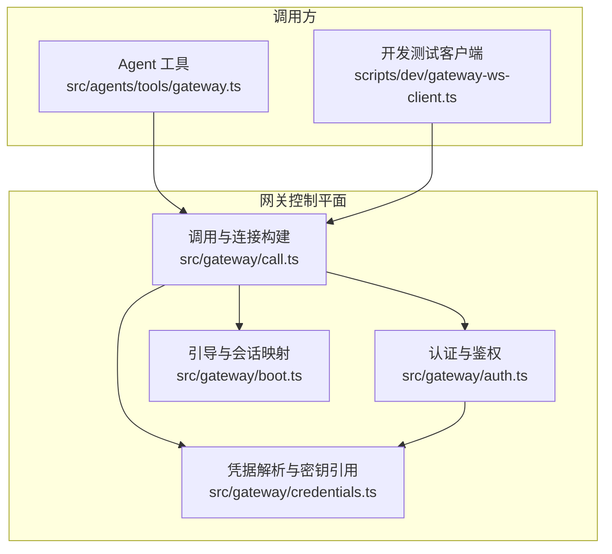
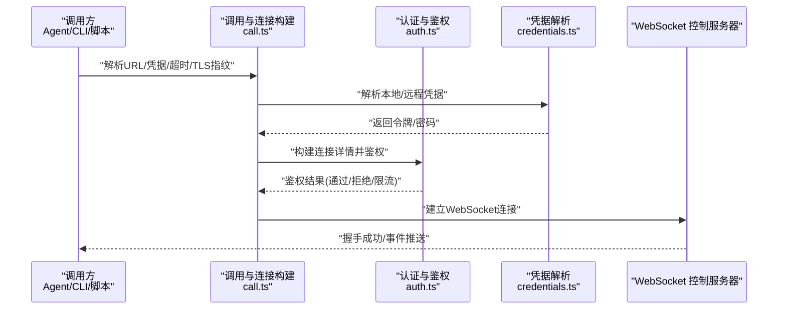
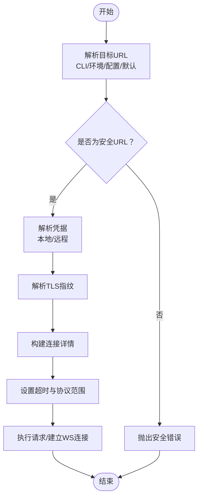
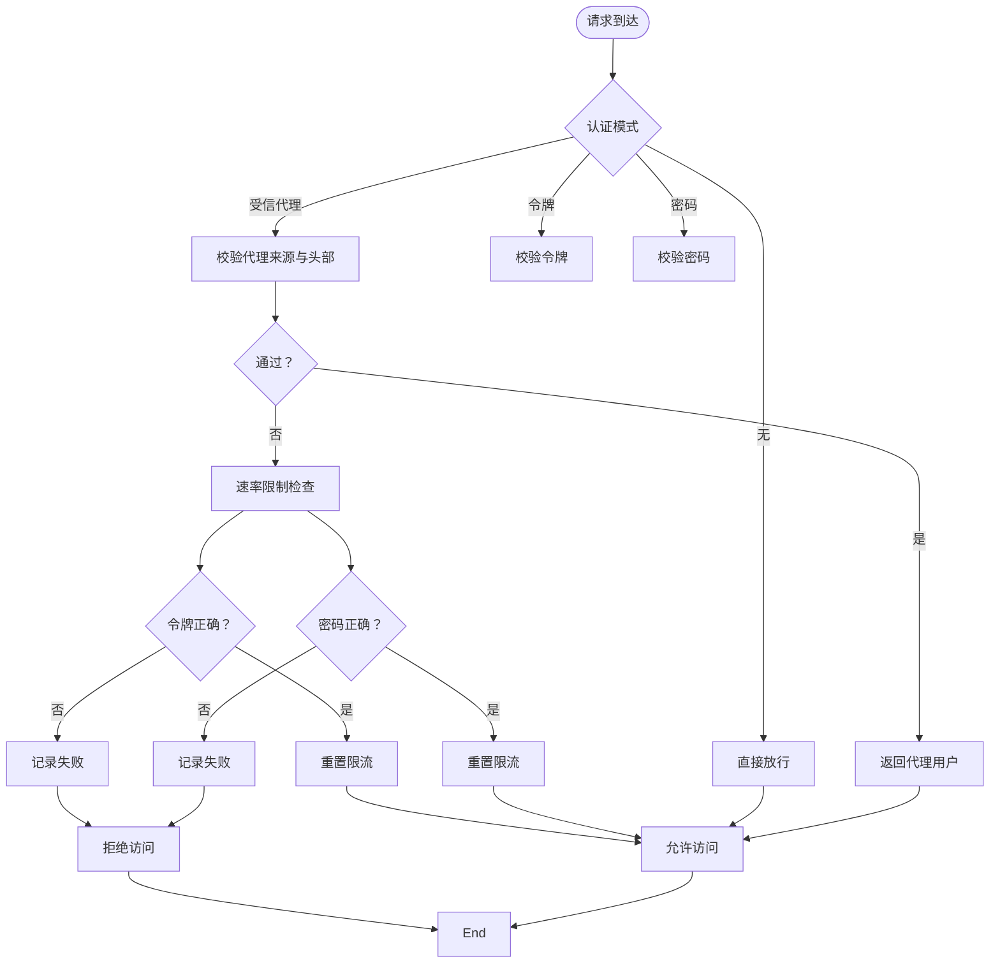
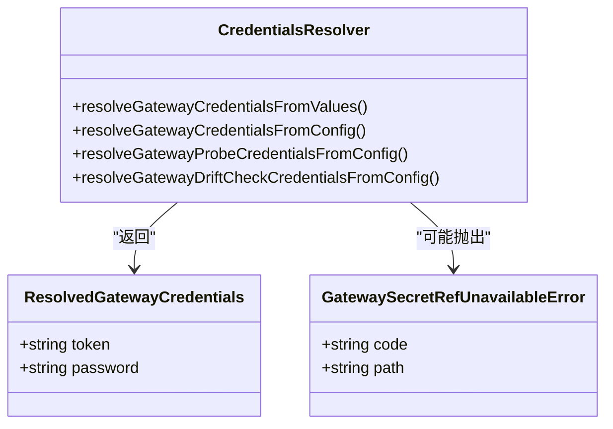
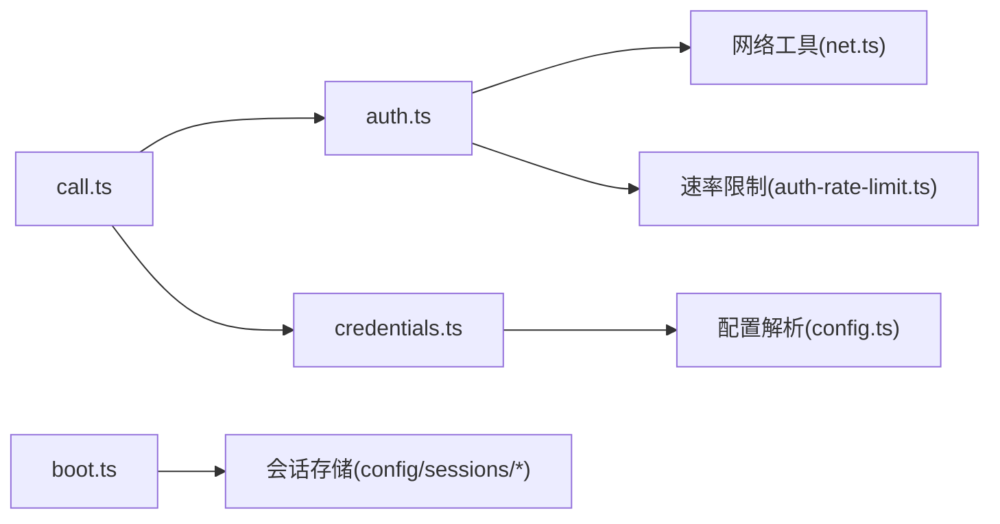

# 网关控制平面

<cite>
**本文引用的文件**
- [src/gateway/call.ts](file://src/gateway/call.ts)
- [src/gateway/auth.ts](file://src/gateway/auth.ts)
- [src/gateway/credentials.ts](file://src/gateway/credentials.ts)
- [src/gateway/boot.ts](file://src/gateway/boot.ts)
- [src/agents/tools/gateway.ts](file://src/agents/tools/gateway.ts)
- [scripts/dev/gateway-ws-client.ts](file://scripts/dev/gateway-ws-client.ts)
- [scripts/dev/gateway-smoke.ts](file://scripts/dev/gateway-smoke.ts)
- [docs/gateway/configuration-reference.md](file://docs/gateway/configuration-reference.md)
- [docs/gateway/authentication.md](file://docs/gateway/authentication.md)
- [docs/gateway/protocol.md](file://docs/gateway/protocol.md)
- [docs/gateway/index.md](file://docs/gateway/index.md)
- [docs/gateway/troubleshooting.md](file://docs/gateway/troubleshooting.md)
</cite>

## 目录
1. [简介](#简介)
2. [项目结构](#项目结构)
3. [核心组件](#核心组件)
4. [架构总览](#架构总览)
5. [详细组件分析](#详细组件分析)
6. [依赖关系分析](#依赖关系分析)
7. [性能考量](#性能考量)
8. [故障排除指南](#故障排除指南)
9. [结论](#结论)
10. [附录](#附录)

## 简介
本技术文档聚焦于 OpenClaw 网关控制平面，系统性阐述其 WebSocket 控制服务器的架构设计、协议规范与实现细节。文档覆盖网关如何作为单一控制平面协调客户端、工具与事件，包括会话管理、配置管理、安全认证等模块；并提供 WebSocket API 的完整规范（连接处理、消息格式、事件类型与实时交互模式）、配置选项、部署指南与故障排除方法，同时给出面向开发者的扩展与自定义建议。

## 项目结构
OpenClaw 将“网关”能力拆分为多个子模块：调用层负责统一的 WebSocket 调用与超时、TLS 指纹校验、远端/本地凭据解析；认证层负责多种认证模式（无、令牌、密码、受信代理、Tailscale）与速率限制；凭据层负责从配置与环境变量中解析令牌/密码，并支持密钥引用延迟解析；引导层负责首次启动检查与会话映射快照恢复。调用方（如 Agent 工具）通过统一入口发起请求，最终由网关控制平面完成鉴权与转发。

**图表来源**
- [src/agents/tools/gateway.ts:1-161](file://src/agents/tools/gateway.ts#L1-L161)
- [src/gateway/call.ts:1-942](file://src/gateway/call.ts#L1-L942)
- [src/gateway/auth.ts:1-504](file://src/gateway/auth.ts#L1-L504)
- [src/gateway/credentials.ts:1-351](file://src/gateway/credentials.ts#L1-L351)
- [src/gateway/boot.ts:1-204](file://src/gateway/boot.ts#L1-L204)
- [scripts/dev/gateway-ws-client.ts](file://scripts/dev/gateway-ws-client.ts)

**章节来源**
- [src/gateway/call.ts:137-226](file://src/gateway/call.ts#L137-L226)
- [src/gateway/auth.ts:217-292](file://src/gateway/auth.ts#L217-L292)
- [src/gateway/credentials.ts:253-323](file://src/gateway/credentials.ts#L253-L323)
- [src/gateway/boot.ts:138-204](file://src/gateway/boot.ts#L138-L204)

## 核心组件
- 调用与连接构建：统一解析目标 URL（本地回环、远程、CLI/环境覆盖）、TLS 指纹、超时、最小/最大协议版本、所需方法集；对不安全的非本地 ws 地址进行安全拦截；封装 WebSocket 请求生命周期与错误格式化。
- 认证与鉴权：支持四种认证模式（无、令牌、密码、受信代理），可选启用 Tailscale 头部认证；对失败尝试进行速率限制与重试时间提示；支持本地直连检测与代理 IP 解析。
- 凭据解析与密钥引用：从配置与环境变量解析令牌/密码，支持密钥引用延迟解析（SecretRef），在命令路径允许时再解析，避免启动阶段未初始化导致的不可用。
- 引导与会话映射：在首次启动检查期间生成一次性会话 ID，快照主会话映射，执行引导任务后恢复映射，保证状态一致性。

**章节来源**
- [src/gateway/call.ts:38-82](file://src/gateway/call.ts#L38-L82)
- [src/gateway/auth.ts:23-77](file://src/gateway/auth.ts#L23-L77)
- [src/gateway/credentials.ts:24-51](file://src/gateway/credentials.ts#L24-L51)
- [src/gateway/boot.ts:19-54](file://src/gateway/boot.ts#L19-L54)

## 架构总览
下图展示从调用方到网关控制平面的关键交互流程：调用方通过统一入口解析目标与凭据，构建连接详情，随后进入认证与鉴权阶段，最终建立 WebSocket 连接并进行消息收发。

**图表来源**
- [src/gateway/call.ts:137-226](file://src/gateway/call.ts#L137-L226)
- [src/gateway/auth.ts:378-485](file://src/gateway/auth.ts#L378-L485)
- [src/gateway/credentials.ts:253-323](file://src/gateway/credentials.ts#L253-L323)

## 详细组件分析

### 组件A：调用与连接构建（call.ts）
- 功能要点
  - 连接目标解析：优先 CLI/环境覆盖，其次配置中的远程 URL，最后本地回环 ws/wss。
  - 安全检查：对非本地地址的 ws 明文连接抛出安全错误，禁止在生产场景使用明文远程连接。
  - TLS 指纹：支持本地 TLS 运行时指纹或远程配置指纹，用于证书固定。
  - 超时与协议：统一超时计算与安全计时器范围，支持最小/最大协议版本与所需方法集校验。
  - 错误格式化：对关闭与超时错误进行统一格式化输出，便于诊断。
- 关键数据结构
  - CallGatewayOptions/CallGatewayScopedOptions：承载调用参数与作用域。
  - GatewayConnectionDetails：记录最终连接详情与来源信息。
- 性能与健壮性
  - 对超时进行边界约束，避免溢出与过长等待。
  - 对密钥引用进行分步解析，避免阻塞主流程。

**图表来源**
- [src/gateway/call.ts:137-226](file://src/gateway/call.ts#L137-L226)
- [src/gateway/call.ts:254-262](file://src/gateway/call.ts#L254-L262)
- [src/gateway/call.ts:702-729](file://src/gateway/call.ts#L702-L729)

**章节来源**
- [src/gateway/call.ts:137-226](file://src/gateway/call.ts#L137-L226)
- [src/gateway/call.ts:254-262](file://src/gateway/call.ts#L254-L262)
- [src/gateway/call.ts:702-729](file://src/gateway/call.ts#L702-L729)

### 组件B：认证与鉴权（auth.ts）
- 功能要点
  - 多模式认证：无、令牌、密码、受信代理、Tailscale 头部认证。
  - 受信代理：校验代理来源、必要头部、用户头与白名单用户。
  - 速率限制：对失败尝试按共享密钥作用域进行限流，返回重试时间。
  - 本地直连检测：区分本地直连与经代理转发，避免误判。
  - Tailscale 验证：通过 Whois 校验登录名一致性，支持仅在特定认证表面启用。
- 关键数据结构
  - ResolvedGatewayAuth：解析后的认证模式与凭据。
  - GatewayAuthResult：鉴权结果与原因码。
- 安全性
  - 严格校验认证来源与头部，防止中间人伪造身份。
  - 对令牌/密码比较采用常量时间比较以降低侧信道风险。

**图表来源**
- [src/gateway/auth.ts:378-485](file://src/gateway/auth.ts#L378-L485)
- [src/gateway/auth.ts:335-372](file://src/gateway/auth.ts#L335-L372)

**章节来源**
- [src/gateway/auth.ts:217-292](file://src/gateway/auth.ts#L217-L292)
- [src/gateway/auth.ts:378-485](file://src/gateway/auth.ts#L378-L485)

### 组件C：凭据解析与密钥引用（credentials.ts）
- 功能要点
  - 支持从配置与环境变量解析令牌/密码，优先级可配置（环境优先/配置优先）。
  - 支持本地与远程两种模式的凭据选择与回退策略。
  - 密钥引用延迟解析：当引用不可用时抛出专用错误，提示显式传入或在允许路径解析后再选择。
- 关键数据结构
  - ResolvedGatewayCredentials：最终凭据结果。
  - GatewaySecretRefUnavailableError：密钥引用不可用错误。
- 扩展性
  - 提供探测与漂移检查凭据解析接口，便于运维工具使用。

**图表来源**
- [src/gateway/credentials.ts:24-51](file://src/gateway/credentials.ts#L24-L51)
- [src/gateway/credentials.ts:253-323](file://src/gateway/credentials.ts#L253-L323)

**章节来源**
- [src/gateway/credentials.ts:253-323](file://src/gateway/credentials.ts#L253-L323)
- [src/gateway/credentials.ts:325-351](file://src/gateway/credentials.ts#L325-L351)

### 组件D：引导与会话映射（boot.ts）
- 功能要点
  - 在工作区存在引导文件时，生成一次性会话 ID 并构建引导提示。
  - 快照主会话映射，执行引导任务后恢复映射，确保状态一致性。
- 关键数据结构
  - BootRunResult：引导运行结果（跳过/已运行/失败）。
- 使用场景
  - 适用于首次启动检查、自动化引导与状态恢复。

**章节来源**
- [src/gateway/boot.ts:138-204](file://src/gateway/boot.ts#L138-L204)

### 组件E：调用方入口（agents/tools/gateway.ts）
- 功能要点
  - 为 Agent 工具提供统一的网关调用入口，支持 URL 与令牌覆盖、超时配置。
  - 对工具侧的 WebSocket URL 进行严格校验（仅允许 ws/wss、不允许携带凭据/查询/哈希、路径必须为根路径）。
  - 支持本地回环与远程网关的 URL 覆盖校验。
- 关键数据结构
  - GatewayCallOptions：调用选项。
  - GatewayOverrideTarget：本地/远程目标标识。

**章节来源**
- [src/agents/tools/gateway.ts:10-24](file://src/agents/tools/gateway.ts#L10-L24)
- [src/agents/tools/gateway.ts:26-54](file://src/agents/tools/gateway.ts#L26-L54)
- [src/agents/tools/gateway.ts:56-97](file://src/agents/tools/gateway.ts#L56-L97)
- [src/agents/tools/gateway.ts:116-138](file://src/agents/tools/gateway.ts#L116-L138)
- [src/agents/tools/gateway.ts:140-161](file://src/agents/tools/gateway.ts#L140-L161)

## 依赖关系分析
- 调用层依赖认证层与凭据层，以获得最终的连接参数与凭据。
- 认证层依赖网络工具（IP 解析、代理识别）与速率限制器。
- 凭据层依赖配置解析与密钥引用解析。
- 引导层与会话存储交互，保障状态一致性。

**图表来源**
- [src/gateway/call.ts:1-36](file://src/gateway/call.ts#L1-L36)
- [src/gateway/auth.ts:1-21](file://src/gateway/auth.ts#L1-L21)
- [src/gateway/credentials.ts:1-9](file://src/gateway/credentials.ts#L1-L9)
- [src/gateway/boot.ts:1-18](file://src/gateway/boot.ts#L1-L18)

**章节来源**
- [src/gateway/call.ts:1-36](file://src/gateway/call.ts#L1-L36)
- [src/gateway/auth.ts:1-21](file://src/gateway/auth.ts#L1-L21)
- [src/gateway/credentials.ts:1-9](file://src/gateway/credentials.ts#L1-L9)
- [src/gateway/boot.ts:1-18](file://src/gateway/boot.ts#L1-L18)

## 性能考量
- 超时与计时器
  - 调用层对超时进行边界约束，避免过长等待与计时器溢出，提升稳定性。
- TLS 指纹缓存
  - 本地 TLS 运行时指纹可复用，减少重复握手成本。
- 速率限制
  - 对失败尝试进行限流，降低暴力破解与滥用风险，同时减轻后端压力。
- 会话映射快照
  - 引导过程中的快照与恢复机制，避免状态不一致带来的额外开销。

**章节来源**
- [src/gateway/call.ts:254-262](file://src/gateway/call.ts#L254-L262)
- [src/gateway/auth.ts:415-431](file://src/gateway/auth.ts#L415-L431)
- [src/gateway/boot.ts:76-136](file://src/gateway/boot.ts#L76-L136)

## 故障排除指南
- 安全错误：当使用明文 ws 到非本地地址时，系统会抛出安全错误并提供修复建议（使用 wss、SSH 隧道或 Tailscale Serve/Funnel）。可通过设置断路开关仅在受信任私有网络使用（谨慎启用）。
- 远程模式配置缺失：当处于远程模式但未配置远程 URL 时，会提示修正或切换为本地模式。
- URL 覆盖与凭据：CLI/环境 URL 覆盖要求显式凭据，避免隐式设备令牌回退至攻击者控制的目标。
- 密钥引用不可用：当配置中使用密钥引用但在当前命令路径无法解析时，会抛出专用错误，需显式传入或在允许路径解析后再选择。
- 超时与关闭：对超时与异常关闭进行统一格式化输出，包含连接详情，便于定位问题。

**章节来源**
- [src/gateway/call.ts:189-207](file://src/gateway/call.ts#L189-L207)
- [src/gateway/call.ts:293-304](file://src/gateway/call.ts#L293-L304)
- [src/gateway/call.ts:127-135](file://src/gateway/call.ts#L127-L135)
- [src/gateway/credentials.ts:75-77](file://src/gateway/credentials.ts#L75-L77)
- [src/gateway/call.ts:731-748](file://src/gateway/call.ts#L731-L748)

## 结论
OpenClaw 网关控制平面通过清晰的职责划分与严格的安全部署策略，实现了对客户端、工具与事件的统一协调。调用层提供一致的连接与超时管理，认证层支持多模式鉴权与速率限制，凭据层兼顾灵活性与安全性，引导层保障启动一致性。结合本文提供的协议规范、配置选项与故障排除方法，开发者可以稳定地扩展与自定义网关功能。

## 附录

### WebSocket API 规范（概要）
- 连接处理
  - 协议：ws 或 wss；明文 ws 仅允许本地回环；远程连接必须使用 wss。
  - TLS：支持本地 TLS 运行时指纹与远程配置指纹固定。
  - 超时：统一超时与安全计时器范围；支持最小/最大协议版本与所需方法集校验。
- 消息格式
  - 建议采用 JSON 文本帧，包含方法名、参数与可选的唯一请求 ID。
- 事件类型
  - 会话事件：会话创建、更新、结束。
  - 工具事件：工具调用进度、结果、错误。
  - 系统事件：心跳、健康检查、配置变更通知。
- 实时交互模式
  - 单工/双工：根据方法语义决定单向推送或双向交互。
  - 流式输出：支持分片推送与最终确认标志，确保客户端有序消费。

**章节来源**
- [src/gateway/call.ts:137-226](file://src/gateway/call.ts#L137-L226)
- [src/gateway/call.ts:38-82](file://src/gateway/call.ts#L38-L82)

### 配置选项（节选）
- 网关模式与绑定
  - mode：local/remote；bind：loopback/public。
- 认证模式
  - auth.mode：none/token/password/trusted-proxy；auth.token/password；trustedProxy.userHeader/allowUsers/requiredHeaders。
- 远程网关
  - remote.url/token/password/tlsFingerprint。
- TLS
  - tls.enabled/fingerprintSha256。
- 环境变量
  - OPENCLAW_GATEWAY_URL/OPENCLAW_GATEWAY_TOKEN/OPENCLAW_GATEWAY_PASSWORD/OPENCLAW_ALLOW_INSECURE_PRIVATE_WS。

**章节来源**
- [docs/gateway/configuration-reference.md](file://docs/gateway/configuration-reference.md)
- [src/gateway/call.ts:137-226](file://src/gateway/call.ts#L137-L226)
- [src/gateway/auth.ts:217-292](file://src/gateway/auth.ts#L217-L292)
- [src/gateway/credentials.ts:253-323](file://src/gateway/credentials.ts#L253-L323)

### 部署指南（建议）
- 本地模式
  - 使用 loopback 绑定，确保仅本地访问；如需远程访问，建议通过 SSH 隧道或 Tailscale Serve/Funnel。
- 远程模式
  - 设置 remote.url 与凭据；务必使用 wss；可配置 TLS 指纹固定。
- 安全加固
  - 启用认证模式（推荐令牌或密码）；开启速率限制；避免明文 ws。
- 开发测试
  - 使用开发脚本进行连通性验证与消息收发测试。

**章节来源**
- [docs/gateway/index.md](file://docs/gateway/index.md)
- [scripts/dev/gateway-ws-client.ts](file://scripts/dev/gateway-ws-client.ts)
- [scripts/dev/gateway-smoke.ts](file://scripts/dev/gateway-smoke.ts)

### 开发者扩展与自定义
- 新增认证方式
  - 在认证层新增模式分支，遵循鉴权结果与速率限制接口约定。
- 自定义凭据来源
  - 在凭据层扩展解析逻辑，支持新的环境变量或配置项。
- WebSocket 方法扩展
  - 在调用层增加方法白名单与协议版本校验，确保兼容性。
- 引导流程增强
  - 在引导层扩展快照与恢复逻辑，满足复杂状态管理需求。

**章节来源**
- [src/gateway/auth.ts:217-292](file://src/gateway/auth.ts#L217-L292)
- [src/gateway/credentials.ts:253-323](file://src/gateway/credentials.ts#L253-L323)
- [src/gateway/call.ts:750-777](file://src/gateway/call.ts#L750-L777)
- [src/gateway/boot.ts:76-136](file://src/gateway/boot.ts#L76-L136)