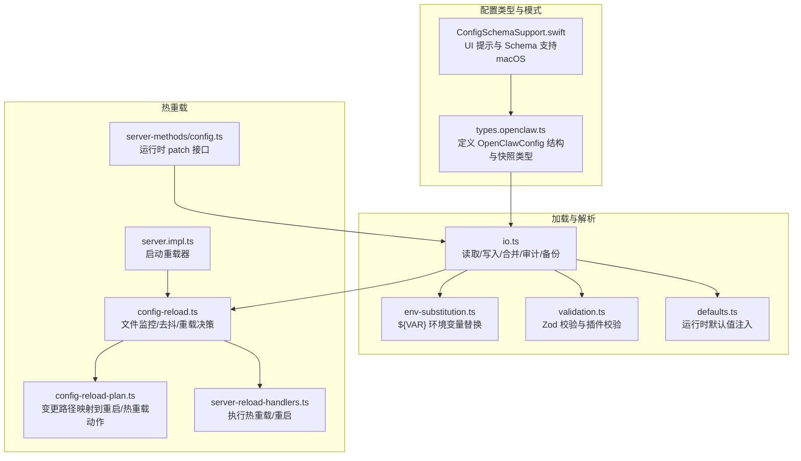
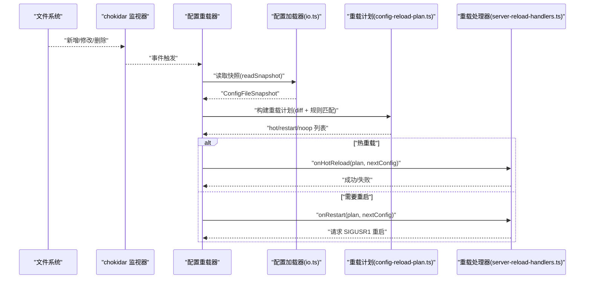
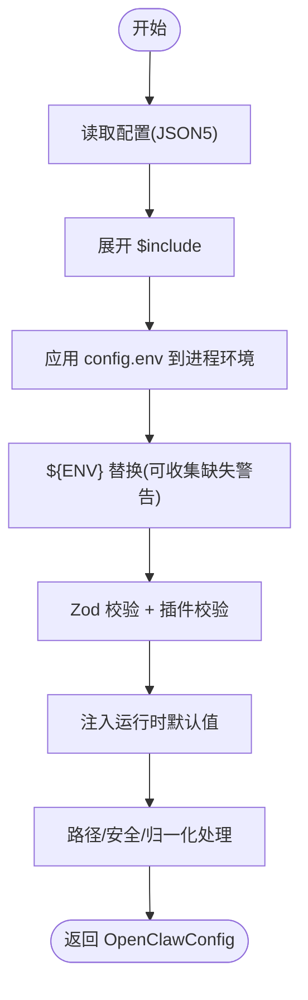
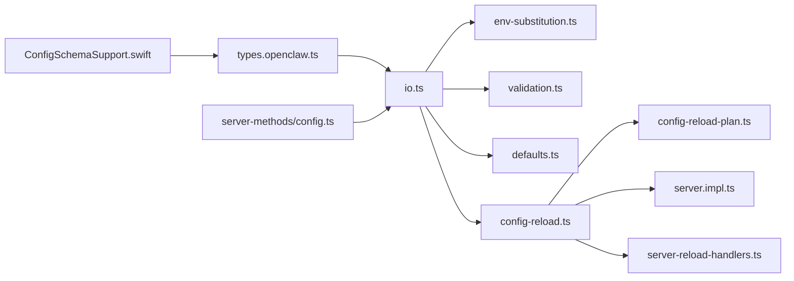

# 配置管理系统

<cite>
**本文引用的文件**
- [src/config/types.openclaw.ts](file://src/config/types.openclaw.ts)
- [src/config/io.ts](file://src/config/io.ts)
- [src/config/env-substitution.ts](file://src/config/env-substitution.ts)
- [src/config/validation.ts](file://src/config/validation.ts)
- [src/config/defaults.ts](file://src/config/defaults.ts)
- [src/gateway/config-reload.ts](file://src/gateway/config-reload.ts)
- [src/gateway/config-reload-plan.ts](file://src/gateway/config-reload-plan.ts)
- [src/gateway/server.impl.ts](file://src/gateway/server.impl.ts)
- [src/gateway/server-reload-handlers.ts](file://src/gateway/server-reload-handlers.ts)
- [src/gateway/server-methods/config.ts](file://src/gateway/server-methods/config.ts)
- [src/commands/doctor-config-analysis.ts](file://src/commands/doctor-config-analysis.ts)
- [apps/macos/Sources/OpenClaw/ConfigSchemaSupport.swift](file://apps/macos/Sources/OpenClaw/ConfigSchemaSupport.swift)
- [src/agents/skills/env-overrides.ts](file://src/agents/skills/env-overrides.ts)
- [src/commands/daemon-install-helpers.test.ts](file://src/commands/daemon-install-helpers.test.ts)
</cite>

## 目录
1. [简介](#简介)
2. [项目结构](#项目结构)
3. [核心组件](#核心组件)
4. [架构总览](#架构总览)
5. [详细组件分析](#详细组件分析)
6. [依赖关系分析](#依赖关系分析)
7. [性能考量](#性能考量)
8. [故障排除指南](#故障排除指南)
9. [结论](#结论)
10. [附录](#附录)

## 简介
本文件系统化阐述 OpenClaw 的配置管理系统，覆盖配置加载、验证与热重载机制；详述配置文件格式、参数定义与默认值处理；解释配置变更检测、增量更新与回滚策略；给出配置优先级规则、环境变量覆盖与运行时配置调整方法；并提供配置安全性与敏感信息处理建议，以及面向管理员的优化与排障实践。

## 项目结构
OpenClaw 的配置管理由“类型与模式”“加载与解析”“验证与默认值”“热重载与应用”四大模块协同完成，并通过网关服务集成到运行时生命周期中。

图示来源
- [src/config/types.openclaw.ts:1-155](file://src/config/types.openclaw.ts#L1-L155)
- [src/config/io.ts:1-800](file://src/config/io.ts#L1-L800)
- [src/config/env-substitution.ts:1-204](file://src/config/env-substitution.ts#L1-L204)
- [src/config/validation.ts:1-605](file://src/config/validation.ts#L1-L605)
- [src/config/defaults.ts:1-537](file://src/config/defaults.ts#L1-L537)
- [src/gateway/config-reload.ts:1-248](file://src/gateway/config-reload.ts#L1-L248)
- [src/gateway/config-reload-plan.ts:1-216](file://src/gateway/config-reload-plan.ts#L1-L216)
- [src/gateway/server.impl.ts:982-1013](file://src/gateway/server.impl.ts#L982-L1013)
- [src/gateway/server-reload-handlers.ts:138-201](file://src/gateway/server-reload-handlers.ts#L138-L201)
- [src/gateway/server-methods/config.ts:352-398](file://src/gateway/server-methods/config.ts#L352-L398)
- [apps/macos/Sources/OpenClaw/ConfigSchemaSupport.swift:1-64](file://apps/macos/Sources/OpenClaw/ConfigSchemaSupport.swift#L1-L64)

章节来源
- [src/config/types.openclaw.ts:1-155](file://src/config/types.openclaw.ts#L1-L155)
- [src/config/io.ts:1-800](file://src/config/io.ts#L1-L800)
- [src/gateway/config-reload.ts:1-248](file://src/gateway/config-reload.ts#L1-L248)

## 核心组件
- 配置类型与快照：统一的 OpenClawConfig 类型与 ConfigFileSnapshot 快照，承载原始/解析后/最终配置及校验结果。
- 加载与解析：读取 JSON5 配置，展开 $include，执行 ${ENV} 替换，收集缺失环境变量警告，进行 Zod 校验与插件校验，注入运行时默认值。
- 热重载：基于 chokidar 监控配置文件变化，去抖后对比变更路径，构建重载计划，按策略执行热重载或重启。
- 运行时配置调整：提供 patch 接口，支持 JSON5 合并补丁，结合 schema 与插件校验，保证写回安全。

章节来源
- [src/config/types.openclaw.ts:125-154](file://src/config/types.openclaw.ts#L125-L154)
- [src/config/io.ts:725-832](file://src/config/io.ts#L725-L832)
- [src/gateway/config-reload.ts:150-215](file://src/gateway/config-reload.ts#L150-L215)
- [src/gateway/server-methods/config.ts:352-398](file://src/gateway/server-methods/config.ts#L352-L398)

## 架构总览
下图展示从配置文件到运行时生效的关键流程：文件监控 → 读取与解析 → 校验与默认值 → 变更检测 → 重载计划 → 应用与回滚。

图示来源
- [src/gateway/config-reload.ts:217-234](file://src/gateway/config-reload.ts#L217-L234)
- [src/gateway/config-reload.ts:184-215](file://src/gateway/config-reload.ts#L184-L215)
- [src/gateway/config-reload-plan.ts:142-215](file://src/gateway/config-reload-plan.ts#L142-L215)
- [src/gateway/server-reload-handlers.ts:149-201](file://src/gateway/server-reload-handlers.ts#L149-L201)

## 详细组件分析

### 配置文件格式与参数定义
- 文件格式：JSON5，支持注释与尾随逗号；$include 可递归引入外部片段；${ENV} 占位符在加载阶段替换。
- 参数定义：OpenClawConfig 覆盖认证、代理、消息、模型、通道、网关、内存、UI 等全量领域配置；并通过 Zod Schema 严格约束。
- 兼容性：提供遗留问题扫描与迁移工具，避免使用已弃用键。

章节来源
- [src/config/io.ts:663-672](file://src/config/io.ts#L663-L672)
- [src/config/io.ts:680-718](file://src/config/io.ts#L680-L718)
- [src/config/types.openclaw.ts:31-123](file://src/config/types.openclaw.ts#L31-L123)
- [src/config/validation.ts:229-286](file://src/config/validation.ts#L229-L286)

### 环境变量覆盖与安全
- 占位符语法：仅识别大写/下划线命名的环境变量；支持转义输出原样 `${}`。
- 缺失处理：可选择抛出异常或记录警告并保留占位符；用于非关键功能不阻断启动。
- 安全限制：对技能环境变量覆盖进行白名单/黑名单控制，阻止可能影响宿主行为的危险键；安装计划中会剔除空值与危险选项。

章节来源
- [src/config/env-substitution.ts:27-86](file://src/config/env-substitution.ts#L27-L86)
- [src/config/env-substitution.ts:197-204](file://src/config/env-substitution.ts#L197-L204)
- [src/agents/skills/env-overrides.ts:33-84](file://src/agents/skills/env-overrides.ts#L33-L84)
- [src/commands/daemon-install-helpers.test.ts:143-204](file://src/commands/daemon-install-helpers.test.ts#L143-L204)

### 默认值处理与运行时注入
- 默认值来源：模型、代理、会话、日志、上下文修剪、心跳等多维度默认值按需注入。
- 注入时机：在验证前进行，确保写回文件时不污染原始配置；同时在运行时根据进程环境与 shell fallback 补齐。

章节来源
- [src/config/defaults.ts:146-170](file://src/config/defaults.ts#L146-L170)
- [src/config/defaults.ts:213-347](file://src/config/defaults.ts#L213-L347)
- [src/config/io.ts:797-832](file://src/config/io.ts#L797-L832)

### 配置加载与验证流程

图示来源
- [src/config/io.ts:734-832](file://src/config/io.ts#L734-L832)
- [src/config/validation.ts:308-382](file://src/config/validation.ts#L308-L382)
- [src/config/defaults.ts:1-537](file://src/config/defaults.ts#L1-L537)

### 配置变更检测与热重载
- 变更检测：递归比较前后配置，生成变更路径集合；数组结构以深比较避免误报。
- 重载策略：依据 gateway.reload.mode（off/hot/restart/hybrid）与重载计划决定是否热重载或重启。
- 去抖与并发：chokidar 监听文件事件，按 debounceMs 去抖；运行中再次触发标记 pending，结束后再调度。
- 错误与回退：热重载失败时回滚至先前密钥快照；重启检查失败则保留重载器继续等待后续变更。

章节来源
- [src/gateway/config-reload.ts:23-52](file://src/gateway/config-reload.ts#L23-L52)
- [src/gateway/config-reload.ts:54-66](file://src/gateway/config-reload.ts#L54-L66)
- [src/gateway/config-reload.ts:150-182](file://src/gateway/config-reload.ts#L150-L182)
- [src/gateway/config-reload.ts:184-215](file://src/gateway/config-reload.ts#L184-L215)
- [src/gateway/server.impl.ts:982-1013](file://src/gateway/server.impl.ts#L982-L1013)
- [src/gateway/server-reload-handlers.ts:149-201](file://src/gateway/server-reload-handlers.ts#L149-L201)

### 重载计划与动作映射
- 规则体系：内置基础规则与通道插件贡献的规则；变更路径命中规则映射为 restart/hot/noop。
- 动作集合：包括重启钩子、Gmail 监视器、浏览器控制、定时任务、心跳、健康监控、各通道重启等。
- 未命中规则：默认视为需要重启网关。

章节来源
- [src/gateway/config-reload-plan.ts:36-98](file://src/gateway/config-reload-plan.ts#L36-L98)
- [src/gateway/config-reload-plan.ts:103-131](file://src/gateway/config-reload-plan.ts#L103-L131)
- [src/gateway/config-reload-plan.ts:142-215](file://src/gateway/config-reload-plan.ts#L142-L215)

### 运行时配置调整（patch）
- 接口能力：接收 JSON5 对象补丁，合并到当前配置，经 schema 与插件校验后写回。
- 写回安全：支持 unsetPaths 清理字段；记录写入审计；校验基线哈希防止并发覆盖。
- UI/Schema 支持：macOS 端提供 UI 提示与 Schema 查找能力，辅助可视化配置。

章节来源
- [src/gateway/server-methods/config.ts:352-398](file://src/gateway/server-methods/config.ts#L352-L398)
- [src/config/io.ts:1256-1286](file://src/config/io.ts#L1256-L1286)
- [apps/macos/Sources/OpenClaw/ConfigSchemaSupport.swift:1-64](file://apps/macos/Sources/OpenClaw/ConfigSchemaSupport.swift#L1-L64)

### 配置优先级与覆盖规则
- 文件优先级：按候选路径查找首个存在文件；不存在时可启用 shell fallback 导入期望键。
- 环境变量优先级：config.env 中的键先于进程环境参与 ${ENV} 替换；随后再应用进程环境。
- 运行时覆盖：支持 runtime-overrides 与 applyConfigOverrides；注意与默认值注入的顺序。

章节来源
- [src/config/io.ts:734-748](file://src/config/io.ts#L734-L748)
- [src/config/env-substitution.ts:701-717](file://src/config/env-substitution.ts#L701-L717)
- [src/config/io.ts:821-832](file://src/config/io.ts#L821-L832)

### 安全性与敏感信息处理
- 敏感字段标注：Schema 支持敏感标记，便于 UI/审计提示。
- 日志脱敏：默认对工具调用等敏感内容进行脱敏。
- 环境变量安全：禁止技能覆盖可能影响宿主执行行为的键；安装计划剔除空值与危险选项。
- 写回审计：记录写入事件、哈希、字节数、可疑变更原因，便于审计与回溯。

章节来源
- [src/gateway/protocol/schema/config.ts:53-100](file://src/gateway/protocol/schema/config.ts#L53-L100)
- [src/config/defaults.ts:390-405](file://src/config/defaults.ts#L390-L405)
- [src/agents/skills/env-overrides.ts:79-84](file://src/agents/skills/env-overrides.ts#L79-L84)
- [src/commands/daemon-install-helpers.test.ts:143-204](file://src/commands/daemon-install-helpers.test.ts#L143-L204)
- [src/config/io.ts:567-581](file://src/config/io.ts#L567-L581)
- [src/config/io.ts:538-565](file://src/config/io.ts#L538-L565)

## 依赖关系分析

图示来源
- [src/config/types.openclaw.ts:1-155](file://src/config/types.openclaw.ts#L1-L155)
- [src/config/io.ts:1-800](file://src/config/io.ts#L1-L800)
- [src/gateway/config-reload.ts:1-248](file://src/gateway/config-reload.ts#L1-L248)
- [src/gateway/config-reload-plan.ts:1-216](file://src/gateway/config-reload-plan.ts#L1-L216)
- [src/gateway/server.impl.ts:982-1013](file://src/gateway/server.impl.ts#L982-L1013)
- [src/gateway/server-reload-handlers.ts:138-201](file://src/gateway/server-reload-handlers.ts#L138-L201)
- [src/gateway/server-methods/config.ts:352-398](file://src/gateway/server-methods/config.ts#L352-L398)
- [apps/macos/Sources/OpenClaw/ConfigSchemaSupport.swift:1-64](file://apps/macos/Sources/OpenClaw/ConfigSchemaSupport.swift#L1-L64)

## 性能考量
- 去抖与节流：重载器按 debounceMs 去抖，避免频繁写入与重启；文件监控 awaitWriteFinish 避免写入中途读取。
- 变更粒度：仅对变更路径进行重载决策，减少不必要的重启。
- 并发控制：运行中再次触发标记 pending，避免并发重载导致状态混乱。
- I/O 优化：写回审计与备份轮换在后台异步进行，不影响主流程。

章节来源
- [src/gateway/config-reload.ts:217-234](file://src/gateway/config-reload.ts#L217-L234)
- [src/gateway/config-reload.ts:184-215](file://src/gateway/config-reload.ts#L184-L215)

## 故障排除指南
- 配置无效/校验失败：查看错误详情与允许值提示；修复后重试；必要时使用 doctor 工具清理未知键。
- 环境变量缺失：确认占位符命名规范与设置；对非关键项可启用 onMissing 回调保留占位符。
- 热重载失败：系统会回滚密钥快照；检查变更路径是否命中重启规则；观察日志中的重载原因。
- 重启未发生：确认存在 SIGUSR1 监听；检查活动队列/回复/嵌入运行是否阻塞重启。
- 写回异常：检查写入审计记录与可疑原因；核对基线哈希与 unsetPaths。

章节来源
- [src/commands/doctor-config-analysis.ts:37-69](file://src/commands/doctor-config-analysis.ts#L37-L69)
- [src/config/env-substitution.ts:29-37](file://src/config/env-substitution.ts#L29-L37)
- [src/gateway/server-reload-handlers.ts:149-201](file://src/gateway/server-reload-handlers.ts#L149-L201)
- [src/config/io.ts:1256-1286](file://src/config/io.ts#L1256-L1286)

## 结论
OpenClaw 的配置管理系统以强类型与严格校验为基础，结合环境变量替换、运行时默认值注入与热重载机制，实现了高可靠、可观测且可演进的配置生命周期。通过明确的变更检测与动作映射，系统在保证稳定性的同时提供了灵活的运行时调整能力。管理员应重视环境变量安全、写回审计与变更粒度，以获得最佳的运维体验。

## 附录
- 配置文件位置：按候选路径查找，不存在时可启用 shell fallback。
- 写回安全：支持 unsetPaths、基线哈希校验与审计记录。
- UI/Schema：macOS 端提供 UI 提示与 Schema 查找，辅助可视化配置。

章节来源
- [src/config/io.ts:635-640](file://src/config/io.ts#L635-L640)
- [src/config/io.ts:1256-1286](file://src/config/io.ts#L1256-L1286)
- [apps/macos/Sources/OpenClaw/ConfigSchemaSupport.swift:1-64](file://apps/macos/Sources/OpenClaw/ConfigSchemaSupport.swift#L1-L64)