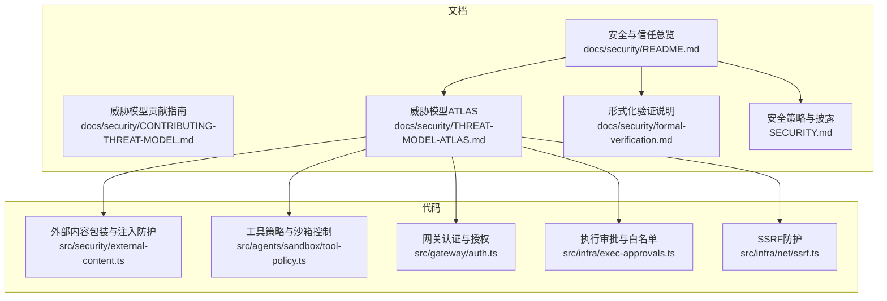
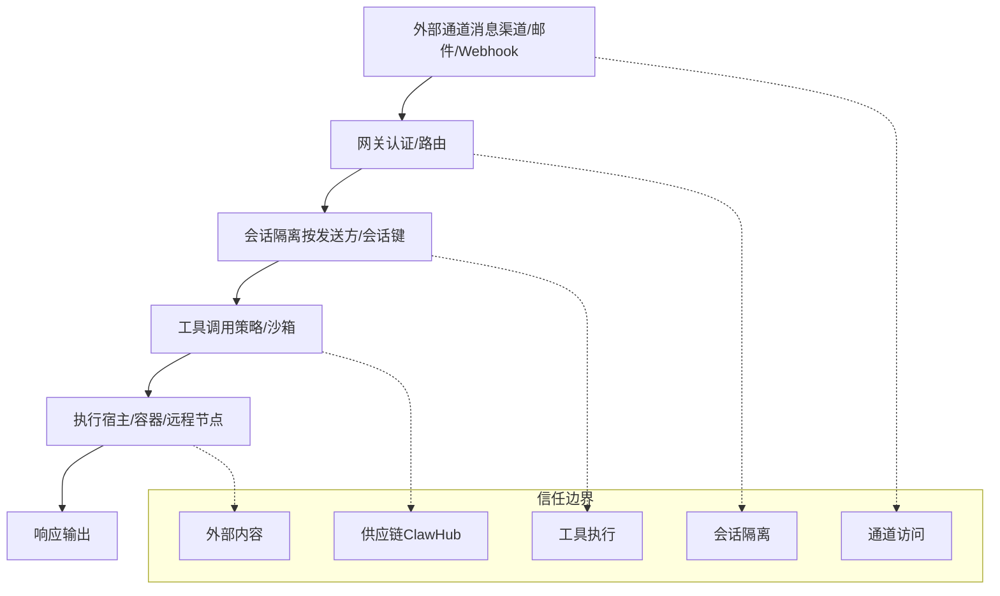
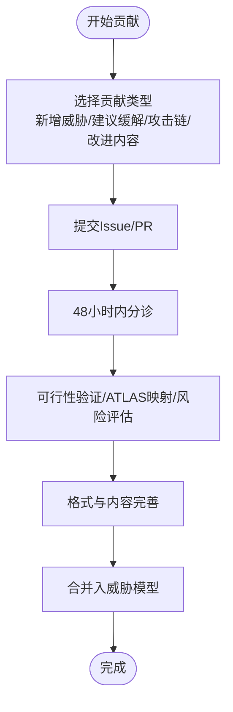
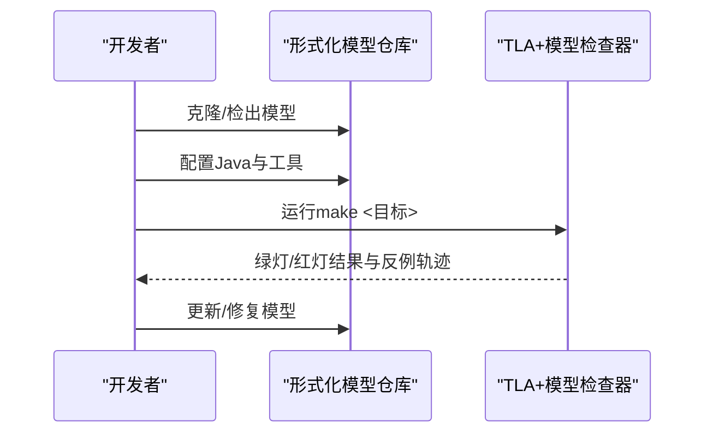
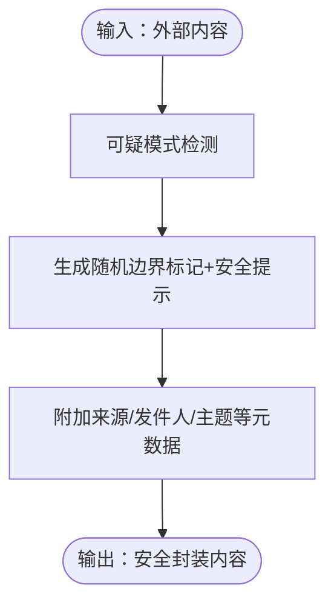
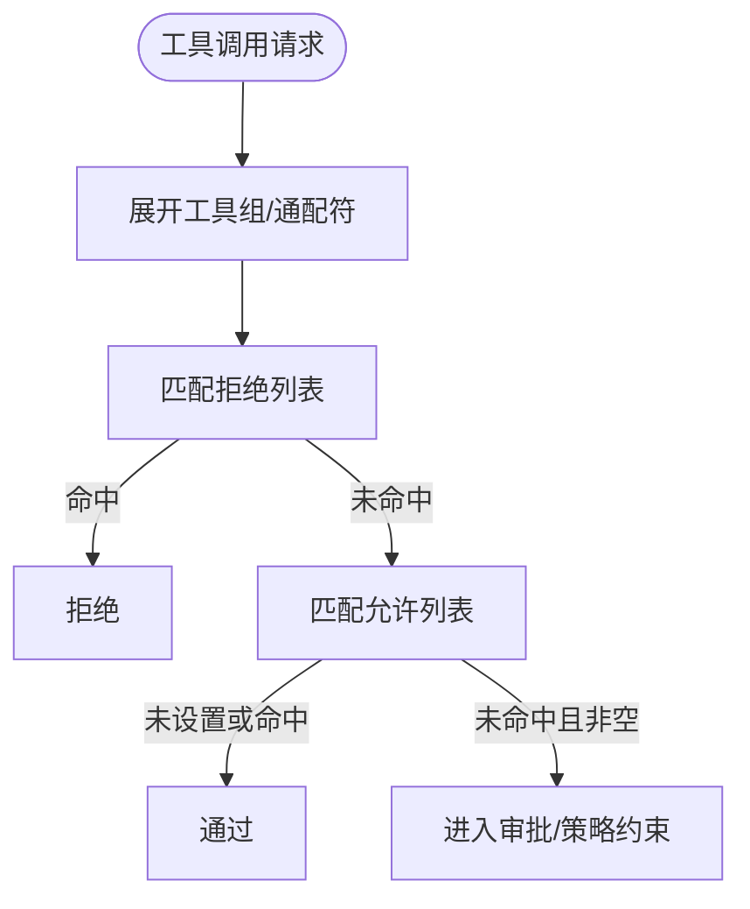
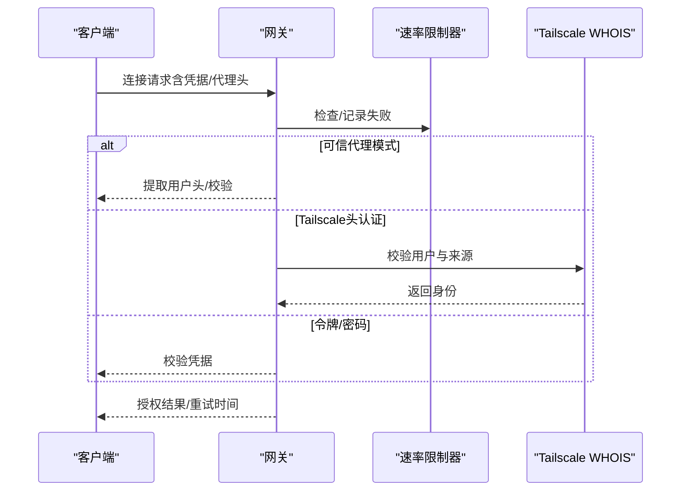
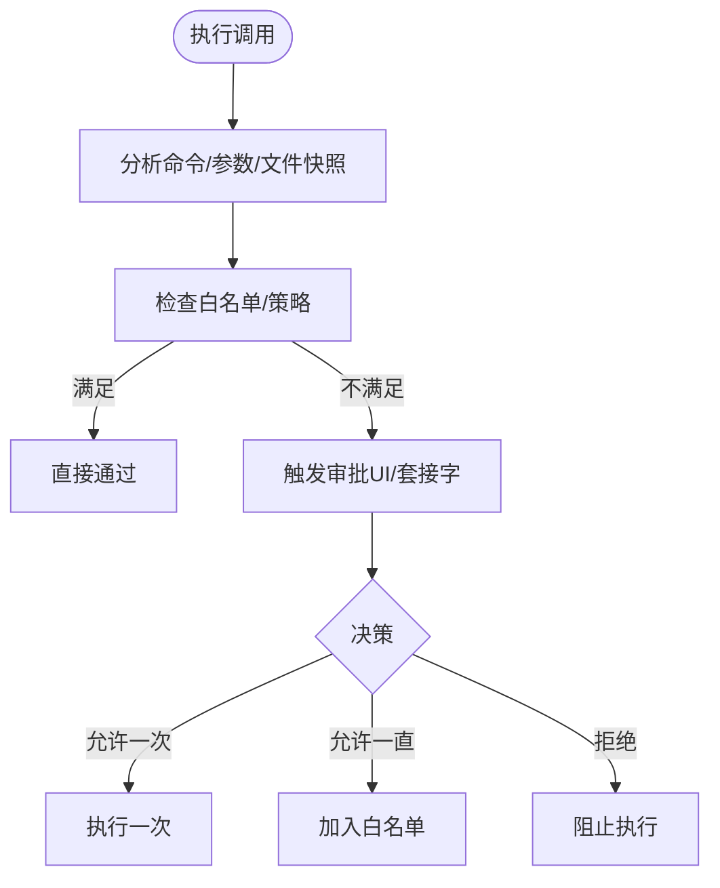
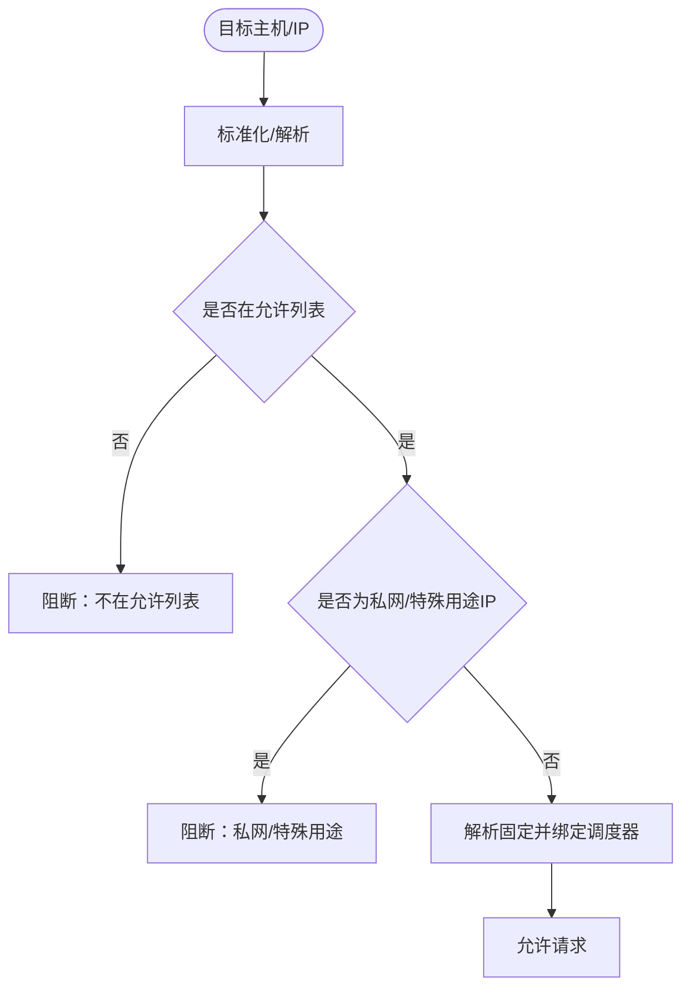
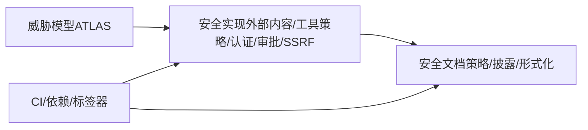

# 合规与安全

<cite>
**本文引用的文件**
- [docs/security/README.md](file://docs/security/README.md)
- [docs/security/CONTRIBUTING-THREAT-MODEL.md](file://docs/security/CONTRIBUTING-THREAT-MODEL.md)
- [docs/security/THREAT-MODEL-ATLAS.md](file://docs/security/THREAT-MODEL-ATLAS.md)
- [docs/security/formal-verification.md](file://docs/security/formal-verification.md)
- [SECURITY.md](file://SECURITY.md)
- [src/security/external-content.ts](file://src/security/external-content.ts)
- [src/agents/sandbox/tool-policy.ts](file://src/agents/sandbox/tool-policy.ts)
- [src/gateway/auth.ts](file://src/gateway/auth.ts)
- [src/infra/exec-approvals.ts](file://src/infra/exec-approvals.ts)
- [src/infra/net/ssrf.ts](file://src/infra/net/ssrf.ts)
- [.github/actionlint.yaml](file://.github/actionlint.yaml)
- [.github/dependabot.yml](file://.github/dependabot.yml)
- [.github/labeler.yml](file://.github/labeler.yml)
</cite>

## 目录
1. [引言](#引言)
2. [项目结构](#项目结构)
3. [核心组件](#核心组件)
4. [架构总览](#架构总览)
5. [详细组件分析](#详细组件分析)
6. [依赖关系分析](#依赖关系分析)
7. [性能考量](#性能考量)
8. [故障排查指南](#故障排查指南)
9. [结论](#结论)
10. [附录](#附录)

## 引言
本文件面向OpenClaw合规与安全部门，系统化梳理威胁建模、安全验证、合规要求与治理实践，覆盖形式化验证、安全测试与风险评估流程，以及安全策略制定、合规监控与审计机制。同时提供安全基线配置、漏洞扫描与渗透测试指导，并给出事件响应计划、安全监控与告警机制，帮助安全团队生成合规报告、进行安全度量与持续改进。

## 项目结构
OpenClaw在文档与代码层面均建立了完善的安全与合规体系：
- 文档层：安全与信任文档、威胁模型（MITRE ATLAS）、形式化验证说明、漏洞披露与安全策略
- 代码层：外部内容包装与注入防护、工具策略与沙箱控制、网关认证与授权、执行审批与白名单、SSRF防护等

图表来源
- [docs/security/README.md:1-18](file://docs/security/README.md#L1-L18)
- [docs/security/THREAT-MODEL-ATLAS.md:1-604](file://docs/security/THREAT-MODEL-ATLAS.md#L1-L604)
- [docs/security/formal-verification.md:1-168](file://docs/security/formal-verification.md#L1-L168)
- [SECURITY.md:1-288](file://SECURITY.md#L1-L288)
- [src/security/external-content.ts:1-346](file://src/security/external-content.ts#L1-L346)
- [src/agents/sandbox/tool-policy.ts:1-110](file://src/agents/sandbox/tool-policy.ts#L1-L110)
- [src/gateway/auth.ts:1-504](file://src/gateway/auth.ts#L1-L504)
- [src/infra/exec-approvals.ts:1-590](file://src/infra/exec-approvals.ts#L1-L590)
- [src/infra/net/ssrf.ts:1-364](file://src/infra/net/ssrf.ts#L1-L364)

章节来源
- [docs/security/README.md:1-18](file://docs/security/README.md#L1-L18)
- [docs/security/THREAT-MODEL-ATLAS.md:1-604](file://docs/security/THREAT-MODEL-ATLAS.md#L1-L604)
- [docs/security/formal-verification.md:1-168](file://docs/security/formal-verification.md#L1-L168)
- [SECURITY.md:1-288](file://SECURITY.md#L1-L288)

## 核心组件
- 威胁建模与贡献流程：基于MITRE ATLAS的威胁模型，支持新增威胁、建议缓解措施、攻击链组合与内容改进；提供审查流程与资源链接。
- 形式化验证：以TLA+/TLC为载体的安全回归套件，覆盖网关暴露、节点执行流水线、配对存储、入口防护、路由隔离等关键路径。
- 安全策略与披露：明确漏洞上报渠道、报告要素、可接受门槛、常见误报模式、信任模型与部署假设、运行时要求与安全扫描。
- 外部内容处理：检测可疑模式、生成随机边界标记、注入安全提示、统一外源标签与元数据，降低LLM受注入影响的风险。
- 工具策略与沙箱：基于通配符的允许/拒绝策略解析，全局与代理级优先级，图像工具默认放行，确保多模态工作流可用性与安全性。
- 网关认证与授权：支持令牌/密码/可信代理/Tailscale头认证，速率限制、本地直连判定、用户身份提取与校验。
- 执行审批与白名单：命令参数绑定快照、文件操作快照、交互式审批、套接字通信、超时与持久化，降低高危命令执行风险。
- SSRF防护：主机名/IP白名单、私有网络豁免策略、解析固定与调度器绑定、阻断特殊用途地址与保留范围。

章节来源
- [docs/security/CONTRIBUTING-THREAT-MODEL.md:1-91](file://docs/security/CONTRIBUTING-THREAT-MODEL.md#L1-L91)
- [docs/security/THREAT-MODEL-ATLAS.md:1-604](file://docs/security/THREAT-MODEL-ATLAS.md#L1-L604)
- [docs/security/formal-verification.md:1-168](file://docs/security/formal-verification.md#L1-L168)
- [SECURITY.md:1-288](file://SECURITY.md#L1-L288)
- [src/security/external-content.ts:1-346](file://src/security/external-content.ts#L1-L346)
- [src/agents/sandbox/tool-policy.ts:1-110](file://src/agents/sandbox/tool-policy.ts#L1-L110)
- [src/gateway/auth.ts:1-504](file://src/gateway/auth.ts#L1-L504)
- [src/infra/exec-approvals.ts:1-590](file://src/infra/exec-approvals.ts#L1-L590)
- [src/infra/net/ssrf.ts:1-364](file://src/infra/net/ssrf.ts#L1-L364)

## 架构总览
下图展示OpenClaw安全边界与数据流，映射到威胁模型中的信任分界与关键防护点。

图表来源
- [docs/security/THREAT-MODEL-ATLAS.md:56-123](file://docs/security/THREAT-MODEL-ATLAS.md#L56-L123)

章节来源
- [docs/security/THREAT-MODEL-ATLAS.md:56-123](file://docs/security/THREAT-MODEL-ATLAS.md#L56-L123)

## 详细组件分析

### 威胁建模与贡献流程
- 方法论：采用MITRE ATLAS框架，结合数据流图，识别侦察、初始访问、执行、持久化、防御规避、发现、采集与泄露、影响等战术面威胁。
- 贡献方式：新增威胁、建议缓解、提出攻击链、修复与改进现有内容；使用ATLAS编号与风险等级（低/中/高/严重）。
- 审查流程：分阶段triage、评估、文档化、合并；提供资源与联系方式。
- 风险矩阵与关键路径：汇总威胁概率与影响，形成优先级（P0/P1/P2），并给出典型攻击链（如“技能型数据窃取”“提示注入到RCE”“间接注入经由抓取内容”）。

图表来源
- [docs/security/CONTRIBUTING-THREAT-MODEL.md:68-74](file://docs/security/CONTRIBUTING-THREAT-MODEL.md#L68-L74)

章节来源
- [docs/security/CONTRIBUTING-THREAT-MODEL.md:1-91](file://docs/security/CONTRIBUTING-THREAT-MODEL.md#L1-L91)
- [docs/security/THREAT-MODEL-ATLAS.md:485-527](file://docs/security/THREAT-MODEL-ATLAS.md#L485-L527)

### 形式化验证（TLA+/TLC）
- 目标：以可执行模型证明关键安全属性（授权、会话隔离、工具门禁、误配置安全），在显式假设下进行边界检查。
- 模型位置：独立仓库维护；提供可复现实验步骤与Make目标。
- 关键模型覆盖：
  - 网关暴露与误配置
  - 节点执行流水线（含批准令牌）
  - 配对存储（TTL与上限）
  - 入口门禁（提及/控制命令绕过）
  - 路由与会话隔离
  - 并发/重试/追踪一致性（后续模型）

图表来源
- [docs/security/formal-verification.md:27-54](file://docs/security/formal-verification.md#L27-L54)
- [docs/security/formal-verification.md:56-98](file://docs/security/formal-verification.md#L56-L98)
- [docs/security/formal-verification.md:99-168](file://docs/security/formal-verification.md#L99-L168)

章节来源
- [docs/security/formal-verification.md:1-168](file://docs/security/formal-verification.md#L1-L168)

### 外部内容处理与注入防护
- 功能要点：可疑模式检测、随机边界标记、安全提示注入、来源标签与元数据、标记清理与同形夹击防护、Web抓取/搜索包装。
- 场景价值：在LLM处理前对邮件、Webhook、API、浏览器、Web搜索/抓取内容进行安全封装，降低提示注入与边界逃逸风险。

图表来源
- [src/security/external-content.ts:17-45](file://src/security/external-content.ts#L17-L45)
- [src/security/external-content.ts:239-265](file://src/security/external-content.ts#L239-L265)
- [src/security/external-content.ts:338-345](file://src/security/external-content.ts#L338-L345)

章节来源
- [src/security/external-content.ts:1-346](file://src/security/external-content.ts#L1-L346)

### 工具策略与沙箱控制
- 策略解析：支持代理级与全局允许/拒绝列表，组展开与通配符匹配，图像工具默认放行以保障多模态能力。
- 优先级与来源：明确allow/deny来源（代理/全局/默认），便于审计与溯源。
- 实践建议：最小权限原则，严格拒绝高危工具，必要时启用沙箱模式。

图表来源
- [src/agents/sandbox/tool-policy.ts:16-33](file://src/agents/sandbox/tool-policy.ts#L16-L33)
- [src/agents/sandbox/tool-policy.ts:35-109](file://src/agents/sandbox/tool-policy.ts#L35-L109)

章节来源
- [src/agents/sandbox/tool-policy.ts:1-110](file://src/agents/sandbox/tool-policy.ts#L1-L110)

### 网关认证与授权
- 支持模式：无/令牌/密码/可信代理/Tailscale头认证；默认令牌模式，支持环境变量与覆盖。
- 速率限制：共享密钥作用域，失败计数与重试时间；本地直连请求特判。
- 用户身份：可信代理提取用户头，Tailscale头校验与WHOIS核验，避免伪造。
- 安全建议：生产环境绑定回环或强认证，避免公网暴露；WS控制界面启用Tailscale头认证需谨慎。

图表来源
- [src/gateway/auth.ts:217-292](file://src/gateway/auth.ts#L217-L292)
- [src/gateway/auth.ts:378-485](file://src/gateway/auth.ts#L378-L485)

章节来源
- [src/gateway/auth.ts:1-504](file://src/gateway/auth.ts#L1-L504)

### 执行审批与白名单
- 决策维度：ask策略（从不/缺失时/总是）、安全级别（禁止/允许清单/全开）、自动放行技能开关。
- 绑定与快照：命令参数、工作目录、环境哈希、可变文件操作快照，防止重放与越权。
- 交互与持久化：套接字通信、超时控制、文件权限保护、持久化存储与哈希校验。
- 建议：默认“允许清单+缺失时询问”，严格拒绝高危命令；启用沙箱作为兜底。

图表来源
- [src/infra/exec-approvals.ts:484-496](file://src/infra/exec-approvals.ts#L484-L496)
- [src/infra/exec-approvals.ts:525-545](file://src/infra/exec-approvals.ts#L525-L545)
- [src/infra/exec-approvals.ts:559-589](file://src/infra/exec-approvals.ts#L559-L589)

章节来源
- [src/infra/exec-approvals.ts:1-590](file://src/infra/exec-approvals.ts#L1-L590)

### SSRF防护
- 主机名校验：允许列表与通配符匹配，阻断localhost/local/internal与特殊用途域名后缀。
- IP解析与固定：解析固定、调度器连接绑定、IPv4/IPv6特殊用途地址阻断、遗留/非规范IPv4字面量阻断。
- 策略开关：私网豁免、危险私网允许、基准测试范围豁免、显式允许主机集。
- 建议：默认仅允许公开可解析主机，严格限制内部网络访问。

图表来源
- [src/infra/net/ssrf.ts:276-330](file://src/infra/net/ssrf.ts#L276-L330)
- [src/infra/net/ssrf.ts:332-356](file://src/infra/net/ssrf.ts#L332-L356)

章节来源
- [src/infra/net/ssrf.ts:1-364](file://src/infra/net/ssrf.ts#L1-L364)

## 依赖关系分析
- 文档与代码耦合：威胁模型驱动安全实现（外部内容包装、工具策略、认证授权、执行审批、SSRF），代码实现反过来支撑威胁模型的可验证性与落地。
- 工作流与治理：GitHub Actions配置、依赖更新策略、标签器自动分类，提升安全相关变更的可见性与可追溯性。

图表来源
- [docs/security/THREAT-MODEL-ATLAS.md:1-604](file://docs/security/THREAT-MODEL-ATLAS.md#L1-L604)
- [SECURITY.md:1-288](file://SECURITY.md#L1-L288)
- [.github/actionlint.yaml:1-24](file://.github/actionlint.yaml#L1-L24)
- [.github/dependabot.yml:1-128](file://.github/dependabot.yml#L1-L128)
- [.github/labeler.yml:1-259](file://.github/labeler.yml#L1-L259)

章节来源
- [.github/actionlint.yaml:1-24](file://.github/actionlint.yaml#L1-L24)
- [.github/dependabot.yml:1-128](file://.github/dependabot.yml#L1-L128)
- [.github/labeler.yml:1-259](file://.github/labeler.yml#L1-L259)

## 性能考量
- 形式化模型：受限于状态空间探索，绿灯不代表全场景安全，需结合假设与边界条件评估。
- 认证与审批：速率限制与哈希计算、套接字通信存在CPU/IO开销，建议合理配置阈值与缓存。
- SSRF：DNS解析与调度器绑定带来额外延迟，建议在允许列表内预热解析与固定调度器。
- 外部内容：标记替换与正则匹配成本可控，建议在上游进行必要的预过滤。

## 故障排查指南
- 漏洞披露与受理：按要求提供标题、严重性、影响、受影响组件、技术复现、演示影响、环境、修复建议；走特定仓库或邮件渠道；提供可复现PoC与版本信息。
- 常见误报：提示注入仅链路、受信任操作员触发、显式受信控制面、已授权用户本地动作、多租户假设、仅启发式差异等通常不构成漏洞。
- 信任模型与部署假设：单用户受信操作员模型、会话标识仅为路由控制、不提供多租户隔离；建议按推荐模式部署（每用户/每VPS/每主机一个网关）。
- 运行时与扫描：Node.js版本与CVE修复、Docker只读与能力裁剪、detect-secrets密钥扫描。

章节来源
- [SECURITY.md:5-67](file://SECURITY.md#L5-L67)
- [SECURITY.md:88-132](file://SECURITY.md#L88-L132)
- [SECURITY.md:133-161](file://SECURITY.md#L133-L161)
- [SECURITY.md:207-288](file://SECURITY.md#L207-L288)

## 结论
OpenClaw在安全与合规方面形成了“文档驱动+代码实现+形式化验证”的闭环：以MITRE ATLAS威胁模型为纲，通过外部内容包装、工具策略、认证授权、执行审批与SSRF防护等实现关键控制点；以TLA+/TLC模型进行边界验证；辅以安全策略、披露流程、依赖与CI治理，构建可审计、可验证、可持续改进的安全体系。

## 附录
- 合规与安全文档索引
  - 威胁模型与贡献：[docs/security/README.md](file://docs/security/README.md)、[docs/security/CONTRIBUTING-THREAT-MODEL.md](file://docs/security/CONTRIBUTING-THREAT-MODEL.md)、[docs/security/THREAT-MODEL-ATLAS.md](file://docs/security/THREAT-MODEL-ATLAS.md)
  - 形式化验证：[docs/security/formal-verification.md](file://docs/security/formal-verification.md)
  - 安全策略与披露：[SECURITY.md](file://SECURITY.md)
- 关键实现文件
  - 外部内容：[src/security/external-content.ts](file://src/security/external-content.ts)
  - 工具策略：[src/agents/sandbox/tool-policy.ts](file://src/agents/sandbox/tool-policy.ts)
  - 网关认证：[src/gateway/auth.ts](file://src/gateway/auth.ts)
  - 执行审批：[src/infra/exec-approvals.ts](file://src/infra/exec-approvals.ts)
  - SSRF防护：[src/infra/net/ssrf.ts](file://src/infra/net/ssrf.ts)
- CI与治理
  - ActionLint：[.github/actionlint.yaml](file://.github/actionlint.yaml)
  - 依赖更新：[.github/dependabot.yml](file://.github/dependabot.yml)
  - 标签器：[.github/labeler.yml](file://.github/labeler.yml)