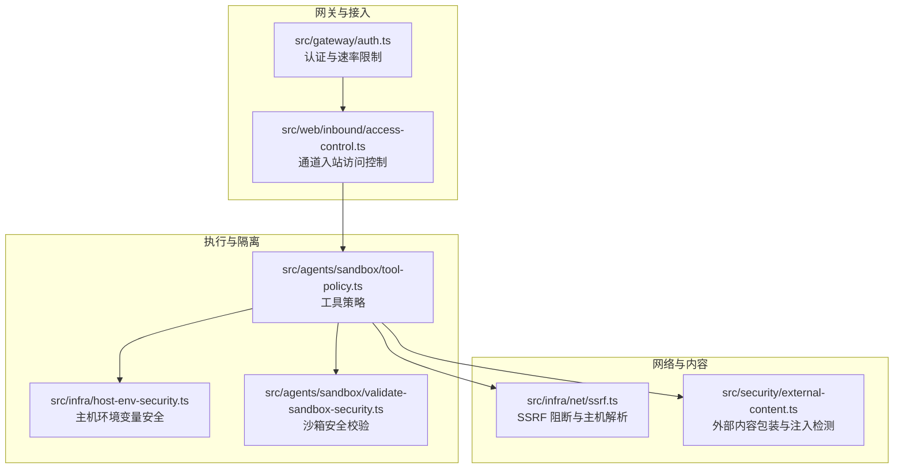
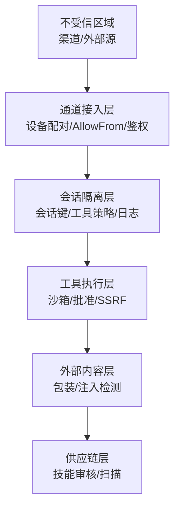
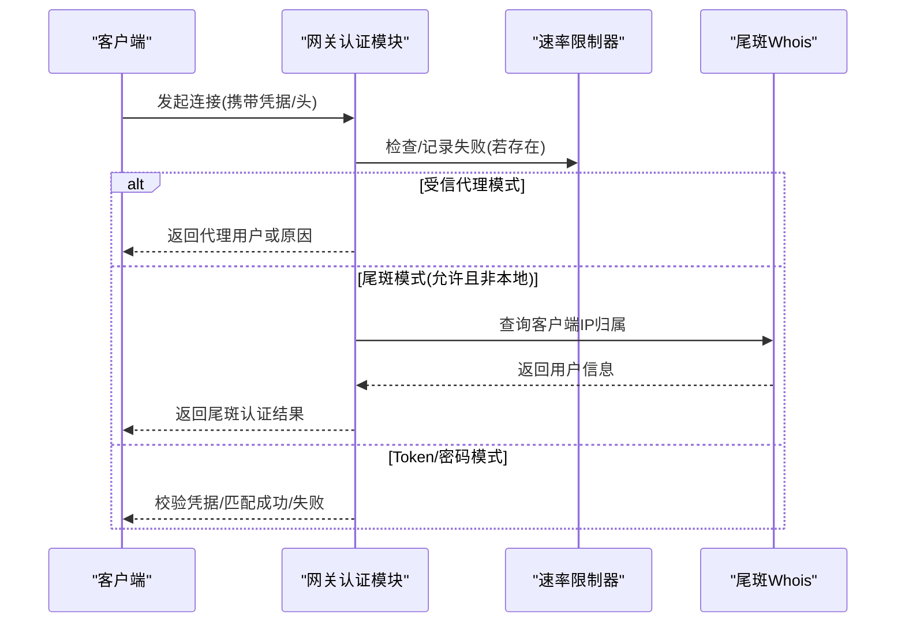
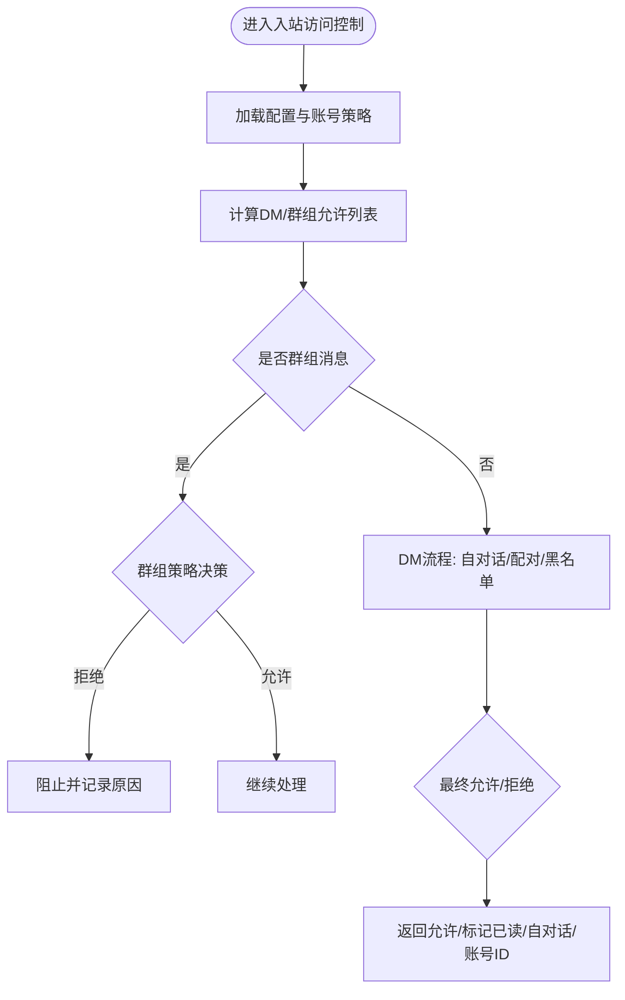
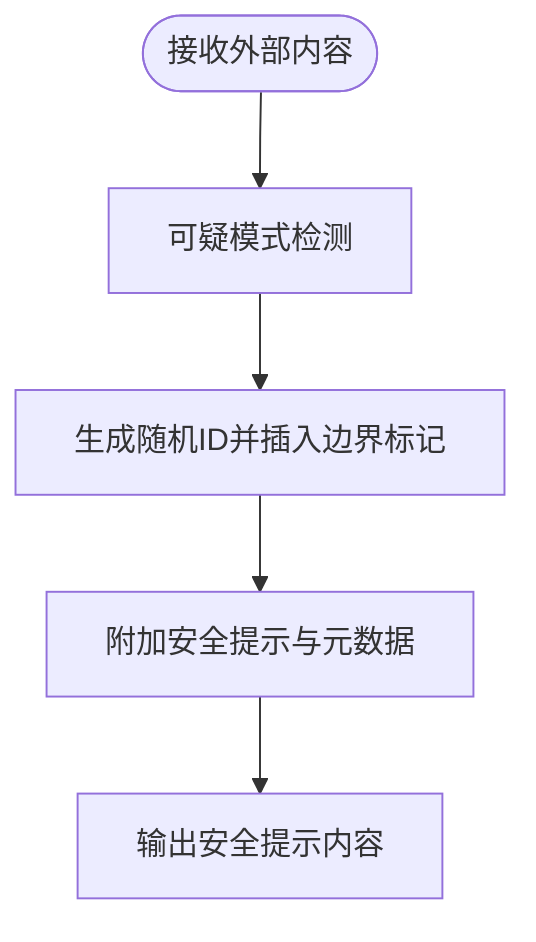
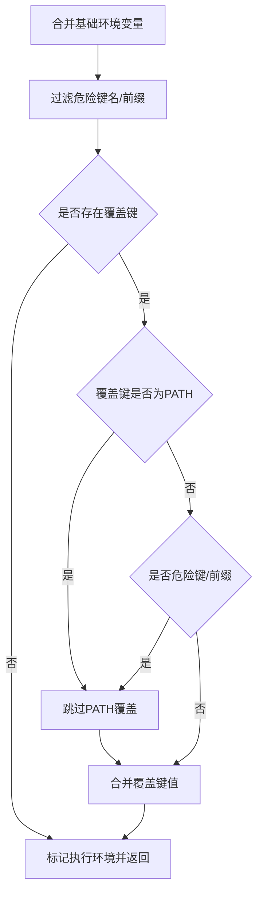
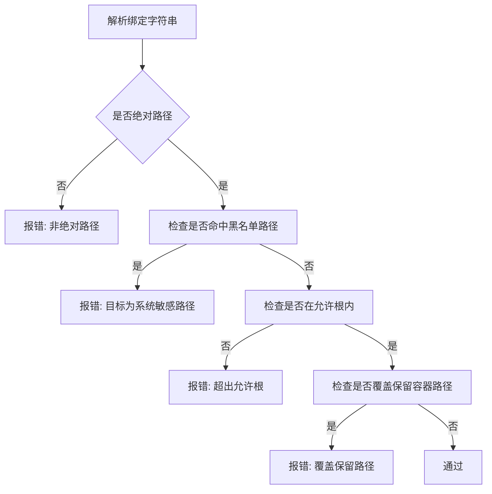
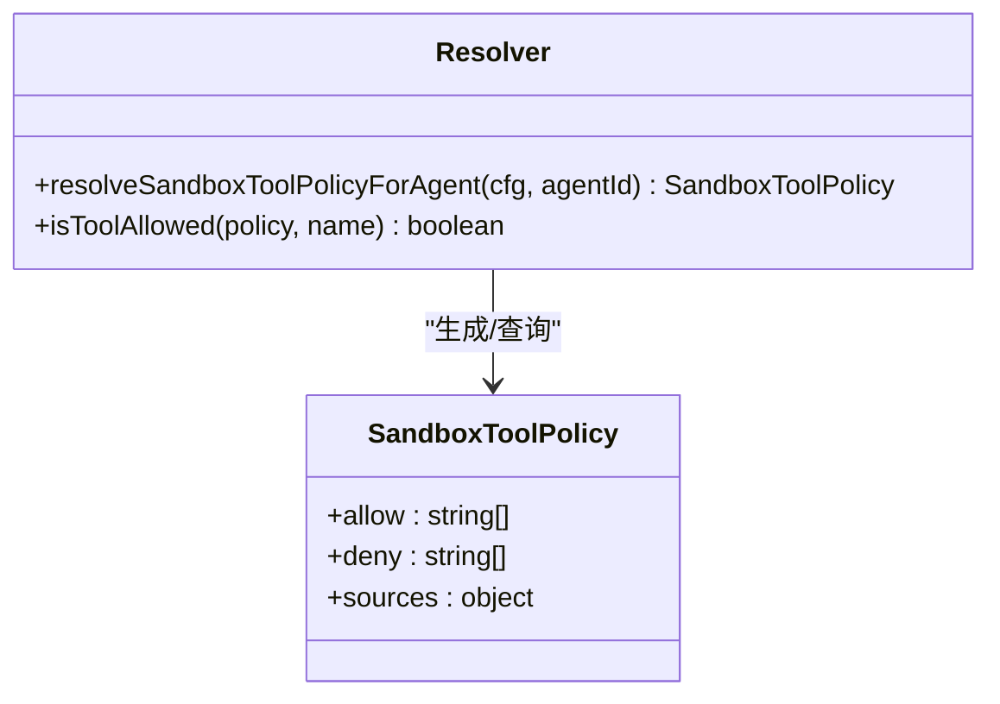
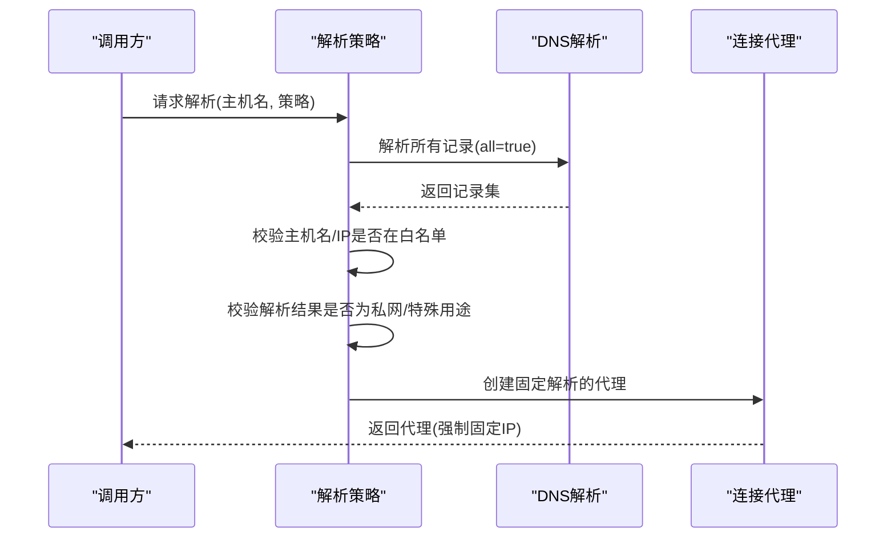
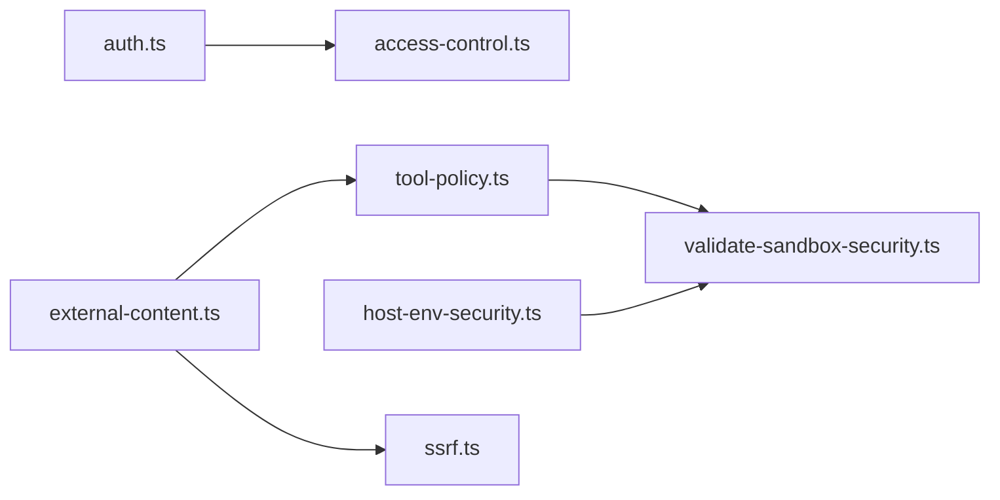

# 安全模型

<cite>
**本文引用的文件**
- [SECURITY.md](file://SECURITY.md)
- [docs/security/README.md](file://docs/security/README.md)
- [docs/security/CONTRIBUTING-THREAT-MODEL.md](file://docs/security/CONTRIBUTING-THREAT-MODEL.md)
- [docs/security/THREAT-MODEL-ATLAS.md](file://docs/security/THREAT-MODEL-ATLAS.md)
- [src/gateway/auth.ts](file://src/gateway/auth.ts)
- [src/web/inbound/access-control.ts](file://src/web/inbound/access-control.ts)
- [src/infra/host-env-security.ts](file://src/infra/host-env-security.ts)
- [src/infra/net/ssrf.ts](file://src/infra/net/ssrf.ts)
- [src/security/external-content.ts](file://src/security/external-content.ts)
- [src/agents/sandbox/tool-policy.ts](file://src/agents/sandbox/tool-policy.ts)
- [src/agents/sandbox/validate-sandbox-security.ts](file://src/agents/sandbox/validate-sandbox-security.ts)
</cite>

## 目录
1. [引言](#引言)
2. [项目结构](#项目结构)
3. [核心组件](#核心组件)
4. [架构总览](#架构总览)
5. [详细组件分析](#详细组件分析)
6. [依赖关系分析](#依赖关系分析)
7. [性能考量](#性能考量)
8. [故障排查指南](#故障排查指南)
9. [结论](#结论)
10. [附录](#附录)

## 引言
本文件系统化梳理 OpenClaw 的安全模型与实现，覆盖整体安全架构理念、威胁模型与安全边界、身份认证与授权、数据与执行隔离、访问控制与工具策略、本地与远程访问安全、跨平台一致性与合规建议，并提供安全策略配置要点、权限矩阵与角色定义、事件处理与响应流程，以及面向开发者与管理员的设计原则与实施指导。

## 项目结构
OpenClaw 将安全能力分布于多层：网关接入层（认证与速率限制）、通道入口控制（DM/群组白名单与配对保护）、外部内容包装与注入防护、主机环境变量与执行边界、容器沙箱与网络隔离、工具调用策略与批准机制等。下图展示关键安全相关模块之间的关系与数据流：

**图表来源**
- [src/gateway/auth.ts:1-504](file://src/gateway/auth.ts#L1-L504)
- [src/web/inbound/access-control.ts:1-228](file://src/web/inbound/access-control.ts#L1-L228)
- [src/infra/host-env-security.ts:1-158](file://src/infra/host-env-security.ts#L1-L158)
- [src/agents/sandbox/validate-sandbox-security.ts:1-344](file://src/agents/sandbox/validate-sandbox-security.ts#L1-L344)
- [src/agents/sandbox/tool-policy.ts:1-110](file://src/agents/sandbox/tool-policy.ts#L1-L110)
- [src/infra/net/ssrf.ts:1-364](file://src/infra/net/ssrf.ts#L1-L364)
- [src/security/external-content.ts:1-346](file://src/security/external-content.ts#L1-L346)

**章节来源**
- [src/gateway/auth.ts:1-504](file://src/gateway/auth.ts#L1-L504)
- [src/web/inbound/access-control.ts:1-228](file://src/web/inbound/access-control.ts#L1-L228)
- [src/infra/host-env-security.ts:1-158](file://src/infra/host-env-security.ts#L1-L158)
- [src/agents/sandbox/validate-sandbox-security.ts:1-344](file://src/agents/sandbox/validate-sandbox-security.ts#L1-L344)
- [src/agents/sandbox/tool-policy.ts:1-110](file://src/agents/sandbox/tool-policy.ts#L1-L110)
- [src/infra/net/ssrf.ts:1-364](file://src/infra/net/ssrf.ts#L1-L364)
- [src/security/external-content.ts:1-346](file://src/security/external-content.ts#L1-L346)

## 核心组件
- 身份认证与速率限制：支持 token/password/trusted-proxy/none 等模式，结合速率限制与尾斑（Tailscale）认证头进行本地直连与受信代理登录。
- 入站访问控制：按账号维度的 DM/群组策略（pairing/allowlist/open/disabled），结合允许列表与配对宽限期，阻断未授权来源。
- 外部内容安全：统一的外部内容包装器，带随机边界标记与安全提示，检测可疑注入模式并进行标记清理。
- 主机环境与执行边界：严格过滤危险环境变量键名与前缀，限制 PATH 覆盖，仅允许有限白名单键用于 shell 包装场景。
- 沙箱与网络隔离：禁止挂载系统敏感路径与 Docker 套接字，拒绝 host/容器命名空间 join 等高危网络模式，阻断 unconfined seccomp/apparmor。
- 工具策略：基于通配与分组的显式 allow/deny 列表，支持按会话/全局/默认策略叠加，确保最小可用工具集。
- SSRF 阻断：严格的主机名/IP 白名单与解析固定，阻断私有/特殊用途地址解析与回退到私网目标。

**章节来源**
- [src/gateway/auth.ts:217-485](file://src/gateway/auth.ts#L217-L485)
- [src/web/inbound/access-control.ts:41-223](file://src/web/inbound/access-control.ts#L41-L223)
- [src/security/external-content.ts:13-45](file://src/security/external-content.ts#L13-L45)
- [src/infra/host-env-security.ts:59-129](file://src/infra/host-env-security.ts#L59-L129)
- [src/agents/sandbox/validate-sandbox-security.ts:16-343](file://src/agents/sandbox/validate-sandbox-security.ts#L16-L343)
- [src/agents/sandbox/tool-policy.ts:16-109](file://src/agents/sandbox/tool-policy.ts#L16-L109)
- [src/infra/net/ssrf.ts:166-330](file://src/infra/net/ssrf.ts#L166-L330)

## 架构总览
OpenClaw 的安全边界采用“信任分层”设计：通道接入层（Trust Boundary 1）负责设备配对与允许列表；会话隔离层（Trust Boundary 2）以会话键隔离上下文；工具执行层（Trust Boundary 3）通过沙箱与批准机制；外部内容层（Trust Boundary 4）对抓取/邮件/Webhook 内容进行包装与注入检测；供应链层（Trust Boundary 5）对技能发布与审核进行治理。下图为 MITRE ATLAS 视角下的信任边界与数据流映射：

**图表来源**
- [docs/security/THREAT-MODEL-ATLAS.md:56-123](file://docs/security/THREAT-MODEL-ATLAS.md#L56-L123)

**章节来源**
- [docs/security/THREAT-MODEL-ATLAS.md:56-135](file://docs/security/THREAT-MODEL-ATLAS.md#L56-L135)

## 详细组件分析

### 组件一：身份认证与授权（Gateway）
- 支持模式：none/token/password/trusted-proxy，默认优先级与覆盖规则由配置与环境变量解析决定。
- 认证结果包含方法（token/password/tailscale/trusted-proxy/none）与可选用户标识；失败时记录速率限制状态。
- 速率限制：按共享密钥作用域统计失败并返回重试时间；对缺失凭据不计为失败尝试。
- 受信代理：要求指定用户头与可选允许用户列表；支持必需请求头校验。
- 尾斑（Tailscale）：在非本地直连且允许时，通过转发头与 Whois 校验用户身份。

**图表来源**
- [src/gateway/auth.ts:378-485](file://src/gateway/auth.ts#L378-L485)

**章节来源**
- [src/gateway/auth.ts:217-485](file://src/gateway/auth.ts#L217-L485)

### 组件二：入站访问控制（Channel Inbound）
- DM/群组策略：支持 pairing/allowlist/open/disabled；默认按账号配置与自对话模式推导。
- 允许列表：支持通配与 E164 归一化；群组消息可独立配置 groupAllowFrom。
- 配对宽限期：在配对宽限期内自动下发挑战码并抑制历史消息回复。
- 结果：返回是否允许、是否标记已读、是否自对话、解析后的账号ID。

**图表来源**
- [src/web/inbound/access-control.ts:41-223](file://src/web/inbound/access-control.ts#L41-L223)

**章节来源**
- [src/web/inbound/access-control.ts:41-223](file://src/web/inbound/access-control.ts#L41-L223)

### 组件三：外部内容包装与注入检测
- 注入检测：识别常见提示注入模式（忽略先前指令、系统标签、命令执行等）。
- 包装策略：使用随机唯一边界标记与安全提示块，标注来源、发件人、主题等元数据。
- 标记清理：对伪造/同形异义标记进行折叠与替换，避免边界逃逸。
- Web 抓取包装：针对 web_fetch 提供更严格的安全提示。

**图表来源**
- [src/security/external-content.ts:13-45](file://src/security/external-content.ts#L13-L45)
- [src/security/external-content.ts:239-265](file://src/security/external-content.ts#L239-L265)

**章节来源**
- [src/security/external-content.ts:1-346](file://src/security/external-content.ts#L1-L346)

### 组件四：主机环境与执行边界
- 危险键名/前缀阻断：基于策略 JSON 中的黑名单与前缀集合，过滤进程环境。
- PATH 覆盖限制：默认不允许覆盖 PATH，防止命令解析被劫持。
- Shell 包装白名单：仅允许 TERM/LANG/LC_* 等有限键，降低注入面。
- 执行环境标记：对最终执行环境打标，便于审计与追踪。

**图表来源**
- [src/infra/host-env-security.ts:83-129](file://src/infra/host-env-security.ts#L83-L129)

**章节来源**
- [src/infra/host-env-security.ts:1-158](file://src/infra/host-env-security.ts#L1-L158)

### 组件五：沙箱与网络隔离
- 绑定挂载校验：禁止挂载系统根、/proc、/sys、/dev、/run*、/var/run*、/root、/boot 等；禁止覆盖保留容器路径（如 /workspace）。
- 来源根校验：支持允许根集合与祖先路径解析，防止符号链接逃逸绕过。
- 网络模式阻断：拒绝 host 与容器命名空间 join；seccomp/apparmor 不得设为 unconfined。
- 运行时错误格式化：对违规绑定/网络/安全配置给出明确错误信息与修复建议。

**图表来源**
- [src/agents/sandbox/validate-sandbox-security.ts:96-227](file://src/agents/sandbox/validate-sandbox-security.ts#L96-L227)

**章节来源**
- [src/agents/sandbox/validate-sandbox-security.ts:1-344](file://src/agents/sandbox/validate-sandbox-security.ts#L1-L344)

### 组件六：工具策略与批准
- 工具策略：支持按会话/全局/默认的 allow/deny 列表，展开工具分组，保证图像类工具在沙箱中可用。
- 批准机制：配合 exec-approvals 对危险命令进行拦截或交互确认，作为“受信任操作员”的额外护栏。

**图表来源**
- [src/agents/sandbox/tool-policy.ts:35-109](file://src/agents/sandbox/tool-policy.ts#L35-L109)

**章节来源**
- [src/agents/sandbox/tool-policy.ts:1-110](file://src/agents/sandbox/tool-policy.ts#L1-L110)

### 组件七：SSRF 阻断与主机解析
- 主机名/IP 白名单：仅允许显式允许的主机名模式（支持通配后缀），阻断 localhost/local/internal 与特殊用途地址。
- 解析固定：对解析结果进行二次校验，避免公共域名回退到私网地址。
- 专用调度器：基于固定解析结果创建连接代理，强制走预设 IP。

**图表来源**
- [src/infra/net/ssrf.ts:276-330](file://src/infra/net/ssrf.ts#L276-L330)

**章节来源**
- [src/infra/net/ssrf.ts:1-364](file://src/infra/net/ssrf.ts#L1-L364)

## 依赖关系分析
- 认证与通道控制：auth.ts 与 access-control.ts 协作，前者负责接入层鉴权与速率限制，后者负责渠道侧的来源与会话边界。
- 外部内容与工具策略：external-content.ts 产出安全提示内容，经工具策略与批准机制共同约束工具调用面。
- 执行边界与沙箱：host-env-security.ts 与 validate-sandbox-security.ts 分别从环境与容器层面加固执行边界。
- 网络与内容：ssrf.ts 保障抓取链路的公网可达性与安全性，避免 SSRF 回退至私网。

**图表来源**
- [src/gateway/auth.ts:1-504](file://src/gateway/auth.ts#L1-L504)
- [src/web/inbound/access-control.ts:1-228](file://src/web/inbound/access-control.ts#L1-L228)
- [src/security/external-content.ts:1-346](file://src/security/external-content.ts#L1-L346)
- [src/agents/sandbox/tool-policy.ts:1-110](file://src/agents/sandbox/tool-policy.ts#L1-L110)
- [src/agents/sandbox/validate-sandbox-security.ts:1-344](file://src/agents/sandbox/validate-sandbox-security.ts#L1-L344)
- [src/infra/host-env-security.ts:1-158](file://src/infra/host-env-security.ts#L1-L158)
- [src/infra/net/ssrf.ts:1-364](file://src/infra/net/ssrf.ts#L1-L364)

**章节来源**
- [src/gateway/auth.ts:1-504](file://src/gateway/auth.ts#L1-L504)
- [src/web/inbound/access-control.ts:1-228](file://src/web/inbound/access-control.ts#L1-L228)
- [src/security/external-content.ts:1-346](file://src/security/external-content.ts#L1-L346)
- [src/agents/sandbox/tool-policy.ts:1-110](file://src/agents/sandbox/tool-policy.ts#L1-L110)
- [src/agents/sandbox/validate-sandbox-security.ts:1-344](file://src/agents/sandbox/validate-sandbox-security.ts#L1-L344)
- [src/infra/host-env-security.ts:1-158](file://src/infra/host-env-security.ts#L1-L158)
- [src/infra/net/ssrf.ts:1-364](file://src/infra/net/ssrf.ts#L1-L364)

## 性能考量
- 认证与速率限制：对缺失凭据不计入失败尝试，减少误判；合理设置作用域与重试时间，避免热点 IP 被误伤。
- 外部内容包装：随机 ID 与边界标记开销极低；可疑模式检测为轻量正则扫描，建议在上游缓存与批量处理场景中复用结果。
- 沙箱校验：路径规范化与祖先解析在高并发下应避免重复 I/O；允许根集合建议预编译与去重。
- SSRF 解析：固定解析与代理复用可显著降低 DNS 泄漏风险与连接抖动。

[本节为通用指导，无需具体文件分析]

## 故障排查指南
- 认证失败
  - 检查凭据类型与来源（配置/环境变量/覆盖）；确认速率限制状态与重试时间。
  - 受信代理：核对代理头、用户头与允许用户列表。
  - 尾斑：确认非本地直连且转发头完整，Whois 返回一致。
- 入站被拒
  - 核对 DM/群组策略与允许列表；检查配对宽限期内的历史消息抑制逻辑。
- 外部内容异常
  - 检查可疑模式检测日志与边界标记清理结果；确认来源标签与安全提示是否正确插入。
- 沙箱启动失败
  - 查看绑定挂载错误（非绝对路径/超出允许根/覆盖保留路径）与网络模式阻断原因。
- SSRF 解析失败
  - 核对主机名/IP 是否在白名单；检查解析结果是否回退到私网地址。

**章节来源**
- [src/gateway/auth.ts:415-485](file://src/gateway/auth.ts#L415-L485)
- [src/web/inbound/access-control.ts:149-223](file://src/web/inbound/access-control.ts#L149-L223)
- [src/security/external-content.ts:239-303](file://src/security/external-content.ts#L239-L303)
- [src/agents/sandbox/validate-sandbox-security.ts:196-227](file://src/agents/sandbox/validate-sandbox-security.ts#L196-L227)
- [src/infra/net/ssrf.ts:291-330](file://src/infra/net/ssrf.ts#L291-L330)

## 结论
OpenClaw 的安全模型以“个人助理”为核心信任假设，强调“受信任操作员”与“最小可用工具集”，并通过多层边界与纵深防御（认证、通道控制、外部内容包装、主机与容器隔离、工具策略与批准）实现对提示注入、供应链污染、命令执行越权与 SSRF 等关键威胁的有效缓解。建议在生产部署中遵循安全基线（如默认只监听回环、启用速率限制、限制工具集、开启沙箱与批准、严格外部内容包装与解析固定），并持续完善供应链与运行时治理。

[本节为总结，无需具体文件分析]

## 附录

### 安全策略配置要点
- 网关认证
  - 默认优先级：配置覆盖环境变量；当 mode 为 token 且未配置 token 时，若允许尾斑则可降级；password 模式需明文或环境变量解析。
  - 速率限制：按共享密钥作用域统计失败；对缺失凭据不计失败。
  - 受信代理：必须配置用户头与可选允许用户列表；必需头校验。
- 通道入站
  - DM/群组策略：pairing/allowlist/open/disabled；默认按账号配置与自对话推导。
  - 允许列表：支持通配与 E164 归一化；群组可独立 groupAllowFrom。
- 外部内容
  - 包装：随机边界标记 + 安全提示 + 元数据；web_fetch 增强提示。
  - 注入检测：记录可疑模式以便监控。
- 主机与执行
  - 环境变量：阻断危险键名/前缀；默认不允许覆盖 PATH；shell 包装仅允许有限白名单键。
- 沙箱
  - 绑定：禁止系统敏感路径与 Docker 套接字；禁止覆盖保留容器路径；允许根集合与祖先解析。
  - 网络：拒绝 host 与容器命名空间 join；seccomp/apparmor 不得为 unconfined。
- 工具策略
  - 显式 allow/deny；按会话/全局/默认叠加；保证图像工具可用。
- SSRF
  - 主机名/IP 白名单；解析固定；拒绝私网/特殊用途地址。

**章节来源**
- [src/gateway/auth.ts:217-292](file://src/gateway/auth.ts#L217-L292)
- [src/web/inbound/access-control.ts:62-130](file://src/web/inbound/access-control.ts#L62-L130)
- [src/security/external-content.ts:239-303](file://src/security/external-content.ts#L239-L303)
- [src/infra/host-env-security.ts:83-129](file://src/infra/host-env-security.ts#L83-L129)
- [src/agents/sandbox/validate-sandbox-security.ts:234-306](file://src/agents/sandbox/validate-sandbox-security.ts#L234-L306)
- [src/agents/sandbox/tool-policy.ts:35-109](file://src/agents/sandbox/tool-policy.ts#L35-L109)
- [src/infra/net/ssrf.ts:276-330](file://src/infra/net/ssrf.ts#L276-L330)

### 权限矩阵与安全角色
- 受信任操作员（Authenticated Gateway callers）
  - 在网关实例内被视为可信；会话标识仅用于路由，不构成每用户授权边界。
- 插件/扩展
  - 属于网关可信计算基；安装/启用即授予与本地代码同等信任级别。
- 远程节点（Node）
  - 与网关同属一个操作者边界；配对后获得远程能力。
- 外部内容
  - 统一包装与注入检测，不视为可信输入。

**章节来源**
- [SECURITY.md:88-103](file://SECURITY.md#L88-L103)
- [SECURITY.md:104-111](file://SECURITY.md#L104-L111)
- [SECURITY.md:162-171](file://SECURITY.md#L162-L171)

### 安全事件处理与响应
- 威胁建模与报告
  - 使用 MITRE ATLAS 框架记录威胁、攻击链与缓解措施；漏洞报告遵循安全政策与快速分流门禁。
- 运维指引
  - Web 界面仅本地使用；推荐回环绑定与强认证；远程访问建议 SSH 隧道或 Tailscale。
  - Docker 运行建议只读文件系统与能力降级。
- 安全扫描
  - CI/CD 中集成 detect-secrets；提供本地扫描命令与基线管理。

**章节来源**
- [docs/security/CONTRIBUTING-THREAT-MODEL.md:1-91](file://docs/security/CONTRIBUTING-THREAT-MODEL.md#L1-L91)
- [docs/security/THREAT-MODEL-ATLAS.md:505-527](file://docs/security/THREAT-MODEL-ATLAS.md#L505-L527)
- [SECURITY.md:207-288](file://SECURITY.md#L207-L288)

### 设计原则与实施指导
- 最小权限与最小暴露：默认只监听回环；工具集显式声明；沙箱默认启用。
- 多层防御：提示注入检测 + 外部内容包装 + SSRF 固定解析 + 沙箱隔离 + 批准机制。
- 可审计与可观测：速率限制、配对挑战、外部内容标记、沙箱错误格式化、解析固定与白名单。
- 可运营性：提供安全审计 CLI 与修复建议；明确不可利用场景与风险等级。

**章节来源**
- [docs/security/README.md:1-18](file://docs/security/README.md#L1-L18)
- [SECURITY.md:207-245](file://SECURITY.md#L207-L245)