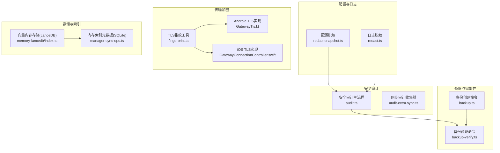
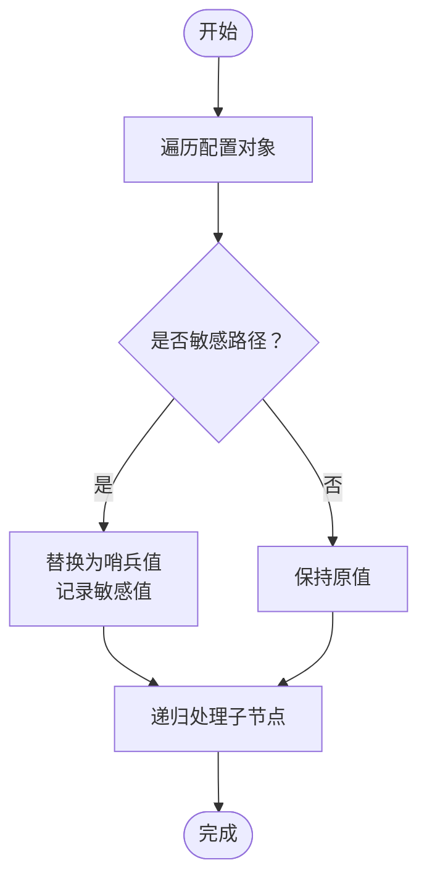
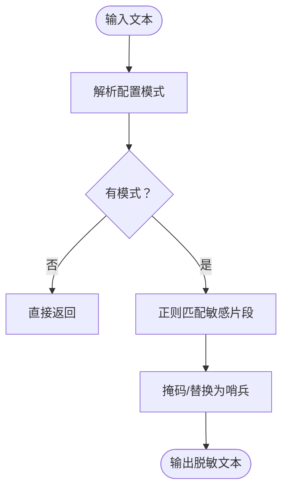
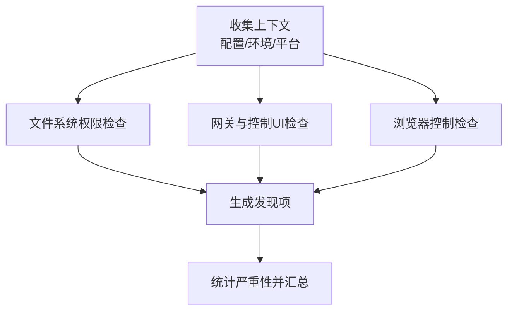
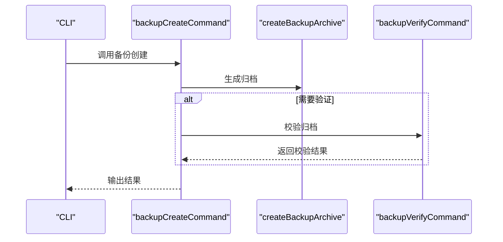
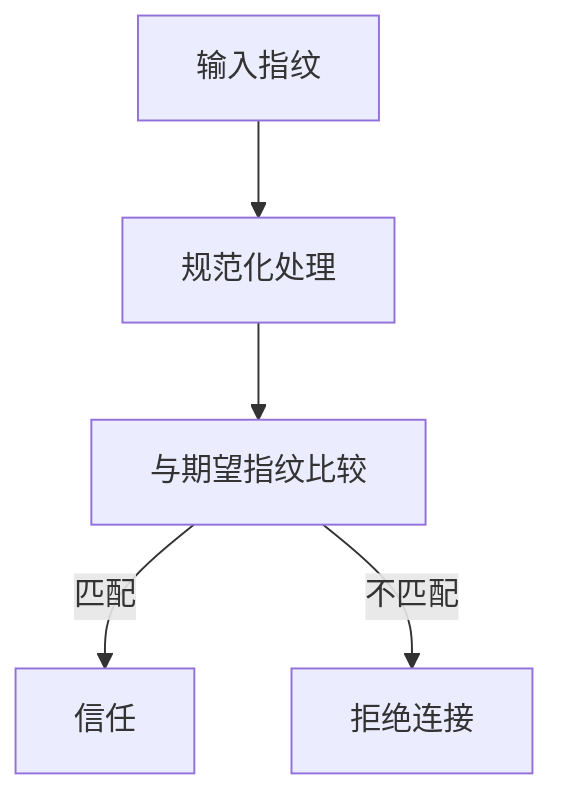
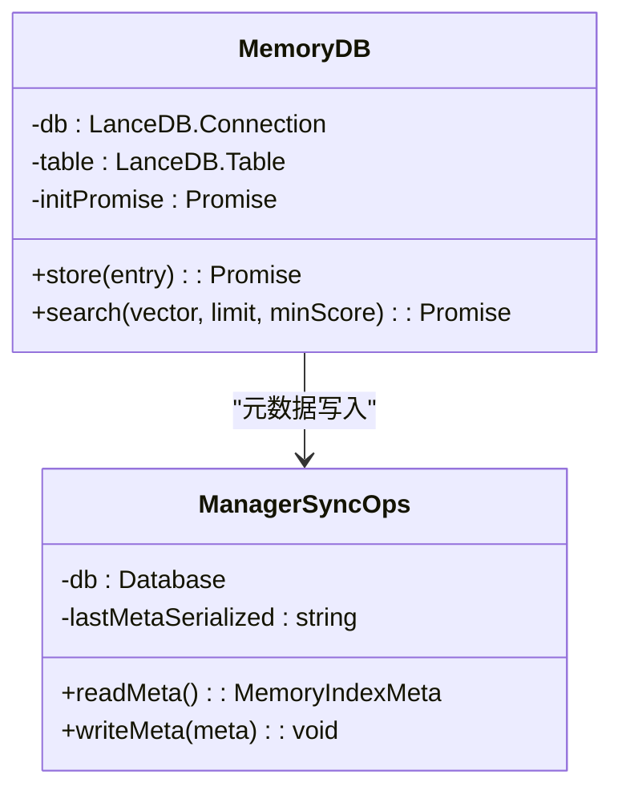
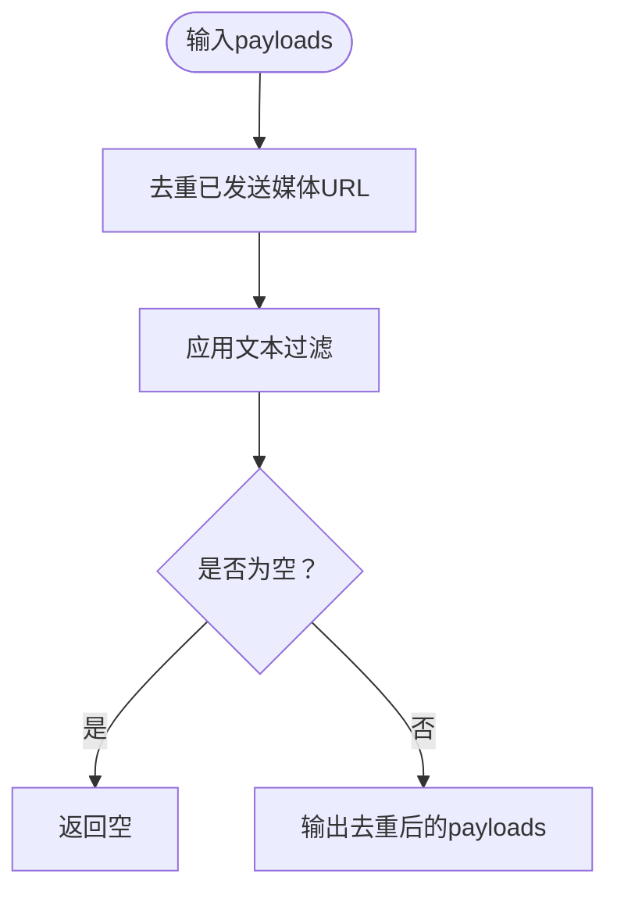
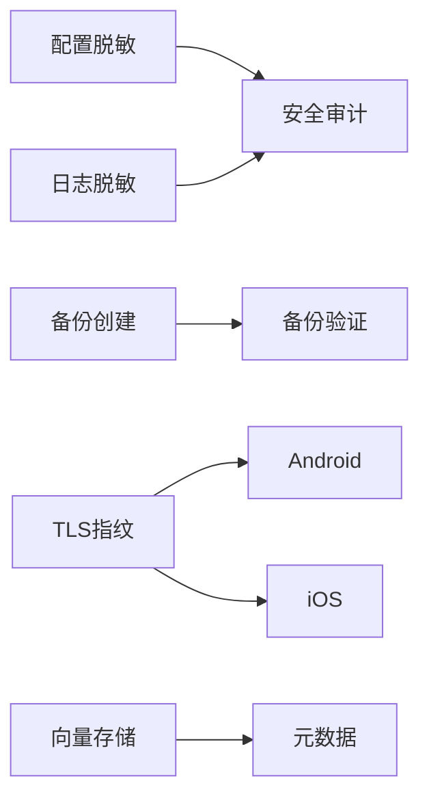

# 数据保护

<cite>
**本文引用的文件**
- [redact-snapshot.ts](file://src/config/redact-snapshot.ts)
- [redact.ts](file://src/logging/redact.ts)
- [audit.ts](file://src/security/audit.ts)
- [audit-extra.sync.ts](file://src/security/audit-extra.sync.ts)
- [backup.ts](file://src/commands/backup.ts)
- [backup-verify.ts](file://src/commands/backup-verify.ts)
- [fingerprint.ts](file://src/infra/tls/fingerprint.ts)
- [GatewayTls.kt](file://apps/android/app/src/main/java/ai/openclaw/app/gateway/GatewayTls.kt)
- [GatewayConnectionController.swift](file://apps/ios/Sources/Gateway/GatewayConnectionController.swift)
- [memory-lancedb/index.ts](file://extensions/memory-lancedb/index.ts)
- [manager-sync-ops.ts](file://src/memory/manager-sync-ops.ts)
- [SECURITY.md](file://SECURITY.md)
</cite>

## 目录
1. [简介](#简介)
2. [项目结构](#项目结构)
3. [核心组件](#核心组件)
4. [架构总览](#架构总览)
5. [详细组件分析](#详细组件分析)
6. [依赖关系分析](#依赖关系分析)
7. [性能考量](#性能考量)
8. [故障排查指南](#故障排查指南)
9. [结论](#结论)
10. [附录](#附录)

## 简介
本文件面向OpenClaw数据保护系统的合规与技术读者，系统化阐述数据加密策略、隐私保护机制、敏感信息处理、消息内容过滤、图像安全检查、媒体文件处理、数据存储与传输加密、静态数据保护、隐私配置选项、数据保留与删除机制、数据完整性验证、备份与恢复、灾难恢复以及合规实施与审计支持。文档以代码级事实为依据，辅以可视化图示帮助理解。

## 项目结构
围绕数据保护的关键模块包括：
- 配置与日志中的敏感信息脱敏与模式匹配（配置脱敏、日志脱敏）
- 安全审计与风险发现（文件权限、网关暴露、代理信任、浏览器控制等）
- 备份与校验（创建、验证、清单一致性）
- 传输层安全（TLS指纹校验与强制）
- 存储与索引（内存向量数据库、SQLite元数据）
- 平台侧TLS实现（Android/iOS）



图表来源
- [redact-snapshot.ts:116-402](file://src/config/redact-snapshot.ts#L116-L402)
- [redact.ts:126-139](file://src/logging/redact.ts#L126-L139)
- [audit.ts:208-337](file://src/security/audit.ts#L208-L337)
- [audit-extra.sync.ts:31-37](file://src/security/audit-extra.sync.ts#L31-L37)
- [backup.ts:11-31](file://src/commands/backup.ts#L11-L31)
- [backup-verify.ts:279-324](file://src/commands/backup-verify.ts#L279-L324)
- [fingerprint.ts:1-5](file://src/infra/tls/fingerprint.ts#L1-L5)
- [GatewayTls.kt:35-66](file://apps/android/app/src/main/java/ai/openclaw/app/gateway/GatewayTls.kt#L35-L66)
- [GatewayConnectionController.swift:496-712](file://apps/ios/Sources/Gateway/GatewayConnectionController.swift#L496-L712)
- [memory-lancedb/index.ts:59-119](file://extensions/memory-lancedb/index.ts#L59-L119)
- [manager-sync-ops.ts:1220-1249](file://src/memory/manager-sync-ops.ts#L1220-L1249)

章节来源
- [redact-snapshot.ts:1-689](file://src/config/redact-snapshot.ts#L1-L689)
- [redact.ts:1-152](file://src/logging/redact.ts#L1-L152)
- [audit.ts:1-800](file://src/security/audit.ts#L1-L800)
- [audit-extra.sync.ts:1-37](file://src/security/audit-extra.sync.ts#L1-L37)
- [backup.ts:1-32](file://src/commands/backup.ts#L1-L32)
- [backup-verify.ts:121-324](file://src/commands/backup-verify.ts#L121-L324)
- [fingerprint.ts:1-5](file://src/infra/tls/fingerprint.ts#L1-L5)
- [GatewayTls.kt:1-159](file://apps/android/app/src/main/java/ai/openclaw/app/gateway/GatewayTls.kt#L1-L159)
- [GatewayConnectionController.swift:496-712](file://apps/ios/Sources/Gateway/GatewayConnectionController.swift#L496-L712)
- [memory-lancedb/index.ts:59-119](file://extensions/memory-lancedb/index.ts#L59-L119)
- [manager-sync-ops.ts:1220-1249](file://src/memory/manager-sync-ops.ts#L1220-L1249)

## 核心组件
- 配置脱敏与还原：对配置对象进行深度遍历，基于Schema提示或路径模式识别敏感字段，替换为哨兵值；在写回前通过原始配置还原真实值，避免Web UI轮询导致凭据丢失。
- 日志脱敏：基于正则模式匹配常见敏感字段（令牌、密钥、密码、PEM块等），对文本进行掩码或片段化处理。
- 安全审计：扫描文件系统权限、网关绑定与认证、反向代理信任、浏览器控制端点、通道安全等，输出严重性分级的发现项。
- 备份与校验：创建归档并可选自动验证，确保清单唯一性、条目规范化、资产计数与运行时版本一致性。
- 传输加密：通过TLS指纹校验与强制策略，结合平台侧实现，确保客户端与网关之间的传输安全。
- 存储与索引：内存向量数据库与SQLite元数据共同构成敏感内容的检索与持久化能力，配合策略限制访问范围。

章节来源
- [redact-snapshot.ts:116-402](file://src/config/redact-snapshot.ts#L116-L402)
- [redact.ts:126-139](file://src/logging/redact.ts#L126-L139)
- [audit.ts:208-687](file://src/security/audit.ts#L208-L687)
- [backup.ts:11-31](file://src/commands/backup.ts#L11-L31)
- [backup-verify.ts:279-324](file://src/commands/backup-verify.ts#L279-L324)
- [fingerprint.ts:1-5](file://src/infra/tls/fingerprint.ts#L1-L5)
- [GatewayTls.kt:35-66](file://apps/android/app/src/main/java/ai/openclaw/app/gateway/GatewayTls.kt#L35-L66)
- [GatewayConnectionController.swift:496-712](file://apps/ios/Sources/Gateway/GatewayConnectionController.swift#L496-L712)
- [memory-lancedb/index.ts:59-119](file://extensions/memory-lancedb/index.ts#L59-L119)
- [manager-sync-ops.ts:1220-1249](file://src/memory/manager-sync-ops.ts#L1220-L1249)

## 架构总览
下图展示从“配置/日志敏感信息”到“安全审计/备份校验/传输加密/存储索引”的整体数据流与保护链路。

```mermaid
sequenceDiagram
participant CFG as "配置对象"
participant SNAP as "配置脱敏<br/>redact-snapshot.ts"
participant LOG as "日志脱敏<br/>redact.ts"
participant AUD as "安全审计<br/>audit.ts"
participant BCK as "备份命令<br/>backup.ts"
participant VER as "备份验证<br/>backup-verify.ts"
participant TLS as "TLS指纹<br/>fingerprint.ts"
participant AND as "Android TLS<br/>GatewayTls.kt"
participant IOS as "iOS TLS<br/>GatewayConnectionController.swift"
CFG->>SNAP : 深度遍历并标记敏感字段
SNAP-->>CFG : 返回带哨兵值的脱敏配置
LOG->>LOG : 正则匹配并掩码敏感文本
AUD->>AUD : 扫描文件权限/网关暴露/代理信任
BCK->>VER : 创建归档后触发校验
TLS->>AND : 规范化指纹并校验
TLS->>IOS : 规范化指纹并校验
```

图表来源
- [redact-snapshot.ts:116-402](file://src/config/redact-snapshot.ts#L116-L402)
- [redact.ts:126-139](file://src/logging/redact.ts#L126-L139)
- [audit.ts:208-687](file://src/security/audit.ts#L208-L687)
- [backup.ts:11-31](file://src/commands/backup.ts#L11-L31)
- [backup-verify.ts:279-324](file://src/commands/backup-verify.ts#L279-L324)
- [fingerprint.ts:1-5](file://src/infra/tls/fingerprint.ts#L1-L5)
- [GatewayTls.kt:35-66](file://apps/android/app/src/main/java/ai/openclaw/app/gateway/GatewayTls.kt#L35-L66)
- [GatewayConnectionController.swift:496-712](file://apps/ios/Sources/Gateway/GatewayConnectionController.swift#L496-L712)

## 详细组件分析

### 配置脱敏与还原（Config Redaction）
- 敏感字段识别：基于Schema提示（ConfigUiHints）或路径模式（如token、password、serviceAccount等）判断敏感路径；数组与对象递归处理。
- 哨兵值替换：使用统一哨兵值替代敏感字符串，避免泄露；对SecretRef结构体仅脱敏id字段。
- 文本级脱敏：对原始JSON5源进行敏感值最长优先替换，保证结构化与文本一致。
- 还原逻辑：写入前根据原始配置恢复被替换的真实值，确保Web UI轮询不破坏凭据。



图表来源
- [redact-snapshot.ts:116-402](file://src/config/redact-snapshot.ts#L116-L402)

章节来源
- [redact-snapshot.ts:116-402](file://src/config/redact-snapshot.ts#L116-L402)

### 日志脱敏（Log Redaction）
- 模式匹配：默认内置多类敏感模式（环境变量赋值、JSON字段、CLI标志、Authorization头、PEM块、常见令牌前缀等）。
- 掩码策略：对令牌按起始/末尾固定长度保留，中间以省略号掩码；PEM块首尾保留并标注“已脱敏”。
- 模式定制：支持从配置读取自定义模式列表，按需启用/禁用。



图表来源
- [redact.ts:126-139](file://src/logging/redact.ts#L126-L139)

章节来源
- [redact.ts:15-152](file://src/logging/redact.ts#L15-L152)

### 安全审计（Security Audit）
- 文件系统：检查状态目录与配置文件权限，识别世界/组可写/可读风险，并给出修复建议。
- 网关与控制界面：检查绑定地址、认证方式（token/password/trusted-proxy）、允许来源、反向代理信任、mDNS模式、Tailscale模式等。
- 浏览器控制：检查远程CDP连接协议与认证缺失风险。
- 同步审计收集器：在无I/O前提下汇总沙箱策略、工具策略、网络模式等配置安全属性。



图表来源
- [audit.ts:208-687](file://src/security/audit.ts#L208-L687)
- [audit-extra.sync.ts:31-37](file://src/security/audit-extra.sync.ts#L31-L37)

章节来源
- [audit.ts:208-687](file://src/security/audit.ts#L208-L687)
- [audit-extra.sync.ts:1-37](file://src/security/audit-extra.sync.ts#L1-L37)

### 备份与校验（Backup & Verify）
- 创建：收集资产清单，打包归档，可选自动验证。
- 验证：校验清单唯一性、条目规范化、资产数量与运行时版本一致性，输出结果摘要。



图表来源
- [backup.ts:11-31](file://src/commands/backup.ts#L11-L31)
- [backup-verify.ts:279-324](file://src/commands/backup-verify.ts#L279-L324)

章节来源
- [backup.ts:11-31](file://src/commands/backup.ts#L11-L31)
- [backup-verify.ts:121-324](file://src/commands/backup-verify.ts#L121-L324)

### 传输加密（TLS指纹）
- 指纹规范化：去除前缀与非十六进制字符，统一大小写。
- Android/iOS实现：在客户端侧实现服务器证书指纹校验，支持首次信任（TOFU）存储与后续严格校验。
- 强制TLS：针对非本地主机域名强制TLS，结合SNI与受信代理策略。



图表来源
- [fingerprint.ts:1-5](file://src/infra/tls/fingerprint.ts#L1-L5)
- [GatewayTls.kt:35-66](file://apps/android/app/src/main/java/ai/openclaw/app/gateway/GatewayTls.kt#L35-L66)
- [GatewayConnectionController.swift:496-712](file://apps/ios/Sources/Gateway/GatewayConnectionController.swift#L496-L712)

章节来源
- [fingerprint.ts:1-5](file://src/infra/tls/fingerprint.ts#L1-L5)
- [GatewayTls.kt:35-66](file://apps/android/app/src/main/java/ai/openclaw/app/gateway/GatewayTls.kt#L35-L66)
- [GatewayConnectionController.swift:496-712](file://apps/ios/Sources/Gateway/GatewayConnectionController.swift#L496-L712)

### 存储与索引（Memory & Vector DB）
- 内存向量数据库：使用LanceDB表存储记忆条目（含向量、重要性、分类、时间戳），初始化时自动创建表并清理临时schema行。
- SQLite元数据：管理索引元信息（如最后序列化值），避免重复写入，确保一致性。
- 访问控制：结合工具策略与工作区限制，减少敏感数据外泄面。



图表来源
- [memory-lancedb/index.ts:59-119](file://extensions/memory-lancedb/index.ts#L59-L119)
- [manager-sync-ops.ts:1220-1249](file://src/memory/manager-sync-ops.ts#L1220-L1249)

章节来源
- [memory-lancedb/index.ts:59-119](file://extensions/memory-lancedb/index.ts#L59-L119)
- [manager-sync-ops.ts:1220-1249](file://src/memory/manager-sync-ops.ts#L1220-L1249)

### 消息内容过滤与媒体处理
- 媒体去重：在自动回复payload构建阶段，基于已发送媒体URL集合过滤重复媒体，必要时清空mediaUrl/mediaUrls字段。
- 文本与媒体顺序：先应用文本过滤，再应用媒体过滤，确保跨目标发送场景下的去重正确性。
- 本地路径等价：对file://与本地绝对路径变体进行等价处理，避免重复发送。



图表来源
- [reply-payloads.test.ts:7-71](file://src/auto-reply/reply/reply-payloads.test.ts#L7-L71)
- [agent-runner-payloads.test.ts:69-110](file://src/auto-reply/reply/agent-runner-payloads.test.ts#L69-L110)

章节来源
- [reply-payloads.test.ts:1-71](file://src/auto-reply/reply/reply-payloads.test.ts#L1-L71)
- [agent-runner-payloads.test.ts:69-110](file://src/auto-reply/reply/agent-runner-payloads.test.ts#L69-L110)

### 隐私配置选项、数据保留与删除
- 配置层面：通过日志脱敏模式与自定义正则、配置脱敏Schema提示控制敏感信息暴露面。
- 数据保留：会话与内存保留策略由配置参数约束（如持续时间、字节上限、归档保留期等），并进行格式校验。
- 删除机制：结合会话修剪与归档清理策略，确保过期数据及时移除。

章节来源
- [redact.ts:108-124](file://src/logging/redact.ts#L108-L124)
- [redact-snapshot.ts:116-144](file://src/config/redact-snapshot.ts#L116-L144)
- [zod-schema.session.ts:92-131](file://src/config/zod-schema.session.ts#L92-L131)

### 数据完整性验证、备份恢复与灾难恢复
- 完整性：备份验证确保清单唯一、条目规范化、资产计数与运行时版本一致。
- 恢复：通过备份命令创建归档，验证通过后可作为可信恢复源。
- 灾难恢复：建议定期执行备份并验证，结合安全审计与TLS指纹策略，确保恢复后系统仍满足最小权限与强认证要求。

章节来源
- [backup.ts:11-31](file://src/commands/backup.ts#L11-L31)
- [backup-verify.ts:279-324](file://src/commands/backup-verify.ts#L279-L324)
- [audit.ts:208-687](file://src/security/audit.ts#L208-L687)

### 合规实施与审计支持
- 报告渠道与要求：明确漏洞报告渠道、所需信息清单、快速分流标准与常见误报模式。
- 受信任模型：强调单用户受托操作员模型、网关与节点的路由与执行边界、插件信任概念与工作区边界。
- 运维建议：工具文件系统加固、子代理委派硬性、Web界面安全建议、Docker安全运行参数等。
- 审计命令：提供深检与修复能力，输出分级发现项与修复建议。

章节来源
- [SECURITY.md:1-288](file://SECURITY.md#L1-L288)
- [audit.ts:87-113](file://src/security/audit.ts#L87-L113)

## 依赖关系分析
- 组件耦合：配置脱敏依赖Schema提示与路径模式；日志脱敏依赖配置与安全正则；安全审计依赖文件系统与网关配置；备份验证依赖清单与归档条目；TLS指纹在平台层实现。
- 外部依赖：Node.js版本要求、Docker安全运行参数、第三方证书与指纹校验库（平台侧）。



图表来源
- [redact-snapshot.ts:116-402](file://src/config/redact-snapshot.ts#L116-L402)
- [redact.ts:126-139](file://src/logging/redact.ts#L126-L139)
- [audit.ts:208-687](file://src/security/audit.ts#L208-L687)
- [backup.ts:11-31](file://src/commands/backup.ts#L11-L31)
- [backup-verify.ts:279-324](file://src/commands/backup-verify.ts#L279-L324)
- [fingerprint.ts:1-5](file://src/infra/tls/fingerprint.ts#L1-L5)
- [GatewayTls.kt:35-66](file://apps/android/app/src/main/java/ai/openclaw/app/gateway/GatewayTls.kt#L35-L66)
- [GatewayConnectionController.swift:496-712](file://apps/ios/Sources/Gateway/GatewayConnectionController.swift#L496-L712)
- [memory-lancedb/index.ts:59-119](file://extensions/memory-lancedb/index.ts#L59-L119)
- [manager-sync-ops.ts:1220-1249](file://src/memory/manager-sync-ops.ts#L1220-L1249)

章节来源
- [SECURITY.md:246-288](file://SECURITY.md#L246-L288)

## 性能考量
- 脱敏与审计：采用最长优先替换与递归遍历，复杂度与配置规模线性相关；建议在变更频繁场景下缓存Schema提示查找集。
- 备份验证：归档条目扫描与清单比对为O(n)，建议分批处理大归档并启用并行校验。
- TLS指纹：哈希计算与字符串规范化为常数级开销，对连接建立影响可忽略。
- 存储索引：向量搜索与SQLite写入遵循最小化写入策略，避免重复元数据写入。

## 故障排查指南
- 配置脱敏异常：确认Schema提示键名与路径格式；检查哨兵值还原时的原始配置一致性。
- 日志脱敏无效：核对自定义正则是否正确编译与全局匹配；确认模式列表未被禁用。
- 安全审计告警：针对文件权限问题按建议修正；网关暴露与认证缺失需立即补强；浏览器控制端点需配置认证。
- 备份失败：检查归档空、重复条目、清单缺失等问题；优先修复清单唯一性与条目规范化。
- TLS握手失败：核对指纹规范化与存储；确认平台实现中TOFU策略与预期指纹一致。

章节来源
- [redact-snapshot.ts:418-452](file://src/config/redact-snapshot.ts#L418-L452)
- [redact.ts:108-139](file://src/logging/redact.ts#L108-L139)
- [audit.ts:208-687](file://src/security/audit.ts#L208-L687)
- [backup-verify.ts:279-324](file://src/commands/backup-verify.ts#L279-L324)
- [GatewayTls.kt:35-66](file://apps/android/app/src/main/java/ai/openclaw/app/gateway/GatewayTls.kt#L35-L66)
- [GatewayConnectionController.swift:496-712](file://apps/ios/Sources/Gateway/GatewayConnectionController.swift#L496-L712)

## 结论
OpenClaw通过“配置脱敏+日志脱敏+安全审计+备份校验+TLS指纹+存储索引”的组合，形成覆盖静态数据、传输数据与动态数据的全链路数据保护体系。建议在生产环境中启用强认证与最小权限、定期执行备份与审计、严格控制媒体与工作区访问范围，并结合合规政策与审计支持持续改进。

## 附录
- 关键实现参考路径（不含具体代码内容）：
  - 配置脱敏与还原：[redact-snapshot.ts:116-402](file://src/config/redact-snapshot.ts#L116-L402)
  - 日志脱敏：[redact.ts:126-139](file://src/logging/redact.ts#L126-L139)
  - 安全审计：[audit.ts:208-687](file://src/security/audit.ts#L208-L687)
  - 备份创建与验证：[backup.ts:11-31](file://src/commands/backup.ts#L11-L31)、[backup-verify.ts:279-324](file://src/commands/backup-verify.ts#L279-L324)
  - TLS指纹与平台实现：[fingerprint.ts:1-5](file://src/infra/tls/fingerprint.ts#L1-L5)、[GatewayTls.kt:35-66](file://apps/android/app/src/main/java/ai/openclaw/app/gateway/GatewayTls.kt#L35-L66)、[GatewayConnectionController.swift:496-712](file://apps/ios/Sources/Gateway/GatewayConnectionController.swift#L496-L712)
  - 存储与索引：[memory-lancedb/index.ts:59-119](file://extensions/memory-lancedb/index.ts#L59-L119)、[manager-sync-ops.ts:1220-1249](file://src/memory/manager-sync-ops.ts#L1220-L1249)
  - 合规与信任模型：[SECURITY.md:1-288](file://SECURITY.md#L1-L288)