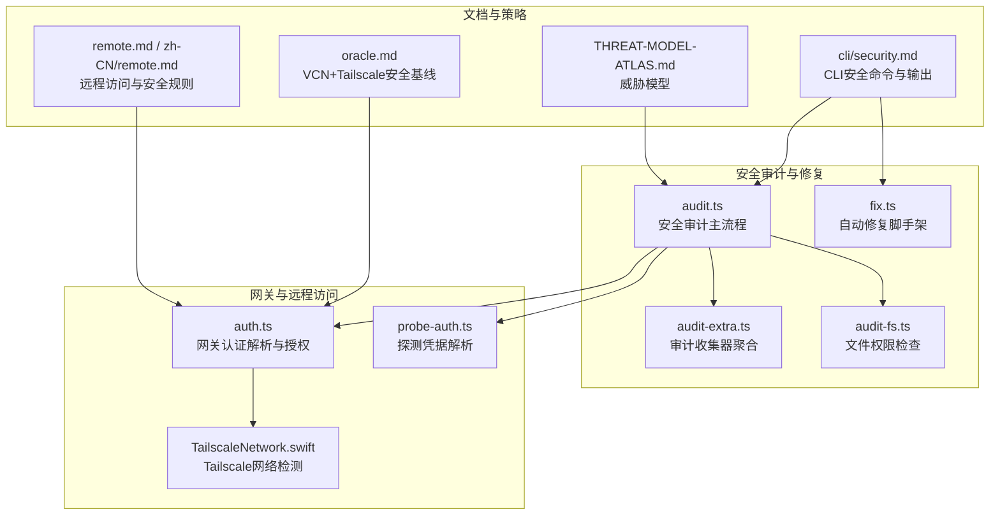
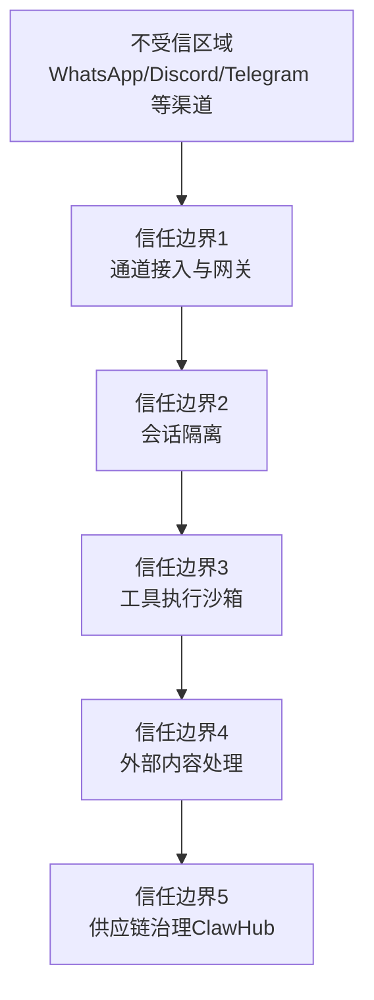
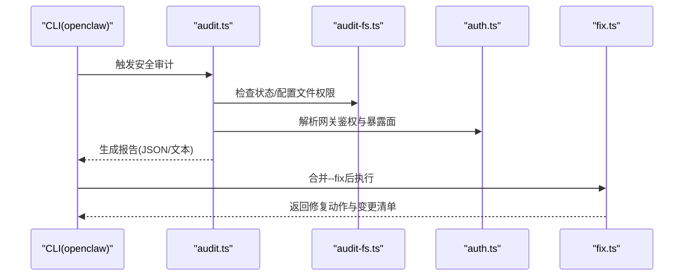
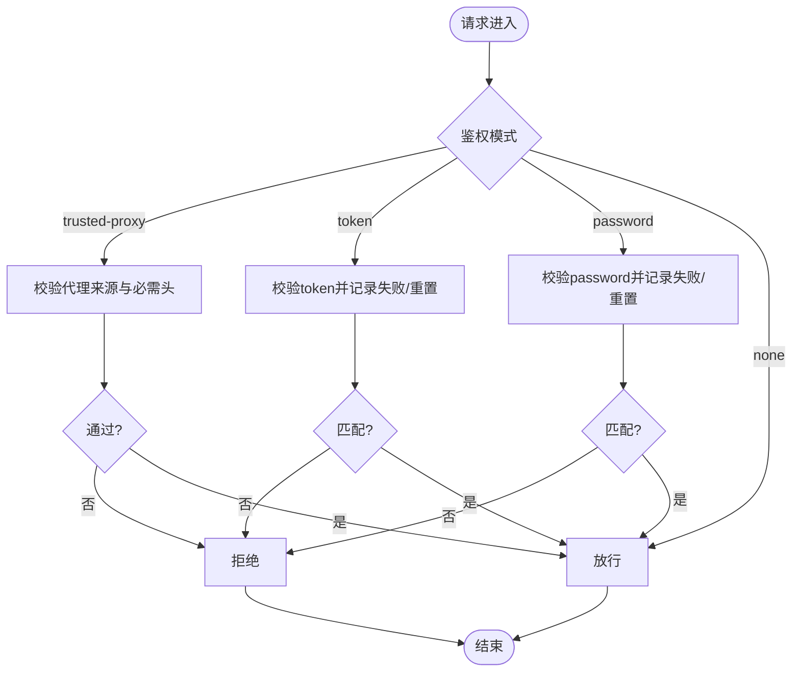
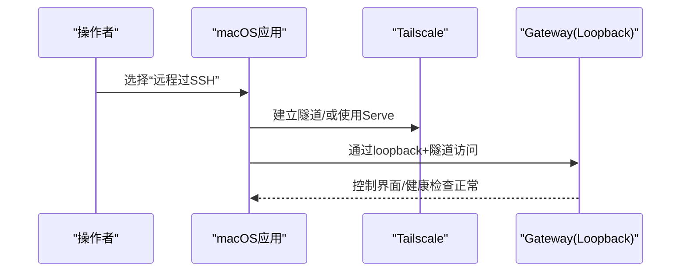
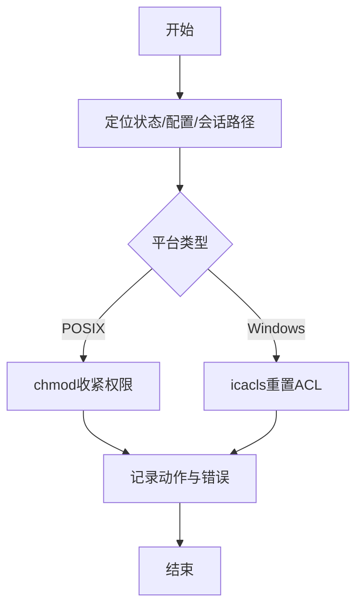
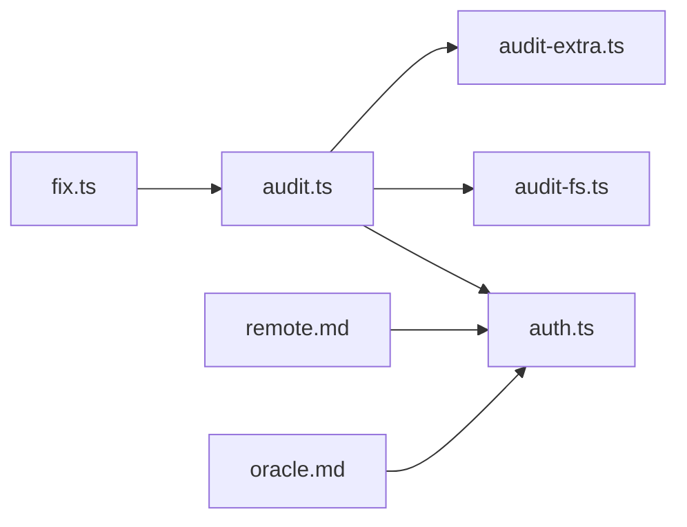

# 网络与安全

<cite>
**本文引用的文件**
- [src/security/audit.ts](file://src/security/audit.ts)
- [src/security/audit-extra.ts](file://src/security/audit-extra.ts)
- [src/security/fix.ts](file://src/security/fix.ts)
- [src/security/audit-fs.ts](file://src/security/audit-fs.ts)
- [src/gateway/auth.ts](file://src/gateway/auth.ts)
- [src/gateway/probe-auth.ts](file://src/gateway/probe-auth.ts)
- [apps/macos/Sources/OpenClawDiscovery/TailscaleNetwork.swift](file://apps/macos/Sources/OpenClawDiscovery/TailscaleNetwork.swift)
- [docs/security/THREAT-MODEL-ATLAS.md](file://docs/security/THREAT-MODEL-ATLAS.md)
- [docs/security/README.md](file://docs/security/README.md)
- [docs/gateway/remote.md](file://docs/gateway/remote.md)
- [docs/zh-CN/gateway/remote.md](file://docs/zh-CN/gateway/remote.md)
- [docs/platforms/oracle.md](file://docs/platforms/oracle.md)
- [docs/cli/security.md](file://docs/cli/security.md)
- [src/security/audit.test.ts](file://src/security/audit.test.ts)
</cite>

## 目录
1. [简介](#简介)
2. [项目结构](#项目结构)
3. [核心组件](#核心组件)
4. [架构总览](#架构总览)
5. [详细组件分析](#详细组件分析)
6. [依赖关系分析](#依赖关系分析)
7. [性能考量](#性能考量)
8. [故障排查指南](#故障排查指南)
9. [结论](#结论)
10. [附录](#附录)

## 简介
本文件面向OpenClaw网络与安全系统，提供从安全模型、威胁防护到运维配置的全景式技术文档。内容覆盖认证授权、数据加密、访问控制、审计日志、网络安全边界、Tailscale集成、远程访问、防火墙策略、安全策略配置、风险评估与合规建议，以及安全事件响应、漏洞管理与监控最佳实践。目标是帮助管理员与开发者构建并运行安全可靠的OpenClaw系统。

## 项目结构
OpenClaw在“安全审计”“修复”“网关认证”“Tailscale探测”“威胁模型文档”等多个维度提供了可落地的安全能力。下图展示与网络安全和安全配置直接相关的模块关系：

**图表来源**
- [src/security/audit.ts:1-1254](file://src/security/audit.ts#L1-L1254)
- [src/security/audit-extra.ts:1-41](file://src/security/audit-extra.ts#L1-L41)
- [src/security/fix.ts:1-478](file://src/security/fix.ts#L1-L478)
- [src/security/audit-fs.ts:1-207](file://src/security/audit-fs.ts#L1-L207)
- [src/gateway/auth.ts:1-504](file://src/gateway/auth.ts#L1-L504)
- [src/gateway/probe-auth.ts:1-73](file://src/gateway/probe-auth.ts#L1-L73)
- [apps/macos/Sources/OpenClawDiscovery/TailscaleNetwork.swift:1-21](file://apps/macos/Sources/OpenClawDiscovery/TailscaleNetwork.swift#L1-L21)
- [docs/security/THREAT-MODEL-ATLAS.md:1-604](file://docs/security/THREAT-MODEL-ATLAS.md#L1-L604)
- [docs/gateway/remote.md:1-154](file://docs/gateway/remote.md#L1-L154)
- [docs/zh-CN/gateway/remote.md:122-134](file://docs/zh-CN/gateway/remote.md#L122-L134)
- [docs/platforms/oracle.md:159-181](file://docs/platforms/oracle.md#L159-L181)
- [docs/cli/security.md:43-72](file://docs/cli/security.md#L43-L72)

**章节来源**
- [src/security/audit.ts:1-1254](file://src/security/audit.ts#L1-L1254)
- [src/security/audit-extra.ts:1-41](file://src/security/audit-extra.ts#L1-L41)
- [src/security/fix.ts:1-478](file://src/security/fix.ts#L1-L478)
- [src/security/audit-fs.ts:1-207](file://src/security/audit-fs.ts#L1-L207)
- [src/gateway/auth.ts:1-504](file://src/gateway/auth.ts#L1-L504)
- [src/gateway/probe-auth.ts:1-73](file://src/gateway/probe-auth.ts#L1-L73)
- [apps/macos/Sources/OpenClawDiscovery/TailscaleNetwork.swift:1-21](file://apps/macos/Sources/OpenClawDiscovery/TailscaleNetwork.swift#L1-L21)
- [docs/security/THREAT-MODEL-ATLAS.md:1-604](file://docs/security/THREAT-MODEL-ATLAS.md#L1-L604)
- [docs/gateway/remote.md:1-154](file://docs/gateway/remote.md#L1-L154)
- [docs/zh-CN/gateway/remote.md:122-134](file://docs/zh-CN/gateway/remote.md#L122-L134)
- [docs/platforms/oracle.md:159-181](file://docs/platforms/oracle.md#L159-L181)
- [docs/cli/security.md:43-72](file://docs/cli/security.md#L43-L72)

## 核心组件
- 安全审计引擎：集中收集配置、文件系统、网关暴露面、通道安全等多维发现，并生成可机器消费的报告与修复建议。
- 自动修复工具：在CI/运维场景中对常见高危配置进行安全修复，如收紧权限、调整日志脱敏级别、修正通道策略等。
- 网关认证与授权：支持token/password/信任代理/设备身份等多种模式；结合速率限制、尾网（Tailscale）身份、受信代理头等实现细粒度访问控制。
- 文件系统权限检查：跨平台（POSIX/Windows ACL）检查状态目录、配置文件及会话文件的敏感性与权限风险。
- 远程访问与安全边界：提供SSH隧道、Tailscale Serve/Funnel等远程接入方式，并给出严格的安全规则与基线。

**章节来源**
- [src/security/audit.ts:1-1254](file://src/security/audit.ts#L1-L1254)
- [src/security/fix.ts:1-478](file://src/security/fix.ts#L1-L478)
- [src/gateway/auth.ts:1-504](file://src/gateway/auth.ts#L1-L504)
- [src/security/audit-fs.ts:1-207](file://src/security/audit-fs.ts#L1-L207)

## 架构总览
OpenClaw安全架构围绕“信任边界”展开，从外部通道接入到内部会话隔离、工具执行沙箱、外部内容处理与供应链治理，形成五层信任边界。威胁模型文档定义了关键攻击向量与缓解措施，指导安全策略制定与落地。

**图表来源**
- [docs/security/THREAT-MODEL-ATLAS.md:56-123](file://docs/security/THREAT-MODEL-ATLAS.md#L56-L123)

**章节来源**
- [docs/security/THREAT-MODEL-ATLAS.md:1-604](file://docs/security/THREAT-MODEL-ATLAS.md#L1-L604)

## 详细组件分析

### 安全审计与自动修复
- 审计范围：配置合法性、文件系统权限、网关暴露与鉴权、浏览器控制端点、通道安全、危险标志位、可信代理与mDNS等。
- 报告结构：包含统计摘要、发现项、严重等级、修复建议；深度审计可包含对网关连通性探测结果。
- 修复策略：对日志脱敏、通道组策略、状态/会话文件权限等进行可逆且安全的修复；对Windows使用ACL重置，对POSIX使用chmod。

**图表来源**
- [src/security/audit.ts:1-1254](file://src/security/audit.ts#L1-L1254)
- [src/security/audit-fs.ts:1-207](file://src/security/audit-fs.ts#L1-L207)
- [src/gateway/auth.ts:1-504](file://src/gateway/auth.ts#L1-L504)
- [src/security/fix.ts:1-478](file://src/security/fix.ts#L1-L478)

**章节来源**
- [src/security/audit.ts:1-1254](file://src/security/audit.ts#L1-L1254)
- [src/security/audit-fs.ts:1-207](file://src/security/audit-fs.ts#L1-L207)
- [src/security/fix.ts:1-478](file://src/security/fix.ts#L1-L478)
- [docs/cli/security.md:43-72](file://docs/cli/security.md#L43-L72)

### 网关认证与授权
- 支持模式：token/password/trusted-proxy/none，默认优先选择token；可基于环境变量与SecretRef解析凭据。
- 设备与尾网身份：在WS控制界面允许基于Tailscale身份的免密登录；HTTP接口默认禁用该行为。
- 速率限制：可按共享密钥作用域对失败尝试进行限制，降低暴力破解风险。
- 受信代理：要求明确配置代理IP列表与用户头字段，避免被伪造源地址欺骗。

**图表来源**
- [src/gateway/auth.ts:378-504](file://src/gateway/auth.ts#L378-L504)

**章节来源**
- [src/gateway/auth.ts:1-504](file://src/gateway/auth.ts#L1-L504)

### 远程访问与安全边界
- 默认建议：网关绑定loopback，通过SSH隧道或Tailscale Serve访问控制界面与WebSocket；非loopback绑定必须启用鉴权。
- Tailscale Serve：可利用Tailscale身份进行免密登录，但需谨慎配置allowTailscale与allowedOrigins。
- VCN+Tailscale基线：仅开放必要端口（如UDP 41641），网关绑定loopback，实现“网络边缘阻断+尾网访问”的纵深防御。

**图表来源**
- [docs/gateway/remote.md:1-154](file://docs/gateway/remote.md#L1-L154)
- [docs/zh-CN/gateway/remote.md:122-134](file://docs/zh-CN/gateway/remote.md#L122-L134)
- [docs/platforms/oracle.md:159-181](file://docs/platforms/oracle.md#L159-L181)

**章节来源**
- [docs/gateway/remote.md:1-154](file://docs/gateway/remote.md#L1-L154)
- [docs/zh-CN/gateway/remote.md:122-134](file://docs/zh-CN/gateway/remote.md#L122-L134)
- [docs/platforms/oracle.md:159-181](file://docs/platforms/oracle.md#L159-L181)

### 文件系统与敏感数据保护
- 权限检查：对状态目录、配置文件、会话文件与凭据目录进行跨平台权限扫描，识别世界可写/可读、组可写/可读等高危风险。
- 修复动作：对POSIX使用chmod，对Windows使用icacls重置；对符号链接与缺失路径进行跳过/错误提示。
- 日志与脱敏：建议将日志敏感信息脱敏级别提升至“工具侧”，减少无意泄露。

**图表来源**
- [src/security/audit-fs.ts:62-142](file://src/security/audit-fs.ts#L62-L142)
- [src/security/fix.ts:305-385](file://src/security/fix.ts#L305-L385)

**章节来源**
- [src/security/audit-fs.ts:1-207](file://src/security/audit-fs.ts#L1-L207)
- [src/security/fix.ts:1-478](file://src/security/fix.ts#L1-L478)

### Tailscale网络与身份验证
- Swift侧网络探测：识别Tailscale网段IPv4前缀，辅助判断当前是否处于tailnet环境。
- 身份校验：在WS控制界面允许Tailscale身份头进行免密登录，HTTP接口默认关闭该行为，确保边界清晰。

**章节来源**
- [apps/macos/Sources/OpenClawDiscovery/TailscaleNetwork.swift:1-21](file://apps/macos/Sources/OpenClawDiscovery/TailscaleNetwork.swift#L1-L21)
- [src/gateway/auth.ts:374-376](file://src/gateway/auth.ts#L374-L376)

## 依赖关系分析
- 审计引擎依赖于网关认证解析、浏览器控制端点解析、通道插件与文件系统检查等子模块，形成“配置—网络—文件—通道”的多维检查矩阵。
- 修复工具依赖配置IO与平台命令（chmod/icacls），并与审计发现一一对应，形成“发现问题—生成修复—回写配置”的闭环。
- 远程访问与安全边界文档与网关认证模块紧密耦合，共同决定部署形态与暴露面。

**图表来源**
- [src/security/audit.ts:1-1254](file://src/security/audit.ts#L1-L1254)
- [src/security/audit-extra.ts:1-41](file://src/security/audit-extra.ts#L1-L41)
- [src/security/fix.ts:1-478](file://src/security/fix.ts#L1-L478)
- [src/security/audit-fs.ts:1-207](file://src/security/audit-fs.ts#L1-L207)
- [src/gateway/auth.ts:1-504](file://src/gateway/auth.ts#L1-L504)
- [docs/gateway/remote.md:1-154](file://docs/gateway/remote.md#L1-L154)
- [docs/platforms/oracle.md:159-181](file://docs/platforms/oracle.md#L159-L181)

**章节来源**
- [src/security/audit.ts:1-1254](file://src/security/audit.ts#L1-L1254)
- [src/security/fix.ts:1-478](file://src/security/fix.ts#L1-L478)
- [src/gateway/auth.ts:1-504](file://src/gateway/auth.ts#L1-L504)
- [docs/gateway/remote.md:1-154](file://docs/gateway/remote.md#L1-L154)
- [docs/platforms/oracle.md:159-181](file://docs/platforms/oracle.md#L159-L181)

## 性能考量
- 审计深度：深度探测（如网关连通性）可增加耗时，建议在CI/离线场景开启，生产环境默认轻量审计。
- 权限修复：批量chmod/icacls对大目录树可能产生I/O开销，建议分批执行并结合缓存（代码中提供摘要缓存参数）。
- 认证速率限制：合理设置窗口与上限，避免误伤合法用户，同时有效抵御暴力破解。

[本节为通用指导，无需特定文件引用]

## 故障排查指南
- 审计报告解读：关注严重等级与修复建议，优先处理“critical”项；结合JSON输出在CI中进行策略化拦截。
- 常见问题定位：
  - 网关未鉴权即暴露：检查gateway.bind与gateway.auth配置，确保非loopback绑定时启用token/password。
  - 控制界面跨域/本地客户端绕过：检查allowedOrigins与trustedProxies配置，避免wildcard与Host-header回退滥用。
  - 文件权限过高：使用自动修复或手动chmod/icacls收紧；注意符号链接与缺失路径的跳过逻辑。
  - 通道策略宽松：将groupPolicy从“open”切换为“allowlist”，并结合账户级allowlist细化。
- 测试与回归：参考测试用例中的典型配置与预期发现，快速复现并验证修复效果。

**章节来源**
- [docs/cli/security.md:43-72](file://docs/cli/security.md#L43-L72)
- [src/security/audit.test.ts:593-643](file://src/security/audit.test.ts#L593-L643)
- [src/security/audit.ts:339-687](file://src/security/audit.ts#L339-L687)
- [src/security/fix.ts:285-303](file://src/security/fix.ts#L285-L303)

## 结论
OpenClaw通过“威胁模型驱动”的安全设计、“多层信任边界”的网络架构、“可审计可修复”的运维工具链，以及“Tailscale+受控暴露”的远程访问方案，构建了兼顾易用性与安全性的系统。建议在生产环境中默认采用loopback+尾网/隧道访问、严格的鉴权与速率限制、最小权限的文件系统策略，并持续运行安全审计与修复，以达成“可观测、可治理、可恢复”的安全目标。

[本节为总结性内容，无需特定文件引用]

## 附录

### 安全策略配置要点
- 网关绑定与鉴权
  - loopback为默认安全绑定；非loopback必须启用token/password或trusted-proxy。
  - Tailscale Serve可免密登录，但需严格限定allowedOrigins与allowTailscale。
- 通道与消息
  - 将groupPolicy从“open”切换为“allowlist”，并细化账户级allowlist。
  - 对高风险通道（如Feishu文档）谨慎启用“创建”等授予权限的操作。
- 文件系统
  - 状态目录与配置文件权限收紧至700/600；凭据与会话文件逐一加固。
- 日志与脱敏
  - 将日志敏感信息脱敏级别提升至“tools”，避免无意泄露。
- 远程访问
  - 优先使用SSH隧道或Tailscale Serve；避免Funnel公网暴露；严格限制allowedOrigins。

**章节来源**
- [src/gateway/auth.ts:345-397](file://src/gateway/auth.ts#L345-L397)
- [src/security/audit.ts:414-427](file://src/security/audit.ts#L414-L427)
- [src/security/fix.ts:285-303](file://src/security/fix.ts#L285-L303)
- [docs/gateway/remote.md:135-152](file://docs/gateway/remote.md#L135-L152)
- [docs/zh-CN/gateway/remote.md:122-131](file://docs/zh-CN/gateway/remote.md#L122-L131)

### 风险评估与合规建议
- 风险矩阵：依据MITRE ATLAS框架，将“高影响/高概率”威胁作为最高优先级处理（如技能供应链、提示注入导致的RCE）。
- 合规与披露：遵循统一的漏洞披露流程与联系方式，确保问题可追踪、可闭环。

**章节来源**
- [docs/security/THREAT-MODEL-ATLAS.md:485-504](file://docs/security/THREAT-MODEL-ATLAS.md#L485-L504)
- [docs/security/README.md:10-18](file://docs/security/README.md#L10-L18)