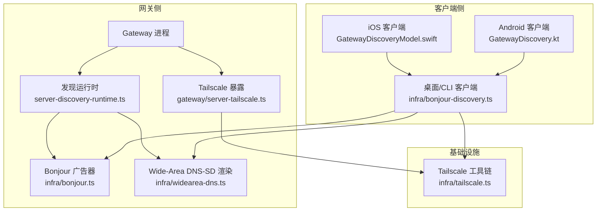
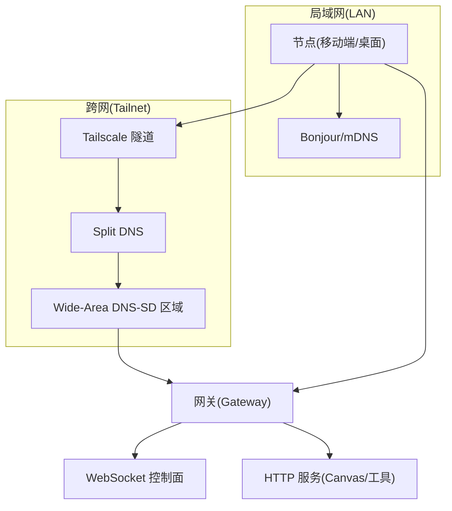
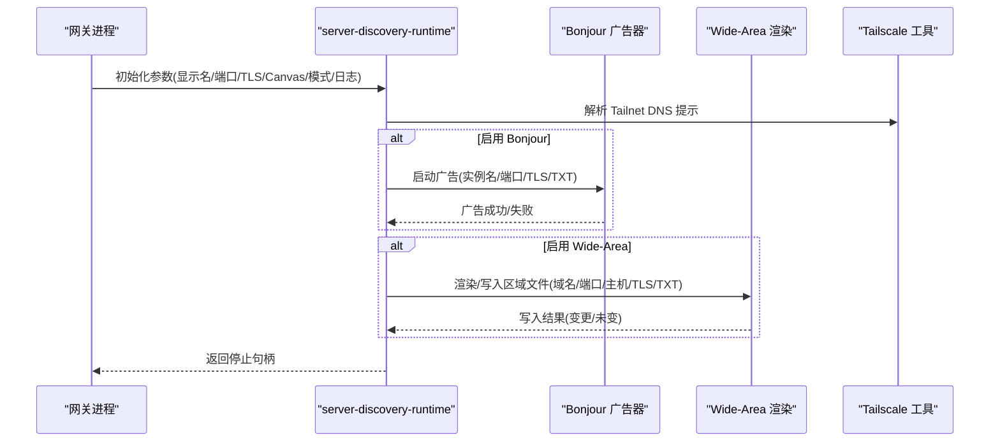
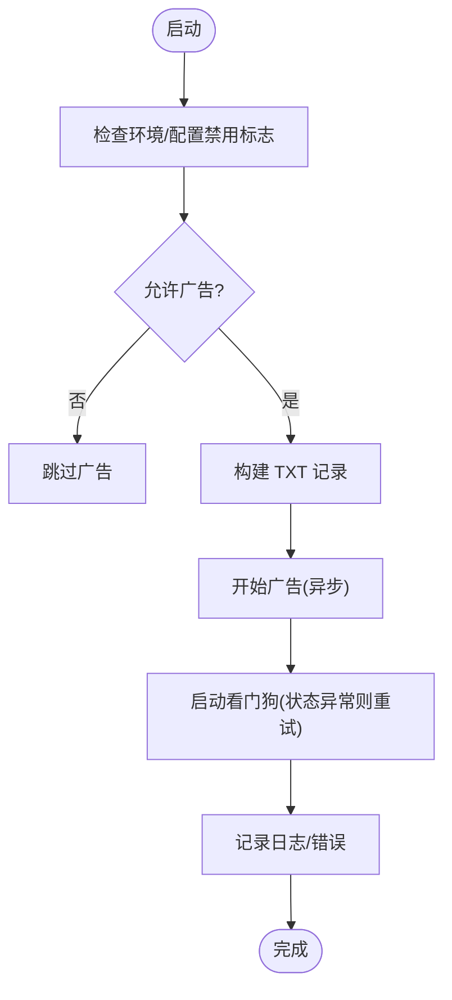
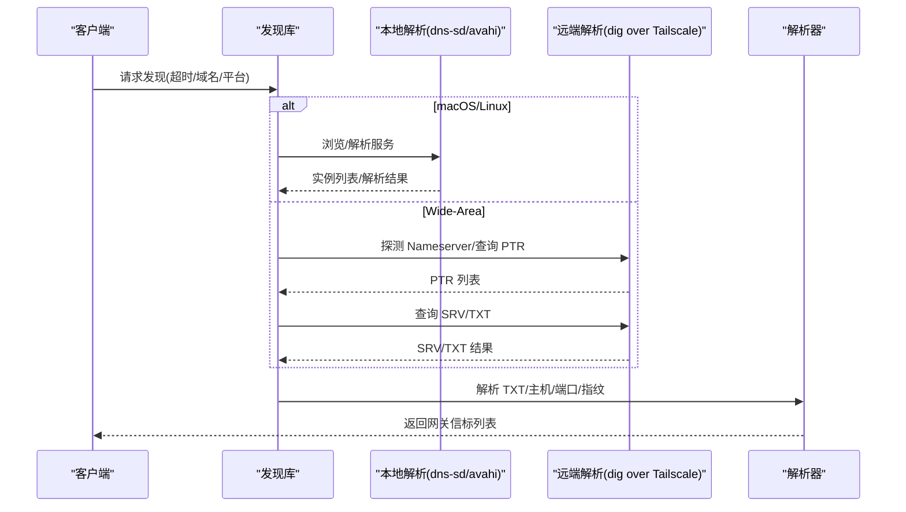
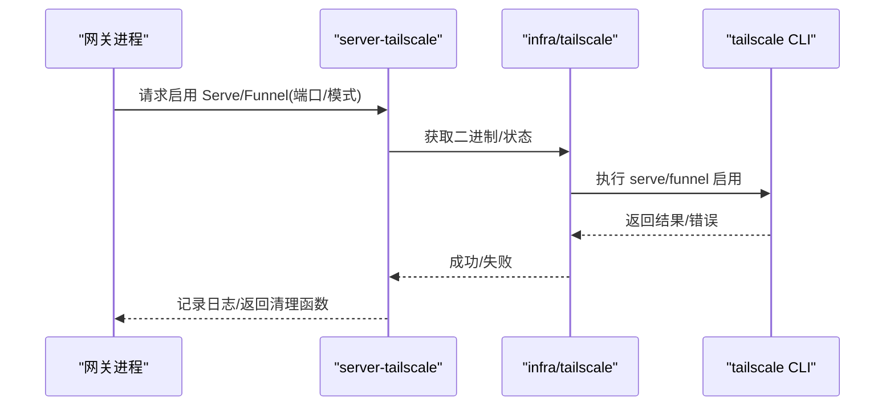
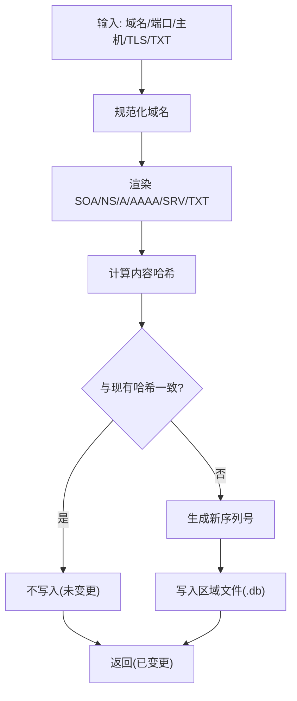
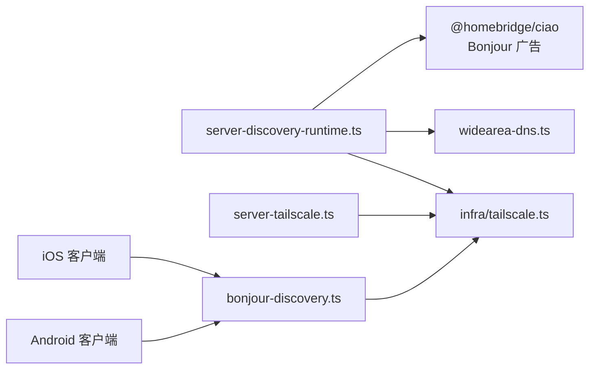

# 网络架构

<cite>
**本文引用的文件**
- [network.md](file://docs/network.md)
- [gateway/network-model.md](file://docs/gateway/network-model.md)
- [gateway/discovery.md](file://docs/gateway/discovery.md)
- [gateway/bonjour.md](file://docs/gateway/bonjour.md)
- [gateway/tailscale.md](file://docs/gateway/tailscale.md)
- [gateway/server-discovery-runtime.ts](file://src/gateway/server-discovery-runtime.ts)
- [gateway/server-discovery.ts](file://src/gateway/server-discovery.ts)
- [infra/bonjour-discovery.ts](file://src/infra/bonjour-discovery.ts)
- [infra/bonjour.ts](file://src/infra/bonjour.ts)
- [infra/tailscale.ts](file://src/infra/tailscale.ts)
- [gateway/server-tailscale.ts](file://src/gateway/server-tailscale.ts)
- [infra/widearea-dns.ts](file://src/infra/widearea-dns.ts)
- [apps/android/app/src/main/java/.../GatewayDiscovery.kt](file://apps/android/app/src/main/java/ai/openclaw/app/gateway/GatewayDiscovery.kt)
- [apps/ios/Sources/Gateway/GatewayDiscoveryModel.swift](file://apps/ios/Sources/Gateway/GatewayDiscoveryModel.swift)
</cite>

## 目录
1. [简介](#简介)
2. [项目结构](#项目结构)
3. [核心组件](#核心组件)
4. [架构总览](#架构总览)
5. [详细组件分析](#详细组件分析)
6. [依赖关系分析](#依赖关系分析)
7. [性能与稳定性](#性能与稳定性)
8. [故障排查指南](#故障排查指南)
9. [结论](#结论)
10. [附录：部署配置与最佳实践](#附录部署配置与最佳实践)

## 简介
本文件系统化梳理 OpenClaw 的网络架构，涵盖网络拓扑、连接模式与传输协议，以及本地发现（Bonjour/mDNS）、跨网发现（Wide-Area DNS-SD over Tailscale）与 Tailscale 隧道机制。文档还解释网关发现算法、节点注册流程与网络状态管理，并提供不同网络环境下的部署配置建议、性能优化与稳定性保障策略，以及面向网络管理员的配置、排障与调优指引。

## 项目结构
OpenClaw 将“网关（Gateway）”作为网络控制平面的核心，所有节点通过 WebSocket 连接至网关；同时提供多种发现与暴露方式以适配局域网、跨网远程访问与混合场景。关键实现分布在以下模块：
- 网关侧：启动 Bonjour 广告、Wide-Area DNS-SD 区域更新、Tailscale 暴露（Serve/Funnel）
- 客户端侧：跨平台（macOS/iOS/Android）基于 mDNS/DNS-SD 的发现与解析
- 基础设施：Tailscale 二进制探测、状态查询、Funnel/Serve 管理、Wide-Area 区域文件渲染与落盘



图表来源
- [gateway/server-discovery-runtime.ts:10-101](file://src/gateway/server-discovery-runtime.ts#L10-L101)
- [infra/bonjour.ts:84-226](file://src/infra/bonjour.ts#L84-L226)
- [infra/widearea-dns.ts:168-200](file://src/infra/widearea-dns.ts#L168-L200)
- [gateway/server-tailscale.ts:9-59](file://src/gateway/server-tailscale.ts#L9-L59)
- [infra/tailscale.ts:106-144](file://src/infra/tailscale.ts#L106-L144)
- [apps/ios/Sources/Gateway/GatewayDiscoveryModel.swift:55-77](file://apps/ios/Sources/Gateway/GatewayDiscoveryModel.swift#L55-L77)
- [apps/android/app/src/main/java/ai/openclaw/app/gateway/GatewayDiscovery.kt:69-113](file://apps/android/app/src/main/java/ai/openclaw/app/gateway/GatewayDiscovery.kt#L69-L113)
- [infra/bonjour-discovery.ts:545-591](file://src/infra/bonjour-discovery.ts#L545-L591)

章节来源
- [network.md:10-55](file://docs/network.md#L10-L55)
- [gateway/network-model.md:8-21](file://docs/gateway/network-model.md#L8-L21)

## 核心组件
- 网关发现运行时：负责根据配置与环境变量决定是否开启 Bonjour 广告、是否生成 Wide-Area DNS-SD 区域文件，并计算 Tailnet DNS 提示。
- Bonjour 广告器：在支持的平台上启动 ciao 响应器，发布 _openclaw-gw._tcp 服务，携带非认证的 TXT 提示键（如端口、TLS 指纹、MagicDNS 等）。
- 客户端发现库：跨平台解析 dns-sd/avahi 输出，或通过 dig 查询 Wide-Area 域，解析 SRV/TXT 获取目标主机与端口等信息。
- Tailscale 集成：探测 Tailscale 二进制与状态，按需启用 Serve（tailnet）或 Funnel（公网），并可清理退出时的配置。
- Wide-Area DNS-SD 区域：在网关上渲染并写入专用区域文件，供 Split DNS 解析，实现跨网发现。

章节来源
- [gateway/server-discovery-runtime.ts:10-101](file://src/gateway/server-discovery-runtime.ts#L10-L101)
- [infra/bonjour.ts:84-226](file://src/infra/bonjour.ts#L84-L226)
- [infra/bonjour-discovery.ts:545-591](file://src/infra/bonjour-discovery.ts#L545-L591)
- [infra/tailscale.ts:106-144](file://src/infra/tailscale.ts#L106-L144)
- [gateway/server-tailscale.ts:9-59](file://src/gateway/server-tailscale.ts#L9-L59)
- [infra/widearea-dns.ts:168-200](file://src/infra/widearea-dns.ts#L168-L200)

## 架构总览
OpenClaw 的网络模型遵循“网关为中心”的控制面与数据面分离：
- 控制面：WebSocket（WS）作为网关与节点之间的长连接通道，承载命令、事件与会话控制。
- 数据面：Canvas Host 与工具接口通过网关 HTTP 服务器在同一端口提供，受网关鉴权保护。
- 发现与暴露：局域网内通过 Bonjour 自动发现；跨网通过 Wide-Area DNS-SD over Tailscale 或 SSH 隧道；也可通过 Tailscale Serve/Funnel 将网关 UI 与 WS 暴露到 tailnet 或公网。



图表来源
- [gateway/network-model.md:8-21](file://docs/gateway/network-model.md#L8-L21)
- [gateway/discovery.md:32-98](file://docs/gateway/discovery.md#L32-L98)
- [gateway/bonjour.md:9-178](file://docs/gateway/bonjour.md#L9-L178)
- [gateway/tailscale.md:9-133](file://docs/gateway/tailscale.md#L9-L133)

## 详细组件分析

### 组件A：网关发现运行时（server-discovery-runtime）
职责与流程
- 根据 mdnsMode、环境变量与测试环境决定是否启用 Bonjour 广告。
- 计算 Tailnet DNS 提示（优先使用环境变量，其次从 Tailscale 状态解析）。
- 在启用 Wide-Area 发现时，渲染并写入 DNS-SD 区域文件，记录变更。
- 返回停止句柄以便上层管理生命周期。



图表来源
- [gateway/server-discovery-runtime.ts:10-101](file://src/gateway/server-discovery-runtime.ts#L10-L101)
- [infra/bonjour.ts:84-226](file://src/infra/bonjour.ts#L84-L226)
- [infra/widearea-dns.ts:168-200](file://src/infra/widearea-dns.ts#L168-L200)
- [infra/tailscale.ts:106-144](file://src/infra/tailscale.ts#L106-L144)

章节来源
- [gateway/server-discovery-runtime.ts:10-101](file://src/gateway/server-discovery-runtime.ts#L10-L101)

### 组件B：Bonjour 广告器（infra/bonjour）
职责与流程
- 使用 ciao 响应器发布 _openclaw-gw._tcp 服务，监听服务状态变化并进行看门狗修复。
- 广告 TXT 键包含角色、显示名、端口、TLS 状态与指纹、MagicDNS、SSH 端口、CLI 路径等。
- 对异常进行降级处理，避免阻塞网关启动。



图表来源
- [infra/bonjour.ts:84-226](file://src/infra/bonjour.ts#L84-L226)

章节来源
- [infra/bonjour.ts:84-226](file://src/infra/bonjour.ts#L84-L226)

### 组件C：客户端发现算法（infra/bonjour-discovery）
职责与流程
- 支持 macOS（dns-sd）与 Linux（avahi-browse）两种本地发现路径。
- 支持 Wide-Area DNS-SD：通过 Tailscale 状态探测 Nameserver，再 dig 查询 PTR/SRV/TXT。
- 解析服务实例名、主机、端口、TXT 字段，构造网关信标对象。



图表来源
- [infra/bonjour-discovery.ts:545-591](file://src/infra/bonjour-discovery.ts#L545-L591)
- [infra/bonjour-discovery.ts:264-284](file://src/infra/bonjour-discovery.ts#L264-L284)
- [infra/bonjour-discovery.ts:286-440](file://src/infra/bonjour-discovery.ts#L286-L440)

章节来源
- [infra/bonjour-discovery.ts:545-591](file://src/infra/bonjour-discovery.ts#L545-L591)

### 组件D：Tailscale 集成（infra/tailscale + gateway/server-tailscale）
职责与流程
- 二进制探测与状态解析：支持 PATH、应用路径、locate 等策略定位 tailscale，并解析 status JSON。
- Funnel/Serve 管理：按需启用 Serve（tailnet）或 Funnel（公网），并提供清理回调。
- Whois 身份解析：缓存并校验来自本地 tailscaled 的身份信息，用于 Serve 场景的身份注入。



图表来源
- [gateway/server-tailscale.ts:9-59](file://src/gateway/server-tailscale.ts#L9-L59)
- [infra/tailscale.ts:106-144](file://src/infra/tailscale.ts#L106-L144)
- [infra/tailscale.ts:392-422](file://src/infra/tailscale.ts#L392-L422)

章节来源
- [gateway/server-tailscale.ts:9-59](file://src/gateway/server-tailscale.ts#L9-L59)
- [infra/tailscale.ts:106-144](file://src/infra/tailscale.ts#L106-L144)

### 组件E：Wide-Area DNS-SD 区域渲染（infra/widearea-dns）
职责与流程
- 规范化域名，渲染 SOA/NS/A/AAAA/SRV/TXT 记录，生成稳定内容哈希，仅在变更时写入。
- 通过序列号递增保证 DNS 刷新语义。



图表来源
- [infra/widearea-dns.ts:168-200](file://src/infra/widearea-dns.ts#L168-L200)
- [infra/widearea-dns.ts:106-160](file://src/infra/widearea-dns.ts#L106-L160)

章节来源
- [infra/widearea-dns.ts:168-200](file://src/infra/widearea-dns.ts#L168-L200)

### 组件F：跨平台客户端发现（iOS/Android）
职责与流程
- iOS：使用 NWBrowser 浏览 _openclaw-gw._tcp，解析 TXT，展示候选网关。
- Android：使用 NsdManager 发现服务，解析实例并触发解析，支持 Wide-Area 域。

```mermaid
sequenceDiagram
participant IOS as "iOS 客户端"
participant AND as "Android 客户端"
participant MDNS as "本地 mDNS"
participant DNS as "Wide-Area DNS"
IOS->>MDNS : 浏览 local./自定义域
AND->>MDNS : 发现/解析服务
MDNS-->>IOS : 实例/主机/端口
MDNS-->>AND : 实例/主机/端口
IOS->>DNS : 解析 Wide-Area 域(PTR/SRV/TXT)
AND->>DNS : 解析 Wide-Area 域(PTR/SRV/TXT)
DNS-->>IOS : TXT/主机/端口
DNS-->>AND : TXT/主机/端口
IOS-->>IOS : 构造候选列表
AND-->>AND : 构造候选列表
```

图表来源
- [apps/ios/Sources/Gateway/GatewayDiscoveryModel.swift:55-77](file://apps/ios/Sources/Gateway/GatewayDiscoveryModel.swift#L55-L77)
- [apps/android/app/src/main/java/ai/openclaw/app/gateway/GatewayDiscovery.kt:69-113](file://apps/android/app/src/main/java/ai/openclaw/app/gateway/GatewayDiscovery.kt#L69-L113)
- [infra/bonjour-discovery.ts:286-440](file://src/infra/bonjour-discovery.ts#L286-L440)

章节来源
- [apps/ios/Sources/Gateway/GatewayDiscoveryModel.swift:55-77](file://apps/ios/Sources/Gateway/GatewayDiscoveryModel.swift#L55-L77)
- [apps/android/app/src/main/java/ai/openclaw/app/gateway/GatewayDiscovery.kt:69-113](file://apps/android/app/src/main/java/ai/openclaw/app/gateway/GatewayDiscovery.kt#L69-L113)

## 依赖关系分析
- 网关侧依赖
  - server-discovery-runtime 依赖 Bonjour 广告器、Wide-Area 渲染与 Tailscale 工具。
  - server-tailscale 依赖 infra/tailscale 的二进制探测与命令封装。
- 客户端依赖
  - iOS/Android 通过系统 mDNS/avahi 与 dig over Tailscale 解析服务。
  - 通用发现库统一解析 dns-sd/avahi 与 dig 输出，屏蔽平台差异。



图表来源
- [gateway/server-discovery-runtime.ts:1-101](file://src/gateway/server-discovery-runtime.ts#L1-L101)
- [gateway/server-tailscale.ts:1-59](file://src/gateway/server-tailscale.ts#L1-L59)
- [infra/bonjour-discovery.ts:1-591](file://src/infra/bonjour-discovery.ts#L1-L591)
- [infra/tailscale.ts:106-144](file://src/infra/tailscale.ts#L106-L144)

章节来源
- [gateway/server-discovery-runtime.ts:1-101](file://src/gateway/server-discovery-runtime.ts#L1-L101)
- [gateway/server-tailscale.ts:1-59](file://src/gateway/server-tailscale.ts#L1-L59)
- [infra/bonjour-discovery.ts:1-591](file://src/infra/bonjour-discovery.ts#L1-L591)
- [infra/tailscale.ts:106-144](file://src/infra/tailscale.ts#L106-L144)

## 性能与稳定性
- Bonjour 广告异步化：广告启动不阻塞网关启动，异常与状态监控通过看门狗修复，降低单次失败影响。
- 客户端扫描收敛：Wide-Area 解析限制并发与剩余时间预算，避免长时间阻塞。
- DNS 序列号与哈希：仅在内容变更时写入区域文件，减少磁盘与 DNS 刷新压力。
- Tailscale 命令降级：权限不足时自动重试 sudo，失败时给出明确提示与替代方案。
- 传输选择策略：优先直连（Bonjour/Tailnet），否则回退 SSH，确保在多变网络环境下仍可连接。

章节来源
- [infra/bonjour.ts:192-213](file://src/infra/bonjour.ts#L192-L213)
- [infra/bonjour-discovery.ts:295-362](file://src/infra/bonjour-discovery.ts#L295-L362)
- [infra/widearea-dns.ts:186-199](file://src/infra/widearea-dns.ts#L186-L199)
- [infra/tailscale.ts:275-300](file://src/infra/tailscale.ts#L275-L300)
- [gateway/discovery.md:32-98](file://docs/gateway/discovery.md#L32-L98)

## 故障排查指南
- Bonjour 不跨网
  - 现象：局域网外无法解析服务。
  - 处理：启用 Wide-Area DNS-SD over Tailscale，配置 Split DNS，或回退 SSH。
- 多播受限
  - 现象：部分 Wi‑Fi 网络禁用 mDNS。
  - 处理：使用 Wide-Area 或 SSH；确认设备名称简单无特殊字符。
- 睡眠/接口切换导致结果抖动
  - 现象：短暂丢失解析结果。
  - 处理：稍后重试；确认主机名稳定。
- 服务实例名转义
  - 现象：实例名出现 \032 等转义。
  - 处理：UI 层解码显示（iOS 已内置解码）。
- Tailscale Funnel 未启用
  - 现象：Funnel 模式启动失败。
  - 处理：在后台控制台启用 Funnel，或改用 Serve；确保版本兼容与 HTTPS 开启。
- 本地发现调试
  - macOS：使用 dns-sd 浏览/解析；查看网关日志中的 bonjour: 行。
  - iOS：开启发现调试日志并复制；关注浏览器状态与结果集变化。

章节来源
- [gateway/bonjour.md:149-178](file://docs/gateway/bonjour.md#L149-L178)
- [gateway/tailscale.md:119-133](file://docs/gateway/tailscale.md#L119-L133)
- [gateway/discovery.md:32-98](file://docs/gateway/discovery.md#L32-L98)

## 结论
OpenClaw 的网络架构以“网关为中心”，结合 Bonjour 局域网自动发现、Wide-Area DNS-SD over Tailscale 的跨网发现与 Tailscale Serve/Funnel 的安全暴露，形成高可用、易运维的多场景连接方案。通过异步广告、收敛扫描、内容哈希与权限降级等机制，系统在复杂网络环境中仍能保持稳定与高性能。

## 附录：部署配置与最佳实践

### 局域网（LAN）场景
- 启用 Bonjour 广告（默认最小模式即可提供 UI 体验）。
- 客户端优先使用本地域名浏览与解析，避免依赖 TXT 中的主机名作为路由依据。
- 如需跨网访问，建议配合 Tailscale 与 Split DNS。

章节来源
- [gateway/discovery.md:45-77](file://docs/gateway/discovery.md#L45-L77)
- [gateway/bonjour.md:9-178](file://docs/gateway/bonjour.md#L9-L178)

### 远程访问（SSH 隧道）
- 当无直接路由或直连被禁用时，通过 SSH 将本地回环端口转发至远程客户端。
- 适用于不受多播或 mDNS 影响的网络边界。

章节来源
- [gateway/discovery.md:94-98](file://docs/gateway/discovery.md#L94-L98)

### 跨网（Tailnet + Wide-Area DNS-SD）
- 在网关侧启用 Wide-Area 发现，配置专用域名与 Split DNS。
- 客户端同时浏览 local. 与自定义域，实现无缝跨网发现。
- 网关渲染并写入区域文件，仅在变更时更新。

章节来源
- [gateway/bonjour.md:15-68](file://docs/gateway/bonjour.md#L15-L68)
- [infra/widearea-dns.ts:168-200](file://src/infra/widearea-dns.ts#L168-L200)

### Tailscale 暴露（Serve/Funnel）
- Serve（tailnet）：保持网关绑定 loopback，通过 Tailscale 注入身份头，适合受信任主机。
- Funnel（公网）：需要共享密码，仅暴露网关 UI 与 WS；注意端口限制与版本要求。
- 退出时可选择自动清理 Serve/Funnel 配置。

章节来源
- [gateway/tailscale.md:9-133](file://docs/gateway/tailscale.md#L9-L133)
- [gateway/server-tailscale.ts:9-59](file://src/gateway/server-tailscale.ts#L9-L59)

### 网络状态管理与节点注册
- 网关是节点准入的唯一权威来源，直连传输需经网关配对与 ACL 控制。
- 本地连接（loopback 或网关主机自身 tailnet 地址）可自动批准配对，非本地仍需显式审批。
- 传输选择策略：已配置且可达的直连端点优先；否则按 LAN Bonjour、Tailnet DNS/IP、SSH 顺序回退。

章节来源
- [docs/network.md:22-34](file://docs/network.md#L22-L34)
- [gateway/discovery.md:100-117](file://docs/gateway/discovery.md#L100-L117)