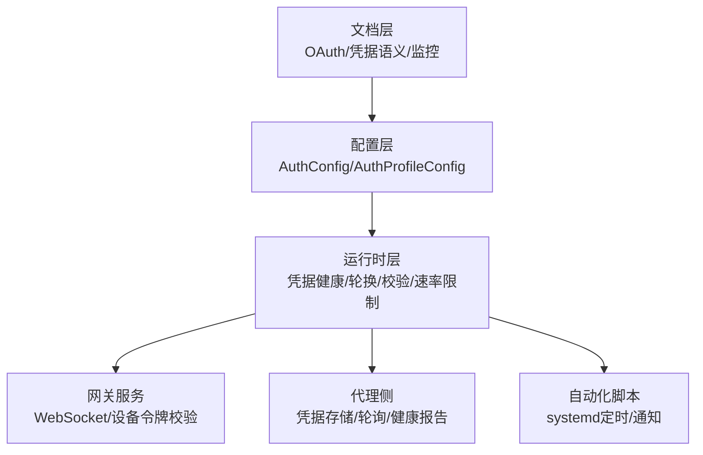
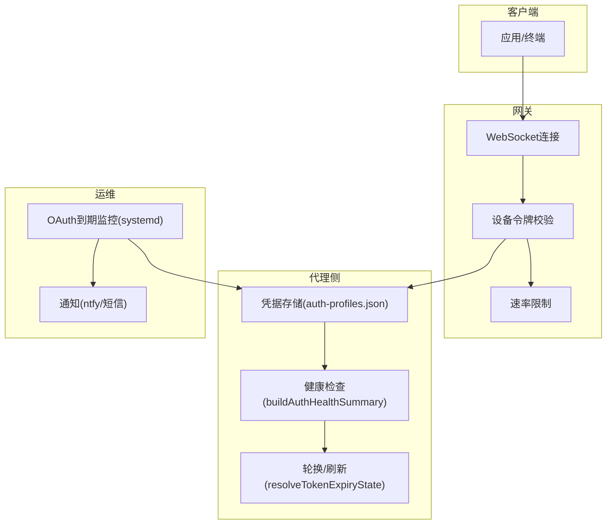
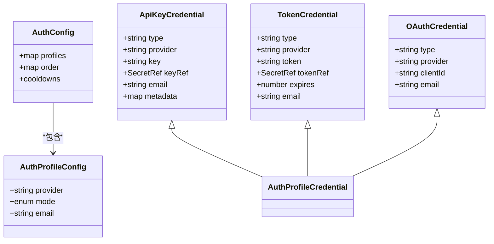
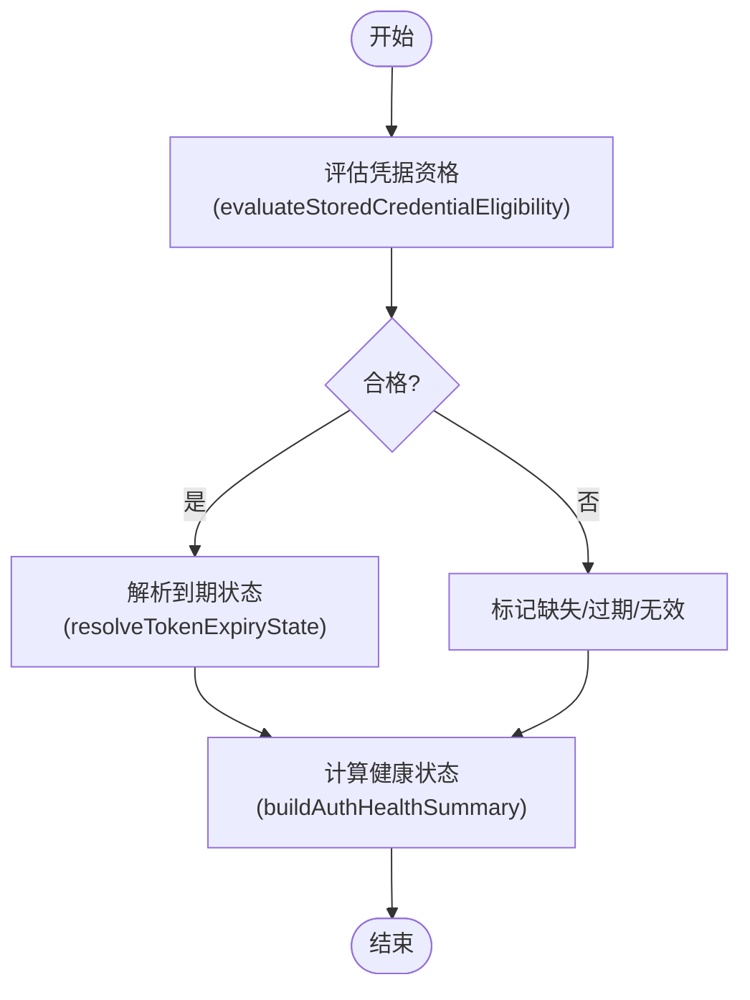
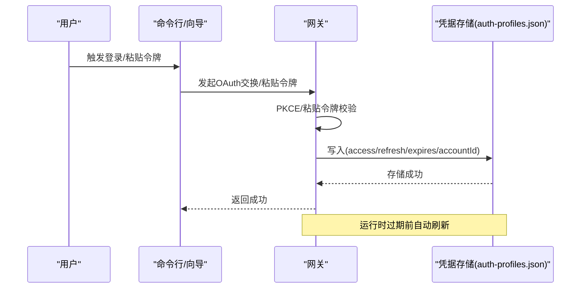
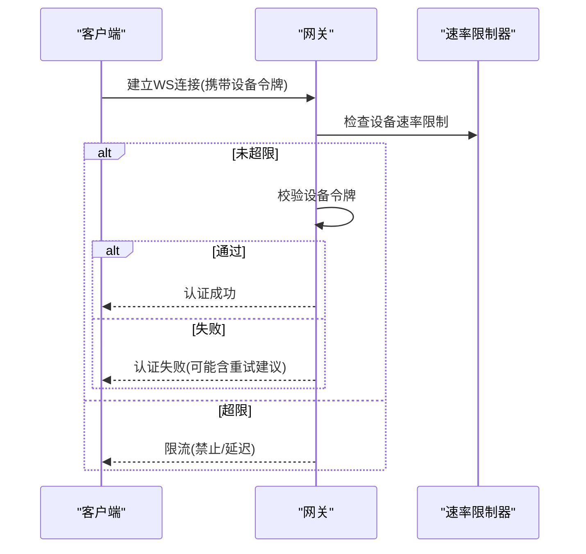
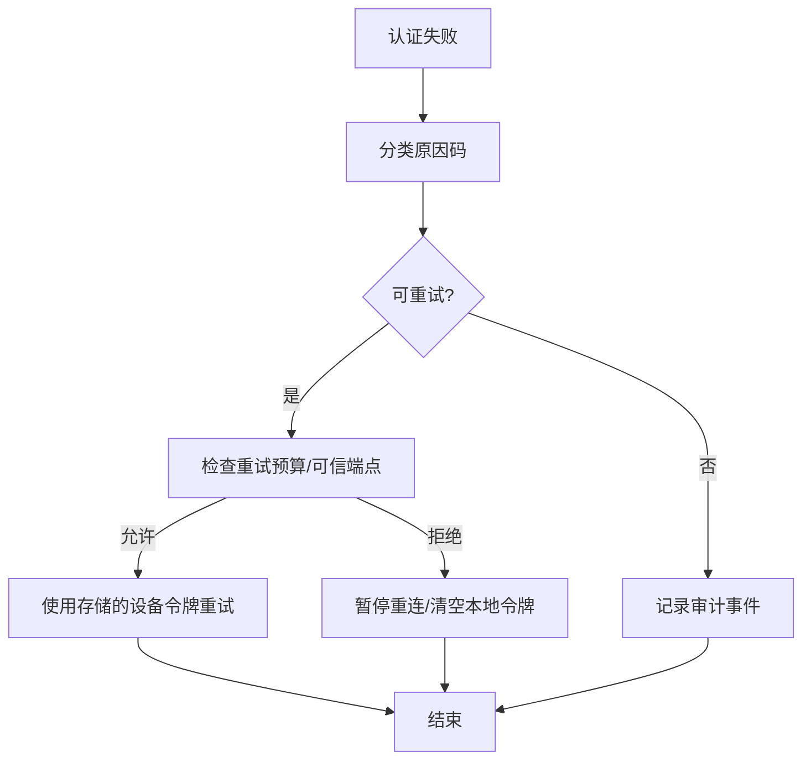
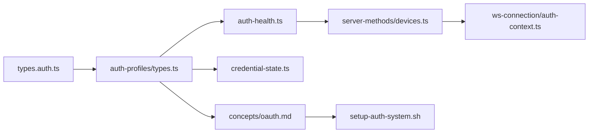

# 认证与授权

<cite>
**本文引用的文件**
- [docs/gateway/authentication.md](file://docs/gateway/authentication.md)
- [docs/concepts/oauth.md](file://docs/concepts/oauth.md)
- [docs/auth-credential-semantics.md](file://docs/auth-credential-semantics.md)
- [docs/automation/auth-monitoring.md](file://docs/automation/auth-monitoring.md)
- [src/config/types.auth.ts](file://src/config/types.auth.ts)
- [src/agents/auth-profiles/types.ts](file://src/agents/auth-profiles/types.ts)
- [src/agents/auth-health.ts](file://src/agents/auth-health.ts)
- [src/agents/auth-profiles/credential-state.ts](file://src/agents/auth-profiles/credential-state.ts)
- [src/gateway/server-methods/devices.ts](file://src/gateway/server-methods/devices.ts)
- [src/shared/device-auth.ts](file://src/shared/device-auth.ts)
- [src/shared/device-auth-store.ts](file://src/shared/device-auth-store.ts)
- [src/gateway/server/ws-connection/auth-context.ts](file://src/gateway/server/ws-connection/auth-context.ts)
- [scripts/setup-auth-system.sh](file://scripts/setup-auth-system.sh)
- [apps/shared/OpenClawKit/Sources/OpenClawKit/GatewayChannel.swift](file://apps/shared/OpenClawKit/Sources/OpenClawKit/GatewayChannel.swift)
</cite>

## 目录
1. [简介](#简介)
2. [项目结构](#项目结构)
3. [核心组件](#核心组件)
4. [架构总览](#架构总览)
5. [详细组件分析](#详细组件分析)
6. [依赖关系分析](#依赖关系分析)
7. [性能考量](#性能考量)
8. [故障排除指南](#故障排除指南)
9. [结论](#结论)
10. [附录](#附录)

## 简介
本文件面向OpenClaw认证与授权系统，系统性说明多类认证方式（API密钥、OAuth令牌、设备令牌、用户凭据）的实现机制与运行流程；阐述授权策略、权限模型与访问控制；解释凭据管理、轮换与生命周期；并提供本地、远程与混合认证场景的配置示例与运维建议。文档同时覆盖认证失败处理、重试机制与安全审计要点，帮助管理员完成系统配置与故障排查。

## 项目结构
OpenClaw在“文档-配置-运行时”三层中分别承载认证与授权能力：
- 文档层：提供OAuth流程、凭据语义、监控与自动化脚本等权威说明
- 配置层：定义认证配置结构与凭据类型
- 运行时层：实现凭据健康检查、OAuth刷新、设备令牌轮换与校验、速率限制与重试策略

图示来源
- [docs/concepts/oauth.md:1-159](file://docs/concepts/oauth.md#L1-L159)
- [docs/auth-credential-semantics.md:1-46](file://docs/auth-credential-semantics.md#L1-L46)
- [docs/automation/auth-monitoring.md:1-45](file://docs/automation/auth-monitoring.md#L1-L45)
- [src/config/types.auth.ts:1-30](file://src/config/types.auth.ts#L1-L30)
- [src/agents/auth-profiles/types.ts:1-82](file://src/agents/auth-profiles/types.ts#L1-L82)
- [src/gateway/server-methods/devices.ts:1-260](file://src/gateway/server-methods/devices.ts#L1-L260)
- [scripts/setup-auth-system.sh:1-120](file://scripts/setup-auth-system.sh#L1-L120)

章节来源
- [docs/gateway/authentication.md:1-56](file://docs/gateway/authentication.md#L1-L56)
- [docs/concepts/oauth.md:1-159](file://docs/concepts/oauth.md#L1-L159)
- [docs/auth-credential-semantics.md:1-46](file://docs/auth-credential-semantics.md#L1-L46)
- [docs/automation/auth-monitoring.md:1-45](file://docs/automation/auth-monitoring.md#L1-L45)
- [src/config/types.auth.ts:1-30](file://src/config/types.auth.ts#L1-L30)
- [src/agents/auth-profiles/types.ts:1-82](file://src/agents/auth-profiles/types.ts#L1-L82)
- [src/gateway/server-methods/devices.ts:1-260](file://src/gateway/server-methods/devices.ts#L1-L260)
- [scripts/setup-auth-system.sh:1-120](file://scripts/setup-auth-system.sh#L1-L120)

## 核心组件
- 认证配置模型：定义认证档案与全局顺序、退避策略
- 凭据类型模型：API密钥、Bearer令牌、OAuth三类凭据及其元数据
- 凭据健康与状态：凭据可用性评估、到期状态解析、健康摘要构建
- 设备令牌与访问控制：设备令牌轮换/吊销、角色与作用域、速率限制与重试
- 自动化监控与运维：OAuth到期监控、systemd定时任务、通知通道

章节来源
- [src/config/types.auth.ts:1-30](file://src/config/types.auth.ts#L1-L30)
- [src/agents/auth-profiles/types.ts:1-82](file://src/agents/auth-profiles/types.ts#L1-L82)
- [src/agents/auth-health.ts:1-284](file://src/agents/auth-health.ts#L1-L284)
- [src/agents/auth-profiles/credential-state.ts:1-75](file://src/agents/auth-profiles/credential-state.ts#L1-L75)
- [src/gateway/server-methods/devices.ts:1-260](file://src/gateway/server-methods/devices.ts#L1-L260)
- [src/shared/device-auth.ts:1-31](file://src/shared/device-auth.ts#L1-L31)
- [src/shared/device-auth-store.ts:1-29](file://src/shared/device-auth-store.ts#L1-L29)

## 架构总览
OpenClaw认证体系由“凭据存储—健康评估—自动刷新—访问控制—监控告警”构成闭环。客户端通过网关进行认证，网关根据设备令牌与角色作用域进行授权；代理侧维护凭据健康与轮转；系统通过自动化脚本与定时任务保障长期可用性。

图示来源
- [src/gateway/server/ws-connection/auth-context.ts:180-218](file://src/gateway/server/ws-connection/auth-context.ts#L180-L218)
- [src/gateway/server-methods/devices.ts:171-231](file://src/gateway/server-methods/devices.ts#L171-L231)
- [src/agents/auth-health.ts:187-283](file://src/agents/auth-health.ts#L187-L283)
- [src/agents/auth-profiles/credential-state.ts:13-24](file://src/agents/auth-profiles/credential-state.ts#L13-L24)
- [docs/automation/auth-monitoring.md:1-45](file://docs/automation/auth-monitoring.md#L1-L45)

## 详细组件分析

### 组件A：凭据类型与配置模型
- 模型职责
  - 定义认证档案配置结构与全局顺序
  - 支持API密钥、Bearer令牌、OAuth三种凭据类型
  - 提供退避与失败窗口参数，用于账单/限流策略
- 关键点
  - 档案类型字段明确区分静态令牌与可刷新OAuth
  - 支持按代理覆盖使用顺序，便于特定Agent锁定轮换策略
  - 使用版本化存储，支持迁移与修复

图示来源
- [src/config/types.auth.ts:1-30](file://src/config/types.auth.ts#L1-L30)
- [src/agents/auth-profiles/types.ts:5-36](file://src/agents/auth-profiles/types.ts#L5-L36)

章节来源
- [src/config/types.auth.ts:1-30](file://src/config/types.auth.ts#L1-L30)
- [src/agents/auth-profiles/types.ts:1-82](file://src/agents/auth-profiles/types.ts#L1-L82)

### 组件B：凭据健康与状态评估
- 能力概述
  - 对API密钥、Bearer令牌、OAuth凭据进行可用性与有效期评估
  - 生成按档案与供应商聚合的健康摘要
  - 将过期/即将过期/缺失等状态映射为统一健康等级
- 关键流程
  - 解析到期状态（缺失/无效/已过期/有效）
  - 评估凭据资格（缺参/过期/不可解析引用等）
  - 构建供应商级健康摘要，用于CLI与自动化输出

图示来源
- [src/agents/auth-profiles/credential-state.ts:34-74](file://src/agents/auth-profiles/credential-state.ts#L34-L74)
- [src/agents/auth-health.ts:80-185](file://src/agents/auth-health.ts#L80-L185)

章节来源
- [src/agents/auth-profiles/credential-state.ts:1-75](file://src/agents/auth-profiles/credential-state.ts#L1-L75)
- [src/agents/auth-health.ts:1-284](file://src/agents/auth-health.ts#L1-L284)
- [docs/auth-credential-semantics.md:1-46](file://docs/auth-credential-semantics.md#L1-L46)

### 组件C：OAuth令牌交换、存储与刷新
- 流程要点
  - 支持PKCE登录与刷新，存储于代理侧凭据库
  - 令牌作为“令牌池”，避免跨客户端互相挤出
  - 运行时在过期前自动刷新，并在首次调用时续期
- 多账户与路由
  - 支持多档案ID与会话级覆盖，实现多账号隔离或按需路由

图示来源
- [docs/concepts/oauth.md:83-122](file://docs/concepts/oauth.md#L83-L122)
- [docs/concepts/oauth.md:41-55](file://docs/concepts/oauth.md#L41-L55)

章节来源
- [docs/concepts/oauth.md:1-159](file://docs/concepts/oauth.md#L1-L159)
- [docs/gateway/authentication.md:1-56](file://docs/gateway/authentication.md#L1-L56)

### 组件D：设备令牌与访问控制
- 能力概述
  - 设备令牌轮换与吊销，支持角色与作用域
  - 基于设备ID与角色的令牌校验，结合速率限制
  - 客户端具备重试预算与失败暂停策略
- 关键流程
  - 网关侧校验设备令牌，失败记录并触发速率限制
  - 客户端在可信重试端点上尝试使用存储的设备令牌
  - 管理员可通过网关方法对设备令牌进行轮换与吊销

图示来源
- [src/gateway/server/ws-connection/auth-context.ts:180-218](file://src/gateway/server/ws-connection/auth-context.ts#L180-L218)
- [src/gateway/server-methods/devices.ts:171-231](file://src/gateway/server-methods/devices.ts#L171-L231)
- [apps/shared/OpenClawKit/Sources/OpenClawKit/GatewayChannel.swift:703-748](file://apps/shared/OpenClawKit/Sources/OpenClawKit/GatewayChannel.swift#L703-L748)

章节来源
- [src/gateway/server-methods/devices.ts:1-260](file://src/gateway/server-methods/devices.ts#L1-L260)
- [src/shared/device-auth.ts:1-31](file://src/shared/device-auth.ts#L1-L31)
- [src/shared/device-auth-store.ts:1-29](file://src/shared/device-auth-store.ts#L1-L29)
- [src/gateway/server/ws-connection/auth-context.ts:180-218](file://src/gateway/server/ws-connection/auth-context.ts#L180-L218)
- [apps/shared/OpenClawKit/Sources/OpenClawKit/GatewayChannel.swift:703-748](file://apps/shared/OpenClawKit/Sources/OpenClawKit/GatewayChannel.swift#L703-L748)

### 组件E：凭据管理、轮换与生命周期
- 生命周期阶段
  - 创建：通过命令行或向导导入API密钥、粘贴令牌或完成OAuth交换
  - 存储：写入代理侧凭据库，支持SecretRef引用
  - 刷新：OAuth凭据在过期前自动刷新；Bearer令牌按到期状态处理
  - 轮换：设备令牌可按角色轮换；API密钥可替换
  - 吊销：设备令牌可按角色吊销；OAuth凭据可清理
- 轮换与安全
  - 设备令牌轮换后客户端需更新本地存储
  - OAuth刷新采用文件锁保护，避免并发冲突
  - SecretRef仅支持用户提供的静态凭据，不包含运行时轮换材料

章节来源
- [docs/gateway/authentication.md:1-56](file://docs/gateway/authentication.md#L1-L56)
- [docs/concepts/oauth.md:112-122](file://docs/concepts/oauth.md#L112-L122)
- [src/agents/auth-profiles/credential-state.ts:1-75](file://src/agents/auth-profiles/credential-state.ts#L1-L75)
- [src/gateway/server-methods/devices.ts:171-231](file://src/gateway/server-methods/devices.ts#L171-L231)
- [docs/reference/secretref-credential-surface.md:1-24](file://docs/reference/secretref-credential-surface.md#L1-L24)

### 组件F：认证失败处理、重试与安全审计
- 失败分类
  - 认证失败原因码涵盖格式、过载、限流、账单、超时、模型不存在、会话过期等
- 重试机制
  - 客户端在可信重试端点上基于预算与错误类型决定是否重试
  - 对令牌不匹配等错误，客户端可选择清除本地存储以避免循环失败
- 安全审计
  - 系统通过CLI与自动化脚本输出认证健康状态
  - systemd定时任务周期性检查并发送通知

图示来源
- [src/agents/auth-health.ts:38-48](file://src/agents/auth-health.ts#L38-L48)
- [apps/shared/OpenClawKit/Sources/OpenClawKit/GatewayChannel.swift:703-748](file://apps/shared/OpenClawKit/Sources/OpenClawKit/GatewayChannel.swift#L703-L748)
- [docs/automation/auth-monitoring.md:1-45](file://docs/automation/auth-monitoring.md#L1-L45)

章节来源
- [src/agents/auth-health.ts:1-284](file://src/agents/auth-health.ts#L1-L284)
- [apps/shared/OpenClawKit/Sources/OpenClawKit/GatewayChannel.swift:703-748](file://apps/shared/OpenClawKit/Sources/OpenClawKit/GatewayChannel.swift#L703-L748)
- [docs/automation/auth-monitoring.md:1-45](file://docs/automation/auth-monitoring.md#L1-L45)

## 依赖关系分析
- 配置到运行时
  - AuthConfig驱动凭据选择与轮换顺序
  - AuthProfileStore承载凭据与使用统计
- 运行时到网关
  - 设备令牌校验与速率限制在网关侧执行
  - 客户端重试逻辑与错误处理在SDK侧实现
- 文档到脚本
  - 文档定义流程，脚本落地systemd定时与通知

图示来源
- [src/config/types.auth.ts:1-30](file://src/config/types.auth.ts#L1-L30)
- [src/agents/auth-profiles/types.ts:1-82](file://src/agents/auth-profiles/types.ts#L1-L82)
- [src/agents/auth-health.ts:1-284](file://src/agents/auth-health.ts#L1-L284)
- [src/agents/auth-profiles/credential-state.ts:1-75](file://src/agents/auth-profiles/credential-state.ts#L1-L75)
- [src/gateway/server-methods/devices.ts:1-260](file://src/gateway/server-methods/devices.ts#L1-L260)
- [src/gateway/server/ws-connection/auth-context.ts:180-218](file://src/gateway/server/ws-connection/auth-context.ts#L180-L218)
- [docs/concepts/oauth.md:1-159](file://docs/concepts/oauth.md#L1-L159)
- [scripts/setup-auth-system.sh:1-120](file://scripts/setup-auth-system.sh#L1-L120)

章节来源
- [src/config/types.auth.ts:1-30](file://src/config/types.auth.ts#L1-L30)
- [src/agents/auth-profiles/types.ts:1-82](file://src/agents/auth-profiles/types.ts#L1-L82)
- [src/agents/auth-health.ts:1-284](file://src/agents/auth-health.ts#L1-L284)
- [src/agents/auth-profiles/credential-state.ts:1-75](file://src/agents/auth-profiles/credential-state.ts#L1-L75)
- [src/gateway/server-methods/devices.ts:1-260](file://src/gateway/server-methods/devices.ts#L1-L260)
- [src/gateway/server/ws-connection/auth-context.ts:180-218](file://src/gateway/server/ws-connection/auth-context.ts#L180-L218)
- [docs/concepts/oauth.md:1-159](file://docs/concepts/oauth.md#L1-L159)
- [scripts/setup-auth-system.sh:1-120](file://scripts/setup-auth-system.sh#L1-L120)

## 性能考量
- 凭据健康与状态评估为纯内存计算，复杂度与档案数量线性相关
- OAuth刷新采用文件锁保护，避免高并发下的重复刷新
- 速率限制器基于滑动窗口与失败计数，降低恶意尝试影响
- CLI健康检查与自动化脚本适合在定时任务中运行，减少实时开销

## 故障排除指南
- OAuth到期/缺失
  - 使用CLI健康检查获取稳定退出码与JSON输出
  - 配置systemd定时任务与通知通道，及时发现异常
- 设备令牌问题
  - 在网关侧轮换/吊销设备令牌，确保客户端更新本地存储
  - 检查速率限制状态，避免因频繁失败被临时封禁
- 凭据语义与兼容性
  - 参考凭据语义文档，确认令牌/过期时间/引用解析规则
  - 对于SecretRef，仅支持用户提供的静态凭据，不包含运行时轮换材料

章节来源
- [docs/automation/auth-monitoring.md:1-45](file://docs/automation/auth-monitoring.md#L1-L45)
- [scripts/setup-auth-system.sh:1-120](file://scripts/setup-auth-system.sh#L1-L120)
- [docs/auth-credential-semantics.md:1-46](file://docs/auth-credential-semantics.md#L1-L46)
- [src/gateway/server-methods/devices.ts:171-231](file://src/gateway/server-methods/devices.ts#L171-L231)
- [src/gateway/server/ws-connection/auth-context.ts:180-218](file://src/gateway/server/ws-connection/auth-context.ts#L180-L218)

## 结论
OpenClaw认证与授权体系以“清晰的凭据模型+可靠的健康评估+严格的访问控制+完善的自动化监控”为核心，既满足本地长期运行的稳定性需求，也兼顾远程与混合场景的安全与可用性。通过合理的配置与运维实践，可在保证安全的前提下获得良好的用户体验与可观测性。

## 附录

### 场景配置示例（无代码片段）
- 本地认证（API密钥）
  - 在网关主机设置环境变量或使用向导导入
  - 使用CLI检查状态，确认凭据可用
- 远程认证（OAuth）
  - 通过命令行完成PKCE登录，凭据存储于代理侧
  - 配置systemd定时任务与通知通道，定期检查到期状态
- 混合认证（设备令牌+OAuth）
  - 客户端建立WS连接时携带设备令牌，网关侧校验并结合速率限制
  - 对令牌不匹配等错误，客户端按预算与策略决定是否重试或清除本地令牌

章节来源
- [docs/gateway/authentication.md:1-56](file://docs/gateway/authentication.md#L1-L56)
- [docs/concepts/oauth.md:83-122](file://docs/concepts/oauth.md#L83-L122)
- [src/gateway/server/ws-connection/auth-context.ts:180-218](file://src/gateway/server/ws-connection/auth-context.ts#L180-L218)
- [apps/shared/OpenClawKit/Sources/OpenClawKit/GatewayChannel.swift:703-748](file://apps/shared/OpenClawKit/Sources/OpenClawKit/GatewayChannel.swift#L703-L748)