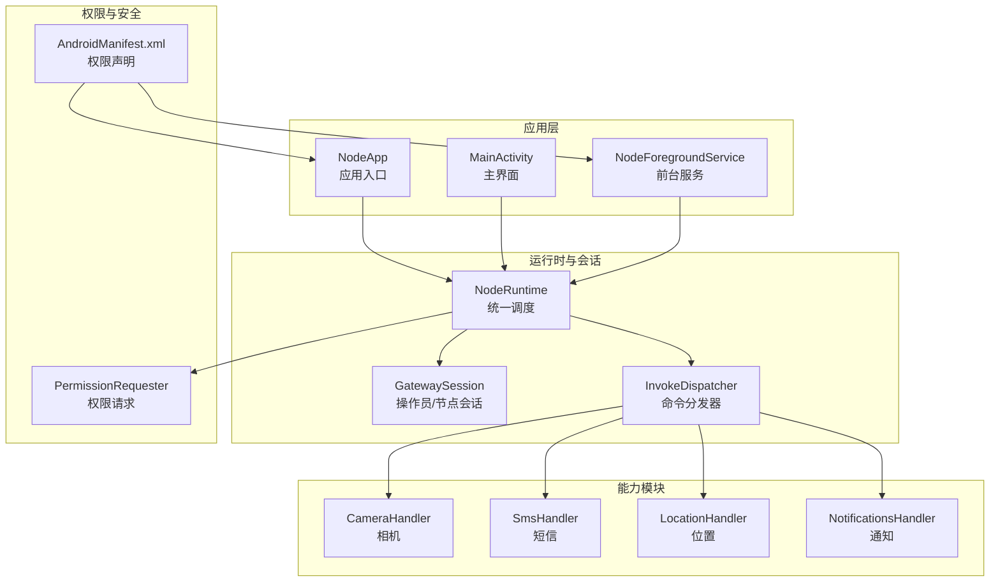
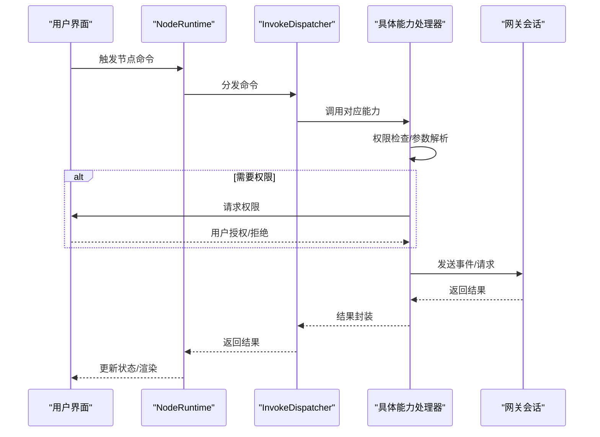
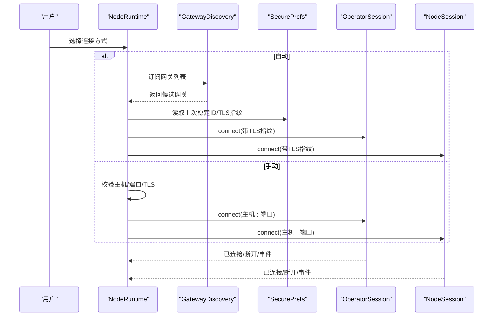
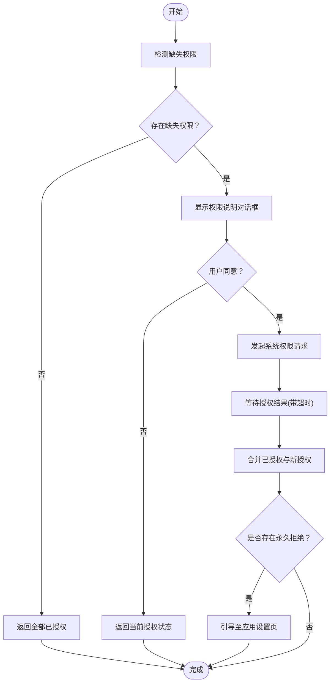
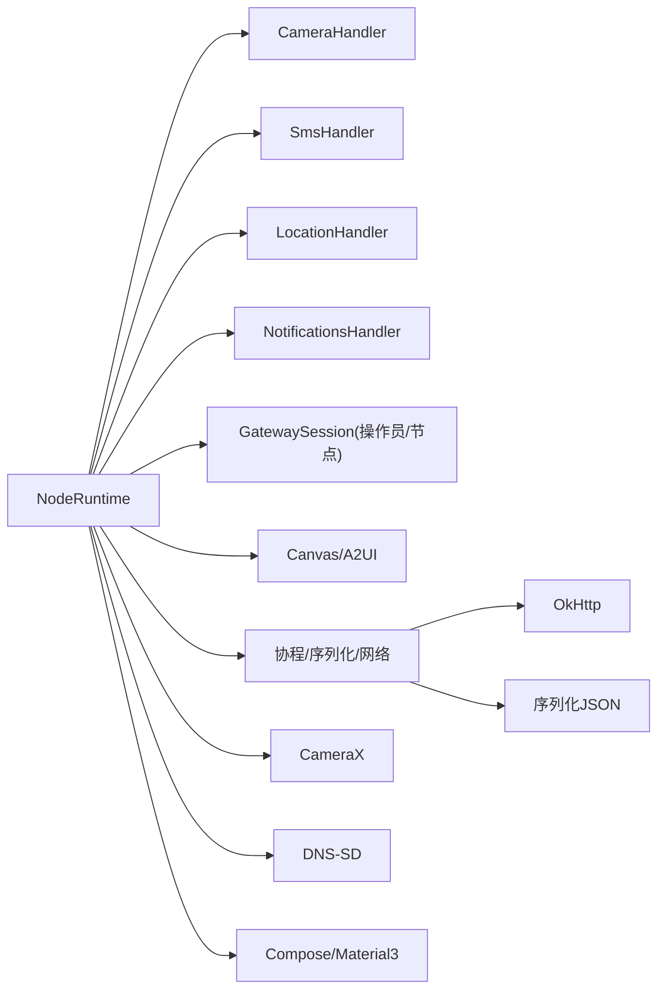

# Android节点

<cite>
**本文引用的文件**
- [apps/android/README.md](file://apps/android/README.md)
- [apps/android/app/src/main/java/ai/openclaw/app/NodeApp.kt](file://apps/android/app/src/main/java/ai/openclaw/app/NodeApp.kt)
- [apps/android/app/src/main/java/ai/openclaw/app/NodeRuntime.kt](file://apps/android/app/src/main/java/ai/openclaw/app/NodeRuntime.kt)
- [apps/android/app/src/main/java/ai/openclaw/app/PermissionRequester.kt](file://apps/android/app/src/main/java/ai/openclaw/app/PermissionRequester.kt)
- [apps/android/app/src/main/java/ai/openclaw/app/NodeForegroundService.kt](file://apps/android/app/src/main/java/ai/openclaw/app/NodeForegroundService.kt)
- [apps/android/app/src/main/AndroidManifest.xml](file://apps/android/app/src/main/AndroidManifest.xml)
- [apps/android/app/build.gradle.kts](file://apps/android/app/build.gradle.kts)
- [apps/android/app/src/main/java/ai/openclaw/app/node/CameraHandler.kt](file://apps/android/app/src/main/java/ai/openclaw/app/node/CameraHandler.kt)
- [apps/android/app/src/main/java/ai/openclaw/app/node/SmsHandler.kt](file://apps/android/app/src/main/java/ai/openclaw/app/node/SmsHandler.kt)
- [apps/android/app/src/main/java/ai/openclaw/app/node/LocationHandler.kt](file://apps/android/app/src/main/java/ai/openclaw/app/node/LocationHandler.kt)
- [apps/android/app/src/main/java/ai/openclaw/app/node/NotificationsHandler.kt](file://apps/android/app/src/main/java/ai/openclaw/app/node/NotificationsHandler.kt)
- [apps/android/scripts/perf-startup-benchmark.sh](file://apps/android/scripts/perf-startup-benchmark.sh)
</cite>

## 目录
1. [简介](#简介)
2. [项目结构](#项目结构)
3. [核心组件](#核心组件)
4. [架构总览](#架构总览)
5. [详细组件分析](#详细组件分析)
6. [依赖关系分析](#依赖关系分析)
7. [性能与优化](#性能与优化)
8. [故障排查指南](#故障排查指南)
9. [结论](#结论)
10. [附录](#附录)

## 简介
本文件面向开发者与运维人员，系统化梳理 OpenClaw Android 节点（Node）的技术架构、权限管理、设备配对与连接流程、运行时权限处理、能力边界（相机、短信、位置、通知、个人数据等）、签名打包与发布策略、OTA 更新机制现状说明、性能优化与兼容性建议，以及扩展开发与调试实践。

## 项目结构
Android 节点位于 apps/android，采用 Kotlin + Jetpack Compose 构建，核心入口为 Application 与主界面，运行时通过 NodeRuntime 统一编排网关会话、节点命令分发与各能力模块；权限请求由 PermissionRequester 统一处理；前台服务用于维持长连接状态提示；清单文件声明了必要的权限与服务；构建脚本支持本地签名与混淆压缩。

图表来源
- [apps/android/app/src/main/java/ai/openclaw/app/NodeApp.kt:1-27](file://apps/android/app/src/main/java/ai/openclaw/app/NodeApp.kt#L1-L27)
- [apps/android/app/src/main/java/ai/openclaw/app/NodeRuntime.kt:1-120](file://apps/android/app/src/main/java/ai/openclaw/app/NodeRuntime.kt#L1-L120)
- [apps/android/app/src/main/java/ai/openclaw/app/NodeForegroundService.kt:1-80](file://apps/android/app/src/main/java/ai/openclaw/app/NodeForegroundService.kt#L1-L80)
- [apps/android/app/src/main/AndroidManifest.xml:1-77](file://apps/android/app/src/main/AndroidManifest.xml#L1-L77)

章节来源
- [apps/android/README.md:1-229](file://apps/android/README.md#L1-L229)
- [apps/android/app/src/main/AndroidManifest.xml:1-77](file://apps/android/app/src/main/AndroidManifest.xml#L1-L77)

## 核心组件
- 应用入口与运行时
  - NodeApp：初始化 NodeRuntime，并在 Debug 构建启用 StrictMode。
  - NodeRuntime：集中管理网关发现、TLS 指纹校验、会话连接、命令分发、Canvas/A2UI、语音/聊天、相机/位置/短信/通知/系统/联系人/日历/运动等能力模块的状态与调用。
- 权限请求
  - PermissionRequester：封装多权限一次性请求、拒绝后引导至系统设置、超时控制与合并结果。
- 前台服务
  - NodeForegroundService：显示连接状态与麦克风监听状态，支持停止断开连接。
- 清单与构建
  - AndroidManifest.xml：声明网络、定位、相机、录音、短信、通知、通知监听服务、文件共享 Provider 等权限与服务。
  - build.gradle.kts：配置 minSdk/targetSdk、签名、混淆、ABI 支持、Compose、CameraX、DNS-SD、测试依赖等。

章节来源
- [apps/android/app/src/main/java/ai/openclaw/app/NodeApp.kt:1-27](file://apps/android/app/src/main/java/ai/openclaw/app/NodeApp.kt#L1-L27)
- [apps/android/app/src/main/java/ai/openclaw/app/NodeRuntime.kt:1-200](file://apps/android/app/src/main/java/ai/openclaw/app/NodeRuntime.kt#L1-L200)
- [apps/android/app/src/main/java/ai/openclaw/app/PermissionRequester.kt:1-134](file://apps/android/app/src/main/java/ai/openclaw/app/PermissionRequester.kt#L1-L134)
- [apps/android/app/src/main/java/ai/openclaw/app/NodeForegroundService.kt:1-159](file://apps/android/app/src/main/java/ai/openclaw/app/NodeForegroundService.kt#L1-L159)
- [apps/android/app/src/main/AndroidManifest.xml:1-77](file://apps/android/app/src/main/AndroidManifest.xml#L1-L77)
- [apps/android/app/build.gradle.kts:1-214](file://apps/android/app/build.gradle.kts#L1-L214)

## 架构总览
Android 节点通过 NodeRuntime 统一编排，对外暴露“节点命令”能力，内部按需调用相机、短信、位置、通知、系统、联系人、日历、运动等 Handler；权限请求在需要时触发；前台服务持续展示连接状态并可手动断开。

图表来源
- [apps/android/app/src/main/java/ai/openclaw/app/NodeRuntime.kt:120-200](file://apps/android/app/src/main/java/ai/openclaw/app/NodeRuntime.kt#L120-L200)
- [apps/android/app/src/main/java/ai/openclaw/app/node/CameraHandler.kt:1-176](file://apps/android/app/src/main/java/ai/openclaw/app/node/CameraHandler.kt#L1-L176)
- [apps/android/app/src/main/java/ai/openclaw/app/node/SmsHandler.kt:1-20](file://apps/android/app/src/main/java/ai/openclaw/app/node/SmsHandler.kt#L1-L20)
- [apps/android/app/src/main/java/ai/openclaw/app/node/LocationHandler.kt:1-101](file://apps/android/app/src/main/java/ai/openclaw/app/node/LocationHandler.kt#L1-L101)
- [apps/android/app/src/main/java/ai/openclaw/app/node/NotificationsHandler.kt:1-162](file://apps/android/app/src/main/java/ai/openclaw/app/node/NotificationsHandler.kt#L1-L162)

## 详细组件分析

### 设备配对与连接流程
- 连接模式
  - 自动连接：基于上次发现的稳定 ID 与已保存的 TLS 指纹，仅在可信网关间自动重连。
  - 手动连接：输入主机、端口、TLS 开关，校验指纹后建立操作员与节点双会话。
- TLS 指纹校验
  - 首次连接时探测远端指纹，弹出信任提示，确认后持久化并继续连接。
- 会话生命周期
  - 操作员会话负责聊天与配置获取；节点会话负责节点事件与命令下发；断线自动重连，断开时清理 Canvas 状态并回退本地 Canvas。

图表来源
- [apps/android/app/src/main/java/ai/openclaw/app/NodeRuntime.kt:520-760](file://apps/android/app/src/main/java/ai/openclaw/app/NodeRuntime.kt#L520-L760)

章节来源
- [apps/android/README.md:143-163](file://apps/android/README.md#L143-L163)
- [apps/android/app/src/main/java/ai/openclaw/app/NodeRuntime.kt:520-760](file://apps/android/app/src/main/java/ai/openclaw/app/NodeRuntime.kt#L520-L760)

### 权限申请机制与运行时权限处理
- 权限请求器
  - 多权限一次性请求，自动区分“需要理由”与“被永久拒绝”，必要时引导到系统设置。
  - 超时控制与结果合并，确保即使部分权限已在别处授予也能正确返回。
- 平台权限
  - 网络、定位、相机、录音、短信、通知、通知监听服务、媒体读取、联系人、日历、运动识别等。
- 典型场景
  - 相机拍照/录像：需要 CAMERA/RECORD_AUDIO（含音频时），失败时显示 HUD 错误提示。
  - 位置查询：要求前台可见且具备 ACCESS_FINE_LOCATION 或 ACCESS_COARSE_LOCATION，否则报错。
  - 通知监听：需要开启通知监听服务，未连接时尝试重新绑定。
  - 短信发送：需要 SEND_SMS 权限，错误码从底层映射为标准节点错误。

图表来源
- [apps/android/app/src/main/java/ai/openclaw/app/PermissionRequester.kt:1-134](file://apps/android/app/src/main/java/ai/openclaw/app/PermissionRequester.kt#L1-L134)

章节来源
- [apps/android/README.md:165-170](file://apps/android/README.md#L165-L170)
- [apps/android/app/src/main/AndroidManifest.xml:1-77](file://apps/android/app/src/main/AndroidManifest.xml#L1-L77)
- [apps/android/app/src/main/java/ai/openclaw/app/PermissionRequester.kt:1-134](file://apps/android/app/src/main/java/ai/openclaw/app/PermissionRequester.kt#L1-L134)

### 相机能力（拍照/录像）
- 能力边界
  - 列表设备、拍照、录制视频（可选包含音频）。
  - 录像大小限制：超过阈值将拒绝并删除临时文件。
- 错误处理
  - 捕获异常并转换为节点错误码，同时通过 HUD 展示错误信息。
- 交互反馈
  - 拍照/录制前显示 HUD，成功后短暂提示，失败时高亮错误。

章节来源
- [apps/android/app/src/main/java/ai/openclaw/app/node/CameraHandler.kt:1-176](file://apps/android/app/src/main/java/ai/openclaw/app/node/CameraHandler.kt#L1-L176)

### 短信发送能力
- 能力边界
  - 通过 SmsHandler 将参数转交底层 SmsManager 执行，错误映射为节点错误码。
- 权限要求
  - 需要 SEND_SMS 权限。

章节来源
- [apps/android/app/src/main/java/ai/openclaw/app/node/SmsHandler.kt:1-20](file://apps/android/app/src/main/java/ai/openclaw/app/node/SmsHandler.kt#L1-L20)
- [apps/android/app/src/main/AndroidManifest.xml:1-77](file://apps/android/app/src/main/AndroidManifest.xml#L1-L77)

### 位置服务能力
- 能力边界
  - 获取位置：支持最大年龄、超时、精度（精确/粗略）等参数；后台不可用时报错。
- 权限要求
  - 需要 ACCESS_FINE_LOCATION 或 ACCESS_COARSE_LOCATION；精确模式需具备细粒度权限。
- 准确性策略
  - 根据目标精度与设备权限动态选择 GPS/网络提供者组合。

章节来源
- [apps/android/app/src/main/java/ai/openclaw/app/node/LocationHandler.kt:1-101](file://apps/android/app/src/main/java/ai/openclaw/app/node/LocationHandler.kt#L1-L101)

### 通知管理能力
- 能力边界
  - 列出通知快照、执行打开/忽略/回复等动作；若服务未连接则尝试重新绑定。
- 权限要求
  - 需要通知监听服务权限；未启用时返回空快照。

章节来源
- [apps/android/app/src/main/java/ai/openclaw/app/node/NotificationsHandler.kt:1-162](file://apps/android/app/src/main/java/ai/openclaw/app/node/NotificationsHandler.kt#L1-L162)
- [apps/android/app/src/main/AndroidManifest.xml:1-77](file://apps/android/app/src/main/AndroidManifest.xml#L1-L77)

### 个人数据访问能力
- 联系人
  - 读写权限声明，具体实现由对应 Handler 提供。
- 日历
  - 读写权限声明，具体实现由对应 Handler 提供。
- 章节来源
  - [apps/android/app/src/main/AndroidManifest.xml:20-24](file://apps/android/app/src/main/AndroidManifest.xml#L20-L24)

### 前台服务与通知
- 前台服务类型
  - 使用 FOREGROUND_SERVICE 与 FOREGROUND_SERVICE_DATA_SYNC 类型，显示连接状态与麦克风监听状态。
- 动作按钮
  - 支持“断开连接”一键停止服务并断开网关。

章节来源
- [apps/android/app/src/main/java/ai/openclaw/app/NodeForegroundService.kt:1-159](file://apps/android/app/src/main/java/ai/openclaw/app/NodeForegroundService.kt#L1-L159)
- [apps/android/app/src/main/AndroidManifest.xml:4-6](file://apps/android/app/src/main/AndroidManifest.xml#L4-L6)

## 依赖关系分析
- 运行时依赖
  - 协程、序列化、OkHttp、CameraX、DNS-SD、Compose、Material3、安全加密库等。
- 测试与工具
  - Robolectric、MockWebServer、Kotest、ktlint、Compose BOM 等。
- 构建与打包
  - 支持本地签名、ProGuard/R8 混淆与资源收缩、多 ABI 架构打包。

图表来源
- [apps/android/app/src/main/java/ai/openclaw/app/NodeRuntime.kt:1-200](file://apps/android/app/src/main/java/ai/openclaw/app/NodeRuntime.kt#L1-L200)
- [apps/android/app/build.gradle.kts:155-209](file://apps/android/app/build.gradle.kts#L155-L209)

章节来源
- [apps/android/app/build.gradle.kts:1-214](file://apps/android/app/build.gradle.kts#L1-L214)

## 性能与优化
- 启动性能
  - 提供冷启动宏基准脚本，输出中位/最小/最大耗时与变异系数，并可与历史基线对比。
- 代码质量与体积
  - 启用 ktlint、Compose BOM、资源排除、混淆与资源收缩；多 ABI 支持兼顾兼容性。
- UI/交互
  - Live Edit 与 Apply Changes 支持热迭代；前台服务状态实时更新。
- 建议
  - 优先保证关键路径无阻塞；合理使用协程作用域；避免在主线程执行 IO；利用 Compose 的重组优化；严格控制权限弹窗频率。

章节来源
- [apps/android/scripts/perf-startup-benchmark.sh:1-125](file://apps/android/scripts/perf-startup-benchmark.sh#L1-L125)
- [apps/android/app/build.gradle.kts:74-125](file://apps/android/app/build.gradle.kts#L74-L125)
- [apps/android/README.md:134-142](file://apps/android/README.md#L134-L142)

## 故障排查指南
- 常见问题定位
  - 配对未批准：在网关侧批准最新设备配对请求后再重试。
  - A2UI 主机不可达：确保网关 Canvas Host 可达且保持“屏幕”标签页激活；应用会在首次 A2UI 不可达时进行 TTL 安全的自动刷新。
  - 节点后台不可用：应用不在前台或“屏幕”标签页未激活，导致 Canvas 命令不可用。
  - 权限相关：相机/录音/位置/通知监听等权限未授予或被永久拒绝，按提示前往设置开启。
- 连接问题
  - 首次 TLS 指纹校验失败：检查网关证书与端口；确认指纹验证通过后重连。
  - 自动连接未发生：确认已保存的稳定 ID 与 TLS 指纹有效，且网关处于可发现状态。
- 调试建议
  - 使用 Debug 构建启用 StrictMode；关注日志与 HUD 提示；结合宏基准脚本定位回归。

章节来源
- [apps/android/README.md:196-224](file://apps/android/README.md#L196-L224)
- [apps/android/app/src/main/java/ai/openclaw/app/NodeRuntime.kt:709-760](file://apps/android/app/src/main/java/ai/openclaw/app/NodeRuntime.kt#L709-L760)

## 结论
OpenClaw Android 节点以 NodeRuntime 为核心，围绕“节点命令”能力提供相机、短信、位置、通知、系统与个人数据等扩展；通过 PermissionRequester 实现一致的权限申请体验；借助前台服务与 TLS 指纹校验保障连接安全与可用性；构建脚本与基准脚本支撑高质量交付与持续优化。建议在扩展新能力时遵循现有分发与权限模式，严格控制后台行为与权限弹窗频率，持续关注启动与运行时性能。

## 附录

### 签名打包与发布
- 本地签名
  - 在 Gradle 属性中配置密钥库路径、密码、别名与密钥密码；满足条件时启用 release 签名。
- 构建产物命名
  - 输出文件名包含版本号与构建类型，便于归档与分发。
- 发布策略
  - 当前仓库未包含应用商店发布脚本；建议在 CI 中集成签名与 APK/BUNDLE 生成，并配合变更记录与版本号管理。

章节来源
- [apps/android/app/build.gradle.kts:3-31](file://apps/android/app/build.gradle.kts#L3-L31)
- [apps/android/app/build.gradle.kts:127-139](file://apps/android/app/build.gradle.kts#L127-L139)

### OTA 更新机制
- 当前状态
  - 仓库未提供内置 OTA 更新实现；建议通过外部渠道（如应用商店或自有分发平台）进行版本推送与安装。
- 推荐实践
  - 采用分阶段灰度、变更日志与回滚策略；在应用内提供“检查更新”入口并校验签名与版本。

### 扩展开发与调试
- 新增节点命令
  - 在 InvokeDispatcher 中注册新命令到对应 Handler；在 NodeRuntime 中注入 Handler 并接入状态流。
- 自定义权限集成
  - 在清单中声明所需权限；在 PermissionRequester 中处理请求与引导；在 Handler 中进行权限前置校验。
- 调试技巧
  - 使用 Debug 构建 StrictMode；利用宏基准脚本与热点提取脚本；在 UI 层保持前台活跃以便后台能力测试。

章节来源
- [apps/android/app/src/main/java/ai/openclaw/app/NodeRuntime.kt:120-200](file://apps/android/app/src/main/java/ai/openclaw/app/NodeRuntime.kt#L120-L200)
- [apps/android/app/src/main/java/ai/openclaw/app/PermissionRequester.kt:1-134](file://apps/android/app/src/main/java/ai/openclaw/app/PermissionRequester.kt#L1-L134)
- [apps/android/README.md:134-142](file://apps/android/README.md#L134-L142)