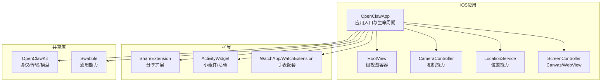
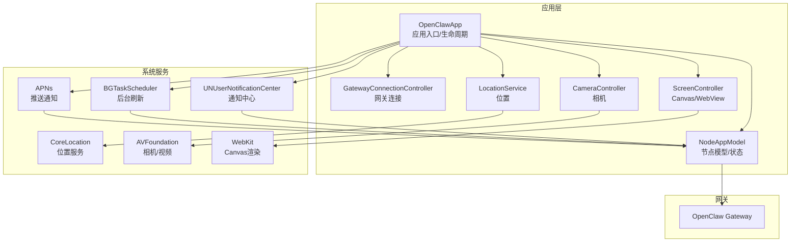
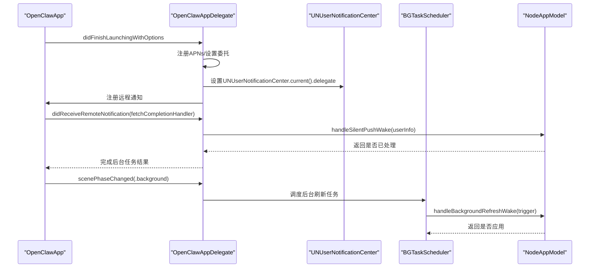
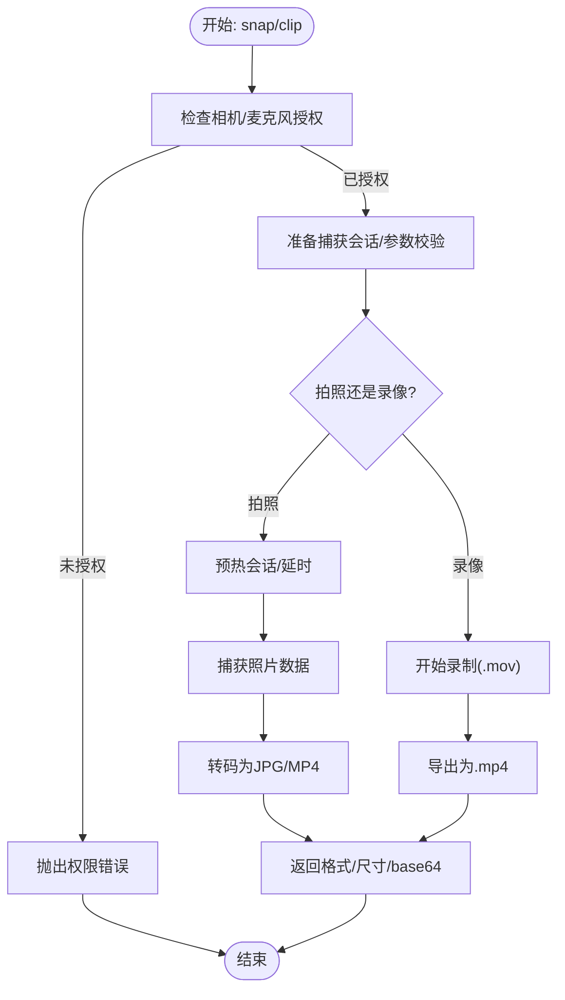
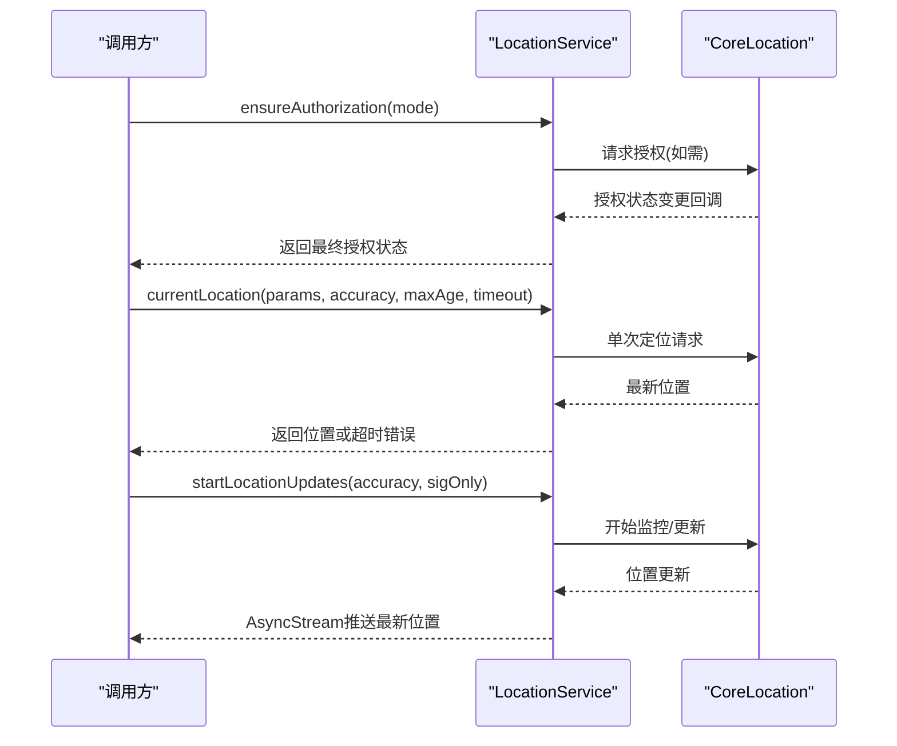
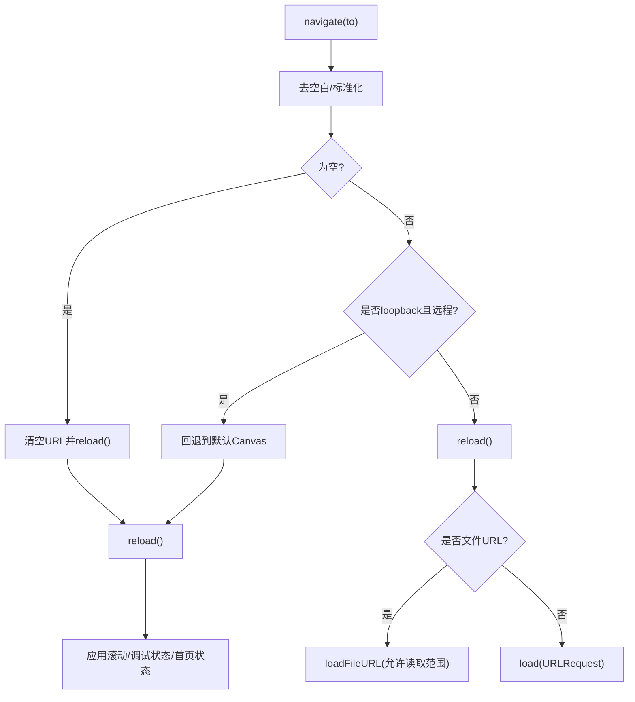
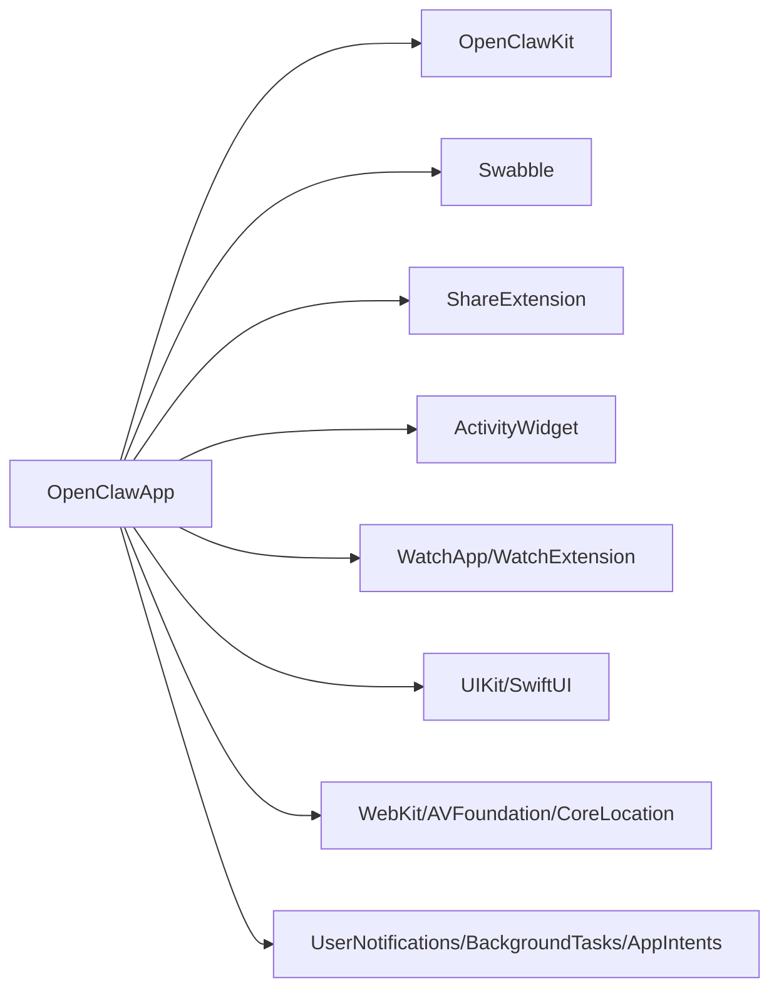

# iOS节点

<cite>
**本文引用的文件**
- [apps/ios/README.md](file://apps/ios/README.md)
- [apps/ios/project.yml](file://apps/ios/project.yml)
- [apps/ios/Sources/OpenClawApp.swift](file://apps/ios/Sources/OpenClawApp.swift)
- [apps/ios/Sources/RootView.swift](file://apps/ios/Sources/RootView.swift)
- [apps/ios/Sources/Camera/CameraController.swift](file://apps/ios/Sources/Camera/CameraController.swift)
- [apps/ios/Sources/Location/LocationService.swift](file://apps/ios/Sources/Location/LocationService.swift)
- [apps/ios/Sources/Screen/ScreenController.swift](file://apps/ios/Sources/Screen/ScreenController.swift)
</cite>

## 目录
1. [简介](#简介)
2. [项目结构](#项目结构)
3. [核心组件](#核心组件)
4. [架构总览](#架构总览)
5. [详细组件分析](#详细组件分析)
6. [依赖关系分析](#依赖关系分析)
7. [性能与功耗优化](#性能与功耗优化)
8. [测试与验证策略](#测试与验证策略)
9. [发布与分发](#发布与分发)
10. [故障排查指南](#故障排查指南)
11. [结论](#结论)
12. [附录](#附录)

## 简介
本文件面向OpenClaw iOS节点（iPhone应用），提供从功能特性、安装配置到使用场景与系统集成的完整技术文档。重点覆盖以下方面：
- 设备配对机制与权限请求
- 后台限制处理与唤醒策略
- Canvas控制、相机访问、位置服务与系统集成功能
- App Store发布流程、企业部署方案与测试策略
- 性能优化、电池管理、网络适配与用户体验设计建议
- 开发框架、第三方集成与调试工具实践

iOS节点当前处于超早期(alpha)阶段，功能以“前台优先”为主，后台行为仍在持续加固中。

**章节来源**
- [apps/ios/README.md:1-178](file://apps/ios/README.md#L1-L178)

## 项目结构
iOS节点位于apps/ios目录，采用SwiftUI应用主体，通过XcodeGen生成工程配置，依赖共享库OpenClawKit与Swabble，并包含分享扩展、小组件与watchOS配套应用等扩展目标。工程配置集中于project.yml，包含构建脚本、签名配置、Info.plist键值与多目标设置。

**图表来源**
- [apps/ios/project.yml:38-325](file://apps/ios/project.yml#L38-L325)

**章节来源**
- [apps/ios/project.yml:1-325](file://apps/ios/project.yml#L1-L325)

## 核心组件
- 应用入口与生命周期：OpenClawApp负责初始化NodeAppModel、GatewayConnectionController，注册远程通知与深链回调，监听场景状态变化。
- 摄像头能力：CameraController封装相机授权、拍照、拍视频、设备枚举与转码导出。
- 位置服务：LocationService封装授权模式切换、一次性定位、显著位置变化与实时更新流。
- Canvas/屏幕控制：ScreenController封装导航、重载、快照、A2UI交互与本地/远程URL加载。
- 扩展与系统集成：分享扩展、小组件、Live Activities、通知与watch镜像提示。

**章节来源**
- [apps/ios/Sources/OpenClawApp.swift:492-542](file://apps/ios/Sources/OpenClawApp.swift#L492-L542)
- [apps/ios/Sources/Camera/CameraController.swift:6-354](file://apps/ios/Sources/Camera/CameraController.swift#L6-L354)
- [apps/ios/Sources/Location/LocationService.swift:6-179](file://apps/ios/Sources/Location/LocationService.swift#L6-L179)
- [apps/ios/Sources/Screen/ScreenController.swift:8-290](file://apps/ios/Sources/Screen/ScreenController.swift#L8-L290)

## 架构总览
iOS节点作为role: node连接到OpenClaw网关，通过OpenClawKit进行协议通信与会话管理；应用层负责系统权限、后台任务调度、通知与UI渲染。

**图表来源**
- [apps/ios/Sources/OpenClawApp.swift:16-263](file://apps/ios/Sources/OpenClawApp.swift#L16-L263)
- [apps/ios/Sources/Screen/ScreenController.swift:8-290](file://apps/ios/Sources/Screen/ScreenController.swift#L8-L290)
- [apps/ios/Sources/Camera/CameraController.swift:6-354](file://apps/ios/Sources/Camera/CameraController.swift#L6-L354)
- [apps/ios/Sources/Location/LocationService.swift:6-179](file://apps/ios/Sources/Location/LocationService.swift#L6-L179)

## 详细组件分析

### 应用入口与生命周期（OpenClawApp）
- 初始化与依赖注入：在构造时初始化NodeAppModel与GatewayConnectionController，并在Scene中注入环境。
- 远程通知与静默唤醒：注册APNs，接收deviceToken并在模型可用后更新；处理静默推送触发后台唤醒与数据拉取。
- 场景状态与后台刷新：监听scenePhase变化，必要时调度BGAppRefreshTask以恢复节点状态。
- 通知桥接：解析来自watch的提示通知，镜像为本地通知动作并路由至NodeAppModel处理。

**图表来源**
- [apps/ios/Sources/OpenClawApp.swift:50-156](file://apps/ios/Sources/OpenClawApp.swift#L50-L156)
- [apps/ios/Sources/OpenClawApp.swift:158-263](file://apps/ios/Sources/OpenClawApp.swift#L158-L263)

**章节来源**
- [apps/ios/Sources/OpenClawApp.swift:16-263](file://apps/ios/Sources/OpenClawApp.swift#L16-L263)

### 相机能力（CameraController）
- 授权与参数校验：确保相机/麦克风授权，限定质量与时长范围，避免过大负载。
- 拍照：准备会话、预热、延时、捕获、转码为JPG并返回尺寸与base64。
- 录像：可选音频，.mov录制后转码为.mp4，返回时长与音频标志。
- 设备枚举：支持按位置或设备ID选择摄像头，兼容模拟器与特殊设备。
- 错误处理：统一映射为CameraError，便于上层展示与日志记录。

**图表来源**
- [apps/ios/Sources/Camera/CameraController.swift:40-142](file://apps/ios/Sources/Camera/CameraController.swift#L40-L142)
- [apps/ios/Sources/Camera/CameraController.swift:217-252](file://apps/ios/Sources/Camera/CameraController.swift#L217-L252)

**章节来源**
- [apps/ios/Sources/Camera/CameraController.swift:6-354](file://apps/ios/Sources/Camera/CameraController.swift#L6-L354)

### 位置服务（LocationService）
- 授权模式：支持WhenInUse与Always两种模式，必要时从WhenInUse升级至Always。
- 一次性定位：支持精度、最大年龄与超时控制。
- 实时更新：显著位置变化与常规位置更新双通道，自动暂停与停止。
- 回调与流：支持单次回调与AsyncStream，内部线程安全处理。

**图表来源**
- [apps/ios/Sources/Location/LocationService.swift:34-179](file://apps/ios/Sources/Location/LocationService.swift#L34-L179)

**章节来源**
- [apps/ios/Sources/Location/LocationService.swift:6-179](file://apps/ios/Sources/Location/LocationService.swift#L6-L179)

### Canvas与屏幕控制（ScreenController）
- 导航与重载：支持本地Canvas骨架HTML与外部URL加载，禁止从远程网关加载loopback地址。
- 调试状态：可启用调试状态并在WebView侧注入状态信息。
- A2UI交互：等待A2UI就绪、解析动作体、与Canvas UI交互。
- 快照：支持PNG/JPEG快照，可指定压缩质量与宽度上限。
- WebView生命周期：attach/detach时同步状态与脚本注入。

**图表来源**
- [apps/ios/Sources/Screen/ScreenController.swift:29-71](file://apps/ios/Sources/Screen/ScreenController.swift#L29-L71)
- [apps/ios/Sources/Screen/ScreenController.swift:211-221](file://apps/ios/Sources/Screen/ScreenController.swift#L211-L221)

**章节来源**
- [apps/ios/Sources/Screen/ScreenController.swift:8-290](file://apps/ios/Sources/Screen/ScreenController.swift#L8-L290)

## 依赖关系分析
- 目标依赖：OpenClaw应用依赖OpenClawKit（协议/传输）、Swabble（通用能力）、分享扩展、小组件、watchOS配套。
- 系统框架：UIKit、SwiftUI、WebKit、AVFoundation、CoreLocation、UserNotifications、BackgroundTasks、AppIntents等。
- 配置与脚本：XcodeGen生成工程；SwiftFormat/SwiftLint预构建脚本；Info.plist键值定义权限与能力。

**图表来源**
- [apps/ios/project.yml:38-325](file://apps/ios/project.yml#L38-L325)

**章节来源**
- [apps/ios/project.yml:1-325](file://apps/ios/project.yml#L1-L325)

## 性能与功耗优化
- 前台优先：当前仅前台使用为最可靠模式，避免后台命令限制带来的抖动与失败。
- 相机负载控制：默认限制拍照最大宽度与视频时长，避免过大的base64上传；导出前进行网络优化。
- 位置策略：显著位置变化用于低功耗移动事件；常规更新自动暂停与限制频率。
- 后台唤醒：合理调度BGAppRefreshTask，避免频繁唤醒；静默推送仅在必要时触发。
- 网络与TLS：手动指定网关主机/端口与TLS指纹信任，减少发现失败与重连开销。
- 日志与诊断：开启发现调试日志，定位网络路径问题；过滤子系统日志快速定位问题。

**章节来源**
- [apps/ios/README.md:98-146](file://apps/ios/README.md#L98-L146)
- [apps/ios/Sources/Camera/CameraController.swift:206-215](file://apps/ios/Sources/Camera/CameraController.swift#L206-L215)
- [apps/ios/Sources/Location/LocationService.swift:87-112](file://apps/ios/Sources/Location/LocationService.swift#L87-L112)
- [apps/ios/Sources/OpenClawApp.swift:104-156](file://apps/ios/Sources/OpenClawApp.swift#L104-L156)

## 测试与验证策略
- 前台优先：先在前台复现问题，再验证后台切回后的重连与状态恢复。
- 位置自动化：启用Always权限，触发显著移动或穿越地理围栏，验证事件到达与自动化执行，避免重复风暴。
- 资源影响：短期观察热状态与后台电量消耗，确保无异常。
- 网络路径：必要时切换到手动主机/端口+TLS指纹信任，排除发现失败因素。
- 调试信号：关注ai.openclaw.ios、GatewayDiag、APNs注册失败等日志。

**章节来源**
- [apps/ios/README.md:106-136](file://apps/ios/README.md#L106-L136)
- [apps/ios/README.md:156-178](file://apps/ios/README.md#L156-L178)

## 发布与分发
- 分发状态：公开分发不可用；内部Beta通过本地归档与Fastlane上传TestFlight；本地/手动从源码部署仍为默认开发路径。
- 版本来源：根版本号决定iOS版本；Beta发布使用规范bundle ID并通过临时xcconfig生成。
- APNs期望：本地/手动构建注册sandbox；发布构建使用生产；推送能力与配置文件需匹配bundle ID。
- 本地Beta流程：前置条件包括Xcode、pnpm、xcodegen、fastlane与App Store Connect API Key；支持归档与上传TestFlight，可强制指定构建号。

**章节来源**
- [apps/ios/README.md:5-82](file://apps/ios/README.md#L5-L82)

## 故障排查指南
- 构建与签名基线：重新生成工程、确认团队与bundle ID。
- 网关设置：在应用设置中查看状态、服务器与远端地址，确认配对/认证状态。
- 配对与发现：若需要配对，先在Telegram执行配对批准，再重连；发现不稳定时开启“发现调试日志”查看日志。
- 网络路径：切换到手动主机/端口+TLS指纹信任；在Xcode控制台按子系统/类别过滤日志。
- 后台期望：先在前台复现，再验证后台切换与返回后的重连。

**章节来源**
- [apps/ios/README.md:156-178](file://apps/ios/README.md#L156-L178)

## 结论
iOS节点当前以“前台优先”为核心体验，围绕相机、位置、Canvas与通知等系统能力提供基础节点功能。后台行为与权限处理仍在持续加固中。建议在开发与测试中遵循前台优先原则，结合严格的日志与诊断手段，逐步完善后台唤醒、权限与网络稳定性，为后续App Store发布与更广泛场景奠定基础。

## 附录
- 开发与运行：Xcode 16+、pnpm、xcodegen；本地签名可通过LocalSigning.xcconfig示例配置；快捷命令pnm ios:open一键打开工程。
- 工程生成：xcodegen generate后在Xcode中选择OpenClaw方案、iPhone目标、Debug配置运行。
- 企业部署：当前以TestFlight与本地归档为主；企业部署需遵循Apple企业分发合规要求与证书配置。

**章节来源**
- [apps/ios/README.md:18-48](file://apps/ios/README.md#L18-L48)
- [apps/ios/project.yml:1-325](file://apps/ios/project.yml#L1-L325)