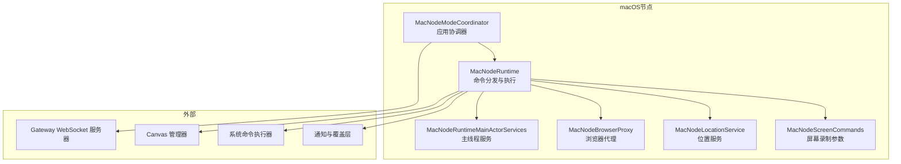
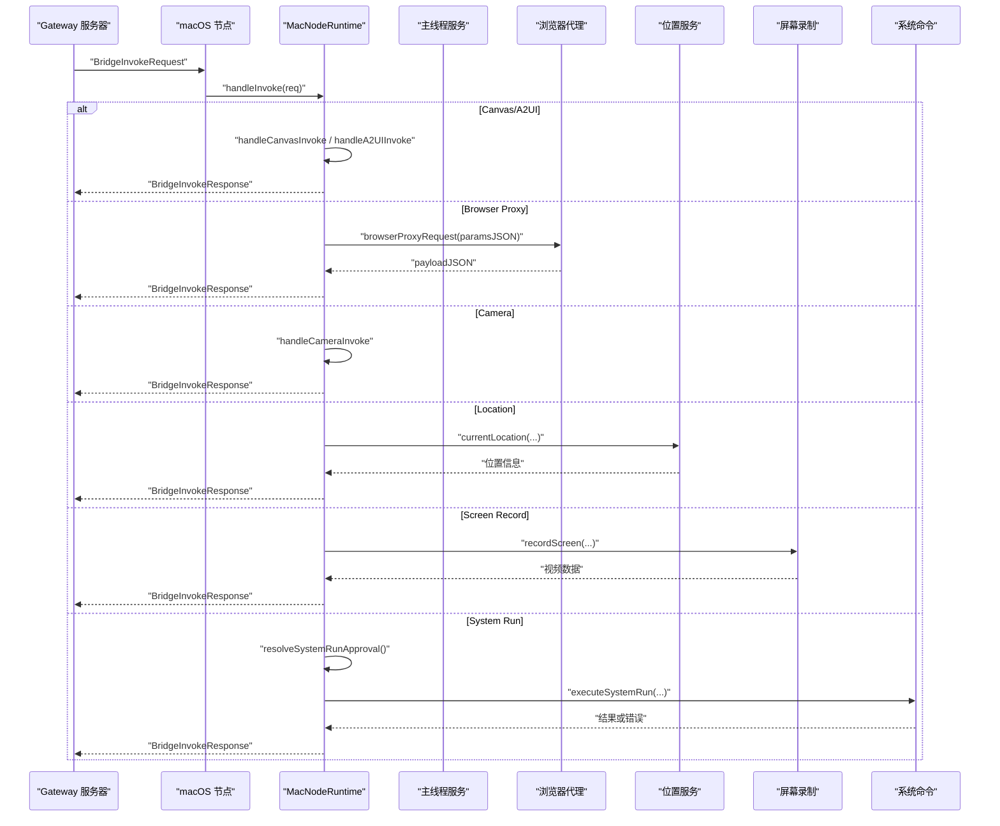
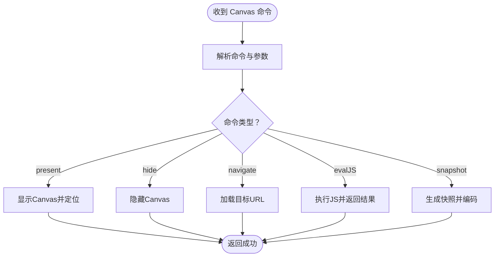
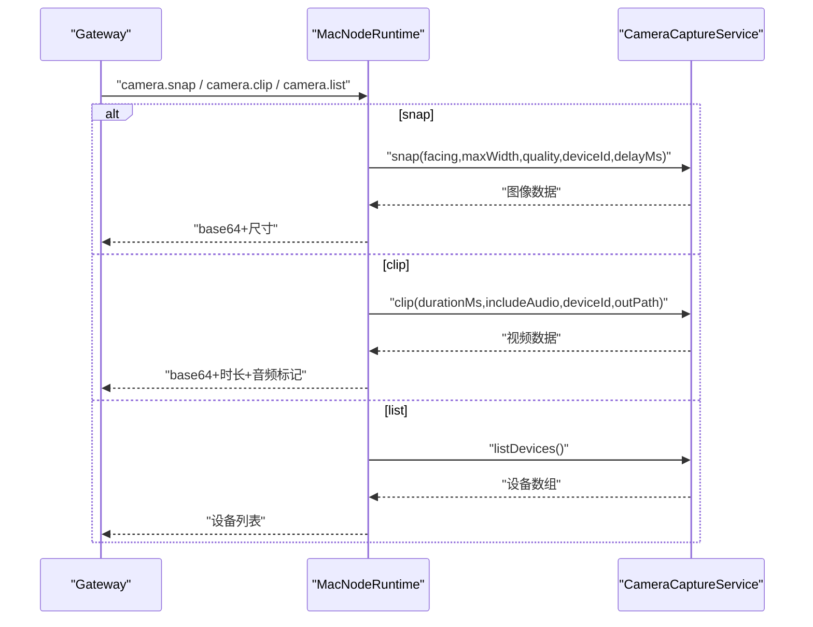
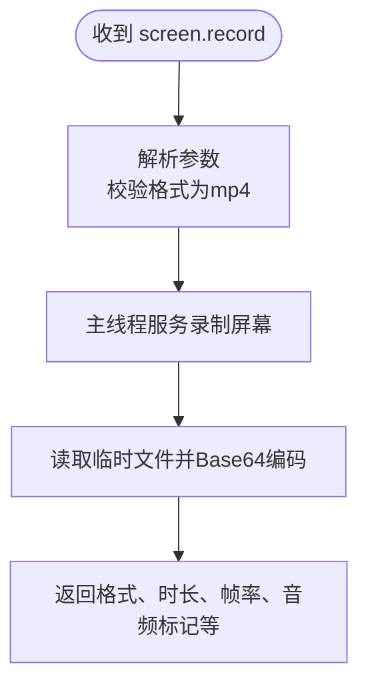
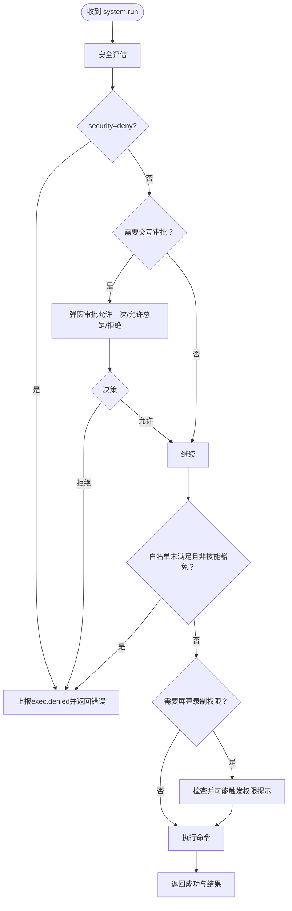
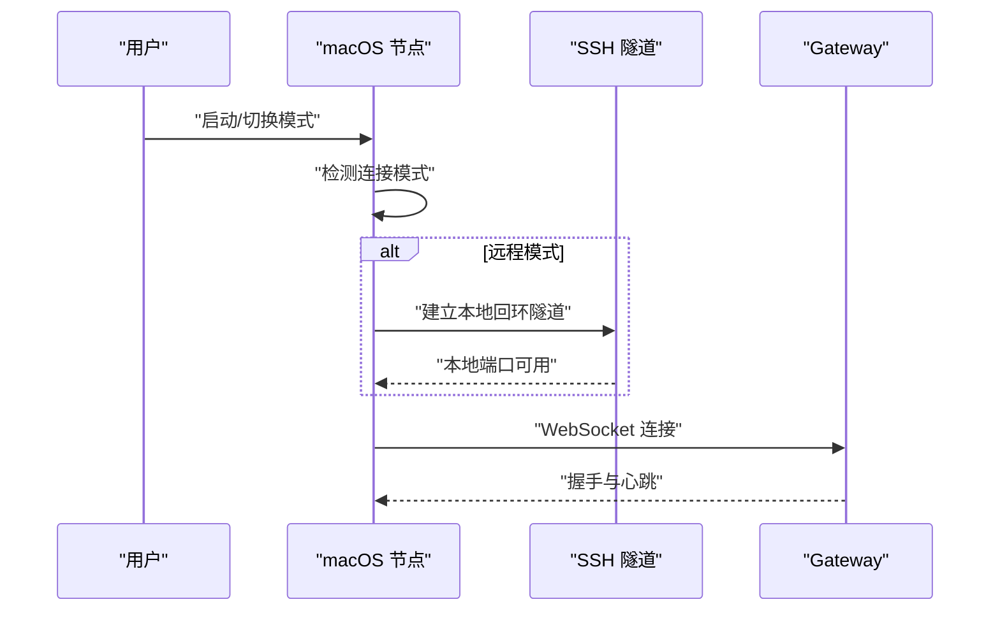
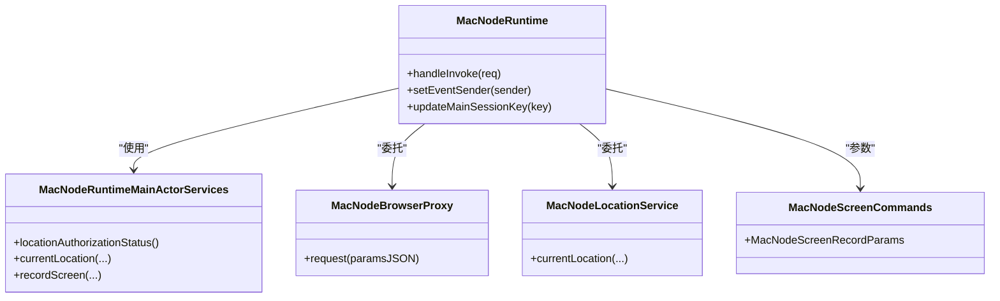

# macOS节点

<cite>
**本文引用的文件**
- [apps/macos/Sources/OpenClaw/NodeMode/MacNodeScreenCommands.swift](file://apps/macos/Sources/OpenClaw/NodeMode/MacNodeScreenCommands.swift)
- [apps/macos/Sources/OpenClaw/NodeMode/MacNodeRuntime.swift](file://apps/macos/Sources/OpenClaw/NodeMode/MacNodeRuntime.swift)
- [apps/macos/Sources/OpenClaw/NodeMode/MacNodeBrowserProxy.swift](file://apps/macos/Sources/OpenClaw/NodeMode/MacNodeBrowserProxy.swift)
- [apps/macos/Sources/OpenClaw/NodeMode/MacNodeLocationService.swift](file://apps/macos/Sources/OpenClaw/NodeMode/MacNodeLocationService.swift)
- [apps/macos/Sources/OpenClaw/NodeMode/MacNodeRuntimeMainActorServices.swift](file://apps/macos/Sources/OpenClaw/NodeMode/MacNodeRuntimeMainActorServices.swift)
- [apps/macos/Sources/OpenClaw/NodeMode/MacNodeModeCoordinator.swift](file://apps/macos/Sources/OpenClaw/NodeMode/MacNodeModeCoordinator.swift)
- [apps/macos/Tests/OpenClawIPCTests/MenuContentSmokeTests.swift](file://apps/macos/Tests/OpenClawIPCTests/MenuContentSmokeTests.swift)
- [docs/platforms/macos.md](file://docs/platforms/macos.md)
- [docs/nodes/index.md](file://docs/nodes/index.md)
- [docs/security/README.md](file://docs/security/README.md)
- [src/agents/tools/nodes-tool.ts](file://src/agents/tools/nodes-tool.ts)
- [src/cli/node-cli.ts](file://src/cli/node-cli.ts)
- [scripts/build-and-run-mac.sh](file://scripts/build-and-run-mac.sh)
- [scripts/codesign-mac-app.sh](file://scripts/codesign-mac-app.sh)
- [scripts/package-mac-app.sh](file://scripts/package-mac-app.sh)
- [scripts/notarize-mac-artifact.sh](file://scripts/notarize-mac-artifact.sh)
- [scripts/restart-mac.sh](file://scripts/restart-mac.sh)
- [docs/install/macos-vm.md](file://docs/install/macos-vm.md)
- [docs/help/troubleshooting.md](file://docs/help/troubleshooting.md)
- [docs/debug/node-issue.md](file://docs/debug/node-issue.md)
</cite>

## 目录
1. [简介](#简介)
2. [项目结构](#项目结构)
3. [核心组件](#核心组件)
4. [架构总览](#架构总览)
5. [详细组件分析](#详细组件分析)
6. [依赖关系分析](#依赖关系分析)
7. [性能考虑](#性能考虑)
8. [故障排除指南](#故障排除指南)
9. [结论](#结论)
10. [附录](#附录)

## 简介
本文件面向OpenClaw的macOS节点（菜单栏应用），提供从功能特性、安装配置到使用方法与扩展开发的完整技术文档。重点覆盖以下方面：
- Canvas控制：展示、隐藏、导航、JavaScript执行、截图等
- 相机访问：拍照、拍摄短视频、设备枚举
- 屏幕录制：多参数录制、格式限制、音频开关
- 系统命令执行：权限评估、审批流程、事件上报
- 菜单栏应用模式：本地/远程连接、SSH隧道
- 权限管理、安全策略与隐私保护
- 故障排除、性能优化与最佳实践
- 开发者扩展与自定义集成指南

## 项目结构
macOS节点位于apps/macos目录，采用SwiftUI界面与后台运行的菜单栏应用形态，通过OpenClawIPC与Gateway进行双向通信。核心模块包括：
- NodeMode：节点运行时与命令分发
- NodeModeCoordinator：应用生命周期与模式切换
- RuntimeMainActorServices：主线程服务封装（位置、屏幕录制等）
- BrowserProxy：浏览器代理请求转发
- LocationService：位置授权与定位
- 测试：菜单内容Smoke测试

图示来源
- [apps/macos/Sources/OpenClaw/NodeMode/MacNodeModeCoordinator.swift](file://apps/macos/Sources/OpenClaw/NodeMode/MacNodeModeCoordinator.swift)
- [apps/macos/Sources/OpenClaw/NodeMode/MacNodeRuntime.swift](file://apps/macos/Sources/OpenClaw/NodeMode/MacNodeRuntime.swift)
- [apps/macos/Sources/OpenClaw/NodeMode/MacNodeRuntimeMainActorServices.swift](file://apps/macos/Sources/OpenClaw/NodeMode/MacNodeRuntimeMainActorServices.swift)
- [apps/macos/Sources/OpenClaw/NodeMode/MacNodeBrowserProxy.swift](file://apps/macos/Sources/OpenClaw/NodeMode/MacNodeBrowserProxy.swift)
- [apps/macos/Sources/OpenClaw/NodeMode/MacNodeLocationService.swift](file://apps/macos/Sources/OpenClaw/NodeMode/MacNodeLocationService.swift)
- [apps/macos/Sources/OpenClaw/NodeMode/MacNodeScreenCommands.swift](file://apps/macos/Sources/OpenClaw/NodeMode/MacNodeScreenCommands.swift)

章节来源
- [apps/macos/Sources/OpenClaw/NodeMode/MacNodeModeCoordinator.swift](file://apps/macos/Sources/OpenClaw/NodeMode/MacNodeModeCoordinator.swift)
- [apps/macos/Sources/OpenClaw/NodeMode/MacNodeRuntime.swift](file://apps/macos/Sources/OpenClaw/NodeMode/MacNodeRuntime.swift)
- [apps/macos/Sources/OpenClaw/NodeMode/MacNodeRuntimeMainActorServices.swift](file://apps/macos/Sources/OpenClaw/NodeMode/MacNodeRuntimeMainActorServices.swift)
- [apps/macos/Sources/OpenClaw/NodeMode/MacNodeBrowserProxy.swift](file://apps/macos/Sources/OpenClaw/NodeMode/MacNodeBrowserProxy.swift)
- [apps/macos/Sources/OpenClaw/NodeMode/MacNodeLocationService.swift](file://apps/macos/Sources/OpenClaw/NodeMode/MacNodeLocationService.swift)
- [apps/macos/Sources/OpenClaw/NodeMode/MacNodeScreenCommands.swift](file://apps/macos/Sources/OpenClaw/NodeMode/MacNodeScreenCommands.swift)

## 核心组件
- 命令分发与执行：MacNodeRuntime根据BridgeInvokeRequest分派到Canvas、A2UI、浏览器代理、相机、位置、屏幕录制、系统命令等处理逻辑，并统一返回BridgeInvokeResponse
- 主线程服务：MacNodeRuntimeMainActorServices封装位置、屏幕录制等需要在主线程执行的服务
- 浏览器代理：MacNodeBrowserProxy负责将请求转发给浏览器控制通道
- 位置服务：MacNodeLocationService处理授权状态与定位获取
- 屏幕录制参数：MacNodeScreenRecordParams定义录制参数（屏幕索引、时长、帧率、格式、是否包含音频）

章节来源
- [apps/macos/Sources/OpenClaw/NodeMode/MacNodeRuntime.swift](file://apps/macos/Sources/OpenClaw/NodeMode/MacNodeRuntime.swift)
- [apps/macos/Sources/OpenClaw/NodeMode/MacNodeRuntimeMainActorServices.swift](file://apps/macos/Sources/OpenClaw/NodeMode/MacNodeRuntimeMainActorServices.swift)
- [apps/macos/Sources/OpenClaw/NodeMode/MacNodeBrowserProxy.swift](file://apps/macos/Sources/OpenClaw/NodeMode/MacNodeBrowserProxy.swift)
- [apps/macos/Sources/OpenClaw/NodeMode/MacNodeLocationService.swift](file://apps/macos/Sources/OpenClaw/NodeMode/MacNodeLocationService.swift)
- [apps/macos/Sources/OpenClaw/NodeMode/MacNodeScreenCommands.swift](file://apps/macos/Sources/OpenClaw/NodeMode/MacNodeScreenCommands.swift)

## 架构总览
macOS节点作为Gateway的“节点”，通过WebSocket连接；在远程模式下，应用会建立SSH隧道以本地回环方式连接Gateway。节点内部通过MacNodeRuntime集中处理来自Gateway的invoke请求，按命令类型路由至相应子系统。

图示来源
- [apps/macos/Sources/OpenClaw/NodeMode/MacNodeRuntime.swift](file://apps/macos/Sources/OpenClaw/NodeMode/MacNodeRuntime.swift)
- [apps/macos/Sources/OpenClaw/NodeMode/MacNodeBrowserProxy.swift](file://apps/macos/Sources/OpenClaw/NodeMode/MacNodeBrowserProxy.swift)
- [apps/macos/Sources/OpenClaw/NodeMode/MacNodeRuntimeMainActorServices.swift](file://apps/macos/Sources/OpenClaw/NodeMode/MacNodeRuntimeMainActorServices.swift)
- [apps/macos/Sources/OpenClaw/NodeMode/MacNodeLocationService.swift](file://apps/macos/Sources/OpenClaw/NodeMode/MacNodeLocationService.swift)

## 详细组件分析

### Canvas 控制
- 支持的操作：显示、隐藏、导航、JavaScript执行、截图
- 参数与行为：
  - present/导航：支持目标URL与窗口放置参数
  - evalJS：在Canvas上下文中执行脚本并返回结果
  - snapshot：按格式与最大宽度生成图片，自动选择默认宽度
- 会话键：所有Canvas操作绑定mainSessionKey，确保多会话隔离

图示来源
- [apps/macos/Sources/OpenClaw/NodeMode/MacNodeRuntime.swift](file://apps/macos/Sources/OpenClaw/NodeMode/MacNodeRuntime.swift)

章节来源
- [apps/macos/Sources/OpenClaw/NodeMode/MacNodeRuntime.swift](file://apps/macos/Sources/OpenClaw/NodeMode/MacNodeRuntime.swift)

### 相机访问
- 支持的操作：拍照、拍短视频、列出设备
- 参数与行为：
  - 拍照：支持前置/后置、最大宽度、质量、设备ID、延时
  - 录像：支持时长、音频、设备ID、输出格式
  - 设备列表：返回可用摄像头设备
- 权限与限制：需启用相机功能；超时或无权限时返回明确错误

图示来源
- [apps/macos/Sources/OpenClaw/NodeMode/MacNodeRuntime.swift](file://apps/macos/Sources/OpenClaw/NodeMode/MacNodeRuntime.swift)

章节来源
- [apps/macos/Sources/OpenClaw/NodeMode/MacNodeRuntime.swift](file://apps/macos/Sources/OpenClaw/NodeMode/MacNodeRuntime.swift)

### 屏幕录制
- 命令：screen.record
- 参数：屏幕索引、时长（毫秒）、帧率、格式（当前仅mp4）、是否包含音频
- 行为：调用主线程服务执行录制，返回base64编码的MP4视频与元信息

图示来源
- [apps/macos/Sources/OpenClaw/NodeMode/MacNodeRuntime.swift](file://apps/macos/Sources/OpenClaw/NodeMode/MacNodeRuntime.swift)
- [apps/macos/Sources/OpenClaw/NodeMode/MacNodeScreenCommands.swift](file://apps/macos/Sources/OpenClaw/NodeMode/MacNodeScreenCommands.swift)

章节来源
- [apps/macos/Sources/OpenClaw/NodeMode/MacNodeRuntime.swift](file://apps/macos/Sources/OpenClaw/NodeMode/MacNodeRuntime.swift)
- [apps/macos/Sources/OpenClaw/NodeMode/MacNodeScreenCommands.swift](file://apps/macos/Sources/OpenClaw/NodeMode/MacNodeScreenCommands.swift)

### 系统命令执行
- 命令：system.run
- 安全与审批：
  - 首先进行安全评估（允许/拒绝/白名单匹配/技能豁免等）
  - 若需要交互式审批，则弹出提示并支持“允许一次/允许总是”
  - 支持持久化白名单模式
  - 可选触发屏幕录制权限检查
- 执行与事件：
  - 执行完成后返回结果
  - 对拒绝与异常场景发出事件上报

图示来源
- [apps/macos/Sources/OpenClaw/NodeMode/MacNodeRuntime.swift](file://apps/macos/Sources/OpenClaw/NodeMode/MacNodeRuntime.swift)

章节来源
- [apps/macos/Sources/OpenClaw/NodeMode/MacNodeRuntime.swift](file://apps/macos/Sources/OpenClaw/NodeMode/MacNodeRuntime.swift)

### 菜单栏应用模式与远程访问
- 连接模式：本地/远程/未配置
- 远程模式：应用通过SSH隧道将Gateway端口映射到本地回环，再连接本地端口
- 菜单内容：根据模式渲染不同UI元素（调试面板、Canvas、Swabble、语音等）

图示来源
- [apps/macos/Sources/OpenClaw/NodeMode/MacNodeModeCoordinator.swift](file://apps/macos/Sources/OpenClaw/NodeMode/MacNodeModeCoordinator.swift)
- [apps/macos/Tests/OpenClawIPCTests/MenuContentSmokeTests.swift](file://apps/macos/Tests/OpenClawIPCTests/MenuContentSmokeTests.swift)
- [docs/nodes/index.md](file://docs/nodes/index.md)

章节来源
- [apps/macos/Tests/OpenClawIPCTests/MenuContentSmokeTests.swift](file://apps/macos/Tests/OpenClawIPCTests/MenuContentSmokeTests.swift)
- [docs/nodes/index.md](file://docs/nodes/index.md)

### 权限管理、安全策略与隐私保护
- 权限提示与降级：非交互会话中，任何需要弹窗的写入/执行均会失败，可通过配置改为“拒绝”以优雅降级
- 执行审批：支持白名单、技能豁免、交互式审批与持久化
- 通知策略：支持系统通知、覆盖层通知与自动回退
- 位置权限：根据模式判断授权状态，缺失权限时返回明确错误
- 安全文档：项目安全说明文档提供了威胁模型与合规建议

章节来源
- [apps/macos/Sources/OpenClaw/NodeMode/MacNodeRuntime.swift](file://apps/macos/Sources/OpenClaw/NodeMode/MacNodeRuntime.swift)
- [docs/security/README.md](file://docs/security/README.md)

## 依赖关系分析
- 组件耦合：
  - MacNodeRuntime对各子系统（Canvas、浏览器代理、相机、位置、主线程服务、系统命令）存在高内聚低耦合的委托关系
  - 主线程服务通过闭包注入，便于测试与替换
- 外部依赖：
  - OpenClawIPC：节点与Gateway通信协议
  - OpenClawKit：Canvas管理器、A2UI宿主、工具集
  - 系统框架：AppKit、Foundation、AVFoundation（用于录制与媒体）

图示来源
- [apps/macos/Sources/OpenClaw/NodeMode/MacNodeRuntime.swift](file://apps/macos/Sources/OpenClaw/NodeMode/MacNodeRuntime.swift)
- [apps/macos/Sources/OpenClaw/NodeMode/MacNodeRuntimeMainActorServices.swift](file://apps/macos/Sources/OpenClaw/NodeMode/MacNodeRuntimeMainActorServices.swift)
- [apps/macos/Sources/OpenClaw/NodeMode/MacNodeBrowserProxy.swift](file://apps/macos/Sources/OpenClaw/NodeMode/MacNodeBrowserProxy.swift)
- [apps/macos/Sources/OpenClaw/NodeMode/MacNodeLocationService.swift](file://apps/macos/Sources/OpenClaw/NodeMode/MacNodeLocationService.swift)
- [apps/macos/Sources/OpenClaw/NodeMode/MacNodeScreenCommands.swift](file://apps/macos/Sources/OpenClaw/NodeMode/MacNodeScreenCommands.swift)

## 性能考虑
- Canvas快照：根据格式自动选择最大宽度，避免过大图片传输
- 录屏：优先使用高效编码与合理帧率，避免长时间录制导致内存压力
- 系统命令：在非必要时避免频繁权限弹窗，合理使用“允许总是”以减少交互成本
- 通知：优先系统通知，失败时再回落到覆盖层，降低UI阻塞

## 故障排除指南
- 节点无法连接Gateway
  - 检查本地/远程模式配置与SSH隧道状态
  - 查看日志与重试脚本
- Canvas不可用
  - 确认Canvas已启用；若禁用则返回“CANVAS_DISABLED”
- 相机不可用
  - 确认相机已启用；若禁用则返回“CAMERA_DISABLED”
  - 检查设备列表与权限
- 屏幕录制失败
  - 确认格式为mp4；检查权限与磁盘空间
- 系统命令被拒绝
  - 查看安全评估结果与交互审批记录
  - 使用“execApprovalsGet/Set”核对白名单与基线哈希
- 通知未送达
  - 检查系统通知权限；必要时使用覆盖层通知

章节来源
- [docs/debug/node-issue.md](file://docs/debug/node-issue.md)
- [docs/help/troubleshooting.md](file://docs/help/troubleshooting.md)
- [scripts/restart-mac.sh](file://scripts/restart-mac.sh)

## 结论
macOS节点以菜单栏应用形式提供强大的Canvas控制、相机访问、屏幕录制与系统命令执行能力，结合严格的权限评估与审批流程，兼顾易用性与安全性。通过本地/远程模式与SSH隧道，节点可灵活适配不同部署场景。

## 附录

### 安装与构建
- 本地构建与运行：提供一键脚本，支持签名与打包
- 应用签名与公证：包含签名与公证脚本
- VM环境：提供macOS虚拟机安装说明

章节来源
- [scripts/build-and-run-mac.sh](file://scripts/build-and-run-mac.sh)
- [scripts/codesign-mac-app.sh](file://scripts/codesign-mac-app.sh)
- [scripts/package-mac-app.sh](file://scripts/package-mac-app.sh)
- [scripts/notarize-mac-artifact.sh](file://scripts/notarize-mac-artifact.sh)
- [docs/install/macos-vm.md](file://docs/install/macos-vm.md)

### 使用方法与CLI
- CLI节点管理：nodes与node命令用于节点发现、状态与配置
- 工具集成：nodes-tool提供节点工具能力

章节来源
- [src/cli/node-cli.ts](file://src/cli/node-cli.ts)
- [src/agents/tools/nodes-tool.ts](file://src/agents/tools/nodes-tool.ts)