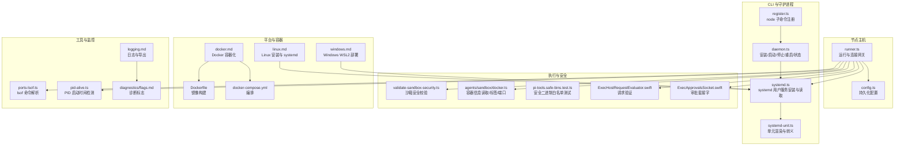
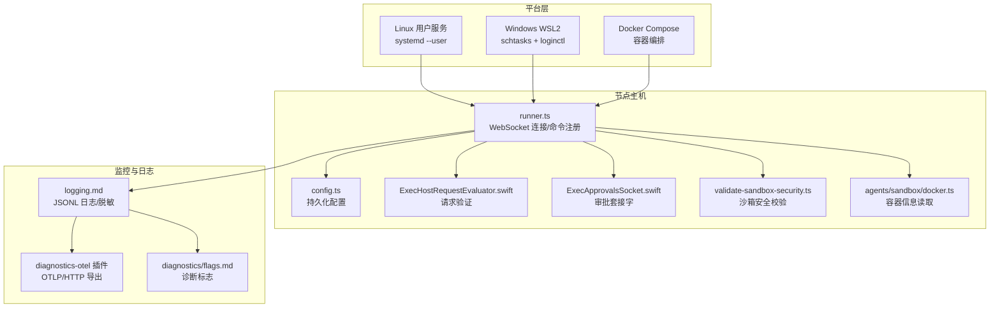
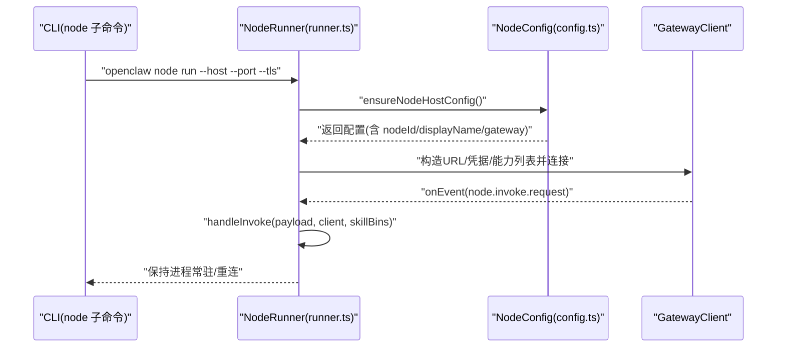
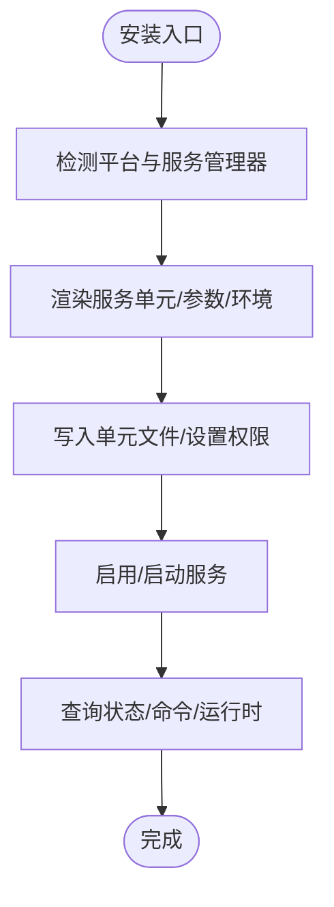
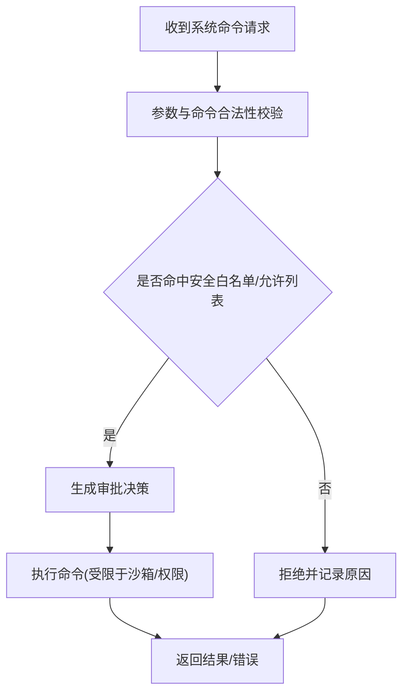
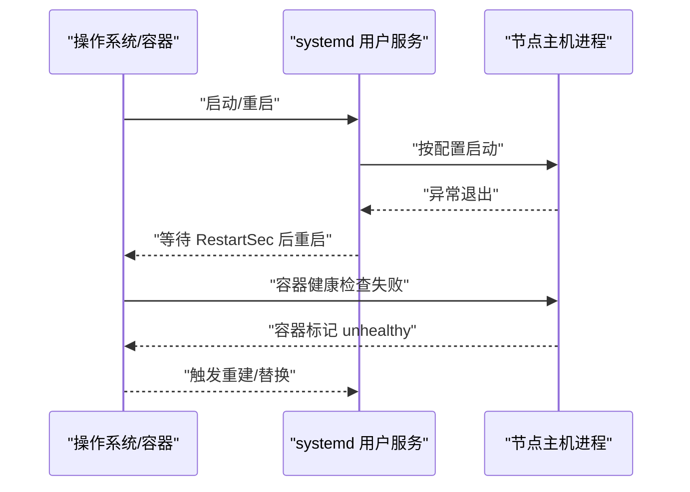
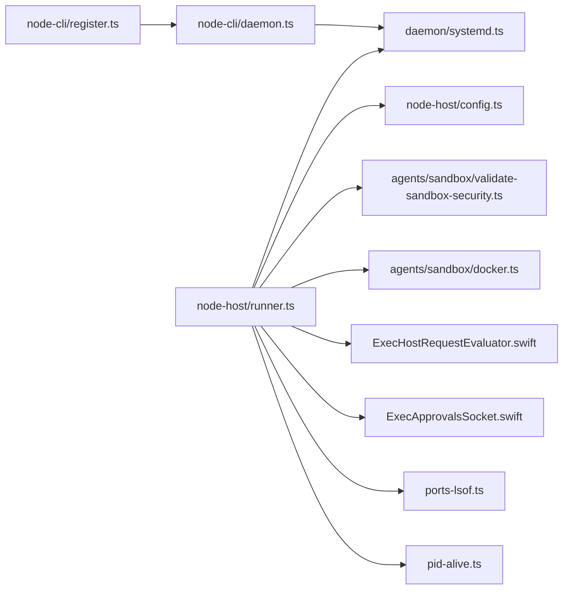

# 无头节点主机

<cite>
**本文引用的文件**
- [src/node-host/runner.ts](file://src/node-host/runner.ts)
- [src/node-host/config.ts](file://src/node-host/config.ts)
- [src/cli/node-cli/register.ts](file://src/cli/node-cli/register.ts)
- [src/cli/node-cli/daemon.ts](file://src/cli/node-cli/daemon.ts)
- [src/daemon/systemd.ts](file://src/daemon/systemd.ts)
- [src/daemon/systemd-unit.ts](file://src/daemon/systemd-unit.ts)
- [src/infra/exec-approvals-config.test.ts](file://src/infra/exec-approvals-config.test.ts)
- [src/agents/pi-tools.safe-bins.test.ts](file://src/agents/pi-tools.safe-bins.test.ts)
- [src/agents/sandbox/docker.ts](file://src/agents/sandbox/docker.ts)
- [src/agents/sandbox/validate-sandbox-security.ts](file://src/agents/sandbox/validate-sandbox-security.ts)
- [src/agents/sandbox/validate-sandbox-security.test.ts](file://src/agents/sandbox/validate-sandbox-security.test.ts)
- [src/infra/ports-lsof.ts](file://src/infra/ports-lsof.ts)
- [src/shared/pid-alive.ts](file://src/shared/pid-alive.ts)
- [apps/macos/Sources/OpenClaw/ExecHostRequestEvaluator.swift](file://apps/macos/Sources/OpenClaw/ExecHostRequestEvaluator.swift)
- [apps/macos/Sources/OpenClaw/ExecApprovalsSocket.swift](file://apps/macos/Sources/OpenClaw/ExecApprovalsSocket.swift)
- [docs/platforms/linux.md](file://docs/platforms/linux.md)
- [docs/platforms/windows.md](file://docs/platforms/windows.md)
- [docs/install/docker.md](file://docs/install/docker.md)
- [scripts/systemd/openclaw-auth-monitor.service](file://scripts/systemd/openclaw-auth-monitor.service)
- [scripts/systemd/openclaw-auth-monitor.timer](file://scripts/systemd/openclaw-auth-monitor.timer)
- [Dockerfile](file://Dockerfile)
- [docker-compose.yml](file://docker-compose.yml)
- [docs/zh-CN/logging.md](file://docs/zh-CN/logging.md)
- [docs/zh-CN/diagnostics/flags.md](file://docs/zh-CN/diagnostics/flags.md)
</cite>

## 目录
1. [引言](#引言)
2. [项目结构](#项目结构)
3. [核心组件](#核心组件)
4. [架构总览](#架构总览)
5. [详细组件分析](#详细组件分析)
6. [依赖分析](#依赖分析)
7. [性能考虑](#性能考虑)
8. [故障排查指南](#故障排查指南)
9. [结论](#结论)
10. [附录](#附录)

## 引言
本技术文档围绕 OpenClaw 的“无头节点主机”能力展开，目标是帮助运维与开发者理解并正确部署、运行与维护无头节点主机。无头节点主机是指在没有图形界面的服务器或容器环境中，以守护进程方式运行的 OpenClaw 节点实例，负责与网关建立安全连接、执行系统命令、管理文件系统访问与进程生命周期，并在 Linux/Windows 服务器以及 Docker 环境中实现稳定的服务注册与自动重启。

本文将从概念、部署场景与配置方法入手，逐步深入到系统命令执行、文件系统访问与进程管理能力；解释守护进程模式、服务注册与自动重启机制；提供 Linux/Windows 服务器与 Docker 容器化的部署指南；给出安全配置、权限隔离与资源限制建议；最后提供监控集成、日志管理与故障诊断的实用方案。

## 项目结构
与无头节点主机直接相关的代码主要分布在以下模块：
- 节点主机运行时与配置：src/node-host/runner.ts、src/node-host/config.ts
- CLI 与守护进程控制：src/cli/node-cli/register.ts、src/cli/node-cli/daemon.ts
- 平台服务安装与状态管理：src/daemon/systemd.ts、src/daemon/systemd-unit.ts
- 执行审批与沙箱安全：src/agents/sandbox/docker.ts、src/agents/sandbox/validate-sandbox-security.ts、src/agents/pi-tools.safe-bins.test.ts
- macOS 执行审批与策略：apps/macos/Sources/OpenClaw/ExecHostRequestEvaluator.swift、apps/macos/Sources/OpenClaw/ExecApprovalsSocket.swift
- 端口占用与 PID 检测：src/infra/ports-lsof.ts、src/shared/pid-alive.ts
- 平台与容器化部署文档：docs/platforms/linux.md、docs/platforms/windows.md、docs/install/docker.md
- 认证监控 systemd 单元：scripts/systemd/openclaw-auth-monitor.service、scripts/systemd/openclaw-auth-monitor.timer
- Docker 配置与镜像：Dockerfile、docker-compose.yml
- 日志与诊断：docs/zh-CN/logging.md、docs/zh-CN/diagnostics/flags.md

**图表来源**
- [src/node-host/runner.ts:144-231](file://src/node-host/runner.ts#L144-L231)
- [src/node-host/config.ts:45-66](file://src/node-host/config.ts#L45-L66)
- [src/cli/node-cli/register.ts:21-110](file://src/cli/node-cli/register.ts#L21-L110)
- [src/cli/node-cli/daemon.ts:91-237](file://src/cli/node-cli/daemon.ts#L91-L237)
- [src/daemon/systemd.ts:62-474](file://src/daemon/systemd.ts#L62-L474)
- [src/daemon/systemd-unit.ts:1-36](file://src/daemon/systemd-unit.ts#L1-L36)
- [src/agents/sandbox/validate-sandbox-security.ts:308-343](file://src/agents/sandbox/validate-sandbox-security.ts#L308-L343)
- [src/agents/sandbox/docker.ts:191-242](file://src/agents/sandbox/docker.ts#L191-L242)
- [src/agents/pi-tools.safe-bins.test.ts:248-284](file://src/agents/pi-tools.safe-bins.test.ts#L248-L284)
- [apps/macos/Sources/OpenClaw/ExecHostRequestEvaluator.swift:14-38](file://apps/macos/Sources/OpenClaw/ExecHostRequestEvaluator.swift#L14-L38)
- [apps/macos/Sources/OpenClaw/ExecApprovalsSocket.swift:807-844](file://apps/macos/Sources/OpenClaw/ExecApprovalsSocket.swift#L807-L844)
- [docs/platforms/linux.md:65-94](file://docs/platforms/linux.md#L65-L94)
- [docs/platforms/windows.md:58-100](file://docs/platforms/windows.md#L58-L100)
- [docs/install/docker.md:35-252](file://docs/install/docker.md#L35-L252)
- [Dockerfile:173-190](file://Dockerfile#L173-L190)
- [docker-compose.yml](file://docker-compose.yml)
- [docs/zh-CN/logging.md:186-252](file://docs/zh-CN/logging.md#L186-L252)
- [docs/zh-CN/diagnostics/flags.md:1-84](file://docs/zh-CN/diagnostics/flags.md#L1-L84)

**章节来源**
- [src/node-host/runner.ts:144-231](file://src/node-host/runner.ts#L144-L231)
- [src/cli/node-cli/register.ts:21-110](file://src/cli/node-cli/register.ts#L21-L110)
- [src/daemon/systemd.ts:62-474](file://src/daemon/systemd.ts#L62-L474)
- [docs/platforms/linux.md:65-94](file://docs/platforms/linux.md#L65-L94)
- [docs/platforms/windows.md:58-100](file://docs/platforms/windows.md#L58-L100)
- [docs/install/docker.md:35-252](file://docs/install/docker.md#L35-L252)

## 核心组件
- 节点主机运行器：负责初始化配置、建立与网关的 WebSocket 连接、注册系统命令与浏览器代理能力、处理节点调用请求。
- 节点主机配置：持久化节点 ID、显示名、网关地址与 TLS 参数等。
- CLI 与守护进程：提供 node 子命令，支持安装、启动、停止、重启、状态查询；在不同平台通过 systemd、launchd、schtasks 注册服务。
- 执行审批与沙箱：对系统命令进行策略校验与审批，结合 Docker 沙箱限制工具能力与文件系统访问范围。
- 平台与容器化：提供 Linux systemd 用户服务、Windows WSL2 自动启动链路、Docker Compose 快速部署与健康检查。
- 日志与诊断：支持 JSONL 日志、敏感信息脱敏、OTLP 导出、诊断标志定向调试。

**章节来源**
- [src/node-host/runner.ts:144-231](file://src/node-host/runner.ts#L144-L231)
- [src/node-host/config.ts:45-66](file://src/node-host/config.ts#L45-L66)
- [src/cli/node-cli/register.ts:21-110](file://src/cli/node-cli/register.ts#L21-L110)
- [src/cli/node-cli/daemon.ts:91-237](file://src/cli/node-cli/daemon.ts#L91-L237)
- [src/agents/sandbox/validate-sandbox-security.ts:308-343](file://src/agents/sandbox/validate-sandbox-security.ts#L308-L343)
- [docs/install/docker.md:469-495](file://docs/install/docker.md#L469-L495)
- [docs/zh-CN/logging.md:186-252](file://docs/zh-CN/logging.md#L186-L252)

## 架构总览
下图展示了无头节点主机在不同平台与容器中的运行架构，包括服务安装、连接建立、命令执行与沙箱隔离、日志与监控等关键环节。

**图表来源**
- [src/node-host/runner.ts:144-231](file://src/node-host/runner.ts#L144-L231)
- [src/node-host/config.ts:45-66](file://src/node-host/config.ts#L45-L66)
- [apps/macos/Sources/OpenClaw/ExecHostRequestEvaluator.swift:14-38](file://apps/macos/Sources/OpenClaw/ExecHostRequestEvaluator.swift#L14-L38)
- [apps/macos/Sources/OpenClaw/ExecApprovalsSocket.swift:807-844](file://apps/macos/Sources/OpenClaw/ExecApprovalsSocket.swift#L807-L844)
- [src/agents/sandbox/validate-sandbox-security.ts:308-343](file://src/agents/sandbox/validate-sandbox-security.ts#L308-L343)
- [src/agents/sandbox/docker.ts:191-242](file://src/agents/sandbox/docker.ts#L191-L242)
- [docs/zh-CN/logging.md:186-252](file://docs/zh-CN/logging.md#L186-L252)
- [docs/zh-CN/diagnostics/flags.md:1-84](file://docs/zh-CN/diagnostics/flags.md#L1-L84)

## 详细组件分析

### 节点主机运行器与配置
- 运行器职责：加载/保存节点配置、解析网关凭据、构造 WebSocket URL、注册系统命令与浏览器代理能力、处理节点调用请求、维持长连接重试。
- 配置持久化：节点 ID、显示名、网关主机/端口/TLS 指纹等，采用原子写入与严格权限保护。
- 路径与环境：确保 PATH 含有 CLI 可执行路径，便于系统命令解析与执行。

**图表来源**
- [src/cli/node-cli/register.ts:40-61](file://src/cli/node-cli/register.ts#L40-L61)
- [src/node-host/runner.ts:144-231](file://src/node-host/runner.ts#L144-L231)
- [src/node-host/config.ts:45-66](file://src/node-host/config.ts#L45-L66)

**章节来源**
- [src/node-host/runner.ts:144-231](file://src/node-host/runner.ts#L144-L231)
- [src/node-host/config.ts:45-66](file://src/node-host/config.ts#L45-L66)

### 守护进程模式与服务注册
- 安装与状态：CLI 提供 install/status/start/stop/restart 子命令，底层通过平台服务管理器（systemd、launchd、schtasks）完成安装与状态读取。
- systemd 用户服务：在 Linux 上默认安装用户服务，支持工作目录、环境变量、命令参数渲染与审计；提供单元文件备份与恢复。
- Windows WSL2：通过 schtasks 在 Windows 开机时启动 WSL，配合 loginctl enable-linger 保证用户服务在无人登录时仍可用。

**图表来源**
- [src/cli/node-cli/daemon.ts:91-237](file://src/cli/node-cli/daemon.ts#L91-L237)
- [src/daemon/systemd.ts:62-474](file://src/daemon/systemd.ts#L62-L474)
- [src/daemon/systemd-unit.ts:1-36](file://src/daemon/systemd-unit.ts#L1-L36)
- [docs/platforms/linux.md:65-94](file://docs/platforms/linux.md#L65-L94)
- [docs/platforms/windows.md:58-100](file://docs/platforms/windows.md#L58-L100)

**章节来源**
- [src/cli/node-cli/daemon.ts:91-237](file://src/cli/node-cli/daemon.ts#L91-L237)
- [src/daemon/systemd.ts:62-474](file://src/daemon/systemd.ts#L62-L474)
- [src/daemon/systemd-unit.ts:1-36](file://src/daemon/systemd-unit.ts#L1-L36)
- [docs/platforms/linux.md:65-94](file://docs/platforms/linux.md#L65-L94)
- [docs/platforms/windows.md:58-100](file://docs/platforms/windows.md#L58-L100)

### 系统命令执行、文件系统访问与进程管理
- 命令执行：节点主机注册系统命令集合，结合执行审批策略与安全二进制白名单，避免危险命令与路径穿越。
- 文件系统访问：通过沙箱安全校验与容器绑定挂载策略，限制工具对宿主文件系统的读写范围。
- 进程管理：在 Linux 上通过 /proc/stat 获取进程启动时间以检测 PID 回收；在 macOS 上通过套接字对等 UID 校验确保审批来源可信；提供 lsof 命令解析辅助端口占用排查。

**图表来源**
- [apps/macos/Sources/OpenClaw/ExecHostRequestEvaluator.swift:14-38](file://apps/macos/Sources/OpenClaw/ExecHostRequestEvaluator.swift#L14-L38)
- [apps/macos/Sources/OpenClaw/ExecApprovalsSocket.swift:807-844](file://apps/macos/Sources/OpenClaw/ExecApprovalsSocket.swift#L807-L844)
- [src/agents/pi-tools.safe-bins.test.ts:248-284](file://src/agents/pi-tools.safe-bins.test.ts#L248-L284)
- [src/agents/sandbox/validate-sandbox-security.ts:308-343](file://src/agents/sandbox/validate-sandbox-security.ts#L308-L343)
- [src/shared/pid-alive.ts:39-70](file://src/shared/pid-alive.ts#L39-L70)
- [src/infra/ports-lsof.ts:1-37](file://src/infra/ports-lsof.ts#L1-L37)

**章节来源**
- [apps/macos/Sources/OpenClaw/ExecHostRequestEvaluator.swift:14-38](file://apps/macos/Sources/OpenClaw/ExecHostRequestEvaluator.swift#L14-L38)
- [apps/macos/Sources/OpenClaw/ExecApprovalsSocket.swift:807-844](file://apps/macos/Sources/OpenClaw/ExecApprovalsSocket.swift#L807-L844)
- [src/agents/pi-tools.safe-bins.test.ts:248-284](file://src/agents/pi-tools.safe-bins.test.ts#L248-L284)
- [src/agents/sandbox/validate-sandbox-security.ts:308-343](file://src/agents/sandbox/validate-sandbox-security.ts#L308-L343)
- [src/shared/pid-alive.ts:39-70](file://src/shared/pid-alive.ts#L39-L70)
- [src/infra/ports-lsof.ts:1-37](file://src/infra/ports-lsof.ts#L1-L37)

### 守护进程自动重启与健康检查
- Linux：systemd 用户服务支持 Restart=always 与 RestartSec=5，实现异常退出后的自动重启。
- Docker：容器内置 HEALTHCHECK 探针，Compose 可据此自动拉起不健康容器。
- 认证过期监控：提供 systemd timer 与 service，定时检查认证状态并通过环境变量配置通知渠道。

**图表来源**
- [docs/platforms/linux.md:82-84](file://docs/platforms/linux.md#L82-L84)
- [docs/install/docker.md:484-495](file://docs/install/docker.md#L484-L495)
- [scripts/systemd/openclaw-auth-monitor.service:1-15](file://scripts/systemd/openclaw-auth-monitor.service#L1-L15)
- [scripts/systemd/openclaw-auth-monitor.timer:1-11](file://scripts/systemd/openclaw-auth-monitor.timer#L1-L11)

**章节来源**
- [docs/platforms/linux.md:82-84](file://docs/platforms/linux.md#L82-L84)
- [docs/install/docker.md:484-495](file://docs/install/docker.md#L484-L495)
- [scripts/systemd/openclaw-auth-monitor.service:1-15](file://scripts/systemd/openclaw-auth-monitor.service#L1-L15)
- [scripts/systemd/openclaw-auth-monitor.timer:1-11](file://scripts/systemd/openclaw-auth-monitor.timer#L1-L11)

### Linux/Windows 服务器部署指南
- Linux：推荐使用 Node 作为运行时，通过 openclaw onboard --install-daemon 或 systemd 用户服务安装；最小化单元示例与启用命令见文档。
- Windows/WSL2：建议通过 WSL2 安装，使用 schtasks 在 Windows 开机时启动 WSL，并在 WSL 内启用 loginctl linger 以保持用户服务可用。

**章节来源**
- [docs/platforms/linux.md:16-94](file://docs/platforms/linux.md#L16-L94)
- [docs/platforms/windows.md:19-100](file://docs/platforms/windows.md#L19-L100)

### Docker 容器化方案
- 容器化网关：使用 docker-setup.sh 快速构建/拉取镜像、运行 onboarding、启动网关并生成令牌；支持 OPENCLAW_SANDBOX、OPENCLAW_DOCKER_SOCKET 等环境变量。
- 健康检查：容器内置 HEALTHCHECK，Compose 可据此自动重启；CLI 与网关共享网络边界需注意信任与隔离。
- 沙箱工具：启用 agents.defaults.sandbox 后，非主会话工具在 Docker 容器内执行，支持网络、内存、CPU、ulimit、seccomp/AppArmor 等硬化工单。

**章节来源**
- [docs/install/docker.md:35-252](file://docs/install/docker.md#L35-L252)
- [docs/install/docker.md:469-495](file://docs/install/docker.md#L469-L495)
- [Dockerfile:173-190](file://Dockerfile#L173-L190)
- [docker-compose.yml](file://docker-compose.yml)

### 安全配置、权限隔离与资源限制
- 沙箱安全：禁止 unconfined 类型的 seccomp/AppArmor 配置，阻止危险网络模式与命名空间加入；bind 挂载与源根校验严格。
- 安全二进制白名单：仅允许受信二进制执行，阻断重定向与递归扫描等高风险行为。
- 权限与隔离：Docker 默认非 root 用户运行；systemd 服务限制环境变量与工作目录；macOS 审批套接字校验对等 UID。
- 资源限制：Docker sandbox 支持 pids/memory/cpus/ulimits 等；systemd 支持 RestartSec 与重启策略。

**章节来源**
- [src/agents/sandbox/validate-sandbox-security.ts:308-343](file://src/agents/sandbox/validate-sandbox-security.ts#L308-L343)
- [src/agents/sandbox/validate-sandbox-security.test.ts:247-299](file://src/agents/sandbox/validate-sandbox-security.test.ts#L247-L299)
- [src/agents/pi-tools.safe-bins.test.ts:248-284](file://src/agents/pi-tools.safe-bins.test.ts#L248-L284)
- [src/agents/sandbox/docker.ts:292-344](file://src/agents/sandbox/docker.ts#L292-L344)
- [src/daemon/systemd.ts:452-474](file://src/daemon/systemd.ts#L452-L474)
- [Dockerfile:173-190](file://Dockerfile#L173-L190)

### 监控集成、日志管理与故障诊断
- 日志：JSONL 格式，支持敏感信息脱敏；可通过 logging.file 指定路径；诊断标志定向输出到同一日志文件。
- 导出：通过 diagnostics-otel 插件将诊断事件导出至 OTLP/HTTP 收集器，支持 traces/metrics/logs 与采样率。
- 故障诊断：使用诊断标志快速定位子系统问题；容器健康检查与 systemd 自动重启形成闭环。

**章节来源**
- [docs/zh-CN/logging.md:186-252](file://docs/zh-CN/logging.md#L186-L252)
- [docs/zh-CN/diagnostics/flags.md:1-84](file://docs/zh-CN/diagnostics/flags.md#L1-L84)
- [docs/install/docker.md:469-495](file://docs/install/docker.md#L469-L495)

## 依赖分析
- 组件耦合：节点主机运行器依赖配置模块、网关客户端、执行审批与沙箱模块；CLI 与守护进程依赖平台服务管理器；Docker 与 systemd 共同保障服务可用性。
- 外部依赖：systemd 用户服务、Docker 引擎、lsof 工具、macOS 审批套接字。
- 循环依赖：未发现直接循环依赖；各模块职责清晰，通过接口与类型约束解耦。

**图表来源**
- [src/cli/node-cli/register.ts:21-110](file://src/cli/node-cli/register.ts#L21-L110)
- [src/cli/node-cli/daemon.ts:91-237](file://src/cli/node-cli/daemon.ts#L91-L237)
- [src/daemon/systemd.ts:62-474](file://src/daemon/systemd.ts#L62-L474)
- [src/node-host/runner.ts:144-231](file://src/node-host/runner.ts#L144-L231)
- [src/node-host/config.ts:45-66](file://src/node-host/config.ts#L45-L66)
- [src/agents/sandbox/validate-sandbox-security.ts:308-343](file://src/agents/sandbox/validate-sandbox-security.ts#L308-L343)
- [src/agents/sandbox/docker.ts:191-242](file://src/agents/sandbox/docker.ts#L191-L242)
- [apps/macos/Sources/OpenClaw/ExecHostRequestEvaluator.swift:14-38](file://apps/macos/Sources/OpenClaw/ExecHostRequestEvaluator.swift#L14-L38)
- [apps/macos/Sources/OpenClaw/ExecApprovalsSocket.swift:807-844](file://apps/macos/Sources/OpenClaw/ExecApprovalsSocket.swift#L807-L844)
- [src/infra/ports-lsof.ts:1-37](file://src/infra/ports-lsof.ts#L1-L37)
- [src/shared/pid-alive.ts:39-70](file://src/shared/pid-alive.ts#L39-L70)

**章节来源**
- [src/node-host/runner.ts:144-231](file://src/node-host/runner.ts#L144-L231)
- [src/cli/node-cli/daemon.ts:91-237](file://src/cli/node-cli/daemon.ts#L91-L237)
- [src/daemon/systemd.ts:62-474](file://src/daemon/systemd.ts#L62-L474)

## 性能考虑
- 连接与重试：节点主机维持长连接并自动重连，避免频繁握手开销；合理设置重试间隔与超时。
- 沙箱执行：容器化工具执行具备隔离与资源限制，减少跨会话干扰；适度调整 CPU/内存/ulimit 以平衡吞吐与稳定性。
- 日志与诊断：JSONL 日志与脱敏处理降低 I/O 压力；OTLP 导出建议设置采样率与刷新间隔，避免高频上报影响性能。
- 端口与进程：使用 lsof 辅助排查端口占用；Linux 上利用 /proc/stat 检测 PID 回收，避免误判。

[本节为通用指导，无需具体文件分析]

## 故障排查指南
- 连接失败：检查网关 URL、TLS 指纹、凭据与防火墙；查看节点主机日志与诊断标志输出。
- 服务不可用：Linux 使用 systemctl --user 查看状态；Windows 检查 schtasks 与 loginctl；Docker 使用健康检查与容器日志。
- 命令被拒：核对执行审批策略与安全二进制白名单；确认沙箱安全配置未阻断必要工具。
- 端口冲突：使用 lsof 解析占用进程；必要时调整监听端口或清理残留进程。
- 认证过期：启用认证监控 timer/service，按需配置通知渠道；定期轮换令牌并更新配置。

**章节来源**
- [src/infra/ports-lsof.ts:1-37](file://src/infra/ports-lsof.ts#L1-L37)
- [src/shared/pid-alive.ts:39-70](file://src/shared/pid-alive.ts#L39-L70)
- [scripts/systemd/openclaw-auth-monitor.service:1-15](file://scripts/systemd/openclaw-auth-monitor.service#L1-L15)
- [scripts/systemd/openclaw-auth-monitor.timer:1-11](file://scripts/systemd/openclaw-auth-monitor.timer#L1-L11)
- [docs/zh-CN/logging.md:186-252](file://docs/zh-CN/logging.md#L186-L252)

## 结论
无头节点主机通过标准化的 CLI 与守护进程控制、严格的执行审批与沙箱安全、完善的日志与监控体系，实现了在 Linux/Windows 服务器与 Docker 环境中的稳定运行与自动恢复。遵循本文提供的部署与安全建议，可有效提升系统的可靠性、可观测性与合规性。

[本节为总结，无需具体文件分析]

## 附录
- 快速参考
  - Linux 安装与启用：参见 [docs/platforms/linux.md:65-94](file://docs/platforms/linux.md#L65-L94)
  - Windows WSL2 自动启动链：参见 [docs/platforms/windows.md:58-100](file://docs/platforms/windows.md#L58-L100)
  - Docker 容器化与健康检查：参见 [docs/install/docker.md:35-252](file://docs/install/docker.md#L35-L252) 与 [docs/install/docker.md:469-495](file://docs/install/docker.md#L469-L495)
  - 日志与诊断：参见 [docs/zh-CN/logging.md:186-252](file://docs/zh-CN/logging.md#L186-L252) 与 [docs/zh-CN/diagnostics/flags.md:1-84](file://docs/zh-CN/diagnostics/flags.md#L1-L84)

[本节为补充说明，无需具体文件分析]