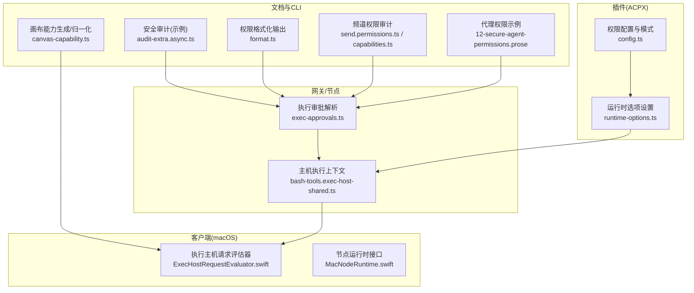
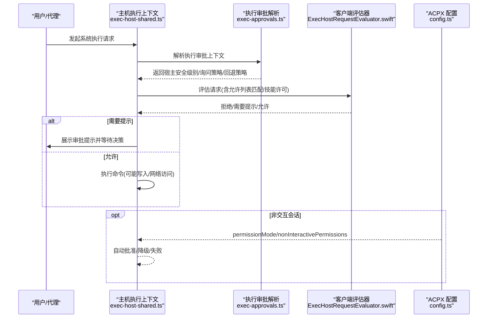
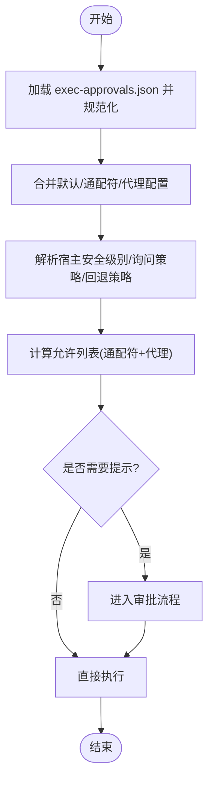
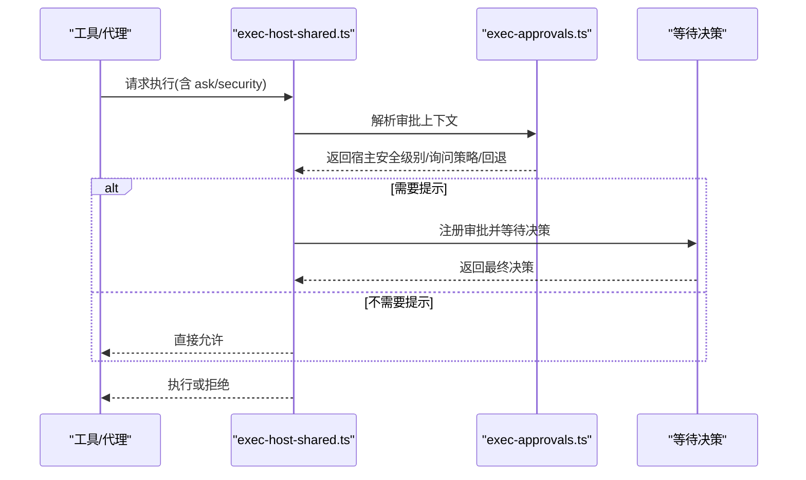
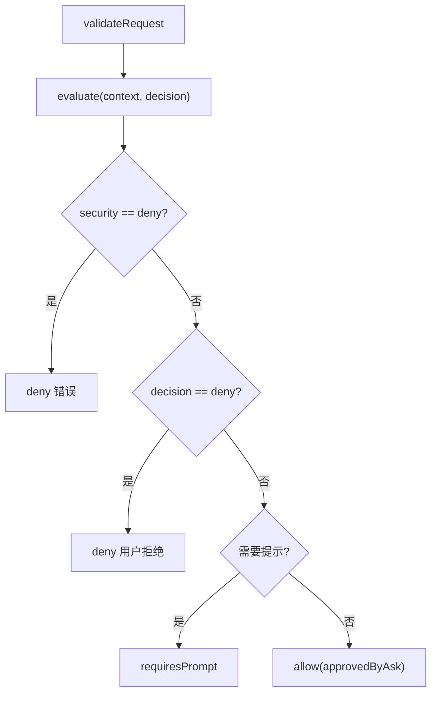
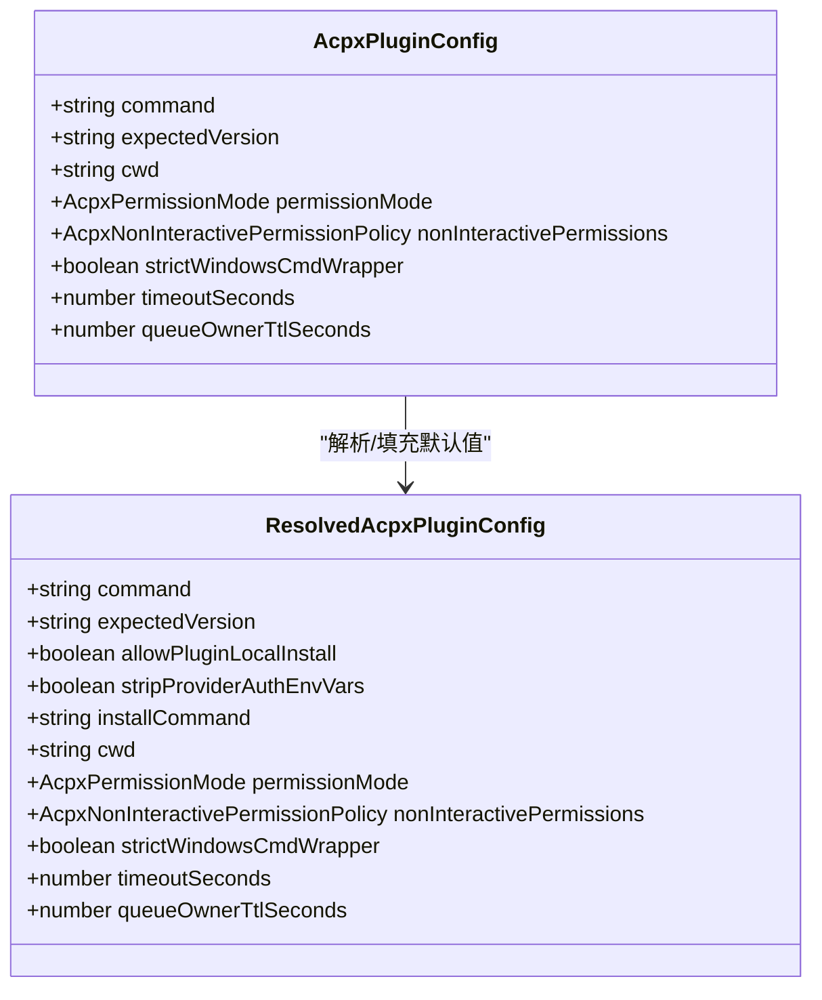
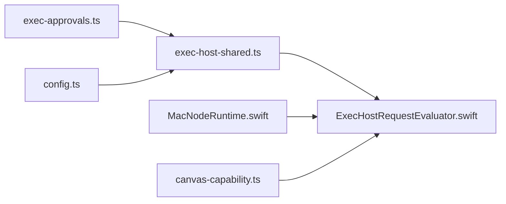

# 节点权限管理

<cite>
**本文引用的文件**
- [canvas-capability.ts](file://src/gateway/canvas-capability.ts)
- [exec-approvals.ts](file://src/infra/exec-approvals.ts)
- [bash-tools.exec-host-shared.ts](file://src/agents/bash-tools.exec-host-shared.ts)
- [ExecHostRequestEvaluator.swift](file://apps/macos/Sources/OpenClaw/ExecHostRequestEvaluator.swift)
- [MacNodeRuntime.swift](file://apps/macos/Sources/OpenClaw/NodeMode/MacNodeRuntime.swift)
- [config.ts](file://extensions/acpx/src/config.ts)
- [runtime-options.ts](file://src/auto-reply/reply/commands-acp/runtime-options.ts)
- [format.ts](file://src/cli/nodes-cli/format.ts)
- [12-secure-agent-permissions.prose](file://extensions/open-prose/skills/prose/examples/12-secure-agent-permissions.prose)
- [send.permissions.ts](file://src/discord/send.permissions.ts)
- [capabilities.ts](file://src/commands/channels/capabilities.ts)
- [audit-extra.async.ts](file://src/security/audit-extra.async.ts)
</cite>

## 目录
1. [引言](#引言)
2. [项目结构](#项目结构)
3. [核心组件](#核心组件)
4. [架构总览](#架构总览)
5. [详细组件分析](#详细组件分析)
6. [依赖关系分析](#依赖关系分析)
7. [性能考量](#性能考量)
8. [故障排除指南](#故障排除指南)
9. [结论](#结论)
10. [附录](#附录)

## 引言
本技术文档围绕 OpenClaw 的“节点权限管理系统”，系统性阐述节点权限模型、权限分类、权限验证机制与动态检查流程；解释节点能力声明、权限映射与继承覆盖规则；给出配置方法、安全策略（最小权限原则）、审计机制与故障排除建议，并提供扩展与监控实践方案。文档面向开发者与运维人员，兼顾可操作性与安全性。

## 项目结构
OpenClaw 在多层实现中协同完成节点权限管理：
- 网关与节点侧：通过“执行审批”策略控制命令执行的权限级别与提示策略
- 客户端（macOS）：在本地对系统执行请求进行策略评估与提示
- 插件（ACPX）：在非交互场景下提供权限模式与降级策略
- 文档与示例：通过技能脚本示例展示代理权限声明与最小权限实践
- 命令行与工具：提供权限格式化输出、通道权限审计与安全审计

图示来源
- [exec-approvals.ts:146-482](file://src/infra/exec-approvals.ts#L146-L482)
- [bash-tools.exec-host-shared.ts:125-144](file://src/agents/bash-tools.exec-host-shared.ts#L125-L144)
- [ExecHostRequestEvaluator.swift:40-83](file://apps/macos/Sources/OpenClaw/ExecHostRequestEvaluator.swift#L40-L83)
- [MacNodeRuntime.swift:677-693](file://apps/macos/Sources/OpenClaw/NodeMode/MacNodeRuntime.swift#L677-L693)
- [config.ts:34-59](file://extensions/acpx/src/config.ts#L34-L59)
- [runtime-options.ts:265-296](file://src/auto-reply/reply/commands-acp/runtime-options.ts#L265-L296)
- [canvas-capability.ts:20-87](file://src/gateway/canvas-capability.ts#L20-L87)
- [audit-extra.async.ts:1028-1067](file://src/security/audit-extra.async.ts#L1028-L1067)
- [format.ts:3-16](file://src/cli/nodes-cli/format.ts#L3-L16)
- [send.permissions.ts:1-200](file://src/discord/send.permissions.ts#L1-L200)
- [capabilities.ts:281-329](file://src/commands/channels/capabilities.ts#L281-L329)
- [12-secure-agent-permissions.prose:1-44](file://extensions/open-prose/skills/prose/examples/12-secure-agent-permissions.prose#L1-L44)

章节来源
- [canvas-capability.ts:1-88](file://src/gateway/canvas-capability.ts#L1-L88)
- [exec-approvals.ts:1-590](file://src/infra/exec-approvals.ts#L1-L590)
- [bash-tools.exec-host-shared.ts:1-161](file://src/agents/bash-tools.exec-host-shared.ts#L1-L161)
- [ExecHostRequestEvaluator.swift:1-85](file://apps/macos/Sources/OpenClaw/ExecHostRequestEvaluator.swift#L1-L85)
- [MacNodeRuntime.swift:671-693](file://apps/macos/Sources/OpenClaw/NodeMode/MacNodeRuntime.swift#L671-L693)
- [config.ts:1-361](file://extensions/acpx/src/config.ts#L1-L361)
- [runtime-options.ts:265-296](file://src/auto-reply/reply/commands-acp/runtime-options.ts#L265-L296)
- [format.ts:1-16](file://src/cli/nodes-cli/format.ts#L1-L16)
- [12-secure-agent-permissions.prose:1-44](file://extensions/open-prose/skills/prose/examples/12-secure-agent-permissions.prose#L1-L44)
- [send.permissions.ts:1-200](file://src/discord/send.permissions.ts#L1-L200)
- [capabilities.ts:281-329](file://src/commands/channels/capabilities.ts#L281-L329)
- [audit-extra.async.ts:1028-1067](file://src/security/audit-extra.async.ts#L1028-L1067)

## 核心组件
- 执行审批策略与存储
  - 权限三元组：安全级别（deny/allowlist/full）、询问策略（off/on-miss/always）、询问回退（deny/full）
  - 支持默认、按代理、通配符代理的继承与合并
  - 允许列表（allowlist）条目持久化与使用追踪
- 主机执行上下文
  - 将外部策略与本地策略取交集（minSecurity/maxAsk），决定是否需要提示或拒绝
  - 提供审批注册、等待决策与超时处理
- 客户端策略评估
  - 对系统执行请求进行合法性校验与策略评估，支持拒绝、需要提示、允许三种结果
- 非交互权限模式（ACPX）
  - 提供 approve-all/approve-reads/deny-all 与 fail/deny 两类策略，用于非交互会话
- 代理权限声明（示例）
  - 通过技能脚本示例展示 read/write/bash/network 等权限的最小化配置
- 权限可视化与审计
  - CLI 输出格式化、频道权限审计、文件系统权限审计等

章节来源
- [exec-approvals.ts:14-154](file://src/infra/exec-approvals.ts#L14-L154)
- [exec-approvals.ts:412-482](file://src/infra/exec-approvals.ts#L412-L482)
- [bash-tools.exec-host-shared.ts:125-160](file://src/agents/bash-tools.exec-host-shared.ts#L125-L160)
- [ExecHostRequestEvaluator.swift:40-83](file://apps/macos/Sources/OpenClaw/ExecHostRequestEvaluator.swift#L40-L83)
- [config.ts:5-18](file://extensions/acpx/src/config.ts#L5-L18)
- [12-secure-agent-permissions.prose:7-37](file://extensions/open-prose/skills/prose/examples/12-secure-agent-permissions.prose#L7-L37)
- [format.ts:3-16](file://src/cli/nodes-cli/format.ts#L3-L16)
- [capabilities.ts:281-329](file://src/commands/channels/capabilities.ts#L281-L329)
- [audit-extra.async.ts:1028-1067](file://src/security/audit-extra.async.ts#L1028-L1067)

## 架构总览
下图展示从“命令发起”到“策略评估与执行”的端到端流程，涵盖网关/节点侧策略解析、客户端策略评估与非交互权限模式。

图示来源
- [bash-tools.exec-host-shared.ts:125-144](file://src/agents/bash-tools.exec-host-shared.ts#L125-L144)
- [exec-approvals.ts:412-482](file://src/infra/exec-approvals.ts#L412-L482)
- [ExecHostRequestEvaluator.swift:40-83](file://apps/macos/Sources/OpenClaw/ExecHostRequestEvaluator.swift#L40-L83)
- [config.ts:34-59](file://extensions/acpx/src/config.ts#L34-L59)

## 详细组件分析

### 组件A：执行审批策略与继承覆盖
- 权限三元组
  - 安全级别：deny（严格禁止）、allowlist（仅允许列表）、full（完全开放）
  - 询问策略：off（不提示）、on-miss（未命中允许列表时提示）、always（总是提示）
  - 询问回退：deny/full，用于超时或无决策时的兜底
- 继承与覆盖
  - 默认值来自全局配置
  - 按代理（agentId）覆盖默认
  - 通配符代理（*）作为默认兜底
  - 合并顺序：通配符 → 代理 → 默认 → 外部覆盖参数
- 允许列表
  - 条目持久化，记录最后使用时间、命令与解析路径
  - 支持添加新条目与记录使用情况
- 动态检查
  - requiresExecApproval 判断是否需要提示
  - minSecurity/maxAsk 决策合并

图示来源
- [exec-approvals.ts:412-482](file://src/infra/exec-approvals.ts#L412-L482)
- [exec-approvals.ts:484-496](file://src/infra/exec-approvals.ts#L484-L496)

章节来源
- [exec-approvals.ts:14-154](file://src/infra/exec-approvals.ts#L14-L154)
- [exec-approvals.ts:412-482](file://src/infra/exec-approvals.ts#L412-L482)
- [exec-approvals.ts:484-496](file://src/infra/exec-approvals.ts#L484-L496)

### 组件B：主机执行上下文与审批决策
- 上下文构建
  - resolveExecHostApprovalContext 将外部策略与本地策略取交集
  - 宿主安全级别：minSecurity(外部, 本地)
  - 宿主询问策略：maxAsk(外部, 本地)，但本地 ask=off 可抑制提示
- 审批决策
  - resolveBaseExecApprovalDecision 处理用户决策、超时与探测
  - resolveApprovalDecisionOrUndefined 支持预决策与失败回调
- 运行时选项
  - runtime-options.ts 支持通过命令更新 ACP 权限配置文件中的审批策略

图示来源
- [bash-tools.exec-host-shared.ts:125-160](file://src/agents/bash-tools.exec-host-shared.ts#L125-L160)
- [exec-approvals.ts:412-482](file://src/infra/exec-approvals.ts#L412-L482)
- [runtime-options.ts:265-296](file://src/auto-reply/reply/commands-acp/runtime-options.ts#L265-L296)

章节来源
- [bash-tools.exec-host-shared.ts:125-160](file://src/agents/bash-tools.exec-host-shared.ts#L125-L160)
- [runtime-options.ts:265-296](file://src/auto-reply/reply/commands-acp/runtime-options.ts#L265-L296)

### 组件C：客户端策略评估（macOS）
- 请求校验
  - validateRequest 校验命令合法性与显示命令
- 策略评估
  - evaluate 根据安全级别、是否命中允许列表、技能许可与用户决策判定
  - deny/requirePrompt/allow 三种结果
- 运行时接口
  - MacNodeRuntime.swift 提供获取/设置执行审批快照的桥接调用

图示来源
- [ExecHostRequestEvaluator.swift:14-83](file://apps/macos/Sources/OpenClaw/ExecHostRequestEvaluator.swift#L14-L83)
- [MacNodeRuntime.swift:677-693](file://apps/macos/Sources/OpenClaw/NodeMode/MacNodeRuntime.swift#L677-L693)

章节来源
- [ExecHostRequestEvaluator.swift:1-85](file://apps/macos/Sources/OpenClaw/ExecHostRequestEvaluator.swift#L1-L85)
- [MacNodeRuntime.swift:671-693](file://apps/macos/Sources/OpenClaw/NodeMode/MacNodeRuntime.swift#L671-L693)

### 组件D：非交互权限模式（ACPX）
- 权限模式
  - approve-all：自动批准所有文件写入与 shell 执行
  - approve-reads：仅自动批准读取；写入与执行需提示
  - deny-all：拒绝所有权限提示
- 非交互策略
  - fail：以运行时错误终止会话
  - deny：静默拒绝并优雅降级
- 配置与校验
  - config.ts 定义枚举、默认值与 JSON Schema 校验
  - 支持 command/cwd/timeout/queueOwnerTtl 等参数

图示来源
- [config.ts:34-59](file://extensions/acpx/src/config.ts#L34-L59)
- [config.ts:320-360](file://extensions/acpx/src/config.ts#L320-L360)

章节来源
- [config.ts:5-18](file://extensions/acpx/src/config.ts#L5-L18)
- [config.ts:114-177](file://extensions/acpx/src/config.ts#L114-L177)
- [config.ts:248-306](file://extensions/acpx/src/config.ts#L248-L306)
- [config.ts:320-360](file://extensions/acpx/src/config.ts#L320-L360)

### 组件E：代理权限声明与最小权限实践
- 示例展示
  - 代码审查代理：只读权限与禁止 bash
  - 文档写代理：限制写入目录与禁止 bash
  - 管理员代理：全量读写、需要提示的 bash 与允许网络
- 最小权限原则
  - 仅授予完成任务所需的最小权限集合
  - 使用 allowlist 与 deny 明确边界

章节来源
- [12-secure-agent-permissions.prose:7-37](file://extensions/open-prose/skills/prose/examples/12-secure-agent-permissions.prose#L7-L37)

### 组件F：节点能力声明与画布能力
- 画布能力令牌
  - mintCanvasCapabilityToken 生成随机令牌
  - buildCanvasScopedHostUrl 将能力嵌入 URL 路径
  - normalizeCanvasScopedUrl 归一化带能力的 URL，提取 capability 参数
- 应用场景
  - 通过能力令牌限定访问范围，避免越权访问

章节来源
- [canvas-capability.ts:20-87](file://src/gateway/canvas-capability.ts#L20-L87)

### 组件G：权限可视化与审计
- CLI 权限格式化
  - formatPermissions 将权限对象转为可读字符串，便于展示与日志
- 频道权限审计
  - capabilities.ts 与 send.permissions.ts 提供频道权限缺失检测与报告
- 文件系统权限审计
  - audit-extra.async.ts 检测认证文件可读/可写风险并给出修复建议

章节来源
- [format.ts:3-16](file://src/cli/nodes-cli/format.ts#L3-L16)
- [capabilities.ts:281-329](file://src/commands/channels/capabilities.ts#L281-L329)
- [send.permissions.ts:1-200](file://src/discord/send.permissions.ts#L1-L200)
- [audit-extra.async.ts:1028-1067](file://src/security/audit-extra.async.ts#L1028-L1067)

## 依赖关系分析
- 组件耦合
  - exec-approvals.ts 为核心策略源，被 bash-tools.exec-host-shared.ts 与客户端评估器共同消费
  - ACPX 配置影响非交互场景下的自动批准/降级行为
  - macOS 运行时接口与客户端评估器形成闭环，确保本地策略一致
- 外部依赖
  - JSONL Socket 用于审批决策的异步通信
  - 文件系统用于持久化 exec-approvals.json 与快照

图示来源
- [exec-approvals.ts:412-482](file://src/infra/exec-approvals.ts#L412-L482)
- [bash-tools.exec-host-shared.ts:125-144](file://src/agents/bash-tools.exec-host-shared.ts#L125-L144)
- [ExecHostRequestEvaluator.swift:40-83](file://apps/macos/Sources/OpenClaw/ExecHostRequestEvaluator.swift#L40-L83)
- [config.ts:34-59](file://extensions/acpx/src/config.ts#L34-L59)
- [MacNodeRuntime.swift:677-693](file://apps/macos/Sources/OpenClaw/NodeMode/MacNodeRuntime.swift#L677-L693)
- [canvas-capability.ts:20-87](file://src/gateway/canvas-capability.ts#L20-L87)

章节来源
- [exec-approvals.ts:412-482](file://src/infra/exec-approvals.ts#L412-L482)
- [bash-tools.exec-host-shared.ts:125-144](file://src/agents/bash-tools.exec-host-shared.ts#L125-L144)
- [ExecHostRequestEvaluator.swift:40-83](file://apps/macos/Sources/OpenClaw/ExecHostRequestEvaluator.swift#L40-L83)
- [config.ts:34-59](file://extensions/acpx/src/config.ts#L34-L59)
- [MacNodeRuntime.swift:677-693](file://apps/macos/Sources/OpenClaw/NodeMode/MacNodeRuntime.swift#L677-L693)
- [canvas-capability.ts:20-87](file://src/gateway/canvas-capability.ts#L20-L87)

## 性能考量
- 审批超时与回退
  - 默认审批超时与回退策略可避免长时间阻塞，提升交互体验
- 允许列表命中率
  - 通过记录允许列表使用情况，持续优化命中率，减少提示频率
- 客户端评估开销
  - validateRequest 与 evaluate 逻辑轻量，主要成本在 I/O 与网络通信
- 非交互模式
  - approve-all 降低提示成本，但需配合严格的 allowlist 与审计

## 故障排除指南
- 审批提示不可用（非交互）
  - 症状：非交互会话中触发写入/执行提示时报错
  - 处理：调整 ACPX 配置，将 nonInteractivePermissions 设为 deny 以优雅降级
  - 参考：[config.ts:61-62](file://extensions/acpx/src/config.ts#L61-L62)
- 审批超时/过期
  - 症状：等待审批超时，返回 deny 或继续等待
  - 处理：检查审批注册与等待逻辑，确认 socket 通信正常
  - 参考：[bash-tools.exec-approval-request.ts:113-129](file://src/agents/bash-tools.exec-approval-request.ts#L113-L129)
- 客户端拒绝执行
  - 症状：客户端评估器返回 deny
  - 处理：检查安全级别、允许列表匹配、技能许可与用户决策
  - 参考：[ExecHostRequestEvaluator.swift:40-83](file://apps/macos/Sources/OpenClaw/ExecHostRequestEvaluator.swift#L40-L83)
- 文件权限问题
  - 症状：认证文件可被他人读取/写入
  - 处理：调整文件权限至 0600，参考安全审计建议
  - 参考：[audit-extra.async.ts:1028-1067](file://src/security/audit-extra.async.ts#L1028-L1067)
- 频道权限缺失
  - 症状：机器人缺少必要权限导致消息发送失败
  - 处理：使用权限审计命令检查并补齐缺失权限
  - 参考：[capabilities.ts:281-329](file://src/commands/channels/capabilities.ts#L281-L329)

章节来源
- [config.ts:61-62](file://extensions/acpx/src/config.ts#L61-L62)
- [bash-tools.exec-approval-request.ts:113-129](file://src/agents/bash-tools.exec-approval-request.ts#L113-L129)
- [ExecHostRequestEvaluator.swift:40-83](file://apps/macos/Sources/OpenClaw/ExecHostRequestEvaluator.swift#L40-L83)
- [audit-extra.async.ts:1028-1067](file://src/security/audit-extra.async.ts#L1028-L1067)
- [capabilities.ts:281-329](file://src/commands/channels/capabilities.ts#L281-L329)

## 结论
OpenClaw 的节点权限管理通过“策略解析—上下文构建—客户端评估—非交互降级”的闭环，实现了细粒度、可审计、可扩展的权限控制。结合最小权限原则与允许列表，可在保证安全的同时提升可用性。建议在生产环境启用严格的文件权限与频道权限审计，并根据业务场景合理配置 ACPX 的权限模式与非交互策略。

## 附录
- 权限配置要点
  - 使用 exec-approvals.json 设置默认与代理级策略
  - 通过 allowlist 提升常用命令的命中率
  - 在非交互场景使用 ACPX 的 approve-reads 或 deny-all
- 安全最佳实践
  - 最小权限：仅授予完成任务所需的最小权限
  - 允许列表：优先使用 allowlist，减少提示与风险
  - 审计与监控：定期检查文件权限与频道权限，记录审批事件
- 扩展与监控
  - 自定义权限类型：在策略解析与客户端评估处扩展新的维度
  - 权限监控：利用 CLI 输出格式化与审计工具持续观测权限使用情况