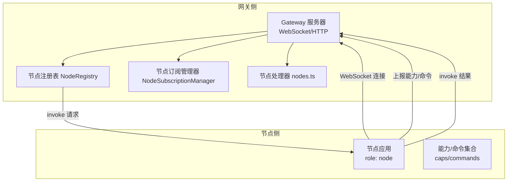
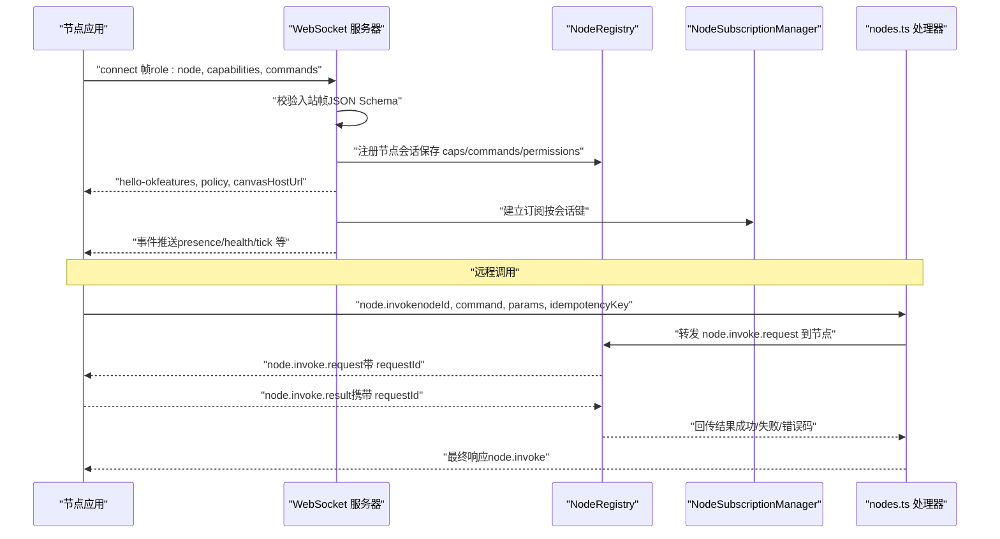
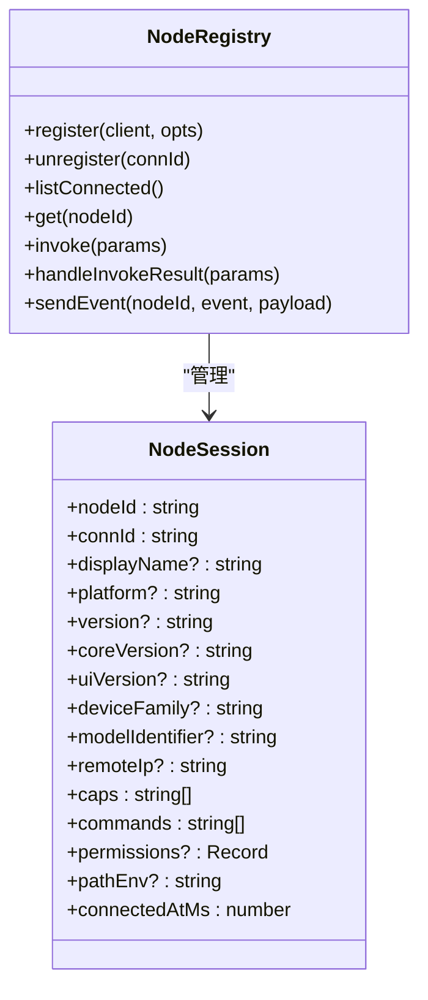
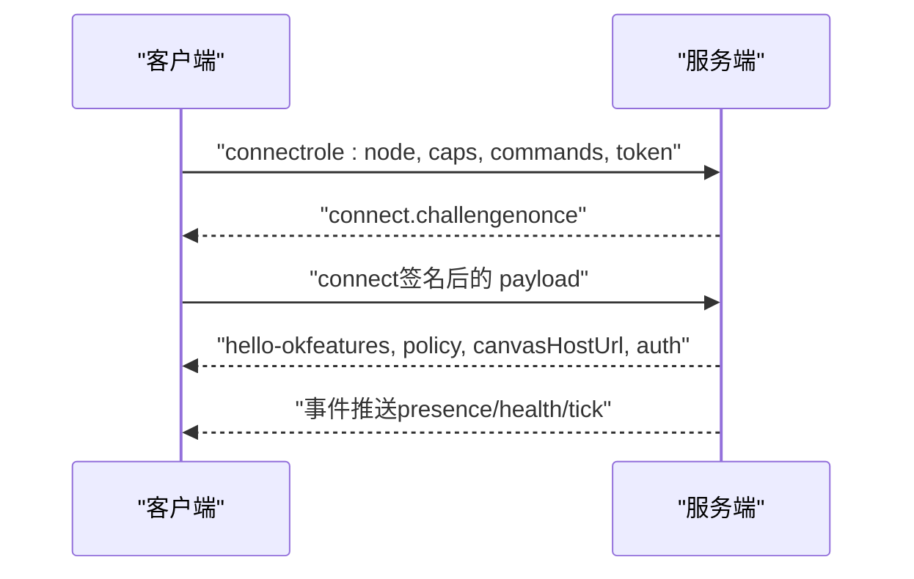
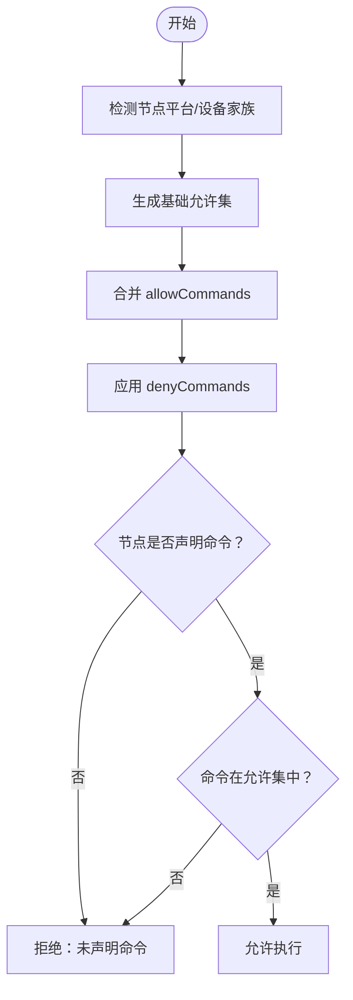
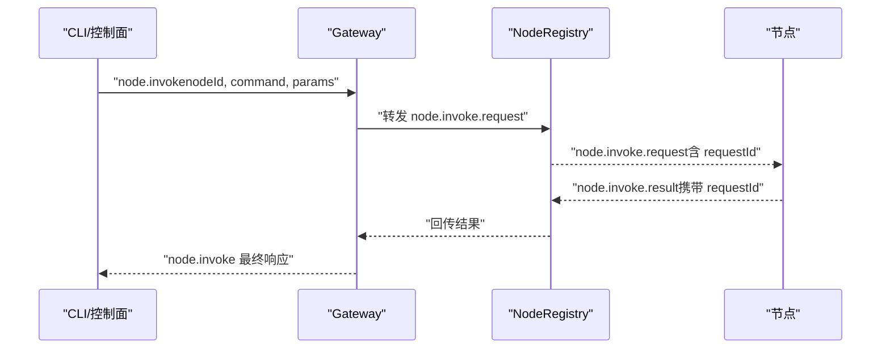
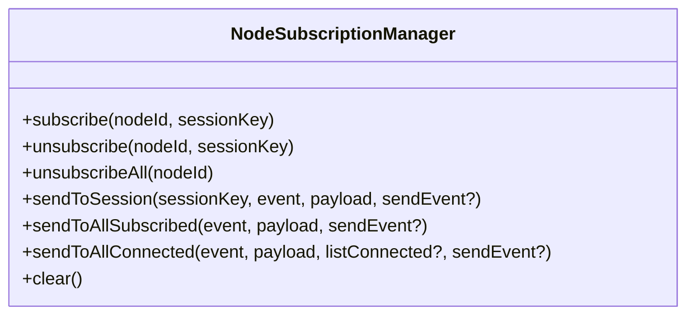
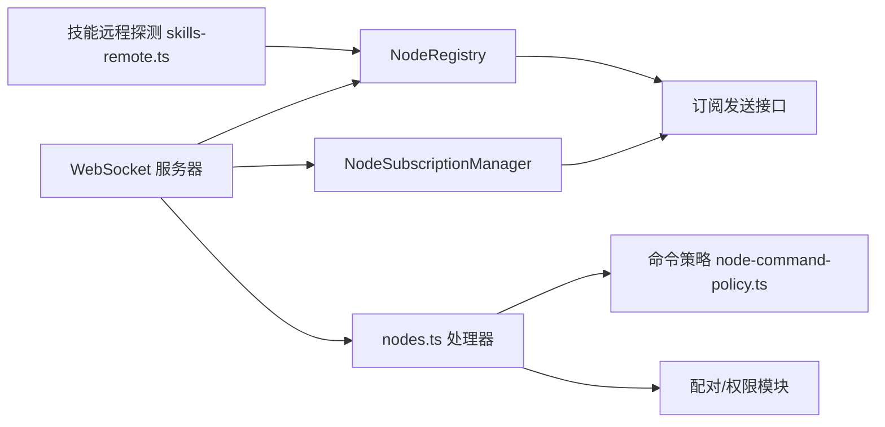

# 节点架构

<cite>
**本文档引用的文件**
- [src/gateway/server.impl.ts](file://src/gateway/server.impl.ts)
- [src/gateway/node-registry.ts](file://src/gateway/node-registry.ts)
- [src/gateway/server-node-subscriptions.ts](file://src/gateway/server-node-subscriptions.ts)
- [src/gateway/server-methods/nodes.ts](file://src/gateway/server-methods/nodes.ts)
- [src/gateway/server-methods/nodes.handlers.invoke-result.ts](file://src/gateway/server-methods/nodes.handlers.invoke-result.ts)
- [src/gateway/node-command-policy.ts](file://src/gateway/node-command-policy.ts)
- [src/infra/skills-remote.ts](file://src/infra/skills-remote.ts)
- [src/infra/node-commands.ts](file://src/infra/node-commands.ts)
- [apps/android/app/src/main/java/ai/openclaw/app/node/InvokeCommandRegistry.kt](file://apps/android/app/src/main/java/ai/openclaw/app/node/InvokeCommandRegistry.kt)
- [docs/concepts/architecture.md](file://docs/concepts/architecture.md)
- [docs/zh-CN/concepts/architecture.md](file://docs/zh-CN/concepts/architecture.md)
- [src/gateway/server.ws.ts](file://src/gateway/server.ws.ts)
- [src/gateway/server/methods.ts](file://src/gateway/server/methods.ts)
- [src/gateway/server/ws-connection/message-handler.ts](file://src/gateway/server/ws-connection/message-handler.ts)
- [src/gateway/client.test.ts](file://src/gateway/client.test.ts)
- [ui/src/ui/gateway.node.test.ts](file://ui/src/ui/gateway.node.test.ts)
- [src/gateway/test-helpers.e2e.ts](file://src/gateway/test-helpers.e2e.ts)
- [src/gateway/gateway-misc.test.ts](file://src/gateway/gateway-misc.test.ts)
- [src/cli/nodes-cli/register.invoke.ts](file://src/cli/nodes-cli/register.invoke.ts)
- [src/agents/bash-tools.exec-host-node.ts](file://src/agents/bash-tools.exec-host-node.ts)
</cite>

## 目录
1. [引言](#引言)
2. [项目结构](#项目结构)
3. [核心组件](#核心组件)
4. [架构总览](#架构总览)
5. [详细组件分析](#详细组件分析)
6. [依赖关系分析](#依赖关系分析)
7. [性能考量](#性能考量)
8. [故障排查指南](#故障排查指南)
9. [结论](#结论)
10. [附录](#附录)

## 引言
本文件面向开发者与维护者，系统化阐述 OpenClaw 节点架构的设计理念、架构模式与核心组件，重点覆盖：
- 节点与网关的 WebSocket 通信协议与连接生命周期
- 节点能力发现、命令表面暴露与远程执行模型
- 动态注册、权限验证与订阅路由机制
- 生命周期管理、后台唤醒与重连策略
- 扩展接口与自定义节点开发实践

目标是帮助读者快速理解并高效扩展节点生态。

## 项目结构
OpenClaw 将“网关”作为统一的长期运行服务，负责：
- 维护多通道提供商连接
- 暴露类型化的 WebSocket API（请求/响应/事件）
- 基于 JSON Schema 的入站帧校验
- 发出 agent、chat、presence、health、heartbeat、cron 等事件

节点（macOS/iOS/Android/headless）通过同一 WebSocket 服务器连接，声明 role: node，并上报设备身份与能力/命令集合。控制面客户端（mac 应用/CLI/Web）同样通过 WebSocket 连接，但不声明 role: node。

图表来源
- [docs/concepts/architecture.md:12-47](file://docs/concepts/architecture.md#L12-L47)
- [docs/zh-CN/concepts/architecture.md:12-47](file://docs/zh-CN/concepts/architecture.md#L12-L47)

章节来源
- [docs/concepts/architecture.md:12-47](file://docs/concepts/architecture.md#L12-L47)
- [docs/zh-CN/concepts/architecture.md:12-47](file://docs/zh-CN/concepts/architecture.md#L12-L47)

## 核心组件
- 节点注册表（NodeRegistry）：维护已连接节点的会话信息、待处理调用、超时与结果回传。
- 节点订阅管理器（NodeSubscriptionManager）：按会话键向订阅节点广播事件。
- 节点方法处理器（nodes.ts）：实现 node.* 方法族，包括配对、描述、列表、画布令牌刷新、挂起动作拉取/确认、远程调用等。
- 节点命令策略（node-command-policy.ts）：根据平台与配置生成允许命令集，支持显式允许/拒绝。
- 技能远程探测（skills-remote.ts）：对已配对/已连接节点进行二进制能力探测与缓存。
- 命令常量（infra/node-commands.ts）：定义系统级命令集合与浏览器代理命令。

章节来源
- [src/gateway/node-registry.ts:38-209](file://src/gateway/node-registry.ts#L38-L209)
- [src/gateway/server-node-subscriptions.ts:33-133](file://src/gateway/server-node-subscriptions.ts#L33-L133)
- [src/gateway/server-methods/nodes.ts:384-800](file://src/gateway/server-methods/nodes.ts#L384-L800)
- [src/gateway/node-command-policy.ts:173-212](file://src/gateway/node-command-policy.ts#L173-L212)
- [src/infra/skills-remote.ts:104-309](file://src/infra/skills-remote.ts#L104-L309)
- [src/infra/node-commands.ts:1-13](file://src/infra/node-commands.ts#L1-L13)

## 架构总览
下图展示从节点连接到远程调用的端到端流程，包括握手、能力上报、鉴权与调用链路。

图表来源
- [src/gateway/server.ws.ts](file://src/gateway/server.ws.ts)
- [src/gateway/server/methods.ts](file://src/gateway/server/methods.ts)
- [src/gateway/server.ws.ts](file://src/gateway/server.ws.ts)
- [src/gateway/server/methods.ts](file://src/gateway/server/methods.ts)
- [src/gateway/server-methods/nodes.ts:776-800](file://src/gateway/server-methods/nodes.ts#L776-L800)
- [src/gateway/node-registry.ts:107-155](file://src/gateway/node-registry.ts#L107-L155)
- [src/gateway/server-node-subscriptions.ts:100-133](file://src/gateway/server-node-subscriptions.ts#L100-L133)

章节来源
- [src/gateway/server-methods/nodes.ts:776-800](file://src/gateway/server-methods/nodes.ts#L776-L800)
- [src/gateway/node-registry.ts:107-155](file://src/gateway/node-registry.ts#L107-L155)
- [src/gateway/server-node-subscriptions.ts:100-133](file://src/gateway/server-node-subscriptions.ts#L100-L133)

## 详细组件分析

### 节点注册与生命周期
- 注册：节点连接后，网关解析 connect 帧中的 device/client 信息，提取 capabilities 与 commands，构建 NodeSession 并登记至注册表。
- 注销：断开连接时清理会话与待处理调用，超时回调返回 TIMEOUT 错误。
- 调用：通过 NodeRegistry.invoke 发送 node.invoke.request，等待 node.invoke.result 回传；支持超时与幂等键。
- 结果处理：handleNodeInvokeResult 校验 callerNodeId 一致性，匹配 pendingInvokes 后 resolve 或忽略晚到结果。

图表来源
- [src/gateway/node-registry.ts:4-21](file://src/gateway/node-registry.ts#L4-L21)
- [src/gateway/node-registry.ts:38-209](file://src/gateway/node-registry.ts#L38-L209)

章节来源
- [src/gateway/node-registry.ts:43-97](file://src/gateway/node-registry.ts#L43-L97)
- [src/gateway/server-methods/nodes.handlers.invoke-result.ts:25-72](file://src/gateway/server-methods/nodes.handlers.invoke-result.ts#L25-L72)

### WebSocket 连接与握手
- 握手阶段：节点以 role: node 连接，网关下发 hello-ok，包含 features/methods/events、server 版本/连接 ID、policy（最大负载/缓冲/心跳间隔）、可选 canvasHostUrl 与 auth 令牌信息。
- 设备令牌与鉴权：支持共享令牌与设备令牌，若服务端提示 AUTH_TOKEN_MISMATCH 且允许重试，客户端可自动切换到设备令牌重连。
- 连接挑战：服务端发出 connect.challenge，节点需签名 nonce 与设备令牌组合后提交。

图表来源
- [src/gateway/server.ws.ts](file://src/gateway/server.ws.ts)
- [src/gateway/server/methods.ts](file://src/gateway/server/methods.ts)
- [src/gateway/server.ws.ts](file://src/gateway/server.ws.ts)
- [src/gateway/server/methods.ts](file://src/gateway/server/methods.ts)
- [src/gateway/server.ws.ts](file://src/gateway/server.ws.ts)
- [src/gateway/server/methods.ts](file://src/gateway/server/methods.ts)
- [src/gateway/client.test.ts:395-583](file://src/gateway/client.test.ts#L395-L583)
- [ui/src/ui/gateway.node.test.ts:149-211](file://ui/src/ui/gateway.node.test.ts#L149-L211)
- [src/gateway/test-helpers.e2e.ts:107-144](file://src/gateway/test-helpers.e2e.ts#L107-L144)

章节来源
- [src/gateway/server.ws.ts](file://src/gateway/server.ws.ts)
- [src/gateway/server/methods.ts](file://src/gateway/server/methods.ts)
- [src/gateway/client.test.ts:395-583](file://src/gateway/client.test.ts#L395-L583)
- [ui/src/ui/gateway.node.test.ts:149-211](file://ui/src/ui/gateway.node.test.ts#L149-L211)
- [src/gateway/test-helpers.e2e.ts:107-144](file://src/gateway/test-helpers.e2e.ts#L107-L144)

### 节点命令策略与权限验证
- 允许命令集：根据平台（ios/android/macos/linux/windows/unknown）与配置 gateway.nodes.allowCommands/denyCommands 生成；默认高风险命令需显式允许。
- 命令白名单校验：要求节点声明的 commands 必须包含目标命令，否则拒绝。
- 危险命令：相机/屏幕录制/联系人/日历/提醒/短信发送等默认不允许，除非显式加入 allowCommands 且未被 denyCommands 屏蔽。

图表来源
- [src/gateway/node-command-policy.ts:173-212](file://src/gateway/node-command-policy.ts#L173-L212)
- [src/gateway/gateway-misc.test.ts:353-396](file://src/gateway/gateway-misc.test.ts#L353-L396)

章节来源
- [src/gateway/node-command-policy.ts:63-116](file://src/gateway/node-command-policy.ts#L63-L116)
- [src/gateway/gateway-misc.test.ts:353-396](file://src/gateway/gateway-misc.test.ts#L353-L396)

### 节点能力发现与远程执行
- 能力发现：节点启动时上报 caps/commands；网关通过 node.describe/node.list 返回当前已连接节点的能力快照。
- 远程执行：CLI/控制面通过 node.invoke 触发节点命令；节点执行完成后通过 node.invoke.result 回传结果。
- 系统命令：system.run/system.which/system.run.prepare 等用于在节点侧执行 shell 命令；macOS 节点通常具备这些能力。
- 画布能力：节点可刷新 canvas capability，获得带时效的 scoped host URL。

图表来源
- [src/gateway/server-methods/nodes.ts:776-800](file://src/gateway/server-methods/nodes.ts#L776-L800)
- [src/gateway/node-registry.ts:107-155](file://src/gateway/node-registry.ts#L107-L155)
- [src/cli/nodes-cli/register.invoke.ts:125-372](file://src/cli/nodes-cli/register.invoke.ts#L125-L372)
- [src/agents/bash-tools.exec-host-node.ts:99-131](file://src/agents/bash-tools.exec-host-node.ts#L99-L131)

章节来源
- [src/gateway/server-methods/nodes.ts:536-715](file://src/gateway/server-methods/nodes.ts#L536-L715)
- [src/gateway/server-methods/nodes.ts:776-800](file://src/gateway/server-methods/nodes.ts#L776-L800)
- [src/infra/node-commands.ts:1-13](file://src/infra/node-commands.ts#L1-L13)
- [src/cli/nodes-cli/register.invoke.ts:125-372](file://src/cli/nodes-cli/register.invoke.ts#L125-L372)
- [src/agents/bash-tools.exec-host-node.ts:99-131](file://src/agents/bash-tools.exec-host-node.ts#L99-L131)

### 节点订阅与事件路由
- 订阅管理：按 sessionKey 维护节点订阅映射，支持向会话内所有订阅者广播事件，或向所有订阅节点广播。
- 事件路由：网关在维护定时器中向已订阅节点推送 tick/health/presence 等事件，确保节点侧状态同步。

图表来源
- [src/gateway/server-node-subscriptions.ts:9-31](file://src/gateway/server-node-subscriptions.ts#L9-L31)

章节来源
- [src/gateway/server-node-subscriptions.ts:33-133](file://src/gateway/server-node-subscriptions.ts#L33-L133)

### 节点配对与权限
- 配对流程：node.pair.request 创建请求，node.pair.approve 授权，node.pair.reject 拒绝；网关广播 node.pair.resolved。
- 验证：node.pair.verify 校验设备令牌与节点标识。
- 重命名：node.rename 支持修改已配对节点显示名。
- 画布能力刷新：node.canvas.capability.refresh 为当前会话签发带时效的 canvas capability。

章节来源
- [src/gateway/server-methods/nodes.ts:384-508](file://src/gateway/server-methods/nodes.ts#L384-L508)
- [src/gateway/server-methods/nodes.ts:671-715](file://src/gateway/server-methods/nodes.ts#L671-L715)

### 节点能力清单（示例）
以下为 Android 节点典型能力清单（来自节点侧注册表），涵盖画布、相机、位置、通知、设备、联系人、日历、提醒、照片、运动、短信等命令类别。

章节来源
- [apps/android/app/src/main/java/ai/openclaw/app/node/InvokeCommandRegistry.kt:1-55](file://apps/android/app/src/main/java/ai/openclaw/app/node/InvokeCommandRegistry.kt#L1-L55)

## 依赖关系分析
- 节点注册表依赖 WebSocket 会话对象，负责将事件序列化为 JSON 并发送。
- 节点订阅管理器依赖 NodeRegistry 的发送接口，实现按会话键的广播。
- 节点方法处理器依赖命令策略与配对/权限模块，确保调用前校验。
- 技能远程探测依赖 NodeRegistry，周期性探测已连接节点的可用二进制能力。

图表来源
- [src/gateway/node-registry.ts:183-209](file://src/gateway/node-registry.ts#L183-L209)
- [src/gateway/server-node-subscriptions.ts:100-133](file://src/gateway/server-node-subscriptions.ts#L100-L133)
- [src/gateway/server-methods/nodes.ts:384-800](file://src/gateway/server-methods/nodes.ts#L384-L800)
- [src/gateway/node-command-policy.ts:173-212](file://src/gateway/node-command-policy.ts#L173-L212)
- [src/infra/skills-remote.ts:104-309](file://src/infra/skills-remote.ts#L104-L309)

章节来源
- [src/gateway/node-registry.ts:183-209](file://src/gateway/node-registry.ts#L183-L209)
- [src/gateway/server-node-subscriptions.ts:100-133](file://src/gateway/server-node-subscriptions.ts#L100-L133)
- [src/gateway/server-methods/nodes.ts:384-800](file://src/gateway/server-methods/nodes.ts#L384-L800)
- [src/gateway/node-command-policy.ts:173-212](file://src/gateway/node-command-policy.ts#L173-L212)
- [src/infra/skills-remote.ts:104-309](file://src/infra/skills-remote.ts#L104-L309)

## 性能考量
- 调用超时与幂等：invoke 默认超时 30 秒，支持 idempotencyKey 防重；长时间任务建议使用挂起动作队列与轮询确认。
- 背景限制与前台受限：iOS 前台受限命令（如 canvas/screen/talk）在后台不可用时，可排队等待或触发 APNs 唤醒。
- 事件广播节流：网关维护 tick/health/presence 等事件的版本号与去重，避免过载。
- 画布能力令牌：canvas capability 有 TTL，节点可主动刷新以降低跨域访问成本。
- 二进制探测批处理：技能变更触发的节点探测采用 30 秒延迟批处理，避免频繁探测。

章节来源
- [src/gateway/server-methods/nodes.ts:50-56](file://src/gateway/server-methods/nodes.ts#L50-L56)
- [src/gateway/server-methods/nodes.ts:120-139](file://src/gateway/server-methods/nodes.ts#L120-L139)
- [src/gateway/server.impl.ts:682-698](file://src/gateway/server.impl.ts#L682-L698)
- [src/gateway/server-methods/nodes.ts:671-715](file://src/gateway/server-methods/nodes.ts#L671-L715)

## 故障排查指南
- 连接失败与重试
  - 若服务端返回 AUTH_TOKEN_MISMATCH 且允许重试，客户端应自动切换到设备令牌重试一次。
  - 若多次失败，检查 connect.challenge 是否正确签名，以及设备令牌是否有效。
- 调用超时
  - invoke 默认超时 30 秒；长耗时命令可增加 timeoutMs，或改用挂起动作队列（node.pending.pull/ack）。
- 结果晚到
  - 晚到的 node.invoke.result 将被记录并忽略，不会报错；这是预期行为。
- 前台受限命令
  - iOS 前台受限命令在后台不可用时，可触发 APNs 唤醒或等待前台恢复。
- 画布访问
  - 若 canvasHostUrl 不可用，刷新 canvas capability 或检查节点是否具备相应权限。

章节来源
- [src/gateway/client.test.ts:432-474](file://src/gateway/client.test.ts#L432-L474)
- [src/gateway/client.test.ts:476-583](file://src/gateway/client.test.ts#L476-L583)
- [ui/src/ui/gateway.node.test.ts:177-211](file://ui/src/ui/gateway.node.test.ts#L177-L211)
- [src/gateway/server-methods/nodes.handlers.invoke-result.ts:63-68](file://src/gateway/server-methods/nodes.handlers.invoke-result.ts#L63-L68)
- [src/gateway/server-methods/nodes.ts:211-299](file://src/gateway/server-methods/nodes.ts#L211-L299)

## 结论
OpenClaw 节点架构以“网关为中心”的统一 WebSocket 服务为核心，结合严格的命令策略、完善的订阅与事件路由、灵活的权限与配对机制，实现了跨平台节点的动态接入与安全远程执行。通过能力发现、画布能力令牌与后台唤醒策略，系统在易用性与安全性之间取得平衡，适合扩展到更多设备与场景。

## 附录
- 开发者最佳实践
  - 节点侧：仅上报必要的 capabilities 与 commands，避免过度授权；对高风险命令保持谨慎。
  - 网关侧：合理配置 gateway.nodes.allowCommands/denyCommands，定期审查节点能力快照。
  - 调用侧：对长耗时命令使用挂起动作队列与幂等键；对 iOS 前台受限命令考虑 APNs 唤醒。
  - 监控与诊断：关注健康/心跳事件与去重版本号，及时发现异常抖动与广播拥塞。