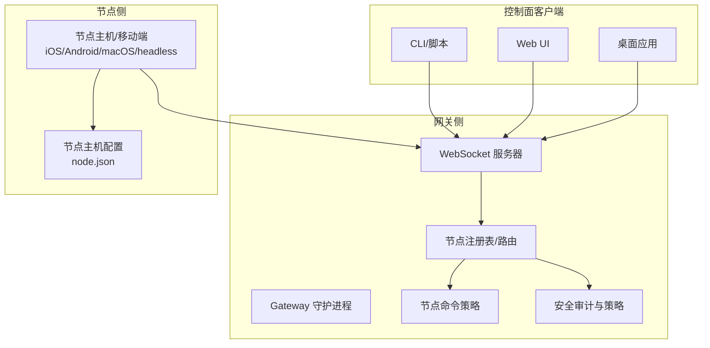
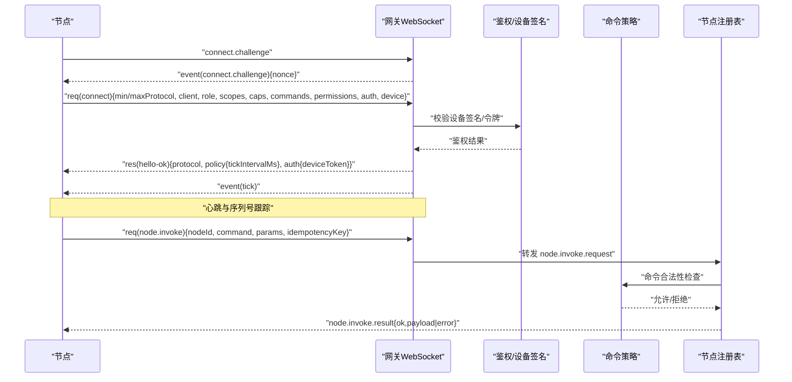
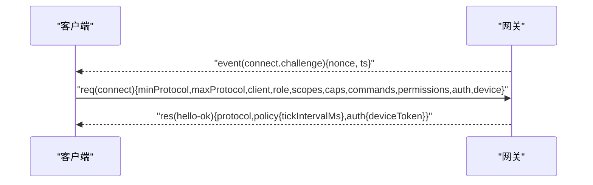
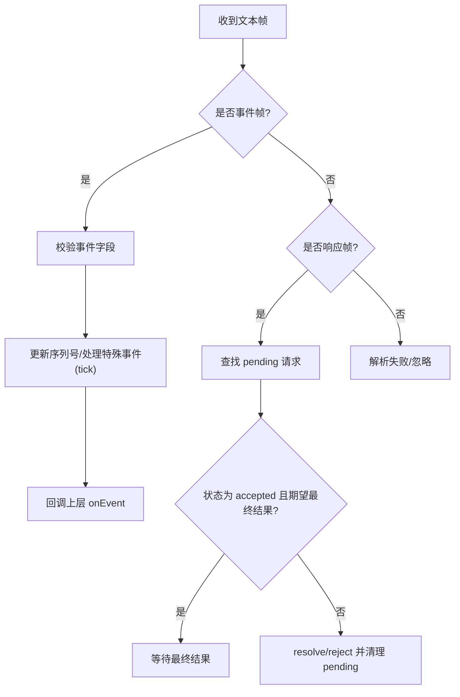
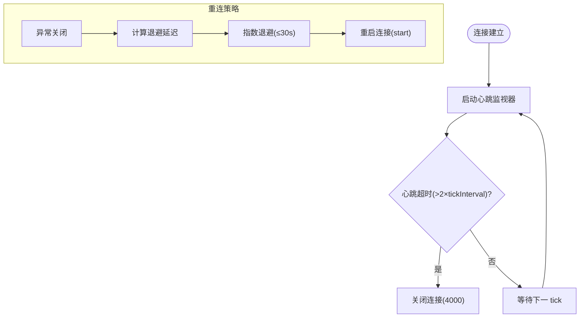
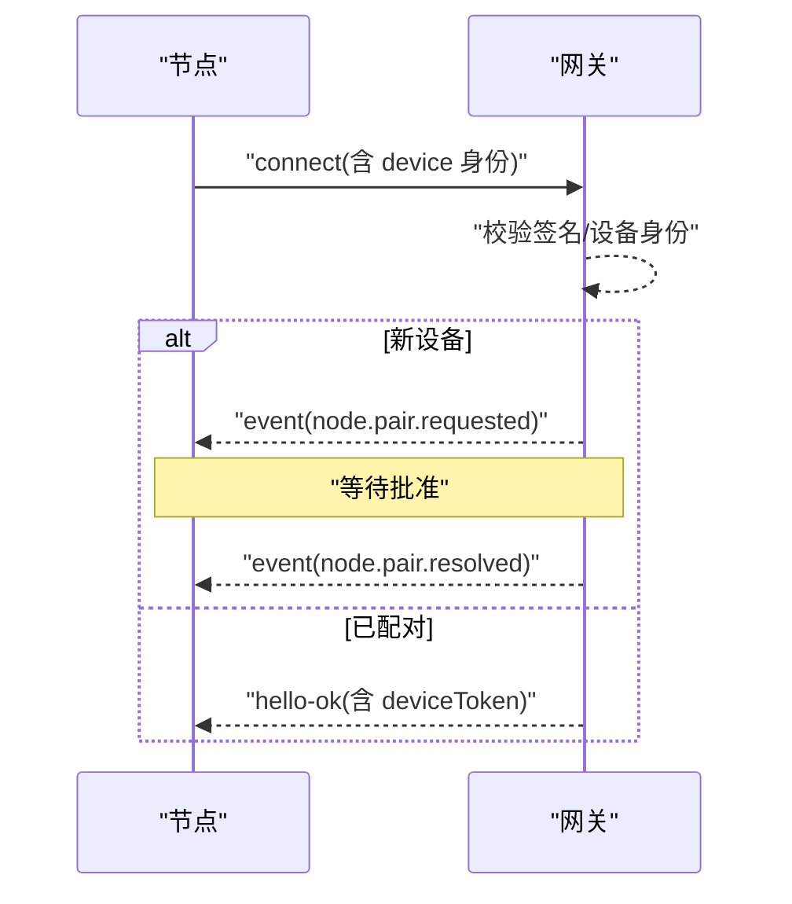
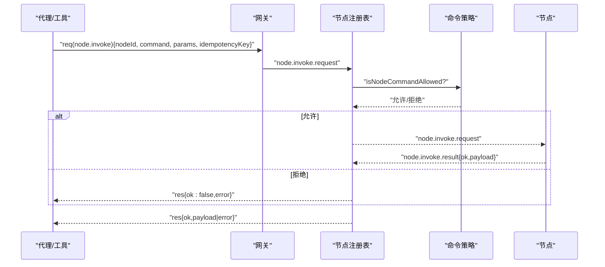
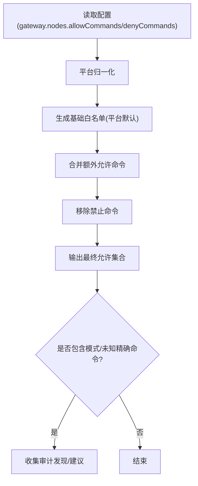
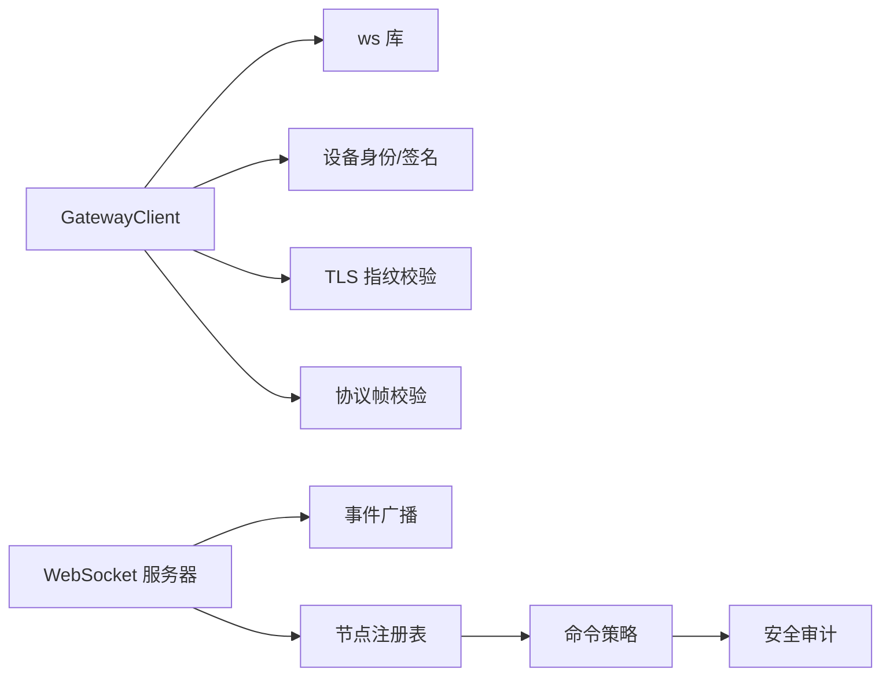

# 节点通信

<cite>
**本文引用的文件**
- [src/gateway/client.ts](file://src/gateway/client.ts)
- [docs/gateway/protocol.md](file://docs/gateway/protocol.md)
- [docs/concepts/architecture.md](file://docs/concepts/architecture.md)
- [src/gateway/server-broadcast.ts](file://src/gateway/server-broadcast.ts)
- [src/gateway/server/ws-connection.ts](file://src/gateway/server/ws-connection.ts)
- [src/gateway/node-registry.ts](file://src/gateway/node-registry.ts)
- [src/gateway/protocol/schema/nodes.ts](file://src/gateway/protocol/schema/nodes.ts)
- [src/gateway/node-command-policy.ts](file://src/gateway/node-command-policy.ts)
- [src/security/audit-extra.sync.ts](file://src/security/audit-extra.sync.ts)
- [src/node-host/config.ts](file://src/node-host/config.ts)
- [apps/shared/OpenClawKit/Tests/OpenClawKitTests/GatewayNodeSessionTests.swift](file://apps/shared/OpenClawKit/Tests/OpenClawKitTests/GatewayNodeSessionTests.swift)
- [apps/macos/Sources/OpenClawProtocol/GatewayModels.swift](file://apps/macos/Sources/OpenClawProtocol/GatewayModels.swift)
- [apps/shared/OpenClawKit/Sources/OpenClawProtocol/GatewayModels.swift](file://apps/shared/OpenClawKit/Sources/OpenClawProtocol/GatewayModels.swift)
- [docs/nodes/index.md](file://docs/nodes/index.md)
- [docs/gateway/pairing.md](file://docs/gateway/pairing.md)
- [src/agents/tools/nodes-tool.ts](file://src/agents/tools/nodes-tool.ts)
- [src/cli/nodes-cli/register.pairing.ts](file://src/cli/nodes-cli/register.pairing.ts)
- [src/cli/pairing-cli.ts](file://src/cli/pairing-cli.ts)
- [src/gateway/protocol/schema.ts](file://src/gateway/protocol/schema.ts)
- [src/gateway/protocol/connect-error-details.js](file://src/gateway/protocol/connect-error-details.js)
- [src/gateway/net.js](file://src/gateway/net.js)
- [src/gateway/device-auth.js](file://src/gateway/device-auth.js)
- [src/infra/device-auth-store.js](file://src/infra/device-auth-store.js)
- [src/infra/device-identity.js](file://src/infra/device-identity.js)
- [src/infra/tls/fingerprint.js](file://src/infra/tls/fingerprint.js)
- [src/infra/ws.js](file://src/infra/ws.js)
- [src/logger.js](file://src/logger.js)
- [src/utils/message-channel.js](file://src/utils/message-channel.js)
- [src/version.js](file://src/version.js)
- [extensions/mattermost/src/mattermost/reconnect.test.ts](file://extensions/mattermost/src/mattermost/reconnect.test.ts)
- [src/agents/openai-ws-connection.test.ts](file://src/agents/openai-ws-connection.test.ts)
- [docs/gateway/security/index.md](file://docs/gateway/security/index.md)
- [docs/zh-CN/security/formal-verification.md](file://docs/zh-CN/security/formal-verification.md)
</cite>

## 目录
1. [简介](#简介)
2. [项目结构](#项目结构)
3. [核心组件](#核心组件)
4. [架构总览](#架构总览)
5. [详细组件分析](#详细组件分析)
6. [依赖关系分析](#依赖关系分析)
7. [性能考量](#性能考量)
8. [故障排查指南](#故障排查指南)
9. [结论](#结论)
10. [附录](#附录)

## 简介
本文件面向开发者与运维人员，系统性阐述 OpenClaw 的节点通信体系：包括节点与网关之间的 WebSocket 协议、握手与帧格式、连接与心跳管理、配对与身份鉴权、节点命令调用的 RPC 流程、错误恢复与重连策略，以及安全模型与访问控制建议。文档同时提供调试工具与协议分析方法，帮助快速定位问题并优化性能。

## 项目结构
OpenClaw 将“网关”作为统一的控制平面与节点传输层，所有客户端（CLI/Web/桌面应用/移动端节点）均通过同一 WebSocket 服务接入。节点以角色“node”连接，声明能力与命令白名单，并通过设备身份进行配对与鉴权。

图示来源
- [docs/concepts/architecture.md:12-47](file://docs/concepts/architecture.md#L12-L47)
- [src/gateway/server/ws-connection.ts:115-139](file://src/gateway/server/ws-connection.ts#L115-L139)

章节来源
- [docs/concepts/architecture.md:12-47](file://docs/concepts/architecture.md#L12-L47)
- [src/gateway/server/ws-connection.ts:115-139](file://src/gateway/server/ws-connection.ts#L115-L139)

## 核心组件
- WebSocket 客户端（节点/控制面）：负责握手、鉴权、请求-响应、事件订阅、心跳与重连。
- 网关 WebSocket 服务器：接收连接、校验挑战、分发事件、路由 RPC 请求。
- 节点注册表与路由：维护节点会话、转发 node.invoke 请求、管理超时与回包。
- 节点命令策略：基于平台与配置生成命令白名单，执行命令级授权检查。
- 安全与审计：设备身份签名、TLS 指纹校验、配对与令牌轮换、命令黑名单与模式匹配审计。
- 节点主机配置：持久化节点标识、显示名、网关连接信息与 TLS 参数。

章节来源
- [src/gateway/client.ts:109-674](file://src/gateway/client.ts#L109-L674)
- [src/gateway/server-broadcast.ts:60-118](file://src/gateway/server-broadcast.ts#L60-L118)
- [src/gateway/node-registry.ts:107-155](file://src/gateway/node-registry.ts#L107-L155)
- [src/gateway/node-command-policy.ts:173-211](file://src/gateway/node-command-policy.ts#L173-L211)
- [src/security/audit-extra.sync.ts:970-1006](file://src/security/audit-extra.sync.ts#L970-L1006)
- [src/node-host/config.ts:14-67](file://src/node-host/config.ts#L14-L67)

## 架构总览
下图展示从节点发起连接到命令调用的完整链路，涵盖握手、鉴权、事件广播、RPC 调用与回包、心跳与重连等关键环节。

图示来源
- [docs/gateway/protocol.md:22-78](file://docs/gateway/protocol.md#L22-L78)
- [src/gateway/client.ts:497-554](file://src/gateway/client.ts#L497-L554)
- [src/gateway/node-registry.ts:107-155](file://src/gateway/node-registry.ts#L107-L155)
- [src/gateway/node-command-policy.ts:191-211](file://src/gateway/node-command-policy.ts#L191-L211)

章节来源
- [docs/gateway/protocol.md:22-78](file://docs/gateway/protocol.md#L22-L78)
- [src/gateway/client.ts:497-554](file://src/gateway/client.ts#L497-L554)
- [src/gateway/node-registry.ts:107-155](file://src/gateway/node-registry.ts#L107-L155)
- [src/gateway/node-command-policy.ts:191-211](file://src/gateway/node-command-policy.ts#L191-L211)

## 详细组件分析

### WebSocket 协议与握手
- 传输：文本帧 JSON，首帧必须是“connect”请求。
- 握手阶段：网关先下发“connect.challenge”，节点需使用服务端提供的 nonce 进行设备签名与鉴权，随后发送“connect”请求。
- 成功后返回“hello-ok”，包含协议版本与策略（如心跳间隔），并可下发设备令牌用于后续自动重连。

图示来源
- [docs/gateway/protocol.md:24-78](file://docs/gateway/protocol.md#L24-L78)
- [src/gateway/client.ts:267-415](file://src/gateway/client.ts#L267-L415)

章节来源
- [docs/gateway/protocol.md:22-78](file://docs/gateway/protocol.md#L22-L78)
- [src/gateway/client.ts:267-415](file://src/gateway/client.ts#L267-L415)

### 帧格式与事件模型
- 请求帧：req{id, method, params}
- 响应帧：res{id, ok, payload|error}
- 事件帧：event{type:"event", event, payload, seq?, stateVersion?}

图示来源
- [docs/gateway/protocol.md:127-134](file://docs/gateway/protocol.md#L127-L134)
- [src/gateway/client.ts:497-554](file://src/gateway/client.ts#L497-L554)

章节来源
- [docs/gateway/protocol.md:127-134](file://docs/gateway/protocol.md#L127-L134)
- [src/gateway/client.ts:497-554](file://src/gateway/client.ts#L497-L554)

### 连接管理、心跳与重连
- 心跳：网关周期性发送“tick”，客户端记录最近一次心跳时间；若超过两倍心跳间隔未收到“tick”，主动关闭连接。
- 序列号：事件帧含 seq，客户端检测断层并触发 gap 回调。
- 重连：指数退避（上限 30 秒），异常关闭时清理 pending 请求并按策略暂停自动重连（如鉴权失败）。

图示来源
- [src/gateway/client.ts:596-618](file://src/gateway/client.ts#L596-L618)
- [src/gateway/client.ts:576-587](file://src/gateway/client.ts#L576-L587)
- [src/gateway/client.ts:417-444](file://src/gateway/client.ts#L417-L444)

章节来源
- [src/gateway/client.ts:596-618](file://src/gateway/client.ts#L596-L618)
- [src/gateway/client.ts:576-587](file://src/gateway/client.ts#L576-L587)
- [src/gateway/client.ts:417-444](file://src/gateway/client.ts#L417-L444)

### 节点配对机制与身份验证
- 设备身份：节点在 connect 中携带 device.id/publicKey/signature/signedAt/nonce，签名内容包含 nonce、客户端元数据与角色/作用域等。
- 首次连接：若设备未配对，网关发出“node.pair.requested”事件，需经批准后下发新令牌。
- 令牌轮换：批准后下发新的设备令牌，旧令牌失效；支持撤销与轮换。
- 本地自动批准：同机或同尾网地址可静默批准（取决于配置）。

图示来源
- [docs/gateway/protocol.md:216-230](file://docs/gateway/protocol.md#L216-L230)
- [docs/gateway/pairing.md:27-63](file://docs/gateway/pairing.md#L27-L63)
- [src/gateway/client.ts:283-343](file://src/gateway/client.ts#L283-L343)

章节来源
- [docs/gateway/protocol.md:216-230](file://docs/gateway/protocol.md#L216-L230)
- [docs/gateway/pairing.md:27-63](file://docs/gateway/pairing.md#L27-L63)
- [src/gateway/client.ts:283-343](file://src/gateway/client.ts#L283-L343)

### 节点命令调用（RPC）与权限验证
- 调用入口：客户端通过“node.invoke”向网关发起 RPC；网关转发至对应节点会话。
- 命令策略：基于平台/设备家族与配置生成命令白名单，节点声明的命令集合必须包含目标命令；支持额外允许/禁止列表。
- 结果回传：节点返回 node.invoke.result，包含 payload 或 error；支持 idempotencyKey 与超时控制。

图示来源
- [src/gateway/node-registry.ts:107-155](file://src/gateway/node-registry.ts#L107-L155)
- [src/gateway/node-command-policy.ts:191-211](file://src/gateway/node-command-policy.ts#L191-L211)
- [src/gateway/protocol/schema/nodes.ts:66-95](file://src/gateway/protocol/schema/nodes.ts#L66-L95)

章节来源
- [src/gateway/node-registry.ts:107-155](file://src/gateway/node-registry.ts#L107-L155)
- [src/gateway/node-command-policy.ts:191-211](file://src/gateway/node-command-policy.ts#L191-L211)
- [src/gateway/protocol/schema/nodes.ts:66-95](file://src/gateway/protocol/schema/nodes.ts#L66-L95)

### 节点命令白名单与黑名单审计
- 白名单：按平台默认集 + 额外允许命令生成；禁止列表优先级更高。
- 黑名单审计：对模式类条目给出提示，对未知精确命令给出建议；支持命令规范化与编辑距离近似。

图示来源
- [src/gateway/node-command-policy.ts:173-189](file://src/gateway/node-command-policy.ts#L173-L189)
- [src/security/audit-extra.sync.ts:970-1006](file://src/security/audit-extra.sync.ts#L970-L1006)

章节来源
- [src/gateway/node-command-policy.ts:173-189](file://src/gateway/node-command-policy.ts#L173-L189)
- [src/security/audit-extra.sync.ts:970-1006](file://src/security/audit-extra.sync.ts#L970-L1006)

### 节点主机配置与 TLS 指纹
- 节点主机配置文件 node.json 包含节点 ID、显示名、网关连接信息与 TLS 参数。
- TLS 指纹校验：客户端可配置指纹，连接后进行证书指纹比对，不一致则拒绝。

章节来源
- [src/node-host/config.ts:14-67](file://src/node-host/config.ts#L14-L67)
- [src/gateway/client.ts:173-196](file://src/gateway/client.ts#L173-L196)

### 调试与测试参考
- Swift 单测：构造“hello-ok”帧与 WebSocket 会话，验证握手与策略字段。
- 命令调用测试：封装 node.invoke 请求，评估成功/失败与错误码。
- 重连行为测试：指数退避、最大重试次数、错误与关闭同时触发时的去重逻辑。

章节来源
- [apps/shared/OpenClawKit/Tests/OpenClawKitTests/GatewayNodeSessionTests.swift:104-152](file://apps/shared/OpenClawKit/Tests/OpenClawKitTests/GatewayNodeSessionTests.swift#L104-L152)
- [src/gateway/node-registry.ts:107-155](file://src/gateway/node-registry.ts#L107-L155)
- [extensions/mattermost/src/mattermost/reconnect.test.ts:50-94](file://extensions/mattermost/src/mattermost/reconnect.test.ts#L50-L94)
- [src/agents/openai-ws-connection.test.ts:490-554](file://src/agents/openai-ws-connection.test.ts#L490-L554)

## 依赖关系分析
- 客户端依赖：WebSocket、设备身份与签名、TLS 指纹、协议帧校验、连接错误细节解析。
- 网关侧：WebSocket 服务器、事件广播、节点注册表、命令策略、安全审计。
- 协议模型：TypeBox 定义的 schema 导出，统一前后端模型。

图示来源
- [src/gateway/client.ts:1-674](file://src/gateway/client.ts#L1-L674)
- [src/gateway/server-broadcast.ts:60-118](file://src/gateway/server-broadcast.ts#L60-L118)
- [src/gateway/node-registry.ts:107-155](file://src/gateway/node-registry.ts#L107-L155)
- [src/gateway/node-command-policy.ts:173-211](file://src/gateway/node-command-policy.ts#L173-L211)
- [src/gateway/protocol/schema.ts:1-19](file://src/gateway/protocol/schema.ts#L1-L19)

章节来源
- [src/gateway/client.ts:1-674](file://src/gateway/client.ts#L1-L674)
- [src/gateway/server-broadcast.ts:60-118](file://src/gateway/server-broadcast.ts#L60-L118)
- [src/gateway/node-registry.ts:107-155](file://src/gateway/node-registry.ts#L107-L155)
- [src/gateway/node-command-policy.ts:173-211](file://src/gateway/node-command-policy.ts#L173-L211)
- [src/gateway/protocol/schema.ts:1-19](file://src/gateway/protocol/schema.ts#L1-L19)

## 性能考量
- 心跳与缓冲：网关对慢消费者会丢弃事件或关闭连接，避免内存膨胀；客户端应合理设置心跳间隔与缓冲阈值。
- 大负载帧：节点屏幕快照等大体积响应需增大 maxPayload，平衡带宽与稳定性。
- 重连退避：指数退避上限与最小探测间隔，避免风暴式重连。

章节来源
- [src/gateway/server-broadcast.ts:100-117](file://src/gateway/server-broadcast.ts#L100-L117)
- [src/gateway/client.ts:169-173](file://src/gateway/client.ts#L169-L173)
- [src/gateway/client.ts:576-587](file://src/gateway/client.ts#L576-L587)

## 故障排查指南
- 握手失败
  - 缺少 nonce：确认收到 connect.challenge 且 nonce 非空。
  - 设备签名/身份不匹配：检查设备公钥、签名、nonce 与签名时间戳。
  - 认证失败：核对令牌/密码/设备令牌；关注错误详情与建议下一步。
- 连接异常
  - 异常关闭（1006）：检查网络与中间件；确认 TLS 指纹与证书一致性。
  - 心跳超时：检查防火墙/NAT、代理与服务端心跳策略。
- 重连循环
  - 鉴权错误（如令牌不匹配）：在可信端点仅允许一次性设备令牌重试；否则暂停自动重连并提示人工干预。
- 命令调用失败
  - 命令未允许：检查节点声明命令与网关策略；查看审计建议。
  - 节点未连接：确认节点在线与会话状态。

章节来源
- [src/gateway/client.ts:502-513](file://src/gateway/client.ts#L502-L513)
- [src/gateway/client.ts:211-244](file://src/gateway/client.ts#L211-L244)
- [src/gateway/client.ts:614-617](file://src/gateway/client.ts#L614-L617)
- [src/gateway/client.ts:417-444](file://src/gateway/client.ts#L417-L444)
- [src/gateway/node-command-policy.ts:191-211](file://src/gateway/node-command-policy.ts#L191-L211)

## 结论
OpenClaw 的节点通信以统一的 WebSocket 协议为核心，结合设备身份与配对机制实现强安全边界，通过命令策略与审计保障访问控制。心跳与重连策略确保链路稳定，而事件广播与 RPC 路由形成清晰的数据流。遵循本文档的安全与调试建议，可有效提升系统的可靠性与可观测性。

## 附录

### 安全模型与访问控制要点
- 传输安全：优先使用 wss，必要时启用 TLS 指纹校验。
- 身份与配对：设备身份签名、首次配对审批、设备令牌轮换与撤销。
- 命令白/黑名单：平台默认 + 自定义允许/禁止，审计模式条目与未知命令。
- 控制界面：可选禁用设备鉴权（仅限特定模式），生产环境不建议。

章节来源
- [docs/gateway/security/index.md:980-995](file://docs/gateway/security/index.md#L980-L995)
- [docs/zh-CN/security/formal-verification.md:48-101](file://docs/zh-CN/security/formal-verification.md#L48-L101)
- [docs/gateway/protocol.md:200-230](file://docs/gateway/protocol.md#L200-L230)
- [src/security/audit-extra.sync.ts:970-1006](file://src/security/audit-extra.sync.ts#L970-L1006)

### 节点命令与 CLI 辅助
- 常用命令族：canvas.*、camera.*、screen.*、location.*、system.*、exec 等。
- CLI 辅助：节点状态、描述、画布快照、相机拍照/录像、位置获取、系统运行等。
- 执行绑定：可将 exec 绑定到指定节点，配合执行审批策略。

章节来源
- [docs/nodes/index.md:159-385](file://docs/nodes/index.md#L159-L385)

### 节点配对 CLI
- 列表、批准、拒绝、状态查询与重命名等操作，支持 JSON 输出与账户过滤。

章节来源
- [src/cli/nodes-cli/register.pairing.ts:43-71](file://src/cli/nodes-cli/register.pairing.ts#L43-L71)
- [src/cli/pairing-cli.ts:63-92](file://src/cli/pairing-cli.ts#L63-L92)

### 协议与模型
- 协议版本与帧格式、角色与作用域、事件与方法清单、设备身份与迁移诊断、TLS 与指纹策略。
- TypeBox 模型导出，支持多语言生成与校验。

章节来源
- [docs/gateway/protocol.md:10-268](file://docs/gateway/protocol.md#L10-L268)
- [src/gateway/protocol/schema.ts:1-19](file://src/gateway/protocol/schema.ts#L1-L19)