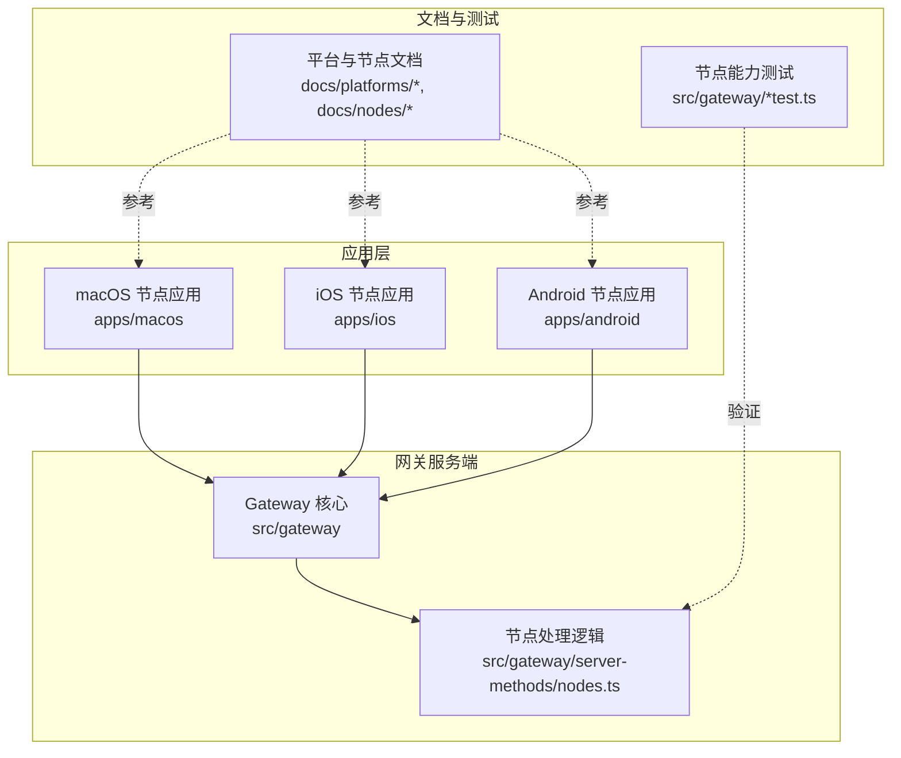
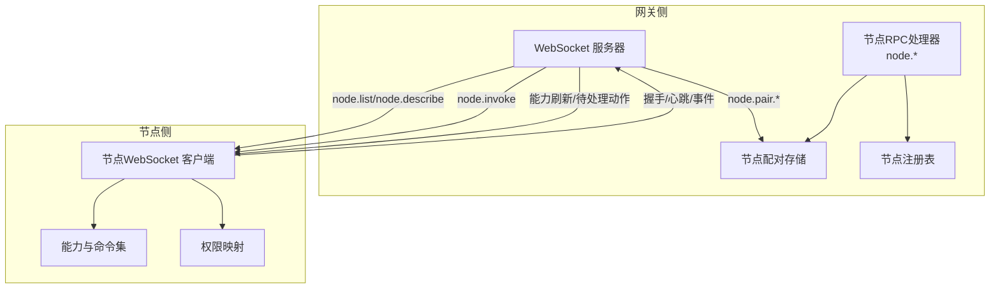
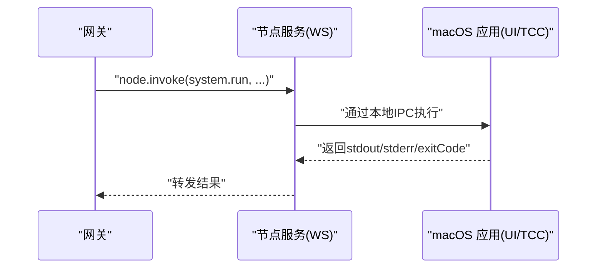
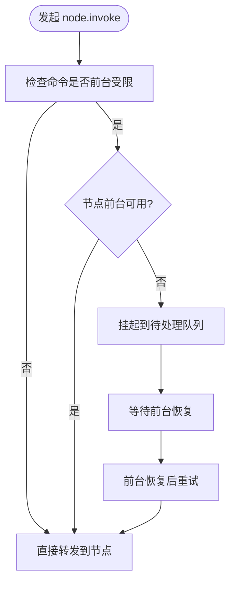
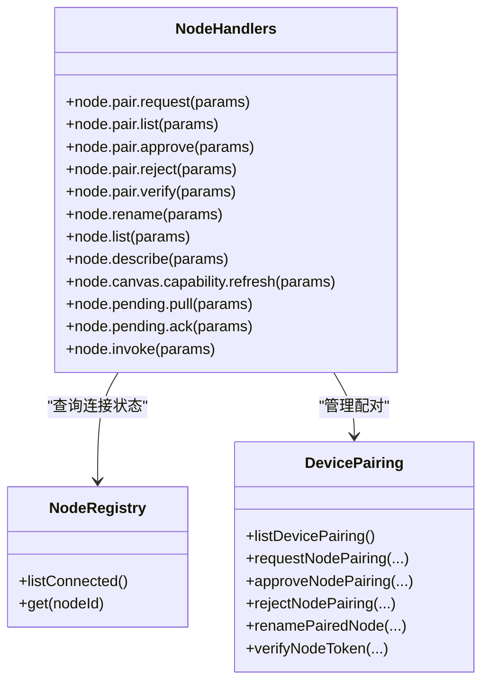
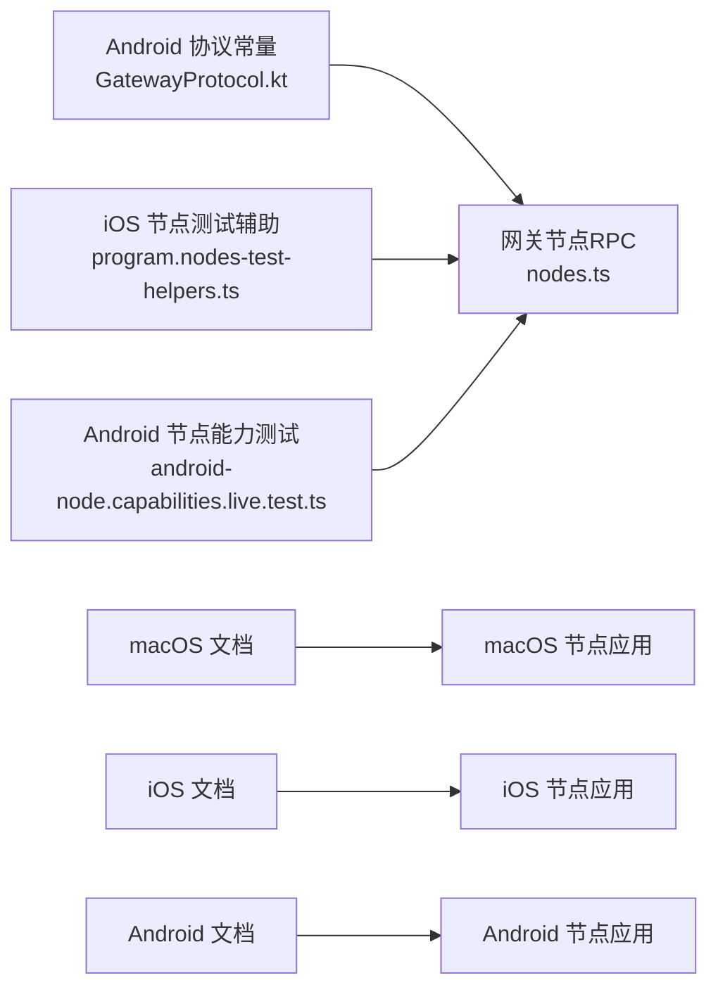

# 设备节点

<cite>
**本文引用的文件**
- [docs/nodes/index.md](file://docs/nodes/index.md)
- [docs/platforms/macos.md](file://docs/platforms/macos.md)
- [docs/platforms/ios.md](file://docs/platforms/ios.md)
- [docs/platforms/android.md](file://docs/platforms/android.md)
- [src/gateway/server-methods/nodes.ts](file://src/gateway/server-methods/nodes.ts)
- [apps/android/app/src/main/java/ai/openclaw/app/gateway/GatewayProtocol.kt](file://apps/android/app/src/main/java/ai/openclaw/app/gateway/GatewayProtocol.kt)
- [src/cli/program.nodes-test-helpers.ts](file://src/cli/program.nodes-test-helpers.ts)
- [src/gateway/android-node.capabilities.live.test.ts](file://src/gateway/android-node.capabilities.live.test.ts)
</cite>

## 目录
1. [简介](#简介)
2. [项目结构](#项目结构)
3. [核心组件](#核心组件)
4. [架构总览](#架构总览)
5. [详细组件分析](#详细组件分析)
6. [依赖关系分析](#依赖关系分析)
7. [性能考量](#性能考量)
8. [故障排除指南](#故障排除指南)
9. [结论](#结论)
10. [附录](#附录)

## 简介
本技术文档面向OpenClaw设备节点系统，系统性阐述节点架构设计理念、跨平台支持与设备控制机制。文档覆盖macOS节点、iOS节点、Android节点的功能特性、配置方法与使用场景；解释节点与网关的通信协议、权限管理与安全模型；并提供安装配置指南、功能演示与故障排除方法。同时，文档涵盖节点能力发现、动态注册与生命周期管理等高级主题，并为开发者提供扩展新节点类型与增强现有节点功能的实践指导。

## 项目结构
OpenClaw仓库采用多模块组织方式：应用层（apps/macos、apps/ios、apps/android）承载各平台节点应用；网关服务端（src/gateway）负责节点配对、命令路由与状态管理；文档（docs）提供平台说明与操作指南；测试（src/gateway/*test.ts）覆盖节点能力集成验证。



图示来源
- [docs/platforms/macos.md:1-227](file://docs/platforms/macos.md#L1-L227)
- [docs/platforms/ios.md:1-109](file://docs/platforms/ios.md#L1-L109)
- [docs/platforms/android.md:1-165](file://docs/platforms/android.md#L1-L165)
- [src/gateway/server-methods/nodes.ts:1-800](file://src/gateway/server-methods/nodes.ts#L1-L800)

章节来源
- [docs/nodes/index.md:1-385](file://docs/nodes/index.md#L1-L385)
- [docs/platforms/macos.md:1-227](file://docs/platforms/macos.md#L1-L227)
- [docs/platforms/ios.md:1-109](file://docs/platforms/ios.md#L1-L109)
- [docs/platforms/android.md:1-165](file://docs/platforms/android.md#L1-L165)

## 核心组件
- 节点角色与职责
  - 节点是连接到网关的外围设备，不运行网关服务，提供命令表面（如canvas.*、camera.*、device.*、notifications.*、system.*），通过node.invoke进行调用。
  - macOS可作为“节点模式”，菜单栏应用连接网关并暴露本地Canvas、Camera命令。
- 网关节点子系统
  - 提供节点配对请求、列表、批准/拒绝、校验、重命名、能力刷新、待处理动作拉取与确认等RPC接口。
  - 支持前台受限命令的挂起与重试策略（尤其针对iOS）。
- 平台节点应用
  - macOS：菜单栏+网关代理，负责权限管理、本地/远程模式切换、节点服务IPC与system.run执行。
  - iOS：连接网关、Canvas/A2UI、屏幕快照、相机采集、位置、语音唤醒与对话模式。
  - Android：直接连接网关、前台服务保活、Canvas/A2UI、相机/视频、位置、通知与个人数据命令族。

章节来源
- [docs/nodes/index.md:10-385](file://docs/nodes/index.md#L10-L385)
- [docs/platforms/macos.md:9-227](file://docs/platforms/macos.md#L9-L227)
- [docs/platforms/ios.md:10-109](file://docs/platforms/ios.md#L10-L109)
- [docs/platforms/android.md:10-165](file://docs/platforms/android.md#L10-L165)
- [src/gateway/server-methods/nodes.ts:384-800](file://src/gateway/server-methods/nodes.ts#L384-L800)

## 架构总览
下图展示节点与网关的交互关系：节点以“role: node”连接网关WebSocket；网关侧维护节点配对状态与连接状态，提供命令路由与能力刷新；节点应用在本地或远端执行具体能力。



图示来源
- [src/gateway/server-methods/nodes.ts:384-800](file://src/gateway/server-methods/nodes.ts#L384-L800)
- [docs/nodes/index.md:10-385](file://docs/nodes/index.md#L10-L385)

## 详细组件分析

### macOS 节点
- 角色与能力
  - 作为macOS节点，提供Canvas、Camera、Screen Recording、System命令；通过本地Unix Socket与应用交互，确保UI/TCC上下文下的system.run执行。
  - 在远程模式下，macOS应用启动本地节点主机服务，使远端网关可访问该Mac上的能力。
- 权限与安全
  - 通过“执行审批”（Exec approvals）控制system.run；默认拒绝、询问或白名单策略可按代理配置。
  - 环境变量过滤与安全限制，避免危险环境注入。
- 连接与隧道
  - 支持SSH隧道将远端网关端口转发至本地，节点报告IP为127.0.0.1；如需真实客户端IP，可选择直连传输。



图示来源
- [docs/platforms/macos.md:50-111](file://docs/platforms/macos.md#L50-L111)
- [docs/platforms/macos.md:200-220](file://docs/platforms/macos.md#L200-L220)

章节来源
- [docs/platforms/macos.md:9-227](file://docs/platforms/macos.md#L9-L227)

### iOS 节点
- 连接与发现
  - 通过Bonjour（局域网）或Tailnet（跨网络）发现网关；支持手动主机/端口配置。
  - 首次配对后自动重连；Canvas/A2UI由网关HTTP服务提供。
- 前台受限命令
  - Canvas、Camera、Screen、Talk类命令需前台运行；后台不可用时返回特定错误码，网关可挂起并在前台恢复后重试。
- 语音与对话
  - 支持语音唤醒与对话模式；后台音频可能被系统挂起，建议在前台使用。



图示来源
- [src/gateway/server-methods/nodes.ts:109-139](file://src/gateway/server-methods/nodes.ts#L109-L139)
- [src/gateway/server-methods/nodes.ts:153-199](file://src/gateway/server-methods/nodes.ts#L153-L199)
- [docs/platforms/ios.md:67-101](file://docs/platforms/ios.md#L67-L101)

章节来源
- [docs/platforms/ios.md:10-109](file://docs/platforms/ios.md#L10-L109)
- [src/gateway/server-methods/nodes.ts:109-199](file://src/gateway/server-methods/nodes.ts#L109-L199)

### Android 节点
- 连接与保活
  - 使用前台服务维持WebSocket连接；支持Bonjour（mDNS/NSD）与Tailnet（Wide-Area Bonjour）发现；支持TLS与令牌/密码认证。
- 能力与命令
  - Canvas/A2UI、相机拍照/录制、屏幕录制、位置获取；根据设备能力与权限动态暴露命令族（如device.*、notifications.*、photos.*、contacts.*、calendar.*、motion.*）。
- 协议版本
  - 节点应用使用固定协议版本常量与网关交互，确保兼容性。

```mermaid
sequenceDiagram
participant AND as "Android 节点"
participant GW as "网关"
participant DISC as "发现/认证"
AND->>DISC : "发现网关(mDNS/NSD/DNS-SD)"
AND->>GW : "WebSocket 握手(携带设备身份)"
GW-->>AND : "配对请求/令牌校验"
AND->>GW : "上报能力与命令集"
GW-->>AND : "node.list/node.describe"
GW->>AND : "node.invoke(...)"
AND-->>GW : "执行结果"
```

图示来源
- [docs/platforms/android.md:24-165](file://docs/platforms/android.md#L24-L165)
- [apps/android/app/src/main/java/ai/openclaw/app/gateway/GatewayProtocol.kt:1-3](file://apps/android/app/src/main/java/ai/openclaw/app/gateway/GatewayProtocol.kt#L1-L3)

章节来源
- [docs/platforms/android.md:10-165](file://docs/platforms/android.md#L10-L165)
- [apps/android/app/src/main/java/ai/openclaw/app/gateway/GatewayProtocol.kt:1-3](file://apps/android/app/src/main/java/ai/openclaw/app/gateway/GatewayProtocol.kt#L1-L3)

### 网关节点RPC与生命周期
- 节点配对与状态
  - 提供node.pair.request/list/approve/reject/verify，以及node.rename；网关维护节点配对状态与连接状态，合并已配对与已连接节点信息。
- 能力与命令
  - node.list/node.describe聚合节点能力与命令集合，支持排序与去重；Canvas能力可通过刷新接口生成带时效的托管URL。
- 待处理动作
  - 对前台受限命令失败（如iOS后台）进行挂起与重试，支持拉取与确认ACK，防止重复执行。
- 错误处理与超时
  - 统一参数校验与错误响应格式；对节点调用失败进行降级处理与广播事件。



图示来源
- [src/gateway/server-methods/nodes.ts:384-800](file://src/gateway/server-methods/nodes.ts#L384-L800)

章节来源
- [src/gateway/server-methods/nodes.ts:1-800](file://src/gateway/server-methods/nodes.ts#L1-L800)

## 依赖关系分析
- 平台与网关的耦合
  - 各平台节点均通过WebSocket与网关交互；Android节点明确声明协议版本常量，确保兼容性。
- 网关内部模块
  - 节点RPC处理器依赖设备配对存储、节点注册表与Canvas能力工具；前台受限命令策略与待处理队列提升用户体验。
- 测试与验证
  - 通过端到端测试对Android节点能力进行集成验证，确保命令可用性与稳定性。



图示来源
- [apps/android/app/src/main/java/ai/openclaw/app/gateway/GatewayProtocol.kt:1-3](file://apps/android/app/src/main/java/ai/openclaw/app/gateway/GatewayProtocol.kt#L1-L3)
- [src/cli/program.nodes-test-helpers.ts:1-13](file://src/cli/program.nodes-test-helpers.ts#L1-L13)
- [src/gateway/android-node.capabilities.live.test.ts:411-427](file://src/gateway/android-node.capabilities.live.test.ts#L411-L427)
- [docs/platforms/macos.md:1-227](file://docs/platforms/macos.md#L1-L227)
- [docs/platforms/ios.md:1-109](file://docs/platforms/ios.md#L1-L109)
- [docs/platforms/android.md:1-165](file://docs/platforms/android.md#L1-L165)

章节来源
- [apps/android/app/src/main/java/ai/openclaw/app/gateway/GatewayProtocol.kt:1-3](file://apps/android/app/src/main/java/ai/openclaw/app/gateway/GatewayProtocol.kt#L1-L3)
- [src/cli/program.nodes-test-helpers.ts:1-13](file://src/cli/program.nodes-test-helpers.ts#L1-L13)
- [src/gateway/android-node.capabilities.live.test.ts:411-427](file://src/gateway/android-node.capabilities.live.test.ts#L411-L427)

## 性能考量
- 前台受限命令的挂起与重试
  - 避免频繁失败导致的重试风暴，设置节流与轮询间隔，减少资源消耗。
- Canvas能力刷新
  - 生成带时效的托管URL，降低长期持有敏感凭据的风险。
- 执行审批与环境过滤
  - 白名单与环境变量过滤减少潜在攻击面，提高系统稳定性。

章节来源
- [src/gateway/server-methods/nodes.ts:50-99](file://src/gateway/server-methods/nodes.ts#L50-L99)
- [src/gateway/server-methods/nodes.ts:671-715](file://src/gateway/server-methods/nodes.ts#L671-L715)
- [docs/platforms/macos.md:75-111](file://docs/platforms/macos.md#L75-L111)

## 故障排除指南
- iOS前台不可用
  - 症状：Canvas/Camera/Screen/Talk命令报错；解决：将节点应用置于前台，或等待网关挂起队列重试。
- Android权限缺失
  - 症状：相机/录音权限未授予；解决：在节点应用中授予权限，重新触发能力上报。
- Canvas托管未配置
  - 症状：A2UI主机未配置；解决：确认网关已发布Canvas/A2UI主机URL并正确配置。
- 配对请求未出现
  - 症状：节点未显示配对提示；解决：在网关侧查看设备列表并手动批准。
- 重装后无法重连
  - 症状：钥匙串中的配对令牌被清除；解决：重新进行节点配对流程。

章节来源
- [docs/platforms/ios.md:97-103](file://docs/platforms/ios.md#L97-L103)
- [docs/nodes/index.md:223-228](file://docs/nodes/index.md#L223-L228)
- [docs/platforms/android.md:24-165](file://docs/platforms/android.md#L24-L165)

## 结论
OpenClaw设备节点系统通过统一的网关RPC协议与平台化节点应用，实现了跨macOS/iOS/Android的设备控制与能力共享。网关侧提供完善的配对、能力聚合、前台受限命令挂起与Canvas能力托管机制；平台侧则聚焦权限管理、连接保活与用户体验优化。文档为用户与开发者提供了从安装配置到故障排除的全链路指引，并为扩展新节点类型与增强现有能力提供了清晰的实践路径。

## 附录
- 快速参考
  - 节点命令与能力：参见节点文档索引与平台说明。
  - 配置与安装：参见各平台文档与网关运行指南。
  - 测试与验证：参见端到端测试文件与测试辅助工具。

章节来源
- [docs/nodes/index.md:1-385](file://docs/nodes/index.md#L1-L385)
- [docs/platforms/macos.md:1-227](file://docs/platforms/macos.md#L1-L227)
- [docs/platforms/ios.md:1-109](file://docs/platforms/ios.md#L1-L109)
- [docs/platforms/android.md:1-165](file://docs/platforms/android.md#L1-L165)
- [src/gateway/server-methods/nodes.ts:1-800](file://src/gateway/server-methods/nodes.ts#L1-L800)