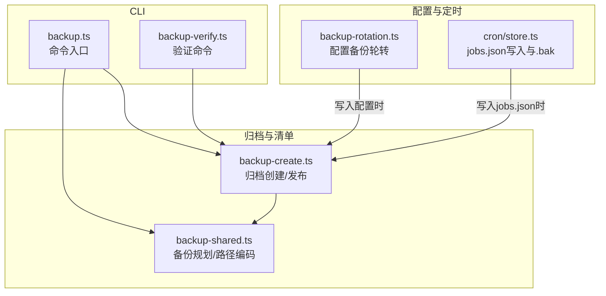
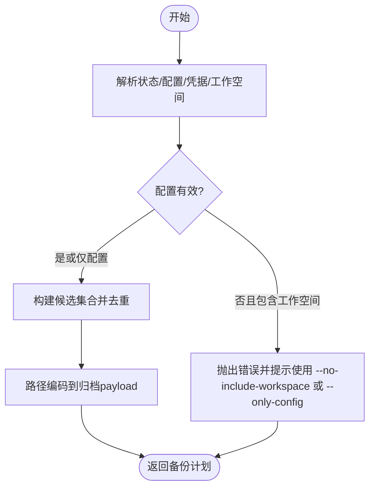
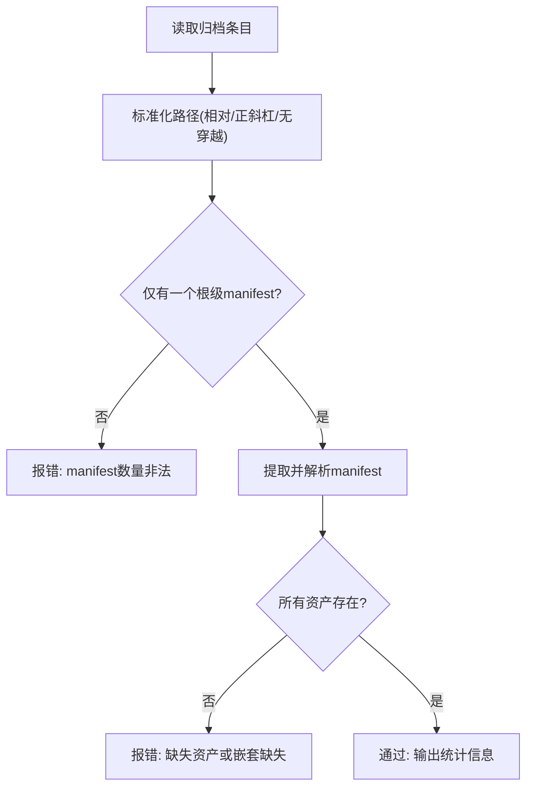
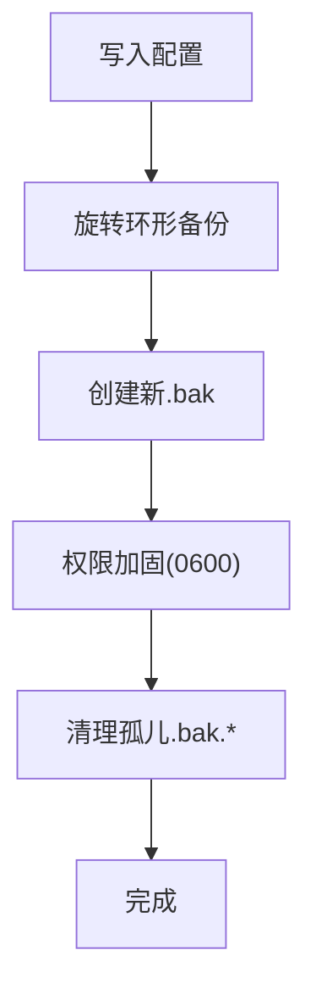
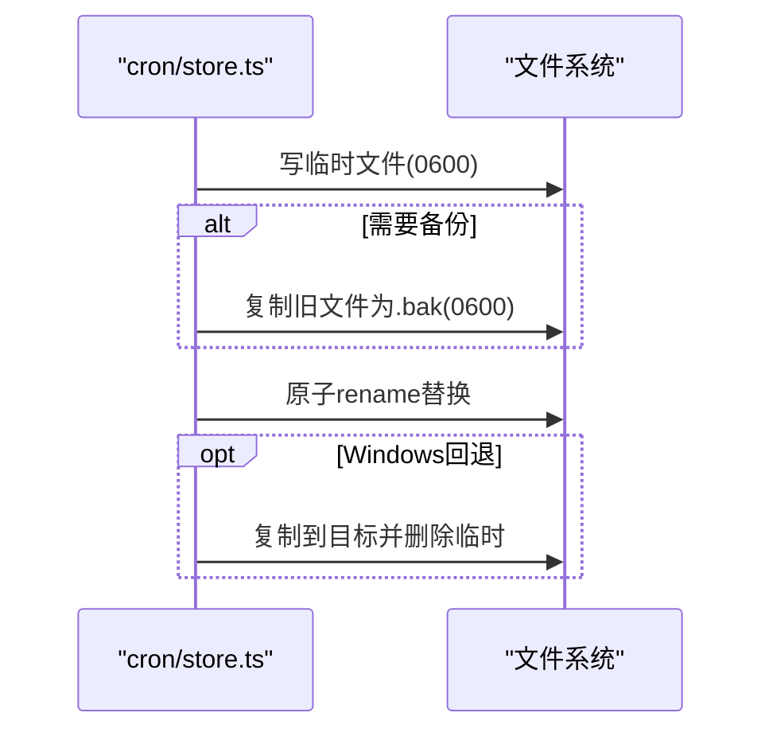
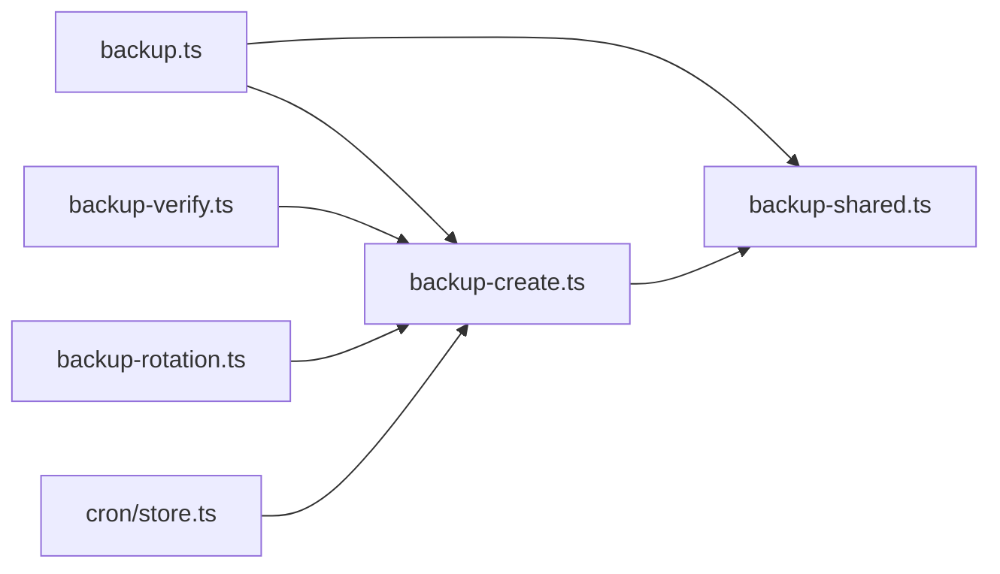

# 备份恢复

<cite>
**本文引用的文件**
- [docs/cli/backup.md](file://docs/cli/backup.md)
- [src/commands/backup.ts](file://src/commands/backup.ts)
- [src/commands/backup-shared.ts](file://src/commands/backup-shared.ts)
- [src/infra/backup-create.ts](file://src/infra/backup-create.ts)
- [src/commands/backup-verify.ts](file://src/commands/backup-verify.ts)
- [src/config/backup-rotation.ts](file://src/config/backup-rotation.ts)
- [src/cron/store.ts](file://src/cron/store.ts)
- [src/config/sessions/store-maintenance.ts](file://src/config/sessions/store-maintenance.ts)
- [src/config/sessions/store.ts](file://src/config/sessions/store.ts)
- [src/config/config.backup-rotation.test.ts](file://src/config/config.backup-rotation.test.ts)
- [src/commands/backup.test.ts](file://src/commands/backup.test.ts)
</cite>

## 目录
1. [简介](#简介)
2. [项目结构](#项目结构)
3. [核心组件](#核心组件)
4. [架构总览](#架构总览)
5. [详细组件分析](#详细组件分析)
6. [依赖关系分析](#依赖关系分析)
7. [性能考量](#性能考量)
8. [故障排查指南](#故障排查指南)
9. [结论](#结论)
10. [附录](#附录)

## 简介
本运维文档面向OpenClaw备份与恢复系统，覆盖以下主题：
- 数据备份策略：明确备份范围（配置文件、会话数据、工作空间、日志与运行时状态）、备份频率建议、存储管理与生命周期。
- 不同类型数据的备份方法：配置文件备份、会话数据备份、工作空间备份、日志与运行时状态备份。
- 自动化与可操作性：命令行备份与验证、原子写入与备份保留、增量/全量思路与落地建议。
- 灾难恢复：完整系统恢复、部分数据恢复、跨平台迁移策略与验证流程。
- 安全与合规：文件权限加固、路径校验、防覆盖与防穿越、归档完整性校验。

## 项目结构
OpenClaw的备份能力由CLI命令、归档生成器、清单校验器以及配置/会话/定时任务等子系统共同组成。关键模块职责如下：
- CLI层：提供备份创建与验证命令入口，负责参数解析与结果输出。
- 归档层：构建时间戳根目录、归档清单、压缩打包、发布最终归档。
- 验证层：对归档进行完整性与一致性检查，拒绝路径穿越与重复条目。
- 配置备份轮转：在配置写入时维护环形备份、权限加固与孤儿文件清理。
- 会话与定时任务：在写入时自动创建.bak备份并采用原子替换，确保原子性与可回滚性。



图表来源
- [src/commands/backup.ts:11-31](file://src/commands/backup.ts#L11-L31)
- [src/commands/backup-verify.ts:279-324](file://src/commands/backup-verify.ts#L279-L324)
- [src/commands/backup-shared.ts:106-254](file://src/commands/backup-shared.ts#L106-L254)
- [src/infra/backup-create.ts:272-368](file://src/infra/backup-create.ts#L272-L368)
- [src/config/backup-rotation.ts:115-125](file://src/config/backup-rotation.ts#L115-L125)
- [src/cron/store.ts:63-106](file://src/cron/store.ts#L63-L106)

章节来源
- [docs/cli/backup.md:9-77](file://docs/cli/backup.md#L9-L77)
- [src/commands/backup.ts:11-31](file://src/commands/backup.ts#L11-L31)
- [src/commands/backup-shared.ts:106-254](file://src/commands/backup-shared.ts#L106-L254)
- [src/infra/backup-create.ts:272-368](file://src/infra/backup-create.ts#L272-L368)
- [src/commands/backup-verify.ts:279-324](file://src/commands/backup-verify.ts#L279-L324)
- [src/config/backup-rotation.ts:115-125](file://src/config/backup-rotation.ts#L115-L125)
- [src/cron/store.ts:63-106](file://src/cron/store.ts#L63-L106)

## 核心组件
- 备份规划与路径编码
  - 规划来源：状态目录、配置文件、凭据目录、工作空间集合。
  - 去重与优先级：按“状态>配置>凭据>工作空间”优先级去重，避免重复归档。
  - 路径编码：将绝对路径统一编码到归档内的payload下，支持Windows盘符与POSIX路径。
- 归档创建与发布
  - 清单生成：记录schema版本、创建时间、运行时版本、平台信息、选项与路径映射。
  - 压缩打包：使用tar.gz，禁用mtime与设备号，保证可移植性；写入回调重写条目路径。
  - 发布策略：临时文件+硬链接或拷贝发布，拒绝覆盖既有归档。
- 归档验证
  - 仅允许相对路径、禁止路径穿越、校验清单唯一且存在、校验资产条目存在或嵌套存在。
- 配置备份轮转
  - 写入配置时执行：旋转环形备份、创建新.bak、权限加固、清理孤儿.bak.*。
- 定时任务备份
  - 写入jobs.json时自动创建.bak，采用原子rename或复制删除策略，失败容忍。

章节来源
- [src/commands/backup-shared.ts:106-254](file://src/commands/backup-shared.ts#L106-L254)
- [src/infra/backup-create.ts:190-231](file://src/infra/backup-create.ts#L190-L231)
- [src/infra/backup-create.ts:345-361](file://src/infra/backup-create.ts#L345-L361)
- [src/commands/backup-verify.ts:218-310](file://src/commands/backup-verify.ts#L218-L310)
- [src/config/backup-rotation.ts:16-125](file://src/config/backup-rotation.ts#L16-L125)
- [src/cron/store.ts:63-106](file://src/cron/store.ts#L63-L106)

## 架构总览
下面的序列图展示从CLI到归档创建与验证的整体流程，以及配置写入时的备份轮转与定时任务写入备份。

```mermaid
sequenceDiagram
participant U as "用户"
participant CLI as "backup.ts"
participant Plan as "backup-shared.ts"
participant Create as "backup-create.ts"
participant Verify as "backup-verify.ts"
U->>CLI : 执行 openclaw backup create
CLI->>Plan : 解析备份计划(状态/配置/凭据/工作空间)
Plan-->>CLI : 返回包含/跳过列表
CLI->>Create : 创建归档(写清单/打包/发布)
Create-->>CLI : 返回结果(路径/资产/跳过项)
alt 需要立即验证
CLI->>Verify : 验证归档
Verify-->>CLI : 验证通过/失败
end
CLI-->>U : 输出摘要(JSON/文本)
Note over Create : 写入配置时触发配置轮转
Note over Create : 写入jobs.json时触发.bak备份
```

图表来源
- [src/commands/backup.ts:11-31](file://src/commands/backup.ts#L11-L31)
- [src/commands/backup-shared.ts:106-254](file://src/commands/backup-shared.ts#L106-L254)
- [src/infra/backup-create.ts:272-368](file://src/infra/backup-create.ts#L272-L368)
- [src/commands/backup-verify.ts:279-324](file://src/commands/backup-verify.ts#L279-L324)
- [src/config/backup-rotation.ts:115-125](file://src/config/backup-rotation.ts#L115-L125)
- [src/cron/store.ts:63-106](file://src/cron/store.ts#L63-L106)

## 详细组件分析

### 备份规划与路径编码
- 规划来源与去重
  - 来源：状态目录、配置文件、凭据目录、工作空间集合（可选）。
  - 去重策略：对候选路径进行规范化与去重，若某路径被另一个更上层路径包含，则跳过该候选。
  - 优先级：状态>配置>凭据>工作空间，保证最小覆盖集合。
- 路径编码规则
  - 绝对路径统一编码到payload下，Windows盘符映射到windows/{drive}/rest，POSIX路径映射到posix/{rest}。
  - 相对路径映射到relative/{rest}，便于跨平台还原。
- 工作空间发现
  - 当启用工作空间备份且配置有效时，基于清理计划收集工作空间目录；当配置无效时，强制显式关闭工作空间备份或仅备份配置。



图表来源
- [src/commands/backup-shared.ts:106-254](file://src/commands/backup-shared.ts#L106-L254)

章节来源
- [src/commands/backup-shared.ts:106-254](file://src/commands/backup-shared.ts#L106-L254)
- [src/commands/backup.test.ts:338-434](file://src/commands/backup.test.ts#L338-L434)

### 归档创建与发布
- 清单结构
  - 包含schema版本、创建时间、归档根、运行时版本、平台、Node版本、选项、路径映射、资产清单与跳过项。
- 打包与发布
  - 使用tar.gz，禁用mtime与设备号，写入回调将清单与资产条目重写到归档根下的正确位置。
  - 发布阶段：优先硬链接到目标路径；若不支持则尝试排他拷贝；均失败则报错并清理临时文件。
- 输出与默认行为
  - 默认输出为当前工作目录或用户家目录下的时间戳归档名；拒绝覆盖既有归档；拒绝将输出写入任一源路径内部。

```mermaid
sequenceDiagram
participant Plan as "backup-shared.ts"
participant Create as "backup-create.ts"
participant FS as "文件系统"
Plan-->>Create : 返回候选/去重后的资产
Create->>FS : 写入临时清单
Create->>FS : tar打包(回调重写路径)
Create->>FS : 发布(硬链接/拷贝)
FS-->>Create : 成功/失败
Create-->>Plan : 返回结果(路径/资产/跳过项)
```

图表来源
- [src/commands/backup-shared.ts:106-254](file://src/commands/backup-shared.ts#L106-L254)
- [src/infra/backup-create.ts:272-368](file://src/infra/backup-create.ts#L272-L368)

章节来源
- [src/infra/backup-create.ts:190-231](file://src/infra/backup-create.ts#L190-L231)
- [src/infra/backup-create.ts:345-361](file://src/infra/backup-create.ts#L345-L361)
- [src/infra/backup-create.ts:113-168](file://src/infra/backup-create.ts#L113-L168)

### 归档验证
- 输入校验
  - 仅接受相对路径，禁止绝对路径、反斜杠、路径段“.”“..”与解析后越界。
  - 仅允许一个根级manifest.json条目，且不得重复。
- 清单与条目一致性
  - 校验清单中声明的每个资产在归档内存在（精确匹配或嵌套存在）。
  - 校验所有条目均位于声明的归档根之下。
- 结果输出
  - 返回归档路径、根名、创建时间、运行时版本、资产数量与扫描条目数。



图表来源
- [src/commands/backup-verify.ts:279-324](file://src/commands/backup-verify.ts#L279-L324)

章节来源
- [src/commands/backup-verify.ts:218-310](file://src/commands/backup-verify.ts#L218-L310)

### 配置备份轮转与权限加固
- 轮转策略
  - 在写入配置前执行：删除最高位备份、依次向高位移动、将主备份移至.bak.1。
- 权限加固
  - 对主备份与编号备份设置owner-only权限，保证敏感配置安全。
- 孤儿清理
  - 清理不在轮转范围内的.bak.*文件，防止磁盘膨胀与混乱。
- 组合流程
  - rotate → copy → harden → clean顺序执行，确保原子性与一致性。



图表来源
- [src/config/backup-rotation.ts:16-125](file://src/config/backup-rotation.ts#L16-L125)

章节来源
- [src/config/backup-rotation.ts:16-125](file://src/config/backup-rotation.ts#L16-L125)
- [src/config/config.backup-rotation.test.ts:17-135](file://src/config/config.backup-rotation.test.ts#L17-L135)

### 定时任务备份与原子写入
- 写入流程
  - 写入jobs.json前：创建临时文件并设置权限，必要时复制旧文件为.bak，再原子rename替换。
  - 若rename不可用（如Windows），则复制后删除临时文件。
- 失败容忍
  - 复制.bak为best-effort，不影响主流程；缓存已序列化的JSON以避免重复写入。



图表来源
- [src/cron/store.ts:63-106](file://src/cron/store.ts#L63-L106)

章节来源
- [src/cron/store.ts:63-106](file://src/cron/store.ts#L63-L106)

### 会话数据与工作空间备份
- 会话数据
  - 会话存储位于状态目录下，随状态目录一起被归档；可通过维护配置控制会话文件的轮换与归档保留。
- 工作空间
  - 工作空间目录由配置决定；当配置无效时，备份工具会阻止工作空间发现并要求显式关闭或仅备份配置。

章节来源
- [src/commands/backup-shared.ts:172-186](file://src/commands/backup-shared.ts#L172-L186)
- [src/config/sessions/store-maintenance.ts:38-78](file://src/config/sessions/store-maintenance.ts#L38-L78)
- [src/commands/backup.test.ts:338-434](file://src/commands/backup.test.ts#L338-L434)

## 依赖关系分析
- 模块耦合
  - CLI命令依赖备份规划与归档创建；验证命令独立于创建流程但共享清单格式。
  - 配置轮转与定时任务备份分别在各自写入路径上触发，与归档流程解耦。
- 外部依赖
  - tar用于压缩打包；Node FS用于文件操作；JSON/JSON5用于配置解析与序列化。
- 可能的循环依赖
  - 各模块职责清晰，未见循环导入迹象。



图表来源
- [src/commands/backup.ts:11-31](file://src/commands/backup.ts#L11-L31)
- [src/commands/backup-shared.ts:106-254](file://src/commands/backup-shared.ts#L106-L254)
- [src/infra/backup-create.ts:272-368](file://src/infra/backup-create.ts#L272-L368)
- [src/commands/backup-verify.ts:279-324](file://src/commands/backup-verify.ts#L279-L324)
- [src/config/backup-rotation.ts:115-125](file://src/config/backup-rotation.ts#L115-L125)
- [src/cron/store.ts:63-106](file://src/cron/store.ts#L63-L106)

章节来源
- [src/commands/backup.ts:11-31](file://src/commands/backup.ts#L11-L31)
- [src/commands/backup-shared.ts:106-254](file://src/commands/backup-shared.ts#L106-L254)
- [src/infra/backup-create.ts:272-368](file://src/infra/backup-create.ts#L272-L368)
- [src/commands/backup-verify.ts:279-324](file://src/commands/backup-verify.ts#L279-L324)
- [src/config/backup-rotation.ts:115-125](file://src/config/backup-rotation.ts#L115-L125)
- [src/cron/store.ts:63-106](file://src/cron/store.ts#L63-L106)

## 性能考量
- 大型工作空间
  - 工作空间是归档体积的主要驱动因素；建议在非生产时段执行全量备份，并考虑使用“仅配置”模式减少体积。
- 压缩与I/O
  - 使用tar.gz压缩，禁用mtime与设备号提升可移植性；尽量在本地SSD或高性能磁盘上执行备份。
- 验证开销
  - 验证需重新扫描归档，建议在开发/测试环境开启，在生产环境谨慎使用。

## 故障排查指南
- 归档覆盖与路径冲突
  - 若输出路径与任一源路径重叠，系统会拒绝写入；请调整输出目录或使用默认行为。
- 配置无效导致的工作空间备份失败
  - 当配置无效且启用工作空间备份时，备份会失败；请使用“仅配置”或“关闭工作空间”模式。
- 归档验证失败
  - 常见原因：路径穿越、重复条目、manifest缺失或不唯一、资产不存在或越界。
- 配置轮转与权限问题
  - Windows无法观察到POSIX权限位；若遇到.bak权限异常，请确认平台差异与文件系统支持。

章节来源
- [src/infra/backup-create.ts:113-124](file://src/infra/backup-create.ts#L113-L124)
- [src/commands/backup.test.ts:338-434](file://src/commands/backup.test.ts#L338-L434)
- [src/commands/backup-verify.ts:218-310](file://src/commands/backup-verify.ts#L218-L310)
- [src/config/backup-rotation.ts:44-62](file://src/config/backup-rotation.ts#L44-L62)

## 结论
OpenClaw的备份系统以“最小覆盖、原子写入、清单校验、权限加固”为核心设计原则，既满足日常运维的可靠性需求，又为灾难恢复提供了清晰的路径与验证手段。结合本文的策略与流程，可形成可执行的备份与恢复方案，并在不同场景下灵活选择全量/部分恢复与跨平台迁移。

## 附录

### 备份策略与频率建议
- 全量备份
  - 周期：建议每周一次全量备份（包含状态、配置、凭据、工作空间）。
  - 触发：系统升级前、重大配置变更后。
- 增量/快速备份
  - 建议：对频繁变化的工作空间采用“仅配置”或“仅状态”快速备份，降低I/O压力。
- 验证
  - 每次全量备份后执行验证；在生产环境定期抽样验证。

章节来源
- [docs/cli/backup.md:13-77](file://docs/cli/backup.md#L13-L77)
- [src/commands/backup.ts:11-31](file://src/commands/backup.ts#L11-L31)

### 不同场景下的恢复策略
- 部分数据恢复
  - 仅恢复配置：使用“仅配置”备份；适用于配置损坏但状态可用。
  - 仅恢复状态：使用“仅状态”备份；适用于会话/日志损坏但配置可用。
- 完整系统恢复
  - 使用完整归档进行还原；先恢复配置与凭据，再恢复状态与工作空间；最后执行验证。
- 跨平台迁移
  - 使用归档内置的路径编码规则（Windows盘符/POSIX/相对路径）；在目标平台解压后，注意权限与路径映射。

章节来源
- [src/commands/backup-shared.ts:68-84](file://src/commands/backup-shared.ts#L68-L84)
- [src/commands/backup-verify.ts:218-310](file://src/commands/backup-verify.ts#L218-L310)

### 安全与合规要点
- 文件权限
  - 配置与.bak文件统一设置为owner-only；归档发布阶段拒绝覆盖既有文件。
- 路径与归档完整性
  - 严格限制归档内路径为相对路径，禁止路径穿越；仅允许单一根级manifest。
- 生命周期管理
  - 配置轮转：固定环形备份数量；孤儿备份清理；权限加固。

章节来源
- [src/config/backup-rotation.ts:16-125](file://src/config/backup-rotation.ts#L16-L125)
- [src/infra/backup-create.ts:113-168](file://src/infra/backup-create.ts#L113-L168)
- [src/commands/backup-verify.ts:218-310](file://src/commands/backup-verify.ts#L218-L310)