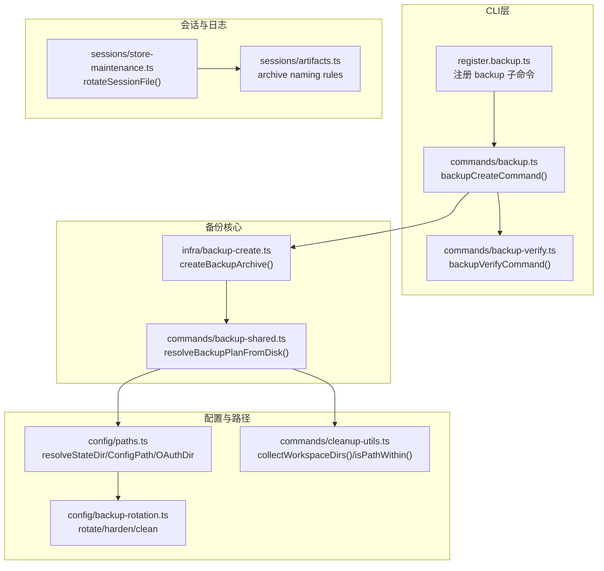
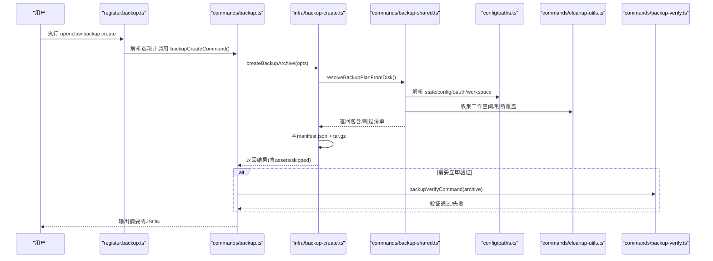
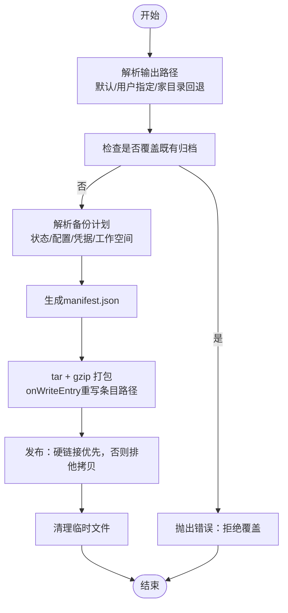
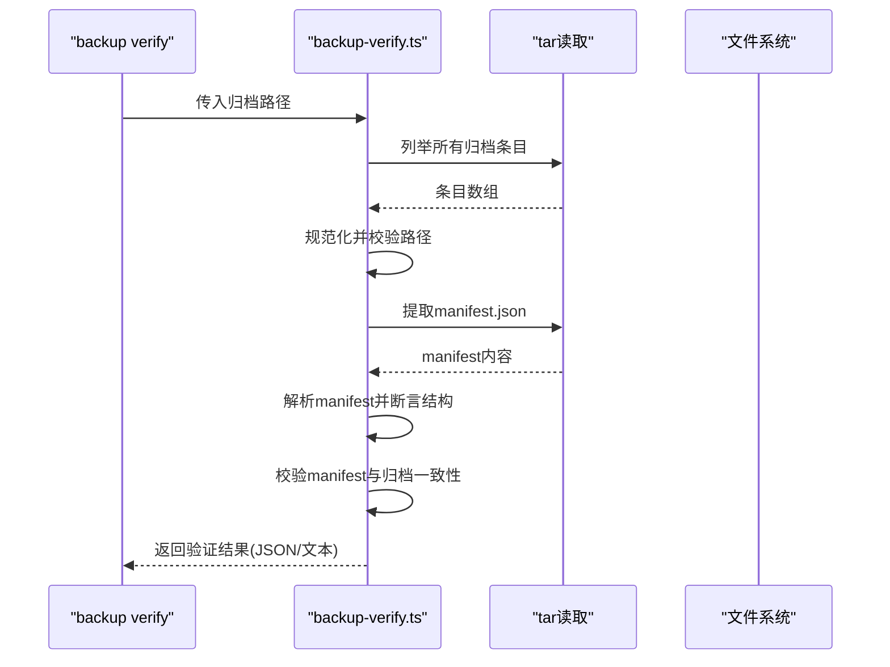
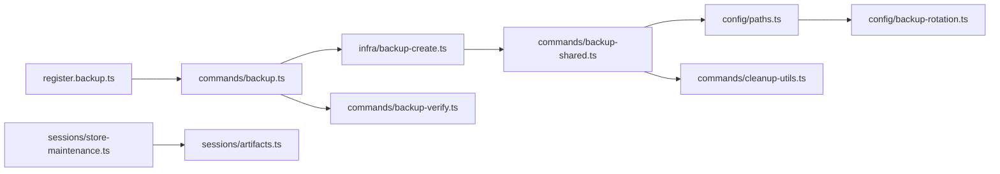

# 备份策略

<cite>
**本文引用的文件**   
- [docs/cli/backup.md](file://docs/cli/backup.md)
- [src/cli/program/register.backup.ts](file://src/cli/program/register.backup.ts)
- [src/commands/backup.ts](file://src/commands/backup.ts)
- [src/commands/backup-shared.ts](file://src/commands/backup-shared.ts)
- [src/commands/backup-verify.ts](file://src/commands/backup-verify.ts)
- [src/infra/backup-create.ts](file://src/infra/backup-create.ts)
- [src/config/backup-rotation.ts](file://src/config/backup-rotation.ts)
- [src/config/paths.ts](file://src/config/paths.ts)
- [src/commands/cleanup-utils.ts](file://src/commands/cleanup-utils.ts)
- [src/config/sessions/store-maintenance.ts](file://src/config/sessions/store-maintenance.ts)
- [src/config/sessions/artifacts.ts](file://src/config/sessions/artifacts.ts)
- [apps/android/app/src/main/res/xml/backup_rules.xml](file://apps/android/app/src/main/res/xml/backup_rules.xml)
</cite>

## 目录
1. [简介](#简介)
2. [项目结构](#项目结构)
3. [核心组件](#核心组件)
4. [架构总览](#架构总览)
5. [详细组件分析](#详细组件分析)
6. [依赖关系分析](#依赖关系分析)
7. [性能考量](#性能考量)
8. [故障排查指南](#故障排查指南)
9. [结论](#结论)
10. [附录](#附录)

## 简介
本文件面向OpenClaw的备份策略，系统化阐述备份范围定义、备份频率配置、存储管理策略、自动化脚本实现思路（全量/增量选择）、压缩与校验、版本管理与权限加固、性能与容量估算、以及在不同环境（开发/测试/生产）下的差异化配置建议。文档以仓库内现有备份能力为基础，结合CLI参考与源码实现进行说明，并提供可操作的运维建议。

## 项目结构
围绕备份功能的关键文件分布如下：
- CLI命令注册与帮助：src/cli/program/register.backup.ts
- 备份创建命令入口：src/commands/backup.ts
- 备份创建核心逻辑与归档：src/infra/backup-create.ts
- 备份计划与路径解析：src/commands/backup-shared.ts
- 备份验证：src/commands/backup-verify.ts
- 配置文件备份轮换与权限加固：src/config/backup-rotation.ts
- 路径解析（状态目录、配置、凭据）：src/config/paths.ts
- 工作空间收集与路径判断：src/commands/cleanup-utils.ts
- 会话数据维护（轮转与归档命名规则）：src/config/sessions/store-maintenance.ts、src/config/sessions/artifacts.ts
- Android端全量备份规则（平台差异）：apps/android/app/src/main/res/xml/backup_rules.xml
- CLI参考文档：docs/cli/backup.md

**图表来源**
- [src/cli/program/register.backup.ts:10-92](file://src/cli/program/register.backup.ts#L10-L92)
- [src/commands/backup.ts:11-31](file://src/commands/backup.ts#L11-L31)
- [src/commands/backup-verify.ts:279-324](file://src/commands/backup-verify.ts#L279-L324)
- [src/commands/backup-shared.ts:106-254](file://src/commands/backup-shared.ts#L106-L254)
- [src/infra/backup-create.ts:272-368](file://src/infra/backup-create.ts#L272-L368)
- [src/config/paths.ts:60-194](file://src/config/paths.ts#L60-L194)
- [src/commands/cleanup-utils.ts:21-55](file://src/commands/cleanup-utils.ts#L21-L55)
- [src/config/backup-rotation.ts:16-125](file://src/config/backup-rotation.ts#L16-L125)
- [src/config/sessions/store-maintenance.ts:275-327](file://src/config/sessions/store-maintenance.ts#L275-L327)
- [src/config/sessions/artifacts.ts:1-47](file://src/config/sessions/artifacts.ts#L1-L47)

**章节来源**
- [docs/cli/backup.md:9-77](file://docs/cli/backup.md#L9-L77)
- [src/cli/program/register.backup.ts:10-92](file://src/cli/program/register.backup.ts#L10-L92)

## 核心组件
- 备份创建命令：负责解析选项、调用归档流程、可选执行验证并输出摘要或JSON。
- 备份计划解析：从磁盘解析状态目录、配置文件、凭据目录、工作空间目录，去重与覆盖跳过，生成“包含/跳过”清单。
- 归档写入与发布：构建manifest.json，使用tar打包gzip压缩，临时文件+硬链接/拷贝发布，避免覆盖既有归档。
- 备份验证：校验归档结构、manifest存在性与唯一性、路径规范化与无越界、资产清单与归档一致性。
- 配置备份轮换与权限加固：环形轮换、权限硬化（owner-only）、孤儿备份清理；用于配置文件写入后的备份维护。
- 路径解析与工作空间发现：状态目录、配置文件、凭据目录的解析；工作空间集合由默认与用户配置共同决定。
- 会话数据维护：按大小轮转sessions文件，保留有限个.bak.*备份；归档命名规则用于区分删除/重置/轮转等场景。

**章节来源**
- [src/commands/backup.ts:11-31](file://src/commands/backup.ts#L11-L31)
- [src/commands/backup-shared.ts:106-254](file://src/commands/backup-shared.ts#L106-L254)
- [src/infra/backup-create.ts:272-368](file://src/infra/backup-create.ts#L272-L368)
- [src/commands/backup-verify.ts:279-324](file://src/commands/backup-verify.ts#L279-L324)
- [src/config/backup-rotation.ts:16-125](file://src/config/backup-rotation.ts#L16-L125)
- [src/config/paths.ts:60-194](file://src/config/paths.ts#L60-L194)
- [src/commands/cleanup-utils.ts:21-55](file://src/commands/cleanup-utils.ts#L21-L55)
- [src/config/sessions/store-maintenance.ts:275-327](file://src/config/sessions/store-maintenance.ts#L275-L327)
- [src/config/sessions/artifacts.ts:1-47](file://src/config/sessions/artifacts.ts#L1-L47)

## 架构总览
下图展示从CLI到归档与验证的整体流程，以及与配置、路径、工作空间、会话维护的交互。

**图表来源**
- [src/cli/program/register.backup.ts:53-64](file://src/cli/program/register.backup.ts#L53-L64)
- [src/commands/backup.ts:11-31](file://src/commands/backup.ts#L11-L31)
- [src/infra/backup-create.ts:272-368](file://src/infra/backup-create.ts#L272-L368)
- [src/commands/backup-shared.ts:106-254](file://src/commands/backup-shared.ts#L106-L254)
- [src/config/paths.ts:60-194](file://src/config/paths.ts#L60-L194)
- [src/commands/cleanup-utils.ts:21-55](file://src/commands/cleanup-utils.ts#L21-L55)
- [src/commands/backup-verify.ts:279-324](file://src/commands/backup-verify.ts#L279-L324)

## 详细组件分析

### 备份范围与优先级
- 备份范围
  - 状态目录（默认~/.openclaw，可通过环境变量覆盖）
  - 活动配置文件（支持多候选路径解析）
  - OAuth/凭据目录（默认位于状态目录内，可独立覆盖）
  - 工作空间目录（来自配置的默认与显式列表，可禁用）
- 覆盖与去重
  - 若配置/凭据/工作空间已位于状态目录内，则不再作为顶层单独备份源，避免重复。
  - 对候选路径进行canonical化后去重，若被更大目录覆盖则跳过。
- 优先级
  - 资产优先级顺序：state > config > credentials > workspace，便于排序与覆盖判断。
- 特殊模式
  - 仅配置备份（--only-config）：仅归档活动配置文件，不扫描工作空间。
  - 不包含工作空间（--no-include-workspace）：跳过工作空间发现，适合小体积/快速备份。

**章节来源**
- [docs/cli/backup.md:34-47](file://docs/cli/backup.md#L34-L47)
- [src/commands/backup-shared.ts:47-58](file://src/commands/backup-shared.ts#L47-L58)
- [src/commands/backup-shared.ts:106-254](file://src/commands/backup-shared.ts#L106-L254)
- [src/config/paths.ts:60-194](file://src/config/paths.ts#L60-L194)
- [src/commands/cleanup-utils.ts:21-55](file://src/commands/cleanup-utils.ts#L21-L55)

### 备份创建流程与归档布局
- 输出路径
  - 默认：当前工作目录或用户家目录（当CWD在源树内时回退），基于时间戳生成归档名。
  - 不允许覆盖既有归档；拒绝将输出写入任一源路径内部。
- 临时归档与发布
  - 先写入临时文件，再尝试硬链接发布；若不支持硬链接则使用排他拷贝；失败时清理临时文件。
- 归档内容
  - 顶层根名为“YYYY-MM-DDTHH-mm-SS.sssZ-openclaw-backup”，payload下存放编码后的绝对路径。
  - 归档内包含manifest.json，记录schema版本、创建时间、运行时版本、平台、Node版本、选项、路径、资产清单与跳过项。
- 压缩与便携性
  - 使用gzip压缩，设置便携标志，保留原始路径。

**图表来源**
- [src/infra/backup-create.ts:78-168](file://src/infra/backup-create.ts#L78-L168)
- [src/infra/backup-create.ts:190-231](file://src/infra/backup-create.ts#L190-L231)
- [src/infra/backup-create.ts:272-368](file://src/infra/backup-create.ts#L272-L368)
- [src/commands/backup-shared.ts:60-84](file://src/commands/backup-shared.ts#L60-L84)

**章节来源**
- [src/infra/backup-create.ts:78-168](file://src/infra/backup-create.ts#L78-L168)
- [src/infra/backup-create.ts:190-231](file://src/infra/backup-create.ts#L190-L231)
- [src/infra/backup-create.ts:272-368](file://src/infra/backup-create.ts#L272-L368)
- [src/commands/backup-shared.ts:60-84](file://src/commands/backup-shared.ts#L60-L84)

### 备份验证流程
- 结构校验
  - 必须仅有一个根级manifest.json条目，且路径相对、无路径穿越、不越界。
  - 不允许重复归档条目路径。
- 清单一致性
  - manifest中的archiveRoot必须为单一段，payload根必须为“archiveRoot/payload”。
  - manifest中每个资产的archivePath必须位于payload之下，且归档中存在该资产或其子树。
- 输出
  - 成功时返回归档路径、根、创建时间、运行时版本、资产数、扫描条目数；支持JSON输出。

**图表来源**
- [src/commands/backup-verify.ts:173-216](file://src/commands/backup-verify.ts#L173-L216)
- [src/commands/backup-verify.ts:223-253](file://src/commands/backup-verify.ts#L223-L253)
- [src/commands/backup-verify.ts:279-324](file://src/commands/backup-verify.ts#L279-L324)

**章节来源**
- [src/commands/backup-verify.ts:173-253](file://src/commands/backup-verify.ts#L173-L253)
- [src/commands/backup-verify.ts:279-324](file://src/commands/backup-verify.ts#L279-L324)

### 配置文件备份轮换与权限加固
- 轮换策略
  - 维护一个固定数量的环形备份（默认5个），编号从1递增，最高编号文件先删除，其余依次右移。
- 权限硬化
  - 在支持chmod的平台上，将主备份与编号备份统一设置为仅属主可读写（0o600）。
- 孤儿备份清理
  - 仅保留受控环内的备份（如openclaw.json.bak.1、.2…），删除其他非标准后缀的.bak.*文件。
- 维护流程
  - 轮换 → 创建新.bak → 硬化权限 → 清理孤儿文件。

**章节来源**
- [src/config/backup-rotation.ts:16-125](file://src/config/backup-rotation.ts#L16-L125)

### 会话数据与日志备份范围
- 会话数据
  - sessions文件按大小轮转，保留有限个.bak.*备份；归档命名包含“reset/deleted/bak”等标记，便于识别。
- 日志文件
  - 文档未提供专门的日志轮转/归档策略；通常建议将日志与状态目录同处管理，随状态目录纳入备份。
- 备份建议
  - 会话与日志属于高频更新数据，建议在“仅配置备份”或“禁用工作空间”的场景下减少体积；若需完整恢复，应启用工作空间并定期执行全量备份。

**章节来源**
- [src/config/sessions/store-maintenance.ts:275-327](file://src/config/sessions/store-maintenance.ts#L275-L327)
- [src/config/sessions/artifacts.ts:1-47](file://src/config/sessions/artifacts.ts#L1-L47)
- [docs/cli/backup.md:34-47](file://docs/cli/backup.md#L34-L47)

### 平台差异与自动化脚本实现思路
- Android平台
  - 应用层声明了全量备份规则，包含文件域根路径，表明系统级备份可能包含应用文件树。
- 自动化脚本实现要点
  - 全量备份：默认行为，包含状态、配置、凭据、工作空间（可选）。
  - 增量备份：当前实现未内置增量算法；可通过外部工具（如rsync/卷快照）实现，但需确保与OpenClaw归档格式兼容或另行管理。
  - 验证与发布：建议在归档完成后立即执行验证，失败则回滚或告警。
  - 压缩与加密：归档采用gzip压缩；加密可由外部存储介质或传输链路保障（如云存储加密、本地加密磁盘）。
  - 版本管理：归档内包含manifest，记录运行时版本、平台、Node版本，便于跨版本恢复对比。

**章节来源**
- [apps/android/app/src/main/res/xml/backup_rules.xml:1-4](file://apps/android/app/src/main/res/xml/backup_rules.xml#L1-L4)
- [src/infra/backup-create.ts:345-360](file://src/infra/backup-create.ts#L345-L360)

## 依赖关系分析
- 组件耦合
  - CLI注册与命令入口低耦合，便于扩展新选项。
  - 备份核心依赖于备份计划解析与路径解析，形成清晰的数据流。
  - 验证模块独立于创建流程，保证可插拔的完整性校验。
- 外部依赖
  - tar库用于归档；Node fs/promises用于文件系统操作；路径解析依赖Node path与环境变量。
- 循环依赖
  - 未见循环导入；各模块职责清晰。

**图表来源**
- [src/cli/program/register.backup.ts:10-92](file://src/cli/program/register.backup.ts#L10-L92)
- [src/commands/backup.ts:11-31](file://src/commands/backup.ts#L11-L31)
- [src/infra/backup-create.ts:272-368](file://src/infra/backup-create.ts#L272-L368)
- [src/commands/backup-shared.ts:106-254](file://src/commands/backup-shared.ts#L106-L254)
- [src/config/paths.ts:60-194](file://src/config/paths.ts#L60-L194)
- [src/commands/cleanup-utils.ts:21-55](file://src/commands/cleanup-utils.ts#L21-L55)
- [src/commands/backup-verify.ts:279-324](file://src/commands/backup-verify.ts#L279-L324)
- [src/config/backup-rotation.ts:16-125](file://src/config/backup-rotation.ts#L16-L125)
- [src/config/sessions/store-maintenance.ts:275-327](file://src/config/sessions/store-maintenance.ts#L275-L327)
- [src/config/sessions/artifacts.ts:1-47](file://src/config/sessions/artifacts.ts#L1-L47)

**章节来源**
- [src/cli/program/register.backup.ts:10-92](file://src/cli/program/register.backup.ts#L10-L92)
- [src/commands/backup.ts:11-31](file://src/commands/backup.ts#L11-L31)
- [src/commands/backup-shared.ts:106-254](file://src/commands/backup-shared.ts#L106-L254)
- [src/infra/backup-create.ts:272-368](file://src/infra/backup-create.ts#L272-L368)
- [src/commands/backup-verify.ts:279-324](file://src/commands/backup-verify.ts#L279-L324)
- [src/config/backup-rotation.ts:16-125](file://src/config/backup-rotation.ts#L16-L125)
- [src/config/paths.ts:60-194](file://src/config/paths.ts#L60-L194)
- [src/commands/cleanup-utils.ts:21-55](file://src/commands/cleanup-utils.ts#L21-L55)
- [src/config/sessions/store-maintenance.ts:275-327](file://src/config/sessions/store-maintenance.ts#L275-L327)
- [src/config/sessions/artifacts.ts:1-47](file://src/config/sessions/artifacts.ts#L1-L47)

## 性能考量
- 大小与速度
  - 大型工作空间是归档体积的主要驱动因素；禁用工作空间或仅备份配置可显著降低体积与耗时。
  - 验证步骤会重新扫描归档，建议在CI或离线环境下执行。
- 文件系统行为
  - 优先硬链接发布；在不支持硬链接的目标上自动降级为排他拷贝。
- 实践建议
  - 将归档写入与最终发布分离，避免频繁IO；在高并发场景下控制同时运行的备份任务数量。

**章节来源**
- [docs/cli/backup.md:63-77](file://docs/cli/backup.md#L63-L77)
- [src/infra/backup-create.ts:134-168](file://src/infra/backup-create.ts#L134-L168)

## 故障排查指南
- 常见问题
  - “拒绝覆盖既有备份”：请更换输出路径或删除旧归档后再试。
  - “输出写入源路径内部”：请调整输出目录，避免将归档写入任一源路径之内。
  - “配置无效导致无法发现工作空间”：修复配置或使用--no-include-workspace进行部分备份。
  - “归档为空或缺少manifest”：确认归档未被截断，再次执行验证。
  - “路径越界/路径穿越/重复条目”：检查归档内容或重新生成。
- 建议流程
  - 备份前先预演（--dry-run --json）查看计划。
  - 备份后立即验证（--verify 或 backup verify）。
  - 定期清理孤儿.bak文件（针对配置与会话）。

**章节来源**
- [src/infra/backup-create.ts:113-124](file://src/infra/backup-create.ts#L113-L124)
- [src/infra/backup-create.ts:295-303](file://src/infra/backup-create.ts#L295-L303)
- [docs/cli/backup.md:49-61](file://docs/cli/backup.md#L49-L61)
- [src/commands/backup-verify.ts:284-302](file://src/commands/backup-verify.ts#L284-L302)
- [src/config/backup-rotation.ts:72-109](file://src/config/backup-rotation.ts#L72-L109)
- [src/config/sessions/store-maintenance.ts:275-327](file://src/config/sessions/store-maintenance.ts#L275-L327)

## 结论
OpenClaw的备份策略以CLI为中心，提供明确的备份范围、严格的路径安全约束、可选的验证与发布流程，以及对配置文件的轮换与权限加固。通过“仅配置备份”“禁用工作空间”等选项，可在不同场景下平衡完整性与性能。对于日志与会话数据，建议结合状态目录整体备份，并配合会话轮转策略进行周期性维护。未来如需增量备份，可在外部引入工具链并与OpenClaw归档体系解耦管理。

## 附录

### 备份范围与优先级（摘要）
- 状态目录（state）
- 活动配置文件（config）
- 凭据目录（credentials）
- 工作空间目录（workspace，可禁用）

**章节来源**
- [src/commands/backup-shared.ts:47-58](file://src/commands/backup-shared.ts#L47-L58)
- [docs/cli/backup.md:34-47](file://docs/cli/backup.md#L34-L47)

### 备份频率与窗口规划建议
- 开发环境
  - 高频迭代：每日全量+每次提交后轻量验证；工作空间可禁用或仅包含必要子集。
- 测试环境
  - 每日全量；在回归窗口前后增加验证；保留最近7天归档。
- 生产环境
  - 周/月级别全量；每日增量（外部工具）；严格验证与告警；归档保留期与合规要求匹配。

[本节为通用建议，无需特定文件引用]

### 存储空间估算与版本管理
- 估算方法
  - 统计状态目录与工作空间目录总大小，乘以保留份数与冗余系数（考虑压缩比与重复数据）。
- 版本管理
  - 归档manifest记录运行时版本、平台、Node版本，便于跨版本恢复对比与兼容性评估。

**章节来源**
- [src/infra/backup-create.ts:190-231](file://src/infra/backup-create.ts#L190-L231)

### 不同场景下的策略配置示例
- 开发环境
  - 仅配置备份：openclaw backup create --only-config
  - 禁用工作空间：openclaw backup create --no-include-workspace
- 测试环境
  - 预览计划：openclaw backup create --dry-run --json
  - 验证归档：openclaw backup create --verify
- 生产环境
  - 指定输出目录：openclaw backup create --output /shared/backups
  - 后台定时任务：结合系统定时器或CI触发，完成后执行验证

**章节来源**
- [docs/cli/backup.md:13-21](file://docs/cli/backup.md#L13-L21)
- [src/cli/program/register.backup.ts:20-64](file://src/cli/program/register.backup.ts#L20-L64)