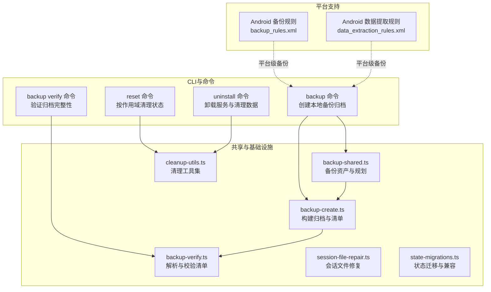
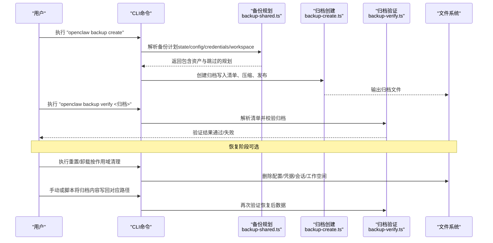
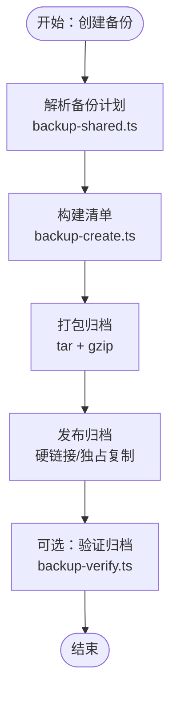
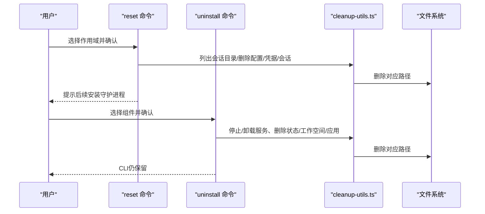
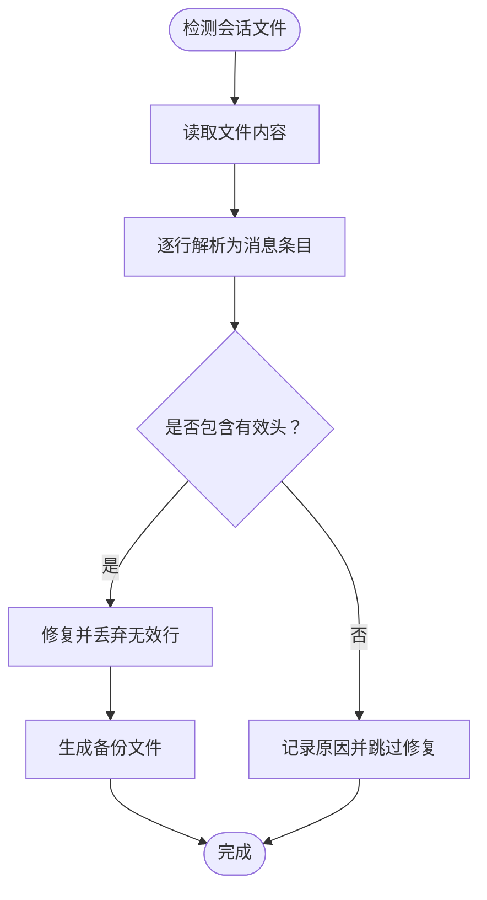
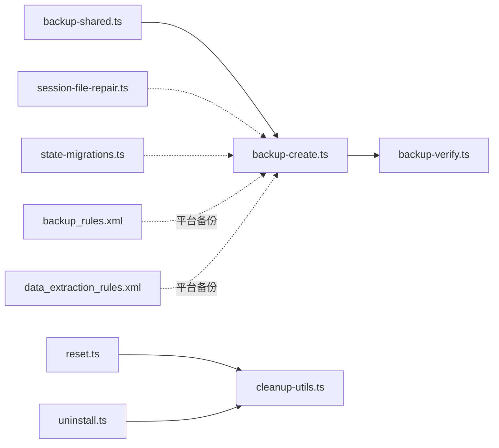

# 恢复流程

<cite>
**本文引用的文件**
- [docs/cli/backup.md](file://docs/cli/backup.md)
- [src/infra/backup-create.ts](file://src/infra/backup-create.ts)
- [src/commands/backup-verify.ts](file://src/commands/backup-verify.ts)
- [src/commands/backup-shared.ts](file://src/commands/backup-shared.ts)
- [src/commands/reset.ts](file://src/commands/reset.ts)
- [src/commands/uninstall.ts](file://src/commands/uninstall.ts)
- [src/commands/cleanup-utils.ts](file://src/commands/cleanup-utils.ts)
- [src/agents/session-file-repair.ts](file://src/agents/session-file-repair.ts)
- [src/infra/state-migrations.ts](file://src/infra/state-migrations.ts)
- [apps/android/app/src/main/res/xml/backup_rules.xml](file://apps/android/app/src/main/res/xml/backup_rules.xml)
- [apps/android/app/src/main/res/xml/data_extraction_rules.xml](file://apps/android/app/src/main/res/xml/data_extraction_rules.xml)
</cite>

## 目录
1. [简介](#简介)
2. [项目结构](#项目结构)
3. [核心组件](#核心组件)
4. [架构总览](#架构总览)
5. [详细组件分析](#详细组件分析)
6. [依赖关系分析](#依赖关系分析)
7. [性能考量](#性能考量)
8. [故障排除指南](#故障排除指南)
9. [结论](#结论)
10. [附录](#附录)

## 简介
本指南面向OpenClaw用户与运维人员，提供从备份文件到数据恢复的完整操作手册。内容覆盖恢复前准备、数据验证、恢复执行、验证确认等关键步骤，并针对配置文件、会话数据、工作空间、日志文件等不同类型的恢复给出具体方法。同时，提供灾难恢复计划（部分数据恢复、完整系统恢复、跨平台数据迁移）与一致性保障、冲突处理、权限恢复等技术要点；并包含恢复失败的故障排除、回滚机制与恢复验证的质量保证措施，以及最佳实践与常见错误规避建议。

## 项目结构
OpenClaw在CLI层提供“备份”“验证”“重置”“卸载”等命令，底层通过共享的备份规划与归档逻辑实现一致的数据打包与校验能力。Android应用侧提供系统级全量备份规则，便于设备间或系统重装后的数据恢复。

图表来源
- [src/commands/backup-shared.ts:1-58](file://src/commands/backup-shared.ts#L1-L58)
- [src/infra/backup-create.ts:1-369](file://src/infra/backup-create.ts#L1-L369)
- [src/commands/backup-verify.ts:1-325](file://src/commands/backup-verify.ts#L1-L325)
- [src/commands/reset.ts:1-152](file://src/commands/reset.ts#L1-L152)
- [src/commands/uninstall.ts:1-200](file://src/commands/uninstall.ts#L1-L200)
- [src/commands/cleanup-utils.ts:130-153](file://src/commands/cleanup-utils.ts#L130-L153)
- [src/agents/session-file-repair.ts:1-43](file://src/agents/session-file-repair.ts#L1-L43)
- [src/infra/state-migrations.ts:802-846](file://src/infra/state-migrations.ts#L802-L846)
- [apps/android/app/src/main/res/xml/backup_rules.xml:1-4](file://apps/android/app/src/main/res/xml/backup_rules.xml#L1-L4)
- [apps/android/app/src/main/res/xml/data_extraction_rules.xml:1-9](file://apps/android/app/src/main/res/xml/data_extraction_rules.xml#L1-L9)

章节来源
- [docs/cli/backup.md:1-77](file://docs/cli/backup.md#L1-L77)
- [src/commands/backup-shared.ts:1-58](file://src/commands/backup-shared.ts#L1-L58)
- [src/infra/backup-create.ts:1-369](file://src/infra/backup-create.ts#L1-L369)
- [src/commands/backup-verify.ts:1-325](file://src/commands/backup-verify.ts#L1-L325)
- [src/commands/reset.ts:1-152](file://src/commands/reset.ts#L1-L152)
- [src/commands/uninstall.ts:1-200](file://src/commands/uninstall.ts#L1-L200)
- [src/commands/cleanup-utils.ts:130-153](file://src/commands/cleanup-utils.ts#L130-L153)
- [src/agents/session-file-repair.ts:1-43](file://src/agents/session-file-repair.ts#L1-L43)
- [src/infra/state-migrations.ts:802-846](file://src/infra/state-migrations.ts#L802-L846)
- [apps/android/app/src/main/res/xml/backup_rules.xml:1-4](file://apps/android/app/src/main/res/xml/backup_rules.xml#L1-L4)
- [apps/android/app/src/main/res/xml/data_extraction_rules.xml:1-9](file://apps/android/app/src/main/res/xml/data_extraction_rules.xml#L1-L9)

## 核心组件
- 备份规划与资产定义：定义备份类型（state/config/credentials/workspace）、跳过原因（被覆盖/缺失），并生成包含路径与归档布局的清单。
- 归档创建：根据规划生成带清单的压缩归档，支持输出位置、硬链接发布、临时归档与最终发布。
- 归档验证：解析清单、校验条目路径合法性、重复项、清单与归档一致性、资产存在性。
- 清理与重置：按作用域删除配置、凭据、会话、工作空间等，支持交互与非交互模式。
- 会话修复：对损坏的会话文件进行修复与行丢弃处理，必要时生成备份。
- 状态迁移：兼容旧版本状态目录与文件，迁移后保留遗留目录以便回退。
- 平台备份规则：Android提供全量备份与数据提取规则，便于系统级恢复。

章节来源
- [src/commands/backup-shared.ts:1-58](file://src/commands/backup-shared.ts#L1-L58)
- [src/infra/backup-create.ts:1-369](file://src/infra/backup-create.ts#L1-L369)
- [src/commands/backup-verify.ts:1-325](file://src/commands/backup-verify.ts#L1-L325)
- [src/commands/reset.ts:1-152](file://src/commands/reset.ts#L1-L152)
- [src/commands/uninstall.ts:1-200](file://src/commands/uninstall.ts#L1-L200)
- [src/commands/cleanup-utils.ts:130-153](file://src/commands/cleanup-utils.ts#L130-L153)
- [src/agents/session-file-repair.ts:1-43](file://src/agents/session-file-repair.ts#L1-L43)
- [src/infra/state-migrations.ts:802-846](file://src/infra/state-migrations.ts#L802-L846)
- [apps/android/app/src/main/res/xml/backup_rules.xml:1-4](file://apps/android/app/src/main/res/xml/backup_rules.xml#L1-L4)
- [apps/android/app/src/main/res/xml/data_extraction_rules.xml:1-9](file://apps/android/app/src/main/res/xml/data_extraction_rules.xml#L1-L9)

## 架构总览
下图展示从备份到恢复的关键流程：CLI命令调用共享规划与归档逻辑，生成包含清单的归档；恢复时先验证归档，再按需解包并写入目标路径，最后进行一致性检查与修复。

图表来源
- [src/commands/backup-shared.ts:1-58](file://src/commands/backup-shared.ts#L1-L58)
- [src/infra/backup-create.ts:272-369](file://src/infra/backup-create.ts#L272-L369)
- [src/commands/backup-verify.ts:279-325](file://src/commands/backup-verify.ts#L279-L325)
- [src/commands/reset.ts:51-152](file://src/commands/reset.ts#L51-L152)
- [src/commands/uninstall.ts:100-200](file://src/commands/uninstall.ts#L100-L200)

## 详细组件分析

### 备份与验证组件
- 备份规划与资产
  - 定义备份类型与优先级，识别被覆盖与缺失路径，生成包含源路径、显示路径与归档路径的资产列表。
- 归档创建
  - 生成时间戳命名的归档根，构建清单，写入临时目录后以硬链接或独占复制发布，确保不覆盖已有文件。
  - 支持仅配置备份与禁用工作空间备份，便于快速小体积归档。
- 归档验证
  - 解析清单，校验路径规范化、无重复条目、清单与归档一致性、资产存在性与归档根约束。

图表来源
- [src/commands/backup-shared.ts:1-58](file://src/commands/backup-shared.ts#L1-L58)
- [src/infra/backup-create.ts:190-231](file://src/infra/backup-create.ts#L190-L231)
- [src/infra/backup-create.ts:345-361](file://src/infra/backup-create.ts#L345-L361)
- [src/commands/backup-verify.ts:223-253](file://src/commands/backup-verify.ts#L223-L253)

章节来源
- [docs/cli/backup.md:1-77](file://docs/cli/backup.md#L1-L77)
- [src/commands/backup-shared.ts:1-58](file://src/commands/backup-shared.ts#L1-L58)
- [src/infra/backup-create.ts:1-369](file://src/infra/backup-create.ts#L1-L369)
- [src/commands/backup-verify.ts:1-325](file://src/commands/backup-verify.ts#L1-L325)

### 重置与卸载组件
- 重置命令
  - 支持三种作用域：仅配置、配置+凭据+会话、完整（含状态目录与工作空间）。
  - 在非配置作用域下推荐先创建备份；交互与非交互模式均受控。
- 卸载命令
  - 可选择卸载服务、清理状态与配置、清理工作空间、移除macOS应用。
  - 同样在涉及状态或工作空间时建议先创建备份。

图表来源
- [src/commands/reset.ts:51-152](file://src/commands/reset.ts#L51-L152)
- [src/commands/uninstall.ts:100-200](file://src/commands/uninstall.ts#L100-L200)
- [src/commands/cleanup-utils.ts:130-153](file://src/commands/cleanup-utils.ts#L130-L153)

章节来源
- [src/commands/reset.ts:1-152](file://src/commands/reset.ts#L1-L152)
- [src/commands/uninstall.ts:1-200](file://src/commands/uninstall.ts#L1-L200)
- [src/commands/cleanup-utils.ts:130-153](file://src/commands/cleanup-utils.ts#L130-L153)

### 会话数据恢复
- 会话文件修复
  - 对损坏的会话文件进行修复，必要时生成备份并记录丢弃行数与原因。
- 状态迁移
  - 兼容旧版会话存储布局，迁移后保留遗留目录以便回退。

图表来源
- [src/agents/session-file-repair.ts:19-43](file://src/agents/session-file-repair.ts#L19-L43)
- [src/infra/state-migrations.ts:802-846](file://src/infra/state-migrations.ts#L802-L846)

章节来源
- [src/agents/session-file-repair.ts:1-43](file://src/agents/session-file-repair.ts#L1-L43)
- [src/infra/state-migrations.ts:802-846](file://src/infra/state-migrations.ts#L802-L846)

### 工作空间恢复
- 建议将工作空间纳入私有Git仓库备份，避免将状态目录纳入版本控制。
- 若未使用Git，建议定期导出工作空间为独立归档，配合OpenClaw备份一并管理。

章节来源
- [src/commands/doctor-state-integrity.ts:809-825](file://src/commands/doctor-state-integrity.ts#L809-L825)

### 日志文件恢复
- 日志文件通常位于状态目录内，随状态备份一并归档；恢复后可通过CLI查看日志以确认服务运行正常。
- 如需跨平台迁移，建议将日志目录作为独立归档进行同步。

章节来源
- [docs/cli/backup.md:34-47](file://docs/cli/backup.md#L34-L47)

### 配置文件恢复
- 仅配置备份模式可绕过配置有效性检查，适合在配置损坏时仍能提取配置文件。
- 恢复后建议运行健康检查命令以验证配置加载与服务可用性。

章节来源
- [docs/cli/backup.md:59-61](file://docs/cli/backup.md#L59-L61)

### 会话数据恢复
- 使用重置命令清理会话后，可将备份中的会话文件手动写回对应路径，或通过验证通过后再进行恢复。
- 若会话文件损坏，先执行修复流程，再进行恢复。

章节来源
- [src/commands/reset.ts:125-139](file://src/commands/reset.ts#L125-L139)
- [src/agents/session-file-repair.ts:19-43](file://src/agents/session-file-repair.ts#L19-L43)

### 工作空间恢复
- 若工作空间未纳入Git，建议将其作为独立归档进行备份与恢复。
- 恢复后检查插件、技能与工具链的可用性，必要时重新初始化。

章节来源
- [src/commands/doctor-state-integrity.ts:809-825](file://src/commands/doctor-state-integrity.ts#L809-L825)

### 日志文件恢复
- 将日志目录作为独立归档进行备份与恢复，确保跨平台迁移时日志一致性。
- 恢复后通过CLI查看日志，确认服务运行状态。

章节来源
- [docs/cli/backup.md:34-47](file://docs/cli/backup.md#L34-L47)

## 依赖关系分析
- 备份相关命令依赖共享规划模块与归档创建模块；验证模块独立于创建模块，但共享清单格式。
- 重置与卸载命令依赖清理工具集，按作用域删除对应路径。
- 会话修复与状态迁移分别处理会话文件与历史状态布局，互不依赖。
- Android平台规则与OpenClaw备份相互独立，可并行使用。

图表来源
- [src/commands/backup-shared.ts:1-58](file://src/commands/backup-shared.ts#L1-L58)
- [src/infra/backup-create.ts:1-369](file://src/infra/backup-create.ts#L1-L369)
- [src/commands/backup-verify.ts:1-325](file://src/commands/backup-verify.ts#L1-L325)
- [src/commands/reset.ts:1-152](file://src/commands/reset.ts#L1-L152)
- [src/commands/uninstall.ts:1-200](file://src/commands/uninstall.ts#L1-L200)
- [src/commands/cleanup-utils.ts:130-153](file://src/commands/cleanup-utils.ts#L130-L153)
- [src/agents/session-file-repair.ts:1-43](file://src/agents/session-file-repair.ts#L1-L43)
- [src/infra/state-migrations.ts:802-846](file://src/infra/state-migrations.ts#L802-L846)
- [apps/android/app/src/main/res/xml/backup_rules.xml:1-4](file://apps/android/app/src/main/res/xml/backup_rules.xml#L1-L4)
- [apps/android/app/src/main/res/xml/data_extraction_rules.xml:1-9](file://apps/android/app/src/main/res/xml/data_extraction_rules.xml#L1-L9)

章节来源
- [src/commands/backup-shared.ts:1-58](file://src/commands/backup-shared.ts#L1-L58)
- [src/infra/backup-create.ts:1-369](file://src/infra/backup-create.ts#L1-L369)
- [src/commands/backup-verify.ts:1-325](file://src/commands/backup-verify.ts#L1-L325)
- [src/commands/reset.ts:1-152](file://src/commands/reset.ts#L1-L152)
- [src/commands/uninstall.ts:1-200](file://src/commands/uninstall.ts#L1-L200)
- [src/commands/cleanup-utils.ts:130-153](file://src/commands/cleanup-utils.ts#L130-L153)
- [src/agents/session-file-repair.ts:1-43](file://src/agents/session-file-repair.ts#L1-L43)
- [src/infra/state-migrations.ts:802-846](file://src/infra/state-migrations.ts#L802-L846)
- [apps/android/app/src/main/res/xml/backup_rules.xml:1-4](file://apps/android/app/src/main/res/xml/backup_rules.xml#L1-L4)
- [apps/android/app/src/main/res/xml/data_extraction_rules.xml:1-9](file://apps/android/app/src/main/res/xml/data_extraction_rules.xml#L1-L9)

## 性能考量
- 备份大小主要由工作空间决定；如需更快或更小的归档，可禁用工作空间备份或仅备份配置。
- 验证归档会扫描整个归档，建议在低负载时段执行。
- 发布归档优先尝试硬链接，若目标不支持则回退到独占复制，避免覆盖已有文件。

章节来源
- [docs/cli/backup.md:63-77](file://docs/cli/backup.md#L63-L77)
- [src/infra/backup-create.ts:134-168](file://src/infra/backup-create.ts#L134-L168)

## 故障排除指南
- 备份输出覆盖保护
  - 若输出路径已存在，系统拒绝覆盖；请更换输出路径或删除已有文件。
- 路径包含与自包含
  - 输出路径不得位于任一源路径内部，否则报错；请调整输出目录。
- 归档验证失败
  - 检查清单路径规范化、重复条目、归档根与资产路径约束；修正后重试。
- 重置/卸载前的备份建议
  - 在涉及状态或工作空间的重置/卸载前，务必先创建备份；仅配置重置无需备份。
- 会话文件损坏
  - 使用修复流程生成备份并丢弃无效行；如无法修复，考虑从备份中恢复。
- 状态迁移遗留
  - 迁移后保留遗留目录，如遇问题可回退至遗留目录。

章节来源
- [src/infra/backup-create.ts:113-124](file://src/infra/backup-create.ts#L113-L124)
- [src/infra/backup-create.ts:295-303](file://src/infra/backup-create.ts#L295-L303)
- [src/commands/backup-verify.ts:279-325](file://src/commands/backup-verify.ts#L279-L325)
- [src/commands/reset.ts:47-49](file://src/commands/reset.ts#L47-L49)
- [src/commands/uninstall.ts:96-98](file://src/commands/uninstall.ts#L96-L98)
- [src/agents/session-file-repair.ts:19-43](file://src/agents/session-file-repair.ts#L19-L43)
- [src/infra/state-migrations.ts:833-846](file://src/infra/state-migrations.ts#L833-L846)

## 结论
OpenClaw提供了从备份到恢复的完整工具链：通过CLI命令实现备份与验证，借助清理工具实现可控的重置与卸载，配合会话修复与状态迁移保障数据一致性。遵循本文提供的恢复流程与最佳实践，可在多种灾难场景下安全、可靠地恢复系统与数据。

## 附录

### 恢复流程操作清单
- 恢复前准备
  - 确认备份归档完整且通过验证。
  - 备份当前状态（如需）以防恢复失败。
- 数据验证
  - 使用验证命令检查归档清单与资产一致性。
- 恢复执行
  - 按作用域执行重置或卸载，清理目标路径。
  - 将备份内容写回对应路径，保持目录结构与权限。
- 验证确认
  - 重新运行验证命令确认恢复成功。
  - 检查服务日志与功能可用性。

章节来源
- [docs/cli/backup.md:1-77](file://docs/cli/backup.md#L1-L77)
- [src/commands/backup-verify.ts:279-325](file://src/commands/backup-verify.ts#L279-L325)
- [src/commands/reset.ts:51-152](file://src/commands/reset.ts#L51-L152)
- [src/commands/uninstall.ts:100-200](file://src/commands/uninstall.ts#L100-L200)

### 灾难恢复策略
- 部分数据恢复
  - 仅恢复配置/会话/工作空间中的某一部分，避免影响其他数据。
- 完整系统恢复
  - 清理状态与工作空间后，从备份中恢复全部内容，并进行验证。
- 跨平台数据迁移
  - 将状态目录与工作空间分别归档，结合平台备份规则进行迁移。

章节来源
- [docs/cli/backup.md:34-47](file://docs/cli/backup.md#L34-L47)
- [apps/android/app/src/main/res/xml/backup_rules.xml:1-4](file://apps/android/app/src/main/res/xml/backup_rules.xml#L1-L4)
- [apps/android/app/src/main/res/xml/data_extraction_rules.xml:1-9](file://apps/android/app/src/main/res/xml/data_extraction_rules.xml#L1-L9)

### 数据一致性与权限恢复
- 一致性保障
  - 使用清单与归档校验确保资产完整性；必要时进行会话修复。
- 权限恢复
  - 归档创建与发布过程中避免覆盖已有文件；恢复后检查文件权限与所有权。

章节来源
- [src/commands/backup-verify.ts:223-253](file://src/commands/backup-verify.ts#L223-L253)
- [src/infra/backup-create.ts:134-168](file://src/infra/backup-create.ts#L134-L168)

### 回滚机制与恢复验证
- 回滚机制
  - 状态迁移保留遗留目录，如恢复失败可回退至遗留目录。
- 恢复验证
  - 通过再次验证归档与功能测试确认恢复成功。

章节来源
- [src/infra/state-migrations.ts:833-846](file://src/infra/state-migrations.ts#L833-L846)
- [src/commands/backup-verify.ts:279-325](file://src/commands/backup-verify.ts#L279-L325)

### 最佳实践与常见错误规避
- 最佳实践
  - 定期备份工作空间至私有Git仓库；仅配置备份用于紧急恢复。
  - 在执行重置/卸载前先创建完整备份。
- 常见错误
  - 输出路径覆盖：更换输出目录或删除已有文件。
  - 自包含路径：确保输出不在源路径内部。
  - 验证失败：修正路径规范化与资产路径约束后重试。

章节来源
- [docs/cli/backup.md:23-31](file://docs/cli/backup.md#L23-L31)
- [docs/cli/backup.md:49-61](file://docs/cli/backup.md#L49-L61)
- [src/infra/backup-create.ts:113-124](file://src/infra/backup-create.ts#L113-L124)
- [src/infra/backup-create.ts:295-303](file://src/infra/backup-create.ts#L295-L303)
- [src/commands/backup-verify.ts:279-325](file://src/commands/backup-verify.ts#L279-L325)