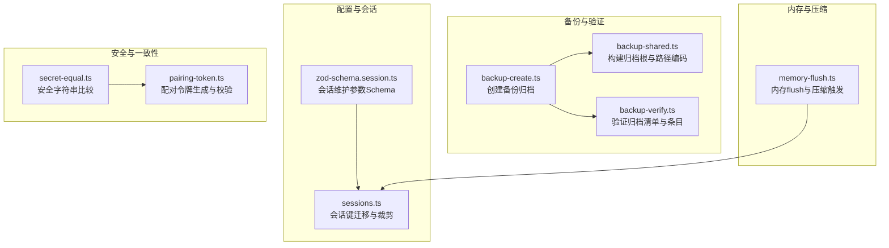
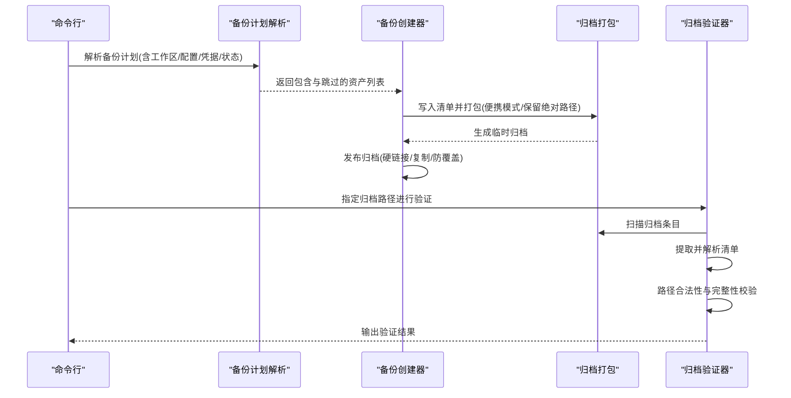
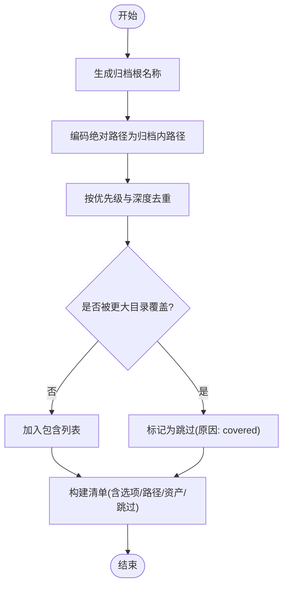
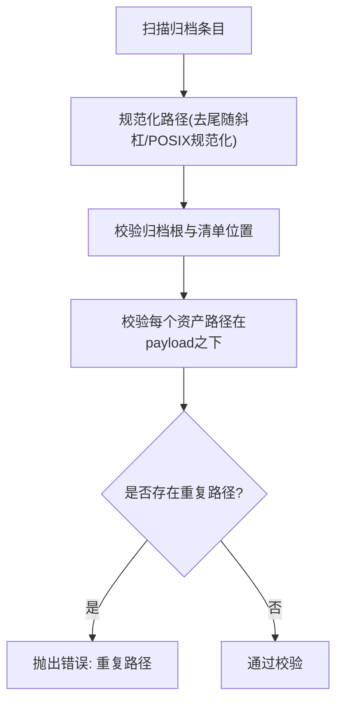
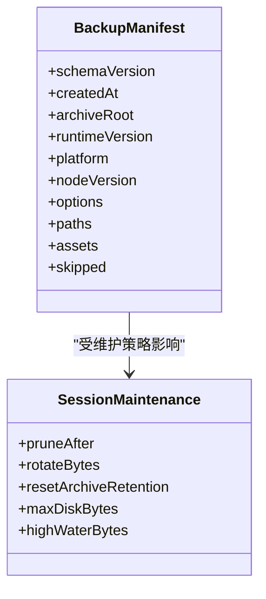
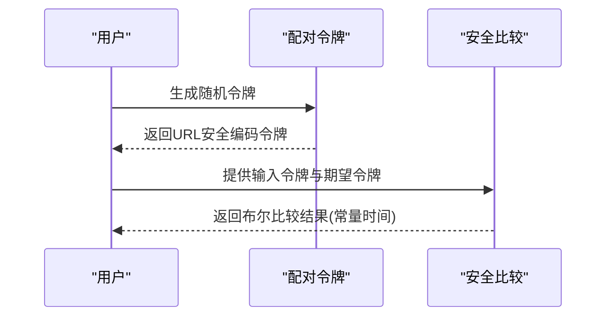
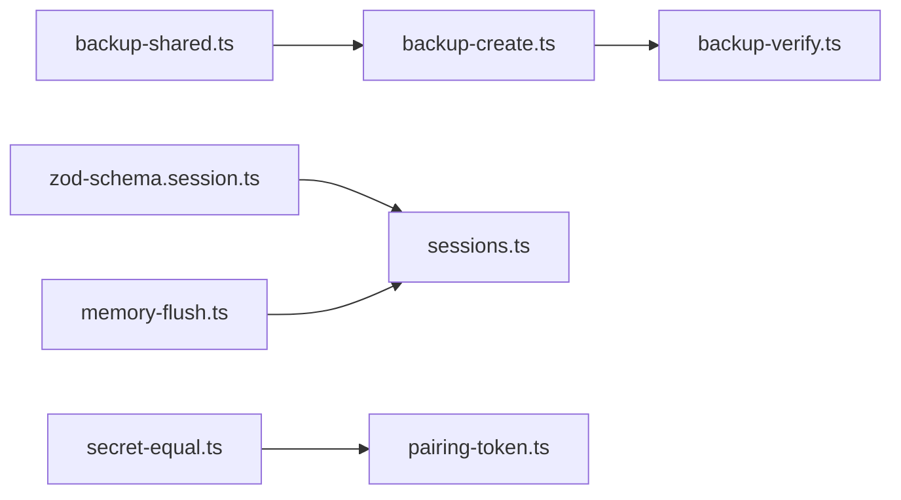

# 数据管理

<cite>
**本文引用的文件**
- [backup-create.ts](file://src/infra/backup-create.ts)
- [backup-verify.ts](file://src/commands/backup-verify.ts)
- [backup-shared.ts](file://src/commands/backup-shared.ts)
- [zod-schema.session.ts](file://src/config/zod-schema.session.ts)
- [sessions.ts](file://src/gateway/server-methods/sessions.ts)
- [memory-flush.ts](file://src/auto-reply/reply/memory-flush.ts)
- [secret-equal.ts](file://src/security/secret-equal.ts)
- [pairing-token.ts](file://src/infra/pairing-token.ts)
</cite>

## 目录
1. [简介](#简介)
2. [项目结构](#项目结构)
3. [核心组件](#核心组件)
4. [架构总览](#架构总览)
5. [详细组件分析](#详细组件分析)
6. [依赖关系分析](#依赖关系分析)
7. [性能考量](#性能考量)
8. [故障排查指南](#故障排查指南)
9. [结论](#结论)
10. [附录](#附录)

## 简介
本文件面向OpenClaw数据管理系统，围绕备份数据的生命周期管理、存储空间优化、版本控制策略、组织结构与命名规范、元数据管理、安全与完整性保障、压缩与介质管理、清理与配额策略、以及与内存管理/会话压缩的协同机制进行系统化说明，并提供运维与高级功能（如数据迁移）的使用建议。

## 项目结构
OpenClaw的数据管理能力主要由以下模块构成：
- 备份与验证：通过归档打包、清单生成与校验，确保备份可恢复与可审计
- 配置与会话维护：通过配置Schema定义会话维护策略（清理、轮转、配额）
- 内存与会话压缩：在会话体量过大时触发内存flush与压缩，降低存储压力
- 安全与一致性：基于安全比较与随机令牌，保障敏感操作与访问控制

**图表来源**
- [backup-create.ts:272-368](file://src/infra/backup-create.ts#L272-L368)
- [backup-verify.ts:279-324](file://src/commands/backup-verify.ts#L279-L324)
- [backup-shared.ts:60-84](file://src/commands/backup-shared.ts#L60-L84)
- [zod-schema.session.ts:72-142](file://src/config/zod-schema.session.ts#L72-L142)
- [sessions.ts:95-118](file://src/gateway/server-methods/sessions.ts#L95-L118)
- [memory-flush.ts:195-228](file://src/auto-reply/reply/memory-flush.ts#L195-L228)
- [secret-equal.ts:3-12](file://src/security/secret-equal.ts#L3-L12)
- [pairing-token.ts:6-12](file://src/infra/pairing-token.ts#L6-L12)

**章节来源**
- [backup-create.ts:1-369](file://src/infra/backup-create.ts#L1-L369)
- [backup-verify.ts:1-325](file://src/commands/backup-verify.ts#L1-L325)
- [backup-shared.ts:1-255](file://src/commands/backup-shared.ts#L1-L255)
- [zod-schema.session.ts:1-215](file://src/config/zod-schema.session.ts#L1-L215)
- [sessions.ts:95-118](file://src/gateway/server-methods/sessions.ts#L95-L118)
- [memory-flush.ts:195-228](file://src/auto-reply/reply/memory-flush.ts#L195-L228)
- [secret-equal.ts:1-12](file://src/security/secret-equal.ts#L1-L12)
- [pairing-token.ts:1-12](file://src/infra/pairing-token.ts#L1-L12)

## 核心组件
- 备份归档创建器：负责解析备份计划、生成清单、打包归档并发布最终产物
- 归档验证器：负责扫描归档条目、提取并解析清单、执行路径合法性与完整性校验
- 备份共享工具：负责归档根命名、路径编码、去重与覆盖策略
- 会话维护配置：定义清理、轮转、配额与保留策略
- 内存flush与压缩：在会话体量超过阈值时触发，避免内存与磁盘压力
- 安全与一致性：提供安全比较与随机令牌，用于敏感操作与访问控制

**章节来源**
- [backup-create.ts:272-368](file://src/infra/backup-create.ts#L272-L368)
- [backup-verify.ts:279-324](file://src/commands/backup-verify.ts#L279-L324)
- [backup-shared.ts:60-84](file://src/commands/backup-shared.ts#L60-L84)
- [zod-schema.session.ts:72-142](file://src/config/zod-schema.session.ts#L72-L142)
- [memory-flush.ts:195-228](file://src/auto-reply/reply/memory-flush.ts#L195-L228)
- [secret-equal.ts:3-12](file://src/security/secret-equal.ts#L3-L12)
- [pairing-token.ts:6-12](file://src/infra/pairing-token.ts#L6-L12)

## 架构总览
备份流程从“解析备份计划”开始，生成“清单”并写入临时归档，随后“发布到目标路径”。验证流程则反向执行，先扫描条目，再提取并解析清单，最后进行路径与完整性校验。

**图表来源**
- [backup-create.ts:272-368](file://src/infra/backup-create.ts#L272-L368)
- [backup-verify.ts:173-324](file://src/commands/backup-verify.ts#L173-L324)
- [backup-shared.ts:106-254](file://src/commands/backup-shared.ts#L106-L254)

## 详细组件分析

### 备份生命周期与组织结构
- 归档根命名：采用时间戳前缀加固定后缀，保证唯一性与可读性
- 路径编码：将绝对路径统一编码为相对归档内的标准化路径，支持Windows驱动器与POSIX路径
- 资产去重与覆盖：按优先级与深度排序，去除被更大目录覆盖的资产，避免重复打包
- 清单结构：包含schema版本、创建时间、归档根、运行时信息、选项、路径映射、资产清单与跳过原因

**图表来源**
- [backup-shared.ts:60-84](file://src/commands/backup-shared.ts#L60-L84)
- [backup-shared.ts:106-254](file://src/commands/backup-shared.ts#L106-L254)
- [backup-create.ts:190-231](file://src/infra/backup-create.ts#L190-L231)

**章节来源**
- [backup-shared.ts:60-84](file://src/commands/backup-shared.ts#L60-L84)
- [backup-shared.ts:106-254](file://src/commands/backup-shared.ts#L106-L254)
- [backup-create.ts:190-231](file://src/infra/backup-create.ts#L190-L231)

### 备份清单与完整性校验
- 清单解析：严格校验schema版本、字段存在性与类型；对assets逐项校验
- 条目扫描：仅允许相对路径、禁止路径穿越、禁止Windows绝对路径混用
- 校验规则：清单必须位于归档根下；所有资产路径必须位于payload之下；不得出现重复归档路径
- 结果输出：以人类可读或JSON格式输出验证摘要

**图表来源**
- [backup-verify.ts:173-324](file://src/commands/backup-verify.ts#L173-L324)

**章节来源**
- [backup-verify.ts:97-171](file://src/commands/backup-verify.ts#L97-L171)
- [backup-verify.ts:223-253](file://src/commands/backup-verify.ts#L223-L253)
- [backup-verify.ts:279-324](file://src/commands/backup-verify.ts#L279-L324)

### 存储空间优化与版本控制策略
- 版本控制：清单包含schemaVersion、runtimeVersion、platform、nodeVersion，便于跨版本兼容与回滚
- 压缩策略：使用gzip归档，便携模式与保留绝对路径，兼顾跨平台可移植性与路径语义
- 轮转与配额：通过会话维护配置中的rotateBytes、maxDiskBytes、highWaterBytes实现磁盘占用控制
- 清理策略：pruneAfter定义过期数据清理周期，resetArchiveRetention控制归档重置保留期

**图表来源**
- [backup-create.ts:190-231](file://src/infra/backup-create.ts#L190-L231)
- [zod-schema.session.ts:72-142](file://src/config/zod-schema.session.ts#L72-L142)

**章节来源**
- [backup-create.ts:190-231](file://src/infra/backup-create.ts#L190-L231)
- [zod-schema.session.ts:72-142](file://src/config/zod-schema.session.ts#L72-L142)

### 元数据管理与命名规范
- 归档根命名：时间戳前缀-固定后缀，确保全局唯一
- 资产路径编码：统一为相对路径，Windows绝对路径映射至windows/drive，POSIX绝对路径映射至posix/...
- 清单字段：包含运行时信息、平台信息、选项、路径映射、资产清单与跳过明细
- 命名规范：归档根必须为单一路径段且相对；资产路径必须位于payload之下

**章节来源**
- [backup-shared.ts:60-84](file://src/commands/backup-shared.ts#L60-L84)
- [backup-verify.ts:84-90](file://src/commands/backup-verify.ts#L84-L90)
- [backup-verify.ts:223-253](file://src/commands/backup-verify.ts#L223-L253)

### 安全与完整性保障
- 访问控制：配对令牌采用随机URL安全编码，提供安全比较函数，防止时序攻击
- 完整性校验：归档验证严格限制路径遍历、重复路径与非法根路径，确保不可篡改
- 敏感操作：安全比较函数用于令牌与密钥比对，避免侧信道泄露

**图表来源**
- [pairing-token.ts:6-12](file://src/infra/pairing-token.ts#L6-L12)
- [secret-equal.ts:3-12](file://src/security/secret-equal.ts#L3-L12)

**章节来源**
- [pairing-token.ts:1-12](file://src/infra/pairing-token.ts#L1-L12)
- [secret-equal.ts:1-12](file://src/security/secret-equal.ts#L1-L12)
- [backup-verify.ts:62-82](file://src/commands/backup-verify.ts#L62-L82)

### 性能优化与介质管理
- 压缩：gzip归档，平衡压缩比与CPU开销
- 便携性：便携模式与保留绝对路径，提升跨平台可移植性
- 发布策略：优先硬链接，不支持硬链接时采用排他复制，避免覆盖已有文件
- 临时归档：使用随机UUID后缀的临时文件，完成后原子替换

**章节来源**
- [backup-create.ts:345-361](file://src/infra/backup-create.ts#L345-L361)
- [backup-create.ts:126-168](file://src/infra/backup-create.ts#L126-L168)

### 运维管理：清理策略、过期数据与配额
- 清理策略：pruneAfter定义过期清理周期，resetArchiveRetention控制归档重置保留期
- 轮转与配额：rotateBytes、maxDiskBytes、highWaterBytes用于磁盘占用上限与水位线控制
- 会话键迁移与裁剪：在会话存储中进行键迁移与历史裁剪，减少冗余

**章节来源**
- [zod-schema.session.ts:72-142](file://src/config/zod-schema.session.ts#L72-L142)
- [sessions.ts:95-118](file://src/gateway/server-methods/sessions.ts#L95-L118)

### 与内存管理、会话压缩的协同
- 触发条件：当会话总token数超过上下文窗口预留阈值时，触发内存flush与压缩
- 防重复：同一压缩周期内避免重复flush，确保稳定性
- 协同机制：内存flush与会话维护策略共同作用，降低存储与计算压力

**章节来源**
- [memory-flush.ts:195-228](file://src/auto-reply/reply/memory-flush.ts#L195-L228)

## 依赖关系分析
- 备份创建依赖备份共享工具提供的路径编码与归档根命名
- 归档验证依赖tar库扫描条目并解析清单
- 会话维护配置影响备份计划与归档内容范围
- 安全模块为令牌与密钥比较提供基础能力

**图表来源**
- [backup-create.ts:1-26](file://src/infra/backup-create.ts#L1-L26)
- [backup-verify.ts:1-6](file://src/commands/backup-verify.ts#L1-L6)
- [backup-shared.ts:1-12](file://src/commands/backup-shared.ts#L1-L12)
- [zod-schema.session.ts:1-14](file://src/config/zod-schema.session.ts#L1-L14)
- [sessions.ts:95-118](file://src/gateway/server-methods/sessions.ts#L95-L118)
- [memory-flush.ts:195-228](file://src/auto-reply/reply/memory-flush.ts#L195-L228)
- [secret-equal.ts:1-12](file://src/security/secret-equal.ts#L1-L12)
- [pairing-token.ts:1-12](file://src/infra/pairing-token.ts#L1-L12)

**章节来源**
- [backup-create.ts:1-26](file://src/infra/backup-create.ts#L1-L26)
- [backup-verify.ts:1-6](file://src/commands/backup-verify.ts#L1-L6)
- [backup-shared.ts:1-12](file://src/commands/backup-shared.ts#L1-L12)
- [zod-schema.session.ts:1-14](file://src/config/zod-schema.session.ts#L1-L14)
- [sessions.ts:95-118](file://src/gateway/server-methods/sessions.ts#L95-L118)
- [memory-flush.ts:195-228](file://src/auto-reply/reply/memory-flush.ts#L195-L228)
- [secret-equal.ts:1-12](file://src/security/secret-equal.ts#L1-L12)
- [pairing-token.ts:1-12](file://src/infra/pairing-token.ts#L1-L12)

## 性能考量
- 压缩与CPU：gzip压缩在便携模式下进行，适合通用场景；若对CPU敏感，可评估其他压缩算法
- I/O与并发：归档打包采用流式写入，建议在空闲时段执行，避免与高负载任务争抢
- 磁盘占用：结合rotateBytes、maxDiskBytes、highWaterBytes与pruneAfter，动态控制归档体积
- 可移植性：便携模式与保留绝对路径兼顾跨平台可移植性与路径语义

## 故障排查指南
- 归档为空：检查备份计划是否包含有效资产，确认onlyConfig与includeWorkspace选项
- 路径穿越/非法根：确保归档根与资产路径符合相对路径与payload约束
- 重复路径：归档中不得出现重复路径，需检查资产去重逻辑
- 覆盖保护：输出路径不得位于源路径内部，避免覆盖风险
- 令牌比较失败：使用安全比较函数进行令牌比对，避免时序攻击

**章节来源**
- [backup-verify.ts:285-302](file://src/commands/backup-verify.ts#L285-L302)
- [backup-create.ts:295-303](file://src/infra/backup-create.ts#L295-L303)
- [secret-equal.ts:3-12](file://src/security/secret-equal.ts#L3-L12)

## 结论
OpenClaw的数据管理以“可验证、可移植、可维护”为核心设计原则：通过严格的清单与路径校验保障完整性，通过便携模式与gzip压缩平衡性能与兼容，通过会话维护策略与内存flush机制控制存储压力，并以安全比较与随机令牌强化访问控制。上述机制协同工作，形成完整的备份生命周期管理体系。

## 附录
- 使用建议
  - 定期执行备份并验证，确保可恢复性
  - 合理设置pruneAfter、rotateBytes、maxDiskBytes与highWaterBytes，避免磁盘压力
  - 在跨平台部署时优先使用默认便携模式，确保路径一致性
  - 对敏感操作启用安全比较与随机令牌，降低安全风险