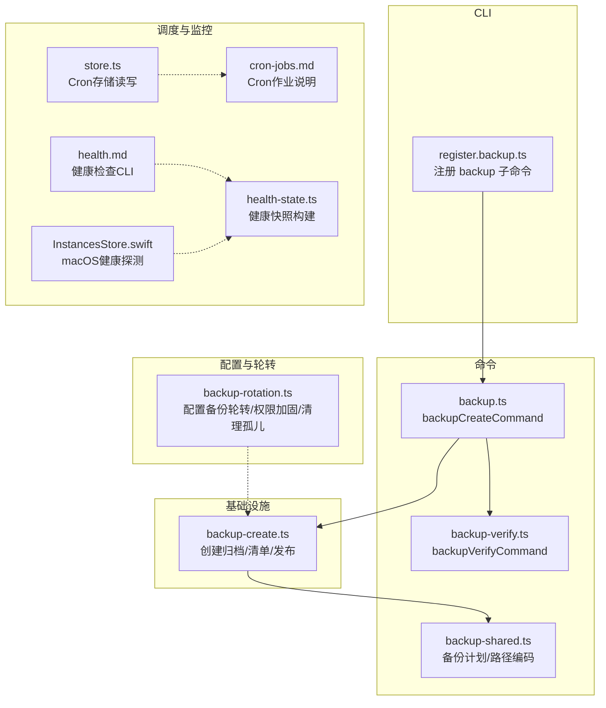
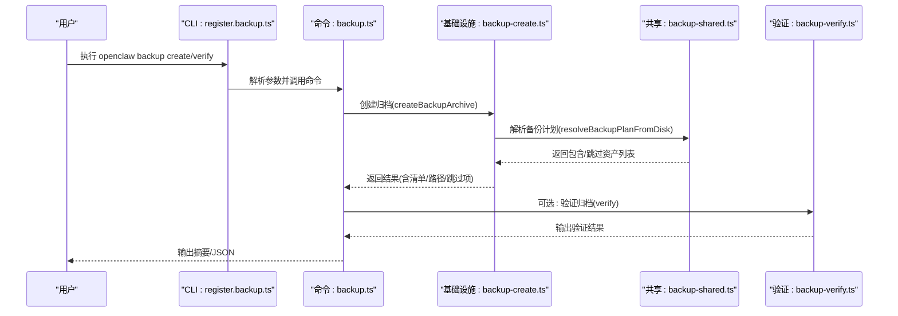
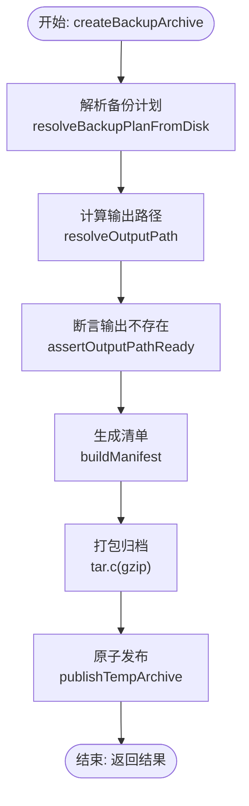
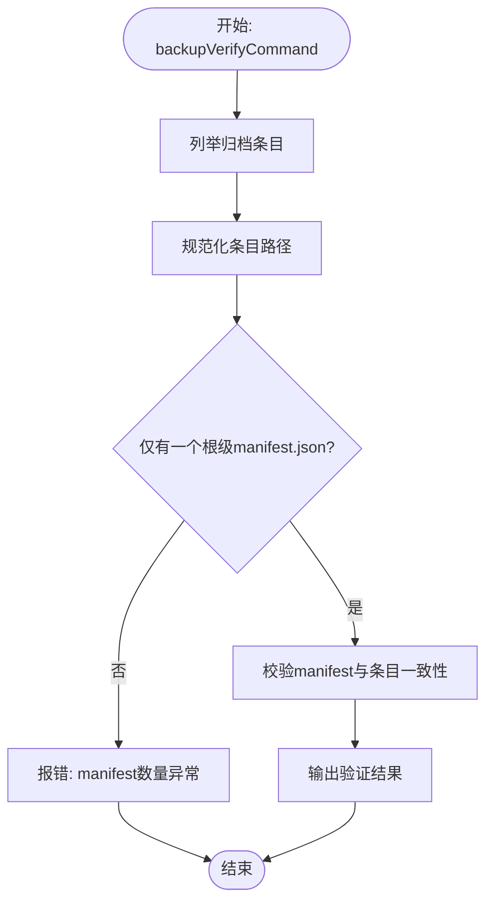
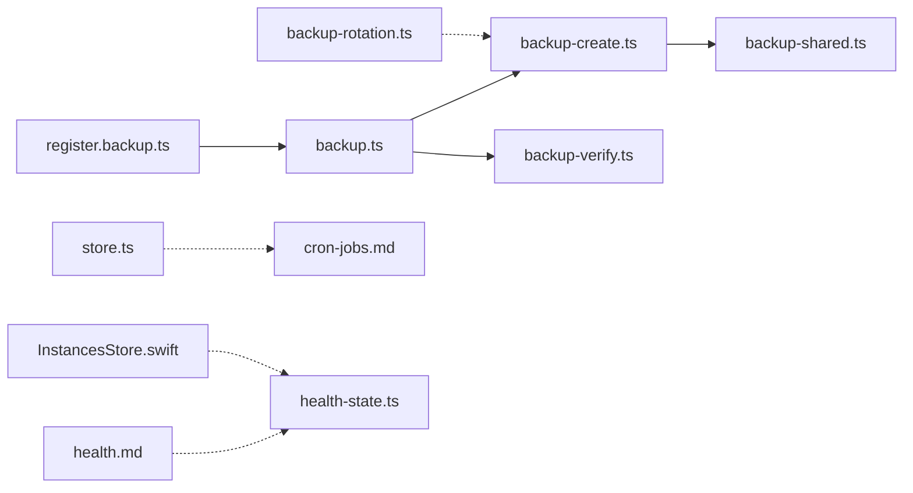

# 自动化备份

<cite>
**本文引用的文件**
- [backup.md](file://docs/cli/backup.md)
- [backup.ts](file://src/commands/backup.ts)
- [backup-verify.ts](file://src/commands/backup-verify.ts)
- [register.backup.ts](file://src/cli/program/register.backup.ts)
- [backup-shared.ts](file://src/commands/backup-shared.ts)
- [backup-create.ts](file://src/infra/backup-create.ts)
- [backup-rotation.ts](file://src/config/backup-rotation.ts)
- [cron-jobs.md](file://docs/automation/cron-jobs.md)
- [store.ts](file://src/cron/store.ts)
- [health.md](file://docs/gateway/health.md)
- [health-state.ts](file://src/gateway/server/health-state.ts)
- [InstancesStore.swift](file://apps/macos/Sources/OpenClaw/InstancesStore.swift)
- [openclaw-auth-monitor.service](file://scripts/systemd/openclaw-auth-monitor.service)
- [openclaw-auth-monitor.timer](file://scripts/systemd/openclaw-auth-monitor.timer)
</cite>

## 目录
1. [简介](#简介)
2. [项目结构](#项目结构)
3. [核心组件](#核心组件)
4. [架构总览](#架构总览)
5. [详细组件分析](#详细组件分析)
6. [依赖关系分析](#依赖关系分析)
7. [性能考量](#性能考量)
8. [故障排查指南](#故障排查指南)
9. [结论](#结论)
10. [附录](#附录)

## 简介
本文件面向OpenClaw自动化备份系统，提供从架构设计、触发机制、调度策略到CLI使用、运维监控、可靠性保障与高级扩展的完整技术文档。读者将理解备份子系统的数据流、验证机制、输出发布策略，以及如何在不同部署环境下（Cron、systemd、容器编排）实现定时备份，并结合系统健康检查与通道状态监控进行联动。

## 项目结构
围绕备份功能的关键目录与文件如下：
- CLI层：注册命令、解析参数并调用命令实现
- 命令层：备份创建与验证逻辑
- 基础设施层：归档打包、清单生成、输出发布
- 配置与轮转：配置文件备份轮转与权限加固
- 调度与监控：Cron作业、运行日志、健康检查

图表来源
- [register.backup.ts:1-93](file://src/cli/program/register.backup.ts#L1-L93)
- [backup.ts:1-32](file://src/commands/backup.ts#L1-L32)
- [backup-verify.ts:1-325](file://src/commands/backup-verify.ts#L1-L325)
- [backup-shared.ts:1-255](file://src/commands/backup-shared.ts#L1-L255)
- [backup-create.ts:1-369](file://src/infra/backup-create.ts#L1-L369)
- [backup-rotation.ts:1-126](file://src/config/backup-rotation.ts#L1-L126)
- [cron-jobs.md:1-687](file://docs/automation/cron-jobs.md#L1-L687)
- [store.ts:1-132](file://src/cron/store.ts#L1-L132)
- [health.md:1-36](file://docs/gateway/health.md#L1-L36)
- [health-state.ts:17-64](file://src/gateway/server/health-state.ts#L17-L64)
- [InstancesStore.swift:180-210](file://apps/macos/Sources/OpenClaw/InstancesStore.swift#L180-L210)

章节来源
- [register.backup.ts:1-93](file://src/cli/program/register.backup.ts#L1-L93)
- [backup.ts:1-32](file://src/commands/backup.ts#L1-L32)
- [backup-verify.ts:1-325](file://src/commands/backup-verify.ts#L1-L325)
- [backup-shared.ts:1-255](file://src/commands/backup-shared.ts#L1-L255)
- [backup-create.ts:1-369](file://src/infra/backup-create.ts#L1-L369)
- [backup-rotation.ts:1-126](file://src/config/backup-rotation.ts#L1-L126)
- [cron-jobs.md:1-687](file://docs/automation/cron-jobs.md#L1-L687)
- [store.ts:1-132](file://src/cron/store.ts#L1-L132)
- [health.md:1-36](file://docs/gateway/health.md#L1-L36)
- [health-state.ts:17-64](file://src/gateway/server/health-state.ts#L17-L64)
- [InstancesStore.swift:180-210](file://apps/macos/Sources/OpenClaw/InstancesStore.swift#L180-L210)

## 核心组件
- 备份CLI子命令：提供创建与验证两类子命令，支持输出路径、干跑、验证、仅配置、排除工作区等选项。
- 备份计划与路径编码：从本地状态目录、配置文件、凭据目录与工作区集合中生成不重复、去重的备份源，并编码为归档内路径。
- 归档创建与发布：生成清单manifest.json，按gzip归档，使用硬链接或拷贝原子发布，避免覆盖既有文件。
- 备份验证：校验清单存在性、路径规范化、资产完整性、重复条目、根目录一致性等。
- 配置备份轮转：维护固定数量的配置文件.bak轮转，权限加固，清理孤儿.bak.*文件。
- 调度与监控：Cron作业持久化于~/.openclaw/cron/jobs.json，支持重试策略、运行历史与运行日志修剪；健康检查CLI与网关健康快照用于联动监控。

章节来源
- [backup.md:1-77](file://docs/cli/backup.md#L1-L77)
- [register.backup.ts:1-93](file://src/cli/program/register.backup.ts#L1-L93)
- [backup.ts:1-32](file://src/commands/backup.ts#L1-L32)
- [backup-verify.ts:1-325](file://src/commands/backup-verify.ts#L1-L325)
- [backup-shared.ts:1-255](file://src/commands/backup-shared.ts#L1-L255)
- [backup-create.ts:1-369](file://src/infra/backup-create.ts#L1-L369)
- [backup-rotation.ts:1-126](file://src/config/backup-rotation.ts#L1-L126)
- [cron-jobs.md:1-687](file://docs/automation/cron-jobs.md#L1-L687)
- [store.ts:1-132](file://src/cron/store.ts#L1-L132)
- [health.md:1-36](file://docs/gateway/health.md#L1-L36)
- [health-state.ts:17-64](file://src/gateway/server/health-state.ts#L17-L64)

## 架构总览
下图展示从CLI到命令、再到基础设施与验证的整体流程，以及与Cron调度、健康检查的集成点。

图表来源
- [register.backup.ts:1-93](file://src/cli/program/register.backup.ts#L1-L93)
- [backup.ts:1-32](file://src/commands/backup.ts#L1-L32)
- [backup-create.ts:1-369](file://src/infra/backup-create.ts#L1-L369)
- [backup-shared.ts:1-255](file://src/commands/backup-shared.ts#L1-L255)
- [backup-verify.ts:1-325](file://src/commands/backup-verify.ts#L1-L325)

## 详细组件分析

### 备份CLI子命令与参数
- 子命令：backup create、backup verify
- 关键参数：
  - --output：目标路径或目录
  - --json：以JSON格式输出
  - --dry-run：仅打印计划，不写入
  - --verify：创建后立即验证
  - --only-config：仅备份活动JSON配置文件
  - --no-include-workspace：排除工作区目录
- 示例与行为详见CLI参考文档。

章节来源
- [backup.md:1-77](file://docs/cli/backup.md#L1-L77)
- [register.backup.ts:1-93](file://src/cli/program/register.backup.ts#L1-L93)

### 备份创建流程（命令到基础设施）
- 命令层：backupCreateCommand根据选项决定是否执行验证，并格式化输出。
- 基础设施层：createBackupArchive
  - 解析备份计划（resolveBackupPlanFromDisk）
  - 计算输出路径，确保不在任一源路径内部
  - 写入临时目录manifest.json
  - 使用tar打包gzip归档，onWriteEntry回调重写清单与条目路径
  - 原子发布：优先硬链接，否则拷贝并EXCL模式，失败时清理临时文件
  - 返回结果（包含资产、跳过项、是否验证）

图表来源
- [backup-create.ts:272-369](file://src/infra/backup-create.ts#L272-L369)
- [backup-shared.ts:106-255](file://src/commands/backup-shared.ts#L106-L255)

章节来源
- [backup.ts:1-32](file://src/commands/backup.ts#L1-L32)
- [backup-create.ts:1-369](file://src/infra/backup-create.ts#L1-L369)
- [backup-shared.ts:1-255](file://src/commands/backup-shared.ts#L1-L255)

### 备份验证流程
- 列举归档条目并规范化路径，拒绝空路径、绝对路径、反斜杠、路径穿越与越界
- 查找且仅允许一个根级manifest.json
- 将manifest中的资产路径与归档条目比对，确保每个资产存在且位于payload根之下
- 输出验证摘要或JSON

图表来源
- [backup-verify.ts:279-325](file://src/commands/backup-verify.ts#L279-L325)

章节来源
- [backup-verify.ts:1-325](file://src/commands/backup-verify.ts#L1-L325)

### 备份计划与路径编码
- 从状态目录、配置文件、凭据目录与工作区集合构建候选源
- 去重：基于canonical路径与优先级排序，避免覆盖与重复
- 编码：Windows盘符、POSIX绝对路径、相对路径统一编码到归档payload路径
- 仅配置模式：仅包含有效存在的配置文件

章节来源
- [backup-shared.ts:1-255](file://src/commands/backup-shared.ts#L1-L255)

### 配置备份轮转与权限加固
- 维护固定数量的配置文件.bak轮转，最高编号文件删除，其余依次向高位移动
- 对.bak与.bak.N文件执行chmod 0600，确保权限与主配置一致
- 清理孤儿.bak.*文件（超出轮转范围的命名）

章节来源
- [backup-rotation.ts:1-126](file://src/config/backup-rotation.ts#L1-L126)

### 调度策略与Cron集成
- Cron作业持久化于~/.openclaw/cron/jobs.json，支持一次性(at)、固定间隔(every)、Cron表达式(cron)
- 执行模式：主会话(system event)与隔离会话(agentTurn)，可配置唤醒时机与交付方式
- 重试策略：瞬时错误指数退避，永久错误直接禁用；一次性任务默认最多3次，递归任务每次失败后按退避等待下次计划
- 运行日志修剪：按大小与行数限制run-log文件
- Cron存储安全：写入临时文件+原子替换，失败清理，必要时保留.bak

章节来源
- [cron-jobs.md:1-687](file://docs/automation/cron-jobs.md#L1-L687)
- [store.ts:1-132](file://src/cron/store.ts#L1-L132)

### 运维监控与健康检查联动
- CLI健康检查：openclaw health --json获取网关健康快照；openclaw status提供本地汇总与诊断
- 网关健康快照：包含presence、uptime、会话默认值、认证模式、更新可用性等
- macOS端：InstancesStore.swift定期探测健康并注入实例信息
- 建议：将备份任务与健康检查联动，仅在健康状态满足条件时执行备份，或在备份前后记录健康快照

章节来源
- [health.md:1-36](file://docs/gateway/health.md#L1-L36)
- [health-state.ts:17-64](file://src/gateway/server/health-state.ts#L17-L64)
- [InstancesStore.swift:180-210](file://apps/macos/Sources/OpenClaw/InstancesStore.swift#L180-L210)

## 依赖关系分析
- CLI依赖命令模块；命令模块依赖基础设施与验证模块；基础设施依赖共享计划与工具；配置轮转独立但与配置IO相关；Cron存储与作业文档相互配合；健康检查与网关状态模块提供监控基础。

图表来源
- [register.backup.ts:1-93](file://src/cli/program/register.backup.ts#L1-L93)
- [backup.ts:1-32](file://src/commands/backup.ts#L1-L32)
- [backup-create.ts:1-369](file://src/infra/backup-create.ts#L1-L369)
- [backup-verify.ts:1-325](file://src/commands/backup-verify.ts#L1-L325)
- [backup-shared.ts:1-255](file://src/commands/backup-shared.ts#L1-L255)
- [backup-rotation.ts:1-126](file://src/config/backup-rotation.ts#L1-L126)
- [store.ts:1-132](file://src/cron/store.ts#L1-L132)
- [cron-jobs.md:1-687](file://docs/automation/cron-jobs.md#L1-L687)
- [health.md:1-36](file://docs/gateway/health.md#L1-L36)
- [health-state.ts:17-64](file://src/gateway/server/health-state.ts#L17-L64)
- [InstancesStore.swift:180-210](file://apps/macos/Sources/OpenClaw/InstancesStore.swift#L180-L210)

## 性能考量
- 备份大小与时间主要由工作区规模决定；可通过--no-include-workspace或--only-config降低体积与耗时
- 归档压缩与二次扫描（验证）会增加CPU与I/O开销；建议在低峰时段执行
- 输出发布优先硬链接，不支持时采用拷贝EXCL，避免覆盖；失败时清理临时文件
- Cron高频率场景需关注run-log与会话保留窗口，避免过大IO与清理压力

## 故障排查指南
- 备份为空或缺失：检查归档是否包含且仅包含一个根级manifest.json；确认路径未越界或包含路径穿越
- 输出被拒绝：若输出路径位于任一源路径内部，将被拒绝；请调整--output或移出源树
- 配置无效：当启用工作区备份且配置无效时，命令会快速失败；可改用--no-include-workspace或--only-config
- Cron不执行：检查cron.enabled与环境变量OPENCLAW_SKIP_CRON；确认主机时区与表达式；查看run历史与重试策略
- 健康检查异常：使用openclaw health --json与status --deep定位问题；核对凭据与会话状态

章节来源
- [backup-verify.ts:279-325](file://src/commands/backup-verify.ts#L279-L325)
- [backup-create.ts:113-124](file://src/infra/backup-create.ts#L113-L124)
- [backup-create.ts:287-303](file://src/infra/backup-create.ts#L287-L303)
- [backup-shared.ts:158-163](file://src/commands/backup-shared.ts#L158-L163)
- [cron-jobs.md:660-687](file://docs/automation/cron-jobs.md#L660-L687)
- [health.md:1-36](file://docs/gateway/health.md#L1-L36)

## 结论
OpenClaw自动化备份系统以清晰的CLI入口、严谨的备份计划与路径编码、可靠的归档创建与验证、以及安全的配置轮转为核心，辅以Cron调度与健康检查联动，形成可运维、可监控、可扩展的备份体系。通过合理配置参数与调度策略，可在不同部署环境中稳定地完成本地备份与恢复准备。

## 附录

### CLI使用与参数速查
- 创建备份：支持--output、--json、--dry-run、--verify、--only-config、--no-include-workspace
- 验证备份：openclaw backup verify <archive> [--json]
- 参考：CLI文档与示例

章节来源
- [backup.md:1-77](file://docs/cli/backup.md#L1-L77)
- [register.backup.ts:1-93](file://src/cli/program/register.backup.ts#L1-L93)

### 定时备份任务配置方案
- Cron作业：使用openclaw cron add/add --session isolated等创建定时备份任务，结合delivery模式（announce/webhook/none）投递结果
- systemd：使用提供的服务与定时器单元作为守护进程与周期触发的基础
- 容器编排：在容器内安装并配置Cron或systemd，或通过外部调度器（如Kubernetes CronJob）调用openclaw CLI

章节来源
- [cron-jobs.md:1-687](file://docs/automation/cron-jobs.md#L1-L687)
- [openclaw-auth-monitor.service](file://scripts/systemd/openclaw-auth-monitor.service)
- [openclaw-auth-monitor.timer](file://scripts/systemd/openclaw-auth-monitor.timer)

### 并发控制、资源限制与失败重试
- 并发控制：Cron默认最大并发运行数可配置
- 资源限制：运行日志大小与行数限制，会话保留窗口可调
- 失败重试：一次性任务瞬时错误指数退避最多3次；递归任务每次失败后按退避等待下次计划；永久错误立即禁用

章节来源
- [cron-jobs.md:368-445](file://docs/automation/cron-jobs.md#L368-L445)

### 备份脚本扩展与第三方集成
- 与Cron联动：在Cron作业中直接调用openclaw backup create，或在隔离会话中执行备份任务
- 交付集成：通过delivery.mode=webhook将备份结果POST至外部系统；或使用announce投递到指定通道
- 云存储对接：可将备份产物上传至对象存储（需在Cron作业中添加上传步骤），并结合验证与告警

章节来源
- [cron-jobs.md:211-222](file://docs/automation/cron-jobs.md#L211-L222)

### 与系统组件的集成联动
- 网关健康检查：在备份前后调用openclaw health/status，记录健康快照，仅在健康状态下执行备份
- 通道状态监控：macOS端InstancesStore.swift定期探测健康并注入实例信息，便于UI与后台联动

章节来源
- [health.md:1-36](file://docs/gateway/health.md#L1-L36)
- [health-state.ts:17-64](file://src/gateway/server/health-state.ts#L17-L64)
- [InstancesStore.swift:180-210](file://apps/macos/Sources/OpenClaw/InstancesStore.swift#L180-L210)