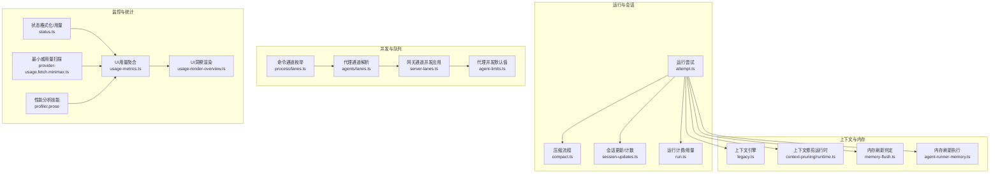
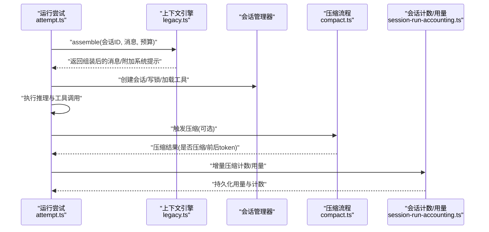
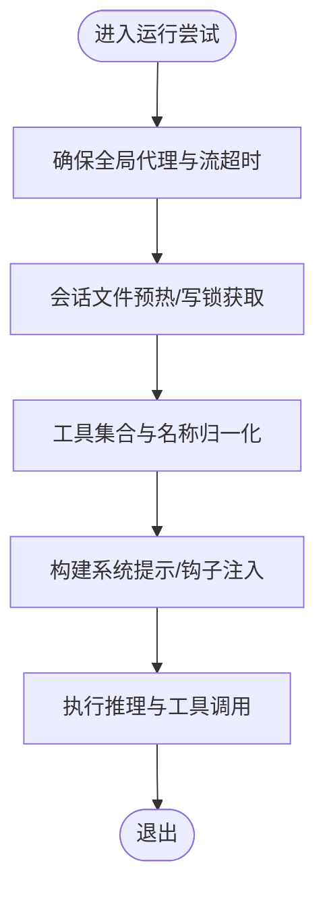
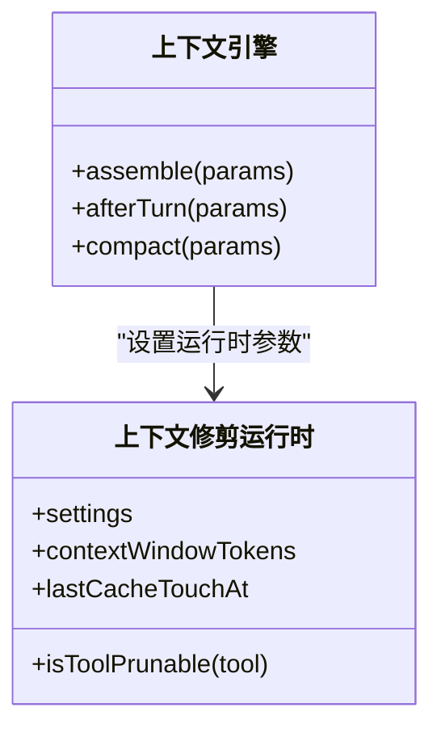
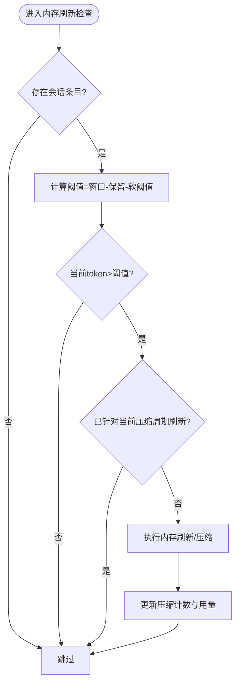
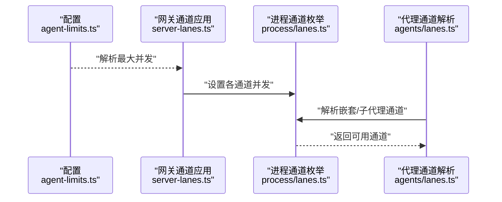
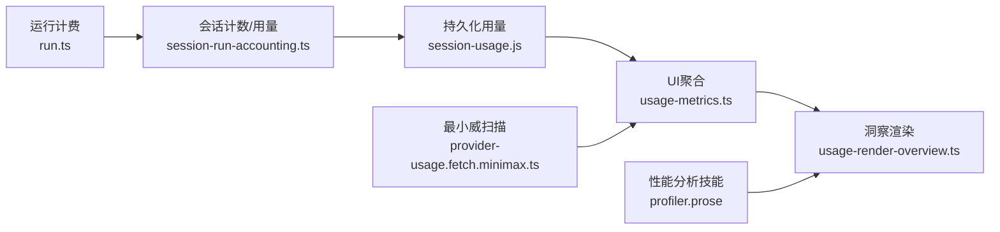
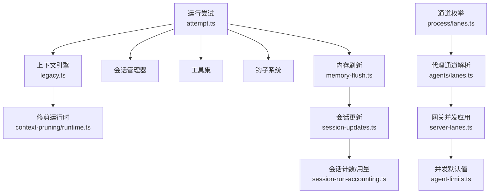

# 代理执行优化

<cite>
**本文引用的文件**
- [src/agents/pi-embedded-runner/run/attempt.ts](file://src/agents/pi-embedded-runner/run/attempt.ts)
- [src/agents/pi-embedded-runner/compact.ts](file://src/agents/pi-embedded-runner/compact.ts)
- [src/agents/pi-embedded-runner/extensions.ts](file://src/agents/pi-embedded-runner/extensions.ts)
- [src/agents/pi-extensions/context-pruning/runtime.ts](file://src/agents/pi-extensions/context-pruning/runtime.ts)
- [src/auto-reply/reply/memory-flush.ts](file://src/auto-reply/reply/memory-flush.ts)
- [src/auto-reply/reply/agent-runner-memory.ts](file://src/auto-reply/reply/agent-runner-memory.ts)
- [src/auto-reply/reply/session-run-accounting.ts](file://src/auto-reply/reply/session-run-accounting.ts)
- [src/auto-reply/reply/session-updates.ts](file://src/auto-reply/reply/session-updates.ts)
- [src/auto-reply/reply/commands-compact.ts](file://src/auto-reply/reply/commands-compact.ts)
- [src/gateway/server-lanes.ts](file://src/gateway/server-lanes.ts)
- [src/agents/lanes.ts](file://src/agents/lanes.ts)
- [src/process/lanes.ts](file://src/process/lanes.ts)
- [src/config/agent-limits.ts](file://src/config/agent-limits.ts)
- [src/agents/pi-embedded-runner/run.ts](file://src/agents/pi-embedded-runner/run.ts)
- [src/auto-reply/status.ts](file://src/auto-reply/status.ts)
- [ui/src/ui/views/usage-metrics.ts](file://ui/src/ui/views/usage-metrics.ts)
- [ui/src/ui/views/usage-render-overview.ts](file://ui/src/ui/views/usage-render-overview.ts)
- [extensions/open-prose/skills/prose/lib/profiler.prose](file://extensions/open-prose/skills/prose/lib/profiler.prose)
- [src/context-engine/legacy.ts](file://src/context-engine/legacy.ts)
- [src/infra/provider-usage.fetch.minimax.ts](file://src/infra/provider-usage.fetch.minimax.ts)
</cite>

## 目录
1. [引言](#引言)
2. [项目结构](#项目结构)
3. [核心组件](#核心组件)
4. [架构总览](#架构总览)
5. [详细组件分析](#详细组件分析)
6. [依赖关系分析](#依赖关系分析)
7. [性能考量](#性能考量)
8. [故障排查指南](#故障排查指南)
9. [结论](#结论)
10. [附录](#附录)

## 引言
本技术指南聚焦于 OpenClaw 代理执行性能优化，围绕代理执行器的关键优化领域展开，包括会话管理优化、工具调用性能提升、上下文窗口管理、内存压缩技术、代理循环优化、并发执行控制与资源分配策略，并提供可落地的配置与实施建议。文档同时覆盖性能监控、执行统计分析与资源使用优化的工具与方法，帮助读者通过配置调整与算法优化显著提升代理整体执行性能。

## 项目结构
OpenClaw 的代理执行路径主要由“嵌入式 Pi 代理运行器”驱动，配合“自动回复与会话管理”模块、上下文引擎与扩展系统，以及网关与并发控制层共同组成。关键路径如下：
- 运行入口与尝试流程：嵌入式运行尝试构建提示、加载工具、创建会话并执行推理与工具调用。
- 会话与上下文管理：会话文件预热、写锁、历史修剪、上下文引擎集成与压缩。
- 并发与队列：命令通道（主/子代理/嵌套/定时）并发度控制与调度。
- 性能监控与统计：令牌用量、缓存命中、延迟聚合与可视化。

图表来源
- [src/agents/pi-embedded-runner/run/attempt.ts:749-1200](file://src/agents/pi-embedded-runner/run/attempt.ts#L749-L1200)
- [src/agents/pi-embedded-runner/compact.ts:263-800](file://src/agents/pi-embedded-runner/compact.ts#L263-L800)
- [src/auto-reply/reply/session-updates.ts:241-294](file://src/auto-reply/reply/session-updates.ts#L241-L294)
- [src/agents/pi-embedded-runner/run.ts:157-177](file://src/agents/pi-embedded-runner/run.ts#L157-L177)
- [src/context-engine/legacy.ts:36-75](file://src/context-engine/legacy.ts#L36-L75)
- [src/agents/pi-extensions/context-pruning/runtime.ts:1-17](file://src/agents/pi-extensions/context-pruning/runtime.ts#L1-L17)
- [src/auto-reply/reply/memory-flush.ts:170-228](file://src/auto-reply/reply/memory-flush.ts#L170-L228)
- [src/auto-reply/reply/agent-runner-memory.ts:286-453](file://src/auto-reply/reply/agent-runner-memory.ts#L286-L453)
- [src/process/lanes.ts:1-7](file://src/process/lanes.ts#L1-L7)
- [src/agents/lanes.ts:1-14](file://src/agents/lanes.ts#L1-L14)
- [src/gateway/server-lanes.ts:1-10](file://src/gateway/server-lanes.ts#L1-L10)
- [src/config/agent-limits.ts:1-23](file://src/config/agent-limits.ts#L1-L23)
- [src/auto-reply/status.ts:306-343](file://src/auto-reply/status.ts#L306-L343)
- [ui/src/ui/views/usage-metrics.ts:407-431](file://ui/src/ui/views/usage-metrics.ts#L407-L431)
- [ui/src/ui/views/usage-render-overview.ts:338-378](file://ui/src/ui/views/usage-render-overview.ts#L338-L378)
- [src/infra/provider-usage.fetch.minimax.ts:192-227](file://src/infra/provider-usage.fetch.minimax.ts#L192-L227)
- [extensions/open-prose/skills/prose/lib/profiler.prose:109-357](file://extensions/open-prose/skills/prose/lib/profiler.prose#L109-L357)

章节来源
- [src/agents/pi-embedded-runner/run/attempt.ts:749-1200](file://src/agents/pi-embedded-runner/run/attempt.ts#L749-L1200)
- [src/agents/pi-embedded-runner/compact.ts:263-800](file://src/agents/pi-embedded-runner/compact.ts#L263-L800)
- [src/auto-reply/reply/session-updates.ts:241-294](file://src/auto-reply/reply/session-updates.ts#L241-L294)
- [src/auto-reply/reply/memory-flush.ts:170-228](file://src/auto-reply/reply/memory-flush.ts#L170-L228)
- [src/auto-reply/reply/agent-runner-memory.ts:286-453](file://src/auto-reply/reply/agent-runner-memory.ts#L286-L453)
- [src/process/lanes.ts:1-7](file://src/process/lanes.ts#L1-L7)
- [src/agents/lanes.ts:1-14](file://src/agents/lanes.ts#L1-L14)
- [src/gateway/server-lanes.ts:1-10](file://src/gateway/server-lanes.ts#L1-L10)
- [src/config/agent-limits.ts:1-23](file://src/config/agent-limits.ts#L1-L23)
- [src/auto-reply/status.ts:306-343](file://src/auto-reply/status.ts#L306-L343)
- [ui/src/ui/views/usage-metrics.ts:407-431](file://ui/src/ui/views/usage-metrics.ts#L407-L431)
- [ui/src/ui/views/usage-render-overview.ts:338-378](file://ui/src/ui/views/usage-render-overview.ts#L338-L378)
- [src/infra/provider-usage.fetch.minimax.ts:192-227](file://src/infra/provider-usage.fetch.minimax.ts#L192-L227)
- [extensions/open-prose/skills/prose/lib/profiler.prose:109-357](file://extensions/open-prose/skills/prose/lib/profiler.prose#L109-L357)

## 核心组件
- 运行尝试与会话生命周期：负责构建系统提示、加载工具、创建会话、处理流式输出与工具调用、写锁与会话文件维护。
- 上下文引擎与修剪：支持在运行前/后对消息进行组装、修剪与压缩，结合缓存 TTL 策略降低上下文膨胀。
- 内存刷新与压缩：基于阈值触发的内存刷新与压缩，避免超大上下文导致的性能退化。
- 并发与通道：命令通道（Main/Subagent/Nested/Cron）并发度控制，网关层统一应用并发配置。
- 性能监控与统计：令牌用量、缓存读写、延迟聚合与 UI 展示，支持按提供商/代理/频道聚合分析。

章节来源
- [src/agents/pi-embedded-runner/run/attempt.ts:749-1200](file://src/agents/pi-embedded-runner/run/attempt.ts#L749-L1200)
- [src/agents/pi-embedded-runner/extensions.ts:30-62](file://src/agents/pi-embedded-runner/extensions.ts#L30-L62)
- [src/agents/pi-extensions/context-pruning/runtime.ts:1-17](file://src/agents/pi-extensions/context-pruning/runtime.ts#L1-L17)
- [src/auto-reply/reply/memory-flush.ts:170-228](file://src/auto-reply/reply/memory-flush.ts#L170-L228)
- [src/auto-reply/reply/agent-runner-memory.ts:286-453](file://src/auto-reply/reply/agent-runner-memory.ts#L286-L453)
- [src/gateway/server-lanes.ts:1-10](file://src/gateway/server-lanes.ts#L1-L10)
- [src/process/lanes.ts:1-7](file://src/process/lanes.ts#L1-L7)
- [src/auto-reply/status.ts:306-343](file://src/auto-reply/status.ts#L306-L343)

## 架构总览
下图展示了从“运行尝试”到“压缩与计数”的关键交互，以及上下文引擎与内存刷新在其中的作用。

图表来源
- [src/agents/pi-embedded-runner/run/attempt.ts:1428-1462](file://src/agents/pi-embedded-runner/run/attempt.ts#L1428-L1462)
- [src/context-engine/legacy.ts:36-75](file://src/context-engine/legacy.ts#L36-L75)
- [src/agents/pi-embedded-runner/compact.ts:263-800](file://src/agents/pi-embedded-runner/compact.ts#L263-L800)
- [src/auto-reply/reply/session-run-accounting.ts:1-35](file://src/auto-reply/reply/session-run-accounting.ts#L1-L35)

## 详细组件分析

### 组件A：运行尝试与工具调用性能
- 关键点
  - 全局代理超时与网络代理初始化需在运行前完成，确保流式请求稳定。
  - 工具名称规范化与流式输出清洗，减少无效重试与错误传播。
  - 会话写锁与预热，降低 I/O 抖动。
  - 插件钩子与系统提示注入，保证上下文一致性与可审计性。
- 优化建议
  - 启用工具名称归一化与流式清洗，减少无效调用。
  - 合理设置会话写锁最大持有时间，避免长时间阻塞。
  - 在高并发场景下，优先使用“最小提示模式”以缩短上下文。

图表来源
- [src/agents/pi-embedded-runner/run/attempt.ts:749-800](file://src/agents/pi-embedded-runner/run/attempt.ts#L749-L800)
- [src/agents/pi-embedded-runner/run/attempt.ts:800-900](file://src/agents/pi-embedded-runner/run/attempt.ts#L800-L900)
- [src/agents/pi-embedded-runner/run/attempt.ts:900-1000](file://src/agents/pi-embedded-runner/run/attempt.ts#L900-L1000)

章节来源
- [src/agents/pi-embedded-runner/run/attempt.ts:749-1200](file://src/agents/pi-embedded-runner/run/attempt.ts#L749-L1200)

### 组件B：上下文窗口管理与修剪
- 关键点
  - 上下文引擎在运行前/后对消息进行组装与修剪，避免上下文溢出。
  - 缓存 TTL 上下文修剪：仅对支持的提供商启用，按工具粒度裁剪，降低冗余。
  - 运行后根据预算与阈值触发压缩，减少后续调用成本。
- 优化建议
  - 对高延迟/低效提供商启用“缓存 TTL 修剪”，减少重复内容。
  - 合理设置压缩模式（默认/安全），平衡吞吐与稳定性。

图表来源
- [src/context-engine/legacy.ts:36-75](file://src/context-engine/legacy.ts#L36-L75)
- [src/agents/pi-embedded-runner/extensions.ts:30-62](file://src/agents/pi-embedded-runner/extensions.ts#L30-L62)
- [src/agents/pi-extensions/context-pruning/runtime.ts:1-17](file://src/agents/pi-extensions/context-pruning/runtime.ts#L1-L17)

章节来源
- [src/context-engine/legacy.ts:36-75](file://src/context-engine/legacy.ts#L36-L75)
- [src/agents/pi-embedded-runner/extensions.ts:30-62](file://src/agents/pi-embedded-runner/extensions.ts#L30-L62)
- [src/agents/pi-extensions/context-pruning/runtime.ts:1-17](file://src/agents/pi-extensions/context-pruning/runtime.ts#L1-L17)

### 组件C：内存刷新与压缩
- 关键点
  - 基于上下文窗口、保留阈值与软阈值计算触发条件，避免重复刷新。
  - 支持“强制按转录大小”刷新，防止超大消息导致失败。
  - 压缩后更新会话计数与用量，便于后续统计与告警。
- 优化建议
  - 调整保留阈值与软阈值，使刷新更贴近实际预算。
  - 在 CLI/心跳场景禁用刷新，避免不必要的写放大。

图表来源
- [src/auto-reply/reply/memory-flush.ts:170-228](file://src/auto-reply/reply/memory-flush.ts#L170-L228)
- [src/auto-reply/reply/agent-runner-memory.ts:286-453](file://src/auto-reply/reply/agent-runner-memory.ts#L286-L453)
- [src/auto-reply/reply/session-updates.ts:241-294](file://src/auto-reply/reply/session-updates.ts#L241-L294)
- [src/auto-reply/reply/commands-compact.ts:112-144](file://src/auto-reply/reply/commands-compact.ts#L112-L144)

章节来源
- [src/auto-reply/reply/memory-flush.ts:170-228](file://src/auto-reply/reply/memory-flush.ts#L170-L228)
- [src/auto-reply/reply/agent-runner-memory.ts:286-453](file://src/auto-reply/reply/agent-runner-memory.ts#L286-L453)
- [src/auto-reply/reply/session-updates.ts:241-294](file://src/auto-reply/reply/session-updates.ts#L241-L294)
- [src/auto-reply/reply/commands-compact.ts:112-144](file://src/auto-reply/reply/commands-compact.ts#L112-L144)

### 组件D：并发执行控制与资源分配
- 关键点
  - 命令通道枚举定义主/子代理/嵌套/定时四类通道。
  - 网关层根据配置应用各通道并发度，避免拥塞。
  - 代理通道解析确保嵌套代理不占用定时通道，避免死锁。
  - 默认并发度可通过配置覆盖，保障系统稳定性。
- 优化建议
  - 根据硬件能力与负载动态调整主/子代理并发度。
  - 将长耗时任务迁移到“嵌套”通道，避免阻塞“定时”通道。

图表来源
- [src/config/agent-limits.ts:1-23](file://src/config/agent-limits.ts#L1-L23)
- [src/gateway/server-lanes.ts:1-10](file://src/gateway/server-lanes.ts#L1-L10)
- [src/process/lanes.ts:1-7](file://src/process/lanes.ts#L1-L7)
- [src/agents/lanes.ts:1-14](file://src/agents/lanes.ts#L1-L14)

章节来源
- [src/config/agent-limits.ts:1-23](file://src/config/agent-limits.ts#L1-L23)
- [src/gateway/server-lanes.ts:1-10](file://src/gateway/server-lanes.ts#L1-L10)
- [src/process/lanes.ts:1-7](file://src/process/lanes.ts#L1-L7)
- [src/agents/lanes.ts:1-14](file://src/agents/lanes.ts#L1-L14)

### 组件E：性能监控与统计
- 关键点
  - 运行时累计输入/输出/缓存读写/总用量，支持最后一次调用的缓存字段追踪。
  - UI 层按提供商/代理/频道聚合用量与延迟，生成洞察卡片。
  - 最小威用量扫描用于发现用量记录中的候选字段，辅助成本归因。
- 优化建议
  - 定期查看 UI 洞察，识别高成本代理与频道，针对性降本。
  - 结合“性能分析技能”对单次运行进行成本与时延分解，定位瓶颈。

图表来源
- [src/agents/pi-embedded-runner/run.ts:157-177](file://src/agents/pi-embedded-runner/run.ts#L157-L177)
- [src/auto-reply/reply/session-run-accounting.ts:1-35](file://src/auto-reply/reply/session-run-accounting.ts#L1-L35)
- [ui/src/ui/views/usage-metrics.ts:407-431](file://ui/src/ui/views/usage-metrics.ts#L407-L431)
- [ui/src/ui/views/usage-render-overview.ts:338-378](file://ui/src/ui/views/usage-render-overview.ts#L338-L378)
- [src/infra/provider-usage.fetch.minimax.ts:192-227](file://src/infra/provider-usage.fetch.minimax.ts#L192-L227)
- [extensions/open-prose/skills/prose/lib/profiler.prose:109-357](file://extensions/open-prose/skills/prose/lib/profiler.prose#L109-L357)

章节来源
- [src/agents/pi-embedded-runner/run.ts:157-177](file://src/agents/pi-embedded-runner/run.ts#L157-L177)
- [src/auto-reply/reply/session-run-accounting.ts:1-35](file://src/auto-reply/reply/session-run-accounting.ts#L1-L35)
- [ui/src/ui/views/usage-metrics.ts:407-431](file://ui/src/ui/views/usage-metrics.ts#L407-L431)
- [ui/src/ui/views/usage-render-overview.ts:338-378](file://ui/src/ui/views/usage-render-overview.ts#L338-L378)
- [src/infra/provider-usage.fetch.minimax.ts:192-227](file://src/infra/provider-usage.fetch.minimax.ts#L192-L227)
- [extensions/open-prose/skills/prose/lib/profiler.prose:109-357](file://extensions/open-prose/skills/prose/lib/profiler.prose#L109-L357)

## 依赖关系分析
- 运行尝试依赖上下文引擎、会话管理器、工具集与钩子系统；上下文引擎依赖修剪运行时与配置。
- 内存刷新与压缩依赖会话计数与用量统计，形成闭环。
- 并发控制依赖配置解析与通道枚举，网关层统一应用。

图表来源
- [src/agents/pi-embedded-runner/run/attempt.ts:749-1200](file://src/agents/pi-embedded-runner/run/attempt.ts#L749-L1200)
- [src/context-engine/legacy.ts:36-75](file://src/context-engine/legacy.ts#L36-L75)
- [src/agents/pi-extensions/context-pruning/runtime.ts:1-17](file://src/agents/pi-extensions/context-pruning/runtime.ts#L1-L17)
- [src/auto-reply/reply/memory-flush.ts:170-228](file://src/auto-reply/reply/memory-flush.ts#L170-L228)
- [src/auto-reply/reply/session-updates.ts:241-294](file://src/auto-reply/reply/session-updates.ts#L241-L294)
- [src/auto-reply/reply/session-run-accounting.ts:1-35](file://src/auto-reply/reply/session-run-accounting.ts#L1-L35)
- [src/process/lanes.ts:1-7](file://src/process/lanes.ts#L1-L7)
- [src/agents/lanes.ts:1-14](file://src/agents/lanes.ts#L1-L14)
- [src/gateway/server-lanes.ts:1-10](file://src/gateway/server-lanes.ts#L1-L10)
- [src/config/agent-limits.ts:1-23](file://src/config/agent-limits.ts#L1-L23)

章节来源
- [src/agents/pi-embedded-runner/run/attempt.ts:749-1200](file://src/agents/pi-embedded-runner/run/attempt.ts#L749-L1200)
- [src/context-engine/legacy.ts:36-75](file://src/context-engine/legacy.ts#L36-L75)
- [src/auto-reply/reply/memory-flush.ts:170-228](file://src/auto-reply/reply/memory-flush.ts#L170-L228)
- [src/auto-reply/reply/session-updates.ts:241-294](file://src/auto-reply/reply/session-updates.ts#L241-L294)
- [src/auto-reply/reply/session-run-accounting.ts:1-35](file://src/auto-reply/reply/session-run-accounting.ts#L1-L35)
- [src/process/lanes.ts:1-7](file://src/process/lanes.ts#L1-L7)
- [src/agents/lanes.ts:1-14](file://src/agents/lanes.ts#L1-L14)
- [src/gateway/server-lanes.ts:1-10](file://src/gateway/server-lanes.ts#L1-L10)
- [src/config/agent-limits.ts:1-23](file://src/config/agent-limits.ts#L1-L23)

## 性能考量
- 会话管理优化
  - 使用会话文件预热与写锁，减少 I/O 抖动。
  - 合理设置上下文窗口与压缩阈值，避免频繁刷新。
- 工具调用性能提升
  - 工具名称归一化与流式清洗，降低无效调用与错误重试。
  - 选择合适模型与认证方式，减少鉴权与路由开销。
- 上下文窗口管理
  - 对高延迟提供商启用缓存 TTL 修剪，减少重复内容。
  - 运行后根据预算触发压缩，降低后续调用成本。
- 并发执行控制
  - 动态调整主/子代理并发度，避免拥塞。
  - 嵌套代理不占用定时通道，避免死锁。
- 资源分配策略
  - 按提供商/代理/频道聚合用量与延迟，识别热点并优化。
  - 使用“性能分析技能”进行单次运行的成本与时延分解。

## 故障排查指南
- 上下文组装失败
  - 现象：上下文引擎组装失败，回退到管道消息。
  - 排查：检查上下文引擎配置与模型支持情况。
- 压缩失败或超时
  - 现象：压缩失败或超时，分类原因并重试。
  - 排查：检查模型鉴权、提供商错误码与超时配置。
- 刷新未触发
  - 现象：超过阈值但未刷新。
  - 排查：确认保留/软阈值设置、是否已在当前压缩周期刷新。
- 并发阻塞
  - 现象：定时任务被阻塞。
  - 排查：确认嵌套代理通道解析与网关并发应用配置。

章节来源
- [src/agents/pi-embedded-runner/run/attempt.ts:1448-1462](file://src/agents/pi-embedded-runner/run/attempt.ts#L1448-L1462)
- [src/agents/pi-embedded-runner/compact.ts:259-277](file://src/agents/pi-embedded-runner/compact.ts#L259-L277)
- [src/auto-reply/reply/memory-flush.ts:170-228](file://src/auto-reply/reply/memory-flush.ts#L170-L228)
- [src/agents/lanes.ts:1-14](file://src/agents/lanes.ts#L1-L14)
- [src/gateway/server-lanes.ts:1-10](file://src/gateway/server-lanes.ts#L1-L10)

## 结论
通过在运行尝试阶段优化工具调用与上下文构建、在会话管理中引入内存刷新与压缩、在并发控制中合理分配通道与并发度，并辅以完善的性能监控与统计分析，OpenClaw 代理执行的整体性能与稳定性可得到显著提升。建议结合配置调整与算法优化，持续迭代以适配不同负载与场景。

## 附录
- 参考实现路径
  - 运行尝试与工具调用：[运行尝试入口:749-1200](file://src/agents/pi-embedded-runner/run/attempt.ts#L749-L1200)
  - 压缩流程：[压缩核心:263-800](file://src/agents/pi-embedded-runner/compact.ts#L263-L800)
  - 上下文引擎与修剪：[引擎接口:36-75](file://src/context-engine/legacy.ts#L36-L75)、[修剪运行时:1-17](file://src/agents/pi-extensions/context-pruning/runtime.ts#L1-L17)
  - 内存刷新与压缩：[刷新判定:170-228](file://src/auto-reply/reply/memory-flush.ts#L170-L228)、[刷新执行:286-453](file://src/auto-reply/reply/agent-runner-memory.ts#L286-L453)、[会话更新:241-294](file://src/auto-reply/reply/session-updates.ts#L241-L294)
  - 并发控制：[通道枚举:1-7](file://src/process/lanes.ts#L1-L7)、[代理通道解析:1-14](file://src/agents/lanes.ts#L1-L14)、[网关应用:1-10](file://src/gateway/server-lanes.ts#L1-L10)、[并发默认值:1-23](file://src/config/agent-limits.ts#L1-L23)
  - 性能监控：[运行计费:157-177](file://src/agents/pi-embedded-runner/run.ts#L157-L177)、[UI聚合:407-431](file://ui/src/ui/views/usage-metrics.ts#L407-L431)、[洞察渲染:338-378](file://ui/src/ui/views/usage-render-overview.ts#L338-L378)、[最小威扫描:192-227](file://src/infra/provider-usage.fetch.minimax.ts#L192-L227)、[性能分析技能:109-357](file://extensions/open-prose/skills/prose/lib/profiler.prose#L109-L357)