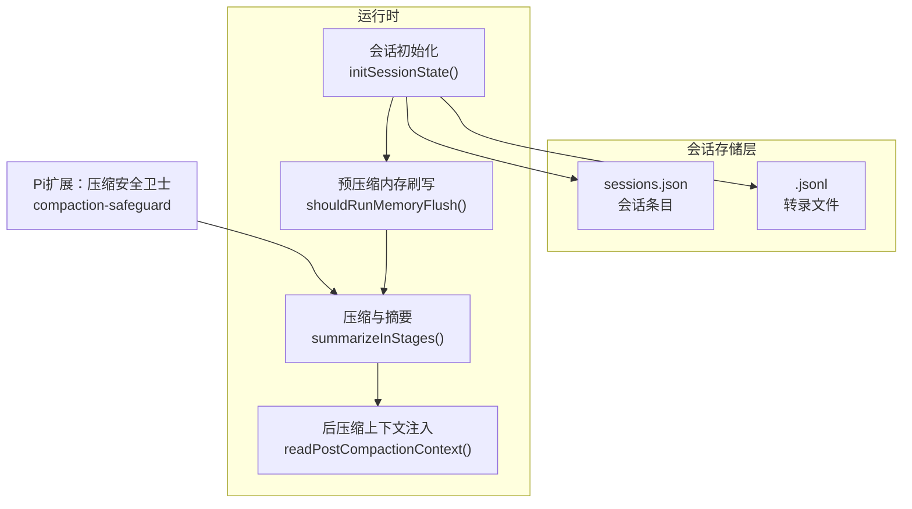
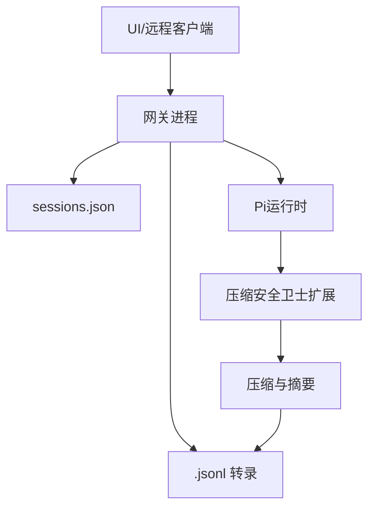
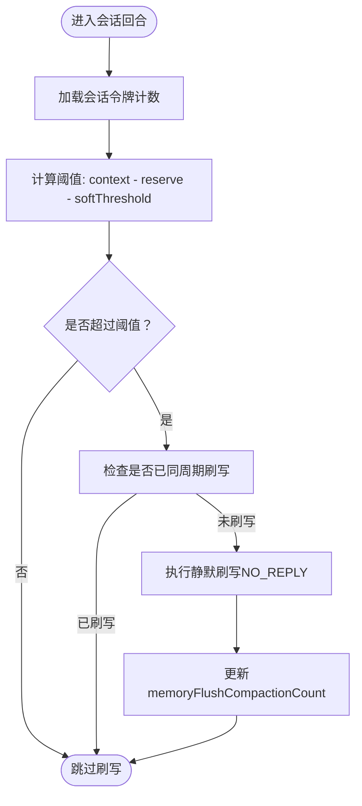
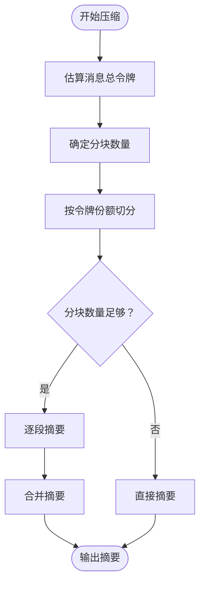
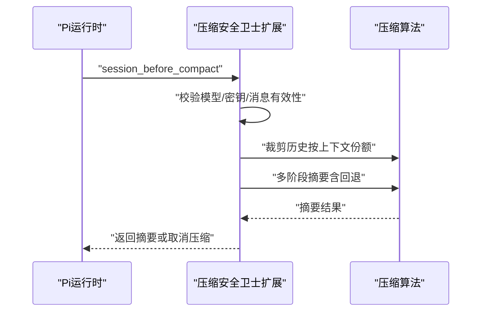
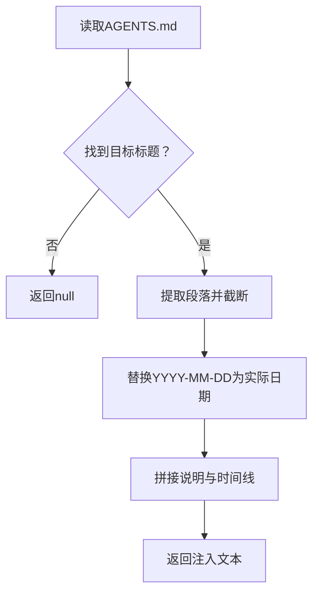
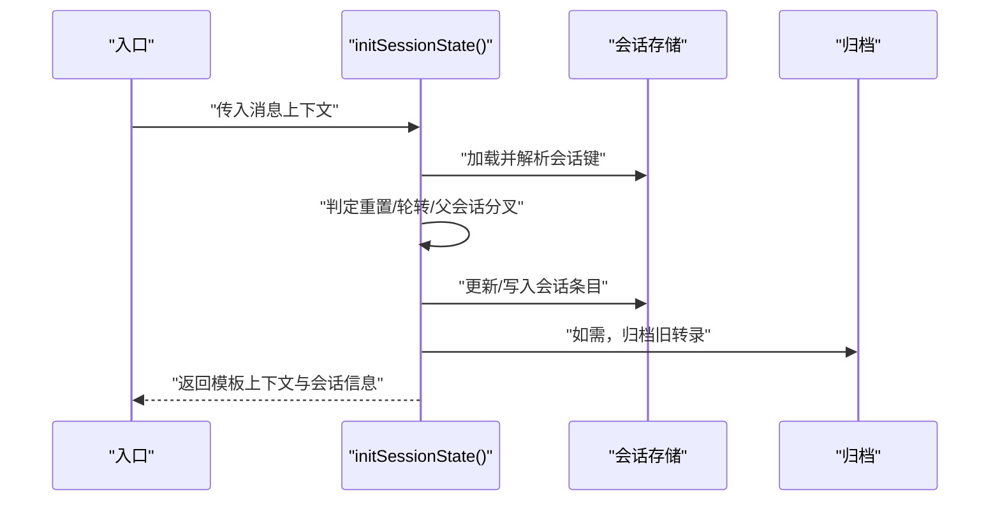
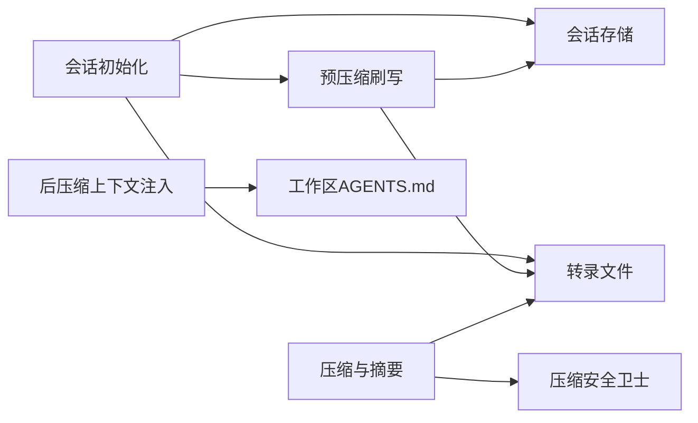

# 会话管理优化

<cite>
**本文引用的文件**
- [session-management-compaction.md](file://docs/reference/session-management-compaction.md)
- [memory-flush.ts](file://src/auto-reply/reply/memory-flush.ts)
- [session-updates.ts](file://src/auto-reply/reply/session-updates.ts)
- [session.ts](file://src/auto-reply/reply/session.ts)
- [compaction.ts](file://src/agents/compaction.ts)
- [compaction-safeguard.ts](file://src/agents/pi-extensions/compaction-safeguard.ts)
- [post-compaction-context.ts](file://src/auto-reply/reply/post-compaction-context.ts)
- [sessions.ts](file://src/config/sessions.ts)
- [store-maintenance.ts](file://src/config/sessions/store-maintenance.ts)
</cite>

## 目录
1. [简介](#简介)
2. [项目结构](#项目结构)
3. [核心组件](#核心组件)
4. [架构总览](#架构总览)
5. [详细组件分析](#详细组件分析)
6. [依赖关系分析](#依赖关系分析)
7. [性能考量](#性能考量)
8. [故障排查指南](#故障排查指南)
9. [结论](#结论)
10. [附录](#附录)

## 简介
本文件面向OpenClaw会话管理性能优化，系统性阐述以下关键主题：
- 会话历史压缩算法（含分块、自适应分块比率、上下文份额裁剪）
- 上下文窗口与令牌估算的协同策略
- 预压缩“内存刷写”（silent housekeeping）触发与去重
- 消息分块处理机制与摘要生成流程
- 会话修剪策略与磁盘预算维护
- 令牌估算准确性与安全余量
- 自适应分块比率计算与阈值控制
- 会话状态优化、内存使用控制与历史记录压缩的实施方案
- 性能监控指标、优化效果评估与资源消耗分析
- 通过配置参数调优以提升整体性能的方法

## 项目结构
OpenClaw围绕“网关进程”统一管理会话状态，采用双层持久化：sessions.json（会话存储）与<sessionId>.jsonl（转录文件）。会话生命周期由路由、状态初始化、压缩与后压缩上下文注入等模块协作完成。

图示来源
- [session.ts:190-642](file://src/auto-reply/reply/session.ts#L190-L642)
- [memory-flush.ts:170-229](file://src/auto-reply/reply/memory-flush.ts#L170-L229)
- [compaction.ts:333-396](file://src/agents/compaction.ts#L333-L396)
- [post-compaction-context.ts:63-155](file://src/auto-reply/reply/post-compaction-context.ts#L63-L155)

章节来源
- [session-management-compaction.md:31-325](file://docs/reference/session-management-compaction.md#L31-L325)
- [sessions.ts:1-14](file://src/config/sessions.ts#L1-L14)

## 核心组件
- 会话存储与转录：会话键到当前会话ID映射，转录文件树形结构保存消息、工具调用与压缩摘要。
- 预压缩内存刷写：在阈值前进行静默“写入记忆”操作，避免压缩后丢失关键上下文。
- 压缩与摘要：基于令牌估算的分块、自适应分块比率、多阶段摘要与合并。
- 后压缩上下文注入：从工作区AGENTS.md提取关键规则，注入到新回合以恢复上下文。
- 存储维护与磁盘预算：按模式执行清理、轮转与配额控制，保障磁盘占用可控。

章节来源
- [session-management-compaction.md:40-197](file://docs/reference/session-management-compaction.md#L40-L197)
- [memory-flush.ts:1-229](file://src/auto-reply/reply/memory-flush.ts#L1-L229)
- [compaction.ts:1-465](file://src/agents/compaction.ts#L1-L465)
- [post-compaction-context.ts:1-234](file://src/auto-reply/reply/post-compaction-context.ts#L1-L234)

## 架构总览
OpenClaw的会话管理遵循“网关权威”的设计：UI与远程客户端均应查询网关获取会话列表与令牌统计；会话状态变更由网关负责落盘与维护。

图示来源
- [session-management-compaction.md:31-37](file://docs/reference/session-management-compaction.md#L31-L37)

章节来源
- [session-management-compaction.md:31-37](file://docs/reference/session-management-compaction.md#L31-L37)

## 详细组件分析

### 组件A：预压缩内存刷写（silent housekeeping）
目标：在自动压缩发生前，执行一次静默的“写入记忆”指令，确保关键上下文持久化，避免被压缩擦除。

- 触发条件
  - 当前会话令牌数达到软阈值（contextWindow - reserve - softThreshold），且未在同一压缩周期内执行过刷写。
  - 支持基于字节大小的强制触发（超过阈值时直接刷写）。
- 关键逻辑
  - 计算阈值并比较当前令牌数与阈值。
  - 使用NO_REPLY标记抑制用户可见输出。
  - 通过memoryFlushCompactionCount防止同一周期重复刷写。
- 默认提示与系统提示
  - 强制要求写入memory/YYYY-MM-DD.md，仅追加写入，不覆盖只读文件。
  - 提示中包含时间线信息，便于记忆文件与当前时间对齐。

图示来源
- [memory-flush.ts:170-229](file://src/auto-reply/reply/memory-flush.ts#L170-L229)
- [session-updates.ts:241-294](file://src/auto-reply/reply/session-updates.ts#L241-L294)

章节来源
- [memory-flush.ts:1-229](file://src/auto-reply/reply/memory-flush.ts#L1-L229)
- [session-updates.ts:241-294](file://src/auto-reply/reply/session-updates.ts#L241-L294)

### 组件B：压缩与摘要（分块、自适应比率、多阶段合并）
目标：在不丢失关键信息的前提下，将历史消息压缩为摘要，并保留近期对话片段。

- 分块策略
  - 基于令牌估算的固定最大令牌分块（应用安全余量）。
  - 自适应分块比率：根据平均消息大小动态降低分块比例，避免单条消息过大导致溢出。
- 多阶段摘要
  - 将消息按令牌份额切分为若干部分，逐段摘要，再对部分摘要进行合并摘要，优先保留近期上下文。
- 安全与回退
  - 若完整摘要失败，尝试仅摘要较小消息，并记录被忽略的大消息。
  - 对工具调用与结果的配对进行修复，避免API报错。
- 上下文份额裁剪
  - 在压缩前按maxHistoryShare裁剪历史，确保历史占用不超过预算。

图示来源
- [compaction.ts:89-175](file://src/agents/compaction.ts#L89-L175)
- [compaction.ts:181-200](file://src/agents/compaction.ts#L181-L200)
- [compaction.ts:333-396](file://src/agents/compaction.ts#L333-L396)

章节来源
- [compaction.ts:1-465](file://src/agents/compaction.ts#L1-L465)

### 组件C：压缩安全卫士（质量门禁与上下文份额控制）
目标：在Pi扩展中实施压缩前的质量门禁，确保摘要结构完整、关键标识符保留、最新用户询问得到反映。

- 结构化摘要指令
  - 强制要求摘要包含若干固定标题段，必要时可注入自定义指令。
- 标识符策略
  - 可选择严格或关闭策略，支持自定义指令覆盖默认行为。
- 上下文份额裁剪
  - 基于maxHistoryShare与安全余量计算历史预算，超出则裁剪旧内容。
- 工具失败与文件操作
  - 汇总工具失败信息与文件读写清单，辅助质量审计。
- 模型与密钥校验
  - 缺少模型或API Key时取消压缩，保护历史。

图示来源
- [compaction-safeguard.ts:698-800](file://src/agents/pi-extensions/compaction-safeguard.ts#L698-L800)
- [compaction.ts:398-460](file://src/agents/compaction.ts#L398-L460)

章节来源
- [compaction-safeguard.ts:1-800](file://src/agents/pi-extensions/compaction-safeguard.ts#L1-L800)
- [compaction.ts:398-460](file://src/agents/compaction.ts#L398-L460)

### 组件D：后压缩上下文注入
目标：在压缩完成后，从工作区AGENTS.md注入关键规则与启动序列说明，帮助代理在新回合快速恢复上下文。

- 注入策略
  - 支持默认或自定义标题集合；默认标题兼容旧版命名。
  - 替换日期占位符为实际日期，附加“当前时间”行。
- 输出格式
  - 明确标注“会话刚被压缩”，摘要仅为提示，非替代启动序列。

图示来源
- [post-compaction-context.ts:63-155](file://src/auto-reply/reply/post-compaction-context.ts#L63-L155)

章节来源
- [post-compaction-context.ts:1-234](file://src/auto-reply/reply/post-compaction-context.ts#L1-L234)

### 组件E：会话初始化与状态更新
目标：解析会话键、判定重置/轮转、维护会话元数据与令牌计数，并在需要时归档旧转录。

- 关键点
  - 加载会话存储时禁用缓存，避免多进程/平台时间戳粒度问题导致的错误会话ID生成。
  - 新会话/重置时清空过期令牌统计，避免状态污染。
  - 归档旧转录文件，防止磁盘累积。

图示来源
- [session.ts:190-642](file://src/auto-reply/reply/session.ts#L190-L642)

章节来源
- [session.ts:190-642](file://src/auto-reply/reply/session.ts#L190-L642)

## 依赖关系分析
- 会话存储与转录：会话初始化依赖会话存储解析与转录路径解析；压缩与摘要依赖转录读取与写入。
- 预压缩刷写：依赖会话令牌计数与上下文窗口配置；与压缩计数协同，避免重复刷写。
- 压缩算法：依赖Pi提供的令牌估算与摘要生成能力；在扩展中通过安全卫士进行前置质量控制。
- 后压缩注入：依赖工作区边界文件读取与Markdown标题提取。

图示来源
- [session.ts:190-642](file://src/auto-reply/reply/session.ts#L190-L642)
- [memory-flush.ts:170-229](file://src/auto-reply/reply/memory-flush.ts#L170-L229)
- [compaction.ts:333-396](file://src/agents/compaction.ts#L333-L396)
- [compaction-safeguard.ts:698-800](file://src/agents/pi-extensions/compaction-safeguard.ts#L698-L800)
- [post-compaction-context.ts:63-155](file://src/auto-reply/reply/post-compaction-context.ts#L63-L155)

章节来源
- [sessions.ts:1-14](file://src/config/sessions.ts#L1-L14)

## 性能考量
- 令牌估算准确性
  - 采用安全余量（约20%）补偿字符估算误差，避免分块过大导致溢出。
  - 对工具结果详情进行脱敏处理，减少不必要上下文带宽。
- 自适应分块比率
  - 平均消息大小>上下文10%时降低分块比例，避免单条消息过大。
- 上下文份额裁剪
  - 压缩前按maxHistoryShare与安全余量裁剪历史，平衡历史保留与上下文预算。
- 预压缩刷写
  - 在阈值前执行静默刷写，减少压缩频率与压缩规模，降低I/O与LLM调用成本。
- 存储维护与磁盘预算
  - 支持模式化的清理、轮转与配额控制，避免磁盘压力影响性能。

章节来源
- [compaction.ts:12-20](file://src/agents/compaction.ts#L12-L20)
- [compaction.ts:181-200](file://src/agents/compaction.ts#L181-L200)
- [compaction.ts:398-460](file://src/agents/compaction.ts#L398-L460)
- [memory-flush.ts:195-215](file://src/auto-reply/reply/memory-flush.ts#L195-L215)
- [store-maintenance.ts:38-124](file://src/config/sessions/store-maintenance.ts#L38-L124)

## 故障排查指南
- 会话键错误
  - 通过/status确认sessionKey是否正确，核对网关主机与存储路径。
- 存储与转录不一致
  - 确认使用的是网关主机上的sessions.json与对应转录文件。
- 压缩过于频繁
  - 检查模型上下文窗口是否过小、压缩设置（reserveTokens）是否过高、工具结果膨胀。
- 静默输出泄漏
  - 确认回复是否以NO_REPLY开头，且构建版本包含流式抑制修复。
- 磁盘占用异常
  - 使用sessions cleanup命令在dry-run/enforce模式下检查清理计划与配额。

章节来源
- [session-management-compaction.md:316-325](file://docs/reference/session-management-compaction.md#L316-L325)
- [store-maintenance.ts:80-87](file://src/config/sessions/store-maintenance.ts#L80-L87)

## 结论
通过预压缩刷写、自适应分块与上下文份额裁剪、结构化摘要与质量门禁、以及严格的磁盘预算控制，OpenClaw实现了高效稳定的会话管理。配合配置参数调优与监控指标，可在不同场景下获得更佳的性能与稳定性。

## 附录
- 会话存储schema要点（节选）
  - sessionId、updatedAt、chatType、provider/subject/room/space/displayName
  - 令牌计数：inputTokens、outputTokens、totalTokens、contextTokens
  - 压缩相关：compactionCount、memoryFlushAt、memoryFlushCompactionCount
- 配置项参考
  - compaction.reserveTokens、keepRecentTokens、memoryFlush.enabled/softThresholdTokens/forceFlushTranscriptBytes
  - postCompactionSections（默认["Session Startup","Red Lines"]）
  - session.maintenance.mode/pruneAfter/maxEntries/rotateBytes/maxDiskBytes/highWaterBytes/resetArchiveRetention

章节来源
- [session-management-compaction.md:137-159](file://docs/reference/session-management-compaction.md#L137-L159)
- [post-compaction-context.ts:89-96](file://src/auto-reply/reply/post-compaction-context.ts#L89-L96)