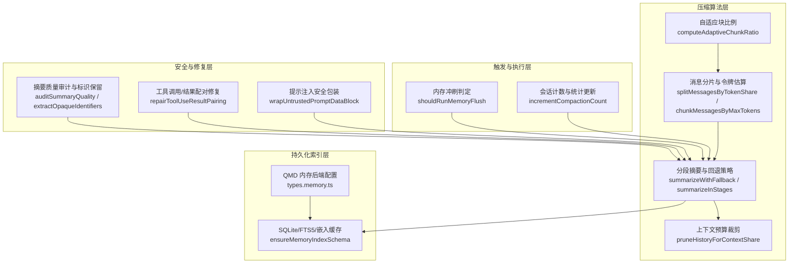
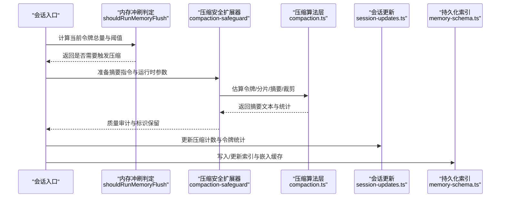
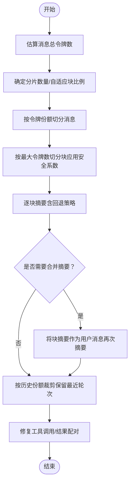
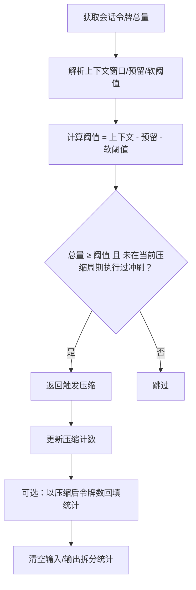
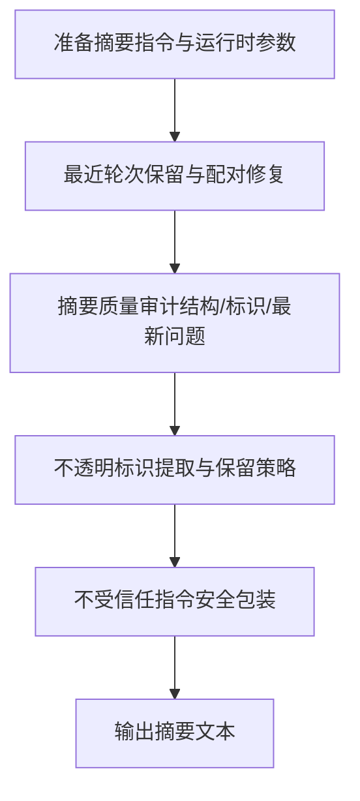
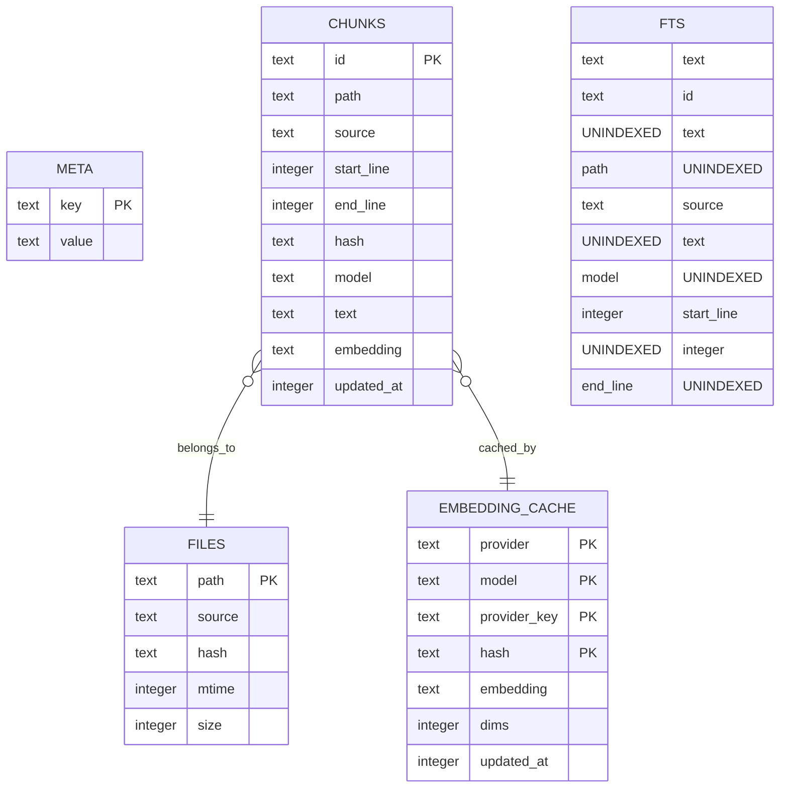
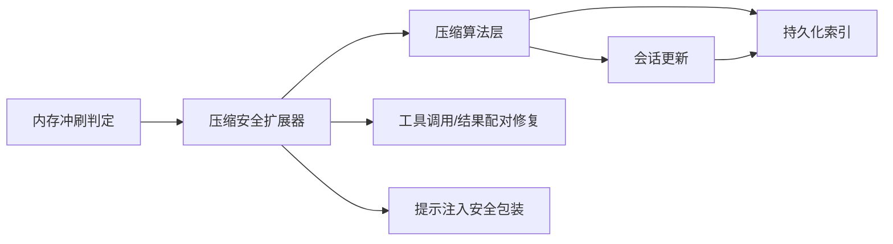

# 内存压缩技术

<cite>
**本文引用的文件**
- [src/agents/compaction.ts](file://src/agents/compaction.ts)
- [src/auto-reply/reply/memory-flush.ts](file://src/auto-reply/reply/memory-flush.ts)
- [src/auto-reply/reply/session-updates.ts](file://src/auto-reply/reply/session-updates.ts)
- [src/agents/pi-extensions/compaction-safeguard.ts](file://src/agents/pi-extensions/compaction-safeguard.ts)
- [src/agents/pi-extensions/compaction-safeguard.test.ts](file://src/agents/pi-extensions/compaction-safeguard.test.ts)
- [src/agents/pi-extensions/compaction-safeguard-runtime.ts](file://src/agents/pi-extensions/compaction-safeguard-runtime.ts)
- [src/agents/session-transcript-repair.ts](file://src/agents/session-transcript-repair.ts)
- [src/memory/memory-schema.ts](file://src/memory/memory-schema.ts)
- [src/config/types.memory.ts](file://src/config/types.memory.ts)
- [src/agents/content-blocks.ts](file://src/agents/content-blocks.ts)
- [src/agents/sanitize-for-prompt.ts](file://src/agents/sanitize-for-prompt.ts)
</cite>

## 目录
1. [简介](#简介)
2. [项目结构](#项目结构)
3. [核心组件](#核心组件)
4. [架构总览](#架构总览)
5. [详细组件分析](#详细组件分析)
6. [依赖关系分析](#依赖关系分析)
7. [性能考量](#性能考量)
8. [故障排查指南](#故障排查指南)
9. [结论](#结论)
10. [附录](#附录)

## 简介
本文件系统化阐述 OpenClaw 的内存压缩技术，围绕消息压缩算法、令牌估算优化、历史记录清理与安全边界处理展开，解释压缩策略选择、安全边界处理、性能权衡，并提供内存使用优化、存储空间节省、数据完整性保证的具体实施方案。同时给出压缩效果评估、内存监控指标与压缩算法对比的实用方法，说明如何通过压缩与内存管理策略提升代理系统的整体性能。

## 项目结构
OpenClaw 的内存压缩能力由“压缩算法层”“触发与执行层”“安全与修复层”“持久化索引层”四部分协同构成：
- 压缩算法层：负责消息分片、令牌估算、分段摘要、上下文预算裁剪与自适应块比例计算。
- 触发与执行层：负责在会话接近上下文窗口阈值时触发预压缩内存冲刷与压缩流程。
- 安全与修复层：确保摘要质量、保留关键标识、修复工具调用与结果配对，避免严格模型接口报错。
- 持久化索引层：提供 SQLite/FTS5 索引与嵌入缓存，支撑检索增强与长期记忆写入。

图表来源
- [src/agents/compaction.ts](file://src/agents/compaction.ts)
- [src/auto-reply/reply/memory-flush.ts](file://src/auto-reply/reply/memory-flush.ts)
- [src/auto-reply/reply/session-updates.ts](file://src/auto-reply/reply/session-updates.ts)
- [src/agents/pi-extensions/compaction-safeguard.ts](file://src/agents/pi-extensions/compaction-safeguard.ts)
- [src/agents/session-transcript-repair.ts](file://src/agents/session-transcript-repair.ts)
- [src/memory/memory-schema.ts](file://src/memory/memory-schema.ts)
- [src/config/types.memory.ts](file://src/config/types.memory.ts)

章节来源
- [src/agents/compaction.ts](file://src/agents/compaction.ts)
- [src/auto-reply/reply/memory-flush.ts](file://src/auto-reply/reply/memory-flush.ts)
- [src/auto-reply/reply/session-updates.ts](file://src/auto-reply/reply/session-updates.ts)
- [src/agents/pi-extensions/compaction-safeguard.ts](file://src/agents/pi-extensions/compaction-safeguard.ts)
- [src/agents/session-transcript-repair.ts](file://src/agents/session-transcript-repair.ts)
- [src/memory/memory-schema.ts](file://src/memory/memory-schema.ts)
- [src/config/types.memory.ts](file://src/config/types.memory.ts)

## 核心组件
- 消息压缩与摘要
  - 分片与令牌估算：基于令牌估算函数将消息按目标令牌数切分为块，应用安全系数降低估算误差带来的风险。
  - 自适应块比例：根据平均消息大小动态调整块比例，避免单条消息过大导致无法摘要。
  - 分段摘要与回退：先尝试完整摘要，失败则排除超大消息进行局部摘要，最终失败则生成结构化兜底摘要。
  - 上下文预算裁剪：按最大历史份额（默认 50%）裁剪历史，优先保留最近对话轮次，修复工具调用/结果配对。
- 触发与执行
  - 内存冲刷判定：当会话令牌总量接近上下文窗口预留阈值时触发；同一压缩周期内仅允许一次冲刷。
  - 会话统计更新：压缩后更新压缩计数与令牌统计，支持“压缩后令牌数”回填，清空输入/输出拆分统计。
- 安全与修复
  - 摘要质量审计：强制要求固定结构标题，校验关键标识是否保留，检查用户最新问题是否被反映。
  - 工具调用/结果配对修复：移动/插入/去重/丢弃孤儿结果，避免严格模型接口报错。
  - 提示注入安全包装：对不受信任的指令文本进行清洗与包裹，防止注入破坏提示结构。
- 持久化与检索
  - SQLite/FTS5/嵌入缓存：建立元数据、文件、片段、嵌入缓存表及索引，支持可选全文检索。
  - QMD 内存后端：提供命令行/服务化搜索模式、会话导出、更新策略与限制参数。

章节来源
- [src/agents/compaction.ts](file://src/agents/compaction.ts)
- [src/auto-reply/reply/memory-flush.ts](file://src/auto-reply/reply/memory-flush.ts)
- [src/auto-reply/reply/session-updates.ts](file://src/auto-reply/reply/session-updates.ts)
- [src/agents/pi-extensions/compaction-safeguard.ts](file://src/agents/pi-extensions/compaction-safeguard.ts)
- [src/agents/session-transcript-repair.ts](file://src/agents/session-transcript-repair.ts)
- [src/memory/memory-schema.ts](file://src/memory/memory-schema.ts)
- [src/config/types.memory.ts](file://src/config/types.memory.ts)

## 架构总览
OpenClaw 在会话生命周期中通过“令牌估算 + 预算裁剪 + 分段摘要”的闭环实现内存压缩。压缩前的安全扩展器负责：
- 识别并保留最近对话轮次，避免关键上下文丢失；
- 抽取并审计摘要中的关键标识与用户最新问题；
- 对不受信任的自定义指令进行安全包装；
- 修复工具调用/结果配对，确保严格模型接口可用。

图表来源
- [src/auto-reply/reply/memory-flush.ts](file://src/auto-reply/reply/memory-flush.ts)
- [src/agents/pi-extensions/compaction-safeguard.ts](file://src/agents/pi-extensions/compaction-safeguard.ts)
- [src/agents/compaction.ts](file://src/agents/compaction.ts)
- [src/auto-reply/reply/session-updates.ts](file://src/auto-reply/reply/session-updates.ts)
- [src/memory/memory-schema.ts](file://src/memory/memory-schema.ts)

## 详细组件分析

### 组件一：消息压缩与摘要（核心算法）
- 令牌估算与安全系数
  - 使用统一的令牌估算函数对消息进行累加估算，安全系数用于补偿字符/多字节/特殊标记/代码等估算偏差。
  - 在按最大令牌数切分时，先将上限除以安全系数，再进行分块，避免超出模型上下文。
- 分片与自适应块比例
  - 将消息按目标令牌份额切分为多个块，块数由参数或自适应比例决定。
  - 当平均消息大小超过上下文的一定比例时，自动降低块比例，提高压缩密度。
- 分段摘要与回退策略
  - 先尝试完整摘要；失败时排除超大消息进行局部摘要；最终失败则生成结构化兜底摘要。
  - 支持“合并摘要”的二次摘要，将各块摘要作为用户消息再次汇总，形成更高层的连贯摘要。
- 上下文预算裁剪
  - 按最大历史份额（默认 50%）裁剪历史，优先保留最近对话轮次。
  - 裁剪后修复工具调用/结果配对，避免孤儿结果导致严格模型接口报错。

图表来源
- [src/agents/compaction.ts](file://src/agents/compaction.ts)

章节来源
- [src/agents/compaction.ts](file://src/agents/compaction.ts)

### 组件二：内存冲刷触发与会话统计（执行控制）
- 内存冲刷判定
  - 基于会话令牌总量、上下文窗口、预留令牌与软阈值计算触发阈值，超过阈值且未在同一压缩周期内执行过冲刷时触发。
  - 支持以外部传入的令牌数覆盖缓存统计，适配不同场景的快照需求。
- 会话统计更新
  - 增加压缩计数，可选地以压缩后的令牌数回填缓存，清空输入/输出拆分统计与缓存读写计数，保持统计一致性。

图表来源
- [src/auto-reply/reply/memory-flush.ts](file://src/auto-reply/reply/memory-flush.ts)
- [src/auto-reply/reply/session-updates.ts](file://src/auto-reply/reply/session-updates.ts)

章节来源
- [src/auto-reply/reply/memory-flush.ts](file://src/auto-reply/reply/memory-flush.ts)
- [src/auto-reply/reply/session-updates.ts](file://src/auto-reply/reply/session-updates.ts)

### 组件三：压缩安全扩展器（质量与安全）
- 最近轮次保留
  - 从历史末尾保留指定数量的用户/助手轮次，必要时保留对应工具结果，避免关键上下文丢失。
- 摘要质量审计
  - 强制固定结构标题，校验关键标识是否保留，检查用户最新问题是否被反映。
- 不透明标识提取与保留
  - 从摘要中抽取并去重关键标识（十六进制、URL、路径、端口、日期时间等），在严格策略下必须保留。
- 提示注入安全包装
  - 对不受信任的自定义指令进行清洗与包裹，防止换行/控制字符破坏提示结构。
- 工具调用/结果配对修复
  - 移动/插入/去重/丢弃孤儿结果，确保严格模型接口可用。

图表来源
- [src/agents/pi-extensions/compaction-safeguard.ts](file://src/agents/pi-extensions/compaction-safeguard.ts)
- [src/agents/session-transcript-repair.ts](file://src/agents/session-transcript-repair.ts)
- [src/agents/sanitize-for-prompt.ts](file://src/agents/sanitize-for-prompt.ts)

章节来源
- [src/agents/pi-extensions/compaction-safeguard.ts](file://src/agents/pi-extensions/compaction-safeguard.ts)
- [src/agents/session-transcript-repair.ts](file://src/agents/session-transcript-repair.ts)
- [src/agents/sanitize-for-prompt.ts](file://src/agents/sanitize-for-prompt.ts)

### 组件四：持久化与检索（索引与后端）
- SQLite/FTS5/嵌入缓存
  - 建立元数据、文件、片段、嵌入缓存表及索引，支持可选全文检索（FTS5），并维护更新时间索引。
- QMD 内存后端
  - 支持命令行/服务化搜索模式、会话导出目录与保留天数、更新间隔与超时、最大结果/片段长度/注入长度与超时等配置。

图表来源
- [src/memory/memory-schema.ts](file://src/memory/memory-schema.ts)

章节来源
- [src/memory/memory-schema.ts](file://src/memory/memory-schema.ts)
- [src/config/types.memory.ts](file://src/config/types.memory.ts)

## 依赖关系分析
- 组件耦合与协作
  - 压缩算法层依赖令牌估算与分片函数，受安全扩展器的指令与运行时参数影响。
  - 触发与执行层依赖会话统计与上下文窗口解析，压缩完成后更新统计。
  - 安全扩展器依赖摘要质量审计、标识提取、配对修复与提示包装。
  - 持久化层独立于压缩流程，但为压缩产出提供写入与检索能力。
- 外部依赖与集成点
  - 模型注册中心提供 API Key 与上下文窗口信息，压缩流程依赖其解析结果。
  - QMD 后端通过命令或服务化方式与系统交互，支持检索增强与长期记忆写入。

图表来源
- [src/auto-reply/reply/memory-flush.ts](file://src/auto-reply/reply/memory-flush.ts)
- [src/agents/pi-extensions/compaction-safeguard.ts](file://src/agents/pi-extensions/compaction-safeguard.ts)
- [src/agents/compaction.ts](file://src/agents/compaction.ts)
- [src/auto-reply/reply/session-updates.ts](file://src/auto-reply/reply/session-updates.ts)
- [src/agents/session-transcript-repair.ts](file://src/agents/session-transcript-repair.ts)
- [src/agents/sanitize-for-prompt.ts](file://src/agents/sanitize-for-prompt.ts)
- [src/memory/memory-schema.ts](file://src/memory/memory-schema.ts)

章节来源
- [src/auto-reply/reply/memory-flush.ts](file://src/auto-reply/reply/memory-flush.ts)
- [src/agents/pi-extensions/compaction-safeguard.ts](file://src/agents/pi-extensions/compaction-safeguard.ts)
- [src/agents/compaction.ts](file://src/agents/compaction.ts)
- [src/auto-reply/reply/session-updates.ts](file://src/auto-reply/reply/session-updates.ts)
- [src/agents/session-transcript-repair.ts](file://src/agents/session-transcript-repair.ts)
- [src/agents/sanitize-for-prompt.ts](file://src/agents/sanitize-for-prompt.ts)
- [src/memory/memory-schema.ts](file://src/memory/memory-schema.ts)

## 性能考量
- 令牌估算优化
  - 使用安全系数补偿估算误差，减少因估算不足导致的分块失败与重复摘要。
  - 自适应块比例随平均消息大小动态调整，避免单条消息过大造成分块爆炸。
- 压缩策略选择
  - 在消息量大、平均消息长时采用更小块比例与分段摘要，提升吞吐。
  - 在消息量小、平均消息短时采用较大块比例，减少摘要层级与开销。
- 触发时机与频率
  - 通过预留令牌与软阈值设置，避免在临界点反复触发压缩，降低抖动。
  - 同一压缩周期内仅允许一次内存冲刷，避免重复计算。
- 存储与检索
  - SQLite/FTS5 索引与嵌入缓存索引提升检索效率；合理设置更新间隔与超时，平衡实时性与资源占用。
  - QMD 后端的搜索模式与限制参数需结合业务负载调优。

## 故障排查指南
- 摘要失败
  - 现象：完整摘要失败，回退到局部摘要或兜底摘要。
  - 排查：检查是否存在超大消息；确认安全系数与块上限设置；验证自定义指令是否被安全包装。
- 工具调用/结果配对错误
  - 现象：严格模型接口报错，提示“意外的 tool_use_id”。
  - 排查：确认是否执行了配对修复；检查会话中是否存在孤儿结果或重复结果。
- 摘要质量不达标
  - 现象：摘要缺少固定结构标题、关键标识未保留、未反映用户最新问题。
  - 排查：核对摘要质量审计规则；确认标识提取逻辑与严格策略；检查最近轮次保留范围。
- 冲刷未触发
  - 现象：接近上下文阈值但未触发压缩。
  - 排查：确认会话令牌统计是否新鲜；检查预留令牌与软阈值设置；确认是否已在当前压缩周期执行过冲刷。

章节来源
- [src/agents/pi-extensions/compaction-safeguard.ts](file://src/agents/pi-extensions/compaction-safeguard.ts)
- [src/agents/session-transcript-repair.ts](file://src/agents/session-transcript-repair.ts)
- [src/auto-reply/reply/memory-flush.ts](file://src/auto-reply/reply/memory-flush.ts)

## 结论
OpenClaw 的内存压缩技术通过“令牌估算 + 自适应分片 + 分段摘要 + 预算裁剪 + 安全扩展 + 统计更新 + 索引持久化”的闭环设计，在保障数据完整性与模型接口兼容的前提下，实现了高效的上下文压缩与长期记忆写入。结合合理的触发策略与后端配置，可在不同负载场景下取得稳定的性能收益与资源节省。

## 附录

### 实用工具与方法
- 压缩效果评估
  - 指标：压缩前/后令牌总量变化率、摘要块数量、裁剪块数量、孤儿/重复结果数量、摘要质量评分。
  - 方法：对比不同块比例与阈值设置下的效果，结合业务反馈迭代。
- 内存监控指标
  - 会话级：总令牌数、压缩计数、最近压缩时间、输入/输出令牌拆分统计。
  - 系统级：索引表大小、FTS 可用状态、嵌入缓存命中率、查询耗时。
- 压缩算法对比
  - 固定块比例 vs 自适应块比例：在消息大小差异较大时，自适应比例通常更稳定。
  - 完整摘要 vs 局部摘要：在超大消息较多时，局部摘要可显著降低失败率。
  - 是否启用最近轮次保留：对关键上下文保留有明显改善，但会增加摘要复杂度。

章节来源
- [src/agents/compaction.ts](file://src/agents/compaction.ts)
- [src/auto-reply/reply/memory-flush.ts](file://src/auto-reply/reply/memory-flush.ts)
- [src/auto-reply/reply/session-updates.ts](file://src/auto-reply/reply/session-updates.ts)
- [src/memory/memory-schema.ts](file://src/memory/memory-schema.ts)