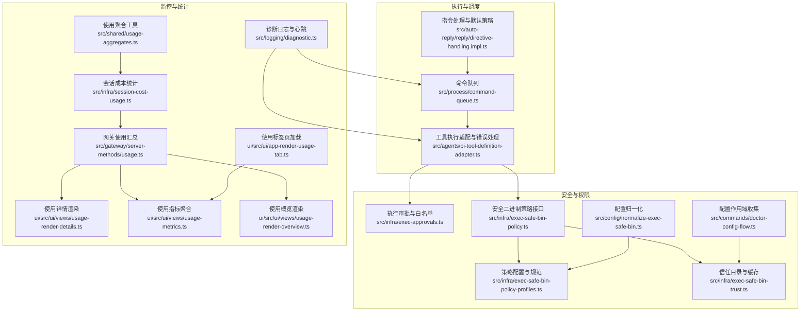
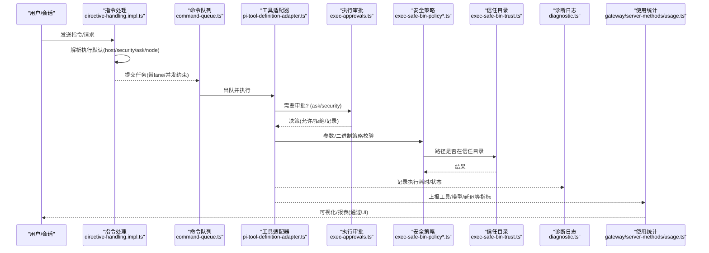
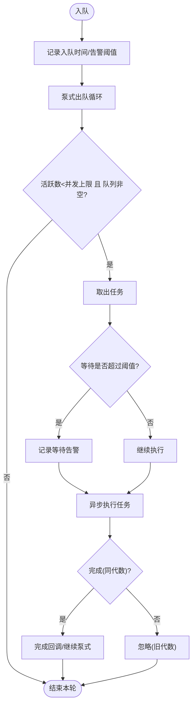
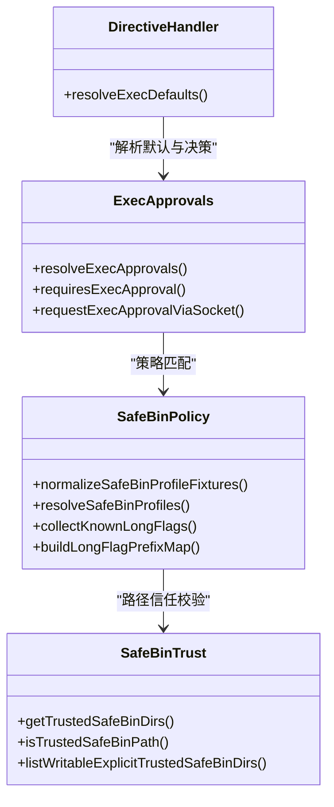
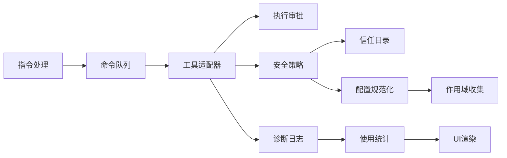

# 工具执行性能

<cite>
**本文引用的文件**
- [src/process/command-queue.ts](file://src/process/command-queue.ts)
- [src/infra/exec-safe-bin-policy.ts](file://src/infra/exec-safe-bin-policy.ts)
- [src/infra/exec-safe-bin-policy-profiles.ts](file://src/infra/exec-safe-bin-policy-profiles.ts)
- [src/infra/exec-safe-bin-trust.ts](file://src/infra/exec-safe-bin-trust.ts)
- [src/infra/exec-approvals.ts](file://src/infra/exec-approvals.ts)
- [src/auto-reply/reply/directive-handling.impl.ts](file://src/auto-reply/reply/directive-handling.impl.ts)
- [src/logging/diagnostic.ts](file://src/logging/diagnostic.ts)
- [src/agents/sandbox.ts](file://src/agents/sandbox.ts)
- [src/shared/usage-aggregates.ts](file://src/shared/usage-aggregates.ts)
- [src/infra/session-cost-usage.ts](file://src/infra/session-cost-usage.ts)
- [src/gateway/server-methods/usage.ts](file://src/gateway/server-methods/usage.ts)
- [ui/src/ui/views/usage-render-details.ts](file://ui/src/ui/views/usage-render-details.ts)
- [ui/src/ui/views/usage-metrics.ts](file://ui/src/ui/views/usage-metrics.ts)
- [ui/src/ui/views/usage-render-overview.ts](file://ui/src/ui/views/usage-render-overview.ts)
- [ui/src/ui/app-render-usage-tab.ts](file://ui/src/ui/app-render-usage-tab.ts)
- [src/agents/pi-tool-definition-adapter.ts](file://src/agents/pi-tool-definition-adapter.ts)
- [src/agents/tool-policy-pipeline.test.ts](file://src/agents/tool-policy-pipeline.test.ts)
- [src/commands/doctor-config-flow.ts](file://src/commands/doctor-config-flow.ts)
- [src/config/normalize-exec-safe-bin.ts](file://src/config/normalize-exec-safe-bin.ts)
- [src/auto-reply/reply/queue-policy.ts](file://src/auto-reply/reply/queue-policy.ts)
</cite>

## 目录
1. [简介](#简介)
2. [项目结构](#项目结构)
3. [核心组件](#核心组件)
4. [架构总览](#架构总览)
5. [详细组件分析](#详细组件分析)
6. [依赖关系分析](#依赖关系分析)
7. [性能考量](#性能考量)
8. [故障排查指南](#故障排查指南)
9. [结论](#结论)
10. [附录](#附录)

## 简介
本指南聚焦于OpenClaw工具执行性能优化，围绕以下关键主题展开：工具调用优化策略、执行队列管理、并发控制机制、工具注册表与权限控制、资源分配策略、执行效率与响应时间优化、错误处理优化、性能监控与统计分析、以及通过工具配置与执行策略提升代理工具调用整体性能。文档在保证技术深度的同时，力求对非专业读者也具备可读性。

## 项目结构
OpenClaw的工具执行性能相关能力主要分布在如下模块：
- 执行队列与并发控制：process/command-queue.ts
- 安全执行策略（白名单/信任目录/参数配置）：infra/exec-approvals.ts、infra/exec-safe-bin-policy.ts、infra/exec-safe-bin-policy-profiles.ts、infra/exec-safe-bin-trust.ts
- 指令解析与默认执行策略：auto-reply/reply/directive-handling.impl.ts
- 性能监控与诊断日志：logging/diagnostic.ts
- 使用统计与聚合：shared/usage-aggregates.ts、infra/session-cost-usage.ts、gateway/server-methods/usage.ts
- UI使用指标渲染：ui/views/usage-*.ts
- 工具执行适配与错误处理：agents/pi-tool-definition-adapter.ts
- 配置规范化与作用域收集：commands/doctor-config-flow.ts、config/normalize-exec-safe-bin.ts
- 自动回复队列策略：auto-reply/reply/queue-policy.ts

图表来源
- [src/process/command-queue.ts:1-325](file://src/process/command-queue.ts#L1-L325)
- [src/auto-reply/reply/directive-handling.impl.ts:1-468](file://src/auto-reply/reply/directive-handling.impl.ts#L1-L468)
- [src/agents/pi-tool-definition-adapter.ts:167-194](file://src/agents/pi-tool-definition-adapter.ts#L167-L194)
- [src/infra/exec-approvals.ts:1-590](file://src/infra/exec-approvals.ts#L1-L590)
- [src/infra/exec-safe-bin-policy.ts:1-16](file://src/infra/exec-safe-bin-policy.ts#L1-L16)
- [src/infra/exec-safe-bin-policy-profiles.ts:1-316](file://src/infra/exec-safe-bin-policy-profiles.ts#L1-L316)
- [src/infra/exec-safe-bin-trust.ts:1-127](file://src/infra/exec-safe-bin-trust.ts#L1-L127)
- [src/config/normalize-exec-safe-bin.ts:1-37](file://src/config/normalize-exec-safe-bin.ts#L1-L37)
- [src/commands/doctor-config-flow.ts:1353-1393](file://src/commands/doctor-config-flow.ts#L1353-L1393)
- [src/logging/diagnostic.ts:1-434](file://src/logging/diagnostic.ts#L1-L434)
- [src/shared/usage-aggregates.ts:1-109](file://src/shared/usage-aggregates.ts#L1-L109)
- [src/infra/session-cost-usage.ts:600-631](file://src/infra/session-cost-usage.ts#L600-L631)
- [src/gateway/server-methods/usage.ts:623-660](file://src/gateway/server-methods/usage.ts#L623-L660)
- [ui/src/ui/views/usage-render-details.ts:394-429](file://ui/src/ui/views/usage-render-details.ts#L394-L429)
- [ui/src/ui/views/usage-metrics.ts:341-516](file://ui/src/ui/views/usage-metrics.ts#L341-L516)
- [ui/src/ui/views/usage-render-overview.ts:380-543](file://ui/src/ui/views/usage-render-overview.ts#L380-L543)
- [ui/src/ui/app-render-usage-tab.ts:1-19](file://ui/src/ui/app-render-usage-tab.ts#L1-L19)

章节来源
- [src/process/command-queue.ts:1-325](file://src/process/command-queue.ts#L1-L325)
- [src/infra/exec-approvals.ts:1-590](file://src/infra/exec-approvals.ts#L1-L590)
- [src/infra/exec-safe-bin-policy.ts:1-16](file://src/infra/exec-safe-bin-policy.ts#L1-L16)
- [src/infra/exec-safe-bin-policy-profiles.ts:1-316](file://src/infra/exec-safe-bin-policy-profiles.ts#L1-L316)
- [src/infra/exec-safe-bin-trust.ts:1-127](file://src/infra/exec-safe-bin-trust.ts#L1-L127)
- [src/auto-reply/reply/directive-handling.impl.ts:1-468](file://src/auto-reply/reply/directive-handling.impl.ts#L1-L468)
- [src/logging/diagnostic.ts:1-434](file://src/logging/diagnostic.ts#L1-L434)
- [src/shared/usage-aggregates.ts:1-109](file://src/shared/usage-aggregates.ts#L1-L109)
- [src/infra/session-cost-usage.ts:600-631](file://src/infra/session-cost-usage.ts#L600-L631)
- [src/gateway/server-methods/usage.ts:623-660](file://src/gateway/server-methods/usage.ts#L623-L660)
- [ui/src/ui/views/usage-render-details.ts:394-429](file://ui/src/ui/views/usage-render-details.ts#L394-L429)
- [ui/src/ui/views/usage-metrics.ts:341-516](file://ui/src/ui/views/usage-metrics.ts#L341-L516)
- [ui/src/ui/views/usage-render-overview.ts:380-543](file://ui/src/ui/views/usage-render-overview.ts#L380-L543)
- [ui/src/ui/app-render-usage-tab.ts:1-19](file://ui/src/ui/app-render-usage-tab.ts#L1-L19)
- [src/agents/pi-tool-definition-adapter.ts:167-194](file://src/agents/pi-tool-definition-adapter.ts#L167-L194)
- [src/commands/doctor-config-flow.ts:1353-1393](file://src/commands/doctor-config-flow.ts#L1353-L1393)
- [src/config/normalize-exec-safe-bin.ts:1-37](file://src/config/normalize-exec-safe-bin.ts#L1-L37)

## 核心组件
- 命令队列与并发控制：提供按“通道（lane）”隔离的串行/并行执行模型，支持最大并发度设置、排队等待告警、任务完成回调、清空与重置等能力，确保主工作流与其他低风险任务的隔离与可控吞吐。
- 安全执行策略：统一的执行主机、安全级别、询问策略的默认解析；执行审批文件的读取、归一化、合并与持久化；安全二进制策略的配置与校验，信任目录的缓存与检查，参数白名单/黑名单的编译与匹配。
- 指令处理与默认策略：根据全局/代理/会话层配置解析执行主机、安全级别、询问策略与节点信息，支持指令式调整这些默认值。
- 性能监控与诊断：提供诊断日志、心跳、会话状态跟踪、队列入队/出队事件、工具循环检测与阻断、活动会话统计等，支撑性能观测与问题定位。
- 使用统计与聚合：对消息、工具调用、模型/提供商维度的使用量与延迟进行聚合，支持按天粒度的延迟与用量统计，并输出UI可视化所需的数据结构。
- 工具执行适配与错误处理：封装工具执行过程中的异常描述、日志记录与结果格式化，避免未捕获异常噪声并提供一致的错误反馈。
- 配置规范化与作用域收集：对工具执行相关的安全二进制配置进行规范化处理，并从全局与代理配置中收集可信范围，便于后续策略应用。

章节来源
- [src/process/command-queue.ts:1-325](file://src/process/command-queue.ts#L1-L325)
- [src/infra/exec-approvals.ts:1-590](file://src/infra/exec-approvals.ts#L1-L590)
- [src/infra/exec-safe-bin-policy.ts:1-16](file://src/infra/exec-safe-bin-policy.ts#L1-L16)
- [src/infra/exec-safe-bin-policy-profiles.ts:1-316](file://src/infra/exec-safe-bin-policy-profiles.ts#L1-L316)
- [src/infra/exec-safe-bin-trust.ts:1-127](file://src/infra/exec-safe-bin-trust.ts#L1-L127)
- [src/auto-reply/reply/directive-handling.impl.ts:1-468](file://src/auto-reply/reply/directive-handling.impl.ts#L1-L468)
- [src/logging/diagnostic.ts:1-434](file://src/logging/diagnostic.ts#L1-L434)
- [src/shared/usage-aggregates.ts:1-109](file://src/shared/usage-aggregates.ts#L1-L109)
- [src/infra/session-cost-usage.ts:600-631](file://src/infra/session-cost-usage.ts#L600-L631)
- [src/gateway/server-methods/usage.ts:623-660](file://src/gateway/server-methods/usage.ts#L623-L660)
- [src/agents/pi-tool-definition-adapter.ts:167-194](file://src/agents/pi-tool-definition-adapter.ts#L167-L194)
- [src/commands/doctor-config-flow.ts:1353-1393](file://src/commands/doctor-config-flow.ts#L1353-L1393)
- [src/config/normalize-exec-safe-bin.ts:1-37](file://src/config/normalize-exec-safe-bin.ts#L1-L37)

## 架构总览
下图展示工具执行性能优化的关键路径：从指令解析到队列调度、再到安全策略与统计上报的闭环。

图表来源
- [src/auto-reply/reply/directive-handling.impl.ts:30-57](file://src/auto-reply/reply/directive-handling.impl.ts#L30-L57)
- [src/process/command-queue.ts:161-197](file://src/process/command-queue.ts#L161-L197)
- [src/agents/pi-tool-definition-adapter.ts:167-194](file://src/agents/pi-tool-definition-adapter.ts#L167-L194)
- [src/infra/exec-approvals.ts:484-496](file://src/infra/exec-approvals.ts#L484-L496)
- [src/infra/exec-safe-bin-policy.ts:1-16](file://src/infra/exec-safe-bin-policy.ts#L1-L16)
- [src/infra/exec-safe-bin-policy-profiles.ts:1-316](file://src/infra/exec-safe-bin-policy-profiles.ts#L1-L316)
- [src/infra/exec-safe-bin-trust.ts:93-97](file://src/infra/exec-safe-bin-trust.ts#L93-L97)
- [src/logging/diagnostic.ts:247-266](file://src/logging/diagnostic.ts#L247-L266)
- [src/gateway/server-methods/usage.ts:623-660](file://src/gateway/server-methods/usage.ts#L623-L660)

## 详细组件分析

### 组件A：命令队列与并发控制（command-queue）
- 设计要点
  - 按“通道（lane）”隔离执行，避免主工作流与后台任务互相干扰。
  - 支持动态设置每通道最大并发数，按队列长度与活跃任务数进行泵式出队。
  - 提供等待超时告警、任务完成回调、清空通道、重置生成代数等能力，保障重启/清理场景下的稳定性。
- 关键流程
  - 入队：记录入队时间、告警阈值与回调，触发泵式出队。
  - 出队：当活跃任务数小于并发上限且队列非空时，取出任务执行。
  - 完成：区分当前代数的任务完成，避免旧代任务覆盖新代状态。
  - 清理：拒绝新入队（网关重启）或清空通道并拒绝既有排队项。
- 性能影响
  - 合理设置并发上限可避免资源争用；过小导致吞吐下降，过大可能导致I/O瓶颈。
  - 等待告警有助于识别阻塞点，指导队列与并发调优。
- 优化建议
  - 将高优先级任务置于独立lane并提高并发上限。
  - 对长尾任务拆分、限流与超时控制，避免阻塞其他任务。
  - 在重启前使用重置功能清理残留状态，减少恢复时间。

图表来源
- [src/process/command-queue.ts:92-144](file://src/process/command-queue.ts#L92-L144)
- [src/process/command-queue.ts:161-197](file://src/process/command-queue.ts#L161-L197)

章节来源
- [src/process/command-queue.ts:1-325](file://src/process/command-queue.ts#L1-L325)

### 组件B：安全执行策略与权限控制（exec-approvals、exec-safe-bin）
- 设计要点
  - 执行主机（sandbox/gateway/node）、安全级别（deny/allowlist/full）、询问策略（off/on-miss/always）的默认解析与覆盖。
  - 执行审批文件的读取、归一化、合并与持久化，支持按代理与通配符配置。
  - 安全二进制策略：内置常用命令的参数白名单/黑名单与长选项前缀映射，支持自定义配置并编译为高性能数据结构。
  - 信任目录：默认仅OS管理的系统目录，用户/包管理目录需显式配置；支持缓存与写权限检查。
- 关键流程
  - 默认解析：按会话/代理/全局顺序解析host/security/ask/node。
  - 审批判定：根据ask/security与分析/白名单满足度决定是否需要审批。
  - 参数校验：基于策略配置对命令行参数进行快速匹配与拒绝。
  - 路径校验：判断可执行文件路径是否位于信任目录。
- 性能影响
  - 审批与策略匹配为O(1)/O(k)复杂度，策略预编译降低运行时开销。
  - 信任目录缓存避免重复文件系统查询。
- 优化建议
  - 将高频命令纳入allowlist并定期更新lastUsed信息，减少交互审批次数。
  - 合理设置ask策略：生产环境建议on-miss或always，结合自动批准策略提升吞吐。
  - 仅在必要时启用full安全级别，deny/allowlist更利于性能与安全平衡。

图表来源
- [src/infra/exec-approvals.ts:412-482](file://src/infra/exec-approvals.ts#L412-L482)
- [src/infra/exec-safe-bin-policy.ts:1-16](file://src/infra/exec-safe-bin-policy.ts#L1-L16)
- [src/infra/exec-safe-bin-policy-profiles.ts:71-84](file://src/infra/exec-safe-bin-policy-profiles.ts#L71-L84)
- [src/infra/exec-safe-bin-trust.ts:70-97](file://src/infra/exec-safe-bin-trust.ts#L70-L97)
- [src/auto-reply/reply/directive-handling.impl.ts:30-57](file://src/auto-reply/reply/directive-handling.impl.ts#L30-L57)

章节来源
- [src/infra/exec-approvals.ts:1-590](file://src/infra/exec-approvals.ts#L1-L590)
- [src/infra/exec-safe-bin-policy.ts:1-16](file://src/infra/exec-safe-bin-policy.ts#L1-L16)
- [src/infra/exec-safe-bin-policy-profiles.ts:1-316](file://src/infra/exec-safe-bin-policy-profiles.ts#L1-L316)
- [src/infra/exec-safe-bin-trust.ts:1-127](file://src/infra/exec-safe-bin-trust.ts#L1-L127)
- [src/auto-reply/reply/directive-handling.impl.ts:1-468](file://src/auto-reply/reply/directive-handling.impl.ts#L1-L468)

### 组件C：指令处理与默认执行策略（directive-handling.impl）
- 设计要点
  - 从会话/代理/全局配置解析执行主机、安全级别、询问策略与节点，默认回退至sandbox/deny/on-miss。
  - 支持指令式调整这些默认值，并持久化到会话存储。
- 性能影响
  - 默认解析逻辑简单直接，避免复杂计算；指令调整仅在需要时生效。
- 优化建议
  - 将常用默认值固化在代理配置中，减少每次指令调整带来的开销。
  - 对高并发场景，尽量复用已解析的默认值，避免重复解析。

章节来源
- [src/auto-reply/reply/directive-handling.impl.ts:30-57](file://src/auto-reply/reply/directive-handling.impl.ts#L30-L57)

### 组件D：性能监控与诊断（diagnostic）
- 设计要点
  - 提供队列入队/出队事件、会话状态变化、工具循环检测、心跳统计等日志与事件。
  - 心跳周期性扫描卡住会话并发出告警，辅助定位性能瓶颈。
- 性能影响
  - 诊断日志级别可按需开启，避免生产环境过度日志开销。
  - 心跳与会话状态跟踪有助于发现长尾任务与阻塞点。
- 优化建议
  - 在性能压测期间开启debug级别，压测结束后恢复info级别。
  - 利用工具循环检测与阻断机制，防止无进展轮询导致资源浪费。

章节来源
- [src/logging/diagnostic.ts:247-266](file://src/logging/diagnostic.ts#L247-L266)
- [src/logging/diagnostic.ts:333-410](file://src/logging/diagnostic.ts#L333-L410)
- [src/logging/diagnostic.ts:284-318](file://src/logging/diagnostic.ts#L284-L318)

### 组件E：使用统计与聚合（usage-aggregates、session-cost-usage、gateway usage）
- 设计要点
  - 聚合工具调用次数、模型/提供商维度用量、每日延迟统计与成本汇总。
  - 输出UI所需的聚合结构，支持按类型/渠道/代理等多维分析。
- 性能影响
  - 聚合算法为线性扫描与累加，适合实时/准实时统计。
  - 按天聚合降低内存占用并提升查询效率。
- 优化建议
  - 将高频统计放入内存缓存，定期落盘或上报。
  - 对长序列统计采用滑动窗口或采样策略，避免内存膨胀。

章节来源
- [src/shared/usage-aggregates.ts:32-109](file://src/shared/usage-aggregates.ts#L32-L109)
- [src/infra/session-cost-usage.ts:600-631](file://src/infra/session-cost-usage.ts#L600-L631)
- [src/gateway/server-methods/usage.ts:623-660](file://src/gateway/server-methods/usage.ts#L623-L660)

### 组件F：工具执行适配与错误处理（pi-tool-definition-adapter）
- 设计要点
  - 包装工具执行，统一异常描述、日志记录与结果格式化，避免未捕获异常噪声。
  - 支持取消信号与AbortError处理，确保中断场景下的正确行为。
- 性能影响
  - 统一错误处理减少异常传播成本，提升系统稳定性。
- 优化建议
  - 在工具内部实现短路与快速失败逻辑，配合适配器统一上报。

章节来源
- [src/agents/pi-tool-definition-adapter.ts:167-194](file://src/agents/pi-tool-definition-adapter.ts#L167-L194)

### 组件G：配置规范化与作用域收集（normalize-exec-safe-bin、doctor-config-flow）
- 设计要点
  - 规范化安全二进制配置，包括策略与信任目录，确保一致性。
  - 收集全局与代理层面的安全二进制作用域，便于策略应用。
- 性能影响
  - 预处理配置降低运行时解析成本。
- 优化建议
  - 在启动阶段集中执行配置规范化，避免运行时重复处理。

章节来源
- [src/config/normalize-exec-safe-bin.ts:1-37](file://src/config/normalize-exec-safe-bin.ts#L1-L37)
- [src/commands/doctor-config-flow.ts:1353-1393](file://src/commands/doctor-config-flow.ts#L1353-L1393)

### 组件H：自动回复队列策略（queue-policy）
- 设计要点
  - 基于会话状态与队列模式，决定是立即执行、入队跟进还是丢弃，避免重复与无效调用。
- 性能影响
  - 合理的队列策略可显著降低无效调用与资源浪费。
- 优化建议
  - 对高频触发场景启用“steer”模式，将多余请求转为跟随请求。

章节来源
- [src/auto-reply/reply/queue-policy.ts:1-21](file://src/auto-reply/reply/queue-policy.ts#L1-L21)

## 依赖关系分析
- 指令处理依赖执行默认解析，进而影响队列调度与安全策略。
- 队列调度依赖工具适配器，工具适配器依赖审批与安全策略。
- 审批与安全策略依赖信任目录与策略配置，策略配置依赖配置规范化与作用域收集。
- 诊断日志贯穿执行链路，使用统计由网关汇总并驱动UI渲染。

图表来源
- [src/auto-reply/reply/directive-handling.impl.ts:30-57](file://src/auto-reply/reply/directive-handling.impl.ts#L30-L57)
- [src/process/command-queue.ts:161-197](file://src/process/command-queue.ts#L161-L197)
- [src/agents/pi-tool-definition-adapter.ts:167-194](file://src/agents/pi-tool-definition-adapter.ts#L167-L194)
- [src/infra/exec-approvals.ts:484-496](file://src/infra/exec-approvals.ts#L484-L496)
- [src/infra/exec-safe-bin-policy.ts:1-16](file://src/infra/exec-safe-bin-policy.ts#L1-L16)
- [src/infra/exec-safe-bin-trust.ts:70-97](file://src/infra/exec-safe-bin-trust.ts#L70-L97)
- [src/config/normalize-exec-safe-bin.ts:1-37](file://src/config/normalize-exec-safe-bin.ts#L1-L37)
- [src/commands/doctor-config-flow.ts:1353-1393](file://src/commands/doctor-config-flow.ts#L1353-L1393)
- [src/logging/diagnostic.ts:247-266](file://src/logging/diagnostic.ts#L247-L266)
- [src/gateway/server-methods/usage.ts:623-660](file://src/gateway/server-methods/usage.ts#L623-L660)
- [ui/src/ui/views/usage-metrics.ts:341-516](file://ui/src/ui/views/usage-metrics.ts#L341-L516)

章节来源
- [src/auto-reply/reply/directive-handling.impl.ts:1-468](file://src/auto-reply/reply/directive-handling.impl.ts#L1-L468)
- [src/process/command-queue.ts:1-325](file://src/process/command-queue.ts#L1-L325)
- [src/agents/pi-tool-definition-adapter.ts:167-194](file://src/agents/pi-tool-definition-adapter.ts#L167-L194)
- [src/infra/exec-approvals.ts:1-590](file://src/infra/exec-approvals.ts#L1-L590)
- [src/infra/exec-safe-bin-policy.ts:1-16](file://src/infra/exec-safe-bin-policy.ts#L1-L16)
- [src/infra/exec-safe-bin-trust.ts:1-127](file://src/infra/exec-safe-bin-trust.ts#L1-L127)
- [src/config/normalize-exec-safe-bin.ts:1-37](file://src/config/normalize-exec-safe-bin.ts#L1-L37)
- [src/commands/doctor-config-flow.ts:1353-1393](file://src/commands/doctor-config-flow.ts#L1353-L1393)
- [src/logging/diagnostic.ts:1-434](file://src/logging/diagnostic.ts#L1-L434)
- [src/gateway/server-methods/usage.ts:623-660](file://src/gateway/server-methods/usage.ts#L623-L660)
- [ui/src/ui/views/usage-metrics.ts:341-516](file://ui/src/ui/views/usage-metrics.ts#L341-L516)

## 性能考量
- 队列与并发
  - 为不同任务类型划分lane，独立设置并发上限，避免相互阻塞。
  - 对长尾任务设置超时与重试策略，防止占用资源。
- 安全策略
  - 使用allowlist与deny策略组合，减少交互审批次数。
  - 将常用命令加入allowlist并维护lastUsed信息，提升审批命中率。
- 日志与监控
  - 生产环境降低日志级别，仅在性能压测或问题定位时开启debug。
  - 利用诊断日志与心跳发现卡顿会话与阻塞点。
- 统计与可视化
  - 使用聚合工具对延迟与用量进行按天统计，结合UI进行趋势分析。
  - 对高频工具与模型建立基线，及时发现异常波动。

## 故障排查指南
- 工具循环与阻塞
  - 通过诊断日志中的工具循环检测与阻断机制，识别并阻止无进展轮询。
  - 检查队列等待告警，定位瓶颈任务。
- 审批与策略
  - 检查执行审批文件的ask/security配置，确认是否误设为always导致频繁交互。
  - 核对安全二进制策略与信任目录配置，确保路径解析正确。
- 统计异常
  - 若发现延迟或用量异常，检查使用聚合逻辑与UI渲染数据源，确认统计口径一致。
- 配置问题
  - 使用配置规范化与作用域收集工具，核对全局与代理配置的一致性。

章节来源
- [src/logging/diagnostic.ts:284-318](file://src/logging/diagnostic.ts#L284-L318)
- [src/infra/exec-approvals.ts:484-496](file://src/infra/exec-approvals.ts#L484-L496)
- [src/infra/exec-safe-bin-policy-profiles.ts:71-84](file://src/infra/exec-safe-bin-policy-profiles.ts#L71-L84)
- [src/infra/exec-safe-bin-trust.ts:70-97](file://src/infra/exec-safe-bin-trust.ts#L70-L97)
- [src/shared/usage-aggregates.ts:32-109](file://src/shared/usage-aggregates.ts#L32-L109)
- [ui/src/ui/views/usage-metrics.ts:341-516](file://ui/src/ui/views/usage-metrics.ts#L341-L516)

## 结论
通过对命令队列、安全策略、指令解析、监控与统计等模块的协同优化，OpenClaw能够在保证安全与稳定性的前提下，显著提升工具执行的吞吐与响应时间。建议在实际部署中结合业务场景，合理划分lane、设置并发上限、完善审批与策略配置，并持续利用诊断日志与使用统计进行性能观测与调优。

## 附录
- 实用工具与方法
  - 使用命令队列的并发设置与等待告警，识别并缓解阻塞。
  - 通过执行审批与安全策略的allowlist命中率，减少交互审批。
  - 利用使用聚合与UI渲染，建立性能基线与异常预警。
  - 在启动阶段执行配置规范化与作用域收集，降低运行时开销。