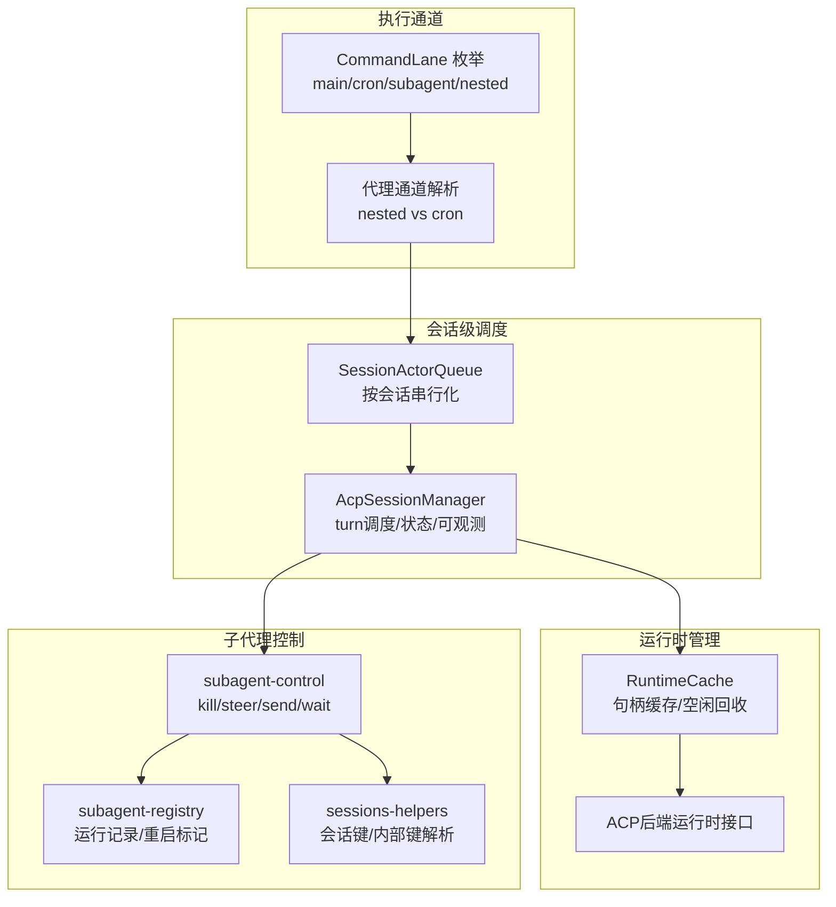
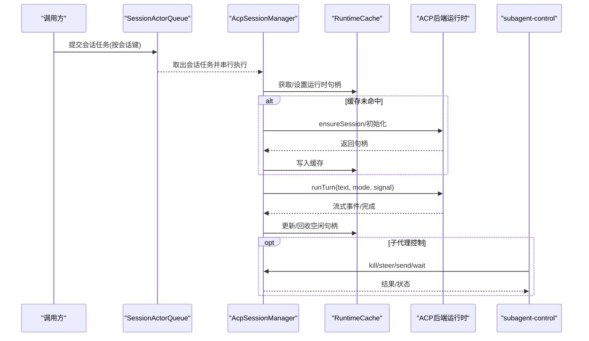
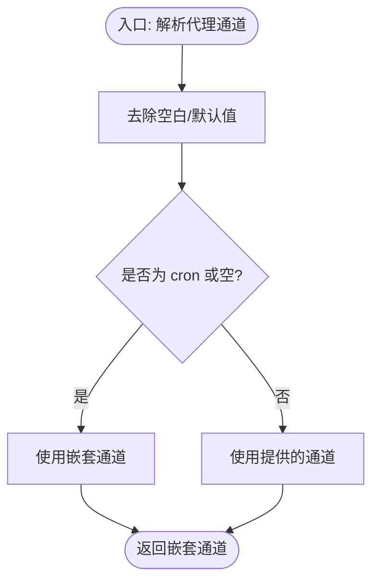
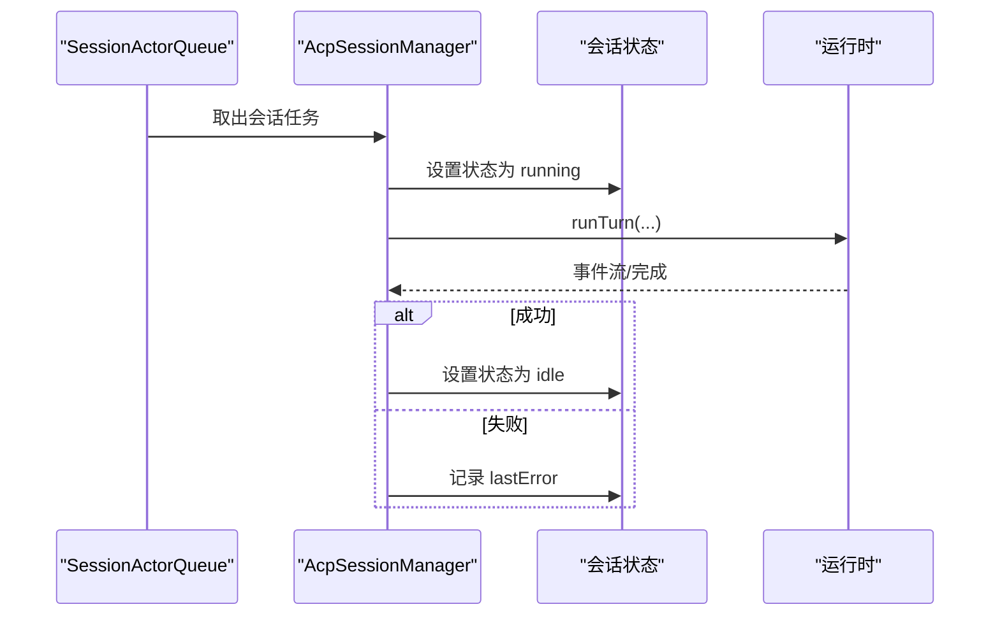
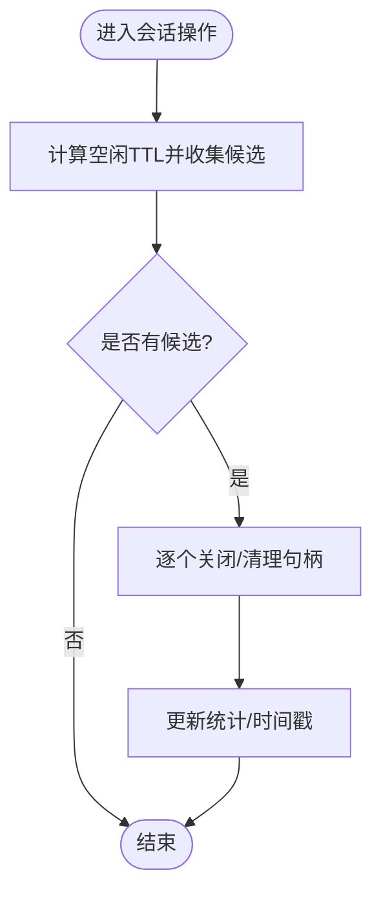
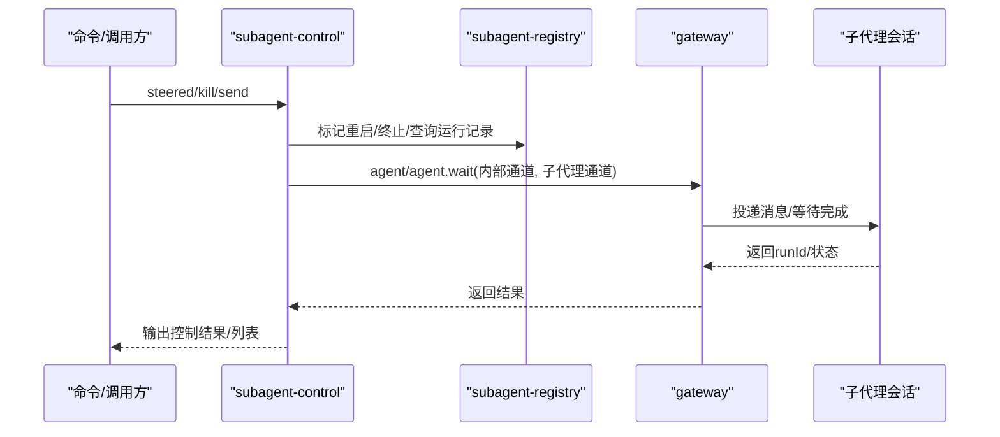
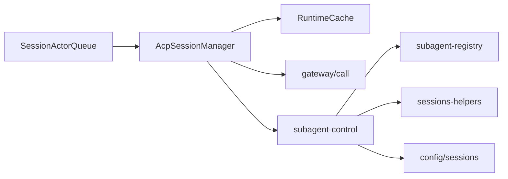

# 并发控制优化

<cite>
**本文引用的文件**
- [src/process/lanes.ts](file://src/process/lanes.ts)
- [src/agents/lanes.ts](file://src/agents/lanes.ts)
- [src/agents/subagent-control.ts](file://src/agents/subagent-control.ts)
- [src/agents/subagent-lifecycle-events.ts](file://src/agents/subagent-lifecycle-events.ts)
- [src/acp/control-plane/manager.core.ts](file://src/acp/control-plane/manager.core.ts)
- [src/acp/control-plane/session-actor-queue.ts](file://src/acp/control-plane/session-actor-queue.ts)
- [src/acp/control-plane/runtime-cache.ts](file://src/acp/control-plane/runtime-cache.ts)
- [src/acp/control-plane/manager.types.ts](file://src/acp/control-plane/manager.types.ts)
- [src/agents/acp-spawn.ts](file://src/agents/acp-spawn.ts)
- [src/agents/subagent-registry.ts](file://src/agents/subagent-registry.ts)
- [src/agents/tools/sessions-helpers.ts](file://src/agents/tools/sessions-helpers.ts)
- [src/gateway/call.ts](file://src/gateway/call.ts)
- [src/utils/message-channel.js](file://src/utils/message-channel.js)
- [src/routing/session-key.js](file://src/routing/session-key.js)
- [src/config/sessions.js](file://src/config/sessions.js)
- [src/shared/subagents-format.js](file://src/shared/subagents-format.js)
- [src/auto-reply/reply/commands-subagents/shared.ts](file://src/auto-reply/reply/commands-subagents/shared.ts)
- [src/agents/pi-embedded-runner/compaction-safety-timeout.ts](file://src/agents/pi-embedded-runner/compaction-safety-timeout.ts)
- [src/shared/usage-aggregates.ts](file://src/shared/usage-aggregates.ts)
- [ui/src/ui/views/usage-render-overview.ts](file://ui/src/ui/views/usage-render-overview.ts)
</cite>

## 目录
1. [引言](#引言)
2. [项目结构](#项目结构)
3. [核心组件](#核心组件)
4. [架构总览](#架构总览)
5. [详细组件分析](#详细组件分析)
6. [依赖关系分析](#依赖关系分析)
7. [性能考量](#性能考量)
8. [故障排查指南](#故障排查指南)
9. [结论](#结论)
10. [附录](#附录)

## 引言
本文件面向OpenClaw的并发控制与性能优化，聚焦于代理并发执行策略、任务调度机制、资源竞争控制等核心优化技术。文档系统化阐述子代理管理、执行通道控制、上下文切换优化等关键技术实现，提供并发性能提升、死锁避免、资源利用率优化的具体实施方案，并给出并发监控指标、性能瓶颈分析与执行效率评估的实用工具与方法，帮助通过并发控制策略与资源管理优化提升代理系统的整体执行效率。

## 项目结构
OpenClaw在并发控制方面采用“会话级执行器队列 + 运行时缓存 + 通道隔离”的分层设计：
- 执行通道与会话隔离：通过命令通道枚举与代理通道解析，确保不同任务在独立通道内有序执行，避免跨通道资源争用。
- 会话级串行化：以会话为单位的异步队列保证同一会话内的并发操作串行化，降低竞态条件。
- 运行时生命周期管理：运行时句柄缓存与空闲回收策略，平衡启动成本与资源占用。
- 子代理控制：基于会话键的控制器解析、运行记录管理与消息/控制下发，支持受控重启、终止与消息透传。

图表来源
- [src/process/lanes.ts:1-7](file://src/process/lanes.ts#L1-L7)
- [src/agents/lanes.ts:1-15](file://src/agents/lanes.ts#L1-L15)
- [src/acp/control-plane/session-actor-queue.ts:1-39](file://src/acp/control-plane/session-actor-queue.ts#L1-L39)
- [src/acp/control-plane/manager.core.ts:72-87](file://src/acp/control-plane/manager.core.ts#L72-L87)
- [src/acp/control-plane/runtime-cache.ts:25-100](file://src/acp/control-plane/runtime-cache.ts#L25-L100)
- [src/agents/subagent-control.ts:1-769](file://src/agents/subagent-control.ts#L1-L769)
- [src/agents/subagent-registry.ts](file://src/agents/subagent-registry.ts)
- [src/agents/tools/sessions-helpers.ts](file://src/agents/tools/sessions-helpers.ts)

章节来源
- [src/process/lanes.ts:1-7](file://src/process/lanes.ts#L1-L7)
- [src/agents/lanes.ts:1-15](file://src/agents/lanes.ts#L1-L15)
- [src/acp/control-plane/session-actor-queue.ts:1-39](file://src/acp/control-plane/session-actor-queue.ts#L1-L39)
- [src/acp/control-plane/manager.core.ts:72-87](file://src/acp/control-plane/manager.core.ts#L72-L87)
- [src/acp/control-plane/runtime-cache.ts:25-100](file://src/acp/control-plane/runtime-cache.ts#L25-L100)

## 核心组件
- 执行通道与会话隔离
  - 命令通道枚举定义了main、cron、subagent、nested四种通道，用于区分任务类型与优先级。
  - 代理通道解析逻辑确保嵌套代理不继承cron通道，避免cron占用通道导致内部工作无法调度。
- 会话级串行化与turn调度
  - 以会话为键的异步队列确保同一会话内并发操作串行化，避免跨线程共享状态引发的竞态。
  - ACP会话管理器负责turn的生命周期、错误统计、可观测快照与运行时句柄缓存。
- 运行时缓存与空闲回收
  - 运行时句柄缓存减少重复初始化成本，空闲候选收集与TTL回收策略控制资源占用。
- 子代理控制与消息透传
  - 控制器解析、运行记录管理、受控重启/终止、消息发送与等待，结合内部消息通道与会话键，实现细粒度的子代理生命周期管理。

章节来源
- [src/process/lanes.ts:1-7](file://src/process/lanes.ts#L1-L7)
- [src/agents/lanes.ts:6-14](file://src/agents/lanes.ts#L6-L14)
- [src/acp/control-plane/session-actor-queue.ts:23-37](file://src/acp/control-plane/session-actor-queue.ts#L23-L37)
- [src/acp/control-plane/manager.core.ts:593-734](file://src/acp/control-plane/manager.core.ts#L593-L734)
- [src/acp/control-plane/runtime-cache.ts:92-98](file://src/acp/control-plane/runtime-cache.ts#L92-L98)
- [src/agents/subagent-control.ts:526-685](file://src/agents/subagent-control.ts#L526-L685)

## 架构总览
下图展示从任务提交到turn完成的关键路径，包括通道选择、会话串行化、运行时缓存命中与回收、以及子代理控制流程。

图表来源
- [src/acp/control-plane/session-actor-queue.ts:23-37](file://src/acp/control-plane/session-actor-queue.ts#L23-L37)
- [src/acp/control-plane/manager.core.ts:593-734](file://src/acp/control-plane/manager.core.ts#L593-L734)
- [src/acp/control-plane/runtime-cache.ts:36-72](file://src/acp/control-plane/runtime-cache.ts#L36-L72)
- [src/agents/subagent-control.ts:460-524](file://src/agents/subagent-control.ts#L460-L524)

## 详细组件分析

### 组件A：执行通道与会话隔离
- 设计要点
  - 通道枚举统一管理任务类型，代理通道解析避免嵌套代理继承cron通道，防止通道拥塞。
  - 代理通道常量导出供子代理控制模块使用，确保消息与控制在正确的通道内执行。
- 关键实现位置
  - 通道枚举与代理通道解析：[src/process/lanes.ts:1-7](file://src/process/lanes.ts#L1-L7)，[src/agents/lanes.ts:1-15](file://src/agents/lanes.ts#L1-L15)
  - 子代理控制中通道使用：[src/agents/subagent-control.ts:713](file://src/agents/subagent-control.ts#L713)

图表来源
- [src/agents/lanes.ts:6-14](file://src/agents/lanes.ts#L6-L14)

章节来源
- [src/process/lanes.ts:1-7](file://src/process/lanes.ts#L1-L7)
- [src/agents/lanes.ts:1-15](file://src/agents/lanes.ts#L1-L15)
- [src/agents/subagent-control.ts:713](file://src/agents/subagent-control.ts#L713)

### 组件B：会话级串行化与turn调度
- 设计要点
  - 以会话键为队列键，确保同一会话的任务串行执行，避免跨任务共享状态的竞态。
  - ACP会话管理器封装turn生命周期：状态维护、错误归因、可观测快照、运行时句柄缓存与回收。
- 关键实现位置
  - 会话队列与统计：[src/acp/control-plane/session-actor-queue.ts:1-39](file://src/acp/control-plane/session-actor-queue.ts#L1-L39)
  - turn调度与状态机：[src/acp/control-plane/manager.core.ts:593-734](file://src/acp/control-plane/manager.core.ts#L593-L734)
  - 观测快照与错误统计：[src/acp/control-plane/manager.core.ts:121-144](file://src/acp/control-plane/manager.core.ts#L121-L144)，[src/acp/control-plane/manager.types.ts:96-112](file://src/acp/control-plane/manager.types.ts#L96-L112)

图表来源
- [src/acp/control-plane/session-actor-queue.ts:23-37](file://src/acp/control-plane/session-actor-queue.ts#L23-L37)
- [src/acp/control-plane/manager.core.ts:626-732](file://src/acp/control-plane/manager.core.ts#L626-L732)

章节来源
- [src/acp/control-plane/session-actor-queue.ts:1-39](file://src/acp/control-plane/session-actor-queue.ts#L1-L39)
- [src/acp/control-plane/manager.core.ts:593-734](file://src/acp/control-plane/manager.core.ts#L593-L734)
- [src/acp/control-plane/manager.types.ts:96-112](file://src/acp/control-plane/manager.types.ts#L96-L112)

### 组件C：运行时缓存与空闲回收
- 设计要点
  - 运行时句柄缓存减少重复初始化开销；空闲候选收集与TTL回收策略控制资源占用。
  - 回收触发时机：启动新会话或查询状态前进行空闲回收，避免缓存膨胀。
- 关键实现位置
  - 缓存结构与快照：[src/acp/control-plane/runtime-cache.ts:25-100](file://src/acp/control-plane/runtime-cache.ts#L25-L100)
  - 空闲回收策略：[src/acp/control-plane/manager.core.ts:1097-1109](file://src/acp/control-plane/manager.core.ts#L1097-L1109)

图表来源
- [src/acp/control-plane/manager.core.ts:1097-1109](file://src/acp/control-plane/manager.core.ts#L1097-L1109)
- [src/acp/control-plane/runtime-cache.ts:92-98](file://src/acp/control-plane/runtime-cache.ts#L92-L98)

章节来源
- [src/acp/control-plane/runtime-cache.ts:25-100](file://src/acp/control-plane/runtime-cache.ts#L25-L100)
- [src/acp/control-plane/manager.core.ts:1097-1109](file://src/acp/control-plane/manager.core.ts#L1097-L1109)

### 组件D：子代理管理与控制
- 设计要点
  - 控制器解析：根据调用者会话键判断是否为子代理、控制范围（仅子代/无控制），确保权限边界。
  - 运行记录管理：支持受控重启标记、替换、终止标记与后代计数，便于批量控制与级联终止。
  - 消息透传与等待：通过网关调用将消息投递至指定子代理会话，支持等待完成或超时。
- 关键实现位置
  - 控制器解析与权限校验：[src/agents/subagent-control.ts:117-145](file://src/agents/subagent-control.ts#L117-L145)
  - 受控重启/终止/消息发送：[src/agents/subagent-control.ts:526-685](file://src/agents/subagent-control.ts#L526-L685)，[src/agents/subagent-control.ts:687-745](file://src/agents/subagent-control.ts#L687-L745)
  - 运行记录与重启标记：[src/agents/subagent-registry.ts](file://src/agents/subagent-registry.ts)
  - 会话键解析与内部键转换：[src/agents/tools/sessions-helpers.ts](file://src/agents/tools/sessions-helpers.ts)
  - 网关调用与内部通道：[src/gateway/call.ts](file://src/gateway/call.ts)，[src/utils/message-channel.js](file://src/utils/message-channel.js)
  - 会话键工具：[src/routing/session-key.js](file://src/routing/session-key.js)
  - 会话存储与更新：[src/config/sessions.js](file://src/config/sessions.js)
  - 列表构建与格式化：[src/shared/subagents-format.js](file://src/shared/subagents-format.js)
  - 命令场景下的控制器解析：[src/auto-reply/reply/commands-subagents/shared.ts:253-274](file://src/auto-reply/reply/commands-subagents/shared.ts#L253-L274)

图表来源
- [src/agents/subagent-control.ts:526-685](file://src/agents/subagent-control.ts#L526-L685)
- [src/agents/subagent-control.ts:687-745](file://src/agents/subagent-control.ts#L687-L745)
- [src/gateway/call.ts](file://src/gateway/call.ts)
- [src/utils/message-channel.js](file://src/utils/message-channel.js)

章节来源
- [src/agents/subagent-control.ts:117-145](file://src/agents/subagent-control.ts#L117-L145)
- [src/agents/subagent-control.ts:526-685](file://src/agents/subagent-control.ts#L526-L685)
- [src/agents/subagent-control.ts:687-745](file://src/agents/subagent-control.ts#L687-L745)
- [src/agents/subagent-registry.ts](file://src/agents/subagent-registry.ts)
- [src/agents/tools/sessions-helpers.ts](file://src/agents/tools/sessions-helpers.ts)
- [src/gateway/call.ts](file://src/gateway/call.ts)
- [src/utils/message-channel.js](file://src/utils/message-channel.js)
- [src/routing/session-key.js](file://src/routing/session-key.js)
- [src/config/sessions.js](file://src/config/sessions.js)
- [src/shared/subagents-format.js](file://src/shared/subagents-format.js)
- [src/auto-reply/reply/commands-subagents/shared.ts:253-274](file://src/auto-reply/reply/commands-subagents/shared.ts#L253-L274)

### 组件E：上下文切换与超时保护
- 设计要点
  - 安全超时：嵌入式运行时压缩过程设置安全超时，避免长时间阻塞影响主循环。
  - 速率限制：子代理steer操作加入速率限制，防止频繁重启造成抖动。
- 关键实现位置
  - 安全超时封装：[src/agents/pi-embedded-runner/compaction-safety-timeout.ts:5-10](file://src/agents/pi-embedded-runner/compaction-safety-timeout.ts#L5-L10)
  - steer速率限制：[src/agents/subagent-control.ts:587-600](file://src/agents/subagent-control.ts#L587-L600)

章节来源
- [src/agents/pi-embedded-runner/compaction-safety-timeout.ts:5-10](file://src/agents/pi-embedded-runner/compaction-safety-timeout.ts#L5-L10)
- [src/agents/subagent-control.ts:587-600](file://src/agents/subagent-control.ts#L587-L600)

## 依赖关系分析
- 组件耦合与内聚
  - 会话队列与管理器高内聚：队列负责串行化，管理器负责turn生命周期与可观测，二者通过会话键解耦。
  - 运行时缓存与管理器弱耦合：缓存作为可插拔组件，管理器仅通过接口访问，便于替换后端。
  - 子代理控制模块依赖会话键解析、网关调用与运行记录，形成清晰的职责边界。
- 外部依赖与集成点
  - 网关调用用于消息投递与等待，内部通道用于子代理控制消息隔离。
  - 会话存储用于持久化会话元数据与运行记录，支撑控制与可观测。

图表来源
- [src/acp/control-plane/session-actor-queue.ts:23-37](file://src/acp/control-plane/session-actor-queue.ts#L23-L37)
- [src/acp/control-plane/manager.core.ts:593-734](file://src/acp/control-plane/manager.core.ts#L593-L734)
- [src/acp/control-plane/runtime-cache.ts:36-72](file://src/acp/control-plane/runtime-cache.ts#L36-L72)
- [src/agents/subagent-control.ts:687-745](file://src/agents/subagent-control.ts#L687-L745)
- [src/gateway/call.ts](file://src/gateway/call.ts)
- [src/agents/subagent-registry.ts](file://src/agents/subagent-registry.ts)
- [src/agents/tools/sessions-helpers.ts](file://src/agents/tools/sessions-helpers.ts)
- [src/config/sessions.js](file://src/config/sessions.js)

章节来源
- [src/acp/control-plane/session-actor-queue.ts:1-39](file://src/acp/control-plane/session-actor-queue.ts#L1-L39)
- [src/acp/control-plane/manager.core.ts:72-87](file://src/acp/control-plane/manager.core.ts#L72-L87)
- [src/acp/control-plane/runtime-cache.ts:25-100](file://src/acp/control-plane/runtime-cache.ts#L25-L100)
- [src/agents/subagent-control.ts:1-769](file://src/agents/subagent-control.ts#L1-L769)

## 性能考量
- 并发性能提升
  - 通道隔离：通过通道枚举与代理通道解析，避免嵌套代理与cron任务互相抢占通道，提升吞吐。
  - 会话串行化：同一会话内串行化减少共享状态竞争，降低锁竞争与回滚概率。
  - 运行时缓存：复用运行时句柄，显著降低初始化开销；空闲回收避免长期占用。
- 死锁避免
  - 会话队列确保串行化，避免多线程同时修改同一会话状态。
  - 子代理控制中的等待与取消通过AbortController与超时机制，避免无限阻塞。
- 资源利用率优化
  - TTL空闲回收与可观测快照帮助识别热点会话与空闲句柄，动态调整资源分配。
  - 子代理列表构建与后代计数，支持批量终止与级联清理，释放下游资源。

[本节为通用性能讨论，无需特定文件分析]

## 故障排查指南
- 并发监控指标
  - 观测快照字段：活动会话数、队列深度、turn完成/失败数、平均/最大延迟、错误码分布。
  - 使用位置：[src/acp/control-plane/manager.types.ts:96-112](file://src/acp/control-plane/manager.types.ts#L96-L112)，[src/acp/control-plane/manager.core.ts:121-144](file://src/acp/control-plane/manager.core.ts#L121-L144)
- 性能瓶颈分析
  - 队列深度与平均延迟：若队列深度持续升高且平均延迟上升，需检查通道配置与会话热点。
  - 错误码分布：高频错误码有助于定位后端异常或配置问题。
- 执行效率评估
  - 使用令牌用量与耗时格式化工具辅助评估单次turn的效率与成本。
  - 使用位置：[src/shared/subagents-format.js](file://src/shared/subagents-format.js)
- 常见问题定位
  - 子代理控制失败：检查控制器权限、会话键解析与网关调用返回；确认通道与内部消息通道配置。
  - turn失败：查看turn完成统计与错误码记录，结合后端getStatus与标识符一致性校验。
  - 超时与阻塞：检查steer速率限制、等待超时与安全超时设置。

章节来源
- [src/acp/control-plane/manager.types.ts:96-112](file://src/acp/control-plane/manager.types.ts#L96-L112)
- [src/acp/control-plane/manager.core.ts:121-144](file://src/acp/control-plane/manager.core.ts#L121-L144)
- [src/shared/subagents-format.js](file://src/shared/subagents-format.js)
- [src/agents/subagent-control.ts:526-685](file://src/agents/subagent-control.ts#L526-L685)

## 结论
OpenClaw通过“通道隔离 + 会话串行化 + 运行时缓存 + 子代理控制”形成了稳健的并发控制体系。该体系在保障安全性的同时，有效提升了吞吐与资源利用率，并提供了完善的可观测与故障定位能力。建议在实际部署中结合观测快照与错误码分布，持续优化通道配置与会话热点治理，进一步提升整体执行效率。

[本节为总结性内容，无需特定文件分析]

## 附录
- 相关实现参考路径
  - 通道枚举与代理通道解析：[src/process/lanes.ts:1-7](file://src/process/lanes.ts#L1-L7)，[src/agents/lanes.ts:1-15](file://src/agents/lanes.ts#L1-L15)
  - 会话队列与turn调度：[src/acp/control-plane/session-actor-queue.ts:1-39](file://src/acp/control-plane/session-actor-queue.ts#L1-L39)，[src/acp/control-plane/manager.core.ts:593-734](file://src/acp/control-plane/manager.core.ts#L593-L734)
  - 运行时缓存与回收：[src/acp/control-plane/runtime-cache.ts:25-100](file://src/acp/control-plane/runtime-cache.ts#L25-L100)，[src/acp/control-plane/manager.core.ts:1097-1109](file://src/acp/control-plane/manager.core.ts#L1097-L1109)
  - 子代理控制与消息透传：[src/agents/subagent-control.ts:1-769](file://src/agents/subagent-control.ts#L1-L769)
  - 会话键解析与内部通道：[src/agents/tools/sessions-helpers.ts](file://src/agents/tools/sessions-helpers.ts)，[src/utils/message-channel.js](file://src/utils/message-channel.js)
  - 安全超时与速率限制：[src/agents/pi-embedded-runner/compaction-safety-timeout.ts:5-10](file://src/agents/pi-embedded-runner/compaction-safety-timeout.ts#L5-L10)，[src/agents/subagent-control.ts:587-600](file://src/agents/subagent-control.ts#L587-L600)