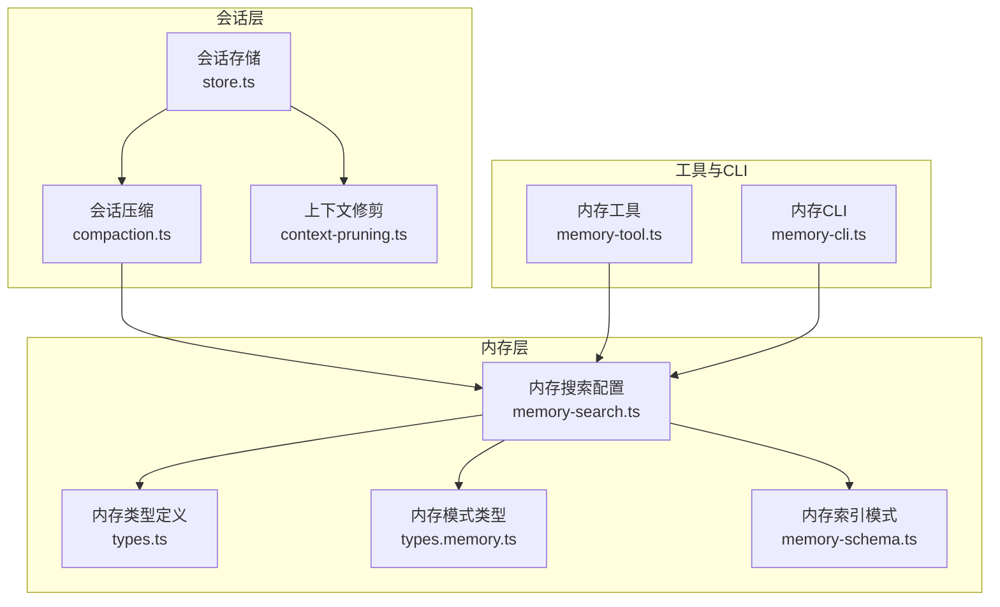
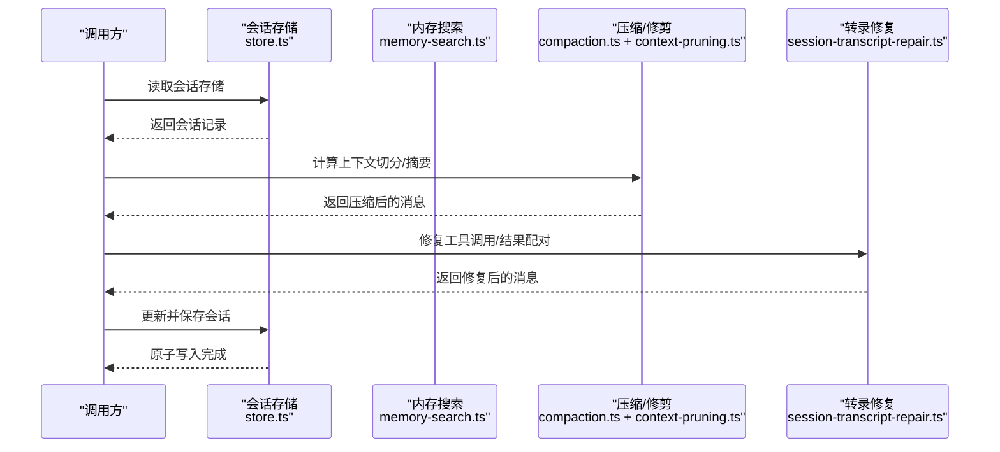
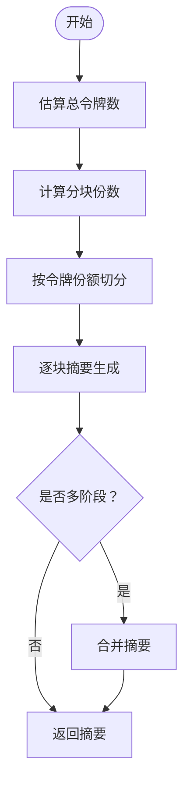
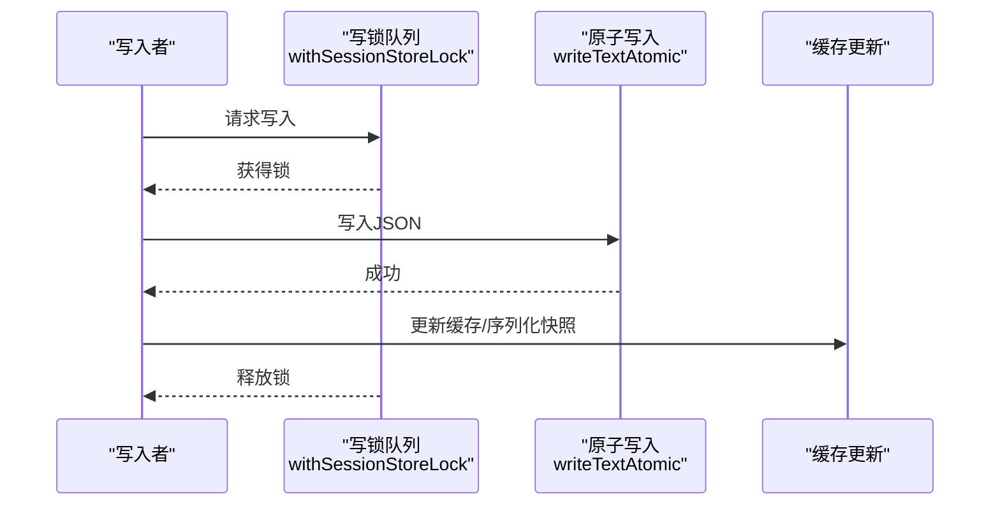
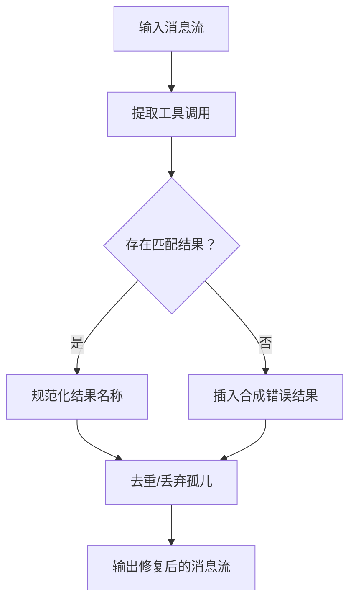
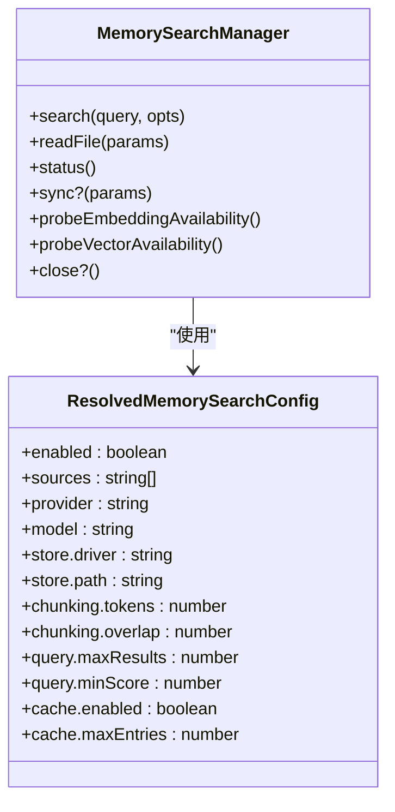
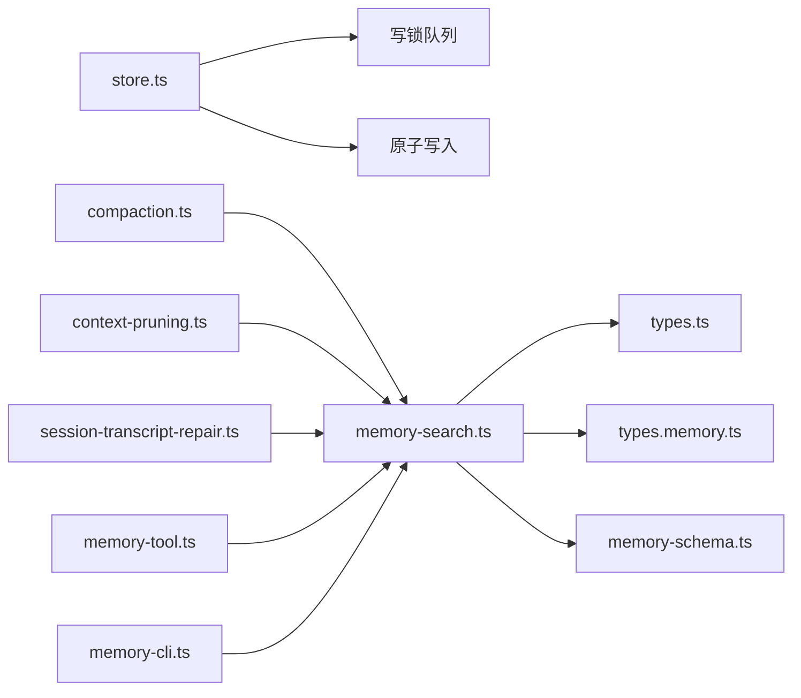

# 会话内存管理

<cite>
**本文档引用的文件**
- [compaction.ts](file://src/agents/compaction.ts)
- [session-transcript-repair.ts](file://src/agents/session-transcript-repair.ts)
- [store.ts](file://src/config/sessions/store.ts)
- [store.pruning.test.ts](file://src/config/sessions/store.pruning.test.ts)
- [context-pruning.ts](file://src/agents/pi-extensions/context-pruning.ts)
- [memory-schema.ts](file://src/memory/memory-schema.ts)
- [memory-tool.ts](file://src/agents/tools/memory-tool.ts)
- [memory-cli.ts](file://src/cli/memory-cli.ts)
- [types.memory.ts](file://src/config/types.memory.ts)
- [types.ts](file://src/config/sessions/types.ts)
- [memory-search.ts](file://src/agents/memory-search.ts)
- [types.ts](file://src/memory/types.ts)
</cite>

## 目录
1. [引言](#引言)
2. [项目结构](#项目结构)
3. [核心组件](#核心组件)
4. [架构总览](#架构总览)
5. [详细组件分析](#详细组件分析)
6. [依赖关系分析](#依赖关系分析)
7. [性能考量](#性能考量)
8. [故障排查指南](#故障排查指南)
9. [结论](#结论)

## 引言
本文件系统性阐述 OpenClaw 的会话内存管理机制，覆盖会话生命周期中的内存策略：会话压缩（compaction）、工具结果缓存、转录修复、自动清理、内存保留阈值与预压缩刷新等。文档同时给出状态管理、持久化策略与内存释放时机，并提供优化建议与最佳实践。

## 项目结构
围绕会话内存管理的关键模块分布如下：
- 会话压缩与上下文修剪：src/agents/compaction.ts、src/agents/pi-extensions/context-pruning.ts
- 会话存储与维护：src/config/sessions/store.ts、src/config/sessions/store.pruning.test.ts
- 转录修复与工具结果配对：src/agents/session-transcript-repair.ts
- 内存后端与索引：src/memory/memory-schema.ts、src/agents/memory-search.ts、src/memory/types.ts
- 工具与CLI：src/agents/tools/memory-tool.ts、src/cli/memory-cli.ts
- 配置类型：src/config/types.memory.ts、src/config/sessions/types.ts

**图表来源**
- [store.ts](file://src/config/sessions/store.ts)
- [compaction.ts](file://src/agents/compaction.ts)
- [context-pruning.ts](file://src/agents/pi-extensions/context-pruning.ts)
- [memory-search.ts](file://src/agents/memory-search.ts)
- [types.ts](file://src/memory/types.ts)
- [types.memory.ts](file://src/config/types.memory.ts)
- [memory-schema.ts](file://src/memory/memory-schema.ts)
- [memory-tool.ts](file://src/agents/tools/memory-tool.ts)
- [memory-cli.ts](file://src/cli/memory-cli.ts)

**章节来源**
- [store.ts](file://src/config/sessions/store.ts)
- [compaction.ts](file://src/agents/compaction.ts)
- [context-pruning.ts](file://src/agents/pi-extensions/context-pruning.ts)
- [memory-search.ts](file://src/agents/memory-search.ts)
- [types.ts](file://src/memory/types.ts)
- [types.memory.ts](file://src/config/types.memory.ts)
- [memory-schema.ts](file://src/memory/memory-schema.ts)
- [memory-tool.ts](file://src/agents/tools/memory-tool.ts)
- [memory-cli.ts](file://src/cli/memory-cli.ts)

## 核心组件
- 会话压缩（Compaction）：将历史消息按令牌预算切分、分块摘要、多阶段合并摘要，确保上下文不超限且保留关键信息。
- 上下文修剪（Context Pruning）：针对当前请求的内存上下文进行微压缩，不影响磁盘持久化的历史。
- 会话存储与维护：提供会话记录的读写、缓存、维护（过期剔除、数量上限、文件轮换、磁盘配额）与原子落盘。
- 转录修复（Transcript Repair）：修复工具调用与结果的配对、去重、孤儿结果处理，保证严格模型接口兼容。
- 内存后端与索引：支持 SQLite 向量索引、嵌入缓存、FTS 检索、QMD 索引等，提供检索、统计与再索引能力。
- 工具与CLI：内存搜索工具与CLI命令用于查询、状态检查与强制重建索引。

**章节来源**
- [compaction.ts](file://src/agents/compaction.ts)
- [context-pruning.ts](file://src/agents/pi-extensions/context-pruning.ts)
- [store.ts](file://src/config/sessions/store.ts)
- [session-transcript-repair.ts](file://src/agents/session-transcript-repair.ts)
- [memory-search.ts](file://src/agents/memory-search.ts)
- [memory-tool.ts](file://src/agents/tools/memory-tool.ts)
- [memory-cli.ts](file://src/cli/memory-cli.ts)

## 架构总览
会话内存管理贯穿“读取—压缩/修剪—写回—维护”的闭环：
- 读取：从会话存储加载并应用迁移与缓存。
- 压缩/修剪：根据上下文窗口与策略进行消息切分与摘要生成；或仅对当前请求做上下文修剪。
- 写回：原子写入会话存储，更新缓存与序列化快照。
- 维护：定期执行过期剔除、数量上限、文件轮换、磁盘配额清理与归档。

**图表来源**
- [store.ts](file://src/config/sessions/store.ts)
- [compaction.ts](file://src/agents/compaction.ts)
- [context-pruning.ts](file://src/agents/pi-extensions/context-pruning.ts)
- [session-transcript-repair.ts](file://src/agents/session-transcript-repair.ts)

## 详细组件分析

### 会话压缩（Compaction）
- 切分策略：基于令牌估算与安全系数，将消息按目标份额切分为多个块；支持自适应块比例以适配平均消息大小。
- 摘要生成：分块摘要，必要时进行多阶段合并摘要；失败时提供降级路径（仅记录概要）。
- 安全与限制：对单条消息过大场景进行保护，避免摘要超限；在摘要过程中移除敏感字段（如工具结果详情）。
- 工具结果配对修复：在丢弃块时修复工具调用与结果的配对，避免“意外工具ID”错误。

**图表来源**
- [compaction.ts](file://src/agents/compaction.ts)

**章节来源**
- [compaction.ts](file://src/agents/compaction.ts)

### 上下文修剪（Context Pruning）
- 作用范围：仅影响当前请求的内存上下文，不修改磁盘上的会话历史。
- 配置与设置：导出修剪函数与有效设置解析器，支持默认与自定义配置。

**章节来源**
- [context-pruning.ts](file://src/agents/pi-extensions/context-pruning.ts)

### 会话存储与维护（Store & Maintenance）
- 缓存与TTL：支持会话存储缓存与TTL控制，通过环境变量调节缓存寿命。
- 原子写入：采用原子写入保障并发一致性，Windows平台具备重试与容错。
- 维护策略：过期剔除（stale pruning）、数量上限（entry cap）、文件轮换（rotation）、磁盘配额清理与归档。
- 锁队列：基于会话文件的写锁队列，避免并发写冲突。
- 元数据与归档：删除或重置会话时归档其转录目录，支持按原因清理。

**图表来源**
- [store.ts](file://src/config/sessions/store.ts)

**章节来源**
- [store.ts](file://src/config/sessions/store.ts)
- [store.pruning.test.ts](file://src/config/sessions/store.pruning.test.ts)

### 转录修复（Transcript Repair）
- 工具调用输入修复：过滤无效/不完整工具调用块，必要时标准化名称。
- 工具调用与结果配对修复：移动/插入/去重/丢弃孤儿结果，确保严格模型接口要求。
- 敏感内容处理：对大型附件参数进行脱敏，避免持久化敏感内容。

**图表来源**
- [session-transcript-repair.ts](file://src/agents/session-transcript-repair.ts)

**章节来源**
- [session-transcript-repair.ts](file://src/agents/session-transcript-repair.ts)

### 内存后端与索引（Memory Backend & Schema）
- 索引模式：SQLite 表结构、向量嵌入缓存表、可选 FTS 虚拟表；支持动态列与索引。
- 搜索配置：提供内存搜索的默认与覆盖配置，包含源路径、批处理、混合检索、缓存上限等。
- CLI与工具：CLI 支持状态检查、深度探测、强制重建索引；工具提供检索与片段读取。

**图表来源**
- [memory-search.ts](file://src/agents/memory-search.ts)
- [types.ts](file://src/memory/types.ts)

**章节来源**
- [memory-schema.ts](file://src/memory/memory-schema.ts)
- [memory-search.ts](file://src/agents/memory-search.ts)
- [types.ts](file://src/memory/types.ts)
- [types.memory.ts](file://src/config/types.memory.ts)
- [memory-tool.ts](file://src/agents/tools/memory-tool.ts)
- [memory-cli.ts](file://src/cli/memory-cli.ts)

### 会话工具结果的状态管理与持久化
- 状态字段：会话条目包含令牌用量、压缩计数、记忆刷新时间戳等，用于上下文利用度与压缩触发判断。
- 持久化策略：每次会话更新均通过原子写入落盘，维护缓存与序列化快照，确保一致性。
- 释放时机：当会话被剔除或重置时，与其关联的转录文件会被归档并按策略清理。

**章节来源**
- [types.ts](file://src/config/sessions/types.ts)
- [store.ts](file://src/config/sessions/store.ts)

## 依赖关系分析
- 会话存储依赖于写锁队列与原子写入，确保并发安全。
- 压缩与修剪依赖于内存搜索配置与上下文窗口，以保证摘要质量与稳定性。
- 转录修复依赖于工具调用解析与结果配对算法，确保严格模型接口兼容。
- 内存后端依赖于 SQLite/FTS/向量扩展，CLI与工具通过统一的管理器接口访问。

**图表来源**
- [store.ts](file://src/config/sessions/store.ts)
- [compaction.ts](file://src/agents/compaction.ts)
- [context-pruning.ts](file://src/agents/pi-extensions/context-pruning.ts)
- [session-transcript-repair.ts](file://src/agents/session-transcript-repair.ts)
- [memory-search.ts](file://src/agents/memory-search.ts)
- [types.ts](file://src/memory/types.ts)
- [types.memory.ts](file://src/config/types.memory.ts)
- [memory-schema.ts](file://src/memory/memory-schema.ts)
- [memory-tool.ts](file://src/agents/tools/memory-tool.ts)
- [memory-cli.ts](file://src/cli/memory-cli.ts)

**章节来源**
- [store.ts](file://src/config/sessions/store.ts)
- [compaction.ts](file://src/agents/compaction.ts)
- [context-pruning.ts](file://src/agents/pi-extensions/context-pruning.ts)
- [session-transcript-repair.ts](file://src/agents/session-transcript-repair.ts)
- [memory-search.ts](file://src/agents/memory-search.ts)
- [types.ts](file://src/memory/types.ts)
- [types.memory.ts](file://src/config/types.memory.ts)
- [memory-schema.ts](file://src/memory/memory-schema.ts)
- [memory-tool.ts](file://src/agents/tools/memory-tool.ts)
- [memory-cli.ts](file://src/cli/memory-cli.ts)

## 性能考量
- 压缩与摘要成本：分块与摘要生成受消息数量与长度影响，建议合理设置分块令牌数与重叠，避免过度切分。
- 令牌估算误差：内置安全系数补偿估算偏差，实际运行中应结合模型上下文窗口与真实负载调整。
- 缓存与I/O：启用会话存储缓存可减少重复读取；原子写入在高并发下可能产生等待，建议合理设置超时与轮询间隔。
- 内存后端：向量索引与嵌入缓存可显著提升检索性能，但需关注磁盘占用与重建开销；FTS 可选启用以支持全文检索。
- 修剪策略：仅对当前请求做上下文修剪可降低整体负担，适合高频对话场景。

[本节为通用指导，无需列出具体文件来源]

## 故障排查指南
- 压缩失败降级：若全量摘要失败，系统会尝试仅摘要较小消息并记录大消息概要；若仍失败，返回简要说明。
- 工具结果配对异常：出现“意外工具ID”错误时，检查转录修复流程是否正确执行；确认工具调用与结果的配对完整性。
- 会话存储写入失败：Windows 平台可能出现临时文件锁定导致写入失败，系统内置重试；若持续失败，检查权限与磁盘空间。
- 维护策略未生效：确认维护配置（过期天数、最大条目数、轮换字节数、磁盘配额）是否正确；检查警告回调与应用报告。
- 内存后端不可用：通过 CLI 探测嵌入可用性与向量扩展状态；若失败，检查提供商凭据与网络连接。

**章节来源**
- [compaction.ts](file://src/agents/compaction.ts)
- [session-transcript-repair.ts](file://src/agents/session-transcript-repair.ts)
- [store.ts](file://src/config/sessions/store.ts)
- [memory-cli.ts](file://src/cli/memory-cli.ts)

## 结论
OpenClaw 的会话内存管理通过“压缩/修剪—修复—维护—索引”的协同机制，在保证模型接口兼容与检索质量的同时，实现了对内存与磁盘资源的高效利用。建议在生产环境中结合业务负载合理配置压缩策略、缓存TTL、维护阈值与内存后端参数，并通过CLI与工具进行持续监控与优化。