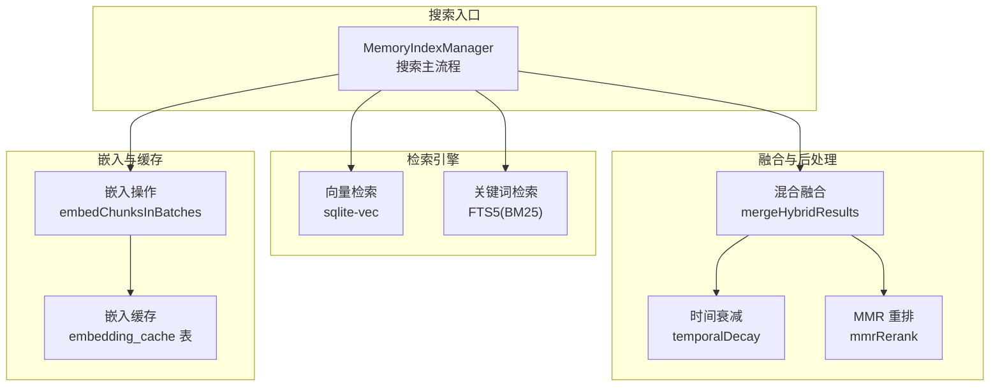
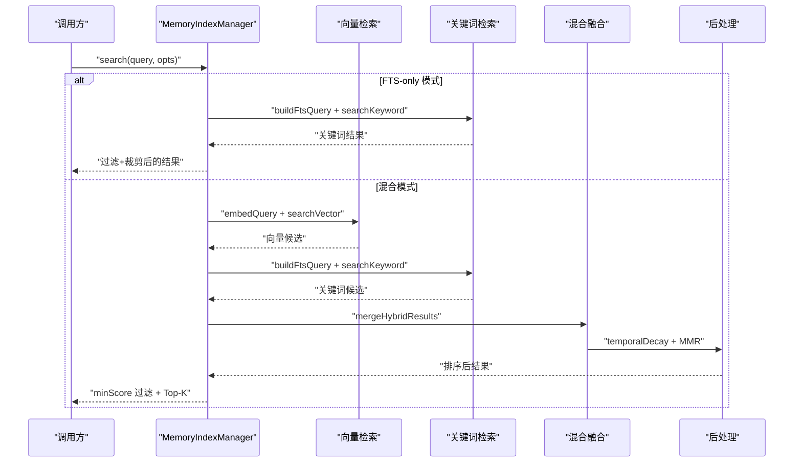
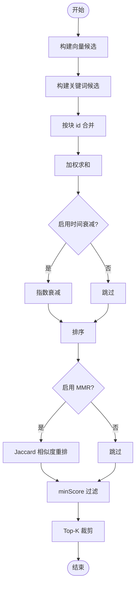
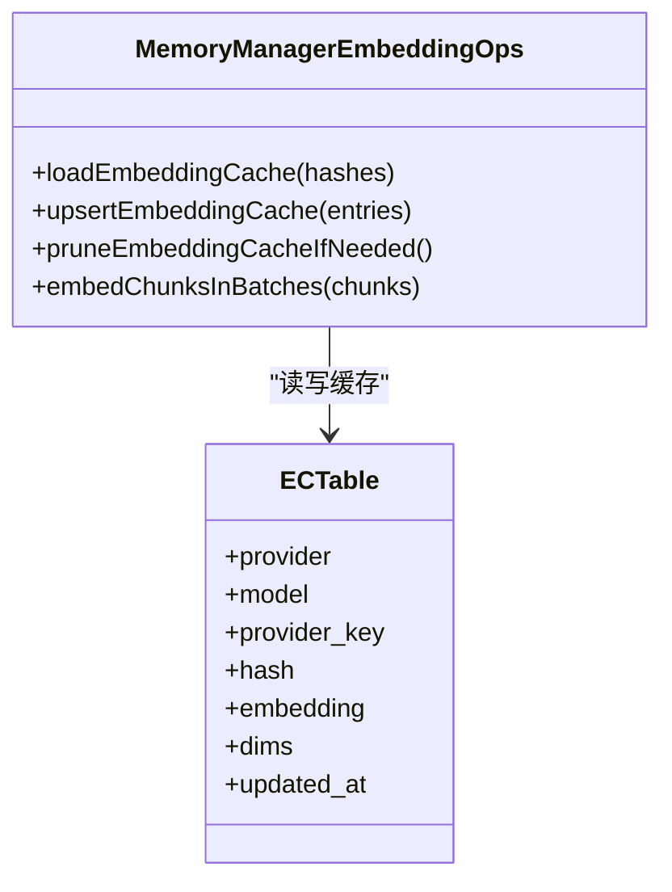
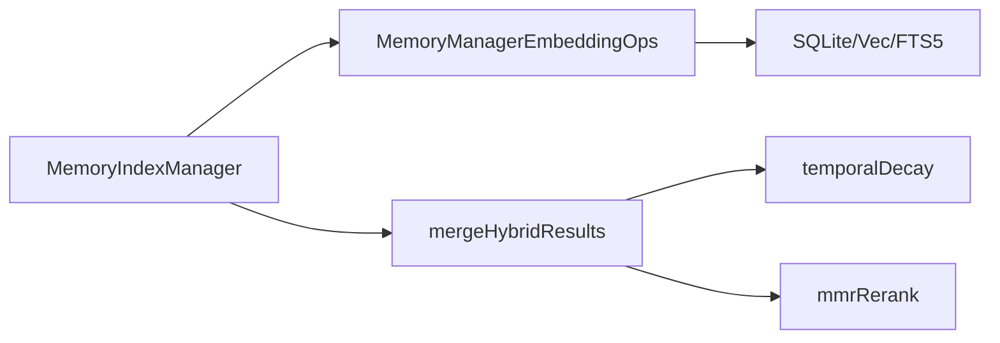

# 内存搜索性能优化

<cite>
**本文档引用的文件**
- [src/memory/hybrid.ts](file://src/memory/hybrid.ts)
- [src/memory/mmr.ts](file://src/memory/mmr.ts)
- [src/memory/temporal-decay.ts](file://src/memory/temporal-decay.ts)
- [src/memory/manager.ts](file://src/memory/manager.ts)
- [src/memory/manager-embedding-ops.ts](file://src/memory/manager-embedding-ops.ts)
- [src/memory/types.ts](file://src/memory/types.ts)
- [src/agents/memory-search.ts](file://src/agents/memory-search.ts)
- [src/memory/search-manager.ts](file://src/memory/search-manager.ts)
- [docs/concepts/memory.md](file://docs/concepts/memory.md)
- [src/memory/status-format.ts](file://src/memory/status-format.ts)
- [src/commands/status.scan.ts](file://src/commands/status.scan.ts)
- [src/memory/embeddings-debug.ts](file://src/memory/embeddings-debug.ts)
</cite>

## 目录
1. [简介](#简介)
2. [项目结构](#项目结构)
3. [核心组件](#核心组件)
4. [架构总览](#架构总览)
5. [详细组件分析](#详细组件分析)
6. [依赖关系分析](#依赖关系分析)
7. [性能考量](#性能考量)
8. [故障排查指南](#故障排查指南)
9. [结论](#结论)
10. [附录](#附录)

## 简介
本指南聚焦于 OpenClaw 内存搜索的性能优化，系统性剖析向量搜索、BM25 关键词搜索与混合检索的内存使用特征与优化策略；详解嵌入缓存机制、索引存储优化、查询结果合并算法的内存效率；并提供可操作的配置优化建议（候选集大小、权重分配、后处理阶段对性能的影响），以及性能监控指标、内存瓶颈识别方法与大规模数据集的优化策略。

## 项目结构
OpenClaw 的内存搜索由“内置 SQLite + sqlite-vec + FTS5”构成，支持向量检索、BM25 关键词检索与混合检索。核心模块包括：
- 搜索管理器：负责候选生成、权重融合、后处理与结果输出
- 嵌入与缓存：批量嵌入、缓存读写、过期淘汰
- 后处理：时间衰减、MMR 重排
- 配置解析：统一解析与归一化搜索参数

**图表来源**
- [src/memory/manager.ts:257-365](file://src/memory/manager.ts#L257-L365)
- [src/memory/hybrid.ts:57-155](file://src/memory/hybrid.ts#L57-L155)
- [src/memory/mmr.ts:116-182](file://src/memory/mmr.ts#L116-L182)
- [src/memory/temporal-decay.ts:121-167](file://src/memory/temporal-decay.ts#L121-L167)
- [src/memory/manager-embedding-ops.ts:185-226](file://src/memory/manager-embedding-ops.ts#L185-L226)

**章节来源**
- [src/memory/manager.ts:257-365](file://src/memory/manager.ts#L257-L365)
- [src/memory/hybrid.ts:57-155](file://src/memory/hybrid.ts#L57-L155)
- [src/memory/mmr.ts:116-182](file://src/memory/mmr.ts#L116-L182)
- [src/memory/temporal-decay.ts:121-167](file://src/memory/temporal-decay.ts#L121-L167)
- [src/memory/manager-embedding-ops.ts:185-226](file://src/memory/manager-embedding-ops.ts#L185-L226)

## 核心组件
- 搜索管理器（MemoryIndexManager）
  - 负责根据配置选择向量/关键词/混合模式，控制候选规模与阈值，执行后处理与裁剪
  - 关键路径：search → buildFtsQuery → searchVector/searchKeyword → mergeHybridResults → 后处理 → 过滤与Top-K
- 混合融合（mergeHybridResults）
  - 以块 id 合并向量与关键词结果，加权求和得到最终得分
  - 支持时间衰减与 MMR 重排
- MMR 重排（mmrRerank）
  - 使用 Jaccard 相似度衡量多样性，平衡相关性与重复
- 时间衰减（temporalDecay）
  - 基于半衰期指数衰减，优先近期内容
- 嵌入与缓存（MemoryManagerEmbeddingOps）
  - 批量嵌入、缓存命中/回填、过期淘汰、超时与重试

**章节来源**
- [src/memory/manager.ts:257-365](file://src/memory/manager.ts#L257-L365)
- [src/memory/hybrid.ts:57-155](file://src/memory/hybrid.ts#L57-L155)
- [src/memory/mmr.ts:116-182](file://src/memory/mmr.ts#L116-L182)
- [src/memory/temporal-decay.ts:121-167](file://src/memory/temporal-decay.ts#L121-L167)
- [src/memory/manager-embedding-ops.ts:185-226](file://src/memory/manager-embedding-ops.ts#L185-L226)

## 架构总览
OpenClaw 的内存搜索采用“查询即服务”的架构：搜索入口根据配置决定是否启用向量、关键词与混合模式；向量检索通过 sqlite-vec，关键词检索通过 FTS5；混合阶段将两者结果合并并应用后处理；嵌入阶段通过缓存减少重复计算。

**图表来源**
- [src/memory/manager.ts:257-365](file://src/memory/manager.ts#L257-L365)
- [src/memory/hybrid.ts:57-155](file://src/memory/hybrid.ts#L57-L155)
- [src/memory/temporal-decay.ts:121-167](file://src/memory/temporal-decay.ts#L121-L167)
- [src/memory/mmr.ts:116-182](file://src/memory/mmr.ts#L116-L182)

## 详细组件分析

### 向量搜索（sqlite-vec）
- 候选规模控制：基于候选倍数与 maxResults 计算，限制在合理范围
- 查询向量生成：带超时保护，避免阻塞
- 索引准备：首次使用时确保扩展可用，失败则降级或报错
- 内存占用点：
  - 向量表与索引加载到内存
  - 查询向量与候选向量的临时数组
  - 建议：合理设置候选倍数，避免过度扩大候选集导致峰值内存上升

**章节来源**
- [src/memory/manager.ts:277-281](file://src/memory/manager.ts#L277-L281)
- [src/memory/manager.ts:325-329](file://src/memory/manager.ts#L325-L329)
- [src/memory/manager.ts:367-387](file://src/memory/manager.ts#L367-L387)

### BM25 关键词搜索（FTS5）
- 查询构建：将输入分词并以 AND 组合，提升精确匹配能力
- 候选规模：与向量一致的候选倍数策略
- 内存占用点：
  - FTS5 查询计划与匹配过程
  - 结果集的临时映射与去重
- 优化建议：
  - 对长尾查询增加关键词提取，提升召回
  - 控制候选倍数，避免 FT 波动导致内存峰值

**章节来源**
- [src/memory/hybrid.ts:33-44](file://src/memory/hybrid.ts#L33-L44)
- [src/memory/manager.ts:393-415](file://src/memory/manager.ts#L393-L415)

### 混合检索（向量 + BM25）
- 合并策略：以块 id 为键合并向量与关键词结果，加权求和
- 权重归一化：配置中的向量/文本权重会归一化，便于直觉理解
- 后处理：
  - 时间衰减：基于半衰期指数衰减，优先近期内容
  - MMR 重排：最大化相关性与多样性的平衡，降低重复
- 内存占用点：
  - 合并 Map 的键空间与条目数量
  - 后处理阶段的临时数组与排序
- 优化建议：
  - 合理设置候选倍数，避免合并阶段内存膨胀
  - 启用 MMR 时注意 token 缓存与相似度计算的成本

**图表来源**
- [src/memory/hybrid.ts:57-155](file://src/memory/hybrid.ts#L57-L155)
- [src/memory/temporal-decay.ts:121-167](file://src/memory/temporal-decay.ts#L121-L167)
- [src/memory/mmr.ts:116-182](file://src/memory/mmr.ts#L116-L182)

**章节来源**
- [src/memory/hybrid.ts:57-155](file://src/memory/hybrid.ts#L57-L155)
- [src/memory/temporal-decay.ts:121-167](file://src/memory/temporal-decay.ts#L121-L167)
- [src/memory/mmr.ts:116-182](file://src/memory/mmr.ts#L116-L182)

### 嵌入缓存机制
- 缓存结构：embedding_cache 表，按 provider/model/provider_key/hash 存储向量
- 命中流程：批量查询缓存，缺失部分走批量嵌入
- 写入与淘汰：嵌入完成后批量写入，超过上限按更新时间淘汰
- 内存占用点：
  - 缓存 Map 的键空间与向量数组
  - 批处理队列与并发控制
- 优化建议：
  - 合理设置 maxEntries，避免缓存过大导致 IO 压力
  - 对多模型/多提供商场景，使用 providerKey 区分缓存

**图表来源**
- [src/memory/manager-embedding-ops.ts:85-125](file://src/memory/manager-embedding-ops.ts#L85-L125)
- [src/memory/manager-embedding-ops.ts:127-155](file://src/memory/manager-embedding-ops.ts#L127-L155)
- [src/memory/manager-embedding-ops.ts:157-183](file://src/memory/manager-embedding-ops.ts#L157-L183)

**章节来源**
- [src/memory/manager-embedding-ops.ts:85-125](file://src/memory/manager-embedding-ops.ts#L85-L125)
- [src/memory/manager-embedding-ops.ts:127-155](file://src/memory/manager-embedding-ops.ts#L127-L155)
- [src/memory/manager-embedding-ops.ts:157-183](file://src/memory/manager-embedding-ops.ts#L157-L183)

### 查询结果合并算法
- 数据结构：以块 id 为键的 Map，避免重复条目
- 合并复杂度：O(N+M)，N/M 分别为向量/关键词结果数量
- 性能要点：
  - 合并前先按候选倍数限制规模
  - 合并后立即进行时间衰减与排序，减少后续重排成本

**章节来源**
- [src/memory/hybrid.ts:79-137](file://src/memory/hybrid.ts#L79-L137)

### MMR 重排算法
- 复杂度：O(K^2)，K 为候选数（受 Top-K 限制）
- 优化点：
  - 预计算 token 集合缓存，避免重复分词
  - 归一化相关性后再参与重排，保证公平比较
  - 提供 lambda 参数控制相关性与多样性的权衡

**章节来源**
- [src/memory/mmr.ts:116-182](file://src/memory/mmr.ts#L116-L182)
- [src/memory/mmr.ts:132-171](file://src/memory/mmr.ts#L132-L171)

### 时间衰减
- 计算：基于文件日期或 mtime 的年龄，按半衰期指数衰减
- 优化点：
  - 对 dated 与 evergreen 文件分别处理，避免不必要 IO
  - 使用 Promise 缓存时间戳，减少重复 IO

**章节来源**
- [src/memory/temporal-decay.ts:121-167](file://src/memory/temporal-decay.ts#L121-L167)

## 依赖关系分析
- 搜索管理器依赖嵌入操作与后处理模块
- 混合融合依赖时间衰减与 MMR
- 嵌入操作依赖数据库与外部提供商（可选）

**图表来源**
- [src/memory/manager.ts:257-365](file://src/memory/manager.ts#L257-L365)
- [src/memory/hybrid.ts:57-155](file://src/memory/hybrid.ts#L57-L155)
- [src/memory/mmr.ts:116-182](file://src/memory/mmr.ts#L116-L182)
- [src/memory/temporal-decay.ts:121-167](file://src/memory/temporal-decay.ts#L121-L167)
- [src/memory/manager-embedding-ops.ts:185-226](file://src/memory/manager-embedding-ops.ts#L185-L226)

**章节来源**
- [src/memory/manager.ts:257-365](file://src/memory/manager.ts#L257-L365)
- [src/memory/hybrid.ts:57-155](file://src/memory/hybrid.ts#L57-L155)
- [src/memory/mmr.ts:116-182](file://src/memory/mmr.ts#L116-L182)
- [src/memory/temporal-decay.ts:121-167](file://src/memory/temporal-decay.ts#L121-L167)
- [src/memory/manager-embedding-ops.ts:185-226](file://src/memory/manager-embedding-ops.ts#L185-L226)

## 性能考量
- 候选集大小
  - 候选倍数与 maxResults 共同决定候选规模，直接影响内存峰值
  - 建议：从默认倍数起步，结合召回/精度曲线微调
- 权重分配
  - 向量/文本权重归一化，lambda 的有效范围在 0..1
  - 建议：根据数据域特性调整权重，避免极端偏向
- 后处理阶段
  - 时间衰减与 MMR 会引入额外计算与内存开销
  - 建议：仅在需要时启用，观察对延迟与重复率的影响
- 嵌入缓存
  - 缓存命中可显著降低外部调用与重复计算
  - 建议：合理设置 maxEntries，避免缓存膨胀
- 超时与重试
  - 嵌入查询/批处理均有超时与指数退避重试
  - 建议：根据网络与模型服务稳定性调整超时与并发

[本节为通用性能指导，无需特定文件引用]

## 故障排查指南
- 状态快照与可视化
  - 使用状态扫描接口获取内存后端状态（向量可用性、FTS 可用性、缓存状态）
  - 使用状态格式化函数判断各子系统健康度
- 常见问题定位
  - 向量不可用：检查 sqlite-vec 扩展加载与维度一致性
  - FTS 不可用：确认 FTS5 创建与可用性探测
  - 缓存异常：检查缓存表行数与 maxEntries 设置
- 调试开关
  - 开启嵌入调试日志，观察批次请求与重试行为
- 回退机制
  - 当主后端失败时自动切换到内置索引，确保服务连续性

**章节来源**
- [src/commands/status.scan.ts:157-180](file://src/commands/status.scan.ts#L157-L180)
- [src/memory/status-format.ts:3-45](file://src/memory/status-format.ts#L3-L45)
- [src/memory/embeddings-debug.ts:7-13](file://src/memory/embeddings-debug.ts#L7-L13)
- [src/memory/search-manager.ts:118-150](file://src/memory/search-manager.ts#L118-L150)

## 结论
通过合理的候选集大小、权重分配与后处理策略，结合高效的嵌入缓存与超时重试机制，OpenClaw 的内存搜索可在大规模数据集上实现稳定、低延迟与高召回。建议以默认配置为起点，逐步微调参数并结合状态监控持续优化。

[本节为总结，无需特定文件引用]

## 附录

### 配置优化清单（关键参数）
- 候选集与结果
  - query.maxResults：期望返回条数
  - query.hybrid.candidateMultiplier：候选倍数，控制向量/关键词候选规模
- 权重与阈值
  - query.hybrid.vectorWeight / textWeight：向量/文本权重（自动归一化）
  - query.minScore：最低分数阈值
- 后处理
  - query.hybrid.mmr.enabled / lambda：MMR 开关与相关性-多样性权衡
  - query.hybrid.temporalDecay.enabled / halfLifeDays：时间衰减开关与半衰期
- 缓存
  - cache.enabled / maxEntries：缓存开关与容量上限
- 嵌入与批处理
  - remote.batch.enabled / concurrency / timeoutMs：批处理开关、并发与超时
- 其他
  - store.vector.enabled：向量索引开关
  - sync.onSearch / watch：同步策略

**章节来源**
- [src/agents/memory-search.ts:15-88](file://src/agents/memory-search.ts#L15-L88)
- [src/agents/memory-search.ts:253-368](file://src/agents/memory-search.ts#L253-L368)
- [docs/concepts/memory.md:508-544](file://docs/concepts/memory.md#L508-L544)
- [docs/concepts/memory.md:576-633](file://docs/concepts/memory.md#L576-L633)