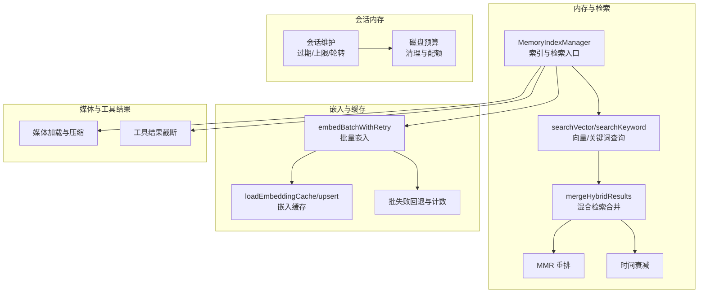
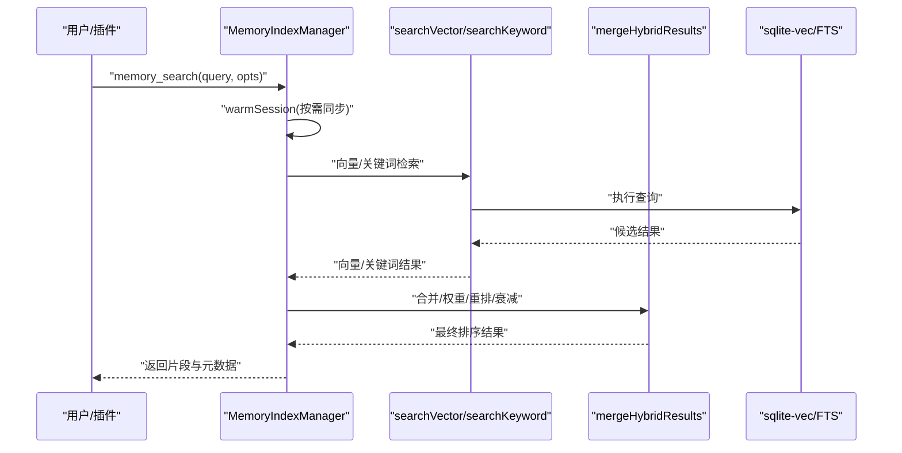
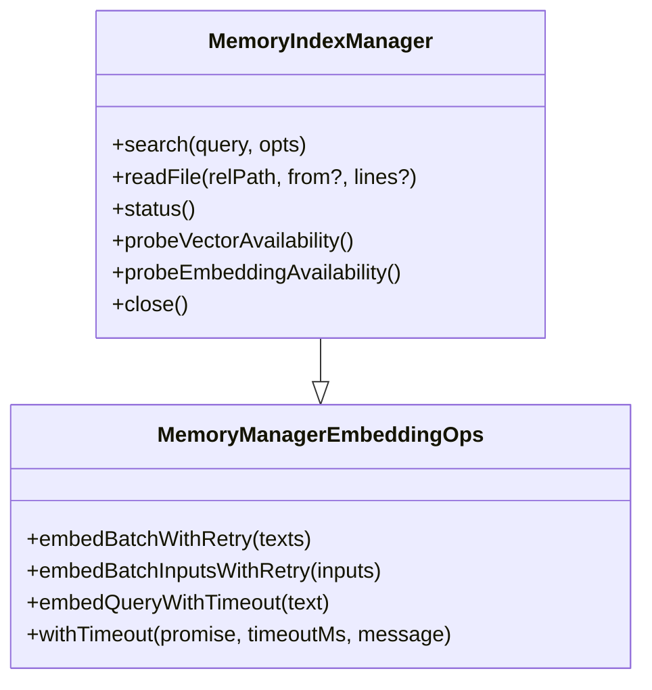
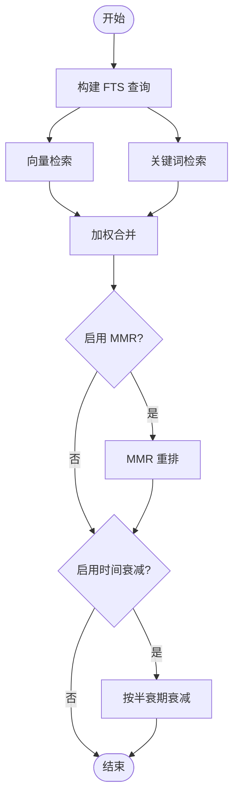
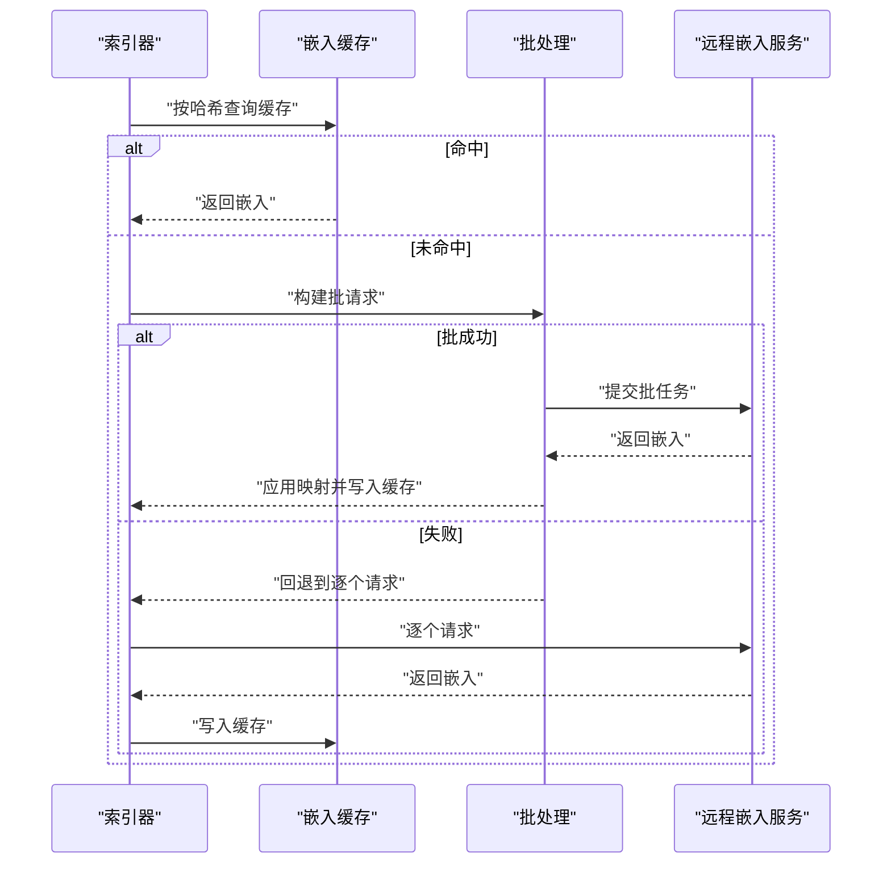
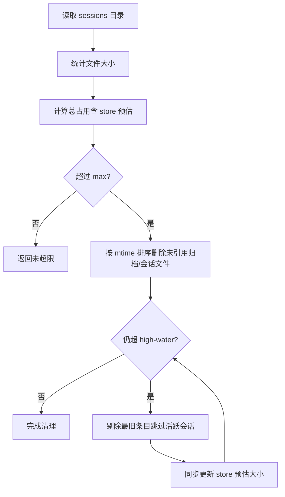
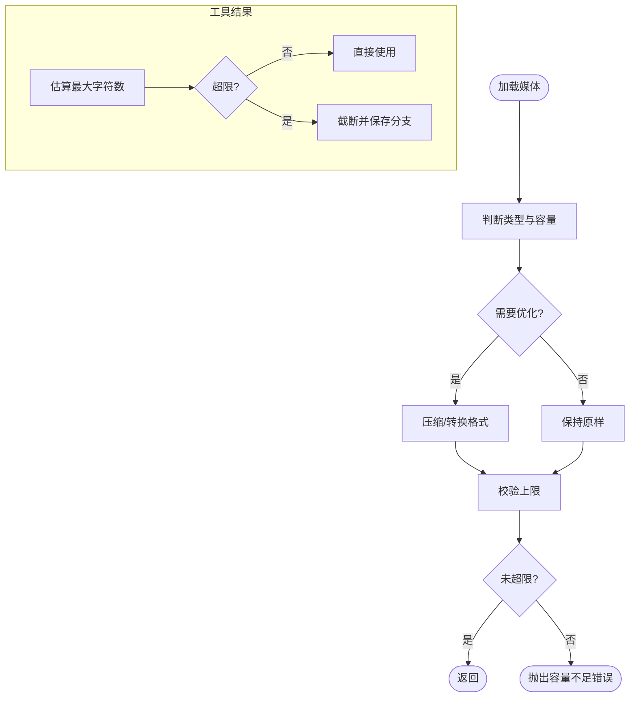
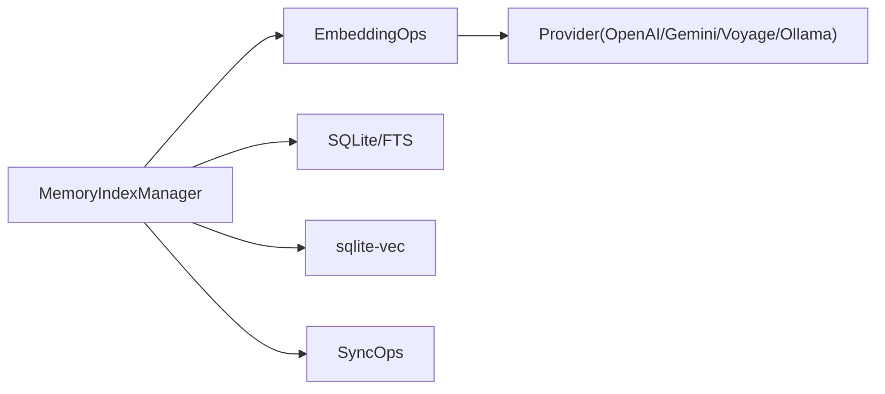

# 内存管理优化

<cite>
**本文引用的文件**
- [docs/concepts/memory.md](file://docs/concepts/memory.md)
- [src/memory/manager.ts](file://src/memory/manager.ts)
- [src/memory/manager-search.ts](file://src/memory/manager-search.ts)
- [src/memory/manager-embedding-ops.ts](file://src/memory/manager-embedding-ops.ts)
- [src/memory/hybrid.ts](file://src/memory/hybrid.ts)
- [src/memory/mmr.ts](file://src/memory/mmr.ts)
- [src/memory/temporal-decay.ts](file://src/memory/temporal-decay.ts)
- [src/memory/internal.ts](file://src/memory/internal.ts)
- [extensions/memory-lancedb/index.ts](file://extensions/memory-lancedb/index.ts)
- [src/config/sessions/store-maintenance.ts](file://src/config/sessions/store-maintenance.ts)
- [src/config/sessions/disk-budget.ts](file://src/config/sessions/disk-budget.ts)
- [src/auto-reply/reply/memory-flush.ts](file://src/auto-reply/reply/memory-flush.ts)
- [src/agents/pi-embedded-runner/tool-result-truncation.ts](file://src/agents/pi-embedded-runner/tool-result-truncation.ts)
- [src/web/media.ts](file://src/web/media.ts)
- [src/commands/status.scan.ts](file://src/commands/status.scan.ts)
</cite>

## 目录
1. [简介](#简介)
2. [项目结构](#项目结构)
3. [核心组件](#核心组件)
4. [架构总览](#架构总览)
5. [详细组件分析](#详细组件分析)
6. [依赖关系分析](#依赖关系分析)
7. [性能考量](#性能考量)
8. [故障排查指南](#故障排查指南)
9. [结论](#结论)
10. [附录](#附录)

## 简介
本技术指南聚焦于 OpenClaw 的内存管理与性能优化，围绕会话内存、工作空间、向量检索、缓存与批处理、磁盘配额与清理、媒体文件处理、以及自动记忆刷写等主题，系统阐述内存使用优化策略与工程实践。文档以代码级实现为依据，提供可操作的配置建议、监控手段与排障路径，帮助在多平台与多后端场景下稳定且高效地运行长时对话与知识检索。

## 项目结构
OpenClaw 将“内存”定义为工作空间中的纯文本（Markdown），并通过多种索引与检索后端提供语义检索能力。核心模块包括：
- 内存索引与检索：内置 SQLite 向量表 + FTS 全文表，支持混合检索、MMR 重排与时间衰减。
- 向量化与批处理：对嵌入输入进行分片、缓存与批请求，降低远程调用成本并提升稳定性。
- 会话内存与磁盘预算：会话存储维护、轮转、配额与清理，避免磁盘膨胀。
- 媒体与工具结果：对图片等二进制媒体进行压缩与限额控制；对工具结果进行字符截断。
- 自动记忆刷写：在接近压缩前触发静默提醒，促使模型将重要信息写入磁盘。

**图表来源**
- [src/memory/manager.ts:257-365](file://src/memory/manager.ts#L257-L365)
- [src/memory/manager-search.ts:20-94](file://src/memory/manager-search.ts#L20-L94)
- [src/memory/hybrid.ts:57-155](file://src/memory/hybrid.ts#L57-L155)
- [src/memory/mmr.ts:116-183](file://src/memory/mmr.ts#L116-L183)
- [src/memory/temporal-decay.ts:121-167](file://src/memory/temporal-decay.ts#L121-L167)
- [src/memory/manager-embedding-ops.ts:185-226](file://src/memory/manager-embedding-ops.ts#L185-L226)
- [src/config/sessions/store-maintenance.ts:155-174](file://src/config/sessions/store-maintenance.ts#L155-L174)
- [src/config/sessions/disk-budget.ts:188-375](file://src/config/sessions/disk-budget.ts#L188-L375)
- [src/web/media.ts:233-322](file://src/web/media.ts#L233-L322)
- [src/agents/pi-embedded-runner/tool-result-truncation.ts:206-221](file://src/agents/pi-embedded-runner/tool-result-truncation.ts#L206-L221)

**章节来源**
- [docs/concepts/memory.md:1-120](file://docs/concepts/memory.md#L1-L120)
- [src/memory/manager.ts:61-188](file://src/memory/manager.ts#L61-L188)

## 核心组件
- 内存索引管理器（MemoryIndexManager）
  - 负责打开数据库、构建索引、监听文件变更、按需同步、执行检索与状态查询。
  - 支持向量表与 FTS 表，提供混合检索、MMR 与时间衰减。
- 检索与合并（searchVector/searchKeyword/mergeHybridResults）
  - 向量检索基于 sqlite-vec 或 JS 计算余弦相似度；关键词检索基于 FTS5 BM25。
  - 混合检索将向量与关键词结果加权合并，并可选应用 MMR 与时间衰减。
- 嵌入与缓存（embeddings + cache）
  - 对嵌入输入进行分片与批处理，支持 OpenAI/Gemini/Voyage 批任务。
  - 提供嵌入缓存表，按 provider/model/provider_key/hash 去重与复用。
- 会话内存维护（store-maintenance/disk-budget）
  - 维护会话条目数量、过期时间、文件轮转与磁盘配额清理。
- 媒体与工具结果（web/media + tool-result-truncation）
  - 媒体加载时进行尺寸与格式控制；工具结果超限时进行字符截断。
- 自动记忆刷写（memory-flush）
  - 在接近压缩时触发静默提醒，促使模型将重要信息写入磁盘。

**章节来源**
- [src/memory/manager.ts:61-188](file://src/memory/manager.ts#L61-L188)
- [src/memory/manager-search.ts:20-94](file://src/memory/manager-search.ts#L20-L94)
- [src/memory/hybrid.ts:57-155](file://src/memory/hybrid.ts#L57-L155)
- [src/memory/manager-embedding-ops.ts:85-183](file://src/memory/manager-embedding-ops.ts#L85-L183)
- [src/config/sessions/store-maintenance.ts:130-148](file://src/config/sessions/store-maintenance.ts#L130-L148)
- [src/config/sessions/disk-budget.ts:188-375](file://src/config/sessions/disk-budget.ts#L188-L375)
- [src/web/media.ts:233-322](file://src/web/media.ts#L233-L322)
- [src/agents/pi-embedded-runner/tool-result-truncation.ts:206-221](file://src/agents/pi-embedded-runner/tool-result-truncation.ts#L206-L221)
- [src/auto-reply/reply/memory-flush.ts:195-228](file://src/auto-reply/reply/memory-flush.ts#L195-L228)

## 架构总览
OpenClaw 的内存子系统以“工作空间文件 + 索引数据库”为核心，结合多种检索后端与优化策略，形成高可用、可扩展的检索体系。

**图表来源**
- [src/memory/manager.ts:257-365](file://src/memory/manager.ts#L257-L365)
- [src/memory/manager-search.ts:20-94](file://src/memory/manager-search.ts#L20-L94)
- [src/memory/hybrid.ts:57-155](file://src/memory/hybrid.ts#L57-L155)

**章节来源**
- [src/memory/manager.ts:257-365](file://src/memory/manager.ts#L257-L365)

## 详细组件分析

### 内存索引与检索（MemoryIndexManager）
- 数据库与表结构
  - 向量表：存储向量与块元数据，支持 sqlite-vec 加速。
  - FTS 表：基于 BM25 的全文检索。
  - 嵌入缓存表：按 provider/model/provider_key/hash 缓存嵌入。
- 检索流程
  - 当提供者可用时，先向量检索，再关键词检索，最后混合合并并应用 MMR 与时间衰减。
  - 当提供者不可用时，降级到 FTS-only 模式。
- 并发与恢复
  - 运行中检测只读数据库错误并自动重建连接与模式。
  - 提供探针接口检查向量可用性与嵌入可用性。

**图表来源**
- [src/memory/manager.ts:61-188](file://src/memory/manager.ts#L61-L188)
- [src/memory/manager-embedding-ops.ts:49-80](file://src/memory/manager-embedding-ops.ts#L49-L80)

**章节来源**
- [src/memory/manager.ts:61-188](file://src/memory/manager.ts#L61-L188)
- [src/memory/manager.ts:452-552](file://src/memory/manager.ts#L452-L552)

### 混合检索与后处理（向量 + 关键词）
- 查询预处理：从自然语言提取关键词，构造 FTS 查询。
- 结果合并：将向量相似度与 BM25 排序融合，归一化权重后加权求和。
- 可选后处理：
  - MMR：最大化边际相关性，平衡多样性与相关性。
  - 时间衰减：对 dated 文件按半衰期指数衰减，提升近期内容权重。

**图表来源**
- [src/memory/hybrid.ts:57-155](file://src/memory/hybrid.ts#L57-L155)
- [src/memory/mmr.ts:116-183](file://src/memory/mmr.ts#L116-L183)
- [src/memory/temporal-decay.ts:121-167](file://src/memory/temporal-decay.ts#L121-L167)

**章节来源**
- [src/memory/hybrid.ts:33-56](file://src/memory/hybrid.ts#L33-L56)
- [src/memory/hybrid.ts:57-155](file://src/memory/hybrid.ts#L57-L155)
- [src/memory/mmr.ts:16-26](file://src/memory/mmr.ts#L16-L26)
- [src/memory/temporal-decay.ts:4-12](file://src/memory/temporal-decay.ts#L4-L12)

### 嵌入缓存与批处理（优化网络与计算开销）
- 分片与批处理
  - 将嵌入输入按 token 估算进行分片，不超过最大 token 阈值。
  - 支持 OpenAI/Gemini/Voyage 批任务，失败时自动回退到非批处理。
- 缓存机制
  - 以 provider/model/provider_key/hash 为键，缓存嵌入向量，避免重复计算。
  - 超限时按更新时间淘汰最旧条目。
- 超时与重试
  - 针对查询与批处理设置不同超时阈值；对速率限制类错误进行指数退避重试。

**图表来源**
- [src/memory/manager-embedding-ops.ts:85-183](file://src/memory/manager-embedding-ops.ts#L85-L183)
- [src/memory/manager-embedding-ops.ts:185-286](file://src/memory/manager-embedding-ops.ts#L185-L286)
- [src/memory/manager-embedding-ops.ts:524-627](file://src/memory/manager-embedding-ops.ts#L524-L627)

**章节来源**
- [src/memory/manager-embedding-ops.ts:55-83](file://src/memory/manager-embedding-ops.ts#L55-L83)
- [src/memory/manager-embedding-ops.ts:185-286](file://src/memory/manager-embedding-ops.ts#L185-L286)
- [src/memory/manager-embedding-ops.ts:524-627](file://src/memory/manager-embedding-ops.ts#L524-L627)

### 会话内存管理与磁盘预算
- 条目维护
  - 过期清理：根据 updatedAt 截止时间移除陈旧条目。
  - 数量上限：保留最近更新的 N 个条目。
  - 文件轮转：超过阈值时重命名当前 sessions.json 并清理旧备份。
- 磁盘预算清理
  - 计算总占用（含内存中 store 预估大小），超过上限时优先删除未被引用的归档与会话文件，再剔除最旧条目。
  - 支持仅告警模式与实际清理模式。

**图表来源**
- [src/config/sessions/disk-budget.ts:188-375](file://src/config/sessions/disk-budget.ts#L188-L375)
- [src/config/sessions/store-maintenance.ts:275-327](file://src/config/sessions/store-maintenance.ts#L275-L327)

**章节来源**
- [src/config/sessions/store-maintenance.ts:155-259](file://src/config/sessions/store-maintenance.ts#L155-L259)
- [src/config/sessions/disk-budget.ts:188-375](file://src/config/sessions/disk-budget.ts#L188-L375)

### 媒体与工具结果的内存优化
- 媒体加载与压缩
  - 对图片进行格式与尺寸优化，严格控制最大字节数，超限抛出明确错误。
  - 支持 GIF 与 HEIC 等特殊格式的兼容处理。
- 工具结果截断
  - 基于上下文窗口估算最大字符数，对超限的工具结果进行截断，避免内存膨胀。

**图表来源**
- [src/web/media.ts:233-322](file://src/web/media.ts#L233-L322)
- [src/agents/pi-embedded-runner/tool-result-truncation.ts:206-221](file://src/agents/pi-embedded-runner/tool-result-truncation.ts#L206-L221)

**章节来源**
- [src/web/media.ts:233-322](file://src/web/media.ts#L233-L322)
- [src/agents/pi-embedded-runner/tool-result-truncation.ts:206-221](file://src/agents/pi-embedded-runner/tool-result-truncation.ts#L206-L221)

### 自动记忆刷写（Pre-compaction Ping）
- 触发条件：当会话接近压缩且未在同一次压缩周期内执行过刷写时，触发静默提醒。
- 配置要点：软阈值、保留 token 下界、系统提示词与用户提示词、工作空间权限限制。
- 作用：在上下文被压缩前，促使模型将重要信息持久化到磁盘，减少信息丢失。

**章节来源**
- [src/auto-reply/reply/memory-flush.ts:195-228](file://src/auto-reply/reply/memory-flush.ts#L195-L228)
- [docs/concepts/memory.md:52-91](file://docs/concepts/memory.md#L52-L91)

### 第三方向量存储（LanceDB 插件）
- 存储与检索：使用 LanceDB 表存储向量与文本，支持向量搜索与删除计数。
- 嵌入提供者：通过 OpenAI 客户端生成向量，支持 UUID 校验防止注入。
- 生命周期钩子：在代理开始前自动召回相关记忆，在代理结束后自动捕获用户输入中的重要信息。

**章节来源**
- [extensions/memory-lancedb/index.ts:59-157](file://extensions/memory-lancedb/index.ts#L59-L157)
- [extensions/memory-lancedb/index.ts:314-494](file://extensions/memory-lancedb/index.ts#L314-L494)
- [extensions/memory-lancedb/index.ts:546-658](file://extensions/memory-lancedb/index.ts#L546-L658)

## 依赖关系分析
- 组件耦合
  - MemoryIndexManager 依赖嵌入提供者与 sqlite-vec/FTS 能力，具备强内聚的检索与同步逻辑。
  - 嵌入层通过缓存与批处理降低对外部服务的依赖与抖动。
- 外部依赖
  - sqlite-vec：向量加速；缺失时回退到 JS 余弦相似度。
  - 远程嵌入服务：OpenAI/Gemini/Voyage/Ollama 等，支持批任务与结构化输入。
- 潜在循环依赖
  - 检索与同步相互触发（按需 warm），通过异步与状态标记避免死锁。

**图表来源**
- [src/memory/manager.ts:190-239](file://src/memory/manager.ts#L190-L239)
- [src/memory/manager-embedding-ops.ts:49-80](file://src/memory/manager-embedding-ops.ts#L49-L80)

**章节来源**
- [src/memory/manager.ts:190-239](file://src/memory/manager.ts#L190-L239)
- [src/memory/manager-embedding-ops.ts:49-80](file://src/memory/manager-embedding-ops.ts#L49-L80)

## 性能考量
- 向量检索性能
  - 开启 sqlite-vec 可显著降低内存占用与查询延迟；若不可用，回退到 JS 余弦相似度。
  - 合理设置候选集上限与权重，避免过度合并导致的排序开销。
- 嵌入批处理
  - 使用批任务减少往返次数与 API 成本；对失败进行回退与禁用保护，避免阻塞主流程。
  - 启用嵌入缓存，减少重复计算；合理设置最大条目数，避免缓存膨胀。
- 检索后处理
  - MMR 与时间衰减为可选增强，适度开启可提升相关性与时效性，但会增加计算成本。
- 会话内存与磁盘
  - 设置合理的过期时间与条目上限，定期轮转大文件，避免单文件过大影响 IO。
  - 磁盘预算清理应结合活跃会话键，避免误删正在使用的会话文件。

[本节为通用指导，不直接分析具体文件]

## 故障排查指南
- 嵌入可用性与只读数据库
  - 使用探针接口检查向量与嵌入可用性；若出现只读错误，自动重建连接并重试。
- 批任务失败与回退
  - 记录失败次数与最后一次错误原因；达到阈值后禁用批任务并回退到非批处理。
- 检索结果异常
  - 若仅提供者不可用，确认是否处于 FTS-only 模式；检查 FTS 是否可用与可用性。
- 会话磁盘超限
  - 查看清理日志与移除文件数量；必要时调整配额或清理策略。
- 媒体加载失败
  - 检查最大字节数与格式支持；确认路径与权限；关注压缩后的尺寸是否满足上限。

**章节来源**
- [src/memory/manager.ts:518-552](file://src/memory/manager.ts#L518-L552)
- [src/memory/manager-embedding-ops.ts:699-755](file://src/memory/manager-embedding-ops.ts#L699-L755)
- [src/config/sessions/disk-budget.ts:342-363](file://src/config/sessions/disk-budget.ts#L342-L363)
- [src/web/media.ts:266-268](file://src/web/media.ts#L266-L268)

## 结论
OpenClaw 的内存管理通过“工作空间文件 + 多后端索引”的组合，实现了高可用与可扩展的检索能力。配合嵌入缓存、批处理、混合检索、MMR 与时间衰减、会话磁盘预算与媒体限额等优化策略，可在多平台与多场景下实现稳定的内存使用与良好的检索效果。建议在生产环境中启用 sqlite-vec、合理配置批任务与缓存、并结合监控与告警机制持续优化。

[本节为总结性内容，不直接分析具体文件]

## 附录

### 实用工具与监控
- 内存状态快照
  - 通过状态扫描获取当前索引器状态（文件/块数量、缓存、向量可用性、批任务状态等）。
- 常用配置要点
  - 搜索：候选倍数、向量/文本权重、MMR 与时间衰减开关与参数。
  - 批任务：并发、等待、轮询间隔、超时与失败阈值。
  - 磁盘预算：最大字节数、高水位线、清理模式（仅告警/实际清理）。
  - 媒体：按类型的最大字节数、图片优化开关、HEIC/动画处理。

**章节来源**
- [src/commands/status.scan.ts:157-180](file://src/commands/status.scan.ts#L157-L180)
- [docs/concepts/memory.md:639-795](file://docs/concepts/memory.md#L639-L795)
- [src/memory/manager-embedding-ops.ts:362-389](file://src/memory/manager-embedding-ops.ts#L362-L389)
- [src/config/sessions/disk-budget.ts:7-21](file://src/config/sessions/disk-budget.ts#L7-L21)
- [src/web/media.ts:284-322](file://src/web/media.ts#L284-L322)