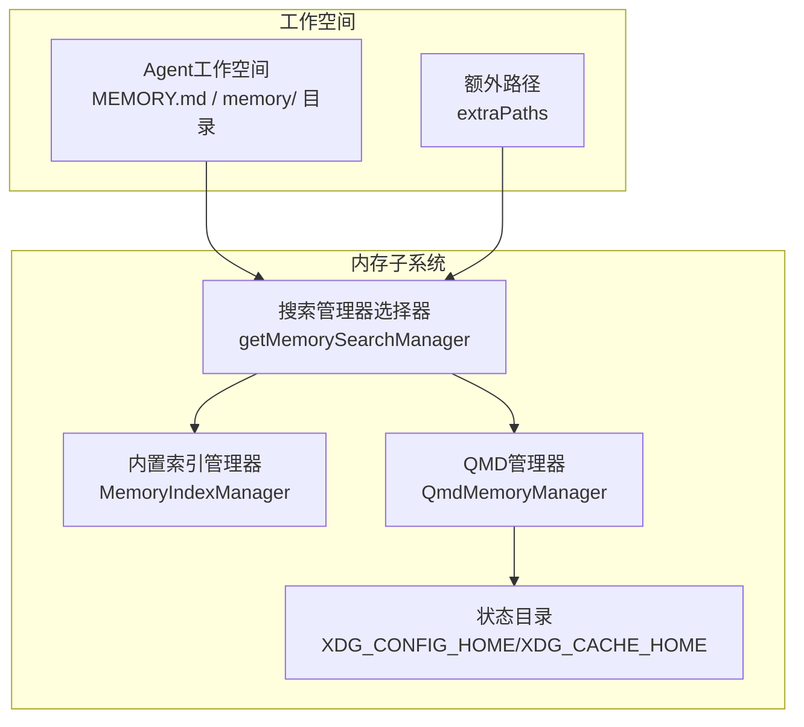
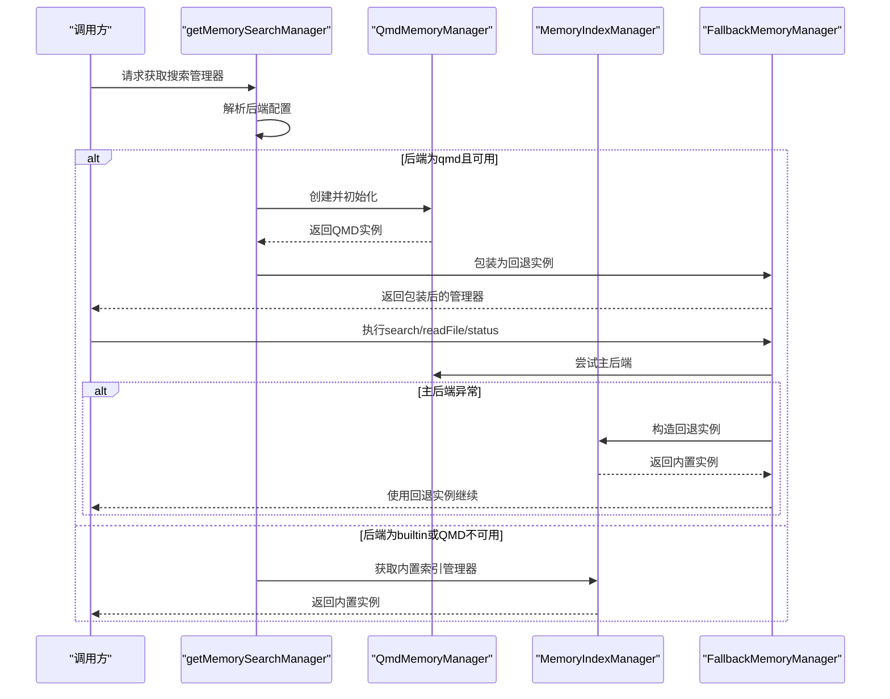
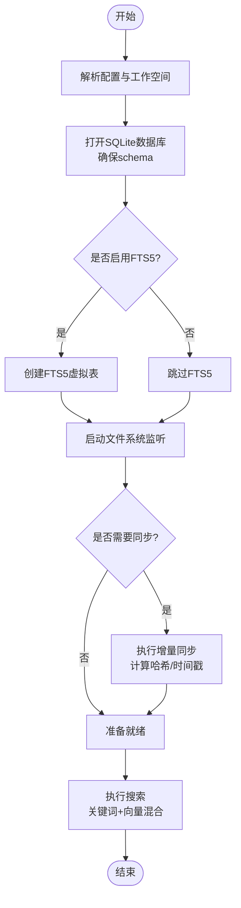
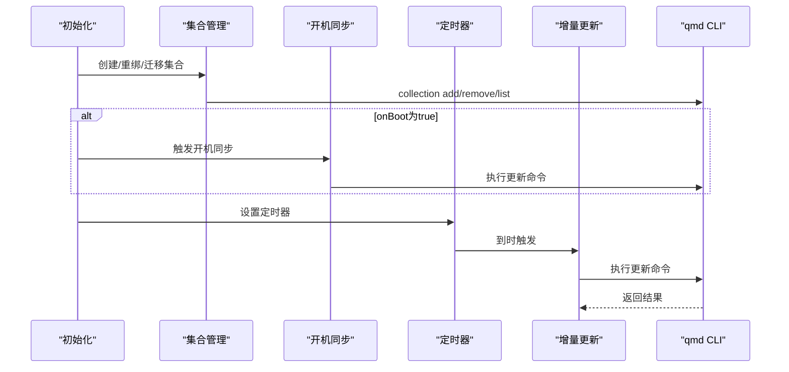
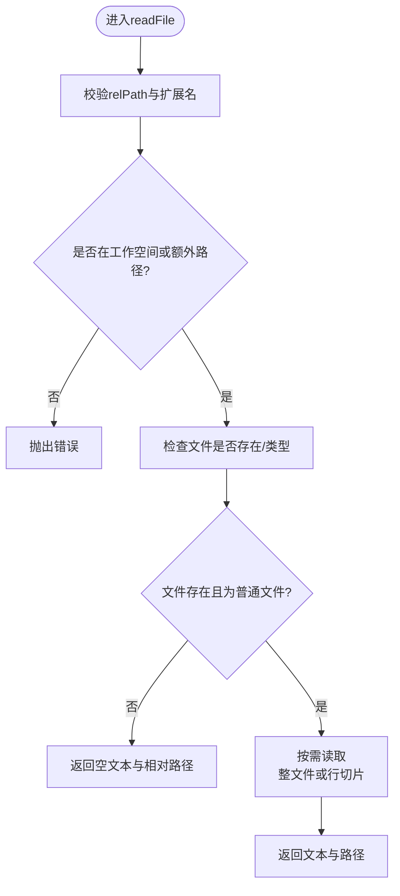
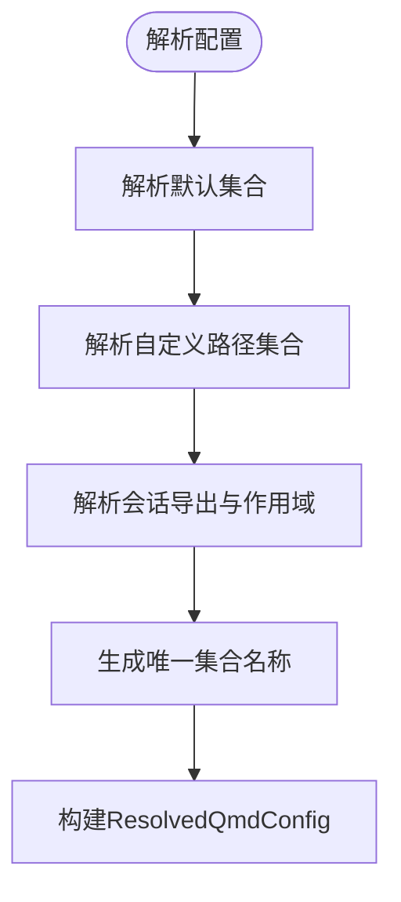
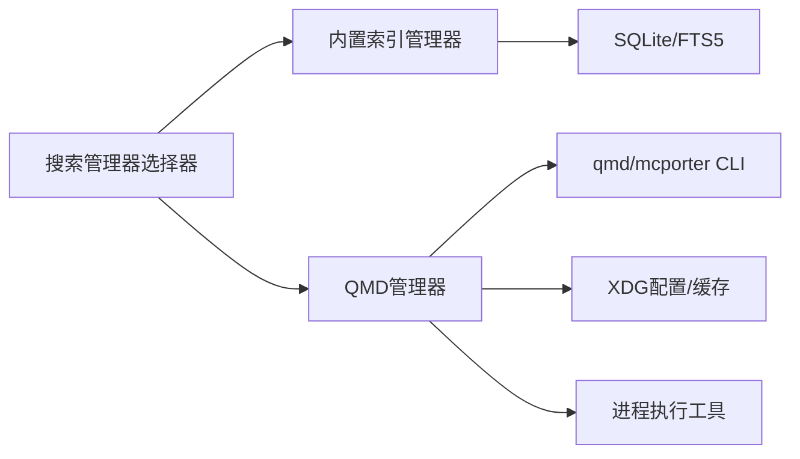

# 工作空间内存优化

<cite>
**本文档引用的文件**
- [src/memory/manager.ts](file://src/memory/manager.ts)
- [src/memory/search-manager.ts](file://src/memory/search-manager.ts)
- [src/memory/qmd-manager.ts](file://src/memory/qmd-manager.ts)
- [src/memory/memory-schema.ts](file://src/memory/memory-schema.ts)
- [src/memory/internal.ts](file://src/memory/internal.ts)
- [src/memory/fs-utils.ts](file://src/memory/fs-utils.ts)
- [src/memory/backend-config.ts](file://src/memory/backend-config.ts)
- [src/memory/qmd-process.ts](file://src/memory/qmd-process.ts)
- [src/memory/types.ts](file://src/memory/types.ts)
- [src/memory/manager.read-file.test.ts](file://src/memory/manager.read-file.test.ts)
- [src/memory/internal.test.ts](file://src/memory/internal.test.ts)
- [src/memory/qmd-manager.test.ts](file://src/memory/qmd-manager.test.ts)
- [src/plugins/loader.ts](file://src/plugins/loader.ts)
</cite>

## 目录
1. [简介](#简介)
2. [项目结构](#项目结构)
3. [核心组件](#核心组件)
4. [架构总览](#架构总览)
5. [详细组件分析](#详细组件分析)
6. [依赖关系分析](#依赖关系分析)
7. [性能考量](#性能考量)
8. [故障排除指南](#故障排除指南)
9. [结论](#结论)
10. [附录](#附录)

## 简介
本指南聚焦于OpenClaw工作空间的内存优化，围绕工作空间文件系统的内存管理策略展开，涵盖以下主题：
- Markdown文件的内存映射与按需读取
- 目录结构优化与文件访问模式
- 动态加载机制、缓存策略与内存占用控制
- 工作空间配置优化（文件组织最佳实践、内存使用限制设置、磁盘空间与内存平衡）
- 故障恢复、数据完整性保护与性能监控

目标是帮助开发者在保证检索质量的同时，显著降低内存占用并提升稳定性。

## 项目结构
OpenClaw将“工作空间”抽象为Agent可访问的本地目录，结合内置索引与外部CLI工具（如qmd）实现高效检索与增量更新。内存优化的关键在于：
- 按需加载：仅在需要时打开/读取文件，避免一次性全量载入
- 缓存与去重：对已处理文件与嵌入结果进行缓存与去重
- 增量同步：基于时间戳与哈希的增量更新，减少重复索引
- 资源隔离：为每个Agent维护独立的状态目录与索引，避免跨Agent干扰



**图表来源**
- [src/memory/search-manager.ts:25-86](file://src/memory/search-manager.ts#L25-L86)
- [src/memory/manager.ts:133-188](file://src/memory/manager.ts#L133-L188)
- [src/memory/qmd-manager.ts:127-234](file://src/memory/qmd-manager.ts#L127-L234)

**章节来源**
- [src/memory/search-manager.ts:25-86](file://src/memory/search-manager.ts#L25-L86)
- [src/memory/backend-config.ts:297-354](file://src/memory/backend-config.ts#L297-L354)

## 核心组件
- 搜索管理器选择器：根据配置选择内置索引或QMD后端，并支持回退机制
- 内置索引管理器：SQLite + FTS5 + 向量嵌入，支持增量同步与只读数据库恢复
- QMD管理器：通过外部CLI维护集合与索引，支持会话导出与多集合管理
- 文件系统工具：安全路径校验、正则文件检查、并发任务执行
- 配置解析：统一解析工作空间、集合、更新策略与查询限制

**章节来源**
- [src/memory/types.ts:61-81](file://src/memory/types.ts#L61-L81)
- [src/memory/manager.ts:61-132](file://src/memory/manager.ts#L61-L132)
- [src/memory/qmd-manager.ts:127-183](file://src/memory/qmd-manager.ts#L127-L183)
- [src/memory/internal.ts:17-483](file://src/memory/internal.ts#L17-L483)
- [src/memory/backend-config.ts:17-355](file://src/memory/backend-config.ts#L17-L355)

## 架构总览
OpenClaw采用“后端可插拔”的设计：默认使用内置索引（SQLite + FTS5 + 向量），也可选择QMD作为后端；当QMD不可用时自动回退到内置索引。两者均支持增量同步与缓存，以降低内存与I/O压力。

```mermaid
classDiagram
class MemorySearchManager {
+search(query, opts) MemorySearchResult[]
+readFile(params) {text,path}
+status() MemoryProviderStatus
+sync(params) void
+probeEmbeddingAvailability() MemoryEmbeddingProbeResult
+probeVectorAvailability() boolean
+close() void
}
class MemoryIndexManager {
-cacheKey : string
-cfg : OpenClawConfig
-agentId : string
-workspaceDir : string
-settings : ResolvedMemorySearchConfig
-provider : EmbeddingProvider
-db : DatabaseSync
-fts : {enabled,available}
-vector : {enabled,available,dims}
+search()
+readFile()
+sync()
+status()
+close()
}
class QmdMemoryManager {
-cfg : OpenClawConfig
-agentId : string
-qmd : ResolvedQmdConfig
-workspaceDir : string
-stateDir : string
-indexPath : string
-env : ProcessEnv
+initialize()
+ensureCollections()
+runUpdate()
+search()
+readFile()
+status()
+close()
}
class FallbackMemoryManager {
-primary : MemorySearchManager
-fallback : MemorySearchManager
-primaryFailed : boolean
+search()
+readFile()
+status()
+sync()
+probeEmbeddingAvailability()
+probeVectorAvailability()
+close()
}
MemorySearchManager <|.. MemoryIndexManager
MemorySearchManager <|.. QmdMemoryManager
MemorySearchManager <|.. FallbackMemoryManager
```

**图表来源**
- [src/memory/types.ts:61-81](file://src/memory/types.ts#L61-L81)
- [src/memory/manager.ts:61-132](file://src/memory/manager.ts#L61-L132)
- [src/memory/qmd-manager.ts:127-183](file://src/memory/qmd-manager.ts#L127-L183)
- [src/memory/search-manager.ts:104-179](file://src/memory/search-manager.ts#L104-L179)

## 详细组件分析

### 组件A：搜索管理器选择器与回退机制
- 依据配置解析后端类型（builtin/qmd），优先尝试QMD；若失败则回退至内置索引
- QMD管理器具备独立缓存键，便于在主管理器失败后重新构建
- 回退包装器负责错误传播与缓存剔除，确保后续请求能重建QMD实例



**图表来源**
- [src/memory/search-manager.ts:25-86](file://src/memory/search-manager.ts#L25-L86)
- [src/memory/search-manager.ts:104-179](file://src/memory/search-manager.ts#L104-L179)

**章节来源**
- [src/memory/search-manager.ts:25-86](file://src/memory/search-manager.ts#L25-L86)
- [src/memory/search-manager.ts:104-179](file://src/memory/search-manager.ts#L104-L179)

### 组件B：内置索引管理器（SQLite + FTS5 + 向量）
- 数据库与模式：确保meta/files/chunks/embedding_cache表及必要索引存在；可选启用FTS5
- 增量同步：基于mtime/哈希与时间窗口的增量更新；支持会话级增量
- 只读数据库恢复：检测只读错误后自动重建连接并重试
- 搜索流程：关键词（FTS5）与向量（嵌入模型）混合检索，支持MMR与时间衰减
- 缓存：嵌入结果缓存表，支持最大条目数限制



**图表来源**
- [src/memory/manager.ts:216-235](file://src/memory/manager.ts#L216-L235)
- [src/memory/memory-schema.ts:3-83](file://src/memory/memory-schema.ts#L3-L83)
- [src/memory/manager.ts:452-552](file://src/memory/manager.ts#L452-L552)

**章节来源**
- [src/memory/manager.ts:61-132](file://src/memory/manager.ts#L61-L132)
- [src/memory/manager.ts:216-235](file://src/memory/manager.ts#L216-L235)
- [src/memory/memory-schema.ts:3-83](file://src/memory/memory-schema.ts#L3-L83)
- [src/memory/manager.ts:452-552](file://src/memory/manager.ts#L452-L552)

### 组件C：QMD管理器（外部CLI后端）
- 集合管理：为默认与自定义路径创建集合，支持重绑定与迁移
- 状态隔离：通过XDG目录隔离配置与缓存，共享模型以节省磁盘
- 更新策略：支持开机同步、定时同步、防抖与超时控制
- 查询执行：支持search/vsearch/query三种模式，可经由mcporter加速
- 容错修复：针对缺失集合、空字节元数据、重复文档约束等错误进行一次性修复



**图表来源**
- [src/memory/qmd-manager.ts:236-278](file://src/memory/qmd-manager.ts#L236-L278)
- [src/memory/qmd-manager.ts:290-336](file://src/memory/qmd-manager.ts#L290-L336)
- [src/memory/qmd-manager.ts:528-538](file://src/memory/qmd-manager.ts#L528-L538)
- [src/memory/qmd-manager.ts:727-800](file://src/memory/qmd-manager.ts#L727-L800)

**章节来源**
- [src/memory/qmd-manager.ts:127-183](file://src/memory/qmd-manager.ts#L127-L183)
- [src/memory/qmd-manager.ts:236-278](file://src/memory/qmd-manager.ts#L236-L278)
- [src/memory/qmd-manager.ts:290-336](file://src/memory/qmd-manager.ts#L290-L336)
- [src/memory/qmd-manager.ts:528-538](file://src/memory/qmd-manager.ts#L528-L538)
- [src/memory/qmd-manager.ts:727-800](file://src/memory/qmd-manager.ts#L727-L800)

### 组件D：文件系统与读取策略
- 安全路径校验：严格限定工作空间内与额外路径内的Markdown文件
- 正则文件检查：仅允许普通文件，拒绝符号链接
- 按需读取：支持整文件读取与行切片读取，避免大文件全量载入
- 并发控制：批量任务执行支持并发限制，防止资源争用



**图表来源**
- [src/memory/manager.ts:554-625](file://src/memory/manager.ts#L554-L625)
- [src/memory/fs-utils.ts:17-31](file://src/memory/fs-utils.ts#L17-L31)

**章节来源**
- [src/memory/manager.ts:554-625](file://src/memory/manager.ts#L554-L625)
- [src/memory/fs-utils.ts:17-31](file://src/memory/fs-utils.ts#L17-L31)
- [src/memory/manager.read-file.test.ts:44-124](file://src/memory/manager.read-file.test.ts#L44-L124)

### 组件E：配置解析与集合命名
- 默认集合：MEMORY.md、memory.md、memory/目录
- 自定义集合：支持多路径与glob模式，自动去重与唯一命名
- 会话集合：可选导出会话到独立集合，支持保留期与清理
- 作用域控制：支持按会话类型限制访问范围



**图表来源**
- [src/memory/backend-config.ts:275-295](file://src/memory/backend-config.ts#L275-L295)
- [src/memory/backend-config.ts:220-252](file://src/memory/backend-config.ts#L220-L252)
- [src/memory/backend-config.ts:204-218](file://src/memory/backend-config.ts#L204-L218)
- [src/memory/backend-config.ts:106-129](file://src/memory/backend-config.ts#L106-L129)

**章节来源**
- [src/memory/backend-config.ts:275-295](file://src/memory/backend-config.ts#L275-L295)
- [src/memory/backend-config.ts:220-252](file://src/memory/backend-config.ts#L220-L252)
- [src/memory/backend-config.ts:204-218](file://src/memory/backend-config.ts#L204-L218)
- [src/memory/backend-config.ts:106-129](file://src/memory/backend-config.ts#L106-L129)

## 依赖关系分析
- 组件耦合
  - 搜索管理器选择器与回退包装器解耦具体后端实现
  - 内置索引管理器依赖SQLite与嵌入提供者，耦合度中等
  - QMD管理器依赖外部CLI与XDG目录，耦合度较高但可配置
- 外部依赖
  - SQLite：内置FTS5与索引
  - qmd/mcporter：外部CLI工具，用于集合管理与查询
  - Windows平台spawn兼容：命令行封装与错误处理



**图表来源**
- [src/memory/search-manager.ts:25-86](file://src/memory/search-manager.ts#L25-L86)
- [src/memory/manager.ts:216-235](file://src/memory/manager.ts#L216-L235)
- [src/memory/qmd-manager.ts:196-212](file://src/memory/qmd-manager.ts#L196-L212)
- [src/memory/qmd-process.ts:67-132](file://src/memory/qmd-process.ts#L67-L132)

**章节来源**
- [src/memory/search-manager.ts:25-86](file://src/memory/search-manager.ts#L25-L86)
- [src/memory/manager.ts:216-235](file://src/memory/manager.ts#L216-L235)
- [src/memory/qmd-manager.ts:196-212](file://src/memory/qmd-manager.ts#L196-L212)
- [src/memory/qmd-process.ts:67-132](file://src/memory/qmd-process.ts#L67-L132)

## 性能考量
- 搜索性能
  - 关键词检索（FTS5）与向量检索（嵌入）混合，支持MMR与时间衰减
  - 通过候选集倍数与最小分数过滤，控制返回规模
- 内存占用控制
  - 按需读取与行切片，避免大文件全量载入
  - 嵌入结果缓存表，支持最大条目限制
  - QMD通过XDG缓存隔离与模型共享，减少重复下载
- 增量同步
  - 基于mtime/哈希的时间窗口增量更新，减少索引开销
  - 会话级增量与批处理失败计数，避免频繁同步
- 并发与限流
  - 批处理并发与轮询间隔可配置，防止资源争用
  - 任务并发执行支持错误早停与限流

**章节来源**
- [src/memory/manager.ts:257-365](file://src/memory/manager.ts#L257-L365)
- [src/memory/manager.ts:91-94](file://src/memory/manager.ts#L91-L94)
- [src/memory/manager.ts:452-552](file://src/memory/manager.ts#L452-L552)
- [src/memory/qmd-manager.ts:236-278](file://src/memory/qmd-manager.ts#L236-L278)
- [src/memory/internal.ts:469-483](file://src/memory/internal.ts#L469-L483)

## 故障排除指南
- 只读数据库错误
  - 现象：SQLite提示只读或数据库为只读
  - 处理：自动重建连接并重试，同时重置向量可用性标记
- QMD集合缺失
  - 现象：查询时报集合不存在
  - 处理：一次性重建所有受管集合后重试
- 空字节集合元数据
  - 现象：集合元数据包含空字节导致ENOTDIR
  - 处理：一次性重建集合以修复元数据
- 重复文档约束
  - 现象：唯一约束冲突
  - 处理：重建集合后重试
- 文件不存在或路径非法
  - 现象：读取返回空文本或抛出错误
  - 处理：严格路径校验与正则文件检查，拒绝符号链接与非Markdown文件

**章节来源**
- [src/memory/manager.ts:469-552](file://src/memory/manager.ts#L469-L552)
- [src/memory/qmd-manager.ts:517-526](file://src/memory/qmd-manager.ts#L517-L526)
- [src/memory/qmd-manager.ts:694-725](file://src/memory/qmd-manager.ts#L694-L725)
- [src/memory/manager.ts:554-625](file://src/memory/manager.ts#L554-L625)

## 结论
通过“后端可插拔 + 增量同步 + 缓存 + 安全路径校验”的组合，OpenClaw在保证检索能力的同时实现了良好的内存与磁盘平衡。建议在生产环境中：
- 优先使用QMD后端以获得更快的交互体验，内置索引作为可靠回退
- 合理设置集合与更新策略，避免不必要的全量索引
- 控制嵌入缓存大小与批处理并发，防止内存峰值过高
- 对工作空间进行规范化组织，减少冗余文件与符号链接

## 附录

### A. 工作空间配置优化方案
- 文件组织最佳实践
  - 将默认记忆文件置于根目录（MEMORY.md或memory.md），并使用memory/目录存放分段内容
  - 使用glob模式管理自定义集合，避免深层嵌套与大量小文件
- 内存使用限制设置
  - 嵌入缓存最大条目数：根据可用内存与模型维度合理设置
  - 批处理并发与轮询间隔：在CPU受限设备上降低并发，延长轮询间隔
- 磁盘空间与内存平衡
  - QMD模型共享：通过XDG缓存隔离与共享模型目录，减少重复下载
  - 会话导出：按需启用并设置保留期，避免长期积累

**章节来源**
- [src/memory/backend-config.ts:275-295](file://src/memory/backend-config.ts#L275-L295)
- [src/memory/backend-config.ts:204-218](file://src/memory/backend-config.ts#L204-L218)
- [src/memory/manager.ts:91-94](file://src/memory/manager.ts#L91-L94)
- [src/memory/qmd-manager.ts:242-256](file://src/memory/qmd-manager.ts#L242-L256)

### B. 目录结构与文件访问模式
- 默认集合与自定义集合
  - 默认集合：MEMORY.md、memory.md、memory/目录
  - 自定义集合：支持多路径与glob模式，自动去重与唯一命名
- 访问模式
  - 严格路径校验：仅允许工作空间内与额外路径内的Markdown文件
  - 拒绝符号链接：避免跨目录访问与潜在安全风险
  - 按需读取：支持整文件与行切片，避免大文件全量载入

**章节来源**
- [src/memory/internal.ts:115-182](file://src/memory/internal.ts#L115-L182)
- [src/memory/internal.ts:74-83](file://src/memory/internal.ts#L74-L83)
- [src/memory/manager.ts:554-625](file://src/memory/manager.ts#L554-L625)
- [src/memory/internal.test.ts:80-143](file://src/memory/internal.test.ts#L80-L143)

### C. 插件加载与内存后端槽位
- 插件系统通过插槽（slots.memory）选择内存后端实现
- 支持内置索引与第三方内存插件（如LanceDB），便于扩展

**章节来源**
- [src/plugins/loader.ts:564-567](file://src/plugins/loader.ts#L564-L567)