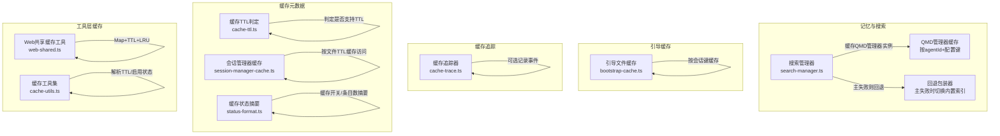
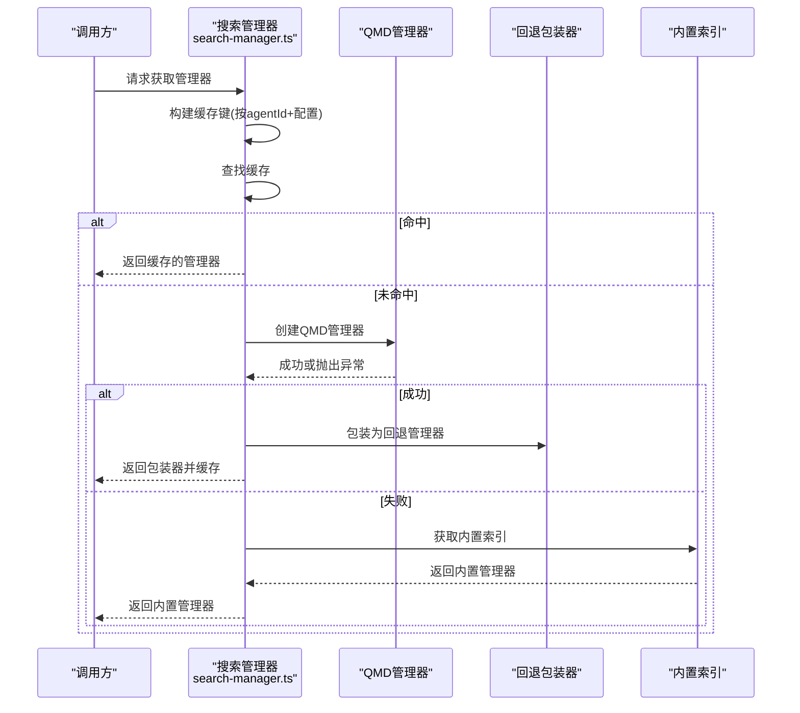
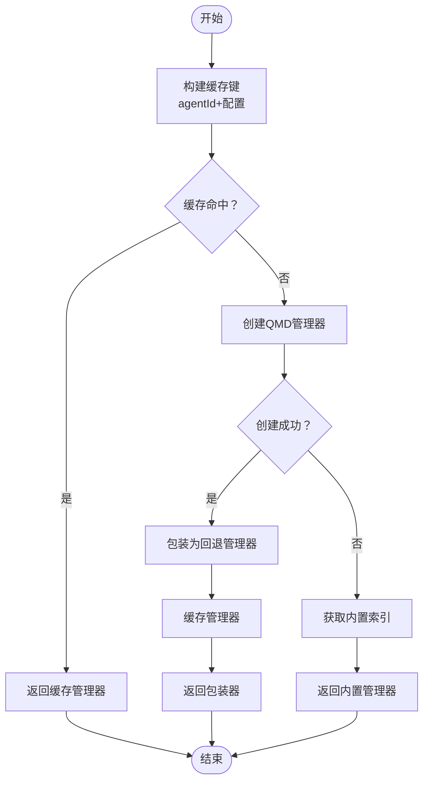
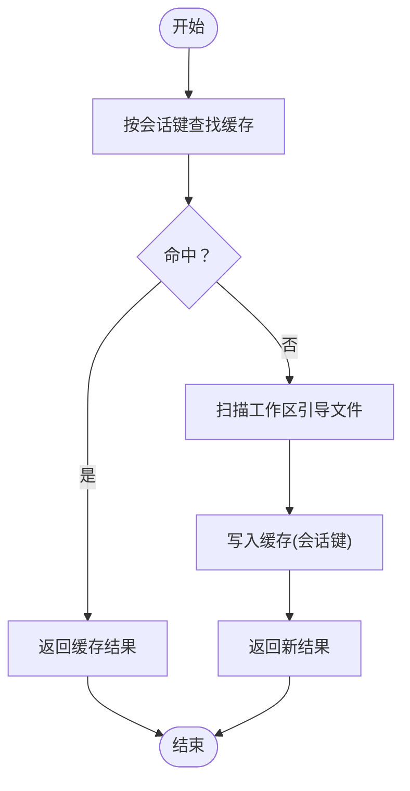
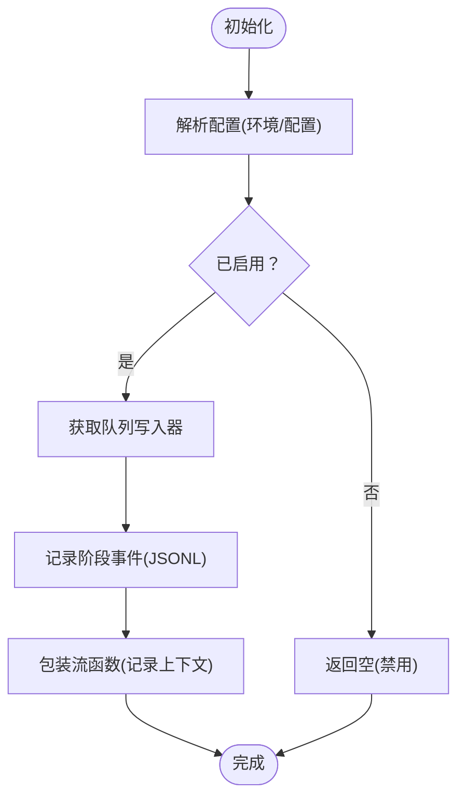
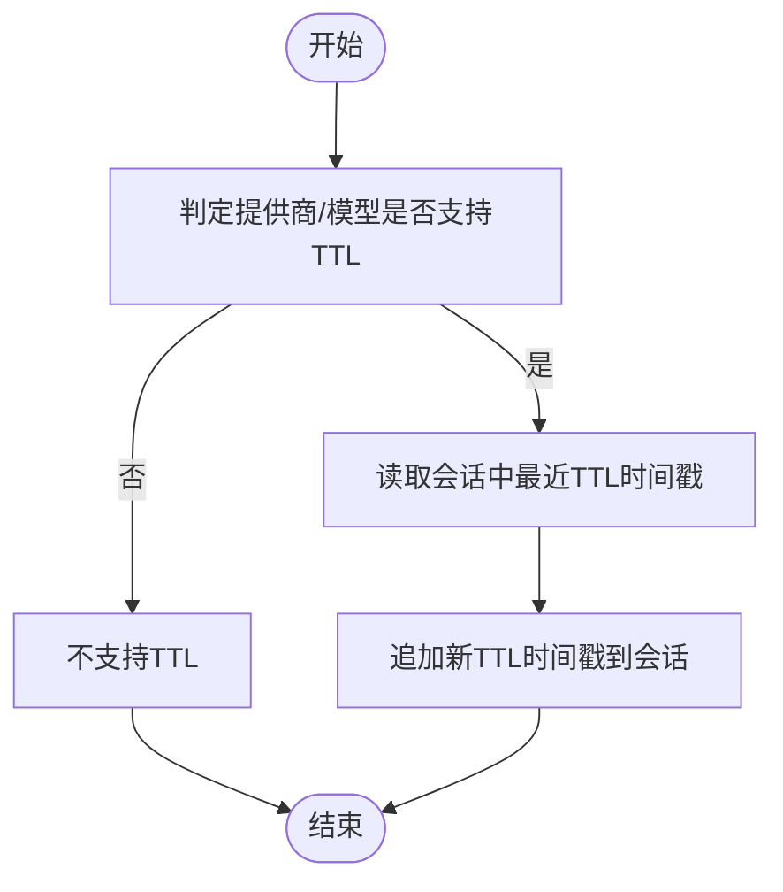
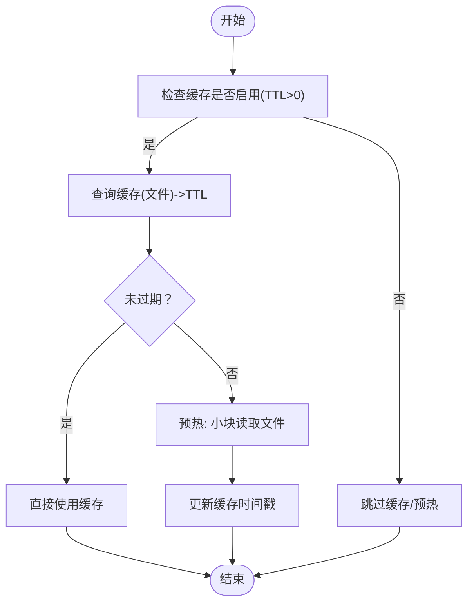
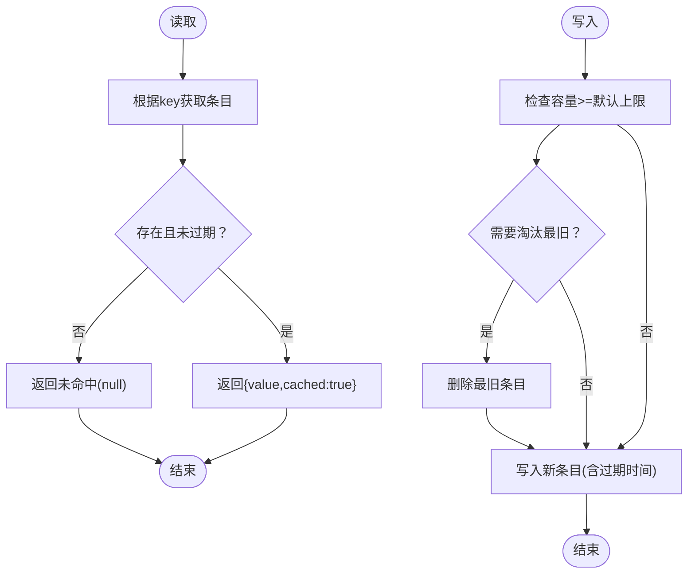
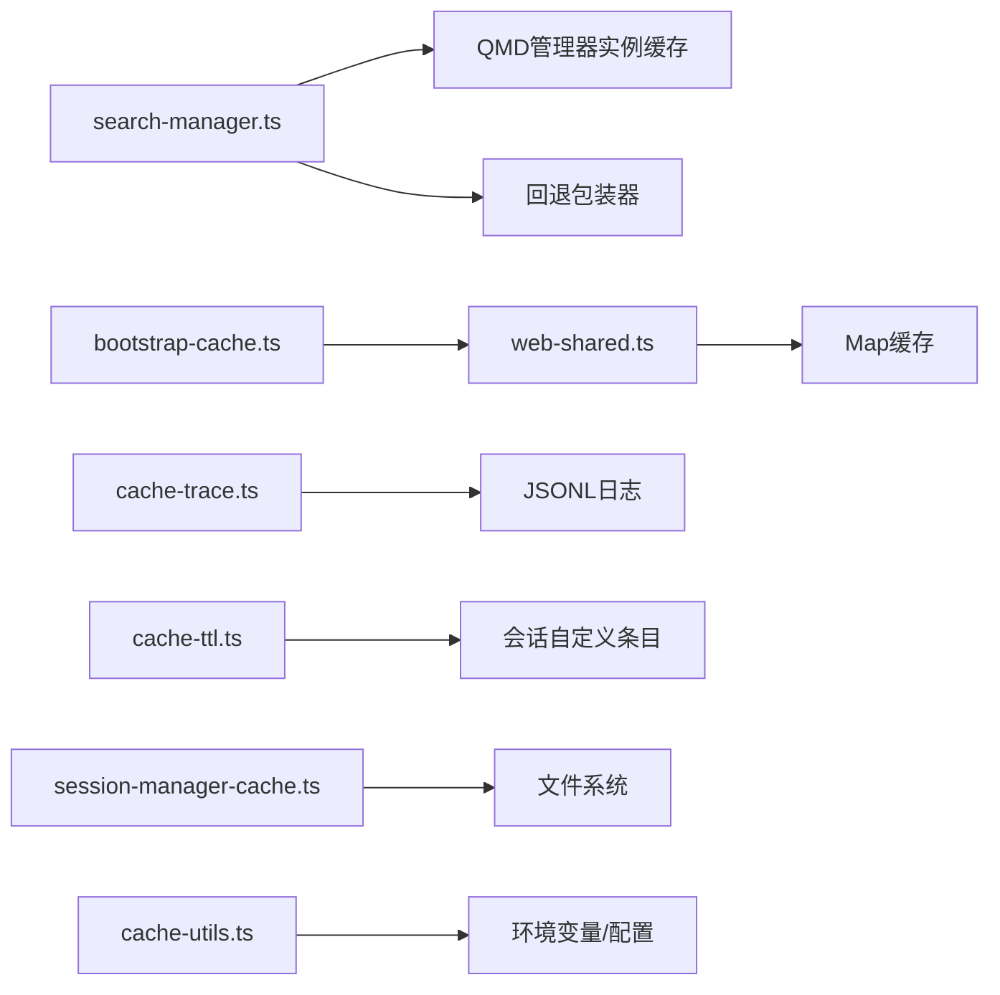

# 缓存策略优化

<cite>
**本文引用的文件**
- [search-manager.ts](file://src/memory/search-manager.ts)
- [bootstrap-cache.ts](file://src/agents/bootstrap-cache.ts)
- [cache-trace.ts](file://src/agents/cache-trace.ts)
- [cache-ttl.ts](file://src/agents/pi-embedded-runner/cache-ttl.ts)
- [web-shared.ts](file://src/agents/tools/web-shared.ts)
- [cache-utils.ts](file://src/config/cache-utils.ts)
- [session-manager-cache.ts](file://src/agents/pi-embedded-runner/session-manager-cache.ts)
- [status-format.ts](file://src/memory/status-format.ts)
- [outbound.test.ts](file://src/infra/outbound/outbound.test.ts)
- [status.ts](file://src/auto-reply/status.ts)
- [usage-render-details.ts](file://ui/src/ui/views/usage-render-details.ts)
</cite>

## 目录
1. [简介](#简介)
2. [项目结构](#项目结构)
3. [核心组件](#核心组件)
4. [架构总览](#架构总览)
5. [详细组件分析](#详细组件分析)
6. [依赖关系分析](#依赖关系分析)
7. [性能考量](#性能考量)
8. [故障排查指南](#故障排查指南)
9. [结论](#结论)
10. [附录](#附录)

## 简介
本文件面向OpenClaw的缓存策略优化，系统性阐述多层级缓存架构的设计与实现，覆盖嵌入缓存、引导缓存、缓存追踪等关键模块，并深入解析缓存命中率优化、缓存失效策略、缓存大小控制等核心技术。同时提供缓存配置最佳实践（容量、过期时间、内存压力清理）、性能监控与评估方法以及常见问题排查流程，帮助在不同运行场景下稳定提升缓存效率与系统性能。

## 项目结构
OpenClaw的缓存体系横跨“记忆/搜索”、“会话管理”、“工具层”、“诊断追踪”等多个子系统，形成以“按需加载+多级缓存+可追踪”的整体设计。核心位置如下：
- 记忆/搜索：多后端管理器的缓存与回退策略
- 引导缓存：工作区引导文件的会话级快照缓存
- 缓存追踪：对提示词、消息、系统上下文等进行可选持久化记录
- 缓存元数据：缓存TTL、启用状态、统计摘要
- 工具层缓存：通用Map型内存缓存与LRU淘汰
- 会话管理缓存：会话文件访问预热与TTL控制

图表来源
- [search-manager.ts:1-102](file://src/memory/search-manager.ts#L1-L102)
- [bootstrap-cache.ts:1-37](file://src/agents/bootstrap-cache.ts#L1-L37)
- [cache-trace.ts:178-261](file://src/agents/cache-trace.ts#L178-L261)
- [cache-ttl.ts:23-36](file://src/agents/pi-embedded-runner/cache-ttl.ts#L23-L36)
- [session-manager-cache.ts:13-46](file://src/agents/pi-embedded-runner/session-manager-cache.ts#L13-L46)
- [status-format.ts:29-45](file://src/memory/status-format.ts#L29-L45)
- [web-shared.ts:26-61](file://src/agents/tools/web-shared.ts#L26-L61)
- [cache-utils.ts:4-20](file://src/config/cache-utils.ts#L4-L20)

章节来源
- [search-manager.ts:1-102](file://src/memory/search-manager.ts#L1-L102)
- [bootstrap-cache.ts:1-37](file://src/agents/bootstrap-cache.ts#L1-L37)
- [cache-trace.ts:178-261](file://src/agents/cache-trace.ts#L178-L261)
- [cache-ttl.ts:23-36](file://src/agents/pi-embedded-runner/cache-ttl.ts#L23-L36)
- [session-manager-cache.ts:13-46](file://src/agents/pi-embedded-runner/session-manager-cache.ts#L13-L46)
- [status-format.ts:29-45](file://src/memory/status-format.ts#L29-L45)
- [web-shared.ts:26-61](file://src/agents/tools/web-shared.ts#L26-L61)
- [cache-utils.ts:4-20](file://src/config/cache-utils.ts#L4-L20)

## 核心组件
- 多后端搜索管理器缓存与回退
  - 通过构建稳定的组合键（agentId+配置）缓存QMD管理器实例；主后端失败时自动切换到内置索引，并移除缓存条目以便下次重试。
- 引导缓存（工作区引导文件）
  - 按会话键缓存工作区引导文件列表，避免重复扫描与解析。
- 缓存追踪
  - 可选地将提示词、消息、系统上下文等关键阶段信息写入日志文件，便于定位缓存命中/未命中原因。
- 缓存TTL与可用性判定
  - 针对特定模型/提供商判定是否支持缓存TTL；从会话自定义条目中读取最近一次缓存TTL时间戳并追加新记录。
- 会话管理器缓存
  - 对会话文件访问进行TTL缓存与预热，减少频繁IO开销。
- 工具层缓存
  - 提供Map型内存缓存、TTL过期检查、LRU淘汰与超时信号控制等通用能力。
- 缓存状态与摘要
  - 输出缓存启用状态、条目数量等摘要信息，辅助运维与监控。

章节来源
- [search-manager.ts:25-102](file://src/memory/search-manager.ts#L25-L102)
- [bootstrap-cache.ts:5-21](file://src/agents/bootstrap-cache.ts#L5-L21)
- [cache-trace.ts:178-261](file://src/agents/cache-trace.ts#L178-L261)
- [cache-ttl.ts:23-76](file://src/agents/pi-embedded-runner/cache-ttl.ts#L23-L76)
- [session-manager-cache.ts:24-70](file://src/agents/pi-embedded-runner/session-manager-cache.ts#L24-L70)
- [web-shared.ts:26-61](file://src/agents/tools/web-shared.ts#L26-L61)
- [status-format.ts:29-45](file://src/memory/status-format.ts#L29-L45)

## 架构总览
OpenClaw的缓存策略采用“主后端优先+回退保护+多维度缓存”的设计：
- 主后端（如QMD）优先提供搜索与向量能力；若失败，立即回退到内置索引，并清理缓存条目以允许后续重试。
- 引导缓存与会话管理器缓存分别针对“启动阶段资源”和“会话文件访问”进行缓存，降低重复IO成本。
- 工具层缓存提供统一的TTL与容量控制，结合LRU淘汰策略，确保内存占用可控。
- 缓存追踪用于诊断，按需开启，避免生产环境的额外开销。

图表来源
- [search-manager.ts:25-102](file://src/memory/search-manager.ts#L25-L102)

## 详细组件分析

### 组件A：多后端搜索管理器缓存与回退
- 设计要点
  - 使用Map缓存QMD管理器实例，键由agentId与ResolvedQmdConfig拼接而成，保证不同配置隔离。
  - 回退包装器在主后端失败时切换到内置索引，并清理缓存条目，确保下次请求能重新尝试主后端。
- 关键行为
  - 命中返回缓存；未命中则动态导入并创建，随后包装并缓存。
  - 失败路径：记录错误、关闭主后端、清理缓存条目、回退到内置索引。
- 性能影响
  - 减少重复初始化成本；失败快速回退避免阻塞；缓存键稳定避免误命中。

图表来源
- [search-manager.ts:25-102](file://src/memory/search-manager.ts#L25-L102)

章节来源
- [search-manager.ts:25-102](file://src/memory/search-manager.ts#L25-L102)

### 组件B：引导缓存（工作区引导文件）
- 设计要点
  - 以会话键为单位缓存工作区引导文件列表，避免重复扫描与解析。
- 关键行为
  - 命中直接返回；未命中则加载并写入缓存；支持按会话轮换清理与全量清空。
- 性能影响
  - 显著降低启动阶段的磁盘扫描与解析成本，尤其在多会话并发场景。

图表来源
- [bootstrap-cache.ts:5-21](file://src/agents/bootstrap-cache.ts#L5-L21)

章节来源
- [bootstrap-cache.ts:5-21](file://src/agents/bootstrap-cache.ts#L5-L21)

### 组件C：缓存追踪（可选诊断）
- 设计要点
  - 通过环境变量或配置项决定是否启用；可选择是否记录消息、提示词、系统上下文等。
  - 将事件序列化为JSONL写入文件，支持流式上下文记录。
- 关键行为
  - 解析配置、稳定序列化、摘要消息指纹、按需写入。
- 性能影响
  - 默认关闭；仅在诊断场景开启，避免生产环境开销。

图表来源
- [cache-trace.ts:79-101](file://src/agents/cache-trace.ts#L79-L101)
- [cache-trace.ts:178-261](file://src/agents/cache-trace.ts#L178-L261)

章节来源
- [cache-trace.ts:79-101](file://src/agents/cache-trace.ts#L79-L101)
- [cache-trace.ts:178-261](file://src/agents/cache-trace.ts#L178-L261)

### 组件D：缓存TTL与可用性判定
- 设计要点
  - 判定特定提供商/模型是否支持缓存TTL；从会话自定义条目中读取最近一次缓存TTL时间戳；追加新的时间戳。
- 关键行为
  - 支持原生提供商与OpenRouter前缀匹配；安全读取与忽略持久化异常。
- 性能影响
  - 为LLM调用侧提供缓存TTL依据，减少重复计算与网络往返。

图表来源
- [cache-ttl.ts:23-36](file://src/agents/pi-embedded-runner/cache-ttl.ts#L23-L36)
- [cache-ttl.ts:38-76](file://src/agents/pi-embedded-runner/cache-ttl.ts#L38-L76)

章节来源
- [cache-ttl.ts:23-36](file://src/agents/pi-embedded-runner/cache-ttl.ts#L23-L36)
- [cache-ttl.ts:38-76](file://src/agents/pi-embedded-runner/cache-ttl.ts#L38-L76)

### 组件E：会话管理器缓存（文件访问预热与TTL）
- 设计要点
  - 通过环境变量解析TTL；对会话文件进行小块读取以预热OS页缓存；按TTL判断是否使用缓存。
- 关键行为
  - 启用时记录访问时间；未过期则跳过预热；过期或未命中则预热并更新时间戳。
- 性能影响
  - 显著降低后续读取延迟，适合高频会话文件访问场景。

图表来源
- [session-manager-cache.ts:13-46](file://src/agents/pi-embedded-runner/session-manager-cache.ts#L13-L46)
- [session-manager-cache.ts:48-70](file://src/agents/pi-embedded-runner/session-manager-cache.ts#L48-L70)

章节来源
- [session-manager-cache.ts:13-46](file://src/agents/pi-embedded-runner/session-manager-cache.ts#L13-L46)
- [session-manager-cache.ts:48-70](file://src/agents/pi-embedded-runner/session-manager-cache.ts#L48-L70)

### 组件F：工具层缓存（Map+TTL+LRU）
- 设计要点
  - 提供通用的缓存条目结构（值、过期时间、插入时间）；读取时自动过期剔除；写入时超过默认最大条目数触发LRU淘汰。
- 关键行为
  - 读取命中返回值与“来自缓存”标记；写入时计算过期时间并维护容量。
- 性能影响
  - 适合短期热点数据缓存，避免无限增长导致内存膨胀。

图表来源
- [web-shared.ts:26-61](file://src/agents/tools/web-shared.ts#L26-L61)

章节来源
- [web-shared.ts:26-61](file://src/agents/tools/web-shared.ts#L26-L61)

### 组件G：缓存状态与摘要
- 设计要点
  - 提供缓存启用状态、条目数量摘要等信息，便于UI与日志展示。
- 关键行为
  - 根据配置输出“on/off/条目数”等文本摘要。
- 性能影响
  - 无直接性能开销，但有助于运维观察与优化决策。

章节来源
- [status-format.ts:29-45](file://src/memory/status-format.ts#L29-L45)

## 依赖关系分析
- 组件耦合与内聚
  - 搜索管理器与回退包装器高内聚，围绕“主后端+回退”单一职责；与外部模块解耦（通过动态导入）。
  - 引导缓存与会话管理器缓存分别作用于不同生命周期阶段，耦合度低。
  - 工具层缓存为通用能力，被多个上层模块复用。
- 外部依赖
  - 文件系统（会话文件预热）、进程环境变量（TTL解析）、日志系统（缓存追踪）。
- 循环依赖
  - 未发现循环依赖迹象；各模块职责清晰、边界明确。

图表来源
- [search-manager.ts:25-102](file://src/memory/search-manager.ts#L25-L102)
- [bootstrap-cache.ts:5-21](file://src/agents/bootstrap-cache.ts#L5-L21)
- [cache-trace.ts:178-261](file://src/agents/cache-trace.ts#L178-L261)
- [cache-ttl.ts:38-76](file://src/agents/pi-embedded-runner/cache-ttl.ts#L38-L76)
- [session-manager-cache.ts:48-70](file://src/agents/pi-embedded-runner/session-manager-cache.ts#L48-L70)
- [web-shared.ts:26-61](file://src/agents/tools/web-shared.ts#L26-L61)
- [cache-utils.ts:4-20](file://src/config/cache-utils.ts#L4-L20)

## 性能考量
- 命中率优化
  - 使用稳定键缓存QMD管理器，避免重复初始化；引导缓存按会话键隔离，减少跨会话干扰。
  - 工具层缓存默认最大条目数与LRU淘汰，防止热点数据导致内存膨胀。
- 失效策略
  - QMD主后端失败时主动清理缓存条目，确保下次请求可重试主后端。
  - 会话管理器缓存基于TTL判断，过期即预热，避免陈旧数据影响性能。
- 容量控制
  - 工具层缓存默认上限与LRU淘汰；搜索管理器缓存按配置键隔离，避免全局污染。
- 内存压力下的清理
  - 工具层缓存通过LRU逐出最旧条目；引导缓存支持按会话轮换清理与全量清空。
- 过期时间策略
  - 通过环境变量与默认值解析TTL；会话管理器缓存默认45秒，可根据场景调整。

章节来源
- [search-manager.ts:25-102](file://src/memory/search-manager.ts#L25-L102)
- [bootstrap-cache.ts:19-37](file://src/agents/bootstrap-cache.ts#L19-L37)
- [web-shared.ts:41-61](file://src/agents/tools/web-shared.ts#L41-L61)
- [session-manager-cache.ts:13-46](file://src/agents/pi-embedded-runner/session-manager-cache.ts#L13-L46)
- [cache-utils.ts:4-20](file://src/config/cache-utils.ts#L4-L20)

## 故障排查指南
- 缓存未生效或命中率低
  - 检查缓存TTL是否为0（禁用）；确认键是否稳定（如QMD配置键）；核对工具层缓存是否达到默认上限。
- 主后端失败导致回退
  - 观察日志中的“主后端失败”记录；确认回退包装器是否正确清理缓存条目；验证内置索引可用性。
- 会话文件访问缓慢
  - 检查会话管理器缓存TTL是否过短；确认预热是否执行；查看文件是否存在且可读。
- 缓存追踪无法记录
  - 检查环境变量或配置项是否启用；确认目标日志路径可写；核对是否包含敏感字段导致过滤。
- 命中率评估与监控
  - UI与自动回复模块提供“缓存命中率”展示；结合输入/输出/缓存读/写统计进行综合评估。

章节来源
- [search-manager.ts:118-139](file://src/memory/search-manager.ts#L118-L139)
- [session-manager-cache.ts:48-70](file://src/agents/pi-embedded-runner/session-manager-cache.ts#L48-L70)
- [cache-trace.ts:79-101](file://src/agents/cache-trace.ts#L79-L101)
- [status.ts:315-343](file://src/auto-reply/status.ts#L315-L343)
- [usage-render-details.ts:411-421](file://ui/src/ui/views/usage-render-details.ts#L411-L421)

## 结论
OpenClaw的缓存策略通过“主后端优先+回退保护+多维度缓存+可追踪”的架构，在保证稳定性的同时显著提升了性能与可观测性。建议在生产环境中：
- 合理设置缓存TTL与容量上限；
- 在高并发场景下启用引导缓存与会话管理器缓存；
- 使用缓存追踪进行定向诊断；
- 结合UI与自动回复模块的命中率指标持续优化配置。

## 附录
- 缓存配置最佳实践
  - 缓存容量：工具层默认上限配合业务热点特征调整；搜索管理器按配置键隔离，避免全局污染。
  - 过期时间：通过环境变量覆盖默认TTL；会话管理器默认45秒，可根据IO特性调整。
  - 内存压力清理：依赖工具层LRU与引导缓存的按会话清理；必要时全量清空以释放内存。
- 缓存效果评估
  - 使用UI与自动回复模块的命中率与用量统计进行对比分析；结合缓存追踪事件定位瓶颈。
- 缓存故障排查清单
  - 检查TTL启用状态与数值；核对键稳定性；确认回退路径与日志；验证文件可读与预热执行。