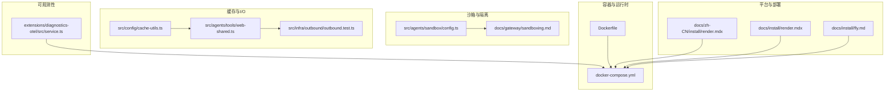
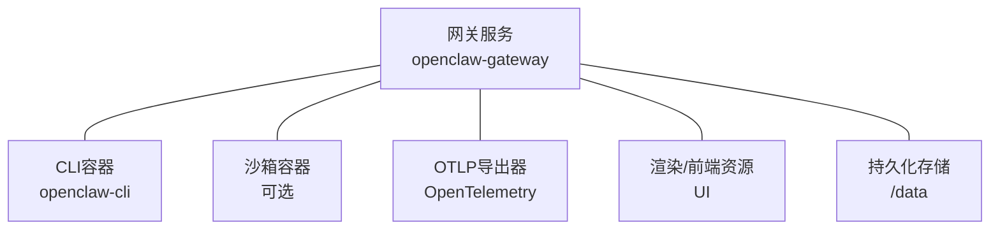
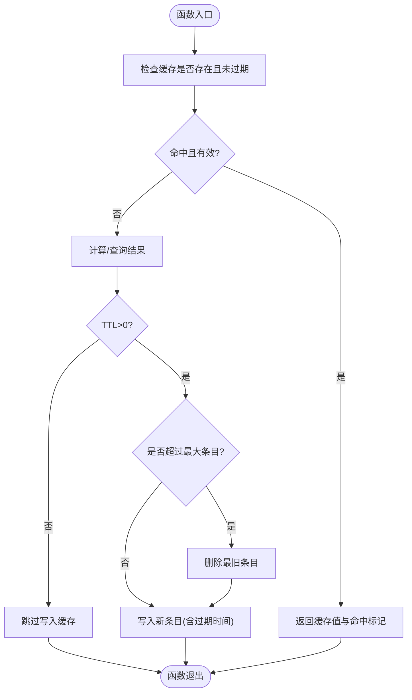
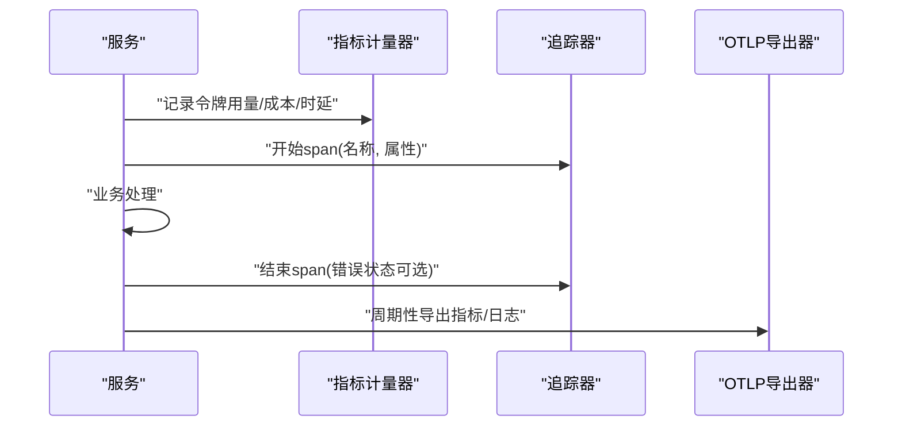
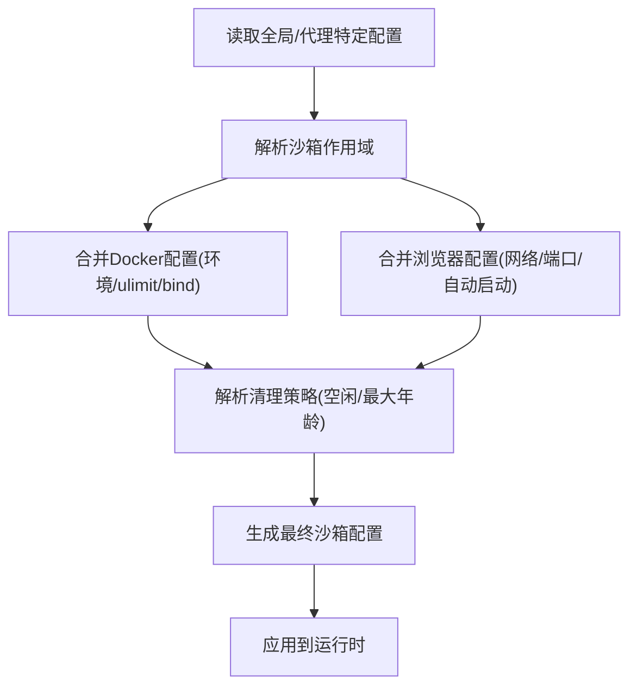
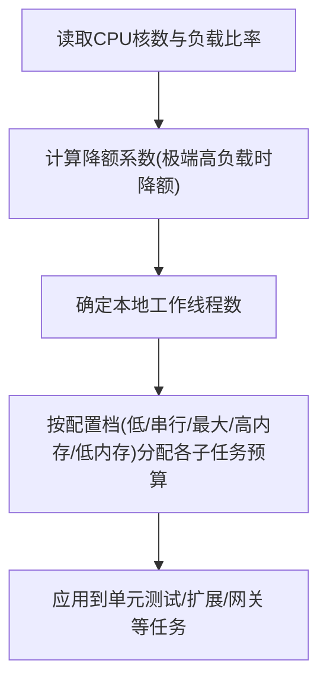
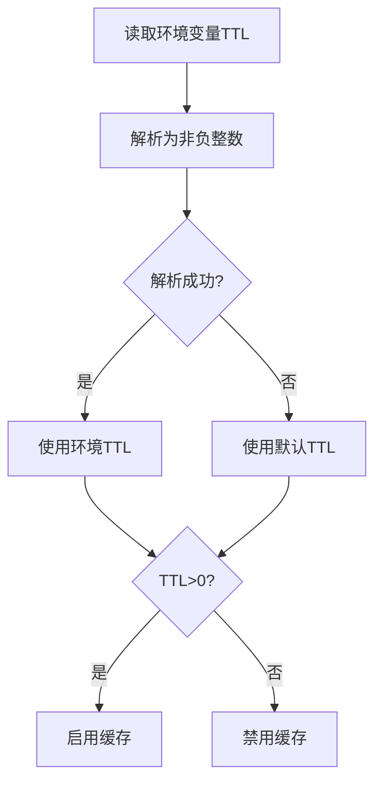
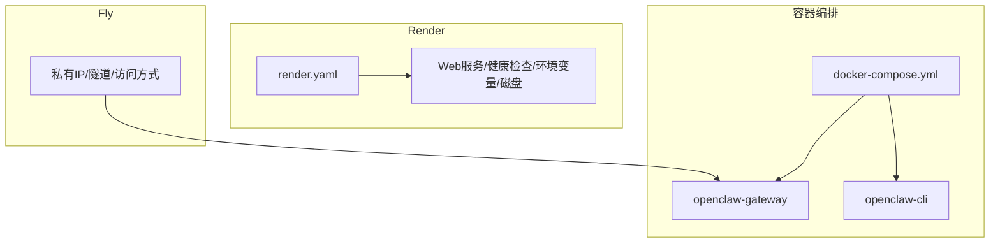
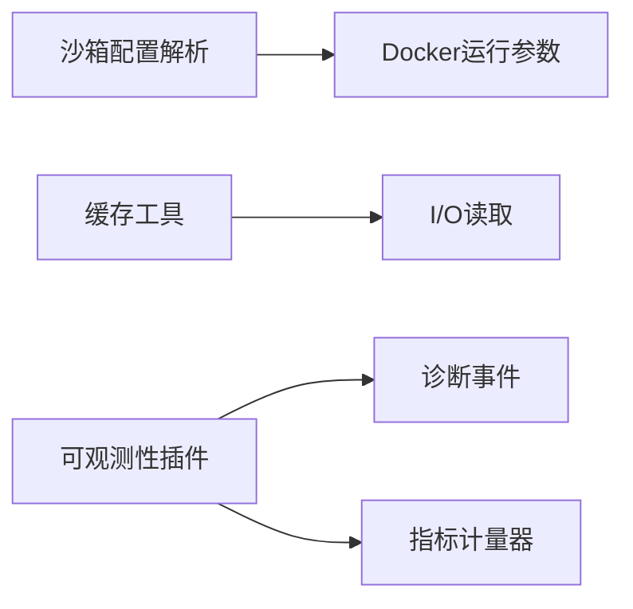

# 性能优化

<cite>
**本文引用的文件**
- [Dockerfile](file://Dockerfile)
- [docker-compose.yml](file://docker-compose.yml)
- [src/agents/sandbox/config.ts](file://src/agents/sandbox/config.ts)
- [docs/gateway/sandboxing.md](file://docs/gateway/sandboxing.md)
- [src/agents/tools/web-shared.ts](file://src/agents/tools/web-shared.ts)
- [src/config/cache-utils.ts](file://src/config/cache-utils.ts)
- [src/infra/outbound/outbound.test.ts](file://src/infra/outbound/outbound.test.ts)
- [extensions/diagnostics-otel/src/service.ts](file://extensions/diagnostics-otel/src/service.ts)
- [src/shared/usage-aggregates.ts](file://src/shared/usage-aggregates.ts)
- [src/agents/pi-embedded-runner/run.ts](file://src/agents/pi-embedded-runner/run.ts)
- [src/agents/pi-embedded-runner/cache-ttl.ts](file://src/agents/pi-embedded-runner/cache-ttl.ts)
- [src/agents/pi-settings.ts](file://src/agents/pi-settings.ts)
- [src/commands/doctor-platform-notes.ts](file://src/commands/doctor-platform-notes.ts)
- [scripts/test-parallel.mjs](file://scripts/test-parallel.mjs)
- [scripts/test-perf-budget.mjs](file://scripts/test-perf-budget.mjs)
- [src/discord/monitor/thread-bindings.lifecycle.ts](file://src/discord/monitor/thread-bindings.lifecycle.ts)
- [docs/zh-CN/install/render.mdx](file://docs/zh-CN/install/render.mdx)
- [docs/install/render.mdx](file://docs/install/render.mdx)
- [docs/install/fly.md](file://docs/install/fly.md)
</cite>

## 目录
1. [简介](#简介)
2. [项目结构](#项目结构)
3. [核心组件](#核心组件)
4. [架构总览](#架构总览)
5. [详细组件分析](#详细组件分析)
6. [依赖关系分析](#依赖关系分析)
7. [性能考量](#性能考量)
8. [故障排查指南](#故障排查指南)
9. [结论](#结论)
10. [附录](#附录)

## 简介
本指南面向OpenClaw运维与平台工程团队，聚焦于系统性能优化的实战方法论与落地实践。内容覆盖性能瓶颈识别、内存管理、CPU利用率优化、I/O与网络延迟优化、缓存策略、并发控制、资源限制、负载均衡、代理执行与沙箱隔离优化、渠道适配器性能调优，以及在容器化、本地与云端环境下的差异化优化策略。同时提供可观测性指标体系、性能预算与回归测试机制，帮助建立可度量、可演进的性能治理闭环。

## 项目结构
OpenClaw采用多语言混合与模块化组织，核心运行时由Node.js承载，容器化与编排通过Docker与Compose实现；扩展能力通过插件与技能体系提供；可观测性通过OpenTelemetry插件输出指标、追踪与日志。关键路径如下：
- 容器镜像与运行时：Dockerfile与docker-compose.yml定义基础镜像、运行用户、健康检查与端口暴露。
- 沙箱与隔离：沙箱配置解析与浏览器沙箱参数，支持网络与卷绑定、资源限制与安全策略。
- 缓存与I/O：通用缓存工具、目录缓存实现与LRU淘汰策略，结合超时与最大条目限制。
- 可观测性：OpenTelemetry插件注册计数器、直方图与日志导出器，采集消息队列、会话状态、运行尝试等关键指标。
- 平台与部署：多云部署文档与私有部署说明，指导健康检查、持久化与网络访问策略。

**图表来源**
- [Dockerfile:1-231](file://Dockerfile#L1-L231)
- [docker-compose.yml:1-77](file://docker-compose.yml#L1-L77)
- [src/agents/sandbox/config.ts:1-217](file://src/agents/sandbox/config.ts#L1-L217)
- [docs/gateway/sandboxing.md:121-149](file://docs/gateway/sandboxing.md#L121-L149)
- [src/agents/tools/web-shared.ts:1-171](file://src/agents/tools/web-shared.ts#L1-L171)
- [src/config/cache-utils.ts:1-38](file://src/config/cache-utils.ts#L1-L38)
- [src/infra/outbound/outbound.test.ts:636-671](file://src/infra/outbound/outbound.test.ts#L636-L671)
- [extensions/diagnostics-otel/src/service.ts:1-686](file://extensions/diagnostics-otel/src/service.ts#L1-L686)
- [docs/zh-CN/install/render.mdx:1-75](file://docs/zh-CN/install/render.mdx#L1-L75)
- [docs/install/render.mdx:1-63](file://docs/install/render.mdx#L1-L63)
- [docs/install/fly.md:365-433](file://docs/install/fly.md#L365-L433)

**章节来源**
- [Dockerfile:1-231](file://Dockerfile#L1-L231)
- [docker-compose.yml:1-77](file://docker-compose.yml#L1-L77)

## 核心组件
- 容器与运行时
  - 镜像分层与运行用户：非root用户运行，降低逃逸风险；健康检查端点与默认启动命令。
  - 可选安装浏览器与Docker CLI：按需启用Playwright与沙箱容器管理。
- 沙箱与隔离
  - 沙箱模式、作用域、工作区访问策略、Docker资源限制与安全配置（capDrop、seccomp、apparmor、DNS、extraHosts等）。
  - 浏览器沙箱网络与端口映射、自动启动超时、NoVNC/VNC端口等。
- 缓存与I/O
  - 内存缓存Map结构，带TTL过期与LRU淘汰；响应读取支持流式解码与字节截断。
  - 目录缓存实现，基于容量与最近最少使用策略的逐出。
- 可观测性
  - Token用量、成本、消息处理时延、队列深度与等待时间、会话卡滞、运行尝试次数等指标。
  - 日志红名单与敏感信息脱敏，支持OTLP Protobuf导出。
- 平台与部署
  - Render蓝图与Fly私有部署策略，指导健康检查、持久化磁盘与网络访问。

**章节来源**
- [Dockerfile:211-231](file://Dockerfile#L211-L231)
- [docker-compose.yml:1-77](file://docker-compose.yml#L1-L77)
- [src/agents/sandbox/config.ts:76-120](file://src/agents/sandbox/config.ts#L76-L120)
- [src/agents/sandbox/config.ts:122-155](file://src/agents/sandbox/config.ts#L122-L155)
- [docs/gateway/sandboxing.md:121-149](file://docs/gateway/sandboxing.md#L121-L149)
- [src/agents/tools/web-shared.ts:26-61](file://src/agents/tools/web-shared.ts#L26-L61)
- [src/agents/tools/web-shared.ts:95-171](file://src/agents/tools/web-shared.ts#L95-L171)
- [src/config/cache-utils.ts:1-38](file://src/config/cache-utils.ts#L1-L38)
- [src/infra/outbound/outbound.test.ts:636-671](file://src/infra/outbound/outbound.test.ts#L636-L671)
- [extensions/diagnostics-otel/src/service.ts:167-242](file://extensions/diagnostics-otel/src/service.ts#L167-L242)
- [extensions/diagnostics-otel/src/service.ts:243-366](file://extensions/diagnostics-otel/src/service.ts#L243-L366)
- [docs/zh-CN/install/render.mdx:39-75](file://docs/zh-CN/install/render.mdx#L39-L75)
- [docs/install/render.mdx:25-63](file://docs/install/render.mdx#L25-L63)
- [docs/install/fly.md:365-433](file://docs/install/fly.md#L365-L433)

## 架构总览
下图展示OpenClaw在容器化环境中的关键组件交互：网关服务、CLI容器、沙箱容器（可选）、可观测性导出器与外部平台（如Render、Fly）。

**图表来源**
- [docker-compose.yml:2-37](file://docker-compose.yml#L2-L37)
- [Dockerfile:224-231](file://Dockerfile#L224-L231)
- [extensions/diagnostics-otel/src/service.ts:110-134](file://extensions/diagnostics-otel/src/service.ts#L110-L134)

## 详细组件分析

### 组件A：缓存与I/O优化
- 内存缓存
  - 结构：Map键值对，条目包含值、过期时间与插入时间。
  - TTL：毫秒级TTL计算与校验，过期自动清理。
  - LRU：达到最大条目阈值时删除最旧项。
- 目录缓存
  - 基于容量与最近最少使用策略的逐出，确保高吞吐场景下的空间可控。
- I/O读取
  - 支持ReadableStream按块读取与文本解码，配合最大字节数截断，避免大响应阻塞。
  - 超时信号合并AbortController，统一超时控制。
- 配置与工具
  - 缓存TTL解析与启用判断，文件状态快照辅助变更检测。

**图表来源**
- [src/agents/tools/web-shared.ts:26-61](file://src/agents/tools/web-shared.ts#L26-L61)
- [src/config/cache-utils.ts:4-20](file://src/config/cache-utils.ts#L4-L20)
- [src/infra/outbound/outbound.test.ts:636-671](file://src/infra/outbound/outbound.test.ts#L636-L671)

**章节来源**
- [src/agents/tools/web-shared.ts:1-171](file://src/agents/tools/web-shared.ts#L1-L171)
- [src/config/cache-utils.ts:1-38](file://src/config/cache-utils.ts#L1-L38)
- [src/infra/outbound/outbound.test.ts:636-671](file://src/infra/outbound/outbound.test.ts#L636-L671)

### 组件B：可观测性与性能指标
- 指标体系
  - Token用量（输入/输出/缓存读写/提示/总计）、成本估算、运行时长、上下文窗口大小。
  - Webhook接收/处理/错误、消息排队/处理时延、队列深度与等待时间、会话状态与卡滞、运行尝试次数。
- 日志与追踪
  - OTLP Protobuf导出，支持采样率、批量导出间隔与敏感信息脱敏。
  - 事件驱动的指标上报，涵盖诊断心跳、消息生命周期与错误状态。
- 分析与趋势
  - 使用聚合工具合并每日延迟与总量统计，便于趋势分析与回归对比。

**图表来源**
- [extensions/diagnostics-otel/src/service.ts:167-242](file://extensions/diagnostics-otel/src/service.ts#L167-L242)
- [extensions/diagnostics-otel/src/service.ts:243-366](file://extensions/diagnostics-otel/src/service.ts#L243-L366)
- [extensions/diagnostics-otel/src/service.ts:619-664](file://extensions/diagnostics-otel/src/service.ts#L619-L664)

**章节来源**
- [extensions/diagnostics-otel/src/service.ts:1-686](file://extensions/diagnostics-otel/src/service.ts#L1-L686)
- [src/shared/usage-aggregates.ts:1-66](file://src/shared/usage-aggregates.ts#L1-L66)

### 组件C：沙箱与代理执行优化
- 沙箱配置解析
  - Docker镜像、容器前缀、工作目录、只读根文件系统、tmpfs挂载、网络、用户、capDrop、环境变量、ulimit、seccomp/apparmor、DNS、extraHosts、binds与危险布尔开关。
  - 浏览器沙箱图像、网络、端口、自动启动超时、headless与NoVNC/VNC开关。
- 启动与网络
  - 默认无网络沙箱，可通过配置覆盖；浏览器容器需要网络访问。
- 安全与资源
  - 严格的安全策略与资源限制，降低逃逸与资源滥用风险。

**图表来源**
- [src/agents/sandbox/config.ts:63-74](file://src/agents/sandbox/config.ts#L63-L74)
- [src/agents/sandbox/config.ts:76-120](file://src/agents/sandbox/config.ts#L76-L120)
- [src/agents/sandbox/config.ts:122-155](file://src/agents/sandbox/config.ts#L122-L155)
- [src/agents/sandbox/config.ts:157-168](file://src/agents/sandbox/config.ts#L157-L168)
- [docs/gateway/sandboxing.md:121-149](file://docs/gateway/sandboxing.md#L121-L149)

**章节来源**
- [src/agents/sandbox/config.ts:1-217](file://src/agents/sandbox/config.ts#L1-L217)
- [docs/gateway/sandboxing.md:121-149](file://docs/gateway/sandboxing.md#L121-L149)

### 组件D：并发控制与资源限制
- 并发限速
  - 绑定生命周期中限制启动健康探测并发，避免大规模绑定集导致探针风暴。
- CPU与内存
  - 测试并行脚本根据主机CPU核数与负载比率动态调整工作线程预算，低内存主机保守分配，极端高负载时降额。
- 运行重试迭代上限
  - 基于候选数量与固定基线的上限计算，防止无限重试导致资源耗尽。

**图表来源**
- [scripts/test-parallel.mjs:243-300](file://scripts/test-parallel.mjs#L243-L300)

**章节来源**
- [src/discord/monitor/thread-bindings.lifecycle.ts:45-81](file://src/discord/monitor/thread-bindings.lifecycle.ts#L45-L81)
- [scripts/test-parallel.mjs:243-300](file://scripts/test-parallel.mjs#L243-L300)
- [src/agents/pi-embedded-runner/run.ts:136-147](file://src/agents/pi-embedded-runner/run.ts#L136-L147)

### 组件E：缓存TTL与会话管理
- 缓存TTL
  - 解析环境变量中的TTL值，非法或负值回退至默认；启用判断仅基于TTL>0。
- 会话管理
  - 记录与追加缓存TTL时间戳，支持自定义类型与数据结构，异常时静默忽略以保证稳定性。

**图表来源**
- [src/config/cache-utils.ts:4-20](file://src/config/cache-utils.ts#L4-L20)
- [src/agents/pi-embedded-runner/cache-ttl.ts:38-76](file://src/agents/pi-embedded-runner/cache-ttl.ts#L38-L76)

**章节来源**
- [src/config/cache-utils.ts:1-38](file://src/config/cache-utils.ts#L1-L38)
- [src/agents/pi-embedded-runner/cache-ttl.ts:38-76](file://src/agents/pi-embedded-runner/cache-ttl.ts#L38-L76)

### 组件F：平台与部署优化
- Render蓝图
  - 声明式定义服务、磁盘、环境变量与健康检查路径；支持一次性部署与持久化存储。
- Fly私有部署
  - 私有IP与隧道访问策略，隐藏公网暴露面；提供本地代理、WireGuard与SSH访问选项。
- 容器与编排
  - Compose服务定义健康检查、端口映射、卷挂载与依赖关系；网关默认绑定与鉴权建议。

**图表来源**
- [docs/zh-CN/install/render.mdx:39-75](file://docs/zh-CN/install/render.mdx#L39-L75)
- [docs/install/render.mdx:25-63](file://docs/install/render.mdx#L25-L63)
- [docs/install/fly.md:365-433](file://docs/install/fly.md#L365-L433)
- [docker-compose.yml:2-37](file://docker-compose.yml#L2-L37)

**章节来源**
- [docs/zh-CN/install/render.mdx:1-75](file://docs/zh-CN/install/render.mdx#L1-L75)
- [docs/install/render.mdx:1-63](file://docs/install/render.mdx#L1-L63)
- [docs/install/fly.md:365-433](file://docs/install/fly.md#L365-L433)
- [docker-compose.yml:1-77](file://docker-compose.yml#L1-L77)

## 依赖关系分析
- 组件耦合
  - 沙箱配置解析与Docker运行参数强耦合，涉及镜像、网络、资源限制与安全策略。
  - 缓存工具与I/O读取模块相互协作，前者负责数据生命周期，后者负责高效读取。
  - 可观测性插件与诊断事件解耦，通过事件总线订阅与指标计量器解耦。
- 外部依赖
  - OpenTelemetry生态（导出器、采样器、资源属性），OTLP Protobuf协议。
  - Docker运行时（可选安装Docker CLI以支持沙箱容器管理）。
- 循环依赖
  - 当前文件未发现循环依赖迹象；若引入新的插件或扩展，应避免双向依赖。

**图表来源**
- [src/agents/sandbox/config.ts:76-120](file://src/agents/sandbox/config.ts#L76-L120)
- [src/agents/tools/web-shared.ts:26-61](file://src/agents/tools/web-shared.ts#L26-L61)
- [extensions/diagnostics-otel/src/service.ts:619-664](file://extensions/diagnostics-otel/src/service.ts#L619-L664)

**章节来源**
- [src/agents/sandbox/config.ts:1-217](file://src/agents/sandbox/config.ts#L1-L217)
- [src/agents/tools/web-shared.ts:1-171](file://src/agents/tools/web-shared.ts#L1-L171)
- [extensions/diagnostics-otel/src/service.ts:1-686](file://extensions/diagnostics-otel/src/service.ts#L1-L686)

## 性能考量
- 内存管理
  - 使用Map作为缓存容器，结合TTL与LRU逐出，避免无限增长；对大响应采用流式读取与字节截断，降低峰值内存占用。
  - 启动编译缓存与无自重生模式：在低功耗设备上设置编译缓存目录与禁用自重生，减少重复启动开销。
- CPU利用率
  - 测试并行脚本按CPU核数与负载动态分配工作线程，极端高负载时降额，避免系统抖动。
  - 沙箱容器默认无网络，按需开启，减少不必要的网络栈开销。
- I/O性能
  - 目录缓存实现容量与LRU策略，保障高并发场景下的I/O稳定。
  - 通过超时信号与AbortController统一控制I/O超时，避免长时间阻塞。
- 网络延迟
  - 沙箱容器默认无网络，浏览器容器按需开启网络；在容器编排中合理规划端口与健康检查路径。
  - 使用OTLP导出器周期性批量导出，降低频繁小包带来的网络抖动。
- 缓存策略
  - TTL解析与启用判断，确保缓存命中率与新鲜度平衡；目录缓存支持容量上限与逐出策略。
- 并发控制
  - 绑定生命周期中限制并发健康探测，避免大规模绑定导致探针风暴。
- 资源限制
  - Docker运行参数提供ulimit、内存、CPU配额、DNS与extraHosts等资源与网络限制。
- 负载均衡
  - 通过多云平台（Render、Fly）与容器编排实现副本与健康检查，结合外部负载均衡策略。
- 代理执行与沙箱安全隔离
  - 严格的安全策略（capDrop、seccomp、apparmor）与只读根文件系统，降低逃逸风险。
- 渠道适配器性能调优
  - 通过并发限速与超时控制，避免单通道成为瓶颈；结合可观测性指标定位慢通道。

[本节为通用性能指导，无需特定文件分析]

## 故障排查指南
- 启动与编译缓存
  - 在低功耗设备上设置编译缓存目录至/var/tmp，确保重启后缓存可用；必要时禁用自重生以减少额外启动开销。
- 性能回归与预算
  - 使用性能预算脚本设定最大墙钟时间与基线回归阈值，失败时输出详细统计并退出。
- 并发与资源
  - 检查测试并行脚本的工作线程分配与负载比率，极端高负载时降额策略是否生效。
- 沙箱与网络
  - 确认沙箱网络配置与浏览器容器网络；容器编排中端口映射与健康检查路径是否正确。
- 可观测性
  - 确认OTLP导出器端点、协议与头部配置；检查指标与日志导出是否正常。

**章节来源**
- [src/commands/doctor-platform-notes.ts:188-221](file://src/commands/doctor-platform-notes.ts#L188-L221)
- [scripts/test-perf-budget.mjs:98-127](file://scripts/test-perf-budget.mjs#L98-L127)
- [scripts/test-parallel.mjs:243-300](file://scripts/test-parallel.mjs#L243-L300)
- [docker-compose.yml:23-49](file://docker-compose.yml#L23-L49)
- [extensions/diagnostics-otel/src/service.ts:87-104](file://extensions/diagnostics-otel/src/service.ts#L87-L104)

## 结论
通过容器化运行时、严格的沙箱与资源限制、高效的缓存与I/O策略、完善的可观测性指标体系，以及针对不同部署环境的优化策略，OpenClaw能够在多样化场景下实现稳定、可扩展与高性能的运行。建议持续以性能预算与回归测试为抓手，结合可观测性数据进行瓶颈定位与优化迭代，形成闭环的性能治理流程。

[本节为总结性内容，无需特定文件分析]

## 附录
- 不同部署环境下的性能调优建议
  - 容器化部署
    - 使用Slim变体镜像以减小体积；按需安装浏览器与Docker CLI；启用编译缓存与无自重生模式。
  - 本地部署
    - 设置编译缓存目录至持久化路径；根据CPU核数与负载动态调整并行度；启用健康检查与日志导出。
  - 云端部署
    - Render蓝图：声明式定义服务、磁盘与健康检查；Fly私有部署：私有IP与隧道访问，隐藏公网暴露面。
- 关键优化清单
  - 缓存：启用TTL、控制最大条目、定期清理过期项。
  - 并发：限制启动健康探测并发、按负载动态分配工作线程。
  - 资源：合理设置ulimit、内存与CPU配额、网络与DNS。
  - 可观测性：配置OTLP导出、采样率与批量间隔，关注消息队列、会话状态与运行尝试指标。

[本节为通用指导，无需特定文件分析]