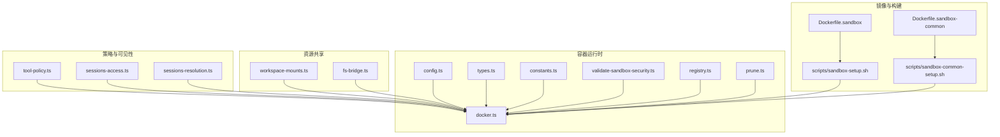
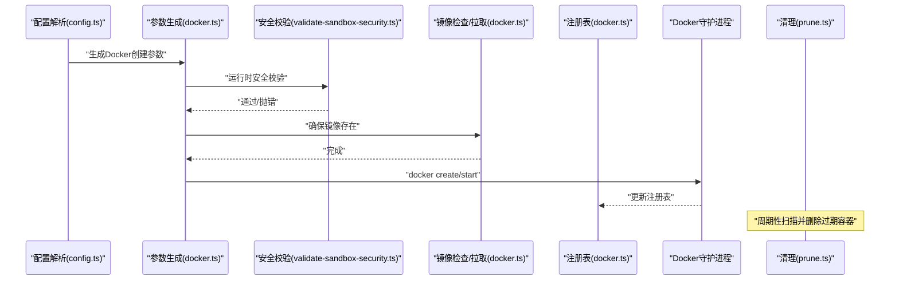
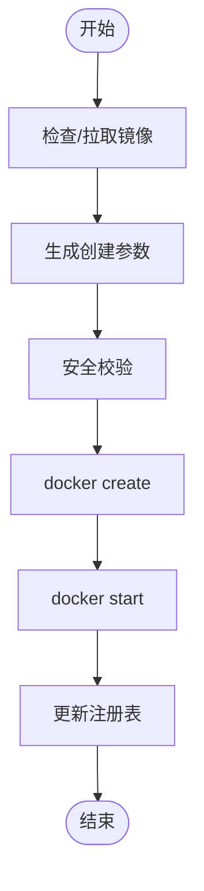
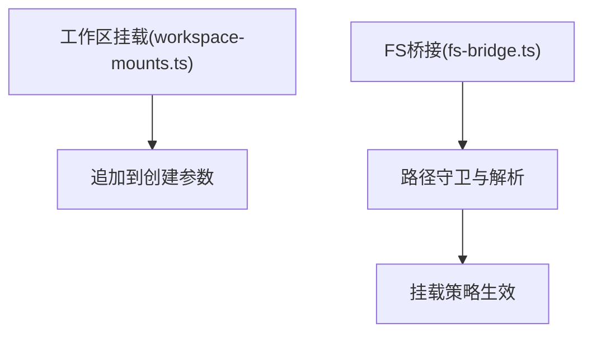
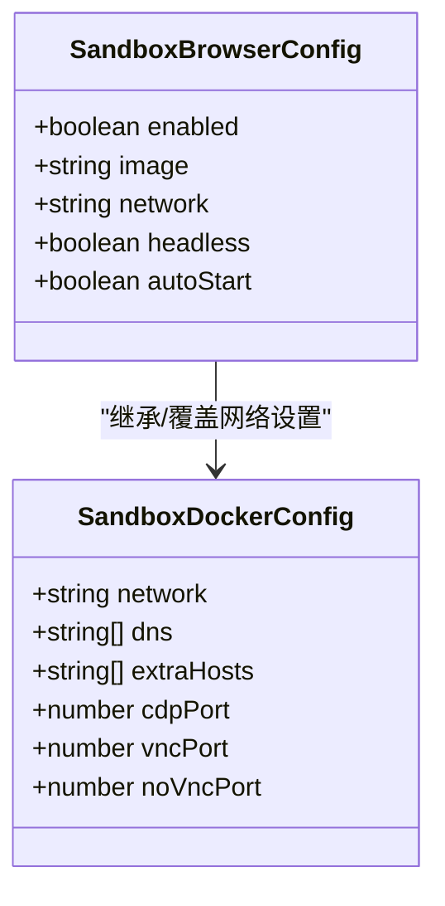
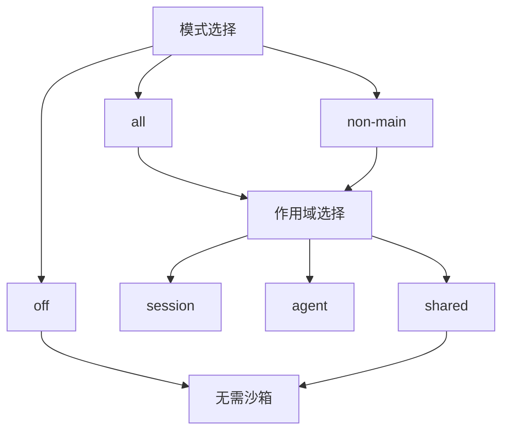
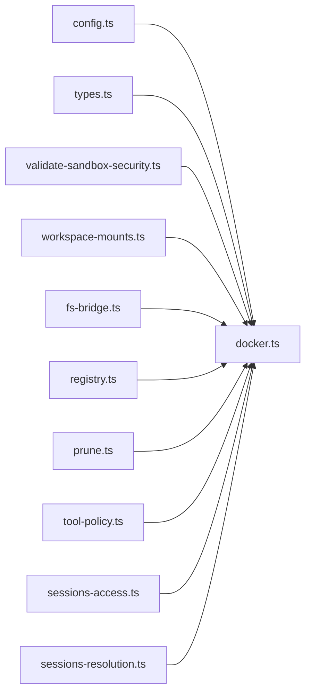

# 沙箱性能优化

<cite>
**本文引用的文件**
- [Dockerfile.sandbox](file://Dockerfile.sandbox)
- [Dockerfile.sandbox-common](file://Dockerfile.sandbox-common)
- [scripts/sandbox-setup.sh](file://scripts/sandbox-setup.sh)
- [scripts/sandbox-common-setup.sh](file://scripts/sandbox-common-setup.sh)
- [src/agents/sandbox/docker.ts](file://src/agents/sandbox/docker.ts)
- [src/agents/sandbox/config.ts](file://src/agents/sandbox/config.ts)
- [src/agents/sandbox/types.ts](file://src/agents/sandbox/types.ts)
- [src/agents/sandbox/constants.ts](file://src/agents/sandbox/constants.ts)
- [src/agents/sandbox/workspace-mounts.ts](file://src/agents/sandbox/workspace-mounts.ts)
- [src/agents/sandbox/validate-sandbox-security.ts](file://src/agents/sandbox/validate-sandbox-security.ts)
- [src/agents/sandbox/registry.ts](file://src/agents/sandbox/registry.ts)
- [src/agents/sandbox/prune.ts](file://src/agents/sandbox/prune.ts)
- [src/agents/sandbox/tool-policy.ts](file://src/agents/sandbox/tool-policy.ts)
- [src/agents/sandbox/runtime-status.ts](file://src/agents/sandbox/runtime-status.ts)
- [src/agents/sandbox/shared.ts](file://src/agents/sandbox/shared.ts)
- [src/agents/sandbox/fs-bridge.ts](file://src/agents/sandbox/fs-bridge.ts)
- [src/agents/sandbox-create-args.test.ts](file://src/agents/sandbox-create-args.test.ts)
- [src/agents/sandbox-merge.test.ts](file://src/agents/sandbox-merge.test.ts)
- [src/agents/sandbox/validate-sandbox-security.test.ts](file://src/agents/sandbox/validate-sandbox-security.test.ts)
- [src/agents/sandbox-agent-config.agent-specific-sandbox-config.e2e.test.ts](file://src/agents/sandbox-agent-config.agent-specific-sandbox-config.e2e.test.ts)
- [src/agents/tools/sessions-access.ts](file://src/agents/tools/sessions-access.ts)
- [src/agents/tools/sessions-resolution.ts](file://src/agents/tools/sessions-resolution.ts)
- [src/utils/run-with-concurrency.ts](file://src/utils/run-with-concurrency.ts)
</cite>

## 目录
1. [简介](#简介)
2. [项目结构](#项目结构)
3. [核心组件](#核心组件)
4. [架构总览](#架构总览)
5. [详细组件分析](#详细组件分析)
6. [依赖关系分析](#依赖关系分析)
7. [性能考量](#性能考量)
8. [故障排查指南](#故障排查指南)
9. [结论](#结论)
10. [附录](#附录)

## 简介
本文件面向OpenClaw沙箱性能优化，系统性梳理容器启动优化、资源共享、网络性能、存储I/O、镜像构建与缓存、并发容器管理、资源限制与清理策略等关键主题。文档同时解释三种沙箱模式（session、agent、shared）的性能特征与选择策略，并提供可落地的实施方案与最佳实践，帮助在保障安全性的前提下实现更高的吞吐与更低的延迟。

## 项目结构
围绕沙箱性能优化的相关代码主要集中在以下模块：
- 镜像与构建：Dockerfile与构建脚本
- 容器生命周期与参数生成：docker.ts、config.ts、types.ts、constants.ts
- 资源共享与挂载：workspace-mounts.ts、fs-bridge.ts
- 安全校验与网络隔离：validate-sandbox-security.ts
- 注册表与清理：registry.ts、prune.ts
- 工具策略与会话可见性：tool-policy.ts、sessions-access.ts、sessions-resolution.ts
- 并发控制与运行时状态：runtime-status.ts、shared.ts、run-with-concurrency.ts

**图表来源**
- [Dockerfile.sandbox](file://Dockerfile.sandbox)
- [Dockerfile.sandbox-common](file://Dockerfile.sandbox-common)
- [scripts/sandbox-setup.sh](file://scripts/sandbox-setup.sh)
- [scripts/sandbox-common-setup.sh](file://scripts/sandbox-common-setup.sh)
- [src/agents/sandbox/docker.ts](file://src/agents/sandbox/docker.ts)
- [src/agents/sandbox/config.ts](file://src/agents/sandbox/config.ts)
- [src/agents/sandbox/types.ts](file://src/agents/sandbox/types.ts)
- [src/agents/sandbox/constants.ts](file://src/agents/sandbox/constants.ts)
- [src/agents/sandbox/workspace-mounts.ts](file://src/agents/sandbox/workspace-mounts.ts)
- [src/agents/sandbox/validate-sandbox-security.ts](file://src/agents/sandbox/validate-sandbox-security.ts)
- [src/agents/sandbox/registry.ts](file://src/agents/sandbox/registry.ts)
- [src/agents/sandbox/prune.ts](file://src/agents/sandbox/prune.ts)
- [src/agents/sandbox/tool-policy.ts](file://src/agents/sandbox/tool-policy.ts)
- [src/agents/tools/sessions-access.ts](file://src/agents/tools/sessions-access.ts)
- [src/agents/tools/sessions-resolution.ts](file://src/agents/tools/sessions-resolution.ts)

**章节来源**
- [Dockerfile.sandbox](file://Dockerfile.sandbox)
- [Dockerfile.sandbox-common](file://Dockerfile.sandbox-common)
- [scripts/sandbox-setup.sh](file://scripts/sandbox-setup.sh)
- [scripts/sandbox-common-setup.sh](file://scripts/sandbox-common-setup.sh)
- [src/agents/sandbox/docker.ts](file://src/agents/sandbox/docker.ts)
- [src/agents/sandbox/config.ts](file://src/agents/sandbox/config.ts)
- [src/agents/sandbox/types.ts](file://src/agents/sandbox/types.ts)
- [src/agents/sandbox/constants.ts](file://src/agents/sandbox/constants.ts)
- [src/agents/sandbox/workspace-mounts.ts](file://src/agents/sandbox/workspace-mounts.ts)
- [src/agents/sandbox/validate-sandbox-security.ts](file://src/agents/sandbox/validate-sandbox-security.ts)
- [src/agents/sandbox/registry.ts](file://src/agents/sandbox/registry.ts)
- [src/agents/sandbox/prune.ts](file://src/agents/sandbox/prune.ts)
- [src/agents/sandbox/tool-policy.ts](file://src/agents/sandbox/tool-policy.ts)
- [src/agents/tools/sessions-access.ts](file://src/agents/tools/sessions-access.ts)
- [src/agents/tools/sessions-resolution.ts](file://src/agents/tools/sessions-resolution.ts)

## 核心组件
- 镜像与构建
  - 基础镜像与通用工具链镜像，支持缓存层复用与可选安装包定制。
  - 构建脚本负责按需构建与缓存参数化配置。
- 容器生命周期与参数生成
  - 统一的容器创建参数生成逻辑，包含资源限制、安全选项、网络与DNS、ulimit、bind挂载等。
  - 运行时确保镜像存在、必要时拉取或打标签；热容器窗口内提示重建以应用变更。
- 资源共享与挂载
  - 主工作区与代理工作区挂载策略，支持只读/读写控制。
  - 文件系统桥接用于路径解析与安全访问控制。
- 安全校验与网络隔离
  - 绑定挂载黑名单、保留目标路径保护、网络模式限制、安全配置文件校验。
- 注册表与清理
  - 容器注册表持久化与并发写入锁；基于空闲与最大存活时间的定期清理。
- 工具策略与会话可见性
  - 沙箱工具白名单/黑名单与默认策略；会话可见性与沙箱内限制。

**章节来源**
- [Dockerfile.sandbox](file://Dockerfile.sandbox)
- [Dockerfile.sandbox-common](file://Dockerfile.sandbox-common)
- [scripts/sandbox-setup.sh](file://scripts/sandbox-setup.sh)
- [scripts/sandbox-common-setup.sh](file://scripts/sandbox-common-setup.sh)
- [src/agents/sandbox/docker.ts](file://src/agents/sandbox/docker.ts)
- [src/agents/sandbox/config.ts](file://src/agents/sandbox/config.ts)
- [src/agents/sandbox/types.ts](file://src/agents/sandbox/types.ts)
- [src/agents/sandbox/constants.ts](file://src/agents/sandbox/constants.ts)
- [src/agents/sandbox/workspace-mounts.ts](file://src/agents/sandbox/workspace-mounts.ts)
- [src/agents/sandbox/validate-sandbox-security.ts](file://src/agents/sandbox/validate-sandbox-security.ts)
- [src/agents/sandbox/registry.ts](file://src/agents/sandbox/registry.ts)
- [src/agents/sandbox/prune.ts](file://src/agents/sandbox/prune.ts)
- [src/agents/sandbox/tool-policy.ts](file://src/agents/sandbox/tool-policy.ts)
- [src/agents/tools/sessions-access.ts](file://src/agents/tools/sessions-access.ts)
- [src/agents/tools/sessions-resolution.ts](file://src/agents/tools/sessions-resolution.ts)

## 架构总览
下图展示从配置到容器创建、运行、清理的端到端流程，以及与安全校验、注册表、挂载策略的关系。

**图表来源**
- [src/agents/sandbox/config.ts](file://src/agents/sandbox/config.ts)
- [src/agents/sandbox/docker.ts](file://src/agents/sandbox/docker.ts)
- [src/agents/sandbox/validate-sandbox-security.ts](file://src/agents/sandbox/validate-sandbox-security.ts)
- [src/agents/sandbox/prune.ts](file://src/agents/sandbox/prune.ts)

## 详细组件分析

### 容器启动优化
- 镜像准备与缓存
  - 使用APT缓存mount与分层缓存，减少重复安装时间。
  - 支持通过构建参数切换包集合与最终用户，便于多场景复用。
- 启动参数最小化
  - 默认只读根文件系统、tmpfs关键目录、禁用新权限、丢弃全部能力、限制CPU/内存/PIDs/ulimit。
  - DNS与额外主机映射按需注入，避免不必要的网络开销。
- 热容器窗口与重建提示
  - 最近使用的容器在配置变更时，若处于热窗口内仅提示重建，避免强制重启影响吞吐。

**图表来源**
- [src/agents/sandbox/docker.ts](file://src/agents/sandbox/docker.ts)
- [src/agents/sandbox/validate-sandbox-security.ts](file://src/agents/sandbox/validate-sandbox-security.ts)

**章节来源**
- [Dockerfile.sandbox](file://Dockerfile.sandbox)
- [Dockerfile.sandbox-common](file://Dockerfile.sandbox-common)
- [scripts/sandbox-setup.sh](file://scripts/sandbox-setup.sh)
- [scripts/sandbox-common-setup.sh](file://scripts/sandbox-common-setup.sh)
- [src/agents/sandbox/docker.ts](file://src/agents/sandbox/docker.ts)
- [src/agents/sandbox/config.ts](file://src/agents/sandbox/config.ts)

### 资源共享与挂载策略
- 工作区挂载
  - 主工作区与代理工作区分别挂载，支持只读/读写控制，避免不必要的写放大。
  - 通过常量统一代理工作区挂载点，保证一致性。
- 文件系统桥接
  - 解析与归一化宿主路径，结合保留目标路径保护，防止覆盖关键挂载点。
  - 提供路径解析与文件读取封装，降低上层复杂度。

**图表来源**
- [src/agents/sandbox/workspace-mounts.ts](file://src/agents/sandbox/workspace-mounts.ts)
- [src/agents/sandbox/fs-bridge.ts](file://src/agents/sandbox/fs-bridge.ts)
- [src/agents/sandbox/constants.ts](file://src/agents/sandbox/constants.ts)

**章节来源**
- [src/agents/sandbox/workspace-mounts.ts](file://src/agents/sandbox/workspace-mounts.ts)
- [src/agents/sandbox/fs-bridge.ts](file://src/agents/sandbox/fs-bridge.ts)
- [src/agents/sandbox/constants.ts](file://src/agents/sandbox/constants.ts)

### 网络性能提升
- 网络模式与DNS
  - 默认无网络模式，浏览器容器可按需启用桥接网络与指定DNS与额外主机映射。
  - 严格禁止host网络与容器命名空间加入，避免绕过隔离带来的不可控网络行为。
- 端口映射与桥接
  - 浏览器容器支持CDP/VNC/novnc端口配置，便于远程调试与无头运行。

**图表来源**
- [src/agents/sandbox/types.ts](file://src/agents/sandbox/types.ts)
- [src/agents/sandbox/config.ts](file://src/agents/sandbox/config.ts)
- [src/agents/sandbox/constants.ts](file://src/agents/sandbox/constants.ts)

**章节来源**
- [src/agents/sandbox/config.ts](file://src/agents/sandbox/config.ts)
- [src/agents/sandbox/types.ts](file://src/agents/sandbox/types.ts)
- [src/agents/sandbox/constants.ts](file://src/agents/sandbox/constants.ts)
- [src/agents/sandbox/validate-sandbox-security.ts](file://src/agents/sandbox/validate-sandbox-security.ts)

### 存储I/O优化
- 只读根文件系统与tmpfs
  - 默认启用只读根与关键目录tmpfs，减少持久化写入，提高I/O稳定性。
- 挂载粒度控制
  - 仅挂载必要路径，避免大范围bind导致的路径遍历与缓存抖动。
- 注册表与原子写
  - 注册表采用原子写入与写锁，避免并发写导致的数据损坏与重建风暴。

**章节来源**
- [src/agents/sandbox/docker.ts](file://src/agents/sandbox/docker.ts)
- [src/agents/sandbox/workspace-mounts.ts](file://src/agents/sandbox/workspace-mounts.ts)
- [src/agents/sandbox/registry.ts](file://src/agents/sandbox/registry.ts)

### 容器镜像优化
- 分层与缓存
  - 基础镜像与通用工具链镜像分离，APT缓存mount复用，减少重复下载与安装。
  - 通用镜像支持通过构建参数选择安装包与最终用户，便于按需裁剪体积与权限。
- 构建脚本
  - 自动检测基础镜像缺失并引导构建，支持docker buildx与缓存导入导出参数。

**章节来源**
- [Dockerfile.sandbox](file://Dockerfile.sandbox)
- [Dockerfile.sandbox-common](file://Dockerfile.sandbox-common)
- [scripts/sandbox-setup.sh](file://scripts/sandbox-setup.sh)
- [scripts/sandbox-common-setup.sh](file://scripts/sandbox-common-setup.sh)

### 不同沙箱模式的性能特点与选择策略
- 模式解析
  - off：完全不启用沙箱，零隔离但最高性能。
  - non-main：仅对非主会话启用沙箱。
  - all：对所有会话启用沙箱。
- 作用域
  - session：每个会话独立容器，隔离性最好，启动与上下文切换成本高。
  - agent：按代理聚合，减少容器数量，适合高并发场景。
  - shared：全局共享容器，极致节省资源，但隔离性最弱，适合低风险任务。
- 选择建议
  - 高安全要求：session或agent，配合严格的工具策略与网络限制。
  - 高并发低隔离容忍：shared，结合严格的工具白名单与会话可见性限制。
  - 混合策略：全局agent，个别高风险会话降级为session。

**图表来源**
- [src/agents/sandbox/runtime-status.ts](file://src/agents/sandbox/runtime-status.ts)
- [src/agents/sandbox/config.ts](file://src/agents/sandbox/config.ts)
- [src/agents/sandbox/shared.ts](file://src/agents/sandbox/shared.ts)

**章节来源**
- [src/agents/sandbox/runtime-status.ts](file://src/agents/sandbox/runtime-status.ts)
- [src/agents/sandbox/config.ts](file://src/agents/sandbox/config.ts)
- [src/agents/sandbox/shared.ts](file://src/agents/sandbox/shared.ts)
- [src/agents/sandbox-agent-config.agent-specific-sandbox-config.e2e.test.ts](file://src/agents/sandbox-agent-config.agent-specific-sandbox-config.e2e.test.ts)

### 容器镜像优化、bind mount性能调优、网络配置优化实施方案
- 镜像优化
  - 使用APT缓存mount与分层缓存，减少重复安装。
  - 通过构建参数裁剪安装包，按需启用bun/homebrew等工具链。
- bind mount调优
  - 仅挂载必要路径，避免大范围bind；优先使用相对稳定的宿主路径。
  - 使用允许根列表与保留目标路径保护，避免越权与覆盖。
- 网络配置
  - 默认无网络，按需启用桥接网络与DNS；严格禁止host网络与容器命名空间加入。
  - 对浏览器容器单独配置网络与端口，避免与其他容器冲突。

**章节来源**
- [Dockerfile.sandbox-common](file://Dockerfile.sandbox-common)
- [scripts/sandbox-common-setup.sh](file://scripts/sandbox-common-setup.sh)
- [src/agents/sandbox/validate-sandbox-security.ts](file://src/agents/sandbox/validate-sandbox-security.ts)
- [src/agents/sandbox/config.ts](file://src/agents/sandbox/config.ts)

### 沙箱资源限制、并发容器管理、性能监控
- 资源限制
  - CPU配额、内存上限与swap、PIDs限制、ulimit等通过参数生成阶段注入。
- 并发容器管理
  - 注册表记录容器生命周期与最近使用时间，定期清理过期容器。
  - 热容器窗口内提示重建，避免频繁重启。
- 性能监控
  - 通过运行时日志与注册表状态进行健康度跟踪；结合会话可见性策略控制跨会话资源访问。

**章节来源**
- [src/agents/sandbox/docker.ts](file://src/agents/sandbox/docker.ts)
- [src/agents/sandbox/prune.ts](file://src/agents/sandbox/prune.ts)
- [src/agents/sandbox/registry.ts](file://src/agents/sandbox/registry.ts)
- [src/agents/sandbox/tool-policy.ts](file://src/agents/sandbox/tool-policy.ts)
- [src/agents/tools/sessions-access.ts](file://src/agents/tools/sessions-access.ts)

### 平衡安全性与性能的最佳实践
- 安全优先
  - 默认只读根、禁用新权限、丢弃全部能力、严格bind挂载黑名单与保留目标路径保护。
  - 禁止host网络与容器命名空间加入，浏览器容器单独网络。
- 性能让步
  - 在受信任环境可谨慎开启危险选项（如允许外部bind源），但需明确风险与审计。
  - 通过共享作用域与工具白名单减少容器数量与工具开销。

**章节来源**
- [src/agents/sandbox/validate-sandbox-security.ts](file://src/agents/sandbox/validate-sandbox-security.ts)
- [src/agents/sandbox/docker.ts](file://src/agents/sandbox/docker.ts)
- [src/agents/sandbox/config.ts](file://src/agents/sandbox/config.ts)

## 依赖关系分析
- 组件耦合
  - config.ts与types.ts定义配置模型，docker.ts消费这些配置生成创建参数。
  - validate-sandbox-security.ts作为横切关注点，在参数生成前执行安全校验。
  - workspace-mounts.ts与fs-bridge.ts参与挂载与路径解析，影响I/O性能。
  - registry.ts与prune.ts负责容器生命周期管理，影响并发与资源占用。
- 外部依赖
  - Docker CLI命令调用与守护进程交互，错误处理与超时控制至关重要。

**图表来源**
- [src/agents/sandbox/config.ts](file://src/agents/sandbox/config.ts)
- [src/agents/sandbox/types.ts](file://src/agents/sandbox/types.ts)
- [src/agents/sandbox/docker.ts](file://src/agents/sandbox/docker.ts)
- [src/agents/sandbox/validate-sandbox-security.ts](file://src/agents/sandbox/validate-sandbox-security.ts)
- [src/agents/sandbox/workspace-mounts.ts](file://src/agents/sandbox/workspace-mounts.ts)
- [src/agents/sandbox/fs-bridge.ts](file://src/agents/sandbox/fs-bridge.ts)
- [src/agents/sandbox/registry.ts](file://src/agents/sandbox/registry.ts)
- [src/agents/sandbox/prune.ts](file://src/agents/sandbox/prune.ts)
- [src/agents/sandbox/tool-policy.ts](file://src/agents/sandbox/tool-policy.ts)
- [src/agents/tools/sessions-access.ts](file://src/agents/tools/sessions-access.ts)
- [src/agents/tools/sessions-resolution.ts](file://src/agents/tools/sessions-resolution.ts)

**章节来源**
- [src/agents/sandbox/config.ts](file://src/agents/sandbox/config.ts)
- [src/agents/sandbox/types.ts](file://src/agents/sandbox/types.ts)
- [src/agents/sandbox/docker.ts](file://src/agents/sandbox/docker.ts)
- [src/agents/sandbox/validate-sandbox-security.ts](file://src/agents/sandbox/validate-sandbox-security.ts)
- [src/agents/sandbox/workspace-mounts.ts](file://src/agents/sandbox/workspace-mounts.ts)
- [src/agents/sandbox/fs-bridge.ts](file://src/agents/sandbox/fs-bridge.ts)
- [src/agents/sandbox/registry.ts](file://src/agents/sandbox/registry.ts)
- [src/agents/sandbox/prune.ts](file://src/agents/sandbox/prune.ts)
- [src/agents/sandbox/tool-policy.ts](file://src/agents/sandbox/tool-policy.ts)
- [src/agents/tools/sessions-access.ts](file://src/agents/tools/sessions-access.ts)
- [src/agents/tools/sessions-resolution.ts](file://src/agents/tools/sessions-resolution.ts)

## 性能考量
- 启动延迟
  - 通过只读根与tmpfs减少启动后初始化时间；合理利用APT缓存与分层复用。
- 并发与资源
  - 使用共享作用域与工具白名单降低容器数量；通过PIDs与ulimit限制避免资源滥用。
- 清理与回收
  - 定期清理过期容器与浏览器实例，释放磁盘与网络端口资源。
- I/O与网络
  - 最小化bind挂载范围；默认无网络，按需启用桥接网络与DNS。

[本节为通用指导，无需特定文件来源]

## 故障排查指南
- 常见问题
  - Docker命令未找到：检查PATH与Docker安装，或关闭沙箱模式。
  - 绑定挂载被阻止：检查黑名单路径、保留目标路径与允许根列表。
  - 网络模式被拒绝：确认未使用host或容器命名空间加入。
  - 配置变更未生效：热容器窗口内提示重建，或手动删除旧容器。
- 排查步骤
  - 查看容器状态与标签，核对最近使用时间与配置哈希。
  - 检查注册表条目与清理日志，定位异常容器。
  - 校验安全校验错误信息，修正配置后重试。

**章节来源**
- [src/agents/sandbox/docker.ts](file://src/agents/sandbox/docker.ts)
- [src/agents/sandbox/validate-sandbox-security.ts](file://src/agents/sandbox/validate-sandbox-security.ts)
- [src/agents/sandbox/registry.ts](file://src/agents/sandbox/registry.ts)
- [src/agents/sandbox/prune.ts](file://src/agents/sandbox/prune.ts)

## 结论
通过镜像缓存与分层设计、严格的资源限制与安全校验、精细化的挂载与网络策略、以及注册表与清理机制，OpenClaw沙箱在保障安全的前提下实现了可观的性能收益。针对不同使用场景，应权衡隔离性与性能，选择合适的模式与作用域，并持续监控与优化资源配置与清理策略。

[本节为总结，无需特定文件来源]

## 附录
- 关键测试用例参考
  - 参数生成与安全校验测试：验证资源限制、bind挂载与网络模式。
  - 配置合并与作用域覆盖测试：验证全局与代理配置合并行为。
  - 安全校验黑名单测试：验证系统路径与保留目标路径保护。

**章节来源**
- [src/agents/sandbox-create-args.test.ts](file://src/agents/sandbox-create-args.test.ts)
- [src/agents/sandbox-merge.test.ts](file://src/agents/sandbox-merge.test.ts)
- [src/agents/sandbox/validate-sandbox-security.test.ts](file://src/agents/sandbox/validate-sandbox-security.test.ts)