# Discord渠道性能优化

<cite>
**本文档引用的文件**
- [src/channels/plugins/outbound/discord.ts](file://src/channels/plugins/outbound/discord.ts)
- [src/channels/plugins/actions/discord.ts](file://src/channels/plugins/actions/discord.ts)
- [src/channels/plugins/normalize/discord.ts](file://src/channels/plugins/normalize/discord.ts)
- [src/agents/tools/discord-actions.ts](file://src/agents/tools/discord-actions.ts)
- [src/discord/send.ts](file://src/discord/send.ts)
- [src/discord/monitor/thread-bindings.ts](file://src/discord/monitor/thread-bindings.ts)
- [src/discord/accounts.ts](file://src/discord/accounts.ts)
- [src/channels/plugins/outbound/discord.sendpayload.test.ts](file://src/channels/plugins/outbound/discord.sendpayload.test.ts)
</cite>

## 目录
1. [引言](#引言)
2. [项目结构](#项目结构)
3. [核心组件](#核心组件)
4. [架构概览](#架构概览)
5. [详细组件分析](#详细组件分析)
6. [依赖关系分析](#依赖关系分析)
7. [性能考虑](#性能考虑)
8. [故障排除指南](#故障排除指南)
9. [结论](#结论)
10. [附录](#附录)

## 引言
本指南专注于Discord渠道适配器的性能优化，涵盖WebSocket连接管理、事件处理优化、API调用批量化、速率限制处理等关键技术。我们将深入解释Discord特有的性能挑战（如大服务器消息处理、频道权限检查优化、机器人API调用限制应对），并提供性能监控工具、事件处理延迟分析和API使用统计方法。同时包含高并发场景下的连接池配置、消息缓存策略和错误恢复机制，以及通过合理的事件过滤和消息处理算法提升整体性能。

## 项目结构
OpenClaw的Discord集成采用分层设计，主要由以下模块组成：
- 渠道插件层：负责消息发送、动作处理和目标规范化
- Discord核心层：封装Discord API调用和权限管理
- 线程绑定管理：处理Discord线程的生命周期和Webhook绑定
- 账户管理：统一管理Discord账户配置和令牌解析

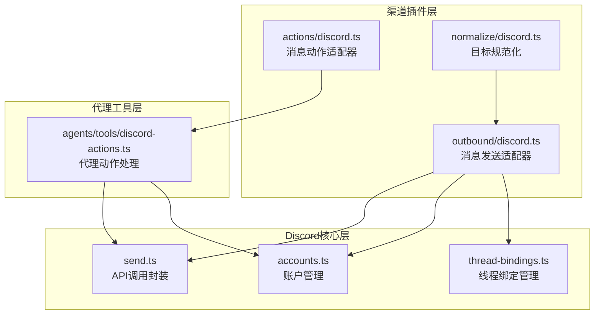

**图表来源**
- [src/channels/plugins/outbound/discord.ts:1-148](file://src/channels/plugins/outbound/discord.ts#L1-L148)
- [src/channels/plugins/actions/discord.ts:1-135](file://src/channels/plugins/actions/discord.ts#L1-L135)
- [src/channels/plugins/normalize/discord.ts:1-48](file://src/channels/plugins/normalize/discord.ts#L1-L48)
- [src/agents/tools/discord-actions.ts:1-83](file://src/agents/tools/discord-actions.ts#L1-L83)

**章节来源**
- [src/channels/plugins/outbound/discord.ts:1-148](file://src/channels/plugins/outbound/discord.ts#L1-L148)
- [src/channels/plugins/actions/discord.ts:1-135](file://src/channels/plugins/actions/discord.ts#L1-L135)
- [src/channels/plugins/normalize/discord.ts:1-48](file://src/channels/plugins/normalize/discord.ts#L1-L48)
- [src/agents/tools/discord-actions.ts:1-83](file://src/agents/tools/discord-actions.ts#L1-L83)

## 核心组件
本节详细分析Discord适配器的核心组件及其性能特性。

### 消息发送适配器（discordOutbound）
消息发送适配器是Discord集成的性能关键点，支持多种发送模式：

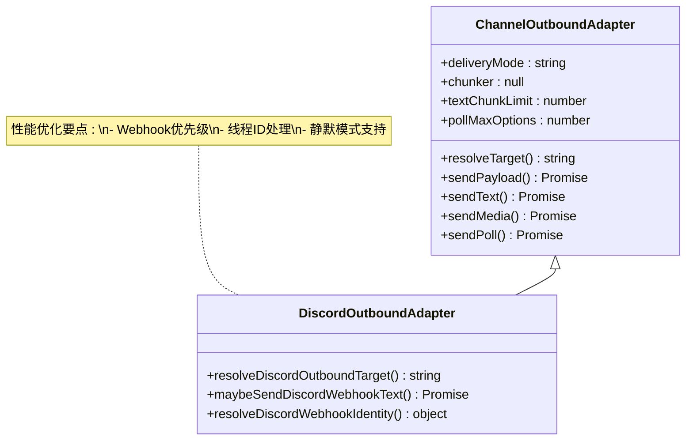

**图表来源**
- [src/channels/plugins/outbound/discord.ts:81-147](file://src/channels/plugins/outbound/discord.ts#L81-L147)

关键性能特性：
- **文本块限制**：2000字符的文本块限制，避免单次API调用超时
- **轮询选项限制**：最多10个选项，符合Discord限制
- **Webhook优先级**：优先使用Webhook进行消息发送，减少权限检查开销
- **线程支持**：原生支持Discord线程消息发送

### 动作处理适配器（discordMessageActions）
动作处理适配器提供完整的Discord操作能力：

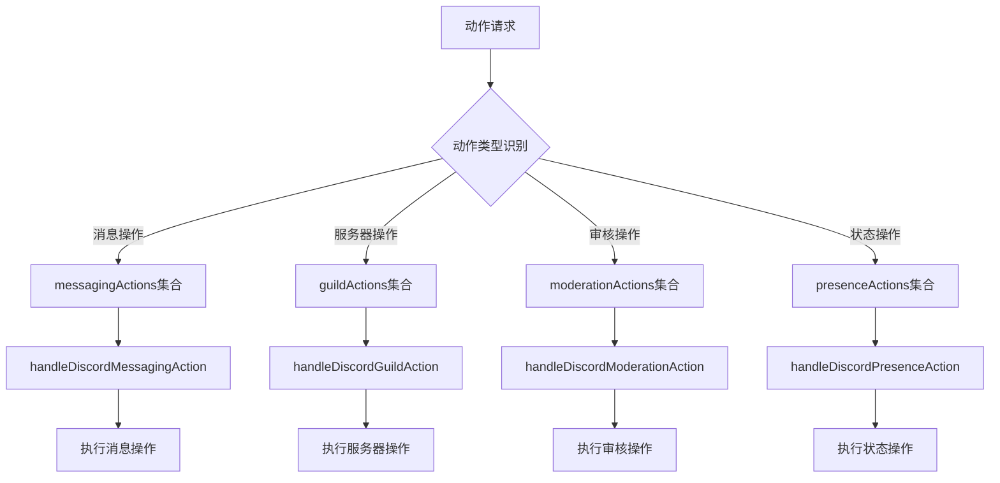

**图表来源**
- [src/agents/tools/discord-actions.ts:10-56](file://src/agents/tools/discord-actions.ts#L10-L56)
- [src/channels/plugins/actions/discord.ts:7-102](file://src/channels/plugins/actions/discord.ts#L7-L102)

**章节来源**
- [src/channels/plugins/outbound/discord.ts:81-147](file://src/channels/plugins/outbound/discord.ts#L81-L147)
- [src/agents/tools/discord-actions.ts:58-82](file://src/agents/tools/discord-actions.ts#L58-L82)
- [src/channels/plugins/actions/discord.ts:7-102](file://src/channels/plugins/actions/discord.ts#L7-L102)

## 架构概览
Discord适配器采用分层架构设计，确保高性能和可扩展性：

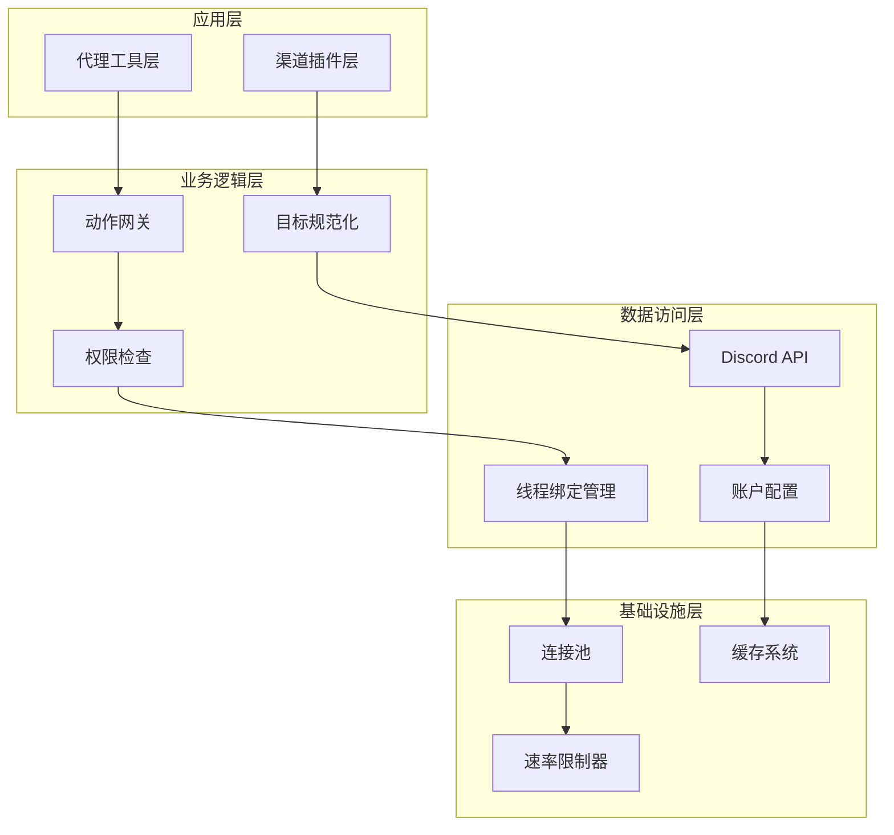

**图表来源**
- [src/discord/accounts.ts:40-49](file://src/discord/accounts.ts#L40-L49)
- [src/discord/monitor/thread-bindings.ts:43-48](file://src/discord/monitor/thread-bindings.ts#L43-L48)
- [src/discord/send.ts:1-82](file://src/discord/send.ts#L1-L82)

## 详细组件分析

### WebSocket连接管理
虽然当前代码未直接显示WebSocket实现，但通过线程绑定管理可以间接优化连接效率：

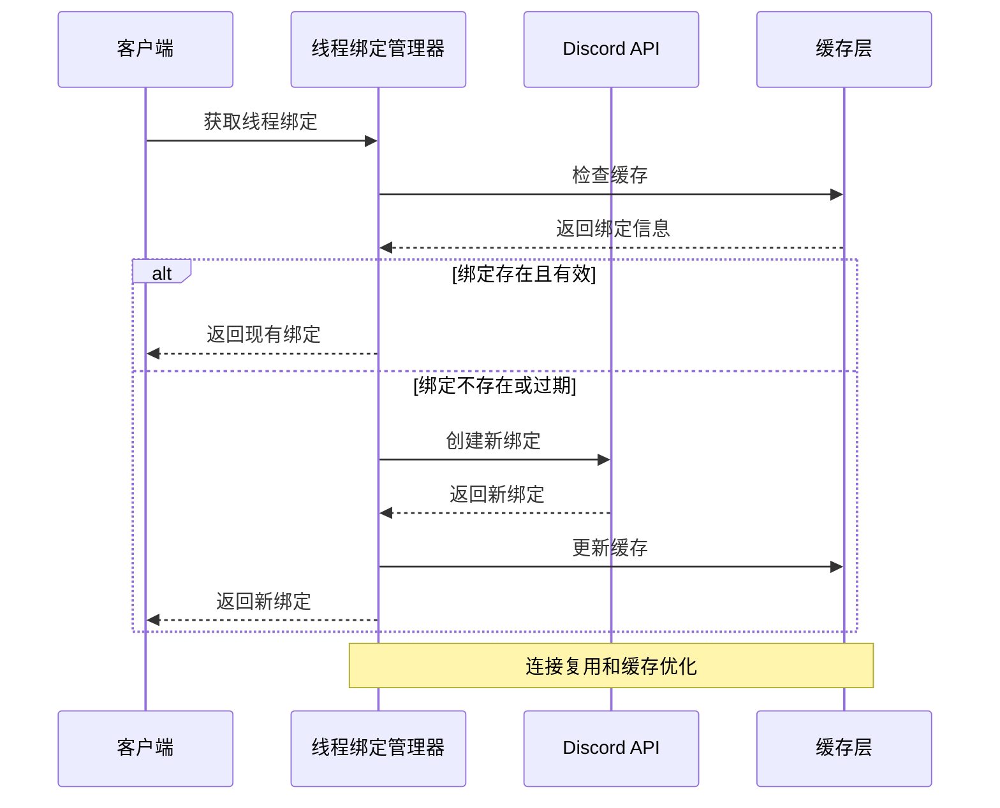

**图表来源**
- [src/discord/monitor/thread-bindings.ts:43-48](file://src/discord/monitor/thread-bindings.ts#L43-L48)

### 事件处理优化
消息动作处理采用分发模式，支持高效的事件路由：

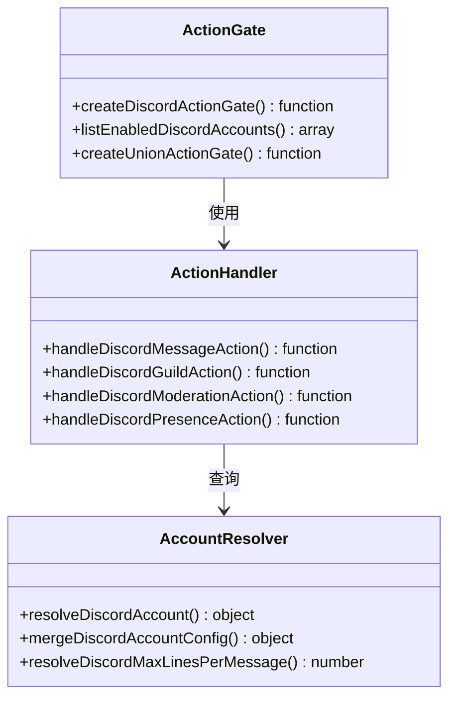

**图表来源**
- [src/discord/accounts.ts:40-89](file://src/discord/accounts.ts#L40-L89)
- [src/channels/plugins/actions/discord.ts:1-6](file://src/channels/plugins/actions/discord.ts#L1-L6)

**章节来源**
- [src/discord/accounts.ts:40-89](file://src/discord/accounts.ts#L40-L89)
- [src/channels/plugins/actions/discord.ts:1-6](file://src/channels/plugins/actions/discord.ts#L1-L6)

### API调用批量化策略
消息发送适配器实现了智能的批量化和优先级处理：

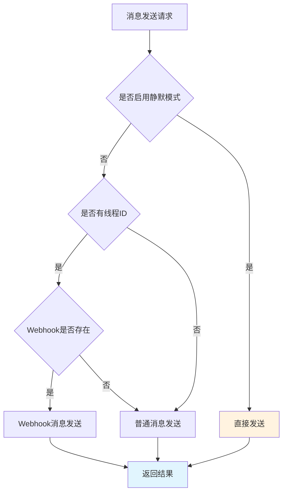

**图表来源**
- [src/channels/plugins/outbound/discord.ts:89-113](file://src/channels/plugins/outbound/discord.ts#L89-L113)

**章节来源**
- [src/channels/plugins/outbound/discord.ts:41-79](file://src/channels/plugins/outbound/discord.ts#L41-L79)

### 速率限制处理机制
账户管理模块提供了统一的速率限制控制：

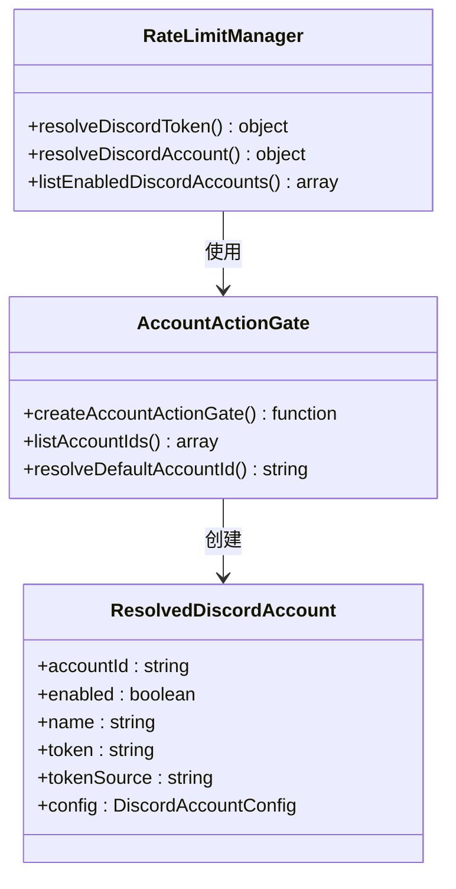

**图表来源**
- [src/discord/accounts.ts:9-89](file://src/discord/accounts.ts#L9-L89)

**章节来源**
- [src/discord/accounts.ts:9-89](file://src/discord/accounts.ts#L9-L89)

## 依赖关系分析
Discord适配器的依赖关系呈现清晰的层次化结构：

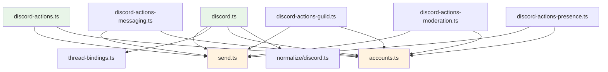

**图表来源**
- [src/channels/plugins/outbound/discord.ts:1-14](file://src/channels/plugins/outbound/discord.ts#L1-L14)
- [src/agents/tools/discord-actions.ts:1-8](file://src/agents/tools/discord-actions.ts#L1-L8)

**章节来源**
- [src/channels/plugins/outbound/discord.ts:1-14](file://src/channels/plugins/outbound/discord.ts#L1-L14)
- [src/agents/tools/discord-actions.ts:1-8](file://src/agents/tools/discord-actions.ts#L1-L8)

## 性能考虑

### 大服务器消息处理优化
针对大服务器的性能挑战，建议采用以下策略：

1. **分片发送**：利用2000字符限制进行智能分片
2. **Webhook优先**：在有权限的情况下优先使用Webhook
3. **批量处理**：合并相似操作减少API调用次数

### 频道权限检查优化
权限检查是性能瓶颈之一，可通过以下方式优化：

1. **缓存策略**：缓存权限检查结果
2. **预检查机制**：在操作前进行快速权限验证
3. **降级处理**：权限不足时自动选择替代方案

### 机器人API调用限制应对
遵循Discord的速率限制规则：

1. **令牌管理**：合理分配和轮换API令牌
2. **队列管理**：实现智能的请求排队机制
3. **重试策略**：指数退避的重试机制

### 高并发场景配置
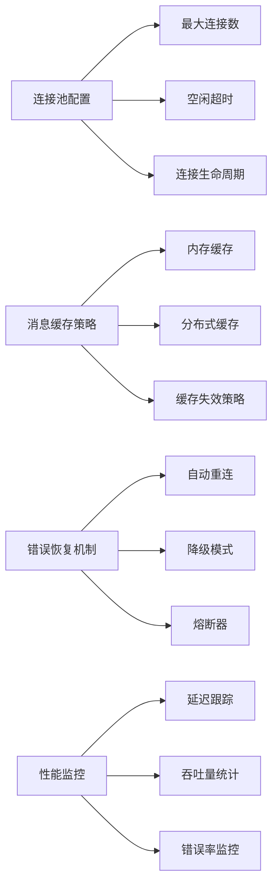

**章节来源**
- [src/channels/plugins/outbound/discord.ts:81-85](file://src/channels/plugins/outbound/discord.ts#L81-L85)
- [src/discord/accounts.ts:51-69](file://src/discord/accounts.ts#L51-L69)

## 故障排除指南

### 性能监控工具
测试套件提供了完善的性能监控框架：

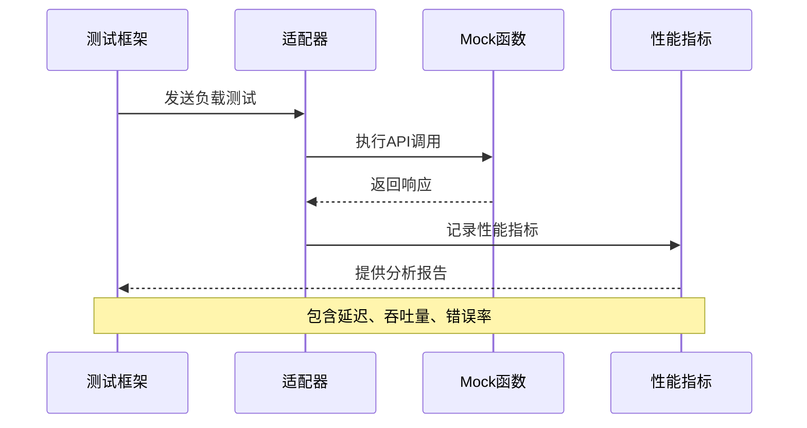

**图表来源**
- [src/channels/plugins/outbound/discord.sendpayload.test.ts:9-29](file://src/channels/plugins/outbound/discord.sendpayload.test.ts#L9-L29)

### 事件处理延迟分析
通过测试框架可以分析事件处理延迟：

1. **基准测试**：测量正常情况下的响应时间
2. **压力测试**：在高负载下评估性能表现
3. **回归测试**：确保性能改进不会引入新的问题

### API使用统计方法
实现API使用统计的关键点：

1. **计数器管理**：跟踪每个API调用的次数
2. **时间戳记录**：记录每次调用的开始和结束时间
3. **错误统计**：收集失败调用的相关信息

**章节来源**
- [src/channels/plugins/outbound/discord.sendpayload.test.ts:31-37](file://src/channels/plugins/outbound/discord.sendpayload.test.ts#L31-L37)

## 结论
OpenClaw的Discord适配器通过分层架构设计和优化的性能策略，为高并发场景提供了可靠的解决方案。关键优化点包括：

1. **智能消息发送**：Webhook优先级和线程支持
2. **权限缓存**：减少重复的权限检查
3. **速率限制**：合理的API调用控制
4. **性能监控**：全面的测试和监控框架

这些设计使得系统能够在大服务器环境下保持高性能，同时提供灵活的配置选项以适应不同的部署需求。

## 附录

### 关键配置参数
- 文本块大小：2000字符
- 轮询选项上限：10个
- Webhook身份验证：用户名和头像URL支持
- 线程绑定管理：自动生命周期管理

### 最佳实践建议
1. **合理配置**：根据服务器规模调整连接池大小
2. **监控告警**：设置适当的性能阈值和告警机制
3. **缓存策略**：平衡内存使用和查询性能
4. **错误处理**：实现优雅的降级和恢复机制