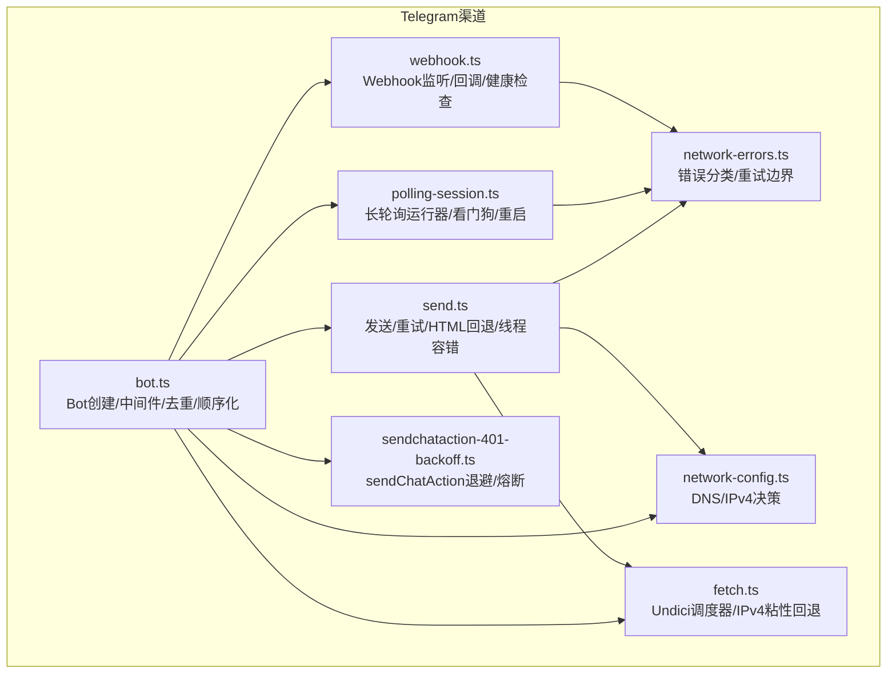
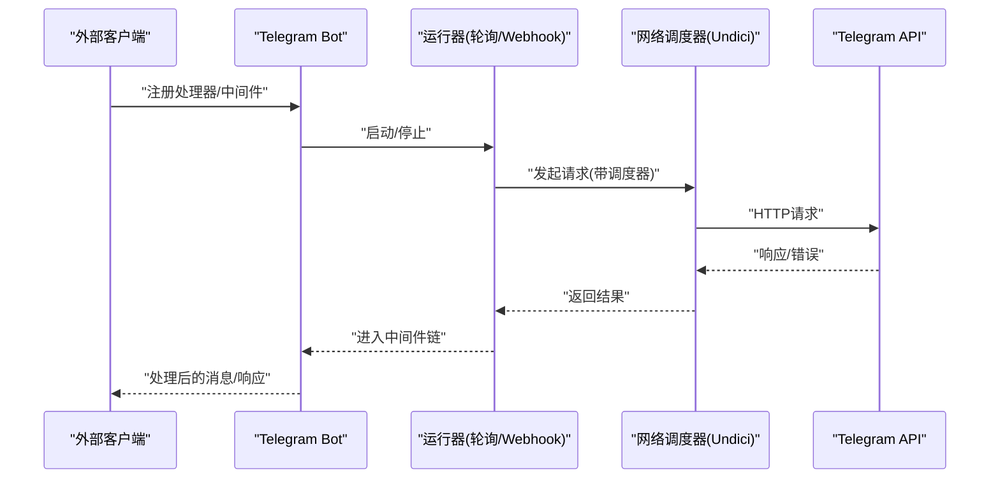
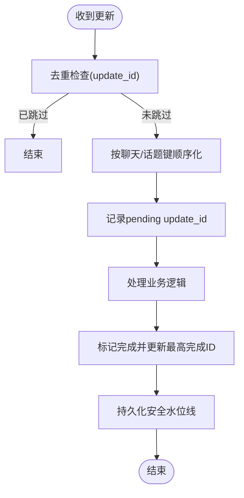
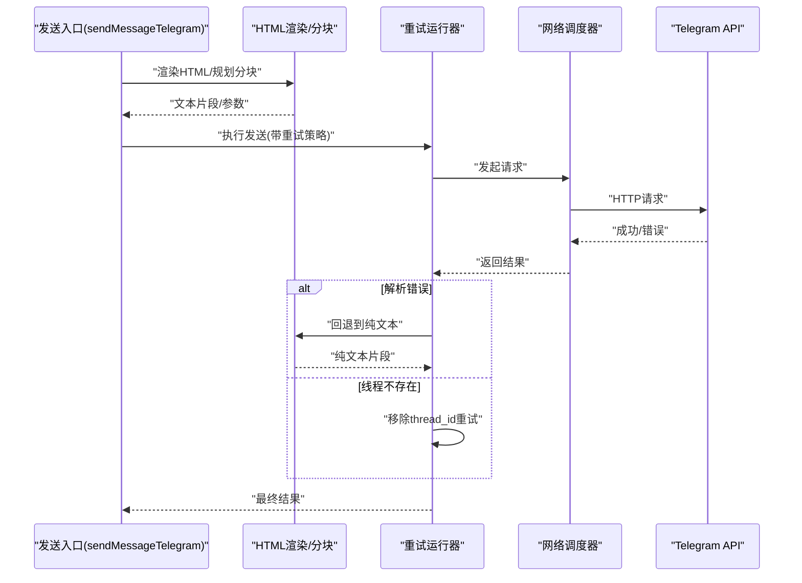
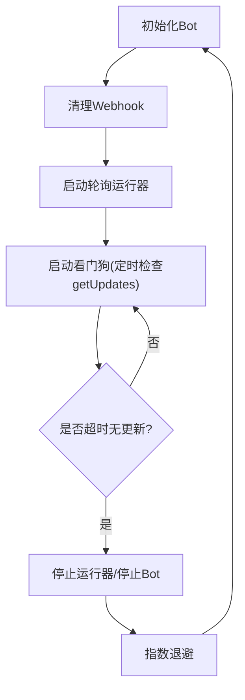
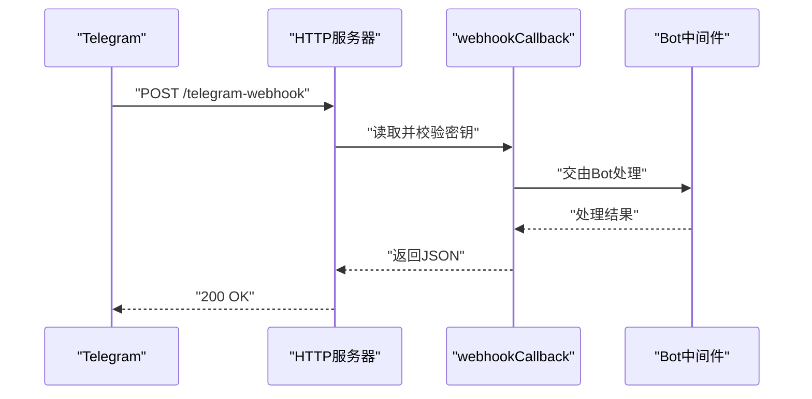
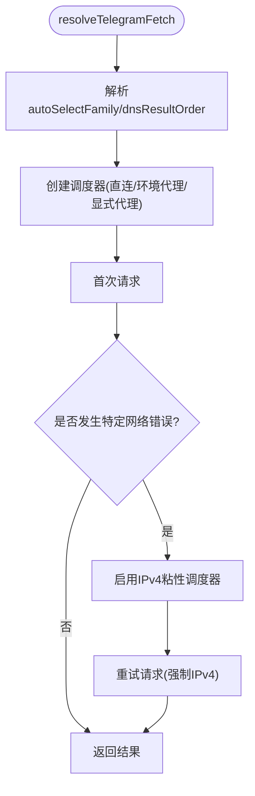
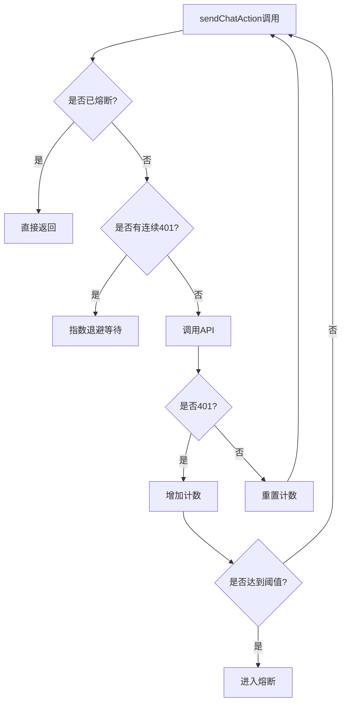
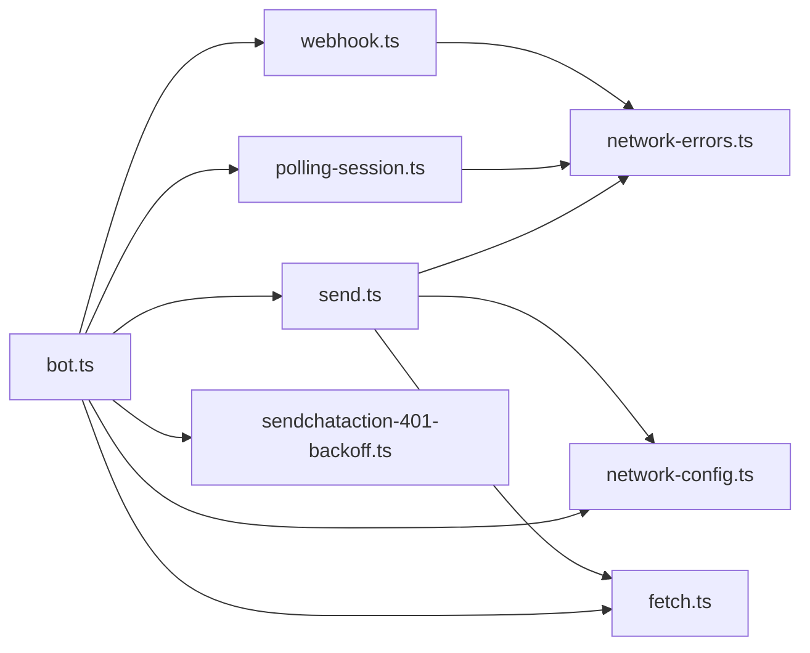

# Telegram渠道性能优化

<cite>
**本文档引用的文件**
- [src/telegram/bot.ts](file://src/telegram/bot.ts)
- [src/telegram/send.ts](file://src/telegram/send.ts)
- [src/telegram/network-errors.ts](file://src/telegram/network-errors.ts)
- [src/telegram/sendchataction-401-backoff.ts](file://src/telegram/sendchataaction-401-backoff.ts)
- [src/telegram/polling-session.ts](file://src/telegram/polling-session.ts)
- [src/telegram/webhook.ts](file://src/telegram/webhook.ts)
- [src/telegram/network-config.ts](file://src/telegram/network-config.ts)
- [src/telegram/fetch.ts](file://src/telegram/fetch.ts)
- [docs/channels/telegram.md](file://docs/channels/telegram.md)
</cite>

## 目录
1. [简介](#简介)
2. [项目结构](#项目结构)
3. [核心组件](#核心组件)
4. [架构总览](#架构总览)
5. [详细组件分析](#详细组件分析)
6. [依赖关系分析](#依赖关系分析)
7. [性能考量](#性能考量)
8. [故障排查指南](#故障排查指南)
9. [结论](#结论)
10. [附录](#附录)

## 简介
本技术指南聚焦于Telegram渠道适配器的性能优化策略，覆盖Webhook连接池管理、消息批量处理、文件上传优化、API速率限制应对等关键技术。针对Telegram特有的性能瓶颈（如长轮询稳定性、IPv6连通性问题、401错误风暴、线程化消息处理等），提供可操作的优化方案与最佳实践，并给出性能监控指标、消息延迟分析工具与API使用率统计方法，帮助在高并发场景下实现稳定高效的Telegram消息处理。

## 项目结构
Telegram渠道位于src/telegram目录，核心模块包括：
- Bot生命周期与中间件：负责更新去重、顺序化、超时控制与错误兜底
- 发送与重试：统一的发送入口、HTML回退、线程容错、客户端选项缓存
- 轮询与Webhook：长轮询运行器、健康检查、回调超时、自动重启与看门狗
- 网络层：DNS结果排序、IPv4优先、环境代理与显式代理、IPv4粘性回退
- 错误分类：区分可恢复网络错误与幂等/非幂等重试边界
- 特殊能力：sendChatAction 401指数退避与熔断保护

**图表来源**
- [src/telegram/bot.ts:71-462](file://src/telegram/bot.ts#L71-L462)
- [src/telegram/send.ts:1-1525](file://src/telegram/send.ts#L1-L1525)
- [src/telegram/polling-session.ts:34-261](file://src/telegram/polling-session.ts#L34-L261)
- [src/telegram/webhook.ts:77-284](file://src/telegram/webhook.ts#L77-L284)
- [src/telegram/network-config.ts:31-106](file://src/telegram/network-config.ts#L31-L106)
- [src/telegram/fetch.ts:332-424](file://src/telegram/fetch.ts#L332-L424)
- [src/telegram/network-errors.ts:105-187](file://src/telegram/network-errors.ts#L105-L187)
- [src/telegram/sendchataaction-401-backoff.ts:68-133](file://src/telegram/sendchataction-401-backoff.ts#L68-L133)

**章节来源**
- [src/telegram/bot.ts:71-462](file://src/telegram/bot.ts#L71-L462)
- [src/telegram/send.ts:1-1525](file://src/telegram/send.ts#L1-L1525)
- [src/telegram/polling-session.ts:34-261](file://src/telegram/polling-session.ts#L34-L261)
- [src/telegram/webhook.ts:77-284](file://src/telegram/webhook.ts#L77-L284)
- [src/telegram/network-config.ts:31-106](file://src/telegram/network-config.ts#L31-L106)
- [src/telegram/fetch.ts:332-424](file://src/telegram/fetch.ts#L332-L424)
- [src/telegram/network-errors.ts:105-187](file://src/telegram/network-errors.ts#L105-L187)
- [src/telegram/sendchataction-401-backoff.ts:68-133](file://src/telegram/sendchataction-401-backoff.ts#L68-L133)

## 核心组件
- Bot创建与中间件
  - 使用apiThrottler对Telegram API进行节流
  - 基于update_id的去重与重复更新跳过
  - sequentialize按聊天/话题键串行化处理，避免并发冲突
  - 自定义超时与fetch包装，支持优雅关闭中断长轮询
- 发送与重试
  - 统一发送入口，自动HTML渲染与回退到纯文本
  - 针对线程不存在的容错：移除thread_id后重试
  - 客户端选项缓存，减少重复构建
  - 可配置重试策略与诊断日志
- 轮询与Webhook
  - 长轮询运行器带看门狗，检测长时间无getUpdates自动重启
  - Webhook回调超时与健康检查，支持证书与密钥校验
- 网络与错误
  - DNS结果排序、IPv4优先、环境代理与显式代理选择
  - IPv4粘性回退：针对特定网络错误自动切换IPv4直连
  - 错误分类：区分可恢复网络错误、服务端错误与幂等/非幂等重试边界
- 特殊能力
  - sendChatAction 401指数退避与熔断，防止无效请求风暴

**章节来源**
- [src/telegram/bot.ts:163-239](file://src/telegram/bot.ts#L163-L239)
- [src/telegram/send.ts:180-248](file://src/telegram/send.ts#L180-L248)
- [src/telegram/polling-session.ts:163-260](file://src/telegram/polling-session.ts#L163-L260)
- [src/telegram/webhook.ts:117-284](file://src/telegram/webhook.ts#L117-L284)
- [src/telegram/fetch.ts:332-424](file://src/telegram/fetch.ts#L332-L424)
- [src/telegram/network-errors.ts:105-187](file://src/telegram/network-errors.ts#L105-L187)
- [src/telegram/sendchataction-401-backoff.ts:68-133](file://src/telegram/sendchataction-401-backoff.ts#L68-L133)

## 架构总览
Telegram渠道采用“Bot + 运行器 + 网络调度器”的分层架构。Bot负责消息路由与中间件；运行器负责长轮询或Webhook回调；网络层通过Undici调度器与IPv4粘性回退保障连通性；发送层统一处理HTML渲染、线程容错与重试；错误层提供细粒度的错误分类与重试边界。

**图表来源**
- [src/telegram/bot.ts:163-239](file://src/telegram/bot.ts#L163-L239)
- [src/telegram/polling-session.ts:174-260](file://src/telegram/polling-session.ts#L174-L260)
- [src/telegram/webhook.ts:117-284](file://src/telegram/webhook.ts#L117-L284)
- [src/telegram/fetch.ts:332-424](file://src/telegram/fetch.ts#L332-L424)

## 详细组件分析

### Bot创建与中间件（性能关键点）
- 更新去重与水位线持久化
  - 维护pending update集合与最高完成update_id，安全地写入update_offset，避免跳过待执行更新
- 顺序化处理
  - 按聊天/话题键串行化，避免并发写冲突与重复消息
- 超时与关闭中断
  - 支持自定义timeoutSeconds与AbortSignal，确保优雅关闭时长轮询立即中断
- API节流
  - 使用apiThrottler限制API调用频率，避免触发速率限制

**图表来源**
- [src/telegram/bot.ts:170-239](file://src/telegram/bot.ts#L170-L239)

**章节来源**
- [src/telegram/bot.ts:170-239](file://src/telegram/bot.ts#L170-L239)

### 发送与重试（消息批量与文件上传优化）
- 客户端选项缓存
  - 基于账号、代理、autoSelectFamily、dnsResultOrder、timeoutSeconds构建缓存键，避免重复创建ApiClientOptions
- HTML渲染与回退
  - 先尝试HTML模式，失败则回退到纯文本，减少解析错误导致的重试
- 线程容错
  - 对message_thread_id引发的“线程不存在”错误，自动移除thread_id后重试
- 文本分块与媒体处理
  - 文本按4000字符切分，HTML与纯文本分别规划分块策略
  - 媒体根据类型选择sendPhoto/sendVideo/sendAudio/sendDocument/sendAnimation/sendVideoNote/sendVoice，自动处理视频注释与语音消息
- 重试策略
  - 非幂等操作使用“仅在前置网络错误时重试”的边界，幂等操作允许更广泛的可恢复错误重试
- 诊断日志
  - 可选HTTP诊断日志，记录Telegram HTTP错误详情

**图表来源**
- [src/telegram/send.ts:588-946](file://src/telegram/send.ts#L588-L946)
- [src/telegram/network-errors.ts:105-187](file://src/telegram/network-errors.ts#L105-L187)

**章节来源**
- [src/telegram/send.ts:180-248](file://src/telegram/send.ts#L180-L248)
- [src/telegram/send.ts:588-946](file://src/telegram/send.ts#L588-L946)
- [src/telegram/network-errors.ts:105-187](file://src/telegram/network-errors.ts#L105-L187)

### 轮询会话（长轮询稳定性与看门狗）
- 自动清理Webhook
  - 启动前删除Webhook，避免409冲突
- 看门狗检测
  - 若超过阈值未收到getUpdates，强制停止并重启，恢复连接
- 指数退避重启
  - 失败后按策略退避，避免频繁重启造成压力
- 中断与优雅退出
  - 支持AbortSignal中断当前请求，加速重启

**图表来源**
- [src/telegram/polling-session.ts:130-260](file://src/telegram/polling-session.ts#L130-L260)

**章节来源**
- [src/telegram/polling-session.ts:34-261](file://src/telegram/polling-session.ts#L34-L261)

### Webhook（连接池与回调超时）
- 回调超时与健康检查
  - 回调超时毫秒级，健康路径快速返回
- 密钥校验与证书
  - 支持secret_token与可选证书文件
- 本地监听与公共URL
  - 自动解析绑定地址与对外URL，便于反向代理部署

**图表来源**
- [src/telegram/webhook.ts:117-284](file://src/telegram/webhook.ts#L117-L284)

**章节来源**
- [src/telegram/webhook.ts:77-284](file://src/telegram/webhook.ts#L77-L284)

### 网络层（DNS结果排序与IPv4粘性回退）
- 决策来源
  - autoSelectFamily：默认Node 22+启用，WSL2禁用
  - dnsResultOrder：默认Node 22+为ipv4first
  - 环境变量与配置覆盖
- 调度器选择
  - 直连/环境代理/显式代理三类调度器，支持IPv4优先与lookup定制
- IPv4粘性回退
  - 针对特定网络错误（如超时、Socket错误）自动切换为IPv4直连调度器，保持后续请求一致性

**图表来源**
- [src/telegram/network-config.ts:31-106](file://src/telegram/network-config.ts#L31-L106)
- [src/telegram/fetch.ts:332-424](file://src/telegram/fetch.ts#L332-L424)

**章节来源**
- [src/telegram/network-config.ts:31-106](file://src/telegram/network-config.ts#L31-L106)
- [src/telegram/fetch.ts:332-424](file://src/telegram/fetch.ts#L332-L424)

### sendChatAction 401退避与熔断
- 全局计数与指数退避
  - 连续401错误按指数退避，防止无效请求风暴
- 熔断保护
  - 达到阈值后暂停所有sendChatAction，需手动reset
- 日志与告警
  - 记录退避过程与熔断状态，便于运维干预

**图表来源**
- [src/telegram/sendchataction-401-backoff.ts:68-133](file://src/telegram/sendchataction-401-backoff.ts#L68-L133)

**章节来源**
- [src/telegram/sendchataction-401-backoff.ts:68-133](file://src/telegram/sendchataction-401-backoff.ts#L68-L133)

## 依赖关系分析
- 组件耦合
  - bot.ts依赖send.ts（消息处理）、polling-session.ts（长轮询）、webhook.ts（Webhook）、network-errors.ts（错误分类）、network-config.ts/fetch.ts（网络层）、sendchataction-401-backoff.ts（特殊能力）
- 外部依赖
  - grammY（Bot、runner、throttler、webhookCallback）
  - Undici（Agent/EnvHttpProxyAgent/ProxyAgent、fetch）
- 关键接口契约
  - 发送函数统一签名，支持重试配置与诊断开关
  - 轮询会话暴露启动/停止、强制重启、中止当前请求等接口

**图表来源**
- [src/telegram/bot.ts:31-45](file://src/telegram/bot.ts#L31-L45)
- [src/telegram/send.ts:1-1525](file://src/telegram/send.ts#L1-L1525)
- [src/telegram/polling-session.ts:1-284](file://src/telegram/polling-session.ts#L1-L284)
- [src/telegram/webhook.ts:1-285](file://src/telegram/webhook.ts#L1-L285)
- [src/telegram/network-errors.ts:1-188](file://src/telegram/network-errors.ts#L1-L188)
- [src/telegram/network-config.ts:1-107](file://src/telegram/network-config.ts#L1-L107)
- [src/telegram/fetch.ts:1-425](file://src/telegram/fetch.ts#L1-L425)
- [src/telegram/sendchataction-401-backoff.ts:1-134](file://src/telegram/sendchataction-401-backoff.ts#L1-L134)

**章节来源**
- [src/telegram/bot.ts:31-45](file://src/telegram/bot.ts#L31-L45)
- [src/telegram/send.ts:1-1525](file://src/telegram/send.ts#L1-L1525)
- [src/telegram/polling-session.ts:1-284](file://src/telegram/polling-session.ts#L1-L284)
- [src/telegram/webhook.ts:1-285](file://src/telegram/webhook.ts#L1-L285)
- [src/telegram/network-errors.ts:1-188](file://src/telegram/network-errors.ts#L1-L188)
- [src/telegram/network-config.ts:1-107](file://src/telegram/network-config.ts#L1-L107)
- [src/telegram/fetch.ts:1-425](file://src/telegram/fetch.ts#L1-L425)
- [src/telegram/sendchataction-401-backoff.ts:1-134](file://src/telegram/sendchataction-401-backoff.ts#L1-L134)

## 性能考量
- 连接与调度
  - 使用Undici调度器替代默认fetch，支持IPv4优先与DNS结果排序，降低因IPv6不稳定导致的失败
  - IPv4粘性回退在特定网络错误时自动启用，减少重试成本
- 并发与顺序化
  - sequentialize按聊天/话题键串行化，避免并发写冲突；结合去重与水位线持久化，保证不丢不重
- 发送路径优化
  - 客户端选项缓存减少重复创建；HTML渲染失败自动回退纯文本；线程不存在时自动移除thread_id重试
- 超时与中断
  - 支持自定义timeoutSeconds与AbortSignal，长轮询可被立即中断，避免30s阻塞
- 重试边界
  - 非幂等操作严格限定前置网络错误才重试，避免重复消息；幂等操作允许更广范围的可恢复错误
- Webhook与轮询
  - Webhook回调超时短、健康路径快速返回；轮询看门狗检测停滞并自动重启，提升可用性

[本节为通用性能讨论，无需具体文件分析]

## 故障排查指南
- 常见网络问题
  - IPv6不稳定：启用dnsResultOrder=ipv4first或设置autoSelectFamily=false
  - 环境代理绕过：检查NO_PROXY匹配api.telegram.org:443
  - 代理穿透：显式proxyUrl将绕过环境代理，但不启用IPv4粘性回退
- 401风暴防护
  - sendChatAction出现连续401将指数退避，达到阈值后熔断；需更换有效token并reset
- 线程不存在
  - 发送时若提示message_thread_id错误，系统会自动移除thread_id重试一次
- 长轮询停滞
  - 看门狗检测到长时间无getUpdates会强制重启；检查网络与上游代理
- Webhook回调失败
  - 密钥不匹配、回调超时、负载过大；检查secret_token、回调超时与服务器资源

**章节来源**
- [src/telegram/network-config.ts:61-102](file://src/telegram/network-config.ts#L61-L102)
- [src/telegram/fetch.ts:372-423](file://src/telegram/fetch.ts#L372-L423)
- [src/telegram/sendchataction-401-backoff.ts:68-133](file://src/telegram/sendchataction-401-backoff.ts#L68-L133)
- [src/telegram/send.ts:504-529](file://src/telegram/send.ts#L504-L529)
- [src/telegram/polling-session.ts:201-230](file://src/telegram/polling-session.ts#L201-L230)
- [src/telegram/webhook.ts:195-218](file://src/telegram/webhook.ts#L195-L218)

## 结论
通过在Bot中间件层实施去重与顺序化、在网络层引入IPv4粘性回退与DNS结果排序、在发送层提供HTML回退与线程容错、在轮询/Webhook中加入看门狗与超时控制，以及对sendChatAction进行401退避与熔断，Telegram渠道实现了高可用与高性能的消息处理。配合可配置的重试边界与诊断日志，可在高并发场景下稳定运行并快速定位问题。

[本节为总结性内容，无需具体文件分析]

## 附录

### 性能监控指标与统计
- 渠道活动统计
  - 出站消息计数：recordChannelActivity记录出站消息
  - 参考路径：[src/telegram/send.ts:905-909](file://src/telegram/send.ts#L905-L909)、[src/telegram/send.ts:940-944](file://src/telegram/send.ts#L940-L944)、[src/telegram/send.ts:1425-1429](file://src/telegram/send.ts#L1425-L1429)、[src/telegram/send.ts:1513-1517](file://src/telegram/send.ts#L1513-L1517)
- 消息延迟分析
  - Webhook接收/处理耗时：logWebhookReceived/logWebhookProcessed记录
  - 参考路径：[src/telegram/webhook.ts:148-206](file://src/telegram/webhook.ts#L148-L206)
- API使用率与错误
  - HTTP错误诊断日志：createTelegramHttpLogger输出Telegram HTTP错误详情
  - 参考路径：[src/telegram/send.ts:166-178](file://src/telegram/send.ts#L166-L178)
- 速率限制与退避
  - apiThrottler节流与指数退避策略：参考轮询重启与sendChatAction退避
  - 参考路径：[src/telegram/bot.ts:164-164](file://src/telegram/bot.ts#L164-L164)、[src/telegram/polling-session.ts:9-14](file://src/telegram/polling-session.ts#L9-L14)、[src/telegram/sendchataction-401-backoff.ts:44-49](file://src/telegram/sendchataction-401-backoff.ts#L44-L49)

### 配置参数与算法优化建议
- 网络与代理
  - autoSelectFamily：Node 22+默认开启，WSL2默认关闭
  - dnsResultOrder：Node 22+默认ipv4first
  - proxy：SOCKS/HTTP代理，显式代理不启用IPv4粘性回退
  - 参考路径：[src/telegram/network-config.ts:31-102](file://src/telegram/network-config.ts#L31-L102)、[src/telegram/fetch.ts:363-375](file://src/telegram/fetch.ts#L363-L375)
- 发送与重试
  - mediaMaxMb：默认100MB，控制入/出站媒体大小
  - timeoutSeconds：自定义API客户端超时
  - retry：可配置重试策略（次数、最小/最大延迟、抖动）
  - 参考路径：[src/telegram/send.ts:215-219](file://src/telegram/send.ts#L215-L219)、[src/telegram/send.ts:462-468](file://src/telegram/send.ts#L462-L468)、[docs/channels/telegram.md:749-789](file://docs/channels/telegram.md#L749-L789)
- 轮询与Webhook
  - webhookSecret：Webhook密钥必填
  - webhookCallback超时：默认10秒
  - 参考路径：[src/telegram/webhook.ts:97-102](file://src/telegram/webhook.ts#L97-L102)、[src/telegram/webhook.ts:117-121](file://src/telegram/webhook.ts#L117-L121)

**章节来源**
- [src/telegram/send.ts:215-219](file://src/telegram/send.ts#L215-L219)
- [src/telegram/send.ts:462-468](file://src/telegram/send.ts#L462-L468)
- [src/telegram/webhook.ts:97-102](file://src/telegram/webhook.ts#L97-L102)
- [src/telegram/webhook.ts:117-121](file://src/telegram/webhook.ts#L117-L121)
- [src/telegram/network-config.ts:31-102](file://src/telegram/network-config.ts#L31-L102)
- [src/telegram/fetch.ts:363-375](file://src/telegram/fetch.ts#L363-L375)
- [docs/channels/telegram.md:749-789](file://docs/channels/telegram.md#L749-L789)