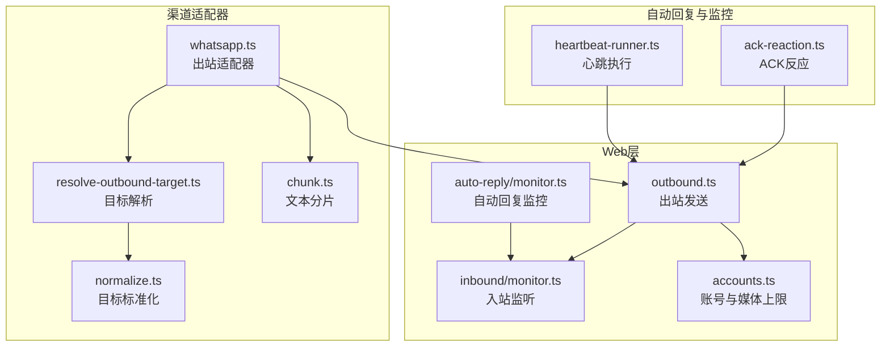
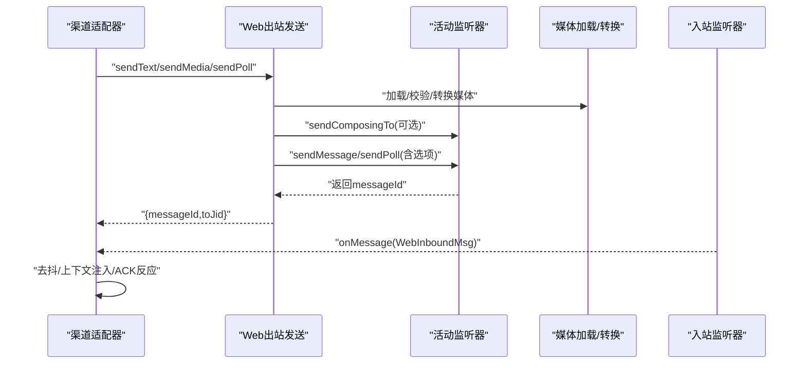
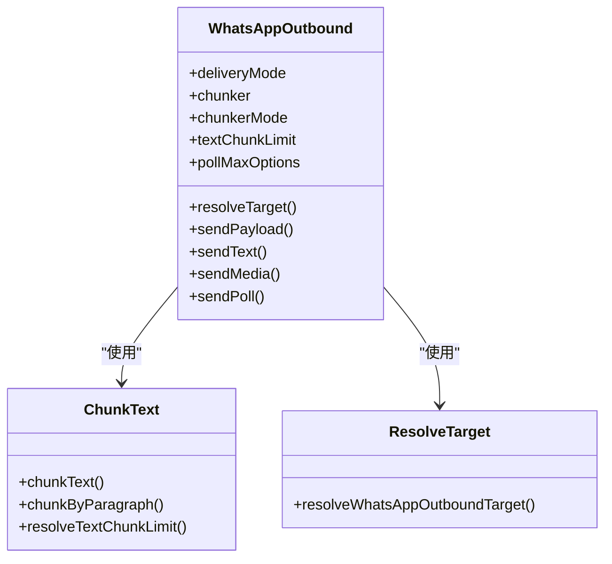
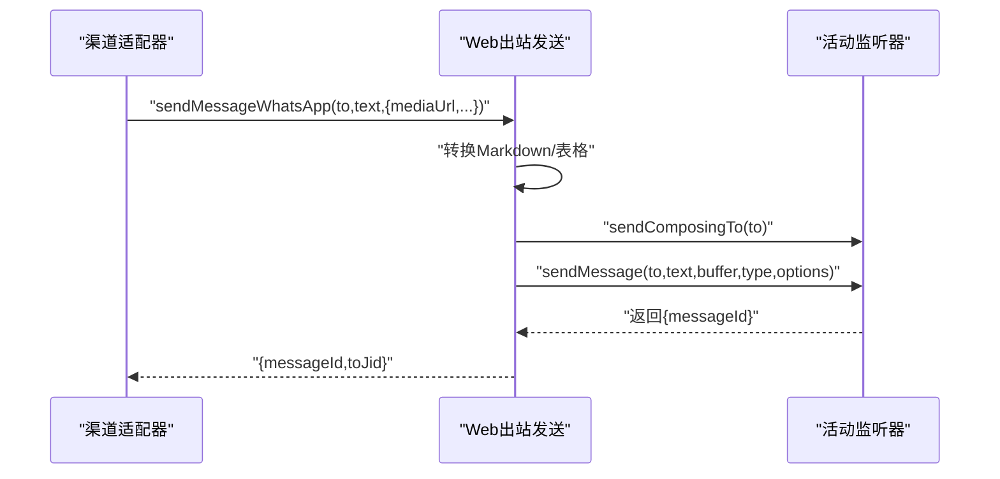
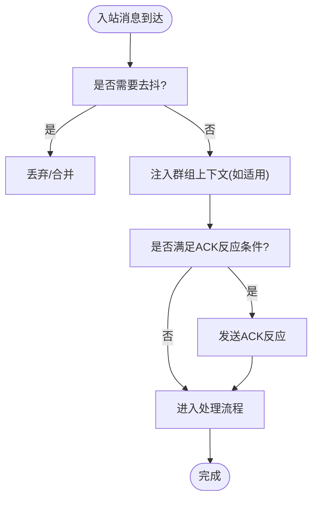
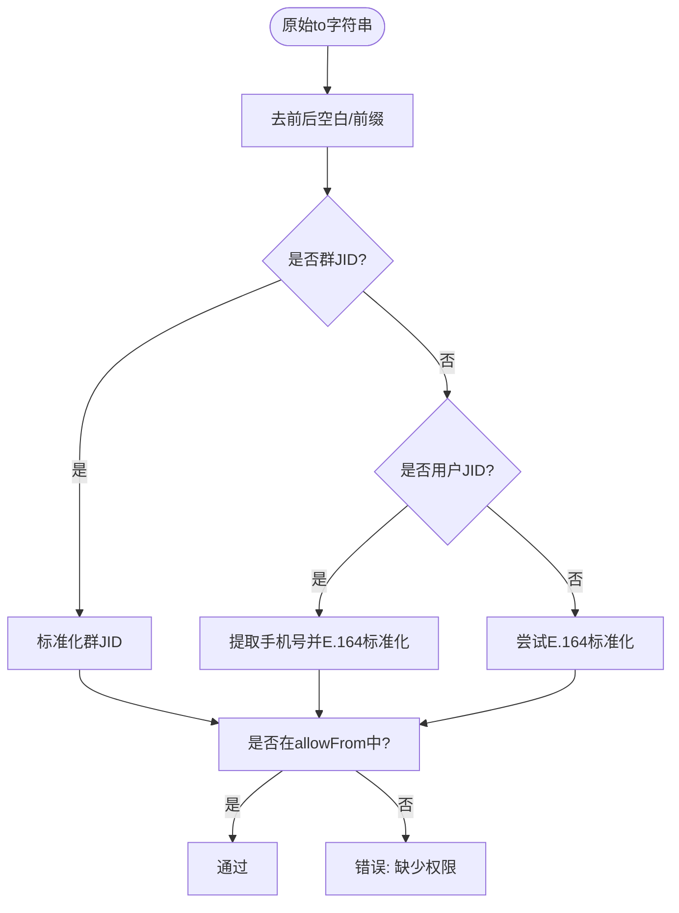
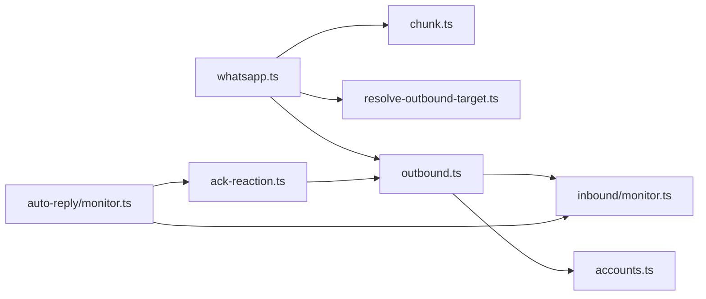

# WhatsApp渠道性能优化

<cite>
**本文引用的文件**
- [whatsapp.md](file://docs/channels/whatsapp.md)
- [whatsapp.ts](file://src/channels/plugins/outbound/whatsapp.ts)
- [normalize.ts](file://src/whatsapp/normalize.ts)
- [resolve-outbound-target.ts](file://src/whatsapp/resolve-outbound-target.ts)
- [chunk.ts](file://src/auto-reply/chunk.ts)
- [outbound.ts](file://src/web/outbound.ts)
- [monitor.ts](file://src/web/auto-reply/monitor.ts)
- [monitor.ts](file://src/web/inbound/monitor.ts)
- [ack-reaction.ts](file://src/web/auto-reply/monitor/ack-reaction.ts)
- [ack-reactions.ts](file://src/channels/ack-reactions.ts)
- [accounts.ts](file://src/web/accounts.ts)
- [heartbeat-runner.ts](file://src/web/auto-reply/heartbeat-runner.ts)
</cite>

## 目录
1. [简介](#简介)
2. [项目结构](#项目结构)
3. [核心组件](#核心组件)
4. [架构总览](#架构总览)
5. [详细组件分析](#详细组件分析)
6. [依赖关系分析](#依赖关系分析)
7. [性能考量与优化策略](#性能考量与优化策略)
8. [监控与可观测性](#监控与可观测性)
9. [故障排查指南](#故障排查指南)
10. [结论](#结论)

## 简介
本技术指南聚焦于WhatsApp渠道适配器的性能优化，围绕消息队列管理、API调用优化、文件传输加速、连接稳定性保障等关键能力，系统阐述在高并发与复杂业务场景下的优化策略与实践。文档同时解释WhatsApp特有的性能考量，如消息确认机制、群组消息处理、媒体压缩与传输、分片与批量策略，并提供性能监控指标、延迟分析与重试机制优化建议。

## 项目结构
WhatsApp渠道位于“web通道”（Baileys）之上，采用“网关持有会话”的架构：网关负责WebSocket连接、重连、心跳、入站监听与出站发送；渠道适配器负责消息分片、目标解析、媒体处理与ACK反应等。核心模块分布如下：
- 渠道适配器：负责出站发送、分片与目标解析
- Web层：负责入站监听、出站发送、媒体加载与重连策略
- 自动回复与监控：负责心跳、超时 watchdog、ACK反应、群组上下文注入
- 配置与账号：负责媒体上限、账号选择与参数解析

**图表来源**
- [whatsapp.ts:12-74](file://src/channels/plugins/outbound/whatsapp.ts#L12-L74)
- [normalize.ts:55-80](file://src/whatsapp/normalize.ts#L55-L80)
- [resolve-outbound-target.ts:8-52](file://src/whatsapp/resolve-outbound-target.ts#L8-L52)
- [chunk.ts:51-107](file://src/auto-reply/chunk.ts#L51-L107)
- [outbound.ts:17-115](file://src/web/outbound.ts#L17-L115)
- [monitor.ts:25-66](file://src/web/inbound/monitor.ts#L25-L66)
- [monitor.ts:96-216](file://src/web/auto-reply/monitor.ts#L96-L216)
- [ack-reaction.ts:9-74](file://src/web/auto-reply/monitor/ack-reaction.ts#L9-L74)
- [heartbeat-runner.ts:29-76](file://src/web/auto-reply/heartbeat-runner.ts#L29-L76)
- [accounts.ts:152-160](file://src/web/accounts.ts#L152-L160)

**章节来源**
- [whatsapp.md:126-133](file://docs/channels/whatsapp.md#L126-L133)
- [whatsapp.ts:12-74](file://src/channels/plugins/outbound/whatsapp.ts#L12-L74)

## 核心组件
- 渠道适配器（WhatsApp Outbound Adapter）
  - 定义交付模式、分片器、分片限制与轮询选项
  - 提供文本与媒体发送入口，统一走“网关持有会话”的发送流程
- 目标解析与标准化
  - 规范化用户JID/群JID与E.164号码，校验白名单与模式
- 文本分片
  - 支持按长度或段落（换行）分片，避免破坏语法与列表
- Web出站发送
  - 负责媒体加载、MIME转换、PTT编码、发送前“正在输入”提示、结果记录
- 自动回复监控
  - 维护入站去抖、心跳、watchdog超时、群组历史注入、ACK反应
- 账号与媒体上限
  - 解析账号配置，计算媒体字节数上限，保障发送安全

**章节来源**
- [whatsapp.ts:12-74](file://src/channels/plugins/outbound/whatsapp.ts#L12-L74)
- [normalize.ts:55-80](file://src/whatsapp/normalize.ts#L55-L80)
- [resolve-outbound-target.ts:8-52](file://src/whatsapp/resolve-outbound-target.ts#L8-L52)
- [chunk.ts:51-107](file://src/auto-reply/chunk.ts#L51-L107)
- [outbound.ts:17-115](file://src/web/outbound.ts#L17-L115)
- [monitor.ts:96-216](file://src/web/auto-reply/monitor.ts#L96-L216)
- [accounts.ts:152-160](file://src/web/accounts.ts#L152-L160)

## 架构总览
WhatsApp Web渠道的整体数据流如下：
- 出站：渠道适配器将消息交给Web层，Web层通过活动监听器发送；媒体路径经由媒体加载器处理，必要时进行MIME转换与PTT编码
- 入站：Web入站监听器建立连接并注册回调，自动回复监控对入站消息进行去抖、上下文注入与ACK反应
- 连接：网关负责心跳、watchdog超时与重连策略，确保长连接稳定

**图表来源**
- [whatsapp.ts:20-72](file://src/channels/plugins/outbound/whatsapp.ts#L20-L72)
- [outbound.ts:17-115](file://src/web/outbound.ts#L17-L115)
- [monitor.ts:25-66](file://src/web/inbound/monitor.ts#L25-L66)
- [ack-reaction.ts:9-74](file://src/web/auto-reply/monitor/ack-reaction.ts#L9-L74)

## 详细组件分析

### 组件A：渠道适配器（Outbound Adapter）
- 关键职责
  - 定义交付模式为“gateway”，确保消息通过网关持有的会话发送
  - 文本分片器与限制：默认4000字符，支持“newline”模式优先段落边界
  - 轮询选项：最多12个选项，满足Poll发送约束
  - 目标解析：基于allowFrom与模式校验，支持通配符与群组JID
  - 发送接口：sendText、sendMedia、sendPoll统一路由至Web层
- 性能要点
  - 分片限制与模式可按账号覆盖，避免单条消息过大
  - 轮询选项上限与Web层一致，减少失败重试

**图表来源**
- [whatsapp.ts:12-74](file://src/channels/plugins/outbound/whatsapp.ts#L12-L74)
- [chunk.ts:51-107](file://src/auto-reply/chunk.ts#L51-L107)
- [resolve-outbound-target.ts:8-52](file://src/whatsapp/resolve-outbound-target.ts#L8-L52)

**章节来源**
- [whatsapp.ts:12-74](file://src/channels/plugins/outbound/whatsapp.ts#L12-L74)
- [chunk.ts:51-107](file://src/auto-reply/chunk.ts#L51-L107)
- [resolve-outbound-target.ts:8-52](file://src/whatsapp/resolve-outbound-target.ts#L8-L52)

### 组件B：Web出站发送（Web Outbound）
- 关键职责
  - 校验配置与活动监听器，准备发送上下文
  - Markdown表格与平台转换，PTT音频强制编码，视频/图片/文档分别处理
  - 发送前触发“正在输入”提示，提升交互体验
  - 记录耗时与日志，便于性能分析
- 性能要点
  - 媒体加载阶段即进行大小限制与类型判定，避免无效发送
  - 对PTT音频进行MIME修正，减少客户端兼容问题导致的重发

**图表来源**
- [outbound.ts:17-115](file://src/web/outbound.ts#L17-L115)

**章节来源**
- [outbound.ts:17-115](file://src/web/outbound.ts#L17-L115)

### 组件C：入站监听与自动回复监控
- 关键职责
  - 建立WebSocket连接，设置可用状态，注册消息回调
  - 入站去抖：对纯文本消息进行去抖，降低重复处理
  - 心跳与watchdog：周期性心跳与超时重启，保证连接健康
  - 群组上下文：缓冲未处理消息并在触发时注入上下文
  - ACK反应：根据配置即时发送表情反馈
- 性能要点
  - 去抖窗口可按消息类型动态调整，减少高频消息抖动
  - watchdog超时触发主动断开与重连，避免长时间无响应
  - 群组上下文注入避免丢失历史，提升回复质量

**图表来源**
- [monitor.ts:25-66](file://src/web/inbound/monitor.ts#L25-L66)
- [monitor.ts:96-216](file://src/web/auto-reply/monitor.ts#L96-L216)
- [ack-reaction.ts:9-74](file://src/web/auto-reply/monitor/ack-reaction.ts#L9-L74)

**章节来源**
- [monitor.ts:25-66](file://src/web/inbound/monitor.ts#L25-L66)
- [monitor.ts:96-216](file://src/web/auto-reply/monitor.ts#L96-L216)
- [ack-reaction.ts:9-74](file://src/web/auto-reply/monitor/ack-reaction.ts#L9-L74)

### 组件D：目标解析与标准化
- 关键职责
  - 去除前缀，识别群JID与用户JID，规范化为标准格式
  - 校验allowFrom白名单，支持通配符与群组模式
- 性能要点
  - 早期失败快速返回，避免后续发送链路浪费
  - 对未知JID直接拒绝，降低错误传播

**图表来源**
- [normalize.ts:55-80](file://src/whatsapp/normalize.ts#L55-L80)
- [resolve-outbound-target.ts:8-52](file://src/whatsapp/resolve-outbound-target.ts#L8-L52)

**章节来源**
- [normalize.ts:55-80](file://src/whatsapp/normalize.ts#L55-L80)
- [resolve-outbound-target.ts:8-52](file://src/whatsapp/resolve-outbound-target.ts#L8-L52)

## 依赖关系分析
- 渠道适配器依赖分片器与目标解析，确保消息合规与高效分发
- Web出站发送依赖活动监听器与媒体加载，负责最终投递
- 自动回复监控依赖入站监听与ACK反应模块，保障连接健康与交互体验
- 账号模块提供媒体上限与账号选择逻辑，贯穿发送链路

**图表来源**
- [whatsapp.ts:12-74](file://src/channels/plugins/outbound/whatsapp.ts#L12-L74)
- [chunk.ts:51-107](file://src/auto-reply/chunk.ts#L51-L107)
- [resolve-outbound-target.ts:8-52](file://src/whatsapp/resolve-outbound-target.ts#L8-L52)
- [outbound.ts:17-115](file://src/web/outbound.ts#L17-L115)
- [monitor.ts:25-66](file://src/web/inbound/monitor.ts#L25-L66)
- [monitor.ts:96-216](file://src/web/auto-reply/monitor.ts#L96-L216)
- [ack-reaction.ts:9-74](file://src/web/auto-reply/monitor/ack-reaction.ts#L9-L74)
- [accounts.ts:152-160](file://src/web/accounts.ts#L152-L160)

**章节来源**
- [whatsapp.ts:12-74](file://src/channels/plugins/outbound/whatsapp.ts#L12-L74)
- [outbound.ts:17-115](file://src/web/outbound.ts#L17-L115)
- [monitor.ts:96-216](file://src/web/auto-reply/monitor.ts#L96-L216)

## 性能考量与优化策略

### 消息队列管理与批量处理
- 分片与批量
  - 文本分片默认4000字符，newline模式优先段落边界，避免破坏列表与代码块
  - 多媒体回复时，首项附带标题，其余顺序发送，减少重复标题
- 去抖与上下文注入
  - 对纯文本消息启用去抖，降低高频重复处理
  - 群组消息缓冲并注入上下文，避免丢失历史影响回复质量
- 账号级限流
  - 基于账号维度的媒体上限与发送速率控制，避免单账号成为瓶颈

**章节来源**
- [chunk.ts:51-107](file://src/auto-reply/chunk.ts#L51-L107)
- [monitor.ts:181-193](file://src/web/auto-reply/monitor.ts#L181-L193)
- [monitor.ts:241-254](file://src/web/auto-reply/monitor.ts#L241-L254)
- [accounts.ts:152-160](file://src/web/accounts.ts#L152-L160)

### API调用优化
- 发送前提示
  - 发送文本/媒体前触发“正在输入”提示，改善端到端感知延迟
- MIME与PTT优化
  - PTT音频强制编码为opus，提升兼容性与传输效率
- 轮询选项上限
  - Poll最多12个选项，避免超出平台限制导致失败重试

**章节来源**
- [outbound.ts:70-84](file://src/web/outbound.ts#L70-L84)
- [outbound.ts:160-197](file://src/web/outbound.ts#L160-L197)
- [whatsapp.ts:17-17](file://src/channels/plugins/outbound/whatsapp.ts#L17-L17)

### 文件传输加速
- 媒体加载与压缩
  - 图像自动优化（尺寸与质量扫描），确保在上限内
  - 媒体大小上限按账号配置，避免超限失败
- GIF播放
  - 通过gifPlayback参数发送MP4以实现内联循环播放
- 文档与视频直通
  - 大体积媒体直通发送，减少不必要的二次处理

**章节来源**
- [outbound.ts:62-84](file://src/web/outbound.ts#L62-L84)
- [accounts.ts:152-160](file://src/web/accounts.ts#L152-L160)
- [whatsapp.md:309-341](file://docs/channels/whatsapp.md#L309-L341)

### 连接稳定性保障
- 心跳与watchdog
  - 周期性心跳与超时重启，防止长时间无响应
- 重连策略
  - 退避策略与最大尝试次数，达到上限后降级
- 登出处理
  - 检测登出事件并提示重新关联

**章节来源**
- [monitor.ts:289-325](file://src/web/auto-reply/monitor.ts#L289-L325)
- [monitor.ts:369-403](file://src/web/auto-reply/monitor.ts#L369-L403)
- [heartbeat-runner.ts:29-76](file://src/web/auto-reply/heartbeat-runner.ts#L29-L76)

### WhatsApp特有优化
- ACK反应
  - 基于配置即时发送表情反馈，提升交互体验且不影响回复投递
- 群组激活与提及
  - 群组消息的提及检测与激活策略，避免误触发
- 自聊天保护
  - 自聊天场景跳过已读回执，避免自我回环

**章节来源**
- [ack-reaction.ts:9-74](file://src/web/auto-reply/monitor/ack-reaction.ts#L9-L74)
- [ack-reactions.ts:1-43](file://src/channels/ack-reactions.ts#L1-L43)
- [whatsapp.md:202-209](file://docs/channels/whatsapp.md#L202-L209)

## 监控与可观测性

### 性能监控指标
- 出站发送耗时（毫秒）
- 媒体加载耗时与大小
- 去抖命中率
- 心跳间隔与超时次数
- ACK反应成功率
- 群组上下文注入数量

### 消息传递延迟分析
- 端到端延迟：从入站消息到达至ACK反应/回复发送完成
- 去抖窗口：对纯文本消息的去抖阈值与合并比例
- 心跳与watchdog：心跳频率与超时重启触发次数

### API调用统计工具
- Web出站发送日志：记录发送开始、结束与耗时
- 心跳执行日志：记录心跳OK发送与原因
- 入站监听日志：记录连接建立、关闭与错误

**章节来源**
- [outbound.ts:57-114](file://src/web/outbound.ts#L57-L114)
- [heartbeat-runner.ts:56-76](file://src/web/auto-reply/heartbeat-runner.ts#L56-L76)
- [monitor.ts:59-66](file://src/web/inbound/monitor.ts#L59-L66)

## 故障排查指南
- 未链接/需扫码
  - 执行登录命令并检查状态
- 已链接但断线/重连循环
  - 使用诊断命令查看日志，必要时重新登录
- 发送时报无活动监听器
  - 确认网关运行且账号已关联
- 群组消息被忽略
  - 检查群策略、允许列表、提及规则与重复键覆盖

**章节来源**
- [whatsapp.md:374-424](file://docs/channels/whatsapp.md#L374-L424)

## 结论
通过分片与批量、去抖与上下文注入、媒体优化与PTT编码、心跳与watchdog、以及ACK反应等综合优化，WhatsApp渠道在高并发与复杂业务场景下仍能保持稳定与高效。建议结合账号级限流与监控指标持续迭代，进一步提升端到端延迟与吞吐能力。