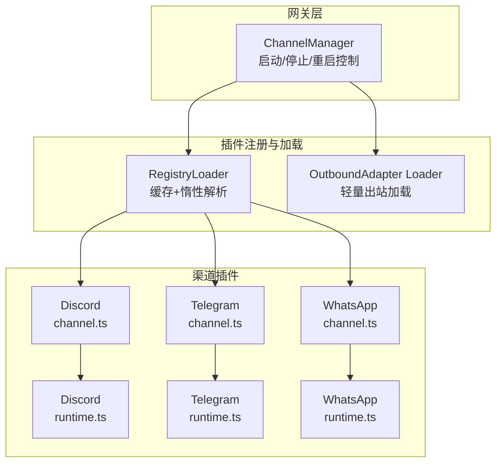
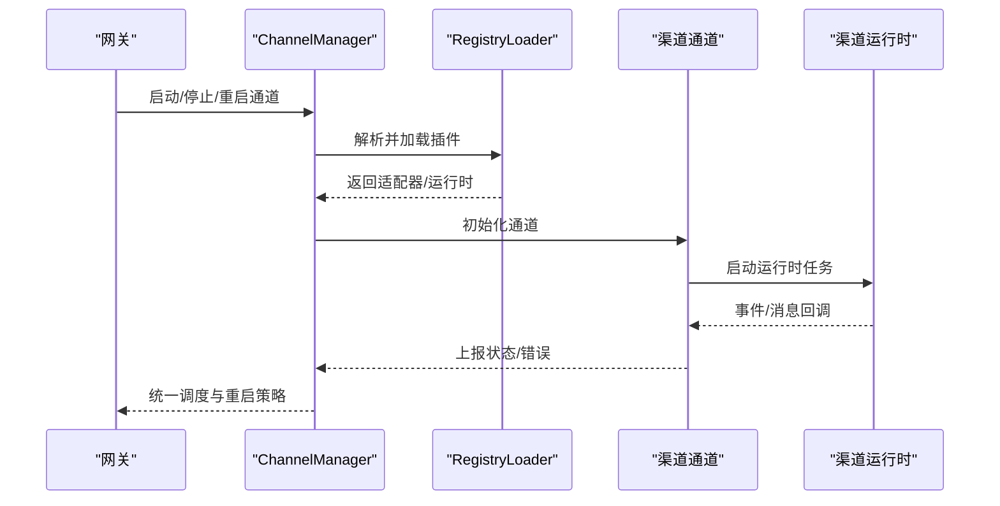
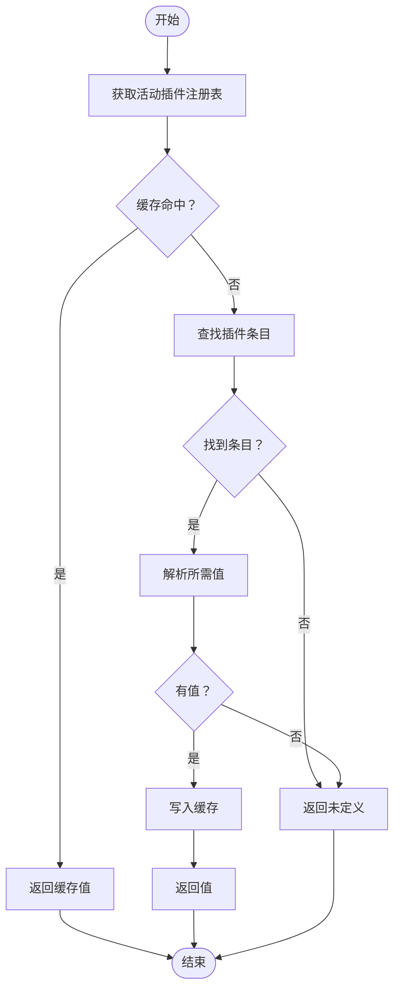
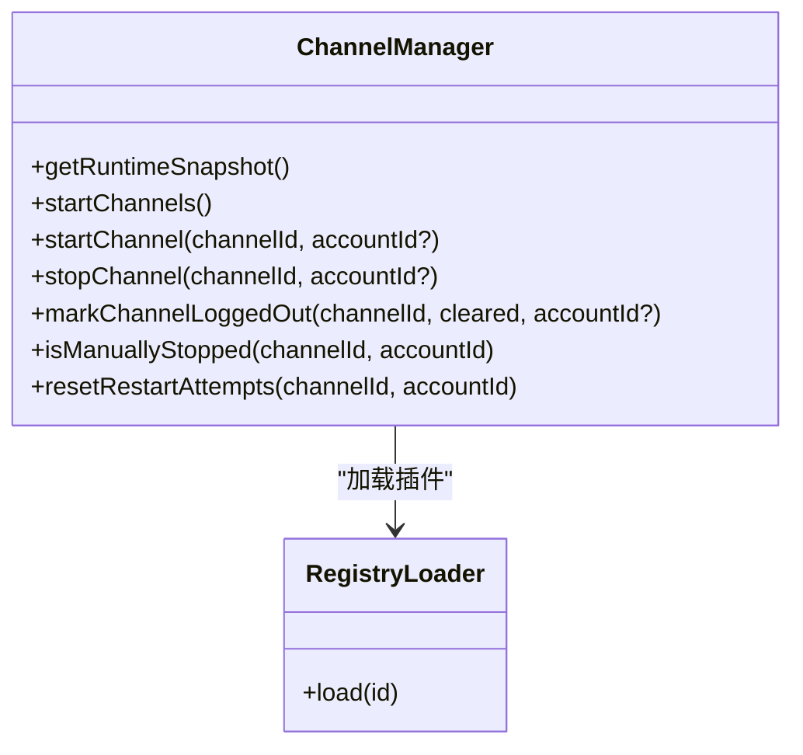
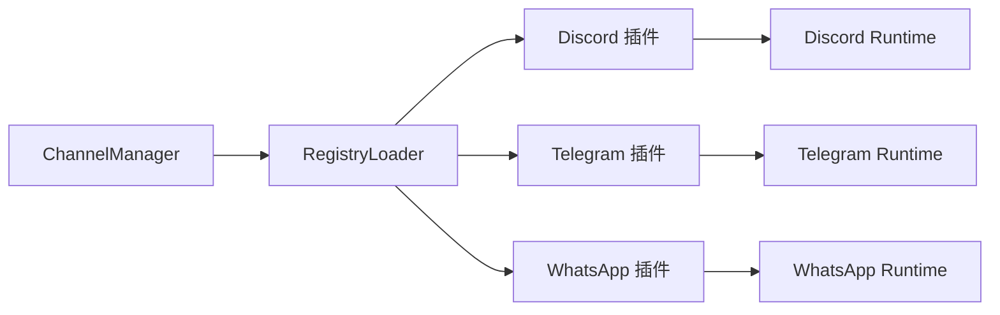

# 渠道性能优化

<cite>
**本文引用的文件**
- [src/channels/plugins/registry-loader.ts](file://src/channels/plugins/registry-loader.ts)
- [src/channels/plugins/outbound/load.ts](file://src/channels/plugins/outbound/load.ts)
- [src/gateway/server-channels.ts](file://src/gateway/server-channels.ts)
- [src/plugin-sdk/channel-lifecycle.test.ts](file://src/plugin-sdk/channel-lifecycle.test.ts)
- [src/web/auto-reply/monitor.ts](file://src/web/auto-reply/monitor.ts)
- [src/web/auto-reply/loggers.ts](file://src/web/auto-reply/loggers.ts)
- [src/imessage/monitor/loop-rate-limiter.ts](file://src/imessage/monitor/loop-rate-limiter.ts)
- [src/imessage/monitor/loop-rate-limiter.test.ts](file://src/imessage/monitor/loop-rate-limiter.test.ts)
- [extensions/discord/src/channel.ts](file://extensions/discord/src/channel.ts)
- [extensions/discord/src/runtime.ts](file://extensions/discord/src/runtime.ts)
- [extensions/telegram/src/channel.ts](file://extensions/telegram/src/channel.ts)
- [extensions/telegram/src/runtime.ts](file://extensions/telegram/src/runtime.ts)
- [extensions/whatsapp/src/channel.ts](file://extensions/whatsapp/src/channel.ts)
- [extensions/whatsapp/src/runtime.ts](file://extensions/whatsapp/src/runtime.ts)
- [docs/channels/discord.md](file://docs/channels/discord.md)
- [docs/channels/telegram.md](file://docs/channels/telegram.md)
- [docs/channels/whatsapp.md](file://docs/channels/whatsapp.md)
</cite>

## 目录
1. [引言](#引言)
2. [项目结构](#项目结构)
3. [核心组件](#核心组件)
4. [架构总览](#架构总览)
5. [详细组件分析](#详细组件分析)
6. [依赖关系分析](#依赖关系分析)
7. [性能考量](#性能考量)
8. [故障排查指南](#故障排查指南)
9. [结论](#结论)
10. [附录](#附录)

## 引言
本指南聚焦于 OpenClaw 多渠道消息处理的性能优化，围绕并发处理、批量操作、连接池管理、API 调用优化等关键主题，结合 Telegram Webhook、Discord 事件处理、WhatsApp 消息队列等平台特性，给出可落地的优化策略与实践建议。文档同时覆盖性能监控、消息处理延迟分析、API 使用率优化、高并发调优与故障处理方案，并解释如何通过合理配置与算法优化提升整体吞吐与稳定性。

## 项目结构
OpenClaw 的渠道适配器以插件化方式组织，核心由“网关通道管理器”驱动，按需加载各渠道插件；插件内部再细分为运行时、通道适配器、生命周期管理等模块。下图展示与性能优化相关的关键路径：

图表来源
- [src/gateway/server-channels.ts:95-327](file://src/gateway/server-channels.ts#L95-L327)
- [src/channels/plugins/registry-loader.ts:1-36](file://src/channels/plugins/registry-loader.ts#L1-L36)
- [src/channels/plugins/outbound/load.ts:1-17](file://src/channels/plugins/outbound/load.ts#L1-L17)
- [extensions/discord/src/channel.ts](file://extensions/discord/src/channel.ts)
- [extensions/discord/src/runtime.ts](file://extensions/discord/src/runtime.ts)
- [extensions/telegram/src/channel.ts](file://extensions/telegram/src/channel.ts)
- [extensions/telegram/src/runtime.ts](file://extensions/telegram/src/runtime.ts)
- [extensions/whatsapp/src/channel.ts](file://extensions/whatsapp/src/channel.ts)
- [extensions/whatsapp/src/runtime.ts](file://extensions/whatsapp/src/runtime.ts)

章节来源
- [src/gateway/server-channels.ts:95-327](file://src/gateway/server-channels.ts#L95-L327)
- [src/channels/plugins/registry-loader.ts:1-36](file://src/channels/plugins/registry-loader.ts#L1-L36)
- [src/channels/plugins/outbound/load.ts:1-17](file://src/channels/plugins/outbound/load.ts#L1-L17)

## 核心组件
- 通道注册与加载
  - 通过通用注册表加载器对渠道插件进行缓存与惰性解析，避免重复导入与初始化成本，降低冷启动开销。
  - 出站适配器采用独立加载器，确保仅加载必要能力，减少内存占用与启动时间。
- 通道生命周期与运行时
  - 网关层提供统一的通道启动/停止/重启控制，支持按账户维度精细管理，具备手动停止标记与重启尝试计数，便于在高负载或异常情况下快速收敛。
  - 插件 SDK 提供生命周期辅助函数（如等待中止信号），便于在运行时优雅退出与资源回收。
- 平台特定优化点
  - Discord：事件驱动模型，注意事件去重、批量聚合与速率限制。
  - Telegram：Webhook 高并发接入，关注连接池与请求批量化。
  - WhatsApp：消息队列与分片发送，关注幂等与重放控制。

章节来源
- [src/channels/plugins/registry-loader.ts:1-36](file://src/channels/plugins/registry-loader.ts#L1-L36)
- [src/channels/plugins/outbound/load.ts:1-17](file://src/channels/plugins/outbound/load.ts#L1-L17)
- [src/gateway/server-channels.ts:95-327](file://src/gateway/server-channels.ts#L95-L327)
- [src/plugin-sdk/channel-lifecycle.test.ts:1-54](file://src/plugin-sdk/channel-lifecycle.test.ts#L1-L54)

## 架构总览
下图展示从网关到渠道插件的调用链路与关键性能节点：

图表来源
- [src/gateway/server-channels.ts:95-327](file://src/gateway/server-channels.ts#L95-L327)
- [src/channels/plugins/registry-loader.ts:1-36](file://src/channels/plugins/registry-loader.ts#L1-L36)
- [extensions/discord/src/channel.ts](file://extensions/discord/src/channel.ts)
- [extensions/telegram/src/channel.ts](file://extensions/telegram/src/channel.ts)
- [extensions/whatsapp/src/channel.ts](file://extensions/whatsapp/src/channel.ts)

## 详细组件分析

### 通道注册与加载器（RegistryLoader）
- 设计要点
  - 基于活动插件注册表进行查找，命中后解析所需值并缓存，避免重复 IO 与实例化。
  - 当注册表变更时清空缓存，保证一致性。
- 性能影响
  - 缓存命中显著降低插件解析与导入成本，适合高频启动/停止场景。
  - 惰性解析避免一次性加载全部插件，缩短启动时间。
- 优化建议
  - 将常用渠道的适配器预热至缓存，减少首次请求延迟。
  - 对大型插件拆分加载路径，区分入站/出站/运行时，按需加载。

图表来源
- [src/channels/plugins/registry-loader.ts:1-36](file://src/channels/plugins/registry-loader.ts#L1-L36)

章节来源
- [src/channels/plugins/registry-loader.ts:1-36](file://src/channels/plugins/registry-loader.ts#L1-L36)

### 出站适配器轻量加载
- 设计要点
  - 仅加载出站发送所需的最小集合，避免引入状态、引导、网关监控等额外依赖。
- 性能影响
  - 显著降低导入体积与内存占用，提升出站发送路径的响应速度。
- 优化建议
  - 在高并发出站场景中优先使用该加载器，配合批量发送与连接池复用。

章节来源
- [src/channels/plugins/outbound/load.ts:1-17](file://src/channels/plugins/outbound/load.ts#L1-L17)

### 通道生命周期与运行时控制（ChannelManager）
- 设计要点
  - 统一管理通道运行时快照、启动/停止、手动停止标记、重启尝试计数。
  - 支持按账户维度精确控制，避免误重启与资源浪费。
- 性能影响
  - 通过重启尝试计数与手动停止标记，可在异常时快速收敛，防止级联失败。
  - 快速路径：若无运行任务且无显式关闭钩子，可跳过清理流程，降低开销。
- 优化建议
  - 在高负载前预启关键通道，利用缓存与预热。
  - 结合告警阈值动态调整重启策略，避免雪崩。

图表来源
- [src/gateway/server-channels.ts:95-327](file://src/gateway/server-channels.ts#L95-L327)
- [src/channels/plugins/registry-loader.ts:1-36](file://src/channels/plugins/registry-loader.ts#L1-L36)

章节来源
- [src/gateway/server-channels.ts:95-327](file://src/gateway/server-channels.ts#L95-L327)

### 插件生命周期辅助（SDK）
- 设计要点
  - 提供等待中止信号、账户状态打点等工具，便于在运行时优雅退出与状态上报。
- 性能影响
  - 通过中止信号快速回收资源，避免长时间阻塞。
- 优化建议
  - 在高并发场景中，结合超时与背压策略，确保任务可中断。

章节来源
- [src/plugin-sdk/channel-lifecycle.test.ts:1-54](file://src/plugin-sdk/channel-lifecycle.test.ts#L1-L54)

### Discord 渠道适配器
- 事件处理与性能
  - 事件驱动模型，建议启用事件聚合与去重，避免重复处理与抖动。
  - 注意平台速率限制，实施指数退避与队列限流。
- 批量与并发
  - 对批量发送与批量查询实施分片与并发控制，结合连接池复用。
- 文档参考
  - 参考官方文档了解事件模型与配额策略。

章节来源
- [extensions/discord/src/channel.ts](file://extensions/discord/src/channel.ts)
- [extensions/discord/src/runtime.ts](file://extensions/discord/src/runtime.ts)
- [docs/channels/discord.md](file://docs/channels/discord.md)

### Telegram 渠道适配器
- Webhook 优化
  - 使用长连接与连接池，避免频繁握手开销。
  - 实施请求批量化与压缩，降低网络往返次数。
  - 控制并发度与队列长度，结合背压策略防止拥塞。
- 幂等与重试
  - 对重复推送实施幂等处理，记录已处理事件 ID，避免重复消费。
- 文档参考
  - 参考官方文档了解 Webhook 推送与速率限制。

章节来源
- [extensions/telegram/src/channel.ts](file://extensions/telegram/src/channel.ts)
- [extensions/telegram/src/runtime.ts](file://extensions/telegram/src/runtime.ts)
- [docs/channels/telegram.md](file://docs/channels/telegram.md)

### WhatsApp 渠道适配器
- 消息队列与分片
  - 建议采用队列化处理，结合分片与优先级调度，保障大文本与媒体消息的稳定传输。
- 幂等与重放
  - 为每条消息分配唯一交付 ID，记录发送前后检查点，崩溃后按 ID 去重重放。
- 配置调优
  - 通过自动回复监控脚本调整分片大小、前缀策略、群组白名单等参数，平衡吞吐与合规。

章节来源
- [extensions/whatsapp/src/channel.ts](file://extensions/whatsapp/src/channel.ts)
- [extensions/whatsapp/src/runtime.ts](file://extensions/whatsapp/src/runtime.ts)
- [src/web/auto-reply/monitor.ts:71-94](file://src/web/auto-reply/monitor.ts#L71-L94)
- [src/web/auto-reply/loggers.ts:1-6](file://src/web/auto-reply/loggers.ts#L1-L6)
- [docs/channels/whatsapp.md](file://docs/channels/whatsapp.md)

### 循环回音抑制（iMessage）
- 作用
  - 检测快速重复的相同回音模式，抑制放大效应，防止队列溢出。
- 参数
  - 时间窗口与最大命中阈值可调，默认窗口与阈值适用于多数场景。
- 优化建议
  - 在高并发入站场景中启用，结合速率限制与队列长度控制，避免瞬时洪峰。

章节来源
- [src/imessage/monitor/loop-rate-limiter.ts:1-44](file://src/imessage/monitor/loop-rate-limiter.ts#L1-L44)
- [src/imessage/monitor/loop-rate-limiter.test.ts:1-50](file://src/imessage/monitor/loop-rate-limiter.test.ts#L1-L50)

## 依赖关系分析
- 组件耦合
  - ChannelManager 依赖 RegistryLoader 进行插件解析，耦合度低，职责清晰。
  - 渠道插件内部运行时与通道分离，便于独立优化。
- 外部依赖
  - 平台 API 速率限制与配额是主要瓶颈，需在客户端侧实施退避与队列控制。
- 潜在风险
  - 插件注册表变更导致缓存失效，应确保幂等与一致性。
  - 高并发下队列堆积可能引发延迟与内存压力，需结合背压与限流。

图表来源
- [src/gateway/server-channels.ts:95-327](file://src/gateway/server-channels.ts#L95-L327)
- [src/channels/plugins/registry-loader.ts:1-36](file://src/channels/plugins/registry-loader.ts#L1-L36)
- [extensions/discord/src/runtime.ts](file://extensions/discord/src/runtime.ts)
- [extensions/telegram/src/runtime.ts](file://extensions/telegram/src/runtime.ts)
- [extensions/whatsapp/src/runtime.ts](file://extensions/whatsapp/src/runtime.ts)

章节来源
- [src/gateway/server-channels.ts:95-327](file://src/gateway/server-channels.ts#L95-L327)
- [src/channels/plugins/registry-loader.ts:1-36](file://src/channels/plugins/registry-loader.ts#L1-L36)

## 性能考量
- 并发处理
  - 为每个渠道设置独立并发上限，结合队列长度与背压策略，避免全局拥塞。
  - 对高延迟 API 调用采用异步非阻塞模型，减少线程阻塞。
- 批量操作
  - 将小消息合并为批次，减少网络往返；对大文件采用分片上传与断点续传。
- 连接池管理
  - 复用 HTTP/TLS 连接，设置最大连接数与空闲超时，避免频繁建连。
- API 调用优化
  - 实施指数退避与抖动，避免集中重试引发平台限流。
  - 对可并行的请求进行并行化，但需受控于平台配额与自身资源。
- 监控与延迟分析
  - 记录端到端延迟、队列长度、API 响应时间、错误率与重试次数，建立指标面板。
  - 对关键路径（入站解析、出站发送、平台 API）分别统计 P50/P95/P99 延迟。
- 配置与算法优化
  - 分片大小、前缀策略、群组白名单等参数通过自动回复监控脚本动态调整，结合 A/B 实验评估收益。
  - 对重复推送与循环回音实施去重与抑制，降低无效工作量。

## 故障排查指南
- 常见问题
  - 平台限流：表现为大量 429/5xx 错误，需开启退避与降载。
  - 队列堆积：延迟升高、内存增长，需检查并发与背压策略。
  - 重复消息：Webhook 或平台重复推送导致，需幂等与去重。
  - 循环回音：iMessage 环路导致队列溢出，需启用回音抑制。
- 定位手段
  - 查看通道日志与运行时快照，定位异常账户与通道。
  - 使用自动回复监控脚本核对配置项是否生效。
  - 对关键路径增加采样日志与埋点，追踪端到端耗时。
- 处理方案
  - 临时降载与隔离异常账户，避免扩散。
  - 回滚最近变更，恢复默认配置，验证修复。
  - 结合测试用例（如循环回音抑制测试）回归验证。

章节来源
- [src/web/auto-reply/monitor.ts:71-94](file://src/web/auto-reply/monitor.ts#L71-L94)
- [src/web/auto-reply/loggers.ts:1-6](file://src/web/auto-reply/loggers.ts#L1-L6)
- [src/imessage/monitor/loop-rate-limiter.test.ts:1-50](file://src/imessage/monitor/loop-rate-limiter.test.ts#L1-L50)

## 结论
通过注册表缓存与惰性加载、统一的通道生命周期管理、平台特定的事件/队列/分片优化，以及完善的监控与故障处理机制，OpenClaw 能够在多渠道高并发场景下保持稳定的吞吐与低延迟。建议持续以数据驱动的方式迭代配置参数与算法，结合平台规则与自身资源约束，构建可预测、可观测、可恢复的高性能消息处理系统。

## 附录
- 参考文档
  - [Discord 渠道说明](file://docs/channels/discord.md)
  - [Telegram 渠道说明](file://docs/channels/telegram.md)
  - [WhatsApp 渠道说明](file://docs/channels/whatsapp.md)
- 相关实现
  - [RegistryLoader:1-36](file://src/channels/plugins/registry-loader.ts#L1-L36)
  - [Outbound Adapter Loader:1-17](file://src/channels/plugins/outbound/load.ts#L1-L17)
  - [ChannelManager:95-327](file://src/gateway/server-channels.ts#L95-L327)
  - [iMessage 循环回音抑制:1-44](file://src/imessage/monitor/loop-rate-limiter.ts#L1-L44)
  - [自动回复监控脚本:71-94](file://src/web/auto-reply/monitor.ts#L71-L94)