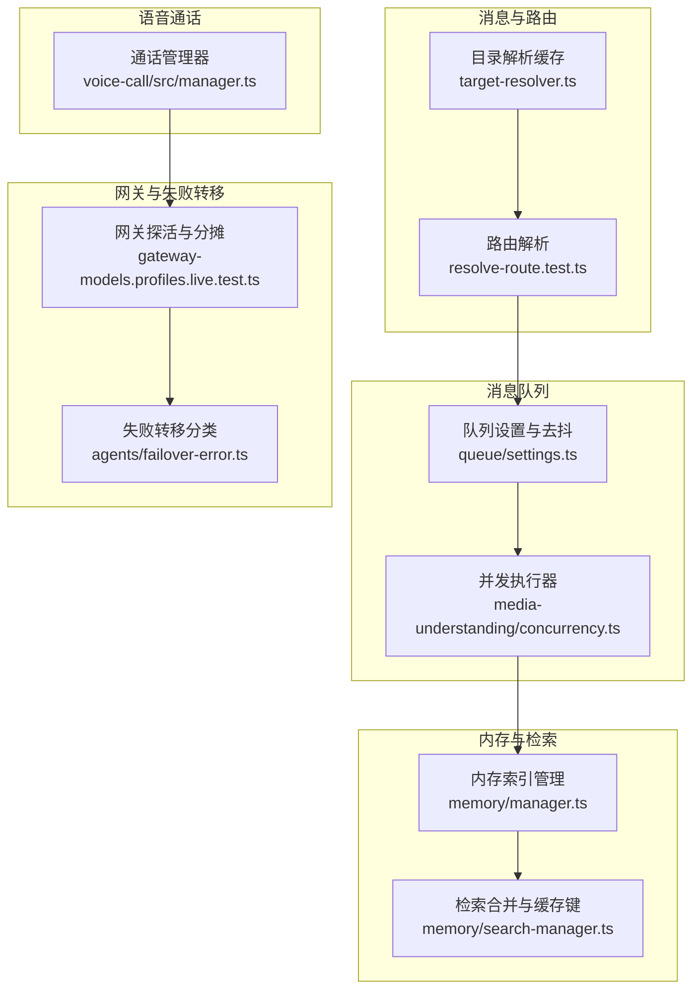
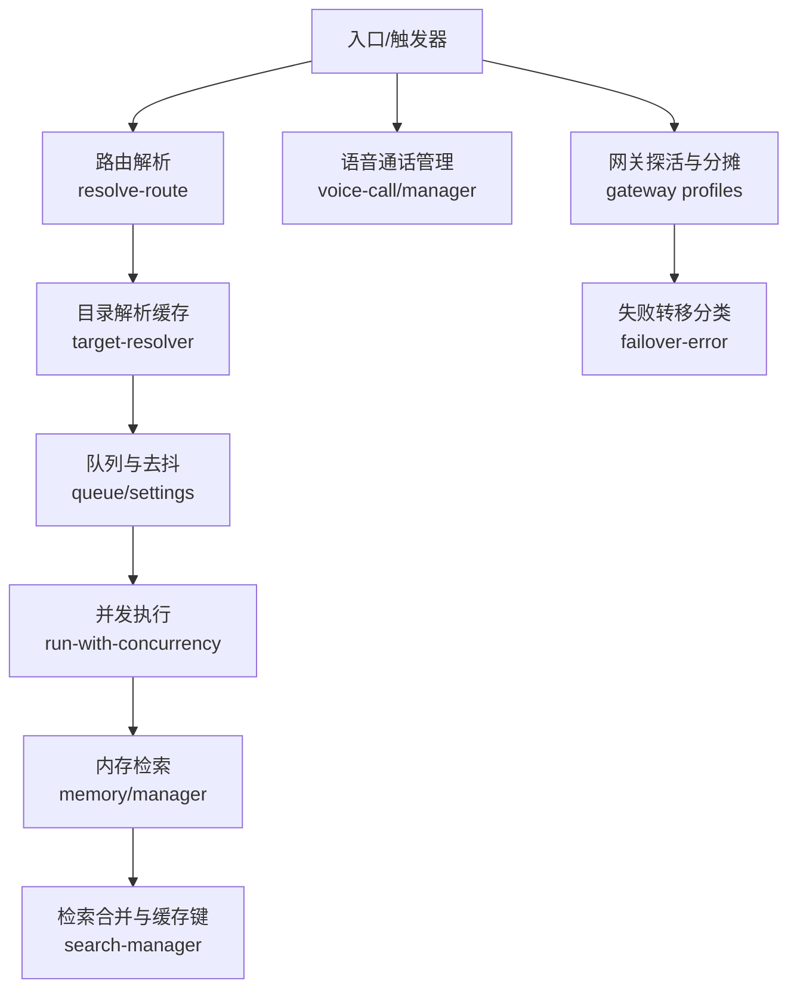
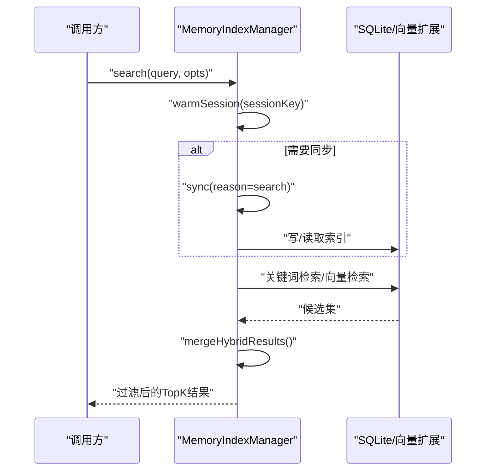
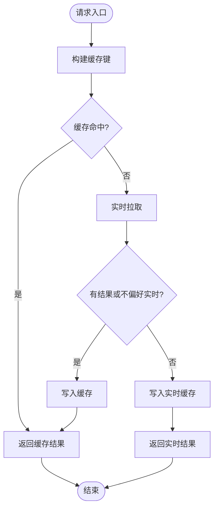
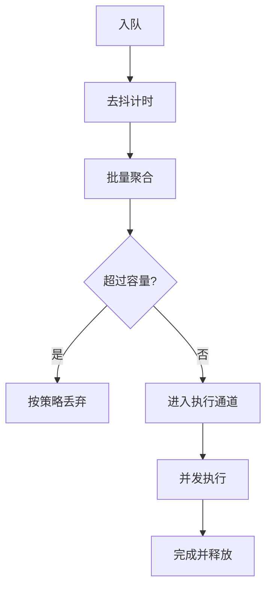
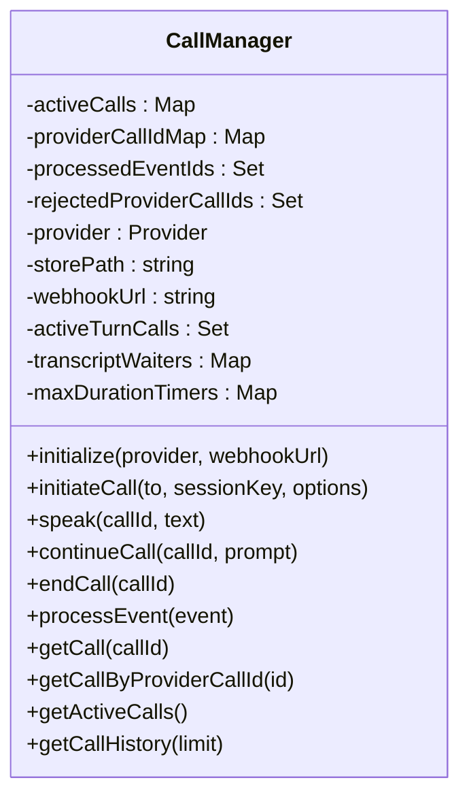
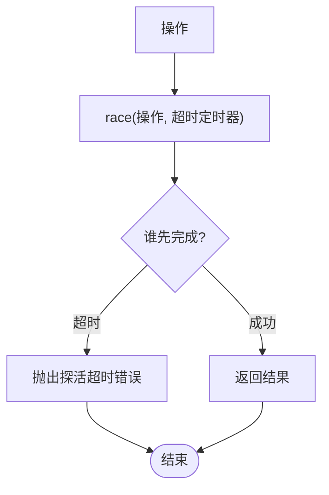
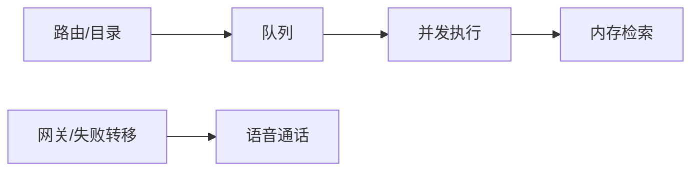

# 通用性能优化策略

<cite>
**本文引用的文件**
- [src/memory/manager.ts](file://src/memory/manager.ts)
- [src/memory/manager.readonly-recovery.test.ts](file://src/memory/manager.readonly-recovery.test.ts)
- [src/memory/manager.search.ts](file://src/memory/manager.search.ts)
- [src/memory/search-manager.ts](file://src/memory/search-manager.ts)
- [src/auto-reply/reply/queue/settings.ts](file://src/auto-reply/reply/queue/settings.ts)
- [docs/zh-CN/concepts/queue.md](file://docs/zh-CN/concepts/queue.md)
- [src/routing/resolve-route.test.ts](file://src/routing/resolve-route.test.ts)
- [src/infra/outbound/target-resolver.ts](file://src/infra/outbound/target-resolver.ts)
- [src/imessage/monitor/echo-cache.ts](file://src/imessage/monitor/echo-cache.ts)
- [src/media-understanding/concurrency.ts](file://src/media-understanding/concurrency.ts)
- [extensions/voice-call/src/manager.ts](file://extensions/voice-call/src/manager.ts)
- [src/gateway/gateway-models.profiles.live.test.ts](file://src/gateway/gateway-models.profiles.live.test.ts)
- [src/agents/failover-error.ts](file://src/agents/failover-error.ts)
- [src/telegram/fetch.ts](file://src/telegram/fetch.ts)
- [src/acp/control-plane/manager.ts](file://src/acp/control-plane/manager.ts)
- [src/acp/control-plane/manager.core.ts](file://src/acp/control-plane/manager.core.ts)
- [src/commands/sessions-cleanup.ts](file://src/commands/sessions-cleanup.ts)
- [src/memory/qmd-manager.test.ts](file://src/memory/qmd-manager.test.ts)
</cite>

## 目录
1. [引言](#引言)
2. [项目结构](#项目结构)
3. [核心组件](#核心组件)
4. [架构总览](#架构总览)
5. [详细组件分析](#详细组件分析)
6. [依赖关系分析](#依赖关系分析)
7. [性能考量](#性能考量)
8. [故障排查指南](#故障排查指南)
9. [结论](#结论)
10. [附录](#附录)

## 引言
本指南面向OpenClaw多渠道消息处理系统，聚焦跨渠道通用性能优化策略与最佳实践。内容涵盖连接池与资源复用、消息路由与队列优化、内存与缓存策略、并发控制、监控与故障转移、以及资源清理与垃圾回收等主题。目标是在不牺牲功能与可维护性的前提下，显著提升系统的吞吐、延迟与稳定性。

## 项目结构
OpenClaw采用模块化与分层架构，核心能力由以下子系统构成：
- 内存与检索：内置向量/关键词混合检索、只读数据库恢复、批处理与缓存
- 自动回复与队列：按会话与通道的队列配置、去抖与容量控制
- 路由与目录解析：绑定缓存与目录缓存，避免重复扫描
- 并发与媒体理解：统一并发执行器与任务限流
- 语音通话：状态机驱动的活动通话管理与持久化
- 网关与失败转移：探活超时、按提供商分摊、瞬态错误分类
- 会话清理：磁盘预算与溢出清理策略

**图表来源**
- [src/routing/resolve-route.test.ts:816-854](file://src/routing/resolve-route.test.ts#L816-L854)
- [src/infra/outbound/target-resolver.ts:289-340](file://src/infra/outbound/target-resolver.ts#L289-L340)
- [src/auto-reply/reply/queue/settings.ts:32-68](file://src/auto-reply/reply/queue/settings.ts#L32-L68)
- [src/media-understanding/concurrency.ts:4-18](file://src/media-understanding/concurrency.ts#L4-L18)
- [src/memory/manager.ts:257-365](file://src/memory/manager.ts#L257-L365)
- [src/memory/search-manager.ts:239-252](file://src/memory/search-manager.ts#L239-L252)
- [src/gateway/gateway-models.profiles.live.test.ts:104-145](file://src/gateway/gateway-models.profiles.live.test.ts#L104-L145)
- [src/agents/failover-error.ts:151-209](file://src/agents/failover-error.ts#L151-L209)
- [extensions/voice-call/src/manager.ts:48-319](file://extensions/voice-call/src/manager.ts#L48-L319)

**章节来源**
- [src/routing/resolve-route.test.ts:816-854](file://src/routing/resolve-route.test.ts#L816-L854)
- [src/infra/outbound/target-resolver.ts:289-340](file://src/infra/outbound/target-resolver.ts#L289-L340)
- [src/auto-reply/reply/queue/settings.ts:32-68](file://src/auto-reply/reply/queue/settings.ts#L32-L68)
- [src/media-understanding/concurrency.ts:4-18](file://src/media-understanding/concurrency.ts#L4-L18)
- [src/memory/manager.ts:257-365](file://src/memory/manager.ts#L257-L365)
- [src/memory/search-manager.ts:239-252](file://src/memory/search-manager.ts#L239-L252)
- [src/gateway/gateway-models.profiles.live.test.ts:104-145](file://src/gateway/gateway-models.profiles.live.test.ts#L104-L145)
- [src/agents/failover-error.ts:151-209](file://src/agents/failover-error.ts#L151-L209)
- [extensions/voice-call/src/manager.ts:48-319](file://extensions/voice-call/src/manager.ts#L48-L319)

## 核心组件
- 内存索引与检索：支持向量与关键词混合检索，具备只读数据库恢复、批处理与缓存、FSWatcher与定时同步，降低I/O与网络调用开销
- 队列与去抖：按通道/会话粒度的队列模式、去抖、容量与丢弃策略，保障高并发下的有序输出
- 路由与目录缓存：绑定与目录查询结果缓存，避免重复扫描，提升大规模绑定场景的响应速度
- 并发控制：统一的任务并发执行器，支持错误日志与限流，避免资源争用
- 语音通话：活动通话状态管理、持久化与定时器重置，确保重启后正确恢复
- 失败转移与探活：HTTP状态分类、瞬态错误识别、网关探活超时与按提供商分摊，提升可用性

**章节来源**
- [src/memory/manager.ts:61-188](file://src/memory/manager.ts#L61-L188)
- [src/auto-reply/reply/queue/settings.ts:32-68](file://src/auto-reply/reply/queue/settings.ts#L32-L68)
- [src/routing/resolve-route.test.ts:816-854](file://src/routing/resolve-route.test.ts#L816-L854)
- [src/infra/outbound/target-resolver.ts:289-340](file://src/infra/outbound/target-resolver.ts#L289-L340)
- [src/media-understanding/concurrency.ts:4-18](file://src/media-understanding/concurrency.ts#L4-L18)
- [extensions/voice-call/src/manager.ts:48-128](file://extensions/voice-call/src/manager.ts#L48-L128)
- [src/gateway/gateway-models.profiles.live.test.ts:104-145](file://src/gateway/gateway-models.profiles.live.test.ts#L104-L145)
- [src/agents/failover-error.ts:151-209](file://src/agents/failover-error.ts#L151-L209)

## 架构总览
OpenClaw在“路由/目录”、“队列/并发”、“内存/检索”、“网关/失败转移”之间形成清晰的职责边界，通过缓存与批处理实现跨渠道性能提升；同时在异常路径引入只读数据库恢复、失败转移与探活超时，增强鲁棒性。

**图表来源**
- [src/routing/resolve-route.test.ts:816-854](file://src/routing/resolve-route.test.ts#L816-L854)
- [src/infra/outbound/target-resolver.ts:289-340](file://src/infra/outbound/target-resolver.ts#L289-L340)
- [src/auto-reply/reply/queue/settings.ts:32-68](file://src/auto-reply/reply/queue/settings.ts#L32-L68)
- [src/media-understanding/concurrency.ts:4-18](file://src/media-understanding/concurrency.ts#L4-L18)
- [src/memory/manager.ts:257-365](file://src/memory/manager.ts#L257-L365)
- [src/memory/search-manager.ts:239-252](file://src/memory/search-manager.ts#L239-L252)
- [extensions/voice-call/src/manager.ts:48-319](file://extensions/voice-call/src/manager.ts#L48-L319)
- [src/gateway/gateway-models.profiles.live.test.ts:104-145](file://src/gateway/gateway-models.profiles.live.test.ts#L104-L145)
- [src/agents/failover-error.ts:151-209](file://src/agents/failover-error.ts#L151-L209)

## 详细组件分析

### 组件A：内存索引与检索（跨渠道共享）
- 设计要点
  - 单例缓存与延迟创建，避免重复初始化
  - 向量/关键词混合检索，支持降级与严格阈值
  - 只读数据库错误自愈：重建连接、重载向量扩展、重新同步
  - 批处理与失败锁定，限制连续失败影响
  - FSWatcher与定时器同步，减少不必要的I/O
- 性能特性
  - 搜索前预热会话，降低首次延迟
  - 检索结果合并与MMR/时间衰减，提升相关性
  - 缓存键稳定序列化，避免深排序开销
- 关键路径
  - 搜索流程：预热 → 条件同步 → 关键词/向量检索 → 合并 → 过滤
  - 只读恢复：捕获只读错误 → 关闭旧DB → 重建连接/模式 → 重试同步

**图表来源**
- [src/memory/manager.ts:257-365](file://src/memory/manager.ts#L257-L365)
- [src/memory/manager.ts:452-552](file://src/memory/manager.ts#L452-L552)
- [src/memory/search-manager.ts:248-252](file://src/memory/search-manager.ts#L248-L252)

**章节来源**
- [src/memory/manager.ts:61-188](file://src/memory/manager.ts#L61-L188)
- [src/memory/manager.ts:257-365](file://src/memory/manager.ts#L257-L365)
- [src/memory/manager.ts:452-552](file://src/memory/manager.ts#L452-L552)
- [src/memory/search-manager.ts:239-252](file://src/memory/search-manager.ts#L239-L252)
- [src/memory/manager.readonly-recovery.test.ts:108-122](file://src/memory/manager.readonly-recovery.test.ts#L108-L122)

### 组件B：消息路由与目录解析（绑定/目录缓存）
- 设计要点
  - 绑定评估缓存：通道/账户维度滚动缓存，避免全量扫描
  - 目录解析缓存：命中优先返回缓存，miss时可回退到实时拉取并写入缓存
- 性能特性
  - 大规模绑定场景下仅首次扫描，后续命中缓存
  - 目录缓存区分“缓存源/实时源”，平衡一致性与性能

**图表来源**
- [src/routing/resolve-route.test.ts:816-854](file://src/routing/resolve-route.test.ts#L816-L854)
- [src/infra/outbound/target-resolver.ts:289-340](file://src/infra/outbound/target-resolver.ts#L289-L340)

**章节来源**
- [src/routing/resolve-route.test.ts:816-854](file://src/routing/resolve-route.test.ts#L816-L854)
- [src/infra/outbound/target-resolver.ts:289-340](file://src/infra/outbound/target-resolver.ts#L289-L340)

### 组件C：消息队列与去抖（跨渠道统一）
- 设计要点
  - 模式/去抖/容量/丢弃策略可按通道/会话/全局配置
  - 默认通道进程级并发，额外通道用于后台任务
  - 保证同一会话通道内单实例运行，避免竞态
- 性能特性
  - 去抖降低高频事件风暴
  - 容量与丢弃策略防止内存膨胀
  - 并发通道分离，避免阻塞入站回复

**图表来源**
- [src/auto-reply/reply/queue/settings.ts:32-68](file://src/auto-reply/reply/queue/settings.ts#L32-L68)
- [docs/zh-CN/concepts/queue.md:74-95](file://docs/zh-CN/concepts/queue.md#L74-L95)

**章节来源**
- [src/auto-reply/reply/queue/settings.ts:32-68](file://src/auto-reply/reply/queue/settings.ts#L32-L68)
- [docs/zh-CN/concepts/queue.md:74-95](file://docs/zh-CN/concepts/queue.md#L74-L95)

### 组件D：并发控制与媒体理解
- 设计要点
  - 统一并发执行器，支持任务限流与错误日志
  - 对媒体理解等耗时任务进行并发限制，避免资源争用
- 性能特性
  - 通过限流控制峰值并发，平滑系统负载

**章节来源**
- [src/media-understanding/concurrency.ts:4-18](file://src/media-understanding/concurrency.ts#L4-L18)

### 组件E：语音通话管理（状态与持久化）
- 设计要点
  - 活跃通话映射、事件ID去重、拒绝的提供商ID集合
  - 初始化时校验持久化通话，重启后恢复定时器
  - 提供发起/播报/继续/结束等操作，封装上下文
- 性能特性
  - 重启后快速验证与恢复，减少人工干预
  - 最大时长定时器兜底，避免僵尸通话

**图表来源**
- [extensions/voice-call/src/manager.ts:48-319](file://extensions/voice-call/src/manager.ts#L48-L319)

**章节来源**
- [extensions/voice-call/src/manager.ts:48-319](file://extensions/voice-call/src/manager.ts#L48-L319)

### 组件F：网关探活与失败转移（跨渠道鲁棒性）
- 设计要点
  - 探活超时保护，避免长时间阻塞
  - 按提供商分摊，避免热点集中
  - HTTP状态码与错误码分类，识别瞬态/过载/超时
- 性能特性
  - 通过超时与分摊提升整体可用性
  - 失败原因归类指导重试与降级

**图表来源**
- [src/gateway/gateway-models.profiles.live.test.ts:104-145](file://src/gateway/gateway-models.profiles.live.test.ts#L104-L145)

**章节来源**
- [src/gateway/gateway-models.profiles.live.test.ts:104-145](file://src/gateway/gateway-models.profiles.live.test.ts#L104-L145)
- [src/agents/failover-error.ts:151-209](file://src/agents/failover-error.ts#L151-L209)

## 依赖关系分析
- 组件耦合
  - 路由/目录 → 队列：路由决定目标，目录决定成员，队列统一调度
  - 队列 → 并发：并发执行器承载任务
  - 并发 → 内存：媒体理解/检索等任务访问内存
  - 网关/失败转移 → 语音通话：二者均依赖统一的超时与错误分类
- 外部依赖
  - SQLite/向量扩展：内存检索的核心
  - 提供商API：语音通话、网关探活等
- 循环依赖
  - 当前模块间为单向依赖，未见循环

**图表来源**
- [src/routing/resolve-route.test.ts:816-854](file://src/routing/resolve-route.test.ts#L816-L854)
- [src/infra/outbound/target-resolver.ts:289-340](file://src/infra/outbound/target-resolver.ts#L289-L340)
- [src/auto-reply/reply/queue/settings.ts:32-68](file://src/auto-reply/reply/queue/settings.ts#L32-L68)
- [src/media-understanding/concurrency.ts:4-18](file://src/media-understanding/concurrency.ts#L4-L18)
- [src/memory/manager.ts:257-365](file://src/memory/manager.ts#L257-L365)
- [src/gateway/gateway-models.profiles.live.test.ts:104-145](file://src/gateway/gateway-models.profiles.live.test.ts#L104-L145)
- [extensions/voice-call/src/manager.ts:48-319](file://extensions/voice-call/src/manager.ts#L48-L319)

**章节来源**
- [src/routing/resolve-route.test.ts:816-854](file://src/routing/resolve-route.test.ts#L816-L854)
- [src/infra/outbound/target-resolver.ts:289-340](file://src/infra/outbound/target-resolver.ts#L289-L340)
- [src/auto-reply/reply/queue/settings.ts:32-68](file://src/auto-reply/reply/queue/settings.ts#L32-L68)
- [src/media-understanding/concurrency.ts:4-18](file://src/media-understanding/concurrency.ts#L4-L18)
- [src/memory/manager.ts:257-365](file://src/memory/manager.ts#L257-L365)
- [src/gateway/gateway-models.profiles.live.test.ts:104-145](file://src/gateway/gateway-models.profiles.live.test.ts#L104-L145)
- [extensions/voice-call/src/manager.ts:48-319](file://extensions/voice-call/src/manager.ts#L48-L319)

## 性能考量
- 连接池与资源复用
  - 内存索引管理器采用单例缓存与延迟创建，避免重复初始化成本
  - 语音通话管理器持久化存储，重启后快速恢复，减少重建开销
- 消息路由优化
  - 绑定评估缓存与目录解析缓存，避免全量扫描；miss时写入缓存，提升后续命中率
- 内存使用优化
  - 检索合并与缓存键稳定序列化，降低深排序与字符串化开销
  - 只读数据库错误自愈，避免因只读状态导致的持续失败
- 并发控制
  - 统一并发执行器与限流，避免峰值并发导致的资源争用
  - 队列去抖与容量控制，抑制事件风暴
- 资源清理与垃圾回收
  - 会话清理策略：缺失/陈旧/溢出/磁盘预算淘汰，配合预览与干跑避免误操作
  - 内存管理器关闭时清理定时器、监听器与数据库连接，确保资源回收

**章节来源**
- [src/memory/manager.ts:45-59](file://src/memory/manager.ts#L45-L59)
- [src/memory/manager.ts:769-800](file://src/memory/manager.ts#L769-L800)
- [src/commands/sessions-cleanup.ts:74-240](file://src/commands/sessions-cleanup.ts#L74-L240)
- [src/memory/manager.readonly-recovery.test.ts:108-122](file://src/memory/manager.readonly-recovery.test.ts#L108-L122)

## 故障排查指南
- 内存只读错误
  - 现象：只读数据库报错导致检索失败
  - 处理：自动重建连接、重载向量扩展、重新同步；记录尝试/成功/失败次数
  - 参考测试：设置busy_timeout与检测只读错误
- 失败转移与探活
  - 现象：HTTP 5xx/499/529等瞬态错误
  - 处理：根据状态码与错误文本分类，选择重试/降级/超时
  - 探活：race操作与超时保护，避免长时间阻塞
- 语音通话恢复
  - 现象：重启后需要恢复活动通话
  - 处理：校验持久化通话，恢复定时器；对未知状态依赖定时器兜底
- 代理/网络问题
  - 现象：IPv4回退规则匹配
  - 处理：根据错误码与消息特征判断是否回退至IPv4

**章节来源**
- [src/memory/manager.ts:469-552](file://src/memory/manager.ts#L469-L552)
- [src/memory/manager.readonly-recovery.test.ts:108-122](file://src/memory/manager.readonly-recovery.test.ts#L108-L122)
- [src/agents/failover-error.ts:151-209](file://src/agents/failover-error.ts#L151-L209)
- [src/gateway/gateway-models.profiles.live.test.ts:104-145](file://src/gateway/gateway-models.profiles.live.test.ts#L104-L145)
- [extensions/voice-call/src/manager.ts:135-195](file://extensions/voice-call/src/manager.ts#L135-L195)
- [src/telegram/fetch.ts:317-329](file://src/telegram/fetch.ts#L317-L329)

## 结论
通过在路由/目录、队列/并发、内存/检索、网关/失败转移等层面实施缓存、批处理、并发限制与自愈机制，OpenClaw实现了跨渠道的通用性能优化。结合会话清理与资源回收策略，系统在高并发与复杂渠道环境下仍能保持稳定与高效。建议在部署中结合实际流量特征调整队列参数、缓存容量与并发上限，并持续监控只读恢复与失败转移统计，以进一步优化性能与可靠性。

## 附录
- 相关配置与文档
  - 队列概念与默认行为：[docs/zh-CN/concepts/queue.md:74-95](file://docs/zh-CN/concepts/queue.md#L74-L95)
  - 绑定缓存可扩展性测试：[src/routing/resolve-route.test.ts:816-854](file://src/routing/resolve-route.test.ts#L816-L854)
  - 目录解析缓存策略：[src/infra/outbound/target-resolver.ts:289-340](file://src/infra/outbound/target-resolver.ts#L289-L340)
  - 语音通话管理器：[extensions/voice-call/src/manager.ts:48-319](file://extensions/voice-call/src/manager.ts#L48-L319)
  - 网关探活与分摊：[src/gateway/gateway-models.profiles.live.test.ts:104-145](file://src/gateway/gateway-models.profiles.live.test.ts#L104-L145)
  - 失败转移分类：[src/agents/failover-error.ts:151-209](file://src/agents/failover-error.ts#L151-L209)
  - 内存只读恢复测试：[src/memory/manager.readonly-recovery.test.ts:108-122](file://src/memory/manager.readonly-recovery.test.ts#L108-L122)
  - 会话清理策略：[src/commands/sessions-cleanup.ts:74-240](file://src/commands/sessions-cleanup.ts#L74-L240)