# 系统性能优化

<cite>
**本文引用的文件**
- [scripts/bench-cli-startup.ts](file://scripts/bench-cli-startup.ts)
- [scripts/test-parallel.mjs](file://scripts/test-parallel.mjs)
- [scripts/test-perf-budget.mjs](file://scripts/test-perf-budget.mjs)
- [src/commands/doctor-platform-notes.ts](file://src/commands/doctor-platform-notes.ts)
- [src/cli/daemon-cli/lifecycle.ts](file://src/cli/daemon-cli/lifecycle.ts)
- [src/daemon/systemd.ts](file://src/daemon/systemd.ts)
- [src/memory/search-manager.ts](file://src/memory/search-manager.ts)
- [src/memory/qmd-manager.test.ts](file://src/memory/qmd-manager.test.ts)
- [src/agents/pi-embedded-runner/run.ts](file://src/agents/pi-embedded-runner/run.ts)
- [extensions/zalouser/src/zalo-js.ts](file://extensions/zalouser/src/zalo-js.ts)
- [docs/zh-CN/concepts/architecture.md](file://docs/zh-CN/concepts/architecture.md)
</cite>

## 目录
1. [简介](#简介)
2. [项目结构](#项目结构)
3. [核心组件](#核心组件)
4. [架构总览](#架构总览)
5. [详细组件分析](#详细组件分析)
6. [依赖关系分析](#依赖关系分析)
7. [性能考量](#性能考量)
8. [故障排查指南](#故障排查指南)
9. [结论](#结论)
10. [附录](#附录)

## 简介
本技术文档聚焦于 OpenClaw 系统的系统级性能优化，覆盖 CPU 利用率优化、内存管理、进程调度、文件系统 I/O 优化、网关服务器性能调优、守护进程优化、基础设施组件性能配置，并提供系统资源监控、性能瓶颈识别、负载测试等实用工具与方法。同时总结不同操作系统平台下的优化差异与最佳实践，解释如何通过配置参数调整系统行为以获得最佳性能表现。

## 项目结构
OpenClaw 采用多语言混合工程：核心逻辑以 TypeScript/JavaScript 实现，测试与基准脚本位于 scripts 目录，CLI 守护进程与 systemd 集成在 src/daemon 与 src/cli 下，文档与概念性说明位于 docs 目录。与性能优化直接相关的模块包括：
- 基准与测试工具：scripts/bench-cli-startup.ts、scripts/test-parallel.mjs、scripts/test-perf-budget.mjs
- 平台启动优化提示：src/commands/doctor-platform-notes.ts
- 网关生命周期与健康检查：src/cli/daemon-cli/lifecycle.ts
- systemd 集成与服务管理：src/daemon/systemd.ts
- 内存与缓存管理：src/memory/search-manager.ts、src/memory/qmd-manager.test.ts
- 资源使用统计与重试上限：src/agents/pi-embedded-runner/run.ts
- 扩展层超时与错误处理：extensions/zalouser/src/zalo-js.ts
- 架构概览：docs/zh-CN/concepts/architecture.md

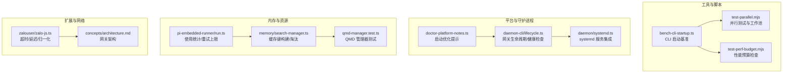

图表来源
- [scripts/bench-cli-startup.ts:1-201](file://scripts/bench-cli-startup.ts#L1-L201)
- [scripts/test-parallel.mjs:1-500](file://scripts/test-parallel.mjs#L1-L500)
- [scripts/test-perf-budget.mjs:1-128](file://scripts/test-perf-budget.mjs#L1-L128)
- [src/commands/doctor-platform-notes.ts:159-221](file://src/commands/doctor-platform-notes.ts#L159-L221)
- [src/cli/daemon-cli/lifecycle.ts:193-335](file://src/cli/daemon-cli/lifecycle.ts#L193-L335)
- [src/daemon/systemd.ts:452-522](file://src/daemon/systemd.ts#L452-L522)
- [src/memory/search-manager.ts:239-252](file://src/memory/search-manager.ts#L239-L252)
- [src/memory/qmd-manager.test.ts:105-127](file://src/memory/qmd-manager.test.ts#L105-L127)
- [src/agents/pi-embedded-runner/run.ts:121-155](file://src/agents/pi-embedded-runner/run.ts#L121-L155)
- [extensions/zalouser/src/zalo-js.ts:106-160](file://extensions/zalouser/src/zalo-js.ts#L106-L160)
- [docs/zh-CN/concepts/architecture.md:15-40](file://docs/zh-CN/concepts/architecture.md#L15-L40)

章节来源
- [scripts/bench-cli-startup.ts:1-201](file://scripts/bench-cli-startup.ts#L1-L201)
- [scripts/test-parallel.mjs:1-500](file://scripts/test-parallel.mjs#L1-L500)
- [scripts/test-perf-budget.mjs:1-128](file://scripts/test-perf-budget.mjs#L1-L128)
- [src/commands/doctor-platform-notes.ts:159-221](file://src/commands/doctor-platform-notes.ts#L159-L221)
- [src/cli/daemon-cli/lifecycle.ts:193-335](file://src/cli/daemon-cli/lifecycle.ts#L193-L335)
- [src/daemon/systemd.ts:452-522](file://src/daemon/systemd.ts#L452-L522)
- [src/memory/search-manager.ts:239-252](file://src/memory/search-manager.ts#L239-L252)
- [src/memory/qmd-manager.test.ts:105-127](file://src/memory/qmd-manager.test.ts#L105-L127)
- [src/agents/pi-embedded-runner/run.ts:121-155](file://src/agents/pi-embedded-runner/run.ts#L121-L155)
- [extensions/zalouser/src/zalo-js.ts:106-160](file://extensions/zalouser/src/zalo-js.ts#L106-L160)
- [docs/zh-CN/concepts/architecture.md:15-40](file://docs/zh-CN/concepts/architecture.md#L15-L40)

## 核心组件
- CLI 启动性能基准：通过多次执行命令并统计平均/中位/95 分位耗时，评估启动路径性能变化。
- 并行测试与工作池：根据 CPU 数量、内存与负载动态分配工作池大小，支持 vmForks/forks 池选择与分片运行。
- 性能预算检查：基于 Vitest 报告解析单文件耗时，结合全局墙钟时间进行回归阈值控制。
- 启动优化提示：针对低内存/ARM 主机建议设置编译缓存与自重启策略，减少重复启动开销。
- 网关生命周期与健康检查：统一的启动/停止/重启流程，带端口健康探测与超时诊断。
- systemd 集成：生成/安装/卸载用户态 systemd 服务单元，读取环境文件与 ExecStart 参数，支持机器作用域回退。
- 内存与缓存：QMD 缓存键稳定序列化、缓存淘汰钩子，降低热路径字符串化成本。
- 资源使用统计：嵌入式运行器聚合输入/输出/缓存读写/总耗时，配合重试上限避免无限循环。
- 扩展层超时与错误处理：统一超时包装、延迟与错误消息归一化，提升外部调用稳定性。
- 网关架构：长期运行的网关守护进程，通过 WebSocket 对外提供 API 与事件流。

章节来源
- [scripts/bench-cli-startup.ts:68-111](file://scripts/bench-cli-startup.ts#L68-L111)
- [scripts/test-parallel.mjs:246-300](file://scripts/test-parallel.mjs#L246-L300)
- [scripts/test-perf-budget.mjs:62-127](file://scripts/test-perf-budget.mjs#L62-L127)
- [src/commands/doctor-platform-notes.ts:159-221](file://src/commands/doctor-platform-notes.ts#L159-L221)
- [src/cli/daemon-cli/lifecycle.ts:193-335](file://src/cli/daemon-cli/lifecycle.ts#L193-L335)
- [src/daemon/systemd.ts:608-648](file://src/daemon/systemd.ts#L608-L648)
- [src/memory/search-manager.ts:239-252](file://src/memory/search-manager.ts#L239-L252)
- [src/agents/pi-embedded-runner/run.ts:121-155](file://src/agents/pi-embedded-runner/run.ts#L121-L155)
- [extensions/zalouser/src/zalo-js.ts:106-160](file://extensions/zalouser/src/zalo-js.ts#L106-L160)
- [docs/zh-CN/concepts/architecture.md:15-40](file://docs/zh-CN/concepts/architecture.md#L15-L40)

## 架构总览
下图展示网关作为长期运行的守护进程，通过 WebSocket 对外提供 API 与事件流，控制平面客户端与节点均通过 WS 连接。该架构决定了网关的 CPU/内存/网络 I/O 与持久化策略对整体性能的影响。

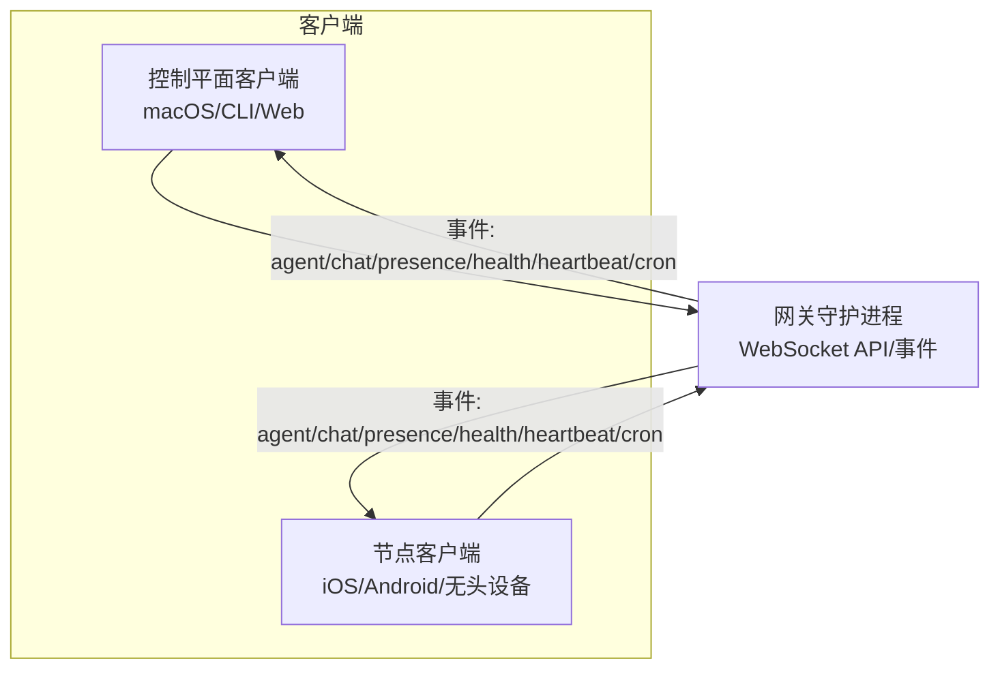

图表来源
- [docs/zh-CN/concepts/architecture.md:15-40](file://docs/zh-CN/concepts/architecture.md#L15-L40)

章节来源
- [docs/zh-CN/concepts/architecture.md:15-40](file://docs/zh-CN/concepts/architecture.md#L15-L40)

## 详细组件分析

### CLI 启动性能基准（bench-cli-startup.ts）
- 多命令集测试：版本查询、帮助、健康状态、状态查询等，统计多次运行的耗时分布。
- 关键指标：平均、中位、95 分位、最小/最大，以及退出码/信号分布。
- 适用场景：对比不同入口或构建产物的启动性能，定位回归。

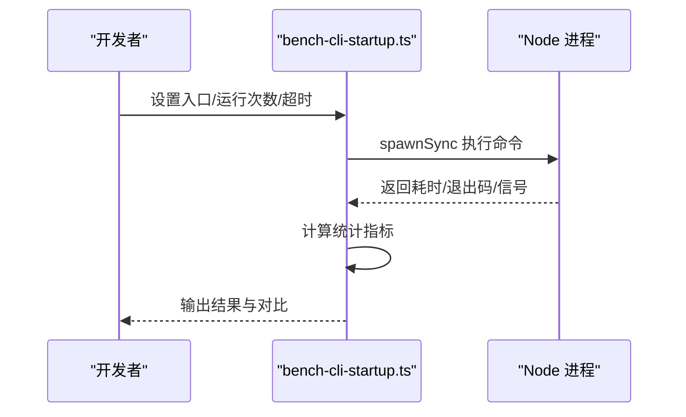

图表来源
- [scripts/bench-cli-startup.ts:68-111](file://scripts/bench-cli-startup.ts#L68-L111)

章节来源
- [scripts/bench-cli-startup.ts:68-111](file://scripts/bench-cli-startup.ts#L68-L111)

### 并行测试与工作池（test-parallel.mjs）
- 动态工作池：依据 CPU 数、内存与当前负载计算本地工作池大小，支持 vmForks/forks 池选择。
- 分片与隔离：支持分片运行、单元/扩展/网关三类任务的独立工作池，隔离高争用文件。
- CI 与本地差异化：在非 macOS CI 上优先使用默认工作池，macOS CI 限制 worker 数以避免崩溃。
- 内存保护：低内存主机限制并行度，避免 OOM；Node 版本对 vmForks 的兼容性处理。

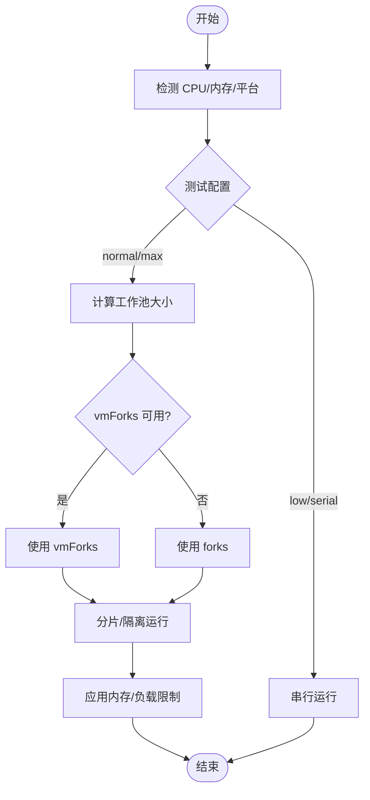

图表来源
- [scripts/test-parallel.mjs:246-300](file://scripts/test-parallel.mjs#L246-L300)

章节来源
- [scripts/test-parallel.mjs:1-500](file://scripts/test-parallel.mjs#L1-L500)

### 性能预算检查（test-perf-budget.mjs）
- 基于 Vitest JSON 报告解析单文件耗时，汇总文件总耗时与文件数。
- 支持全局墙钟时间阈值与基线回归阈值，失败时输出详细信息并退出码 1。

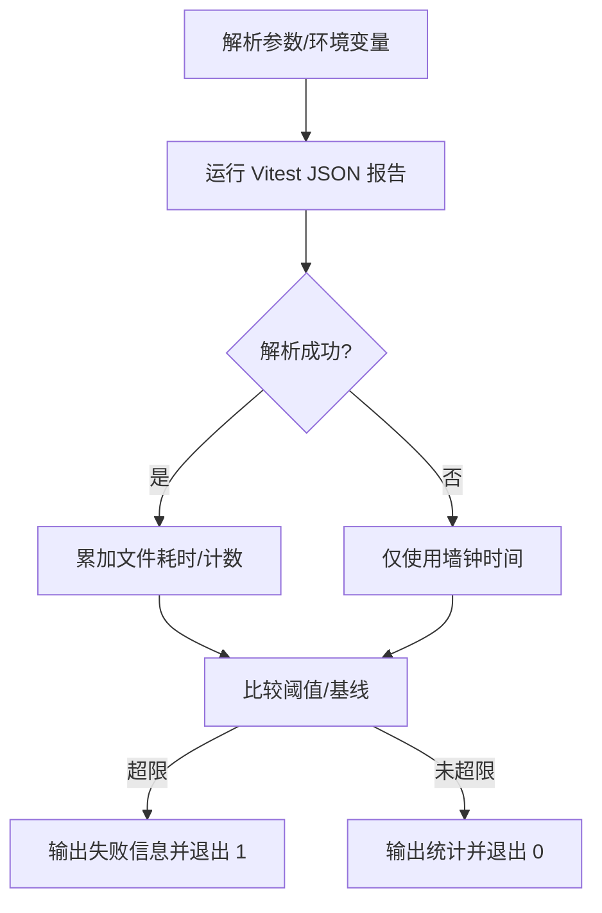

图表来源
- [scripts/test-perf-budget.mjs:62-127](file://scripts/test-perf-budget.mjs#L62-L127)

章节来源
- [scripts/test-perf-budget.mjs:1-128](file://scripts/test-perf-budget.mjs#L1-L128)

### 启动优化提示（doctor-platform-notes.ts）
- 目标主机：Linux ARM/低内存主机（≤8GiB）。
- 关键建议：
  - 将 NODE_COMPILE_CACHE 指向持久目录（如 /var/tmp），避免 /tmp 重启丢失。
  - 设置 OPENCLAW_NO_RESPAWN=1，避免自重启带来的额外启动开销。
  - 若已禁用编译缓存，建议取消禁用以提升后续启动速度。

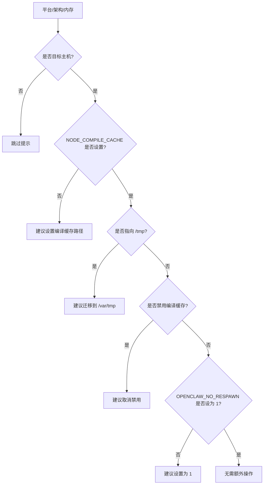

图表来源
- [src/commands/doctor-platform-notes.ts:159-221](file://src/commands/doctor-platform-notes.ts#L159-L221)

章节来源
- [src/commands/doctor-platform-notes.ts:159-221](file://src/commands/doctor-platform-notes.ts#L159-L221)

### 网关生命周期与健康检查（daemon-cli/lifecycle.ts）
- 统一的启动/停止/重启流程，支持服务管理器与“无服务管理”两种模式。
- 健康检查：重启后等待端口监听、探测运行状态、清理陈旧进程。
- 诊断输出：超时/陈旧进程/端口占用等信息，便于快速定位问题。

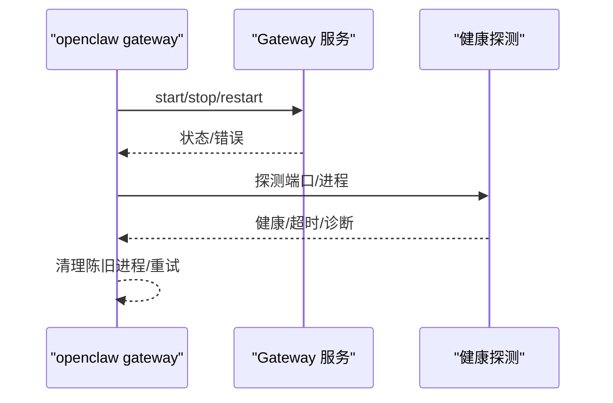

图表来源
- [src/cli/daemon-cli/lifecycle.ts:220-335](file://src/cli/daemon-cli/lifecycle.ts#L220-L335)

章节来源
- [src/cli/daemon-cli/lifecycle.ts:193-335](file://src/cli/daemon-cli/lifecycle.ts#L193-L335)

### systemd 集成（daemon/systemd.ts）
- 读取/解析 systemd 用户服务单元，合并内联与文件环境，支持机器作用域回退。
- 安装/卸载/启用/重启服务，记录备份与回滚路径。
- 服务状态查询：ActiveState/SubState/MainPID/ExecMainStatus/ExecMainCode。

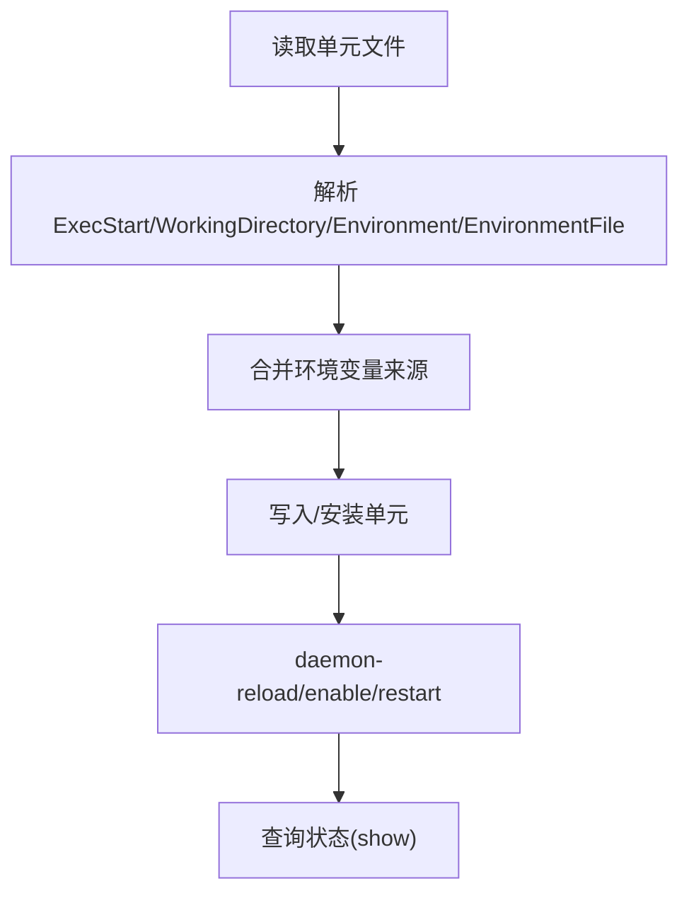

图表来源
- [src/daemon/systemd.ts:62-123](file://src/daemon/systemd.ts#L62-L123)
- [src/daemon/systemd.ts:452-522](file://src/daemon/systemd.ts#L452-L522)
- [src/daemon/systemd.ts:608-648](file://src/daemon/systemd.ts#L608-L648)

章节来源
- [src/daemon/systemd.ts:62-123](file://src/daemon/systemd.ts#L62-L123)
- [src/daemon/systemd.ts:452-522](file://src/daemon/systemd.ts#L452-L522)
- [src/daemon/systemd.ts:608-648](file://src/daemon/systemd.ts#L608-L648)

### 内存与缓存（memory/search-manager.ts、qmd-manager.test.ts）
- 缓存键构建：使用稳定 JSON 序列化避免深度排序开销，提高热路径性能。
- 淘汰钩子：关闭时触发缓存淘汰，释放资源。
- 测试夹具：临时目录与清理，确保测试隔离与可重复性。

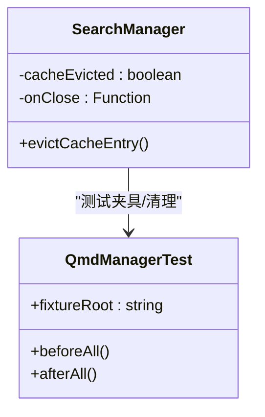

图表来源
- [src/memory/search-manager.ts:239-252](file://src/memory/search-manager.ts#L239-L252)
- [src/memory/qmd-manager.test.ts:105-127](file://src/memory/qmd-manager.test.ts#L105-L127)

章节来源
- [src/memory/search-manager.ts:239-252](file://src/memory/search-manager.ts#L239-L252)
- [src/memory/qmd-manager.test.ts:105-127](file://src/memory/qmd-manager.test.ts#L105-L127)

### 资源使用统计与重试上限（pi-embedded-runner/run.ts）
- 使用统计聚合：input/output/cacheRead/cacheWrite/total 等指标。
- 重试上限：基于候选数量与固定/最小/最大边界计算最大重试次数，避免无限循环。
- 防御性校验：确保使用值为有限正数才计入统计。

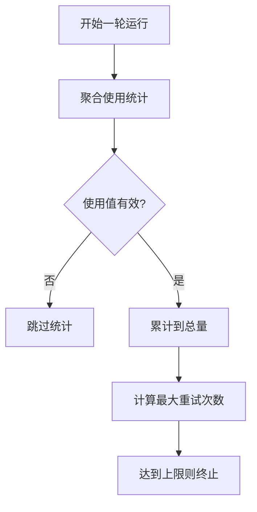

图表来源
- [src/agents/pi-embedded-runner/run.ts:121-155](file://src/agents/pi-embedded-runner/run.ts#L121-L155)

章节来源
- [src/agents/pi-embedded-runner/run.ts:121-155](file://src/agents/pi-embedded-runner/run.ts#L121-L155)

### 扩展层超时与错误处理（zalouser/zalo-js.ts）
- 超时包装：Promise 超时控制，避免阻塞。
- 延迟函数：统一异步延迟接口。
- 错误与数据归一化：字符串/数字 ID 规范化，错误消息统一。

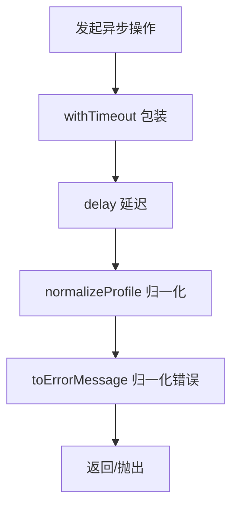

图表来源
- [extensions/zalouser/src/zalo-js.ts:106-160](file://extensions/zalouser/src/zalo-js.ts#L106-L160)

章节来源
- [extensions/zalouser/src/zalo-js.ts:106-160](file://extensions/zalouser/src/zalo-js.ts#L106-L160)

## 依赖关系分析
- 工具链依赖：bench-cli-startup.ts 依赖 Node 子进程同步执行；test-parallel.mjs 依赖 Vitest 运行器与工作池；test-perf-budget.mjs 依赖 Vitest JSON 报告。
- 平台依赖：doctor-platform-notes.ts 依赖系统内存/架构信息；systemd.ts 依赖 systemctl 与用户作用域。
- 网关依赖：daemon-cli/lifecycle.ts 依赖网关进程探测与健康探测；systemd.ts 提供服务安装/状态查询。

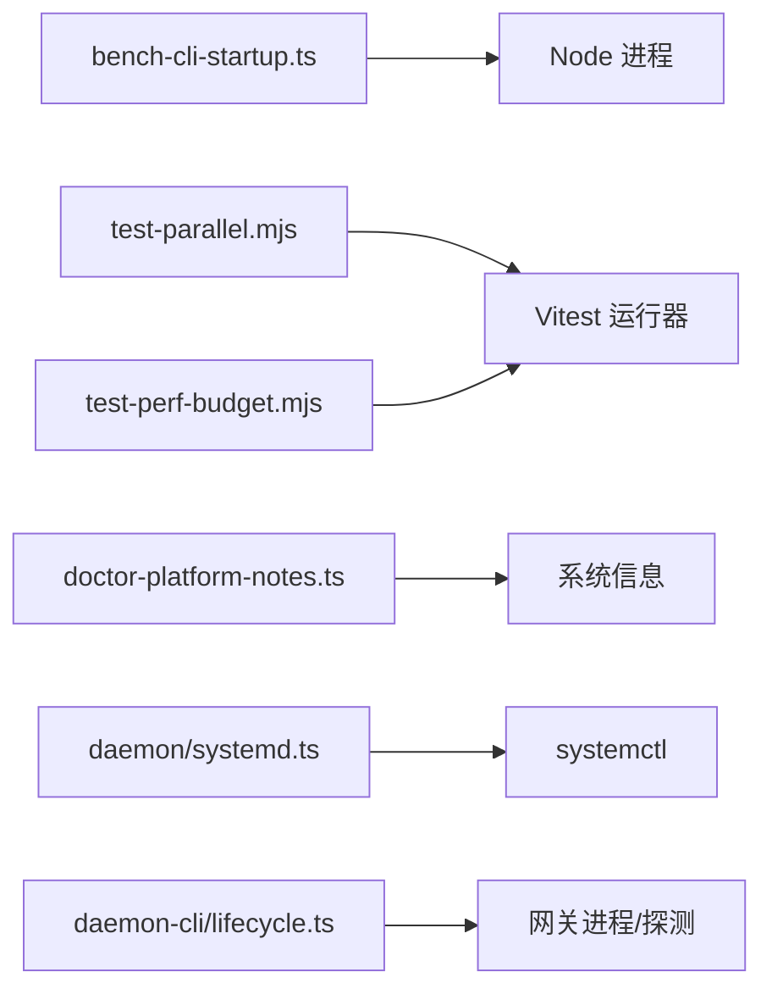

图表来源
- [scripts/bench-cli-startup.ts:77-87](file://scripts/bench-cli-startup.ts#L77-L87)
- [scripts/test-parallel.mjs:378-384](file://scripts/test-parallel.mjs#L378-L384)
- [scripts/test-perf-budget.mjs:74-77](file://scripts/test-perf-budget.mjs#L74-L77)
- [src/commands/doctor-platform-notes.ts:168-177](file://src/commands/doctor-platform-notes.ts#L168-L177)
- [src/daemon/systemd.ts:255-259](file://src/daemon/systemd.ts#L255-L259)
- [src/cli/daemon-cli/lifecycle.ts:98-105](file://src/cli/daemon-cli/lifecycle.ts#L98-L105)

章节来源
- [scripts/bench-cli-startup.ts:77-87](file://scripts/bench-cli-startup.ts#L77-L87)
- [scripts/test-parallel.mjs:378-384](file://scripts/test-parallel.mjs#L378-L384)
- [scripts/test-perf-budget.mjs:74-77](file://scripts/test-perf-budget.mjs#L74-L77)
- [src/commands/doctor-platform-notes.ts:168-177](file://src/commands/doctor-platform-notes.ts#L168-L177)
- [src/daemon/systemd.ts:255-259](file://src/daemon/systemd.ts#L255-L259)
- [src/cli/daemon-cli/lifecycle.ts:98-105](file://src/cli/daemon-cli/lifecycle.ts#L98-L105)

## 性能考量
- CPU 利用率优化
  - 并行测试：合理设置工作池大小与分片，避免 vmForks 在特定 Node 版本下的不稳定；在高内存主机优先并行，低内存主机保守并行。
  - 网关重启：健康检查与陈旧进程清理，减少无效 CPU 占用。
- 内存管理
  - 缓存键稳定序列化：降低热路径字符串化成本；缓存淘汰钩子及时释放资源。
  - 测试夹具：临时目录与清理，避免测试间内存泄漏。
- 进程调度
  - systemd 用户服务：启用持久化与自动重启，结合健康检查保障可用性。
  - CLI 启动优化：编译缓存与自重启策略减少重复启动开销。
- 文件系统 I/O 优化
  - 将编译缓存置于持久卷（如 /var/tmp），避免 /tmp 重启丢失导致的冷启动。
  - 并行测试中分离高争用文件，降低文件系统竞争。
- 网关服务器性能
  - WebSocket 架构：单一长期运行的网关，减少连接建立开销；事件驱动模型降低轮询成本。
  - 健康检查：端口监听与进程状态探测，快速发现异常并恢复。
- 守护进程优化
  - systemd 集成：单元文件合并环境来源，支持机器作用域回退；安装/卸载/重启流程标准化。
- 基础设施组件性能配置
  - 环境变量与工作池：通过环境变量控制最大堆大小、工作池数量与分片策略，适配不同平台与资源约束。
- 不同操作系统平台差异与最佳实践
  - Linux ARM/低内存：重点优化启动与编译缓存；vmForks 在部分 Node 版本不推荐；CI 上限制 worker 数避免崩溃。
  - macOS：CI 限制 worker 数；systemd 用户作用域不可用时走替代路径。
  - Windows：spawn 行为差异，使用 shell 启动器；CI 上容忍特定错误以保证稳定性。
- 通过配置参数调整系统行为
  - OPENCLAW_NO_RESPAWN：避免自重启带来的额外启动开销。
  - OPENCLAW_TEST_*：控制测试并行度、分片、vmForks 与最大堆大小。
  - NODE_COMPILE_CACHE：指定编译缓存路径，建议持久卷。
  - OPENCLAW_GATEWAY_*：网关认证与密码环境变量覆盖，避免混淆错误。

## 故障排查指南
- 启动缓慢
  - 检查 NODE_COMPILE_CACHE 是否设置且指向持久卷；确认 OPENCLAW_NO_RESPAWN=1。
  - 使用 bench-cli-startup.ts 对比不同入口/构建产物的启动耗时。
- 测试超时/回归
  - 使用 test-perf-budget.mjs 设置全局墙钟时间阈值与基线回归阈值，定位回归。
  - test-parallel.mjs 中检查工作池大小与分片配置，必要时降低并行度。
- 网关无法启动/端口占用
  - 使用 daemon-cli/lifecycle.ts 的健康检查与陈旧进程清理；systemd 状态查询 show ActiveState/SubState/MainPID。
- systemd 不可用
  - 检查 systemctl 可用性与用户作用域；必要时回退到机器作用域；查看详细错误信息。
- 扩展调用超时
  - 使用 zalouser 的超时包装与延迟函数，结合错误消息归一化定位问题。

章节来源
- [src/commands/doctor-platform-notes.ts:159-221](file://src/commands/doctor-platform-notes.ts#L159-L221)
- [scripts/bench-cli-startup.ts:156-201](file://scripts/bench-cli-startup.ts#L156-L201)
- [scripts/test-perf-budget.mjs:98-127](file://scripts/test-perf-budget.mjs#L98-L127)
- [scripts/test-parallel.mjs:246-300](file://scripts/test-parallel.mjs#L246-L300)
- [src/cli/daemon-cli/lifecycle.ts:243-335](file://src/cli/daemon-cli/lifecycle.ts#L243-L335)
- [src/daemon/systemd.ts:420-450](file://src/daemon/systemd.ts#L420-L450)
- [extensions/zalouser/src/zalo-js.ts:106-160](file://extensions/zalouser/src/zalo-js.ts#L106-L160)

## 结论
通过基准测试、并行工作池、健康检查与 systemd 集成，OpenClaw 在多平台环境下实现了可量化、可配置的系统性能优化。关键在于：合理设置启动与编译缓存、按平台与资源动态调整并行度、利用健康检查与陈旧进程清理保障可用性，并通过环境变量与配置参数微调系统行为以获得最佳性能表现。

## 附录
- 常用环境变量
  - OPENCLAW_NO_RESPAWN：避免自重启带来的额外启动开销。
  - OPENCLAW_TEST_*：控制测试并行度、分片、vmForks 与最大堆大小。
  - NODE_COMPILE_CACHE：指定编译缓存路径，建议持久卷。
  - OPENCLAW_GATEWAY_TOKEN/PASSWORD：网关认证覆盖，避免混淆错误。
- 常用命令
  - bench-cli-startup.ts：对比不同入口/构建产物的启动性能。
  - test-parallel.mjs：并行运行测试，支持分片与隔离。
  - test-perf-budget.mjs：基于 Vitest 报告的性能预算检查。
  - systemd 相关：安装/卸载/启用/重启服务，查询状态。