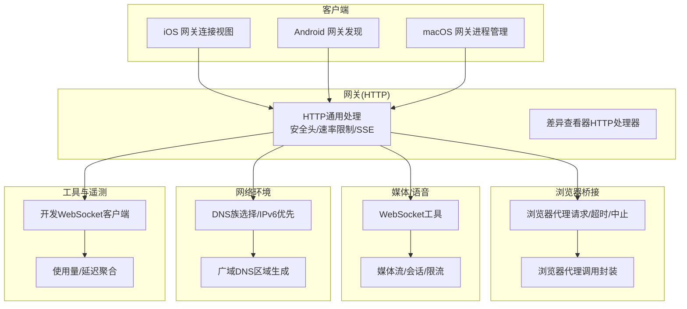
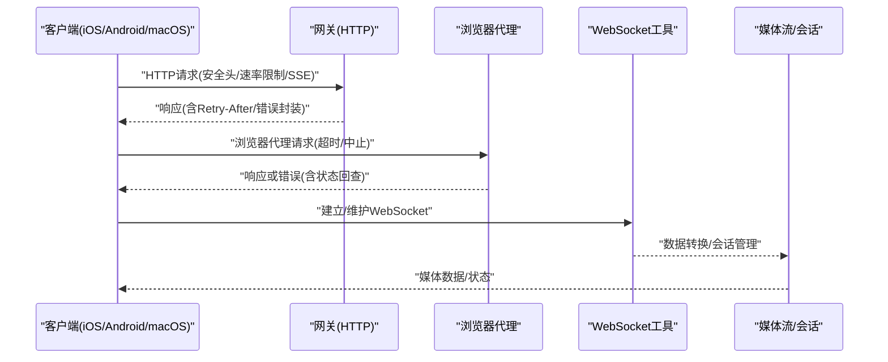
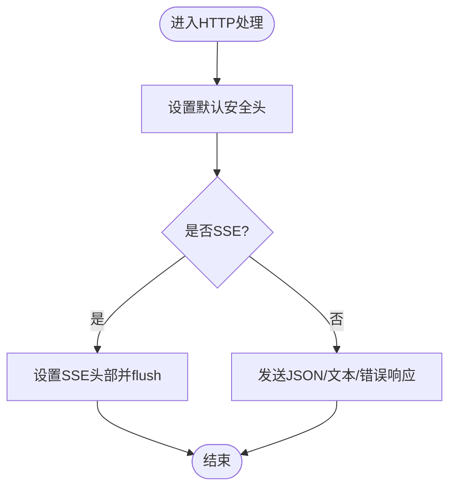
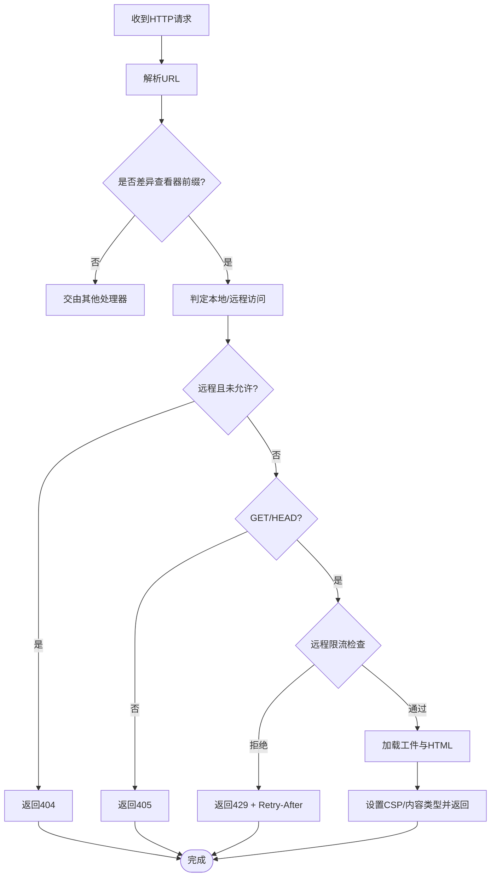
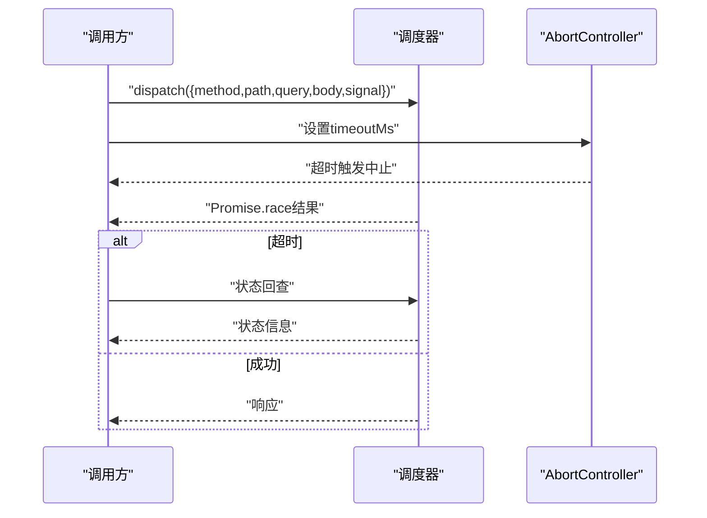
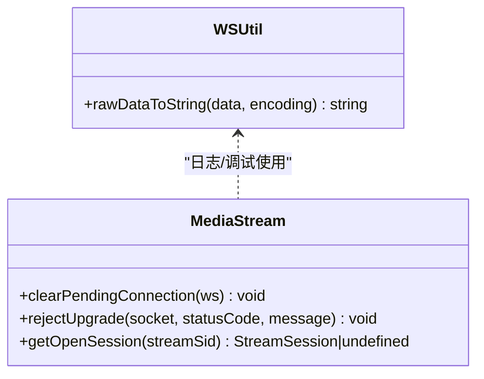
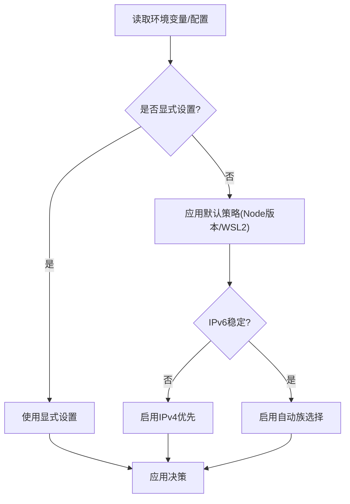
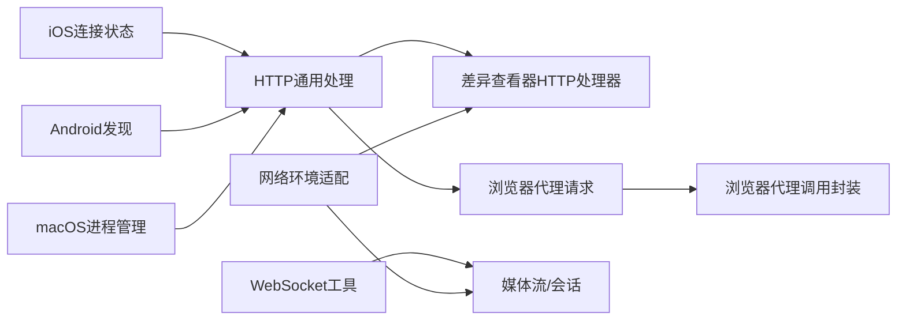

# 网络性能优化

<cite>
**本文引用的文件**
- [docs/network.md](file://docs/network.md)
- [src/infra/ws.ts](file://src/infra/ws.ts)
- [extensions/diffs/src/http.ts](file://extensions/diffs/src/http.ts)
- [src/gateway/http-common.ts](file://src/gateway/http-common.ts)
- [src/telegram/network-config.ts](file://src/telegram/network-config.ts)
- [apps/android/app/src/main/java/ai/openclaw/app/gateway/GatewayDiscovery.kt](file://apps/android/app/src/main/java/ai/openclaw/app/gateway/GatewayDiscovery.kt)
- [apps/ios/Sources/Onboarding/GatewayOnboardingView.swift](file://apps/ios/Sources/Onboarding/GatewayOnboardingView.swift)
- [apps/macos/Sources/OpenClaw/GatewayProcessManager.swift](file://apps/macos/Sources/OpenClaw/GatewayProcessManager.swift)
- [src/browser/client-fetch.ts](file://src/browser/client-fetch.ts)
- [src/node-host/invoke-browser.ts](file://src/node-host/invoke-browser.ts)
- [src/shared/usage-aggregates.ts](file://src/shared/usage-aggregates.ts)
- [extensions/voice-call/src/media-stream.ts](file://extensions/voice-call/src/media-stream.ts)
- [scripts/dev/gateway-ws-client.ts](file://scripts/dev/gateway-ws-client.ts)
- [src/agents/openai-ws-connection.ts](file://src/agents/openai-ws-connection.ts)
- [src/agents/openai-ws-stream.ts](file://src/agents/openai-ws-stream.ts)
- [src/infra/widearea-dns.ts](file://src/infra/widearea-dns.ts)
</cite>

## 目录
1. [引言](#引言)
2. [项目结构](#项目结构)
3. [核心组件](#核心组件)
4. [架构总览](#架构总览)
5. [详细组件分析](#详细组件分析)
6. [依赖关系分析](#依赖关系分析)
7. [性能考量](#性能考量)
8. [故障排查指南](#故障排查指南)
9. [结论](#结论)
10. [附录](#附录)

## 引言
本技术文档聚焦于OpenClaw在多平台与多网络环境下的网络性能优化实践，围绕WebSocket连接优化、HTTP请求性能提升、延迟与带宽优化、网关服务器网络配置、连接池与数据传输优化等主题展开。文档同时提供监控与诊断方法，并给出在局域网、广域网、移动网络等不同场景下的调优策略，帮助开发者与运维人员系统性地提升网络通信效率与稳定性。

## 项目结构
OpenClaw的网络相关能力分布于多个层次：
- 网关与控制面：HTTP安全头、速率限制、SSE、JSON响应封装等通用HTTP处理逻辑
- 插件与扩展：特定插件的HTTP服务端实现（如差异查看器）与访问控制
- 客户端与浏览器桥接：浏览器代理请求、超时与中止机制
- 平台侧发现与连接状态：Android/iOS/macOS对网关发现、连接状态展示与进程管理
- 语音/媒体流：WebSocket升级、连接池与限流、会话管理
- 网络环境适配：DNS解析族选择、IPv6/IPv4优先级、WLAN/移动网络差异
- 工具与脚本：开发用WebSocket客户端、遥测聚合

图表来源
- [src/gateway/http-common.ts:1-109](file://src/gateway/http-common.ts#L1-L109)
- [extensions/diffs/src/http.ts:1-290](file://extensions/diffs/src/http.ts#L1-L290)
- [src/browser/client-fetch.ts:278-314](file://src/browser/client-fetch.ts#L278-L314)
- [src/node-host/invoke-browser.ts:250-292](file://src/node-host/invoke-browser.ts#L250-L292)
- [src/infra/ws.ts:1-22](file://src/infra/ws.ts#L1-L22)
- [extensions/voice-call/src/media-stream.ts:302-345](file://extensions/voice-call/src/media-stream.ts#L302-L345)
- [src/telegram/network-config.ts:1-107](file://src/telegram/network-config.ts#L1-L107)
- [src/infra/widearea-dns.ts:162-199](file://src/infra/widearea-dns.ts#L162-L199)
- [scripts/dev/gateway-ws-client.ts](file://scripts/dev/gateway-ws-client.ts)
- [src/shared/usage-aggregates.ts:1-66](file://src/shared/usage-aggregates.ts#L1-L66)

章节来源
- [docs/network.md:1-55](file://docs/network.md#L1-L55)

## 核心组件
- HTTP通用处理与安全头：统一设置安全响应头、JSON/文本响应、SSE头部、错误码封装与速率限制提示
- 插件HTTP处理器：差异查看器HTTP处理器，包含远程访问控制、速率限制、CSP、缓存策略
- 浏览器代理请求：支持超时、中止信号、方法规范化、错误处理与状态回查
- WebSocket工具：原始数据到字符串转换，便于日志与调试
- 媒体会话与限流：WebSocket升级、连接池计数、按IP限流、拒绝升级与清理挂起连接
- 网络环境适配：自动选择DNS族、IPv4优先策略、广域DNS区域渲染
- 连接状态与发现：平台侧网关发现、连接状态展示、进程生命周期管理
- 遥测与聚合：延迟统计聚合、日志与指标输出

章节来源
- [src/gateway/http-common.ts:1-109](file://src/gateway/http-common.ts#L1-L109)
- [extensions/diffs/src/http.ts:1-290](file://extensions/diffs/src/http.ts#L1-L290)
- [src/browser/client-fetch.ts:278-314](file://src/browser/client-fetch.ts#L278-L314)
- [src/node-host/invoke-browser.ts:250-292](file://src/node-host/invoke-browser.ts#L250-L292)
- [src/infra/ws.ts:1-22](file://src/infra/ws.ts#L1-L22)
- [extensions/voice-call/src/media-stream.ts:302-345](file://extensions/voice-call/src/media-stream.ts#L302-L345)
- [src/telegram/network-config.ts:1-107](file://src/telegram/network-config.ts#L1-L107)
- [src/infra/widearea-dns.ts:162-199](file://src/infra/widearea-dns.ts#L162-L199)
- [apps/android/app/src/main/java/ai/openclaw/app/gateway/GatewayDiscovery.kt:46-70](file://apps/android/app/src/main/java/ai/openclaw/app/gateway/GatewayDiscovery.kt#L46-L70)
- [apps/ios/Sources/Onboarding/GatewayOnboardingView.swift:324-374](file://apps/ios/Sources/Onboarding/GatewayOnboardingView.swift#L324-L374)
- [apps/macos/Sources/OpenClaw/GatewayProcessManager.swift:126-169](file://apps/macos/Sources/OpenClaw/GatewayProcessManager.swift#L126-L169)
- [src/shared/usage-aggregates.ts:1-66](file://src/shared/usage-aggregates.ts#L1-L66)

## 架构总览
下图展示了从客户端到网关、再到浏览器代理与媒体流的关键路径，以及HTTP安全与速率限制的横切关注点。

图表来源
- [src/gateway/http-common.ts:1-109](file://src/gateway/http-common.ts#L1-L109)
- [src/browser/client-fetch.ts:278-314](file://src/browser/client-fetch.ts#L278-L314)
- [src/node-host/invoke-browser.ts:250-292](file://src/node-host/invoke-browser.ts#L250-L292)
- [src/infra/ws.ts:1-22](file://src/infra/ws.ts#L1-L22)
- [extensions/voice-call/src/media-stream.ts:302-345](file://extensions/voice-call/src/media-stream.ts#L302-L345)

## 详细组件分析

### 组件A：HTTP通用处理与安全头
- 职责：统一设置安全响应头、JSON/文本响应、SSE头部、错误封装、速率限制提示
- 关键点：避免帧嵌套风险的CSP不在此处设置；提供标准错误响应与Retry-After头
- 性能影响：减少重复设置开销；SSE长连接保持与flushHeaders有助于低延迟推送

图表来源
- [src/gateway/http-common.ts:1-109](file://src/gateway/http-common.ts#L1-L109)

章节来源
- [src/gateway/http-common.ts:1-109](file://src/gateway/http-common.ts#L1-L109)

### 组件B：差异查看器HTTP处理器
- 职责：提供差异查看器的HTTP服务端，支持本地/远程访问控制、速率限制、CSP、缓存策略
- 关键点：远程访问默认关闭；基于客户端IP的失败次数窗口化限流；资产与HTML分别服务
- 性能影响：严格的CSP与no-store缓存策略降低跨站风险；限流防止滥用导致资源耗尽

图表来源
- [extensions/diffs/src/http.ts:1-290](file://extensions/diffs/src/http.ts#L1-L290)

章节来源
- [extensions/diffs/src/http.ts:1-290](file://extensions/diffs/src/http.ts#L1-L290)

### 组件C：浏览器代理请求与超时控制
- 职责：封装浏览器代理请求，支持超时、中止、方法规范化、错误处理与状态回查
- 关键点：Promise.race结合AbortController实现超时；上游信号传播；失败时进行状态回查
- 性能影响：避免长时间阻塞；超时快速失败并提供可诊断信息

图表来源
- [src/browser/client-fetch.ts:278-314](file://src/browser/client-fetch.ts#L278-L314)
- [src/node-host/invoke-browser.ts:250-292](file://src/node-host/invoke-browser.ts#L250-L292)

章节来源
- [src/browser/client-fetch.ts:278-314](file://src/browser/client-fetch.ts#L278-L314)
- [src/node-host/invoke-browser.ts:250-292](file://src/node-host/invoke-browser.ts#L250-L292)

### 组件D：WebSocket工具与媒体流
- WebSocket工具：将RawData统一转为字符串，便于日志与调试
- 媒体会话：WebSocket升级、连接池计数、按IP限流、拒绝升级与清理挂起连接
- 性能影响：统一数据格式减少解析成本；限流与清理避免资源泄漏与拥塞

图表来源
- [src/infra/ws.ts:1-22](file://src/infra/ws.ts#L1-L22)
- [extensions/voice-call/src/media-stream.ts:302-345](file://extensions/voice-call/src/media-stream.ts#L302-L345)

章节来源
- [src/infra/ws.ts:1-22](file://src/infra/ws.ts#L1-L22)
- [extensions/voice-call/src/media-stream.ts:302-345](file://extensions/voice-call/src/media-stream.ts#L302-L345)

### 组件E：网络环境适配与广域DNS
- 网络环境适配：自动选择DNS族、IPv4优先策略，规避常见IPv6问题；支持环境变量与配置覆盖
- 广域DNS：渲染与写入DNS区域文件，序列号递增，变更检测
- 性能影响：合理的DNS族选择与优先级可显著降低连接失败与重试成本

图表来源
- [src/telegram/network-config.ts:1-107](file://src/telegram/network-config.ts#L1-L107)
- [src/infra/widearea-dns.ts:162-199](file://src/infra/widearea-dns.ts#L162-L199)

章节来源
- [src/telegram/network-config.ts:1-107](file://src/telegram/network-config.ts#L1-L107)
- [src/infra/widearea-dns.ts:162-199](file://src/infra/widearea-dns.ts#L162-L199)

### 组件F：平台侧连接状态与发现
- iOS：连接状态展示框，聚合网关与发现状态、服务器名与地址
- Android：基于NSD/DNS的网关发现，支持广域域名、状态文本、线程池
- macOS：网关进程管理，停止/刷新环境状态、Launch Agent开关
- 性能影响：清晰的状态反馈有助于用户与运维快速定位网络问题

章节来源
- [apps/ios/Sources/Onboarding/GatewayOnboardingView.swift:324-374](file://apps/ios/Sources/Onboarding/GatewayOnboardingView.swift#L324-L374)
- [apps/android/app/src/main/java/ai/openclaw/app/gateway/GatewayDiscovery.kt:46-70](file://apps/android/app/src/main/java/ai/openclaw/app/gateway/GatewayDiscovery.kt#L46-L70)
- [apps/macos/Sources/OpenClaw/GatewayProcessManager.swift:126-169](file://apps/macos/Sources/OpenClaw/GatewayProcessManager.swift#L126-L169)

### 组件G：开发与遥测工具
- 开发WebSocket客户端：用于本地联调与压力测试
- 使用量/延迟聚合：合并每日/累计延迟统计，支持p95等指标

章节来源
- [scripts/dev/gateway-ws-client.ts](file://scripts/dev/gateway-ws-client.ts)
- [src/shared/usage-aggregates.ts:1-66](file://src/shared/usage-aggregates.ts#L1-L66)

## 依赖关系分析
- HTTP通用处理被所有HTTP处理器复用，形成横切安全与错误处理
- 浏览器代理层依赖HTTP通用处理与错误封装，向上游提供一致的错误语义
- 媒体流依赖WebSocket工具与平台侧的连接状态，确保数据链路稳定
- 网络环境适配贯穿插件与通道层，保障在不同运行环境下的连通性

图表来源
- [src/gateway/http-common.ts:1-109](file://src/gateway/http-common.ts#L1-L109)
- [extensions/diffs/src/http.ts:1-290](file://extensions/diffs/src/http.ts#L1-L290)
- [src/browser/client-fetch.ts:278-314](file://src/browser/client-fetch.ts#L278-L314)
- [src/node-host/invoke-browser.ts:250-292](file://src/node-host/invoke-browser.ts#L250-L292)
- [src/infra/ws.ts:1-22](file://src/infra/ws.ts#L1-L22)
- [extensions/voice-call/src/media-stream.ts:302-345](file://extensions/voice-call/src/media-stream.ts#L302-L345)
- [src/telegram/network-config.ts:1-107](file://src/telegram/network-config.ts#L1-L107)
- [apps/ios/Sources/Onboarding/GatewayOnboardingView.swift:324-374](file://apps/ios/Sources/Onboarding/GatewayOnboardingView.swift#L324-L374)
- [apps/android/app/src/main/java/ai/openclaw/app/gateway/GatewayDiscovery.kt:46-70](file://apps/android/app/src/main/java/ai/openclaw/app/gateway/GatewayDiscovery.kt#L46-L70)
- [apps/macos/Sources/OpenClaw/GatewayProcessManager.swift:126-169](file://apps/macos/Sources/OpenClaw/GatewayProcessManager.swift#L126-L169)

## 性能考量
- WebSocket连接优化
  - 升级阶段的限流与清理挂起连接，避免资源泄漏与拥塞
  - 统一RawData到字符串转换，降低日志与调试成本
- HTTP请求性能提升
  - 统一安全头与错误封装，减少重复设置与分支判断
  - SSE长连接保持与flushHeaders，降低推送延迟
  - 插件HTTP处理器的严格CSP与缓存策略，减少跨站风险与重传
- 延迟与带宽优化
  - DNS族选择与IPv4优先策略，规避IPv6不稳定导致的重试
  - 速率限制与失败窗口化限流，防止滥用与资源耗尽
- 网关服务器网络配置
  - 默认安全头、SSE头部、错误封装与Retry-After头，统一对外接口
  - 远程访问控制与CSP，降低跨站风险
- 不同网络环境下的策略
  - 局域网：自动选择族与IPv6优先；广域网：启用IPv4优先以规避IPv6问题
  - 移动网络：结合速率限制与失败窗口化限流，避免频繁失败导致的额外流量

## 故障排查指南
- HTTP错误与速率限制
  - 检查Retry-After头与错误响应体，确认是否触发速率限制
  - 对SSE流检查keep-alive与flushHeaders是否正常
- 浏览器代理超时
  - 观察超时后是否进行状态回查，获取更详细的错误上下文
  - 确认AbortController的中止信号是否正确传播
- 媒体会话与升级
  - 查看挂起连接清理与按IP限流逻辑，确认是否存在过多并发升级
  - 检查WebSocket状态与会话有效性
- 平台侧连接状态
  - iOS/macOS状态展示框与Android发现状态，快速定位连接问题
- 网络环境
  - 检查DNS族选择与IPv4优先策略，确认是否因IPv6不稳定导致失败
  - 广域DNS区域文件是否更新成功，序列号是否递增

章节来源
- [src/gateway/http-common.ts:1-109](file://src/gateway/http-common.ts#L1-L109)
- [extensions/diffs/src/http.ts:1-290](file://extensions/diffs/src/http.ts#L1-L290)
- [src/browser/client-fetch.ts:278-314](file://src/browser/client-fetch.ts#L278-L314)
- [src/node-host/invoke-browser.ts:250-292](file://src/node-host/invoke-browser.ts#L250-L292)
- [extensions/voice-call/src/media-stream.ts:302-345](file://extensions/voice-call/src/media-stream.ts#L302-L345)
- [apps/ios/Sources/Onboarding/GatewayOnboardingView.swift:324-374](file://apps/ios/Sources/Onboarding/GatewayOnboardingView.swift#L324-L374)
- [apps/android/app/src/main/java/ai/openclaw/app/gateway/GatewayDiscovery.kt:46-70](file://apps/android/app/src/main/java/ai/openclaw/app/gateway/GatewayDiscovery.kt#L46-L70)
- [apps/macos/Sources/OpenClaw/GatewayProcessManager.swift:126-169](file://apps/macos/Sources/OpenClaw/GatewayProcessManager.swift#L126-L169)
- [src/telegram/network-config.ts:1-107](file://src/telegram/network-config.ts#L1-L107)
- [src/infra/widearea-dns.ts:162-199](file://src/infra/widearea-dns.ts#L162-L199)

## 结论
通过统一的HTTP安全头与错误封装、严格的速率限制与CSP策略、浏览器代理的超时与中止机制、WebSocket工具与媒体流的会话管理、以及针对不同网络环境的DNS族选择与IPv4优先策略，OpenClaw在网络性能优化方面形成了完整的体系。建议在生产环境中结合平台侧连接状态展示与广域DNS区域管理，持续监控延迟与带宽使用情况，按需调整速率限制与DNS策略，以获得最佳的用户体验。

## 附录
- 实用方法与工具
  - 使用开发WebSocket客户端进行本地联调与压力测试
  - 利用使用量/延迟聚合工具监控端到端延迟与吞吐
  - 结合平台侧连接状态与发现功能，快速定位网络问题