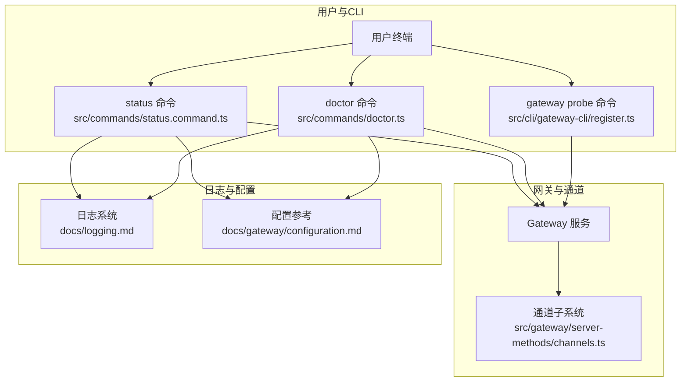
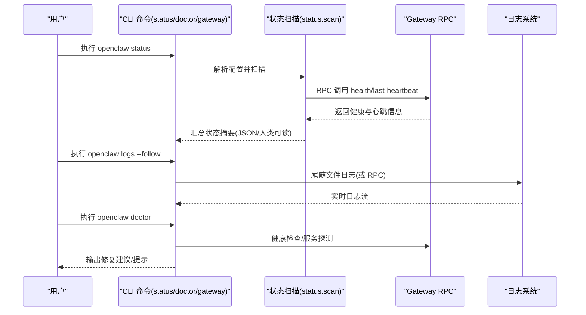
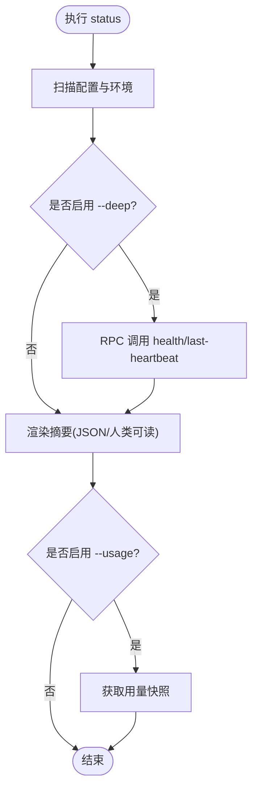
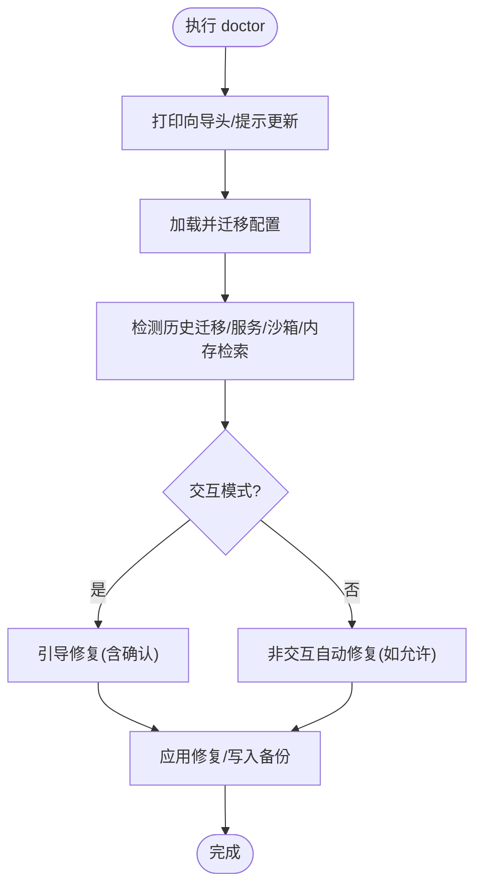
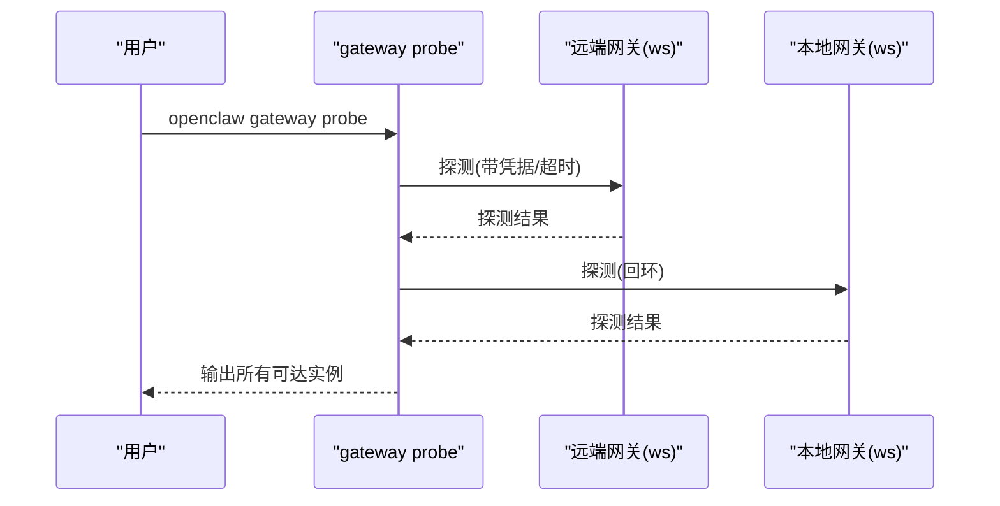
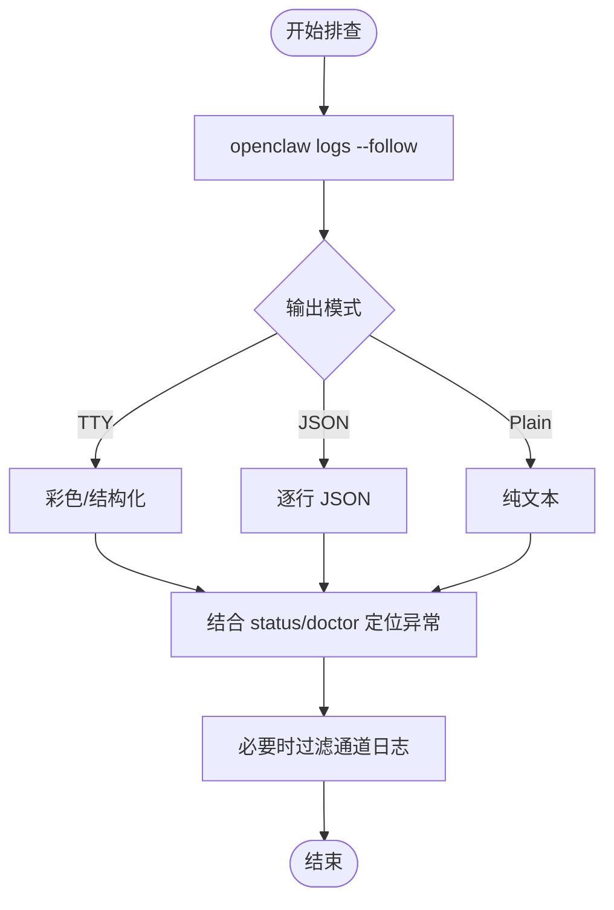
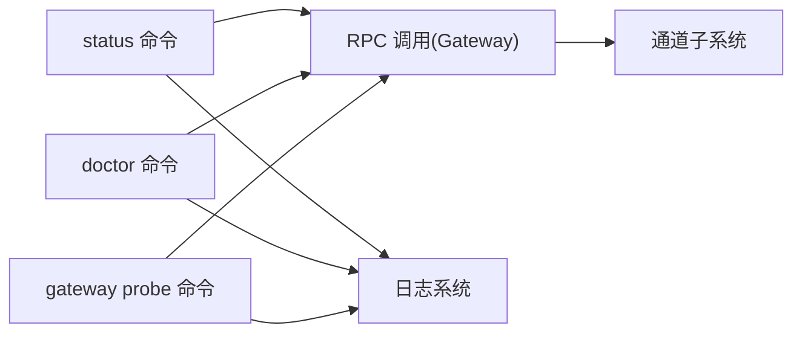

# 基础故障排除

<cite>
**本文引用的文件**
- [docs/help/troubleshooting.md](file://docs/help/troubleshooting.md)
- [docs/gateway/troubleshooting.md](file://docs/gateway/troubleshooting.md)
- [docs/cli/status.md](file://docs/cli/status.md)
- [docs/cli/doctor.md](file://docs/cli/doctor.md)
- [docs/cli/gateway.md](file://docs/cli/gateway.md)
- [docs/logging.md](file://docs/logging.md)
- [docs/cli/logs.md](file://docs/cli/logs.md)
- [src/commands/status.command.ts](file://src/commands/status.command.ts)
- [src/commands/status.scan.ts](file://src/commands/status.scan.ts)
- [src/commands/doctor.ts](file://src/commands/doctor.ts)
- [src/gateway/server-methods/channels.ts](file://src/gateway/server-methods/channels.ts)
- [src/cli/gateway-cli/register.ts](file://src/cli/gateway-cli/register.ts)
- [docs/gateway/configuration.md](file://docs/gateway/configuration.md)
</cite>

## 目录
1. [简介](#简介)
2. [项目结构](#项目结构)
3. [核心组件](#核心组件)
4. [架构总览](#架构总览)
5. [详细组件分析](#详细组件分析)
6. [依赖分析](#依赖分析)
7. [性能考虑](#性能考虑)
8. [故障排除指南](#故障排除指南)
9. [结论](#结论)
10. [附录](#附录)

## 简介
本指南面向首次接触 OpenClaw 的用户，提供“从零开始”的基础故障排除流程与工具使用方法。围绕 status、gateway probe、doctor 等核心诊断命令，帮助您快速判断系统健康状况、识别异常信号，并给出可执行的排查清单与日志分析建议。内容兼顾初学者与有一定经验的用户，既解释命令用途，也说明如何解读输出、如何进行权限与网络连通性检查。

## 项目结构
OpenClaw 的故障排除能力由“CLI 文档 + 命令实现 + 网关 RPC 能力 + 日志系统”共同构成。下图展示与故障排除直接相关的关键模块与交互路径：

**图表来源**
- [src/commands/status.command.ts:67-200](file://src/commands/status.command.ts#L67-L200)
- [src/commands/doctor.ts:73-200](file://src/commands/doctor.ts#L73-L200)
- [src/cli/gateway-cli/register.ts:192-208](file://src/cli/gateway-cli/register.ts#L192-L208)
- [src/gateway/server-methods/channels.ts:69-112](file://src/gateway/server-methods/channels.ts#L69-L112)
- [docs/logging.md:1-353](file://docs/logging.md#L1-L353)
- [docs/gateway/configuration.md:1-200](file://docs/gateway/configuration.md#L1-L200)

**章节来源**
- [docs/help/troubleshooting.md:13-299](file://docs/help/troubleshooting.md#L13-L299)
- [docs/gateway/troubleshooting.md:14-380](file://docs/gateway/troubleshooting.md#L14-L380)

## 核心组件
- status 命令：用于快速诊断通道与会话健康、获取使用快照、显示网关与节点服务状态概览。支持 --all、--deep、--usage 等参数，适合“一屏看全局”。
- doctor 命令：健康检查与引导式修复，自动检测配置漂移、服务状态、沙箱可用性、内存检索准备情况等，并在交互模式下提供修复建议。
- gateway probe 命令：调试型探测，同时探测远端与本地网关，支持 SSH 隧道直连，便于跨环境定位连接问题。
- 日志系统：提供 CLI 实时尾随、控制界面日志页、通道专用日志过滤、日志级别与脱敏策略配置等，是定位问题的核心依据。

**章节来源**
- [docs/cli/status.md:9-29](file://docs/cli/status.md#L9-L29)
- [docs/cli/doctor.md:9-46](file://docs/cli/doctor.md#L9-L46)
- [docs/cli/gateway.md:115-138](file://docs/cli/gateway.md#L115-L138)
- [docs/logging.md:40-124](file://docs/logging.md#L40-L124)

## 架构总览
下图展示一次典型“快速诊断”的调用链路与数据流：

**图表来源**
- [src/commands/status.command.ts:67-200](file://src/commands/status.command.ts#L67-L200)
- [src/commands/status.scan.ts:75-108](file://src/commands/status.scan.ts#L75-L108)
- [docs/logging.md:40-73](file://docs/logging.md#L40-L73)

**章节来源**
- [docs/help/troubleshooting.md:15-299](file://docs/help/troubleshooting.md#L15-L299)

## 详细组件分析

### status 命令
- 功能要点
  - 支持 --all 展示完整报告；--deep 触发网关健康探测与最近心跳查询；--usage 获取用量快照。
  - 输出包含网关模式、URL 来源、可达性、连接延迟、更新通道与版本信息等。
  - 对于多智能体场景，会包含每个代理的会话存储状态。
- 正常状态特征
  - 网关模式与 URL 合理；RPC 探测返回成功；最近心跳存在且时间合理；通道状态为 connected/ready；无明显授权错误。
- 异常信号识别
  - 网关不可达或 RPC 失败；通道状态异常（如 pending、disconnected）；日志中出现 pairing/allowlist/blocked 等关键词；用量快照为空或异常。

**图表来源**
- [src/commands/status.command.ts:67-200](file://src/commands/status.command.ts#L67-L200)
- [src/commands/status.scan.ts:75-108](file://src/commands/status.scan.ts#L75-L108)

**章节来源**
- [docs/cli/status.md:9-29](file://docs/cli/status.md#L9-L29)
- [src/commands/status.command.ts:67-200](file://src/commands/status.command.ts#L67-L200)

### doctor 命令
- 功能要点
  - 在交互模式下提供引导式修复；非交互/无 TTY 场景自动跳过提示。
  - 检测并修复历史状态迁移、服务配置漂移、沙箱镜像可用性、UI 协议新鲜度、内存检索准备情况等。
  - 针对 macOS launchctl 环境变量覆盖、Docker 可用性、旧版 cron 存储等发出高信号警告与修复建议。
- 正常状态特征
  - 无阻塞性配置/服务问题；必要组件可用；未触发修复流程。
- 异常信号识别
  - 提示需要生成/旋转网关令牌；需要修复 cron 存储；沙箱模式但 Docker 不可用；macOS 环境变量覆盖导致持续 unauthorized。

**图表来源**
- [src/commands/doctor.ts:73-200](file://src/commands/doctor.ts#L73-L200)
- [docs/cli/doctor.md:26-46](file://docs/cli/doctor.md#L26-L46)

**章节来源**
- [docs/cli/doctor.md:9-46](file://docs/cli/doctor.md#L9-L46)
- [src/commands/doctor.ts:73-200](file://src/commands/doctor.ts#L73-L200)

### gateway probe 命令
- 功能要点
  - “调试一切”型命令，总是探测已配置的远程网关与本地回环地址，支持 SSH 隧道直达远端网关。
  - 输出机器可读 JSON 或人类可读格式，便于脚本化与手工排查。
- 正常状态特征
  - 至少一个可达的网关实例；URL 与凭据匹配；无连接超时或鉴权失败。
- 异常信号识别
  - 仅远端可达但本地不可达；凭据不匹配；SSH 隧道失败；端口冲突或监听被占用。

**图表来源**
- [src/cli/gateway-cli/register.ts:192-208](file://src/cli/gateway-cli/register.ts#L192-L208)
- [docs/cli/gateway.md:115-138](file://docs/cli/gateway.md#L115-L138)

**章节来源**
- [docs/cli/gateway.md:115-138](file://docs/cli/gateway.md#L115-L138)
- [src/cli/gateway-cli/register.ts:192-208](file://src/cli/gateway-cli/register.ts#L192-L208)

### 日志查看与分析
- 实时尾随
  - 使用 openclaw logs --follow 实时查看网关日志；支持 --json、--plain、--no-color 等输出模式。
  - 控制界面的 Logs 标签页同样基于同一日志源。
- 日志位置与级别
  - 默认滚动文件位于 /tmp/openclaw/openclaw-YYYY-MM-DD.log；可通过配置覆盖。
  - 支持 file/console 双通道级别控制；可通过环境变量或 CLI 参数临时提升级别。
- 通道专用日志
  - 使用 openclaw channels logs --channel <provider> 过滤特定通道活动。
- 常见信号定位
  - 设备身份/签名/nonce 相关错误、AUTH_TOKEN_MISMATCH、PAIRING_REQUIRED、missing_scope/401/403 等。

**图表来源**
- [docs/logging.md:40-124](file://docs/logging.md#L40-L124)
- [docs/cli/logs.md:9-29](file://docs/cli/logs.md#L9-L29)

**章节来源**
- [docs/logging.md:1-353](file://docs/logging.md#L1-L353)
- [docs/cli/logs.md:9-29](file://docs/cli/logs.md#L9-L29)

## 依赖分析
- 命令到网关的依赖
  - status 在 --deep 模式下通过 RPC 调用 health 与 last-heartbeat，依赖网关运行与鉴权正确。
  - doctor 通过健康检查与服务探测辅助定位问题根因。
  - gateway probe 直接探测网关可达性，独立于 status 的高层汇总。
- 命令到通道的依赖
  - channels.status 支持 probe 参数，用于实时探测通道连接与账户状态。
- 命令到日志系统的依赖
  - 三类命令均依赖日志系统进行问题定位与证据收集。

**图表来源**
- [src/commands/status.command.ts:67-200](file://src/commands/status.command.ts#L67-L200)
- [src/commands/doctor.ts:73-200](file://src/commands/doctor.ts#L73-L200)
- [src/cli/gateway-cli/register.ts:192-208](file://src/cli/gateway-cli/register.ts#L192-L208)
- [src/gateway/server-methods/channels.ts:69-112](file://src/gateway/server-methods/channels.ts#L69-L112)

**章节来源**
- [src/commands/status.command.ts:67-200](file://src/commands/status.command.ts#L67-L200)
- [src/commands/doctor.ts:73-200](file://src/commands/doctor.ts#L73-L200)
- [src/gateway/server-methods/channels.ts:69-112](file://src/gateway/server-methods/channels.ts#L69-L112)

## 性能考虑
- 适度使用 --deep：健康探测与最近心跳查询会增加 RPC 调用次数，建议在定位阶段使用，日常巡检可关闭。
- 日志级别控制：在问题定位阶段提升级别有助于捕获细节，但会带来额外 IO；定位完成后恢复默认级别。
- 通道探测：channels status --probe 会并发探测多个通道，注意网络抖动与通道限流影响。

[本节为通用指导，无需具体文件分析]

## 故障排除指南

### 快速诊断清单（按顺序执行）
- 打开终端，依次执行以下命令，观察输出与日志：
  - openclaw status
  - openclaw status --all
  - openclaw gateway probe
  - openclaw gateway status
  - openclaw doctor
  - openclaw channels status --probe
  - openclaw logs --follow
- 判断标准
  - status：通道列表与授权信息无明显错误；网关模式与 URL 合理；最近心跳存在。
  - gateway status：Runtime: running；RPC probe: ok。
  - doctor：无阻塞性配置/服务问题。
  - channels status --probe：各通道显示 connected/ready。
  - logs --follow：有稳定活动，无重复致命错误。

**章节来源**
- [docs/help/troubleshooting.md:15-36](file://docs/help/troubleshooting.md#L15-L36)
- [docs/gateway/troubleshooting.md:14-31](file://docs/gateway/troubleshooting.md#L14-L31)

### 常见症状与初步排查步骤
- 无回复（No replies）
  - 检查通道连接与配对状态、群组提及要求、发送方白名单/屏蔽。
  - 命令参考：status、gateway status、channels status --probe、pairing list、logs --follow。
  - 日志关键词：drop guild message (mention required)、pairing request、blocked/allowlist。
- 控制界面无法连接
  - 校验 URL、鉴权模式与安全上下文；关注设备身份/签名/nonce 相关错误。
  - 命令参考：gateway status、status、logs --follow、doctor、gateway status --json。
  - 日志关键词：device identity required、AUTH_TOKEN_MISMATCH、device nonce mismatch/signature invalid、gateway connect failed。
- 网关未启动或服务未运行
  - 检查服务状态、配置与端口冲突；必要时重新安装/重启服务元数据。
  - 命令参考：gateway status、status、logs --follow、doctor、gateway status --deep。
  - 日志关键词：Gateway start blocked、refusing to bind、another gateway instance is already listening/EADDRINUSE。
- 通道已连接但消息不流动
  - 检查 DM/群组策略、权限与通道 API 权限范围。
  - 命令参考：channels status --probe、pairing list、status --deep、logs --follow、config get channels。
  - 日志关键词：mention required、pairing/pending、missing_scope/not_in_channel/Forbidden/401/403。
- Cron/心跳未触发或未送达
  - 检查调度器状态与交付目标；关注静默时段/队列繁忙/未知账号等跳过原因。
  - 命令参考：cron status、cron list、cron runs --id <jobId> --limit 20、system heartbeat last、logs --follow。
  - 日志关键词：scheduler disabled、timer tick failed、heartbeat skipped(reason=quiet-hours/requests-in-flight/alerts-disabled)、unknown accountId。
- 节点配对但工具执行失败
  - 检查前台运行、操作系统权限、执行审批与允许列表。
  - 命令参考：nodes status、nodes describe、approvals get --node、logs --follow、status。
  - 日志关键词：NODE_BACKGROUND_UNAVAILABLE、*_PERMISSION_REQUIRED、SYSTEM_RUN_DENIED: approval required/allowlist miss。
- 浏览器工具失败
  - 检查浏览器可执行路径、CDP 配置与扩展中继标签页连接。
  - 命令参考：browser status、browser start、browser profiles、logs --follow、doctor。
  - 日志关键词：Failed to start Chrome CDP on port、browser.executablePath not found、extension relay is running but no tab is connected、attachOnly is enabled ... not reachable。

**章节来源**
- [docs/gateway/troubleshooting.md:61-380](file://docs/gateway/troubleshooting.md#L61-L380)
- [docs/help/troubleshooting.md:91-299](file://docs/help/troubleshooting.md#L91-L299)

### 如何解读命令输出
- status
  - 正常：网关模式与 URL 合理；RPC 探测成功；通道 connected/ready；无授权错误。
  - 异常：网关不可达/RPC 失败；通道状态异常；日志中出现 pairing/allowlist/blocked 等。
- doctor
  - 正常：无阻塞性问题；必要组件可用；未触发修复。
  - 异常：提示生成/旋转令牌；修复 cron 存储；沙箱模式但 Docker 不可用；macOS 环境变量覆盖导致 unauthorized。
- gateway probe
  - 正常：至少一个可达实例；URL/凭据匹配。
  - 异常：仅远端可达；凭据不匹配；SSH 隧道失败；端口冲突。

**章节来源**
- [docs/cli/status.md:9-29](file://docs/cli/status.md#L9-L29)
- [docs/cli/doctor.md:9-46](file://docs/cli/doctor.md#L9-L46)
- [docs/cli/gateway.md:115-138](file://docs/cli/gateway.md#L115-L138)

### 日志查看与分析基本方法
- 实时尾随：openclaw logs --follow；必要时使用 --json 获取结构化事件。
- 控制界面：打开 Logs 标签页，与 CLI 同步。
- 通道过滤：openclaw channels logs --channel <provider>。
- 级别与脱敏：通过 logging.consoleLevel 与 logging.level 调整；console 脱敏不影响文件日志。
- 关键信号：设备身份/签名/nonce、AUTH_TOKEN_MISMATCH、PAIRING_REQUIRED、missing_scope/401/403 等。

**章节来源**
- [docs/logging.md:40-141](file://docs/logging.md#L40-L141)
- [docs/cli/logs.md:9-29](file://docs/cli/logs.md#L9-L29)

### 权限检查、网络连通性验证与服务状态确认
- 权限检查
  - 节点工具：确保前台运行、授予摄像头/麦克风/位置/屏幕等权限；执行审批与允许列表状态正常。
  - 浏览器：校验浏览器可执行路径与 CDP 可达性；扩展中继需有已连接标签页。
- 网络连通性
  - 使用 gateway probe 验证远端与本地网关可达；必要时通过 SSH 隧道直达。
  - 检查端口绑定与鉴权配置，避免 refusing to bind 与 EADDRINUSE。
- 服务状态
  - 通过 gateway status 查看服务生命周期与 RPC 探测；doctor 辅助发现配置漂移与服务异常。

**章节来源**
- [docs/gateway/troubleshooting.md:152-380](file://docs/gateway/troubleshooting.md#L152-L380)
- [docs/cli/gateway.md:115-138](file://docs/cli/gateway.md#L115-L138)
- [docs/gateway/configuration.md:61-73](file://docs/gateway/configuration.md#L61-L73)

## 结论
通过“status → gateway probe → doctor → channels status --probe → logs --follow”的标准流程，您可以快速建立对系统健康的整体认知，并将问题定位到网关、通道、节点或浏览器等具体层面。配合日志系统与配置参考，绝大多数基础问题都能在短时间内得到修复或缓解。建议将此流程固化为日常巡检与应急处置的标准动作。

[本节为总结性内容，无需具体文件分析]

## 附录

### 命令与输出速查
- openclaw status：通道与会话健康、网关与节点状态概览；--all/--deep/--usage。
- openclaw doctor：健康检查与引导式修复；--repair/--deep。
- openclaw gateway probe：调试型探测；支持 SSH 隧道。
- openclaw logs：实时尾随网关日志；--json/--follow/--local-time。
- openclaw channels status --probe：通道连接与账户状态探测。

**章节来源**
- [docs/cli/status.md:9-29](file://docs/cli/status.md#L9-L29)
- [docs/cli/doctor.md:9-46](file://docs/cli/doctor.md#L9-L46)
- [docs/cli/gateway.md:115-138](file://docs/cli/gateway.md#L115-L138)
- [docs/cli/logs.md:9-29](file://docs/cli/logs.md#L9-L29)