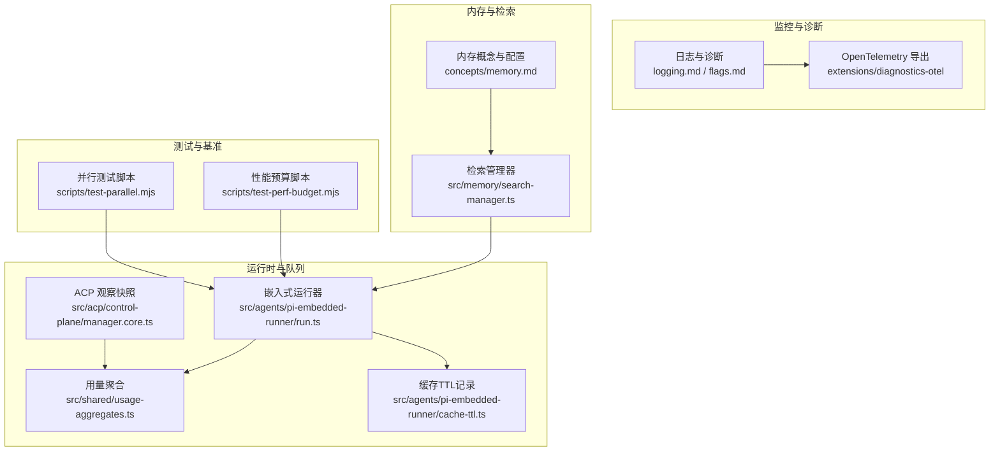
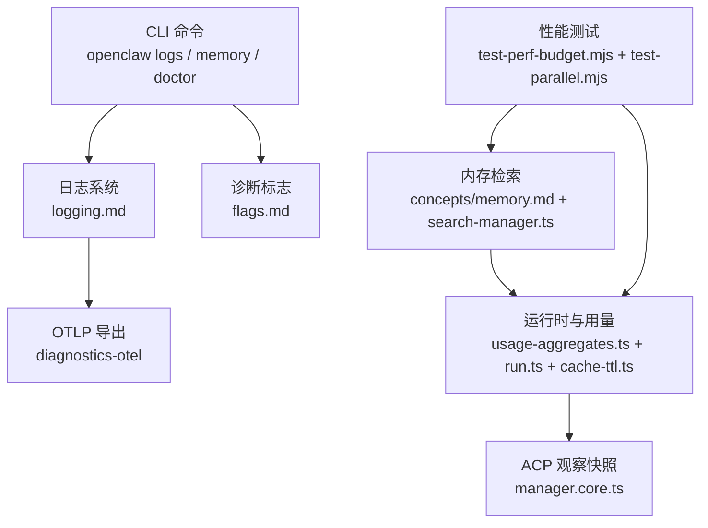
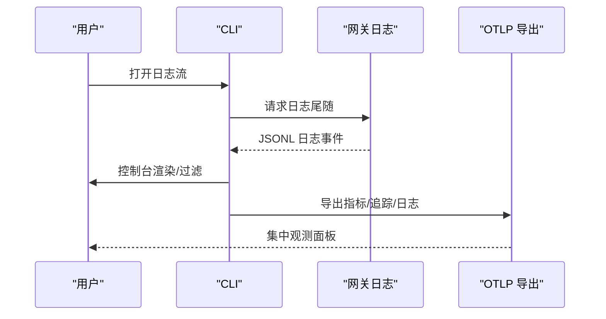
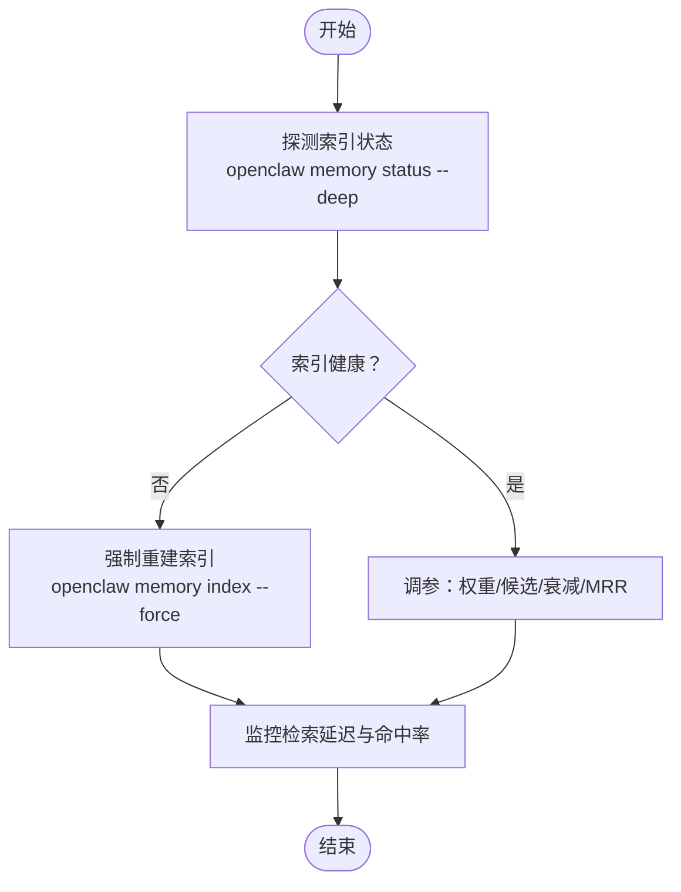
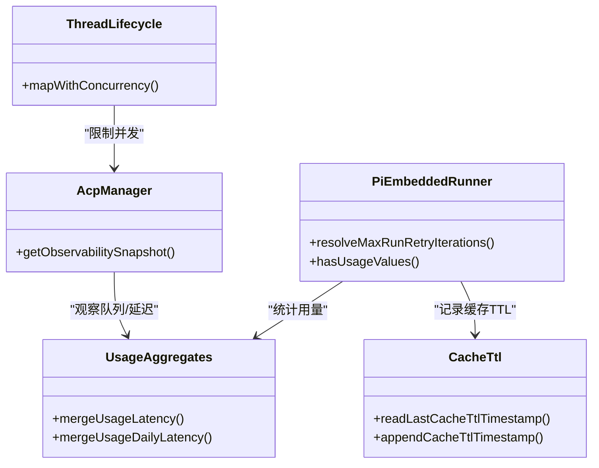
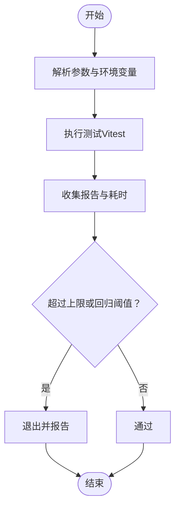
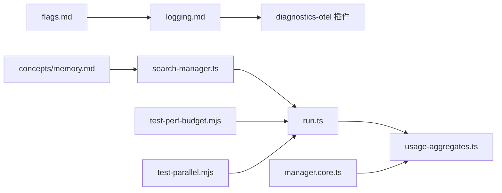

# 性能问题诊断

<cite>
**本文引用的文件**
- [docs/diagnostics/flags.md](file://docs/diagnostics/flags.md)
- [docs/help/troubleshooting.md](file://docs/help/troubleshooting.md)
- [docs/gateway/troubleshooting.md](file://docs/gateway/troubleshooting.md)
- [docs/logging.md](file://docs/logging.md)
- [docs/concepts/memory.md](file://docs/concepts/memory.md)
- [docs/cli/memory.md](file://docs/cli/memory.md)
- [scripts/test-perf-budget.mjs](file://scripts/test-perf-budget.mjs)
- [scripts/test-parallel.mjs](file://scripts/test-parallel.mjs)
- [src/shared/usage-aggregates.ts](file://src/shared/usage-aggregates.ts)
- [src/agents/pi-embedded-runner/run.ts](file://src/agents/pi-embedded-runner/run.ts)
- [src/agents/pi-embedded-runner/cache-ttl.ts](file://src/agents/pi-embedded-runner/cache-ttl.ts)
- [src/memory/search-manager.ts](file://src/memory/search-manager.ts)
- [src/discord/monitor/thread-bindings.lifecycle.ts](file://src/discord/monitor/thread-bindings.lifecycle.ts)
- [src/acp/control-plane/manager.core.ts](file://src/acp/control-plane/manager.core.ts)
- [extensions/diagnostics-otel/src/index.ts](file://extensions/diagnostics-otel/src/index.ts)
</cite>

## 目录
1. [简介](#简介)
2. [项目结构](#项目结构)
3. [核心组件](#核心组件)
4. [架构总览](#架构总览)
5. [详细组件分析](#详细组件分析)
6. [依赖关系分析](#依赖关系分析)
7. [性能考量](#性能考量)
8. [故障排查指南](#故障排查指南)
9. [结论](#结论)
10. [附录](#附录)

## 简介
本指南面向OpenClaw在实际运行中遇到的性能问题，聚焦以下关键场景：内存使用异常（增长过快、回收不及时）、CPU占用过高（并发与锁竞争）、响应延迟（队列堆积、模型调用耗时、I/O阻塞）。文档提供可操作的诊断流程、监控工具使用方法、资源消耗分析与瓶颈定位技术，并给出内存泄漏检测、缓存优化、并发控制等调优策略，以及系统资源监控、性能基准测试与容量规划建议。

## 项目结构
OpenClaw通过“网关-通道-节点-插件”的分层架构运行，性能相关能力主要分布在：
- 日志与诊断：日志配置、诊断标志、OpenTelemetry导出
- 内存与检索：本地/向量化索引、缓存与回收、会话压缩前写入
- 运行时与队列：并发限制、观察快照、重试预算
- 基准与测试：性能预算脚本、并行测试脚本

图表来源
- [docs/logging.md:142-353](file://docs/logging.md#L142-L353)
- [docs/diagnostics/flags.md:13-92](file://docs/diagnostics/flags.md#L13-L92)
- [docs/concepts/memory.md:92-440](file://docs/concepts/memory.md#L92-L440)
- [src/memory/search-manager.ts:239-252](file://src/memory/search-manager.ts#L239-L252)
- [src/shared/usage-aggregates.ts:32-66](file://src/shared/usage-aggregates.ts#L32-L66)
- [src/agents/pi-embedded-runner/run.ts:121-155](file://src/agents/pi-embedded-runner/run.ts#L121-L155)
- [src/agents/pi-embedded-runner/cache-ttl.ts:38-76](file://src/agents/pi-embedded-runner/cache-ttl.ts#L38-L76)
- [src/acp/control-plane/manager.core.ts:121-151](file://src/acp/control-plane/manager.core.ts#L121-L151)
- [scripts/test-perf-budget.mjs:1-128](file://scripts/test-perf-budget.mjs#L1-L128)
- [scripts/test-parallel.mjs:243-275](file://scripts/test-parallel.mjs#L243-L275)

章节来源
- [docs/logging.md:10-353](file://docs/logging.md#L10-L353)
- [docs/diagnostics/flags.md:9-92](file://docs/diagnostics/flags.md#L9-L92)
- [docs/concepts/memory.md:9-800](file://docs/concepts/memory.md#L9-L800)
- [src/memory/search-manager.ts:239-252](file://src/memory/search-manager.ts#L239-L252)
- [src/shared/usage-aggregates.ts:32-66](file://src/shared/usage-aggregates.ts#L32-L66)
- [src/agents/pi-embedded-runner/run.ts:121-155](file://src/agents/pi-embedded-runner/run.ts#L121-L155)
- [src/agents/pi-embedded-runner/cache-ttl.ts:38-76](file://src/agents/pi-embedded-runner/cache-ttl.ts#L38-L76)
- [src/acp/control-plane/manager.core.ts:121-151](file://src/acp/control-plane/manager.core.ts#L121-L151)
- [scripts/test-perf-budget.mjs:1-128](file://scripts/test-perf-budget.mjs#L1-L128)
- [scripts/test-parallel.mjs:243-275](file://scripts/test-parallel.mjs#L243-L275)

## 核心组件
- 日志与诊断：支持文件日志、控制台输出、JSON模式、敏感信息脱敏；支持诊断标志与OpenTelemetry导出，便于采集指标、追踪与日志。
- 内存与检索：默认以Markdown为源，支持向量+BM25混合检索、嵌入缓存、sqlite-vec加速、会话记忆索引、自动预压缩写入等。
- 运行时与用量：用量聚合（计数/均值/最小/最大/p95）用于统计与趋势分析；运行器具备重试预算与缓存TTL记录；ACP提供运行时观察快照（活跃会话、队列深度、平均/最大延迟、错误分布）。
- 测试与基准：性能预算脚本对测试整体墙钟时间进行上限与回归阈值检查；并行测试脚本根据主机负载动态调整工作线程数。

章节来源
- [docs/logging.md:100-353](file://docs/logging.md#L100-L353)
- [docs/concepts/memory.md:92-768](file://docs/concepts/memory.md#L92-L768)
- [src/shared/usage-aggregates.ts:32-66](file://src/shared/usage-aggregates.ts#L32-L66)
- [src/agents/pi-embedded-runner/run.ts:121-155](file://src/agents/pi-embedded-runner/run.ts#L121-L155)
- [src/agents/pi-embedded-runner/cache-ttl.ts:38-76](file://src/agents/pi-embedded-runner/cache-ttl.ts#L38-L76)
- [src/acp/control-plane/manager.core.ts:121-151](file://src/acp/control-plane/manager.core.ts#L121-L151)
- [scripts/test-perf-budget.mjs:61-128](file://scripts/test-perf-budget.mjs#L61-L128)
- [scripts/test-parallel.mjs:243-275](file://scripts/test-parallel.mjs#L243-L275)

## 架构总览
下图展示性能相关模块之间的交互：日志与诊断贯穿全链路；内存子系统负责检索与索引；运行时与用量模块提供统计与观察；测试脚本验证性能基线。

图表来源
- [docs/logging.md:142-353](file://docs/logging.md#L142-L353)
- [docs/diagnostics/flags.md:13-92](file://docs/diagnostics/flags.md#L13-L92)
- [docs/concepts/memory.md:92-440](file://docs/concepts/memory.md#L92-L440)
- [src/memory/search-manager.ts:239-252](file://src/memory/search-manager.ts#L239-L252)
- [src/shared/usage-aggregates.ts:32-66](file://src/shared/usage-aggregates.ts#L32-L66)
- [src/agents/pi-embedded-runner/run.ts:121-155](file://src/agents/pi-embedded-runner/run.ts#L121-L155)
- [src/agents/pi-embedded-runner/cache-ttl.ts:38-76](file://src/agents/pi-embedded-runner/cache-ttl.ts#L38-L76)
- [src/acp/control-plane/manager.core.ts:121-151](file://src/acp/control-plane/manager.core.ts#L121-L151)
- [scripts/test-perf-budget.mjs:61-128](file://scripts/test-perf-budget.mjs#L61-L128)
- [scripts/test-parallel.mjs:243-275](file://scripts/test-parallel.mjs#L243-L275)

## 详细组件分析

### 组件A：日志与诊断（定位问题范围）
- 使用方式
  - 文件日志：默认滚动文件路径，可通过配置覆盖；支持JSONL格式，便于解析与导出。
  - 控制台输出：TTY友好、紧凑或JSON模式；可按级别过滤。
  - 敏感信息脱敏：可按工具摘要脱敏，不影响文件日志。
  - 诊断标志：按子系统启用细粒度调试日志，避免全局提升日志级别。
  - OpenTelemetry：支持OTLP/HTTP导出指标、追踪与日志，便于集中观测。
- 适用场景
  - 快速定位网络/通道异常、认证失败、服务不可达、队列堆积、会话卡住等。
  - 结合“首60秒命令阶梯”与“决策树”快速缩小范围。
- 关键命令
  - openclaw logs --follow
  - openclaw doctor
  - openclaw gateway status / channels status --probe

图表来源
- [docs/logging.md:40-122](file://docs/logging.md#L40-L122)
- [docs/logging.md:142-353](file://docs/logging.md#L142-L353)
- [docs/diagnostics/flags.md:13-92](file://docs/diagnostics/flags.md#L13-L92)
- [docs/help/troubleshooting.md:17-36](file://docs/help/troubleshooting.md#L17-L36)
- [docs/gateway/troubleshooting.md:14-31](file://docs/gateway/troubleshooting.md#L14-L31)

章节来源
- [docs/logging.md:100-353](file://docs/logging.md#L100-L353)
- [docs/diagnostics/flags.md:9-92](file://docs/diagnostics/flags.md#L9-L92)
- [docs/help/troubleshooting.md:68-299](file://docs/help/troubleshooting.md#L68-L299)
- [docs/gateway/troubleshooting.md:14-380](file://docs/gateway/troubleshooting.md#L14-L380)

### 组件B：内存与检索（内存使用异常、检索延迟）
- 概念要点
  - 默认以Markdown为源，每日/长期记忆分层存储；支持自动预压缩写入，减少上下文膨胀。
  - 向量+BM25混合检索，可选MMR多样性与时间衰减；sqlite-vec加速向量距离计算。
  - 支持会话记忆索引、嵌入缓存、QMD后端（实验性）。
- 诊断与调优
  - 检查索引状态与可用性：openclaw memory status --deep
  - 强制重建索引：openclaw memory index --force
  - 调整权重/候选倍数/衰减半衰期/MRR参数，平衡召回与多样性。
  - 在高负载下关注sqlite-vec扩展是否可用，必要时降级回JS相似度。
- 缓存与回收
  - 搜索管理器对缓存条目有回收保护，避免重复关闭；注意缓存键构建稳定性。
  - 嵌入缓存大小与条目上限可配置，防止索引重建反复嵌入。

图表来源
- [docs/cli/memory.md:19-67](file://docs/cli/memory.md#L19-L67)
- [docs/concepts/memory.md:92-768](file://docs/concepts/memory.md#L92-L768)
- [src/memory/search-manager.ts:239-252](file://src/memory/search-manager.ts#L239-L252)

章节来源
- [docs/cli/memory.md:9-67](file://docs/cli/memory.md#L9-L67)
- [docs/concepts/memory.md:9-800](file://docs/concepts/memory.md#L9-L800)
- [src/memory/search-manager.ts:239-252](file://src/memory/search-manager.ts#L239-L252)

### 组件C：运行时与用量（CPU占用过高、响应延迟）
- 用量聚合
  - 提供计数、求和、最小/最大、p95等聚合，便于统计与趋势分析。
- 运行器与重试预算
  - 运行器内置重试迭代上限，避免无限重试导致CPU飙升。
  - 记录缓存TTL时间戳，辅助定位缓存失效与回源频率。
- ACP观察快照
  - 活跃会话数、空闲TTL、最近驱逐时间、队列深度、平均/最大延迟、错误码分布。
- 并发控制
  - Discord线程绑定生命周期中限制启动阶段并发，避免大规模绑定造成探针风暴。

图表来源
- [src/shared/usage-aggregates.ts:32-66](file://src/shared/usage-aggregates.ts#L32-L66)
- [src/agents/pi-embedded-runner/run.ts:121-155](file://src/agents/pi-embedded-runner/run.ts#L121-L155)
- [src/agents/pi-embedded-runner/cache-ttl.ts:38-76](file://src/agents/pi-embedded-runner/cache-ttl.ts#L38-L76)
- [src/acp/control-plane/manager.core.ts:121-151](file://src/acp/control-plane/manager.core.ts#L121-L151)
- [src/discord/monitor/thread-bindings.lifecycle.ts:45-81](file://src/discord/monitor/thread-bindings.lifecycle.ts#L45-L81)

章节来源
- [src/shared/usage-aggregates.ts:32-66](file://src/shared/usage-aggregates.ts#L32-L66)
- [src/agents/pi-embedded-runner/run.ts:121-155](file://src/agents/pi-embedded-runner/run.ts#L121-L155)
- [src/agents/pi-embedded-runner/cache-ttl.ts:38-76](file://src/agents/pi-embedded-runner/cache-ttl.ts#L38-L76)
- [src/acp/control-plane/manager.core.ts:121-151](file://src/acp/control-plane/manager.core.ts#L121-L151)
- [src/discord/monitor/thread-bindings.lifecycle.ts:45-81](file://src/discord/monitor/thread-bindings.lifecycle.ts#L45-L81)

### 组件D：性能基准与测试（回归与容量）
- 性能预算脚本
  - 对测试运行的墙钟时间进行上限与回归阈值检查，支持从环境变量读取配置。
- 并行测试脚本
  - 根据主机CPU与负载动态调整工作线程数，极端负载下降低并发，保证稳定性。

图表来源
- [scripts/test-perf-budget.mjs:15-128](file://scripts/test-perf-budget.mjs#L15-L128)
- [scripts/test-parallel.mjs:243-275](file://scripts/test-parallel.mjs#L243-L275)

章节来源
- [scripts/test-perf-budget.mjs:1-128](file://scripts/test-perf-budget.mjs#L1-L128)
- [scripts/test-parallel.mjs:243-275](file://scripts/test-parallel.mjs#L243-L275)

## 依赖关系分析
- 日志与诊断依赖于配置项与环境变量，OTLP导出依赖插件启用与端点配置。
- 内存检索依赖sqlite-vec扩展可用性；当不可用时自动降级。
- 运行时用量聚合被ACP观察快照与运行器共享使用，形成统一的统计口径。
- 测试脚本独立于运行时，但其结果可用于指导容量规划与阈值设定。

图表来源
- [docs/logging.md:142-353](file://docs/logging.md#L142-L353)
- [docs/diagnostics/flags.md:13-92](file://docs/diagnostics/flags.md#L13-L92)
- [docs/concepts/memory.md:92-440](file://docs/concepts/memory.md#L92-L440)
- [src/memory/search-manager.ts:239-252](file://src/memory/search-manager.ts#L239-L252)
- [src/agents/pi-embedded-runner/run.ts:121-155](file://src/agents/pi-embedded-runner/run.ts#L121-L155)
- [src/shared/usage-aggregates.ts:32-66](file://src/shared/usage-aggregates.ts#L32-L66)
- [src/acp/control-plane/manager.core.ts:121-151](file://src/acp/control-plane/manager.core.ts#L121-L151)
- [scripts/test-perf-budget.mjs:61-128](file://scripts/test-perf-budget.mjs#L61-L128)
- [scripts/test-parallel.mjs:243-275](file://scripts/test-parallel.mjs#L243-L275)

章节来源
- [docs/logging.md:100-353](file://docs/logging.md#L100-L353)
- [docs/diagnostics/flags.md:9-92](file://docs/diagnostics/flags.md#L9-L92)
- [docs/concepts/memory.md:92-768](file://docs/concepts/memory.md#L92-L768)
- [src/memory/search-manager.ts:239-252](file://src/memory/search-manager.ts#L239-L252)
- [src/shared/usage-aggregates.ts:32-66](file://src/shared/usage-aggregates.ts#L32-L66)
- [src/agents/pi-embedded-runner/run.ts:121-155](file://src/agents/pi-embedded-runner/run.ts#L121-L155)
- [src/agents/pi-embedded-runner/cache-ttl.ts:38-76](file://src/agents/pi-embedded-runner/cache-ttl.ts#L38-L76)
- [src/acp/control-plane/manager.core.ts:121-151](file://src/acp/control-plane/manager.core.ts#L121-L151)
- [scripts/test-perf-budget.mjs:1-128](file://scripts/test-perf-budget.mjs#L1-L128)
- [scripts/test-parallel.mjs:243-275](file://scripts/test-parallel.mjs#L243-L275)

## 性能考量
- 内存使用异常
  - 检查每日/长期记忆文件大小与索引规模；启用自动预压缩写入，避免上下文窗口超限。
  - 若sqlite-vec缺失，将退化为JS相似度，显著增加CPU；优先安装扩展或调整检索参数。
  - 嵌入缓存大小与条目上限需与数据规模匹配，避免频繁重建。
- CPU占用过高
  - 限制并发（如Discord线程绑定的并发限制），避免大规模探针风暴。
  - 合理设置运行器重试上限，防止重试风暴。
  - 通过ACP观察快照查看队列深度与平均延迟，定位瓶颈所在（模型调用/通道I/O/队列积压）。
- 响应延迟
  - 使用用量聚合统计p95延迟，结合队列深度与错误分布判断是上游阻塞还是下游处理慢。
  - 对检索慢查询进行权重与候选倍数调优，必要时开启MMR与时间衰减。
  - 利用OTLP导出指标（消息排队/处理时延、会话状态、队列深度/等待）建立告警阈值。

## 故障排查指南
- 快速三板斧
  - openclaw status / openclaw status --all / openclaw gateway probe / openclaw gateway status / openclaw doctor / openclaw channels status --probe / openclaw logs --follow
- 常见症状与定位
  - 无回复：检查路由/策略/配对状态；关注“提及要求/待批准/允许名单/权限不足”等日志签名。
  - 控制UI连接失败：核对URL/鉴权模式/设备身份；关注“设备身份/随机数/签名”相关错误。
  - 网关未运行：检查服务配置/端口冲突/绑定与鉴权；参考“升级后突发故障”检查项。
  - 通道已连但消息不流动：检查提及/允许名单/权限/令牌作用域。
  - Cron/心跳未触发：检查调度器状态/静默时段/队列繁忙。
  - 节点工具失败：确认前台/权限/执行审批/允许列表。
  - 浏览器工具失败：检查浏览器可执行路径/CDS可达性/扩展连接。
- 诊断标志与OTLP
  - 使用诊断标志聚焦特定子系统（如telegram.http）；结合OTLP导出指标与追踪，快速定位端到端瓶颈。

章节来源
- [docs/help/troubleshooting.md:13-299](file://docs/help/troubleshooting.md#L13-L299)
- [docs/gateway/troubleshooting.md:14-380](file://docs/gateway/troubleshooting.md#L14-L380)
- [docs/diagnostics/flags.md:13-92](file://docs/diagnostics/flags.md#L13-L92)
- [docs/logging.md:142-353](file://docs/logging.md#L142-L353)

## 结论
针对OpenClaw的性能问题，建议采用“先日志/诊断，再内存/检索，后运行时/用量”的分层诊断法。通过诊断标志与OTLP导出建立统一观测面，结合内存检索参数与并发控制策略，配合性能预算与并行测试脚本，实现持续的性能基线维护与容量规划。

## 附录
- 术语
  - P95：第95百分位延迟，常用于评估尾部延迟。
  - OTLP：OpenTelemetry协议，用于导出追踪、指标与日志。
  - sqlite-vec：SQLite扩展，加速向量距离计算。
- 参考命令
  - openclaw logs --follow
  - openclaw doctor
  - openclaw memory status --deep
  - openclaw memory index --force
  - openclaw memory search "<query>"
  - pnpm test:perf --max-wall-ms=<ms> --baseline-wall-ms=<ms> --max-regression-pct=<pct>
  - pnpm test:parallel --profile=<low|serial|max>