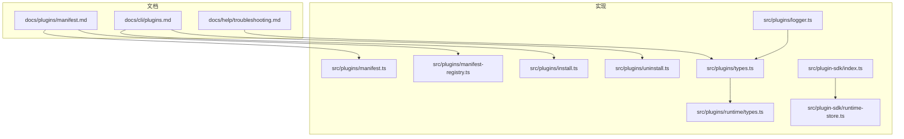
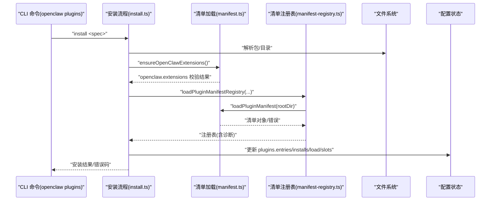
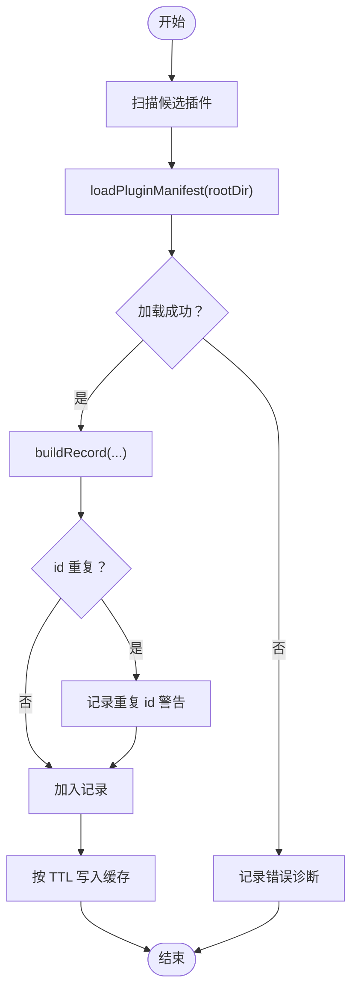
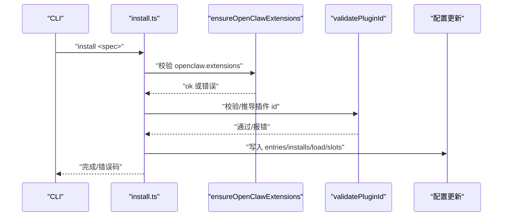
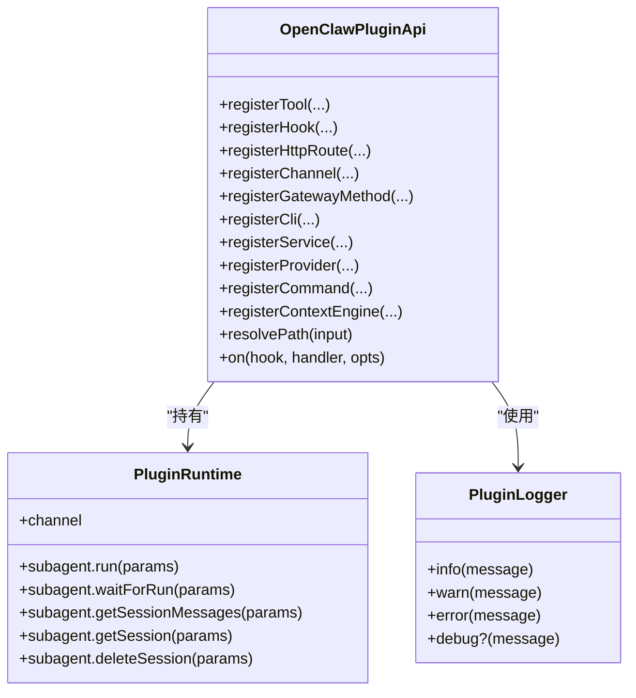
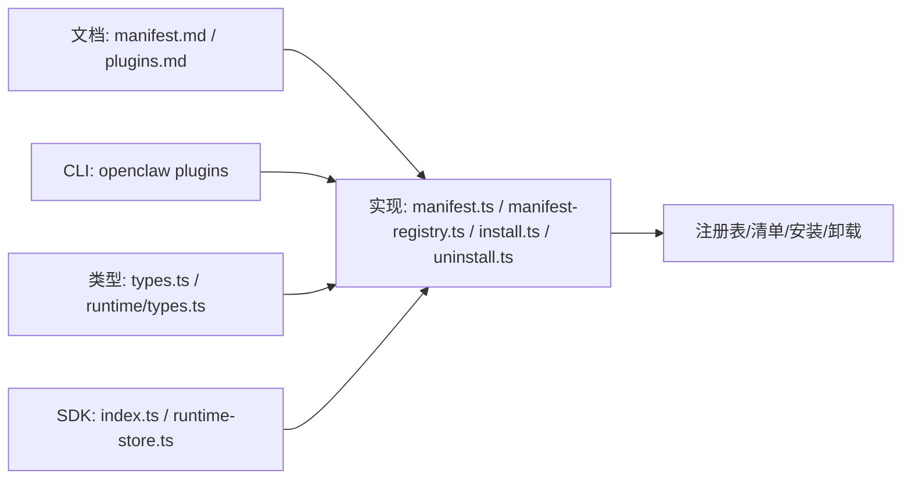

# 插件系统故障排除

<cite>
**本文档引用的文件**
- [manifest.md](file://docs/plugins/manifest.md)
- [plugins.md](file://docs/cli/plugins.md)
- [troubleshooting.md](file://docs/help/troubleshooting.md)
- [types.ts](file://src/plugins/types.ts)
- [logger.ts](file://src/plugins/logger.ts)
- [runtime/types.ts](file://src/plugins/runtime/types.ts)
- [manifest-registry.ts](file://src/plugins/manifest-registry.ts)
- [manifest.ts](file://src/plugins/manifest.ts)
- [install.ts](file://src/plugins/install.ts)
- [uninstall.ts](file://src/plugins/uninstall.ts)
- [index.ts](file://src/plugin-sdk/index.ts)
- [runtime-store.ts](file://src/plugin-sdk/runtime-store.ts)
</cite>

## 目录
1. [简介](#简介)
2. [项目结构](#项目结构)
3. [核心组件](#核心组件)
4. [架构总览](#架构总览)
5. [详细组件分析](#详细组件分析)
6. [依赖关系分析](#依赖关系分析)
7. [性能考量](#性能考量)
8. [故障排除指南](#故障排除指南)
9. [结论](#结论)
10. [附录](#附录)

## 简介
本指南聚焦于 OpenClaw 插件系统的故障排除，覆盖安装失败、加载异常、兼容性问题、包结构与依赖校验、版本冲突排查、生命周期监控、错误日志分析、性能影响评估、权限与安全限制、调试模式使用等关键主题。内容基于仓库中的插件清单规范、CLI 命令参考、类型定义与实现代码，帮助开发者与运维人员快速定位并解决问题。

## 项目结构
围绕插件系统的关键目录与文件：
- 文档层：插件清单规范、CLI 参考、通用故障排除入口
- 实现层：插件清单解析与注册表、安装/卸载流程、运行时类型与日志、SDK 工具

图表来源
- [manifest.md](file://docs/plugins/manifest.md)
- [plugins.md](file://docs/cli/plugins.md)
- [troubleshooting.md](file://docs/help/troubleshooting.md)
- [manifest.ts](file://src/plugins/manifest.ts)
- [manifest-registry.ts](file://src/plugins/manifest-registry.ts)
- [install.ts](file://src/plugins/install.ts)
- [uninstall.ts](file://src/plugins/uninstall.ts)
- [types.ts](file://src/plugins/types.ts)
- [runtime/types.ts](file://src/plugins/runtime/types.ts)
- [logger.ts](file://src/plugins/logger.ts)
- [index.ts](file://src/plugin-sdk/index.ts)
- [runtime-store.ts](file://src/plugin-sdk/runtime-store.ts)

章节来源
- [manifest.md](file://docs/plugins/manifest.md)
- [plugins.md](file://docs/cli/plugins.md)
- [troubleshooting.md](file://docs/help/troubleshooting.md)

## 核心组件
- 插件清单与校验：openclaw.plugin.json 必须存在且包含严格 JSON Schema，用于离线配置验证与发现。
- 清单注册表：扫描候选插件、加载清单、缓存与去重、生成诊断信息。
- 安装/卸载：解析包结构、校验 openclaw.extensions、写入配置、维护 load.paths 与 slots。
- 类型与运行时：统一的插件 API、钩子事件、运行时子代理接口、日志抽象。
- SDK 工具：运行时存储、路径解析、命令执行、Webhook 注册等。

章节来源
- [manifest.md](file://docs/plugins/manifest.md)
- [manifest.ts](file://src/plugins/manifest.ts)
- [manifest-registry.ts](file://src/plugins/manifest-registry.ts)
- [install.ts](file://src/plugins/install.ts)
- [uninstall.ts](file://src/plugins/uninstall.ts)
- [types.ts](file://src/plugins/types.ts)
- [runtime/types.ts](file://src/plugins/runtime/types.ts)
- [logger.ts](file://src/plugins/logger.ts)
- [index.ts](file://src/plugin-sdk/index.ts)
- [runtime-store.ts](file://src/plugin-sdk/runtime-store.ts)

## 架构总览
下图展示插件从“发现—校验—安装—运行”的关键交互：

图表来源
- [install.ts](file://src/plugins/install.ts)
- [manifest.ts](file://src/plugins/manifest.ts)
- [manifest-registry.ts](file://src/plugins/manifest-registry.ts)

## 详细组件分析

### 组件A：插件清单与注册表
- 清单要求：id 与 configSchema 必填；channels/providers/skills 等可选字段用于发现与 UI 提示。
- 注册表职责：扫描候选、加载清单、缓存、去重、origin 优先级、重复 id 警告、schema 缓存键。
- 诊断输出：错误/警告消息包含源路径与插件 id，便于定位。

图表来源
- [manifest.ts](file://src/plugins/manifest.ts)
- [manifest-registry.ts](file://src/plugins/manifest-registry.ts)

章节来源
- [manifest.md](file://docs/plugins/manifest.md)
- [manifest.ts](file://src/plugins/manifest.ts)
- [manifest-registry.ts](file://src/plugins/manifest-registry.ts)

### 组件B：安装与卸载流程
- 安装要点：校验 openclaw.extensions、解析 npm 规范、硬链接拒绝策略、插件 id 校验与匹配、更新配置项。
- 卸载要点：移除 entries/installs/allowlist，清理 load.paths（针对 path 来源），重置 memory slot，清理空字段。

图表来源
- [install.ts](file://src/plugins/install.ts)
- [uninstall.ts](file://src/plugins/uninstall.ts)

章节来源
- [plugins.md](file://docs/cli/plugins.md)
- [install.ts](file://src/plugins/install.ts)
- [uninstall.ts](file://src/plugins/uninstall.ts)

### 组件C：运行时与日志
- 运行时接口：子代理运行/等待/会话消息查询/删除，通道能力。
- 日志抽象：统一 PluginLogger 接口，支持 info/warn/error/debug。
- 运行时存储：安全访问 runtime，未初始化时报错。

图表来源
- [types.ts](file://src/plugins/types.ts)
- [runtime/types.ts](file://src/plugins/runtime/types.ts)
- [logger.ts](file://src/plugins/logger.ts)
- [runtime-store.ts](file://src/plugin-sdk/runtime-store.ts)

章节来源
- [types.ts](file://src/plugins/types.ts)
- [runtime/types.ts](file://src/plugins/runtime/types.ts)
- [logger.ts](file://src/plugins/logger.ts)
- [runtime-store.ts](file://src/plugin-sdk/runtime-store.ts)

## 依赖关系分析
- 文档约束驱动实现：清单规范决定安装/注册表行为与 Doctor 报错。
- CLI 命令驱动安装/卸载：命令行参数与安全策略直接影响安装流程。
- 类型与运行时：统一 API 与运行时接口确保插件与宿主交互一致。
- SDK 工具：提供路径解析、命令执行、Webhook 注册等基础设施。

图表来源
- [manifest.md](file://docs/plugins/manifest.md)
- [plugins.md](file://docs/cli/plugins.md)
- [manifest.ts](file://src/plugins/manifest.ts)
- [manifest-registry.ts](file://src/plugins/manifest-registry.ts)
- [install.ts](file://src/plugins/install.ts)
- [uninstall.ts](file://src/plugins/uninstall.ts)
- [types.ts](file://src/plugins/types.ts)
- [runtime/types.ts](file://src/plugins/runtime/types.ts)
- [index.ts](file://src/plugin-sdk/index.ts)
- [runtime-store.ts](file://src/plugin-sdk/runtime-store.ts)

章节来源
- [manifest.md](file://docs/plugins/manifest.md)
- [plugins.md](file://docs/cli/plugins.md)
- [types.ts](file://src/plugins/types.ts)
- [runtime/types.ts](file://src/plugins/runtime/types.ts)
- [index.ts](file://src/plugin-sdk/index.ts)

## 性能考量
- 清单缓存：注册表支持按环境变量控制 TTL，避免频繁磁盘扫描与解析。
- 启动阶段合并：短窗口缓存折叠启动期的突发刷新，降低 I/O 压力。
- 运行时接口：子代理会话查询与删除采用异步读取，避免阻塞主流水线。

章节来源
- [manifest-registry.ts](file://src/plugins/manifest-registry.ts)
- [runtime/types.ts](file://src/plugins/runtime/types.ts)

## 故障排除指南

### 一、安装失败
- 常见原因
  - 缺少 openclaw.plugin.json 或 JSON Schema 不合法
  - openclaw.extensions 缺失或指向非构建产物
  - npm 规范不满足安全策略（裸 spec/最新版需显式预发布标签）
  - 本地目录使用 --link 时，load.paths 未正确更新
- 诊断步骤
  - 使用 CLI doctor 检查插件清单与配置有效性
  - 查看注册表诊断输出（重复 id、路径不安全、硬链接拒绝）
  - 确认安装日志中的错误码与源路径
- 处理建议
  - 修复 openclaw.plugin.json 并确保 configSchema 合法
  - 在 package.json 中添加 openclaw.extensions 指向构建产物
  - 对于 npm 安装，使用精确版本或显式预发布标签
  - 如需本地开发，使用 --link 并确认 load.paths 已更新

章节来源
- [plugins.md](file://docs/cli/plugins.md)
- [manifest.md](file://docs/plugins/manifest.md)
- [manifest-registry.ts](file://src/plugins/manifest-registry.ts)
- [install.ts](file://src/plugins/install.ts)

### 二、加载异常
- 症状
  - 插件未出现在清单注册表
  - 重复 id 警告导致覆盖
  - 硬链接拒绝或路径越界
- 诊断步骤
  - 检查候选插件根目录是否包含 openclaw.plugin.json
  - 关注注册表对重复 id 的警告与覆盖提示
  - 核对 rejectHardlinks 策略与 origin 优先级
- 处理建议
  - 修正插件 id，避免重复
  - 使用真实物理路径而非符号链接
  - 调整 discover 路径与 load.paths

章节来源
- [manifest.ts](file://src/plugins/manifest.ts)
- [manifest-registry.ts](file://src/plugins/manifest-registry.ts)

### 三、兼容性问题与版本冲突
- 症状
  - 插件 id 与 npm 包名不一致导致配置键不匹配
  - 更新后完整性哈希变化触发二次确认
- 诊断步骤
  - 对比 openclaw.plugin.json 的 id 与 npm 包名
  - 检查安装记录中的 pinned 版本与 dist-tag
- 处理建议
  - 以 manifest.id 为准更新配置条目
  - 显式使用 --pin 保存解析后的精确版本
  - 在 CI 中使用 --yes 跳过交互确认

章节来源
- [install.ts](file://src/plugins/install.ts)
- [plugins.md](file://docs/cli/plugins.md)

### 四、插件包结构验证与依赖检查
- 结构要求
  - 插件根目录必须包含 openclaw.plugin.json
  - openclaw.extensions 必须指向构建产物（如 dist/index.js）
  - 支持的归档格式：.zip/.tgz/.tar.gz/.tar
- 依赖与构建
  - 若依赖原生模块，需遵循包管理器允许列表与重建步骤
- 诊断与修复
  - 依据 CLI doctor 输出定位缺失字段与非法值
  - 重新构建并更新 openclaw.extensions 指向

章节来源
- [plugins.md](file://docs/cli/plugins.md)
- [manifest.md](file://docs/plugins/manifest.md)

### 五、版本冲突排查
- 现象
  - 同一插件 id 多个来源导致覆盖
  - 旧式包结构不再被接受
- 处理
  - 清理重复来源，保留高优先级 origin
  - 升级插件包结构，满足 openclaw.extensions 要求

章节来源
- [manifest-registry.ts](file://src/plugins/manifest-registry.ts)
- [troubleshooting.md](file://docs/help/troubleshooting.md)

### 六、插件生命周期监控
- 生命周期钩子
  - 代理与会话：before_agent_start/before_prompt_build/llm_input/llm_output/agent_end
  - 消息：message_received/message_sending/message_sent
  - 工具：before_tool_call/after_tool_call/tool_result_persist/before_message_write
  - 子代理：subagent_spawning/delivery_target/spawned/ended
  - 网关：gateway_start/gateway_stop
- 监控建议
  - 在相应钩子中注入日志与计时，观察耗时与错误
  - 使用 Doctor 检查配置与服务健康

章节来源
- [types.ts](file://src/plugins/types.ts)

### 七、错误日志分析
- 日志接口
  - PluginLogger：info/warn/error/debug
  - Doctor：集中化诊断输出，包含错误/警告与源路径
- 分析要点
  - 关注清单加载失败、重复 id、路径不安全、硬链接拒绝等错误
  - 结合 CLI doctor 与 logs --follow 定位重复致命错误

章节来源
- [logger.ts](file://src/plugins/logger.ts)
- [troubleshooting.md](file://docs/help/troubleshooting.md)

### 八、性能影响评估
- 影响点
  - 清单注册表缓存命中率与 TTL 设置
  - 子代理会话读取与写入开销
- 评估方法
  - 启动阶段观察注册表缓存命中与去重逻辑
  - 记录钩子耗时与工具调用延迟

章节来源
- [manifest-registry.ts](file://src/plugins/manifest-registry.ts)
- [runtime/types.ts](file://src/plugins/runtime/types.ts)

### 九、权限配置、安全限制与调试模式
- 安全限制
  - 硬链接拒绝策略（非 bundled 来源）
  - 路径边界检查与越界保护
- 调试模式
  - 打开 debug 日志级别以获取更细粒度输出
  - 使用 CLI doctor 与 logs --follow 快速定位问题
- 建议
  - 开发阶段启用详细日志，生产环境保持适度级别
  - 严格遵循清单与安装规范，避免安全策略触发

章节来源
- [manifest.ts](file://src/plugins/manifest.ts)
- [manifest-registry.ts](file://src/plugins/manifest-registry.ts)
- [logger.ts](file://src/plugins/logger.ts)
- [troubleshooting.md](file://docs/help/troubleshooting.md)

## 结论
通过规范的插件清单、严格的安装/卸载流程、完善的注册表与诊断机制，OpenClaw 能够稳定地管理插件生态。遇到问题时，建议优先使用 CLI doctor 与 logs --follow 获取全局视图，再结合清单与注册表诊断定位具体原因，最后依据本文提供的处理建议逐项修复。

## 附录

### A. 常用 CLI 与关键参数
- openclaw plugins list/info/enable/disable/uninstall/doctor/update
- 安装：--link（本地目录）、--pin（固定版本）、支持 .zip/.tgz/.tar.gz/.tar
- 卸载：--dry-run/--keep-files/--keep-config（已废弃）

章节来源
- [plugins.md](file://docs/cli/plugins.md)

### B. 插件清单字段与校验要点
- 必填：id、configSchema
- 可选：kind、channels、providers、skills、name/description/uiHints/version
- 校验：未知 channels.* 键为错误；plugins.entries/plugins.allow/plugins.deny/plugins.slots.* 必须引用可发现 id；禁用插件保留配置并告警

章节来源
- [manifest.md](file://docs/plugins/manifest.md)