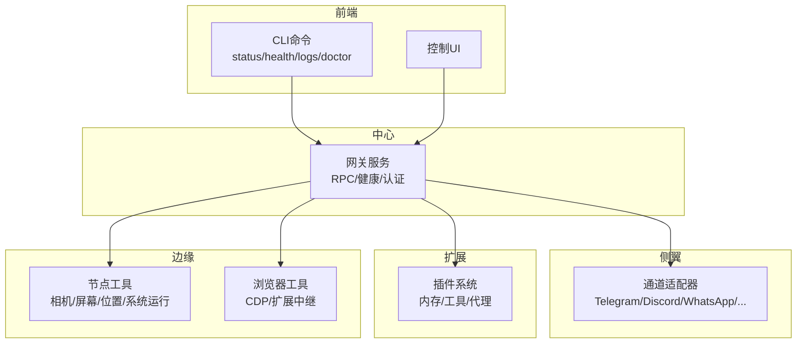
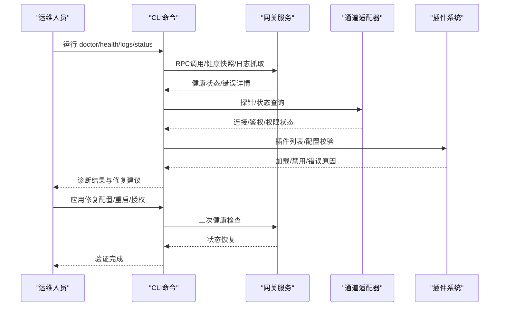
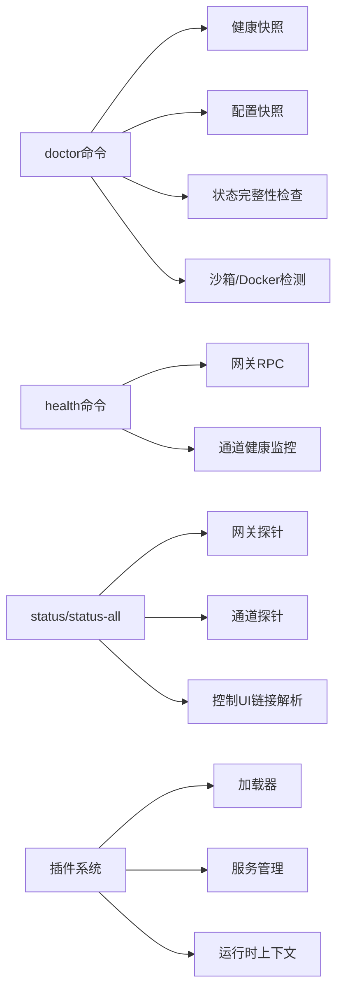

# 故障排除

<cite>
**本文引用的文件**
- [docs/help/troubleshooting.md](file://docs/help/troubleshooting.md)
- [docs/gateway/troubleshooting.md](file://docs/gateway/troubleshooting.md)
- [docs/channels/troubleshooting.md](file://docs/channels/troubleshooting.md)
- [docs/nodes/troubleshooting.md](file://docs/nodes/troubleshooting.md)
- [docs/cli/doctor.md](file://docs/cli/doctor.md)
- [docs/cli/logs.md](file://docs/cli/logs.md)
- [docs/gateway/health.md](file://docs/gateway/health.md)
- [docs/cli/health.md](file://docs/cli/health.md)
- [src/commands/doctor.ts](file://src/commands/doctor.ts)
- [src/commands/health.ts](file://src/commands/health.ts)
- [src/commands/status-all.ts](file://src/commands/status-all.ts)
- [src/commands/doctor-auth.ts](file://src/commands/doctor-auth.ts)
- [src/commands/doctor-config-analysis.ts](file://src/commands/doctor-config-analysis.ts)
- [src/commands/doctor-gateway-health.ts](file://src/commands/doctor-gateway-health.ts)
- [src/cli/program/config-guard.ts](file://src/cli/program/config-guard.ts)
- [src/gateway/channel-health-monitor.test.ts](file://src/gateway/channel-health-monitor.test.ts)
- [src/agents/auth-health.ts](file://src/agents/auth-health.ts)
- [src/infra/backoff.ts](file://src/infra/backoff.ts)
- [src/plugins/services.test.ts](file://src/plugins/services.test.ts)
- [src/plugins/loader.ts](file://src/plugins/loader.ts)
- [src/plugin-sdk/runtime-store.ts](file://src/plugin-sdk/runtime-store.ts)
- [apps/macos/Sources/OpenClaw/Logging/OpenClawLogging.swift](file://apps/macos/Sources/OpenClaw/Logging/OpenClawLogging.swift)
- [docs/automation/troubleshooting.md](file://docs/automation/troubleshooting.md)
- [docs/tools/browser-linux-troubleshooting.md](file://docs/tools/browser-linux-troubleshooting.md)
- [docs/tools/browser-wsl2-windows-remote-cdp-troubleshooting.md](file://docs/tools/browser-wsl2-windows-remote-cdp-troubleshooting.md)
</cite>

## 目录
1. [简介](#简介)
2. [项目结构](#项目结构)
3. [核心组件](#核心组件)
4. [架构总览](#架构总览)
5. [详细组件分析](#详细组件分析)
6. [依赖分析](#依赖分析)
7. [性能考虑](#性能考虑)
8. [故障排除指南](#故障排除指南)
9. [结论](#结论)
10. [附录](#附录)

## 简介
本指南面向OpenClaw运维与支持工程师，提供系统化的故障排除流程与实操步骤。内容覆盖启动失败、连接异常、性能问题、权限错误等典型场景，并结合CLI命令（doctor、health、logs、status等）与日志分析、网络连通性测试、插件与代理执行器健康检查等诊断手段，帮助快速定位根因并修复。

## 项目结构
OpenClaw通过“CLI命令 + 网关服务 + 渠道适配器 + 插件系统 + 节点与浏览器工具”的分层架构运行。故障排除围绕以下关键路径展开：
- 前端：CLI命令与控制UI
- 中心：网关（RPC/健康检查/认证）
- 侧翼：通道适配器（各平台消息通道）
- 扩展：插件系统（内存/工具/代理等）
- 边缘：节点与浏览器工具（前台权限、执行审批）

[无图表来源；该图为概念性架构示意]

## 核心组件
- doctor命令：健康检查与引导式修复，自动迁移旧状态、扫描遗留任务、检测沙箱与Docker可用性、清理会话转储等。
- health命令：从运行中的网关获取健康快照，支持JSON输出与多账户探针。
- logs命令：通过RPC远程抓取网关日志，支持follow、JSON、时区本地化等。
- status/status-all：综合状态报告，含网关可达性、认证模式、控制UI链接、代理与通道健康等。
- 插件系统：插件加载、配置校验、服务启停与错误聚合，便于定位插件侧问题。
- 日志系统：统一日志格式与元数据渲染，支持文件落盘与诊断字段输出。

章节来源
- [docs/cli/doctor.md:1-46](file://docs/cli/doctor.md#L1-L46)
- [docs/cli/health.md:1-22](file://docs/cli/health.md#L1-L22)
- [docs/cli/logs.md:1-29](file://docs/cli/logs.md#L1-L29)
- [docs/gateway/health.md:1-36](file://docs/gateway/health.md#L1-L36)
- [docs/help/troubleshooting.md:1-299](file://docs/help/troubleshooting.md#L1-L299)

## 架构总览
下图展示一次典型“诊断-修复-验证”的闭环流程，贯穿CLI、网关、通道与插件：

图表来源
- [src/commands/doctor.ts](file://src/commands/doctor.ts)
- [src/commands/health.ts](file://src/commands/health.ts)
- [src/commands/status-all.ts](file://src/commands/status-all.ts)
- [src/commands/doctor-gateway-health.ts](file://src/commands/doctor-gateway-health.ts)

## 详细组件分析

### doctor命令（健康检查与引导式修复）
- 功能要点
  - 自动迁移旧状态、扫描遗留任务、清理会话转储
  - 检测沙箱模式与Docker可用性，给出安装或关闭建议
  - 交互式提示（TTY且非非交互模式）处理钥匙串/OAuth等
  - 写入备份并清理未知配置键，列出移除项
- 典型修复场景
  - 启动失败：检查gateway.mode、bind与auth配置是否匹配
  - 连接异常：核对token/password与设备身份流程
  - 权限错误：检查沙箱与Docker、通道权限与scope
- 使用建议
  - 首次排查先运行doctor，再按其建议执行修复
  - headless环境使用--non-interactive或--yes避免阻塞

章节来源
- [docs/cli/doctor.md:18-46](file://docs/cli/doctor.md#L18-L46)
- [src/commands/doctor.ts](file://src/commands/doctor.ts)
- [src/commands/doctor-auth.ts](file://src/commands/doctor-auth.ts)
- [src/commands/doctor-config-analysis.ts](file://src/commands/doctor-config-analysis.ts)

### health命令（网关健康快照）
- 功能要点
  - 获取运行中网关的健康快照，支持JSON与详细探针
  - 多账户时显示每个账户的探针耗时
  - 输出包含会话存储摘要、通道探针汇总、探针耗时
- 使用建议
  - 作为“症状-证据”对照表，结合日志定位异常
  - 对比不同时间点快照，观察趋势变化

章节来源
- [docs/cli/health.md:8-22](file://docs/cli/health.md#L8-L22)
- [docs/gateway/health.md:21-36](file://docs/gateway/health.md#L21-L36)
- [src/commands/health.ts](file://src/commands/health.ts)

### logs命令（远程日志抓取）
- 功能要点
  - 通过RPC远程抓取网关文件日志，支持follow、JSON、限制条数、本地时区
  - 适合远程环境（SSH受限）快速定位问题
- 使用建议
  - 结合--follow与过滤关键词（如web-heartbeat/web-reconnect/web-inbound）进行定向排查
  - 导出JSON用于外部分析工具

章节来源
- [docs/cli/logs.md:9-29](file://docs/cli/logs.md#L9-L29)

### status/status-all（综合状态报告）
- 功能要点
  - status：本地摘要（网关可达性/模式/更新提示/通道鉴权时效/会话与近期活动）
  - status --all：完整可分享的只读诊断报告
  - status --deep：对运行中网关进行逐通道探针
  - 包含控制UI链接、认证模式、网关自检结果
- 使用建议
  - 将--all输出粘贴到工单，便于他人复现
  - 结合doctor与channels status --probe交叉验证

章节来源
- [docs/gateway/health.md:12-20](file://docs/gateway/health.md#L12-L20)
- [src/commands/status-all.ts:170-275](file://src/commands/status-all.ts#L170-L275)

### 插件系统（加载、配置校验、服务启停）
- 关键点
  - 插件加载前进行入口路径安全检查与schema校验
  - 记录插件类型不一致、禁用原因等诊断信息
  - 服务启动/停止失败时记录错误并继续流程，避免单点阻断
  - 插件运行时上下文存储，缺失时抛出明确错误
- 故障定位
  - 通过诊断日志查看“禁用原因”“类型不匹配”“配置校验失败”
  - 观察服务启停阶段的错误堆栈

章节来源
- [src/plugins/loader.ts:636-749](file://src/plugins/loader.ts#L636-L749)
- [src/plugins/services.test.ts:87-127](file://src/plugins/services.test.ts#L87-L127)
- [src/plugin-sdk/runtime-store.ts:1-26](file://src/plugin-sdk/runtime-store.ts#L1-L26)

### 日志系统（统一格式与元数据）
- 关键点
  - 文件日志处理器按子系统/类别/级别/源文件/函数/行号输出
  - 支持元数据合并与字段化输出，便于检索与聚合
- 故障定位
  - 使用--local-time查看本地时区时间线
  - 结合doctor与health输出的探针耗时，回溯异常发生窗口

章节来源
- [apps/macos/Sources/OpenClaw/Logging/OpenClawLogging.swift:175-215](file://apps/macos/Sources/OpenClaw/Logging/OpenClawLogging.swift#L175-L215)

## 依赖分析
- doctor命令依赖健康快照、配置快照、状态完整性检查、沙箱与Docker检测、通道探针等模块
- health命令依赖网关RPC接口与通道健康监控
- status/status-all依赖网关探针、通道探针、控制UI解析与更新提示
- 插件系统依赖加载器、服务管理器与运行时上下文存储

图表来源
- [src/commands/doctor.ts](file://src/commands/doctor.ts)
- [src/commands/health.ts](file://src/commands/health.ts)
- [src/commands/status-all.ts](file://src/commands/status-all.ts)
- [src/commands/doctor-gateway-health.ts](file://src/commands/doctor-gateway-health.ts)
- [src/plugins/loader.ts](file://src/plugins/loader.ts)
- [src/plugins/services.test.ts](file://src/plugins/services.test.ts)
- [src/plugin-sdk/runtime-store.ts](file://src/plugin-sdk/runtime-store.ts)

## 性能考虑
- 探针与健康检查应设置合理超时与退避策略，避免在高负载时放大抖动
- 日志抓取与follow应限制并发与缓冲，防止I/O瓶颈
- 插件加载与配置校验应尽早失败，减少无效开销
- 通道探针应区分“连接态”与“消息流”，避免误判

章节来源
- [src/infra/backoff.ts:1-28](file://src/infra/backoff.ts#L1-L28)

## 故障排除指南

### 通用诊断流程（症状优先）
- 快速三板斧
  - 运行status/status --all/gateway probe/gateway status/doctor/channels status --probe/logs --follow
  - 期望健康信号：网关运行、RPC探针OK、通道connected/ready、无重复致命错误
- 分类排查
  - 无回复：检查路由/策略/配对状态
  - 控制UI无法连接：校验URL/认证/设备身份/令牌漂移
  - 网关无法启动/服务未运行：检查mode/bind/auth/端口占用
  - 通道已连但消息不通：检查mention策略/允许名单/权限scope
  - 定时任务/心跳未触发：检查调度器状态/静默时段/目标账户
  - 节点工具失败：检查前台权限/系统运行审批/允许清单
  - 浏览器工具失败：检查可执行路径/CDP可达/扩展中继连接

章节来源
- [docs/help/troubleshooting.md:13-36](file://docs/help/troubleshooting.md#L13-L36)
- [docs/help/troubleshooting.md:68-88](file://docs/help/troubleshooting.md#L68-L88)

### 启动失败
- 现象
  - 网关进程退出、RPC探针失败、端口冲突
- 诊断步骤
  - 运行gateway status与logs --follow，观察退出原因与告警
  - doctor检查gateway.mode、bind与auth配置是否匹配
  - 若为非环回绑定，确认已配置token/password
  - 如端口被占用，修改端口或释放占用进程
- 修复建议
  - 设置gateway.mode=local或修正远程URL
  - 配置共享令牌/设备令牌并完成配对
  - 重新安装服务元数据以同步配置

章节来源
- [docs/gateway/troubleshooting.md:152-180](file://docs/gateway/troubleshooting.md#L152-L180)
- [docs/help/troubleshooting.md:151-177](file://docs/help/troubleshooting.md#L151-L177)

### 连接异常（控制UI/远程访问）
- 现象
  - 控制UI/远程客户端无法连接或反复出现unauthorized
- 诊断步骤
  - status/gateway status/gateway status --json，确认URL与认证模式
  - doctor检查launchctl环境变量是否覆盖了令牌/密码
  - 查看日志中的设备身份/nonce/签名相关错误码
- 修复建议
  - 升级客户端以正确完成挑战-响应设备身份流程
  - 清理launchctl覆盖的环境变量
  - 重新批准设备令牌或轮换后重试

章节来源
- [docs/gateway/troubleshooting.md:91-151](file://docs/gateway/troubleshooting.md#L91-L151)
- [docs/help/troubleshooting.md:121-148](file://docs/help/troubleshooting.md#L121-L148)
- [docs/cli/doctor.md:35-46](file://docs/cli/doctor.md#L35-L46)

### 通道连接但消息不流动
- 现象
  - 通道显示connected/ready，但无下行消息或下行被忽略
- 诊断步骤
  - channels status --probe + pairing list + config get channels
  - 检查mention策略/允许名单/群组规则/权限scope
- 修复建议
  - 放宽mention要求或在群组中@机器人
  - 更新sender ID为数值型或调整允许名单
  - 重新登录并验证凭据目录健康

章节来源
- [docs/gateway/troubleshooting.md:182-212](file://docs/gateway/troubleshooting.md#L182-L212)
- [docs/channels/troubleshooting.md:13-30](file://docs/channels/troubleshooting.md#L13-L30)

### 定时任务/心跳未触发
- 现象
  - cron未运行或心跳未投递
- 诊断步骤
  - cron status/list/runs查看调度器状态与最近运行历史
  - system heartbeat last检查静默时段/飞行中请求/目标账户
- 修复建议
  - 启用调度器或修正下次唤醒时间
  - 调整静默时段或等待当前请求完成后重试
  - 校正心跳目标账户ID

章节来源
- [docs/gateway/troubleshooting.md:213-244](file://docs/gateway/troubleshooting.md#L213-L244)
- [docs/automation/troubleshooting.md](file://docs/automation/troubleshooting.md)

### 节点工具失败（相机/屏幕/系统运行）
- 现象
  - 节点已配对但相机/屏幕/系统运行失败
- 诊断步骤
  - nodes status/describe + approvals get
  - 检查前台权限/系统运行审批/允许清单
- 修复建议
  - 将节点应用置于前台（iOS/Android）
  - 重新批准设备配对/授予OS权限/重建执行审批策略

章节来源
- [docs/gateway/troubleshooting.md:245-275](file://docs/gateway/troubleshooting.md#L245-L275)
- [docs/nodes/troubleshooting.md:13-36](file://docs/nodes/troubleshooting.md#L13-L36)

### 浏览器工具失败
- 现象
  - 浏览器工具动作失败（CDP启动失败/扩展未连接/attach-only不可达）
- 诊断步骤
  - browser status/start/profiles + logs --follow
  - 检查可执行路径/CDP可达性/扩展中继tab连接
- 修复建议
  - 修正browser.executablePath或确保二进制存在
  - 附加扩展中继并确保有已连接tab
  - 避免attach-only配置指向不可达目标

章节来源
- [docs/gateway/troubleshooting.md:276-306](file://docs/gateway/troubleshooting.md#L276-L306)
- [docs/tools/browser-linux-troubleshooting.md](file://docs/tools/browser-linux-troubleshooting.md)
- [docs/tools/browser-wsl2-windows-remote-cdp-troubleshooting.md](file://docs/tools/browser-wsl2-windows-remote-cdp-troubleshooting.md)

### 权限错误与沙箱/Docker
- 现象
  - 系统运行被拒绝/权限缺失/沙箱模式下Docker不可用
- 诊断步骤
  - doctor检测沙箱模式与Docker可用性
  - 检查系统运行审批/允许清单/OS权限
- 修复建议
  - 安装Docker或关闭agents.defaults.sandbox.mode
  - 重新批准执行审批/调整允许清单/授予缺失权限

章节来源
- [docs/cli/doctor.md:29-34](file://docs/cli/doctor.md#L29-L34)
- [docs/nodes/troubleshooting.md:51-91](file://docs/nodes/troubleshooting.md#L51-L91)

### 插件系统故障
- 现象
  - 插件加载失败/禁用/服务启停报错
- 诊断步骤
  - 查看doctor输出的“状态完整性”警告
  - 检查插件入口路径安全检查、配置schema校验、类型不一致
  - 观察服务启停阶段的错误日志
- 修复建议
  - 修复入口路径逃逸/别名检查问题
  - 补齐配置schema或修正插件导出类型
  - 修复服务实现中的异常并重试

章节来源
- [src/commands/doctor.ts](file://src/commands/doctor.ts)
- [src/plugins/loader.ts:636-749](file://src/plugins/loader.ts#L636-L749)
- [src/plugins/services.test.ts:87-127](file://src/plugins/services.test.ts#L87-L127)

### 故障诊断工具与方法
- doctor
  - 作用：健康检查+引导修复，自动迁移旧状态、扫描遗留任务、检测沙箱/Docker
  - 用法：openclaw doctor [--repair/--deep/--non-interactive/--yes]
- health
  - 作用：从运行中网关获取健康快照，支持JSON与多账户探针
  - 用法：openclaw health [--json/--verbose]
- logs
  - 作用：通过RPC远程抓取网关日志，支持follow、JSON、限制条数、本地时区
  - 用法：openclaw logs [--follow/--json/--limit/--local-time]
- status/status-all
  - 作用：综合状态报告，含网关可达性、认证模式、控制UI链接、代理与通道健康
  - 用法：openclaw status / openclaw status --all / openclaw status --deep

章节来源
- [docs/cli/doctor.md:18-34](file://docs/cli/doctor.md#L18-L34)
- [docs/cli/health.md:8-22](file://docs/cli/health.md#L8-L22)
- [docs/cli/logs.md:9-29](file://docs/cli/logs.md#L9-L29)
- [docs/gateway/health.md:12-20](file://docs/gateway/health.md#L12-L20)

### 收集故障信息与根因定位
- 信息收集
  - 运行status --all输出，截图或复制粘贴至工单
  - doctor输出的“状态完整性”“沙箱/Docker检测”“遗留任务扫描”等
  - logs --follow抓取最近1小时日志，过滤关键错误码
  - health --json输出网关健康快照，对比前后差异
- 根因定位
  - 以症状为线索，对照“决策树/分类排查”逐步收敛
  - 结合通道特定签名（mention required/pairing pending/missing_scope等）
  - 关注doctor与health输出中的“禁用原因/类型不一致/配置校验失败”

章节来源
- [docs/help/troubleshooting.md:68-88](file://docs/help/troubleshooting.md#L68-L88)
- [docs/channels/troubleshooting.md:33-118](file://docs/channels/troubleshooting.md#L33-L118)

### 预防性维护与最佳实践
- 定期巡检
  - 每周运行doctor，关注沙箱/Docker可用性与遗留任务
  - 每月检查通道权限与scope，避免升级后策略变更导致的阻断
- 配置治理
  - 使用doctor --fix清理未知键，保持配置整洁
  - 严格区分本地/远程模式与bind/auth组合
- 运行时健康
  - 监控心跳与cron运行历史，及时发现静默失败
  - 节点工具调用前确保前台权限与执行审批
- 日志与可观测
  - 启用本地时区日志，便于跨时区排障
  - 使用JSON日志对接外部分析工具，建立告警与归档

章节来源
- [docs/cli/doctor.md:26-34](file://docs/cli/doctor.md#L26-L34)
- [docs/gateway/troubleshooting.md:213-244](file://docs/gateway/troubleshooting.md#L213-L244)
- [docs/nodes/troubleshooting.md:92-115](file://docs/nodes/troubleshooting.md#L92-L115)

## 结论
通过“doctor/health/logs/status”的组合拳与“症状优先”的分类排查，OpenClaw能够快速定位并修复启动失败、连接异常、通道消息阻断、定时任务失灵、节点工具失败与浏览器工具异常等常见问题。配合插件系统与日志系统的可观测能力，运维团队可以形成标准化的故障排除闭环，持续提升系统稳定性与可维护性。

## 附录

### 常见错误码与对应处理
- 设备身份/令牌相关
  - device identity required / device nonce required / device signature invalid → 升级客户端并完成挑战-响应流程
  - AUTH_TOKEN_MISMATCH（可受信重试）→ 允许一次设备令牌重试，仍失败则轮换设备令牌
- 通道策略/权限
  - mention required → 在群组中@机器人或放宽策略
  - pairing/pending → 发送方需批准或切换DM策略
  - missing_scope/not_in_channel/401/403 → 修正权限/加入频道/补充scope
- 节点工具
  - NODE_BACKGROUND_UNAVAILABLE → 将节点应用置于前台
  - *_PERMISSION_REQUIRED / LOCATION_PERMISSION_REQUIRED → 授予缺失OS权限
  - SYSTEM_RUN_DENIED: approval required / allowlist miss → 重新批准或调整允许清单

章节来源
- [docs/gateway/troubleshooting.md:109-151](file://docs/gateway/troubleshooting.md#L109-L151)
- [docs/channels/troubleshooting.md:33-118](file://docs/channels/troubleshooting.md#L33-L118)
- [docs/nodes/troubleshooting.md:79-91](file://docs/nodes/troubleshooting.md#L79-L91)