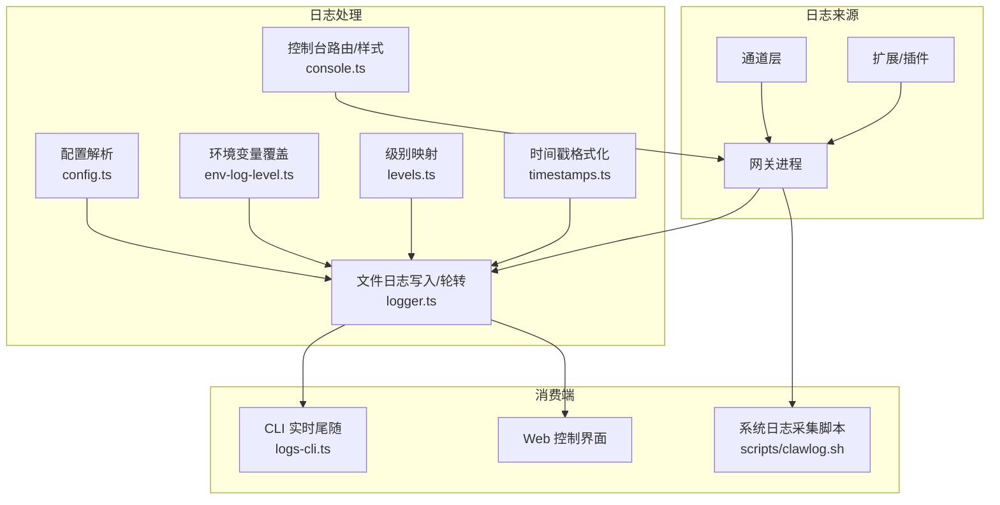
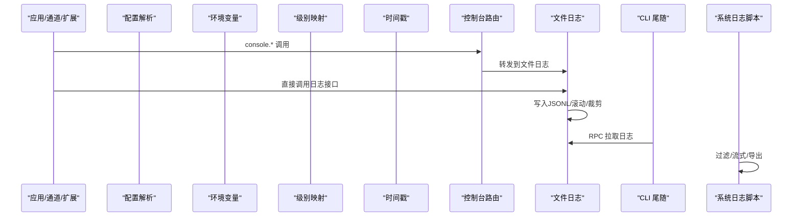
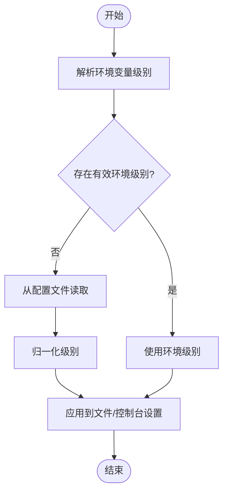
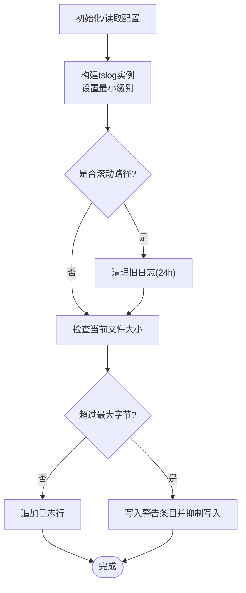
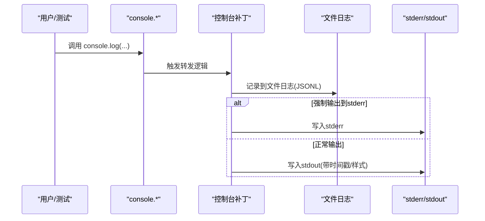
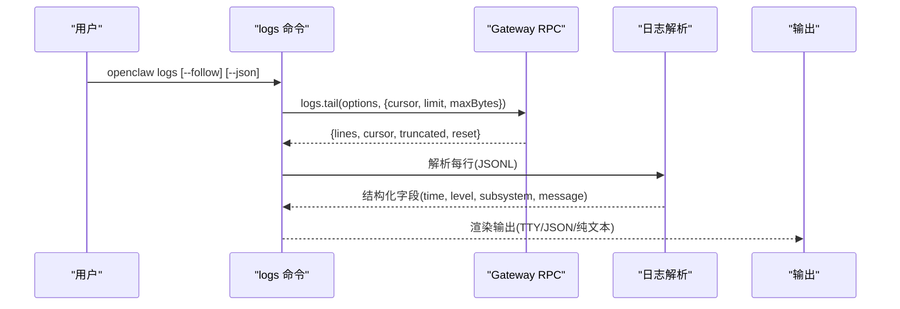
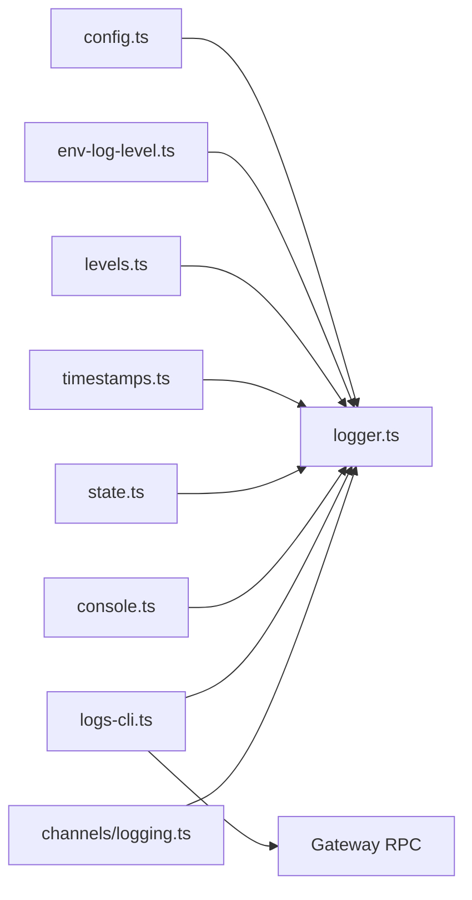

# 日志分析与诊断

<cite>
**本文引用的文件**   
- [docs/logging.md](file://docs/logging.md)
- [src/logging/logger.ts](file://src/logging/logger.ts)
- [src/logging/levels.ts](file://src/logging/levels.ts)
- [src/logging/console.ts](file://src/logging/console.ts)
- [src/logging/state.ts](file://src/logging/state.ts)
- [src/logging/config.ts](file://src/logging/config.ts)
- [src/logging/env-log-level.ts](file://src/logging/env-log-level.ts)
- [src/logging/timestamps.ts](file://src/logging/timestamps.ts)
- [src/cli/logs-cli.ts](file://src/cli/logs-cli.ts)
- [src/channels/logging.ts](file://src/channels/logging.ts)
- [scripts/clawlog.sh](file://scripts/clawlog.sh)
- [src/logger.ts](file://src/logger.ts)
</cite>

## 目录
1. [简介](#简介)
2. [项目结构](#项目结构)
3. [核心组件](#核心组件)
4. [架构总览](#架构总览)
5. [详细组件分析](#详细组件分析)
6. [依赖关系分析](#依赖关系分析)
7. [性能考量](#性能考量)
8. [故障排查指南](#故障排查指南)
9. [结论](#结论)
10. [附录](#附录)

## 简介
本指南面向OpenClaw的日志分析与诊断场景，系统讲解日志系统结构、级别分类、关键字段含义、过滤与搜索技巧、常见错误模式识别、日志聚合与趋势监控方法，以及日志轮转、存储管理与远程收集的最佳实践。读者可据此快速定位问题根因，并建立可持续的日志运维流程。

## 项目结构
OpenClaw的日志体系由“文件日志（JSONL）+ 控制台输出”构成，通过统一的配置与环境变量进行集中控制；CLI提供实时尾随查看能力；部分平台脚本支持系统级日志采集；通道层提供特定事件的结构化记录工具。

图表来源
- [src/logging/logger.ts:1-348](file://src/logging/logger.ts#L1-L348)
- [src/logging/console.ts:1-327](file://src/logging/console.ts#L1-L327)
- [src/logging/config.ts:1-25](file://src/logging/config.ts#L1-L25)
- [src/logging/env-log-level.ts:1-24](file://src/logging/env-log-level.ts#L1-L24)
- [src/logging/levels.ts:1-38](file://src/logging/levels.ts#L1-L38)
- [src/logging/timestamps.ts:1-37](file://src/logging/timestamps.ts#L1-L37)
- [src/cli/logs-cli.ts:1-330](file://src/cli/logs-cli.ts#L1-L330)
- [scripts/clawlog.sh:220-298](file://scripts/clawlog.sh#L220-L298)

章节来源
- [docs/logging.md:10-114](file://docs/logging.md#L10-L114)
- [src/logging/logger.ts:15-106](file://src/logging/logger.ts#L15-L106)
- [src/logging/console.ts:60-111](file://src/logging/console.ts#L60-L111)

## 核心组件
- 日志级别与解析：定义允许级别、归一化与最小级别映射，确保跨模块一致。
- 文件日志：基于tslog构建，输出JSONL，支持滚动路径、大小上限、过期清理。
- 控制台路由：统一将console.*输出转发至文件日志，同时按样式与级别输出到stderr/stdout。
- 配置与环境：优先级为“命令行/环境变量 > 配置文件 > 默认值”，支持测试场景快速路径。
- CLI尾随：RPC拉取日志，支持TTY美化、纯文本、JSON、本地时区显示等模式。
- 通道日志工具：提供入站丢弃、打字失败、ACK清理等结构化记录函数。
- 平台脚本：macOS系统日志采集与过滤，便于在终端中流式或导出。

章节来源
- [src/logging/levels.ts:1-38](file://src/logging/levels.ts#L1-L38)
- [src/logging/logger.ts:126-184](file://src/logging/logger.ts#L126-L184)
- [src/logging/console.ts:203-327](file://src/logging/console.ts#L203-L327)
- [src/logging/config.ts:8-24](file://src/logging/config.ts#L8-L24)
- [src/logging/env-log-level.ts:4-23](file://src/logging/env-log-level.ts#L4-L23)
- [src/cli/logs-cli.ts:198-330](file://src/cli/logs-cli.ts#L198-L330)
- [src/channels/logging.ts:1-34](file://src/channels/logging.ts#L1-L34)
- [scripts/clawlog.sh:220-298](file://scripts/clawlog.sh#L220-L298)

## 架构总览
下图展示从“日志产生—>处理—>持久化—>消费”的全链路：

图表来源
- [src/logging/console.ts:203-327](file://src/logging/console.ts#L203-L327)
- [src/logging/logger.ts:126-184](file://src/logging/logger.ts#L126-L184)
- [src/cli/logs-cli.ts:45-62](file://src/cli/logs-cli.ts#L45-L62)
- [scripts/clawlog.sh:220-298](file://scripts/clawlog.sh#L220-L298)

## 详细组件分析

### 日志级别与优先级
- 允许级别：silent、fatal、error、warn、info、debug、trace。
- 归一化与映射：支持字符串解析与默认回退；最小级别用于比较是否输出。
- 优先级顺序：环境变量 > 配置文件 > 默认值；测试场景有专用静默快速路径。

图表来源
- [src/logging/env-log-level.ts:4-23](file://src/logging/env-log-level.ts#L4-L23)
- [src/logging/config.ts:8-24](file://src/logging/config.ts#L8-L24)
- [src/logging/levels.ts:13-23](file://src/logging/levels.ts#L13-L23)

章节来源
- [src/logging/levels.ts:1-38](file://src/logging/levels.ts#L1-L38)
- [src/logging/env-log-level.ts:1-24](file://src/logging/env-log-level.ts#L1-L24)
- [src/logging/config.ts:1-25](file://src/logging/config.ts#L1-L25)

### 文件日志与轮转
- 输出格式：每行一条JSON对象，包含时间、级别、子系统、消息等字段。
- 路径策略：默认滚动文件（按日期），支持自定义路径；过期清理（保留24小时）。
- 大小限制：超过阈值时写入警告并抑制后续写入，避免磁盘膨胀。
- 子日志器：支持按绑定生成子日志器，便于模块化追踪。

图表来源
- [src/logging/logger.ts:73-106](file://src/logging/logger.ts#L73-L106)
- [src/logging/logger.ts:126-184](file://src/logging/logger.ts#L126-L184)
- [src/logging/logger.ts:323-347](file://src/logging/logger.ts#L323-L347)

章节来源
- [src/logging/logger.ts:15-106](file://src/logging/logger.ts#L15-L106)
- [src/logging/logger.ts:186-208](file://src/logging/logger.ts#L186-L208)
- [src/logging/logger.ts:309-347](file://src/logging/logger.ts#L309-L347)

### 控制台路由与样式
- 统一转发：将console.*调用转发到文件日志，保证所有输出均被持久化。
- 样式策略：TTY自动美化，非TTY紧凑输出；支持json/pretty/compact三种风格。
- 时间戳前缀：可选在控制台输出前添加时间戳，避免重复。
- 过滤：支持按子系统前缀过滤输出，减少噪声。

图表来源
- [src/logging/console.ts:203-327](file://src/logging/console.ts#L203-L327)
- [src/logging/console.ts:60-111](file://src/logging/console.ts#L60-L111)

章节来源
- [src/logging/console.ts:13-18](file://src/logging/console.ts#L13-L18)
- [src/logging/console.ts:119-138](file://src/logging/console.ts#L119-L138)
- [src/logging/console.ts:169-178](file://src/logging/console.ts#L169-L178)

### CLI 尾随与解析
- RPC 拉取：通过“logs.tail”获取日志片段，支持游标、限制、字节上限。
- 解析与渲染：解析JSONL，按TTY/JSON/纯文本模式渲染；支持本地时区显示。
- 错误提示：网关不可达时给出简明提示与修复建议。

图表来源
- [src/cli/logs-cli.ts:45-62](file://src/cli/logs-cli.ts#L45-L62)
- [src/cli/logs-cli.ts:218-328](file://src/cli/logs-cli.ts#L218-L328)

章节来源
- [src/cli/logs-cli.ts:198-330](file://src/cli/logs-cli.ts#L198-L330)
- [src/cli/logs-cli.ts:64-87](file://src/cli/logs-cli.ts#L64-L87)

### 通道日志工具
- 提供入站丢弃、打字失败、ACK清理等结构化记录函数，便于快速定位通道侧问题。

章节来源
- [src/channels/logging.ts:1-34](file://src/channels/logging.ts#L1-L34)

### 平台脚本与系统日志
- macOS系统日志脚本支持谓词过滤（子系统/类别）、错误过滤、全文检索、时间范围、流式/导出模式等，适合在终端中进行交互式分析与导出。

章节来源
- [scripts/clawlog.sh:220-298](file://scripts/clawlog.sh#L220-L298)

## 依赖关系分析
- 模块耦合
  - logger.ts 依赖 levels.ts、config.ts、env-log-level.ts、timestamps.ts、state.ts。
  - console.ts 依赖 logger.ts、levels.ts、config.ts、timestamps.ts、state.ts。
  - logs-cli.ts 依赖 gateway RPC、parse-log-line、timestamps.ts、theme/links 工具。
  - channels/logging.ts 为通道层工具，不依赖核心日志实现。
- 关键依赖链
  - 配置 → 环境变量 → 级别映射 → 日志器 → 文件写入
  - 控制台 → 补丁 → 文件日志 → 输出
  - CLI → RPC → 日志解析 → 渲染输出

图表来源
- [src/logging/logger.ts:1-14](file://src/logging/logger.ts#L1-L14)
- [src/logging/console.ts:1-12](file://src/logging/console.ts#L1-L12)
- [src/cli/logs-cli.ts:1-12](file://src/cli/logs-cli.ts#L1-L12)
- [src/channels/logging.ts:1-1](file://src/channels/logging.ts#L1-L1)

章节来源
- [src/logging/logger.ts:1-348](file://src/logging/logger.ts#L1-L348)
- [src/logging/console.ts:1-327](file://src/logging/console.ts#L1-L327)
- [src/cli/logs-cli.ts:1-330](file://src/cli/logs-cli.ts#L1-L330)

## 性能考量
- 文件写入
  - 使用追加写并在内存中维护当前文件大小，避免频繁stat。
  - 超限后仅写入一次警告并抑制后续写入，降低I/O压力。
- 控制台输出
  - TTY美化与颜色渲染在大流量下可能带来额外开销；必要时切换为compact或json。
- CLI尾随
  - 合理设置poll间隔与max-bytes，避免频繁RPC调用与超大数据包传输。
- 测试场景
  - vitest默认静默文件日志以加速启动；可通过环境变量调整。

章节来源
- [src/logging/logger.ts:186-208](file://src/logging/logger.ts#L186-L208)
- [src/logging/logger.ts:64-71](file://src/logging/logger.ts#L64-L71)
- [src/cli/logs-cli.ts:200-214](file://src/cli/logs-cli.ts#L200-L214)

## 故障排查指南

### 快速定位步骤
- 确认网关可达：若CLI报“网关不可达”，先运行诊断命令。
- 检查日志文件：确认目标路径存在且非空；关注“截断/重置”提示。
- 提升详细度：临时提升日志级别（环境变量或CLI选项），重现场景。
- 分离通道噪音：使用通道日志工具或子系统过滤，缩小范围。

章节来源
- [docs/logging.md:347-353](file://docs/logging.md#L347-L353)
- [src/cli/logs-cli.ts:158-196](file://src/cli/logs-cli.ts#L158-L196)

### 常见错误模式识别
- 网络/权限问题
  - CLI提示“网关不可达”或RPC失败；检查服务状态与访问凭据。
- 日志截断
  - CLI提示“尾部截断”：增大max-bytes或缩短查询窗口。
  - 文件轮转导致“游标重置”：重新建立游标或使用时间窗口过滤。
- 控制台输出异常
  - 管道关闭触发EPIPE：系统已内置错误处理，避免崩溃；检查上游管道行为。
- 通道侧异常
  - 入站丢弃/打字失败/ACK清理失败：结合通道日志工具定位具体原因。

章节来源
- [src/cli/logs-cli.ts:266-285](file://src/cli/logs-cli.ts#L266-L285)
- [src/logging/console.ts:164-167](file://src/logging/console.ts#L164-L167)
- [src/channels/logging.ts:3-33](file://src/channels/logging.ts#L3-L33)

### 日志过滤与搜索技巧
- CLI过滤
  - 使用TTY美化、纯文本、JSON三种模式；本地时区显示更易读。
  - 通过“--limit/--max-bytes/--interval/--follow”组合实现高效检索。
- 子系统/级别过滤
  - 在控制台启用子系统过滤，屏蔽无关模块噪声。
  - 通过环境变量或配置文件分别控制文件与控制台级别。
- 平台脚本过滤
  - macOS脚本支持谓词过滤（子系统/类别）、错误过滤、全文检索、时间范围、流式/导出。

章节来源
- [src/cli/logs-cli.ts:218-328](file://src/cli/logs-cli.ts#L218-L328)
- [src/logging/console.ts:119-138](file://src/logging/console.ts#L119-L138)
- [scripts/clawlog.sh:220-298](file://scripts/clawlog.sh#L220-L298)

### 日志聚合与趋势监控
- 结构化字段
  - 时间、级别、子系统、消息等字段可用于聚合统计与可视化。
- 指标导出
  - 可通过诊断事件与OTLP导出机制，将令牌用量、队列深度、会话状态等指标化，配合外部监控系统。
- 建议流程
  - 以CLI/控制台进行实时定位；以JSON模式接入批处理/ELK；以OTLP对接可观测性平台。

章节来源
- [docs/logging.md:142-353](file://docs/logging.md#L142-L353)

### 日志轮转、存储与远程收集最佳实践
- 轮转策略
  - 使用按日期滚动文件；定期清理24小时前的旧文件，避免磁盘占用。
  - 设置合理最大文件大小，超限时写入警告并抑制写入，防止阻塞。
- 存储管理
  - 将日志目录置于高可用挂载；对关键节点开启更大容量与更高保留周期。
  - 对敏感信息进行控制台脱敏（工具摘要级别），不影响文件日志。
- 远程收集
  - CLI JSON模式便于管道化；结合OTLP导出到集中式收集器。
  - 平台脚本支持导出到文件，再由外部Agent上传。

章节来源
- [src/logging/logger.ts:323-347](file://src/logging/logger.ts#L323-L347)
- [src/logging/logger.ts:186-208](file://src/logging/logger.ts#L186-L208)
- [docs/logging.md:100-141](file://docs/logging.md#L100-L141)
- [docs/logging.md:224-353](file://docs/logging.md#L224-L353)

## 结论
OpenClaw的日志体系以“文件日志+控制台输出”为核心，通过统一的配置与环境变量实现灵活控制；CLI提供强大的实时尾随与解析能力；平台脚本满足系统级采集需求。遵循本文提供的过滤、聚合与轮转策略，可显著提升问题定位效率与运维稳定性。

## 附录

### 关键字段与含义
- 时间：ISO本地时区格式，含毫秒与时区偏移。
- 级别：fatal/error/warn/info/debug/trace/silent。
- 子系统：模块/功能域标识，便于分组与过滤。
- 消息：结构化或人类可读内容，必要时包含上下文键值。

章节来源
- [src/logging/timestamps.ts:10-36](file://src/logging/timestamps.ts#L10-L36)
- [src/logging/levels.ts:25-37](file://src/logging/levels.ts#L25-L37)
- [src/cli/logs-cli.ts:89-132](file://src/cli/logs-cli.ts#L89-L132)