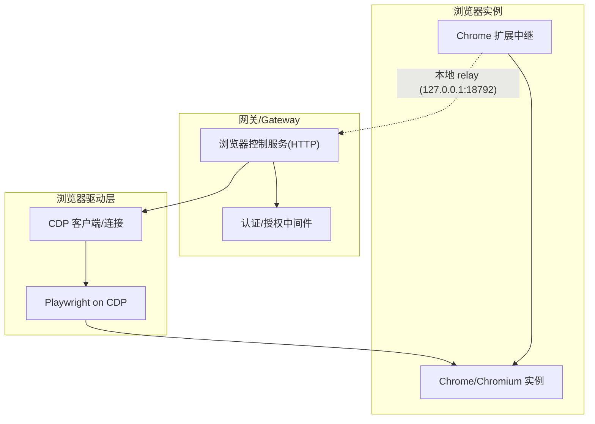
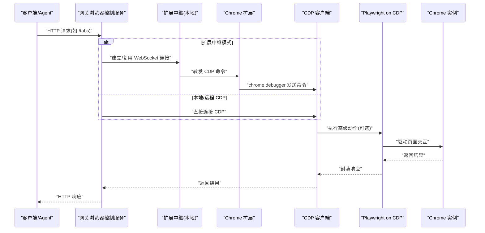
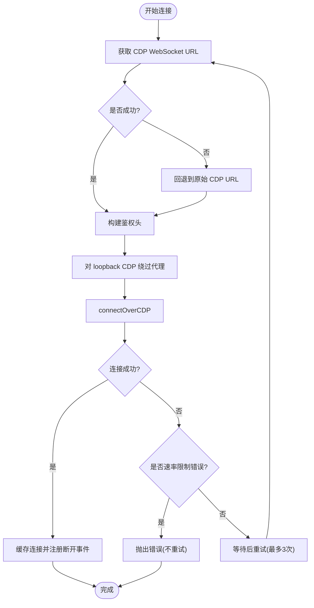
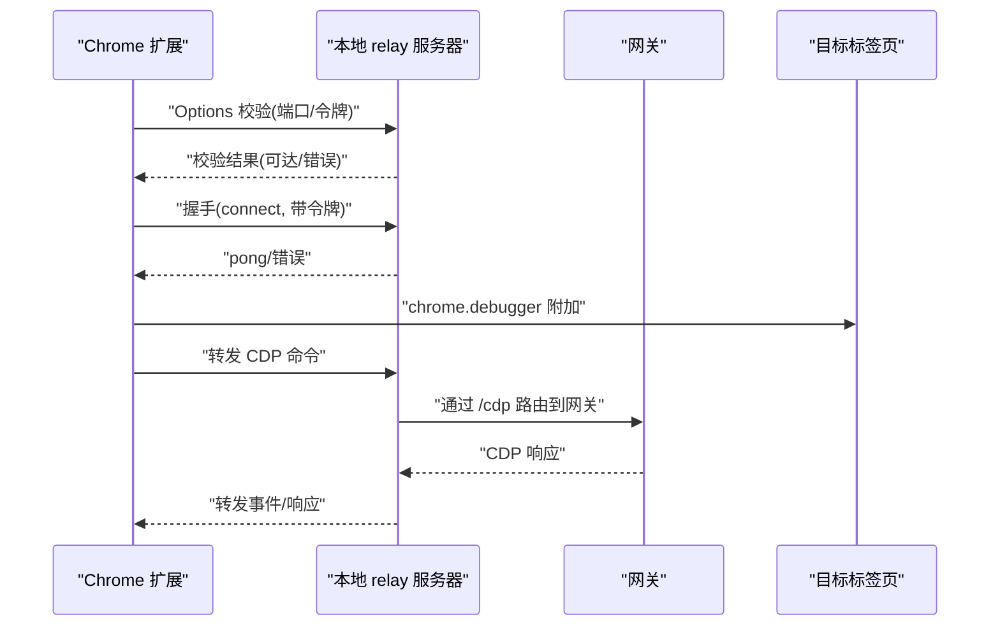
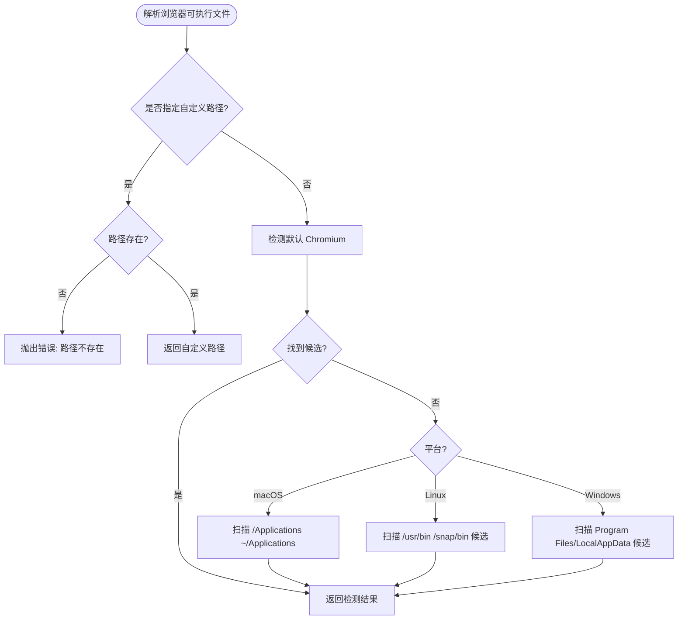
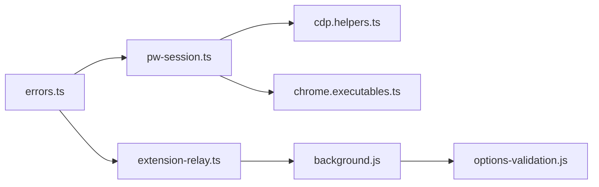

# 浏览器工具故障排除

<cite>
**本文档引用的文件**
- [browser-linux-troubleshooting.md](file://docs/tools/browser-linux-troubleshooting.md)
- [browser-wsl2-windows-remote-cdp-troubleshooting.md](file://docs/tools/browser-wsl2-windows-remote-cdp-troubleshooting.md)
- [browser.md](file://docs/tools/browser.md)
- [chrome-extension.md](file://docs/tools/chrome-extension.md)
- [pw-session.ts](file://src/browser/pw-session.ts)
- [extension-relay.ts](file://src/browser/extension-relay.ts)
- [cdp.helpers.ts](file://src/browser/cdp.helpers.ts)
- [chrome.executables.ts](file://src/browser/chrome.executables.ts)
- [errors.ts](file://src/browser/errors.ts)
- [background.js](file://assets/chrome-extension/background.js)
- [options-validation.js](file://assets/chrome-extension/options-validation.js)
- [README.md](file://assets/chrome-extension/README.md)
</cite>

## 目录
1. [简介](#简介)
2. [项目结构](#项目结构)
3. [核心组件](#核心组件)
4. [架构总览](#架构总览)
5. [详细组件分析](#详细组件分析)
6. [依赖关系分析](#依赖关系分析)
7. [性能考虑](#性能考虑)
8. [故障排除指南](#故障排除指南)
9. [结论](#结论)

## 简介
本指南面向使用 OpenClaw 浏览器工具系统的用户，聚焦于常见故障场景：Chrome 启动失败、CDP 连接问题、扩展程序异常、网页自动化失败等。内容覆盖浏览器可执行文件路径验证、CDP 调试端口检查、扩展程序连接状态诊断，以及浏览器配置验证、代理设置检查、安全策略调整等实用排障步骤，并包含 Linux 平台特殊问题与 Chrome 扩展程序的故障排除方法。

## 项目结构
OpenClaw 的浏览器工具由“浏览器控制服务 + CDP 驱动 + 可选扩展中继”构成：
- 浏览器控制服务：本地 loopback HTTP 接口，统一暴露浏览器操作（启动、标签页管理、截图、快照、导航、动作等）
- CDP 驱动：通过 Playwright on CDP 实现高级交互；支持本地/远程 CDP 端点
- 扩展中继：Chrome 扩展 + 本地 relay 服务器，将现有 Chrome 标签页接入 OpenClaw 控制面

图表来源
- [browser.md:10-30](file://docs/tools/browser.md#L10-L30)
- [extension-relay.ts:114-122](file://src/browser/extension-relay.ts#L114-L122)

章节来源
- [browser.md:10-30](file://docs/tools/browser.md#L10-L30)

## 核心组件
- 浏览器控制服务：提供 HTTP 接口，负责认证、路由、调用底层 CDP/Playwright
- CDP 辅助工具：URL 规范化、鉴权头注入、WebSocket URL 解析、代理绕过
- 扩展中继：本地 relay 服务器 + Chrome 扩展，实现对现有 Chrome 标签页的接管
- 可执行文件解析：跨平台自动检测浏览器可执行文件路径
- 错误类型：统一的浏览器相关错误类型与响应格式

章节来源
- [pw-session.ts:1-120](file://src/browser/pw-session.ts#L1-L120)
- [cdp.helpers.ts:36-69](file://src/browser/cdp.helpers.ts#L36-L69)
- [extension-relay.ts:114-122](file://src/browser/extension-relay.ts#L114-L122)
- [chrome.executables.ts:509-625](file://src/browser/chrome.executables.ts#L509-L625)
- [errors.ts:1-83](file://src/browser/errors.ts#L1-L83)

## 架构总览
浏览器工具的内部工作流如下：
- 网关启动时初始化浏览器控制服务，加载配置并安装认证中间件
- 客户端通过 HTTP 调用浏览器工具，网关根据配置选择本地或远程 CDP
- 对于扩展中继模式，Chrome 扩展通过本地 relay 将 CDP 消息转发到网关
- Playwright 在 CDP 基础上提供高级动作能力（点击、输入、截图、PDF 等）

图表来源
- [browser.md:418-430](file://docs/tools/browser.md#L418-L430)
- [extension-relay.ts:84-122](file://src/browser/extension-relay.ts#L84-L122)
- [pw-session.ts:343-382](file://src/browser/pw-session.ts#L343-L382)

## 详细组件分析

### 组件A：CDP 连接与重试机制
- 支持本地/远程 CDP，自动解析 WebSocket URL
- 连接失败时进行有限次重试，速率限制错误不重试
- 代理绕过：针对 loopback CDP 地址禁用系统代理，避免网络策略干扰

图表来源
- [pw-session.ts:343-382](file://src/browser/pw-session.ts#L343-L382)
- [cdp.helpers.ts:42-61](file://src/browser/cdp.helpers.ts#L42-L61)

章节来源
- [pw-session.ts:343-382](file://src/browser/pw-session.ts#L343-L382)
- [cdp.helpers.ts:42-61](file://src/browser/cdp.helpers.ts#L42-L61)

### 组件B：扩展中继与 Chrome 扩展
- 本地 relay 服务器监听 loopback 地址，默认端口为网关端口+3
- Chrome 扩展通过 Options 页面校验 relay 可达性与网关令牌
- 扩展图标状态指示连接状态：ON(已连接)、…(连接中)、!(未可达/未认证)
- 支持跨命名空间访问（WSL2/Windows）时设置 relayBindHost

图表来源
- [extension-relay.ts:114-122](file://src/browser/extension-relay.ts#L114-L122)
- [chrome-extension.md:56-91](file://docs/tools/chrome-extension.md#L56-L91)
- [README.md:1-24](file://assets/chrome-extension/README.md#L1-L24)

章节来源
- [extension-relay.ts:114-122](file://src/browser/extension-relay.ts#L114-L122)
- [chrome-extension.md:56-91](file://docs/tools/chrome-extension.md#L56-L91)
- [README.md:1-24](file://assets/chrome-extension/README.md#L1-L24)

### 组件C：浏览器可执行文件路径解析
- 跨平台自动检测：macOS/Linux/Windows 分别查找 Chrome/Brave/Edge/Chromium
- Linux 特别注意 snap 包的包装行为，优先使用非 snap 安装的浏览器
- 支持自定义 executablePath，不存在时抛出明确错误

图表来源
- [chrome.executables.ts:509-625](file://src/browser/chrome.executables.ts#L509-L625)

章节来源
- [chrome.executables.ts:509-625](file://src/browser/chrome.executables.ts#L509-L625)

## 依赖关系分析
- 浏览器控制服务依赖认证中间件与配置解析
- CDP 驱动依赖 Playwright（部分高级功能需要）
- 扩展中继依赖 Chrome 扩展与本地 relay 服务器
- 错误类型统一用于 HTTP 响应包装

图表来源
- [errors.ts:1-83](file://src/browser/errors.ts#L1-L83)
- [pw-session.ts:1-30](file://src/browser/pw-session.ts#L1-L30)
- [cdp.helpers.ts:1-20](file://src/browser/cdp.helpers.ts#L1-L20)
- [chrome.executables.ts:1-30](file://src/browser/chrome.executables.ts#L1-L30)
- [extension-relay.ts:1-12](file://src/browser/extension-relay.ts#L1-L12)
- [background.js:1-60](file://assets/chrome-extension/background.js#L1-L60)
- [options-validation.js:1-80](file://assets/chrome-extension/options-validation.js#L1-L80)

章节来源
- [errors.ts:1-83](file://src/browser/errors.ts#L1-L83)
- [pw-session.ts:1-30](file://src/browser/pw-session.ts#L1-L30)
- [cdp.helpers.ts:1-20](file://src/browser/cdp.helpers.ts#L1-L20)
- [chrome.executables.ts:1-30](file://src/browser/chrome.executables.ts#L1-L30)
- [extension-relay.ts:1-12](file://src/browser/extension-relay.ts#L1-L12)
- [background.js:1-60](file://assets/chrome-extension/background.js#L1-L60)
- [options-validation.js:1-80](file://assets/chrome-extension/options-validation.js#L1-L80)

## 性能考虑
- 远程 CDP 连接超时与握手超时可配置，避免长时间阻塞
- 本地/远程 CDP 端口分配遵循固定规则，便于排查
- 扩展中继仅在 loopback 默认运行，减少网络暴露面
- Playwright 作为可选增强，缺失时仍可使用基础功能

[本节为通用指导，无需特定文件来源]

## 故障排除指南

### 一、Chrome 启动失败
- 症状：Linux 上 snap 包导致无法正常启动或监控进程
- 解决方案：
  - 使用官方 Google Chrome 或 Brave/Edge/Chromium 的非 snap 安装包
  - 在配置中显式设置 executablePath 指向真实浏览器二进制
  - Linux 下优先使用非 snap 安装的浏览器以避免 AppArmor 限制

章节来源
- [browser-linux-troubleshooting.md:17-38](file://docs/tools/browser-linux-troubleshooting.md#L17-L38)
- [chrome.executables.ts:509-625](file://src/browser/chrome.executables.ts#L509-L625)

### 二、CDP 连接问题
- 症状：连接超时、速率限制、远程端点不可达
- 排查步骤：
  - 验证 CDP 端口与地址（本地/远程），确保防火墙放行
  - 对于远程 CDP，使用 curl 验证 /json/version 与 /json/list
  - 检查鉴权头是否正确注入（Basic Auth 或扩展中继令牌）
  - 避免在 loopback CDP 上使用系统代理，必要时启用代理绕过
  - 注意速率限制错误不重试，需等待或调整策略

章节来源
- [browser-wsl2-windows-remote-cdp-troubleshooting.md:79-121](file://docs/tools/browser-wsl2-windows-remote-cdp-troubleshooting.md#L79-L121)
- [cdp.helpers.ts:42-61](file://src/browser/cdp.helpers.ts#L42-L61)
- [pw-session.ts:343-382](file://src/browser/pw-session.ts#L343-L382)

### 三、扩展程序异常
- 症状：扩展图标显示“!”、无法连接 relay、Options 校验失败
- 排查步骤：
  - 确认网关运行且 relay 可达（默认端口为网关端口+3）
  - 在扩展 Options 中设置正确的 relay 端口与网关令牌
  - 若跨命名空间（WSL2/Windows），在网关配置中设置 relayBindHost
  - 验证扩展已“固定”，并点击图标进行附着/分离
  - 若出现“扩展未连接”，等待重连或手动重新附着

章节来源
- [chrome-extension.md:105-115](file://docs/tools/chrome-extension.md#L105-L115)
- [README.md:1-24](file://assets/chrome-extension/README.md#L1-L24)
- [options-validation.js:1-80](file://assets/chrome-extension/options-validation.js#L1-L80)
- [extension-relay.ts:114-122](file://src/browser/extension-relay.ts#L114-L122)

### 四、网页自动化失败
- 症状：点击/输入无效、元素不可见、严格模式冲突
- 排查步骤：
  - 先执行 snapshot 获取稳定引用（role refs 或 numeric refs）
  - 使用 click/typing 等动作前，先执行 wait（URL/加载状态/JS 断言/可见性）
  - 如页面行为异常，清理错误与请求日志，记录 trace 复现
  - 对于 iframe 内容，使用 frame 限定作用域

章节来源
- [browser.md:577-591](file://docs/tools/browser.md#L577-L591)
- [pw-session.ts:1-120](file://src/browser/pw-session.ts#L1-L120)

### 五、浏览器配置验证
- executablePath 是否指向真实存在的可执行文件
- headless/noSandbox/headless 参数是否符合当前环境
- attachOnly 是否与实际部署模式一致（本地启动 vs 外部浏览器）
- 多个 profile 的 cdpUrl/cdpPort 是否正确且不冲突

章节来源
- [browser.md:54-103](file://docs/tools/browser.md#L54-L103)
- [chrome.executables.ts:599-625](file://src/browser/chrome.executables.ts#L599-L625)

### 六、代理设置检查
- 本地 loopback CDP 连接应绕过系统代理，避免被企业代理拦截
- 远程 CDP 端点若需代理，需确保代理配置正确且允许 loopback

章节来源
- [cdp.helpers.ts:42-61](file://src/browser/cdp.helpers.ts#L42-L61)
- [pw-session.ts:343-382](file://src/browser/pw-session.ts#L343-L382)

### 七、安全策略调整
- 默认信任私有网络访问，如需严格模式请显式关闭并配置 allowlist
- 导航前与最终 URL 后均进行 SSRF 检查，避免重定向绕过
- 保持网关与节点主机在私有网络内，避免暴露 relay 端口

章节来源
- [browser.md:647-654](file://docs/tools/browser.md#L647-L654)
- [docs/gateway/security/index.md:997-1019](file://docs/gateway/security/index.md#L997-L1019)

### 八、Linux 平台特殊问题
- snap 包包装器不会启动真实浏览器，必须改用非 snap 安装
- 可使用 attach-only 模式手动启动 Chromium 并指定 userDataDir
- 提供 systemd 用户服务示例以便开机自启

章节来源
- [browser-linux-troubleshooting.md:17-96](file://docs/tools/browser-linux-troubleshooting.md#L17-L96)

### 九、WSL2 + Windows 远程 CDP
- 分层验证：先在 Windows 本地验证 CDP，再从 WSL2 验证可达性
- 正确配置浏览器 profile 的 cdpUrl，使用 WSL2 可达的地址
- 控制 UI 必须使用 http://127.0.0.1:PORT（避免不安全来源）
- 跨命名空间时设置 relayBindHost，但保持网络私密与认证

章节来源
- [browser-wsl2-windows-remote-cdp-troubleshooting.md:79-208](file://docs/tools/browser-wsl2-windows-remote-cdp-troubleshooting.md#L79-L208)

### 十、错误类型与响应
- 统一的错误类型用于区分 4xx/5xx 场景（配置错误、目标不存在、冲突、资源耗尽等）
- SSRF/导航 URL 非法等特定错误映射到明确的 HTTP 状态码

章节来源
- [errors.ts:1-83](file://src/browser/errors.ts#L1-L83)

## 结论
通过分层验证（浏览器可执行文件、CDP 端点、扩展中继、安全策略）与工具化诊断（curl 验证、Options 校验、trace 记录），大多数浏览器工具相关问题可在短时间内定位并修复。建议在生产环境中优先使用专用 profile、严格的 SSRF 策略与私有网络访问，并在跨主机部署时谨慎开放 relay 绑定地址。